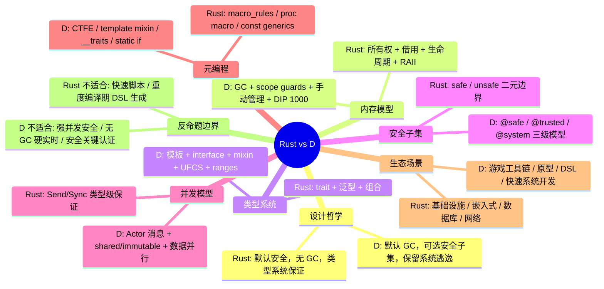

> **内容分级**: [对比级]
> **定理链**: N/A — 描述性/综述性/导航性文档，不涉及形式化定理链
>

# Rust vs D：所有权类型系统与可选 GC 系统语言的工程对比
>
> **EN**: Rust vs D
> **Summary**: Comparative analysis of Rust and D across memory management, type systems, safety subsets, compile-time metaprogramming, concurrency models, and ecosystems.
> **Rust 版本**: 1.97.0+ (Edition 2024)
> **受众**: [进阶]
> **Bloom 层级**: L5
> **权威来源**: 本文件为 `concept/` 权威页。
> **定位**: 对比分析 **Rust** 与 **D** 在系统编程、应用编程与元编程中的设计哲学、实现机制与适用边界；通用编程范式对比详见 [Paradigm Matrix](../00_paradigms/01_paradigm_matrix.md)。
> **前置概念**: [Unsafe Rust](../../03_advanced/02_unsafe/01_unsafe.md) · [Traits](../../02_intermediate/00_traits/01_traits.md) · [Metaprogramming](../../03_advanced/03_proc_macros/01_macros.md)
> **后置概念**: [Paradigm Matrix](../00_paradigms/01_paradigm_matrix.md)
> **主要来源**: [The D Programming Language](https://dlang.org/) · [D Language Reference](https://dlang.org/spec/spec.html) · [DConf Online](https://dconf.org/) · [Rust Reference](https://doc.rust-lang.org/reference/introduction.html) · [The Rust Programming Language](https://doc.rust-lang.org/book/title-page.html) · [Rustonomicon](https://doc.rust-lang.org/nomicon/index.html)
>
> **来源**: [Rust Reference](https://doc.rust-lang.org/reference/introduction.html) · [The Rust Programming Language](https://doc.rust-lang.org/book/title-page.html) · [Rustonomicon](https://doc.rust-lang.org/nomicon/index.html) · [D Language Reference](https://dlang.org/spec/spec.html) · [Programming in D](https://ddili.org/ders/d.en/)
---

> **变更日志**:
>
> - v1.0 (2026-07-16): 初始版本；完成设计哲学、内存模型、类型系统、安全子集、并发模型、元编程、生态场景、反命题边界与权威来源索引。

---

## 📑 目录

- [Rust vs D：所有权类型系统与可选 GC 系统语言的工程对比](#rust-vs-d所有权类型系统与可选-gc-系统语言的工程对比)
  - [📑 目录](#-目录)
  - [一、概述](#一概述)
    - [1.1 两种系统语言的设计坐标](#11-两种系统语言的设计坐标)
    - [1.2 核心命题](#12-核心命题)
    - [1.3 认知路径](#13-认知路径)
  - [二、核心维度对比](#二核心维度对比)
    - [2.1 综合对比矩阵](#21-综合对比矩阵)
  - [三、内存模型](#三内存模型)
    - [3.1 Rust：所有权驱动的无 GC 模型](#31-rust所有权驱动的无-gc-模型)
    - [3.2 D：GC 为主、可选控制的内存模型](#32-dgc-为主可选控制的内存模型)
    - [3.3 借用检查：Rust 原生 vs D DIP 1000](#33-借用检查rust-原生-vs-d-dip-1000)
  - [四、类型系统](#四类型系统)
    - [4.1 Rust：Trait 驱动的结构化多态](#41-rusttrait-驱动的结构化多态)
    - [4.2 D：模板、接口与混入的组合多态](#42-d模板接口与混入的组合多态)
    - [4.3 对比：Traits vs 模板+接口](#43-对比traits-vs-模板接口)
  - [五、安全子集](#五安全子集)
    - [5.1 Rust：`safe` / `unsafe` 二元边界](#51-rustsafe--unsafe-二元边界)
    - [5.2 D：`@safe` / `@trusted` / `@system` 三级模型](#52-dsafe--trusted--system-三级模型)
    - [5.3 安全子集对比](#53-安全子集对比)
  - [六、并发模型](#六并发模型)
    - [6.1 Rust：`Send` / `Sync` 类型级并发安全](#61-rustsend--sync-类型级并发安全)
    - [6.2 D：消息传递、共享不可变与显式并行](#62-d消息传递共享不可变与显式并行)
    - [6.3 并发模型对比](#63-并发模型对比)
  - [七、元编程](#七元编程)
    - [7.1 Rust：宏、过程宏与 const 泛型](#71-rust宏过程宏与-const-泛型)
    - [7.2 D：CTFE、模板与 Mixin](#72-dctfe模板与-mixin)
    - [7.3 元编程对比](#73-元编程对比)
  - [八、生态与适用场景](#八生态与适用场景)
    - [8.1 生态系统](#81-生态系统)
    - [8.2 适用场景](#82-适用场景)
    - [8.3 不要重复造轮子的边界](#83-不要重复造轮子的边界)
  - [九、反命题/边界](#九反命题边界)
    - [9.1 Rust 不适合直接替代 D 的场景](#91-rust-不适合直接替代-d-的场景)
    - [9.2 D 不适合直接替代 Rust 的场景](#92-d-不适合直接替代-rust-的场景)
    - [9.3 常见误区](#93-常见误区)
  - [十、来源与延伸阅读](#十来源与延伸阅读)
    - [10.1 Rust 权威来源](#101-rust-权威来源)
    - [10.2 D 权威来源](#102-d-权威来源)
    - [10.3 对比与演进阅读](#103-对比与演进阅读)
  - [🧭 思维导图（Mindmap）](#-思维导图mindmap)

---

## 一、概述

### 1.1 两种系统语言的设计坐标

Rust 与 D 都自称“系统编程语言”，但二者的设计起点与安全假设截然不同：

- **Rust** 由 Mozilla Research 于 2010 年启动，核心目标是“在不依赖垃圾回收的前提下保证内存安全与并发安全”。它通过**所有权（Ownership）**、**借用（Borrowing）**和**生命周期（Lifetime）**将内存安全与数据竞争自由编码进类型系统，将传统 C/C++ 中运行时才能暴露的悬垂指针、重复释放、数据竞争等问题提前到编译期拒绝。
- **D** 由 Walter Bright 于 1999 年开始设计、2001 年首次发布，定位为“C++ 的更好替代”。它保留 C 的系统级能力（裸指针、`@system` 代码），默认使用**垃圾回收（GC）**简化内存管理，同时提供 `scope`、借用检查（DIP 1000）、`@safe`/`@trusted`/`@system` 三级安全属性，允许开发者在开发效率与底层控制之间渐进切换。

> **来源**: [D Language Reference — Introduction](https://dlang.org/spec/intro.html) · [TRPL — What is Ownership?](https://doc.rust-lang.org/book/ch04-01-what-is-ownership.html)

### 1.2 核心命题

| **维度** | **Rust** | **D** |
|:---|:---|:---|
| **设计起点** | 默认无 GC，用类型系统消除整类内存与并发错误 | 默认 GC，保留系统级逃逸舱口，按属性子集控制安全 |
| **内存管理** | 编译期所有权 + RAII；可选引用计数、 arenas、全局分配器 | GC 为主；`scope`、栈分配、手动 `malloc`/`free`、`std.experimental.allocator` 为可选 |
| **安全保证单元** | `safe` Rust 子集在编译期排除 UB 与数据竞争 | `@safe` 子集在编译期排除未定义行为；`@trusted` 允许人工封装 unsafe；`@system` 无保证 |
| **类型抽象** | `trait` + 泛型 + `impl`；无继承，基于组合 | 模板（templates）+ `interface` + 混入（mixins）+ UFCS + ranges |
| **元编程** | 声明宏 + 过程宏 + `const generics` + `const fn` | CTFE + 模板 + `mixin` + `__traits` + `static if`/`static foreach` |
| **并发抽象** | OS 线程 / async + `Send`/`Sync` | `std.concurrency` 基于 Actor 的消息传递 + `std.parallelism` + `shared`/`immutable` |

### 1.3 认知路径

```text
为什么对比 Rust 与 D?
    └── 两者都面向系统级控制，但对“默认假设”做出相反选择
        └── Rust: 默认无 GC，安全由类型系统保证，unsafe 需显式标注
            └── D: 默认 GC，安全由 @safe 子集保证，@system 为默认/逃逸口
                └── 内存模型：所有权唯一性 vs GC + 可选 scope/借用
                    └── 类型系统：trait 组合 vs 模板 + UFCS + ranges
                        └── 安全子集：safe/unsafe 边界 vs @safe/@trusted/@system
                            └── 并发：Send/Sync vs Actor 消息 + shared/immutable
                                └── 元编程：宏/const 泛型 vs CTFE/mixin/template
                                    └── 适用边界：长期基础设施 vs 快速系统原型/游戏工具链
```

---

## 二、核心维度对比

### 2.1 综合对比矩阵

| **维度** | **Rust** | **D** | **判定说明** |
|:---|:---|:---|:---|
| **默认内存管理** | 所有权 + RAII，无 GC | 追踪式 GC | Rust 无 GC 开销；D 开发效率更高但引入 GC 暂停与内存占用 |
| **手动内存管理** | `unsafe` + 裸指针/分配器 | `@system` + `malloc`/`free`/`GC.free` | 两者都允许，但都脱离安全保证 |
| **作用域资源管理** | `Drop` + 借用规则 | `scope(exit)`/`scope(success)`/`scope(failure)` + RAII | D 的 scope guards 表达力更细粒度；Rust 的所有权更系统 |
| **空指针安全** | `Option<T>` 强制处理 | 默认 `null` 存在；`@safe` 禁止解引用 `null` | Rust 在类型层面消除；D 依赖运行时空值检查与 `@safe` |
| **数据竞争自由** | safe Rust 编译期保证 data-race free | 无全局保证；`immutable`/`shared` + 消息传递避免 | Rust 是语言级保证；D 依赖约定与类型辅助 |
| **泛型/多态** | `trait` + 泛型单态化 | 模板 + `interface` + CTFE | D 模板更灵活但错误信息 notoriously 差；Rust trait 更结构化 |
| **编译期计算** | `const fn` + `const generics` | CTFE + 模板 + `mixin` | D CTFE 能力更成熟且与运行时语法统一；Rust const 能力持续扩展 |
| **代码生成/元编程** | 声明宏 + 过程宏 | `mixin` + `__traits` + 模板混入 | D 元编程更内建；Rust 宏更卫生、更可控 |
| **函数式抽象** | `Iterator` + 闭包 + 方法链 | Ranges + UFCS + 惰性求值 | D ranges 受 Alexandrescu 推动，生态更成熟 |
| **安全子集** | `safe` Rust（默认）/ `unsafe` Rust（显式） | `@safe` / `@trusted` / `@system` | Rust 默认安全；D 默认 `@system`，需显式 `@safe` |
| **互操作** | FFI + `unsafe` | `extern(C)` + `@system` | 两者在边界处都需放弃安全保证 |
| **包管理** | Cargo + crates.io | Dub + D package registry | Rust 生态规模与工具成熟度更高 |
| **典型场景** | 操作系统、数据库、网络基础设施、嵌入式 | 游戏引擎工具链、快速系统原型、数据/脚本系统 | Rust 偏基础设施；D 偏快速交付与工具 |

> **来源**: [Rust Reference — Unsafe Rust](https://doc.rust-lang.org/reference/unsafe-blocks.html) · [D Language Reference — Function Safety](https://dlang.org/spec/function.html#safe-functions) · [D Language Reference — Memory Safety](https://dlang.org/spec/memory-safe-d.html)
>
> 从形式化语义角度理解两种语言的类型规则与求值策略，可参考 [Operational Semantics](../../04_formal/03_operational_semantics/03_operational_semantics.md)。

---

## 三、内存模型

### 3.1 Rust：所有权驱动的无 GC 模型

Rust 的内存安全建立在三项核心规则之上：

1. **唯一所有权**：任一时刻每个值有且仅有一个所有者；所有者离开作用域时自动调用 `Drop`。
2. **借用规则**：对同一数据，要么存在一个可变引用，要么存在多个不可变引用，不可同时存在。
3. **生命周期参数化**：编译器通过显式或推断的生命周期确保引用不会比被引用数据活得更长。

```rust
// Rust: 所有权在编译期决定资源何时释放
fn main() {
    let s = String::from("hello"); // s 拥有堆内存
    takes_ownership(s);             // s 被 move，原变量失效
    // println!("{}", s);           // 编译错误：value borrowed after move

    let x = 5;
    makes_copy(x);                  // i32 实现 Copy，保留原值
    println!("x = {}", x);          // OK
}

fn takes_ownership(s: String) {
    println!("{}", s);
} // s 在此 Drop

fn makes_copy(i: i32) {
    println!("{}", i);
}
```

对于需要共享所有权的场景，Rust 提供 `Rc<T>`、`Arc<T>`、 arenas、以及第三方 allocator crate；裸指针与堆分配器仅在 `unsafe` 块中可操作。

> **来源**: [TRPL — Ownership](https://doc.rust-lang.org/book/ch04-00-understanding-ownership.html) · [Rustonomicon — Ownership](https://doc.rust-lang.org/nomicon/ownership.html)

### 3.2 D：GC 为主、可选控制的内存模型

D 默认使用垃圾回收，几乎所有 `new` 表达式返回的引用都由 GC 管理：

```d
// D: 默认 GC 分配
import std.stdio;

void main() {
    auto arr = new int[100];   // GC 管理
    arr[0] = 42;
    writeln(arr[0]);
} // arr 由 GC 最终回收，无确定析构时机
```

D 同时提供多种非 GC 或确定性释放机制：

- **`scope` 守卫**：`scope(exit)`、`scope(success)`、`scope(failure)` 在作用域退出时执行清理，无需显式 `try/finally`。
- **栈分配**：值类型与 `scope` 类对象可分配在栈上（`scope` 类在最新编译器中仍可用，但更推荐值语义与 `std.typecons`）。
- **`std.experimental.allocator`**：模块化分配器接口，可替换 GC。
- **手动管理**：`malloc`/`free`、`GC.malloc`/`GC.free` 等 `@system` 操作。

```d
// D: scope 守卫实现确定性清理
import core.memory : GC;
import std.stdio;

void main() {
    auto p = cast(int*) GC.malloc(int.sizeof);
    scope(exit) GC.free(p);    // 无论是否异常都会执行
    *p = 42;
    writeln(*p);
}
```

### 3.3 借用检查：Rust 原生 vs D DIP 1000

Rust 的借用检查是语言核心。D 通过 **DIP 1000（Scoped Pointers）** 在 `@safe` 代码中限制指针生命周期，但覆盖范围与严格程度不及 Rust：

```rust
// Rust: 编译期拒绝悬垂引用
fn main() {
    let r;
    {
        let x = 5;
        r = &x; // 错误：x 的生命周期不足以活到 r 使用
    }
    // println!("{}", r);
}
```

```d
// D: @safe 下的 scope 指针限制（DIP 1000）
@safe void demo() {
    int* p;
    {
        int x = 5;
        p = &x; // @safe 下错误：无法将栈地址赋给更长生命周期的指针
    }
}
```

Rust 的生命周期参数化适用于所有引用与泛型；D 的 scope 规则主要作用于 `@safe` 代码中的指针与切片，且需要编译器版本支持 `-preview=dip1000`。

> **来源**: [D Language Reference — DIP 1000](https://dlang.org/spec/memory-safe-d.html) · [Rust Reference — Lifetimes](https://doc.rust-lang.org/reference/lifetime-elision.html)

---

## 四、类型系统

### 4.1 Rust：Trait 驱动的结构化多态

Rust 没有继承，多态通过 `trait` 与泛型实现。Trait 定义接口，`impl` 提供实现，泛型单态化生成具体代码：

```rust
// Rust: trait + 泛型 + impl
trait Drawable {
    fn draw(&self);
}

struct Circle { radius: f64 }

impl Drawable for Circle {
    fn draw(&self) {
        println!("circle r={}", self.radius);
    }
}

fn render<T: Drawable>(item: &T) {
    item.draw();
}

fn main() {
    let c = Circle { radius: 1.0 };
    render(&c);
}
```

Trait 支持关联类型、泛型参数、默认实现、特化（unstable）与 `dyn Trait` 动态分发。这种设计强制“组合优于继承”，但偶尔需要 `where` 子句表达复杂约束。

> **来源**: [TRPL — Traits](https://doc.rust-lang.org/book/ch10-02-traits.html) · [Rust Reference — Traits](https://doc.rust-lang.org/reference/items/traits.html)

### 4.2 D：模板、接口与混入的组合多态

D 的类型系统继承 C++ 的模板传统，并加入 `interface`、`mixin`、`alias this`、`UFCS` 等机制：

```d
// D: 模板 + interface + mixin
import std.stdio;

interface Drawable {
    void draw();
}

struct Circle {
    double radius;
    void draw() { writeln("circle r=", radius); }
}

void render(T)(T item) if (is(typeof(T.init.draw))) {
    item.draw();
}

mixin template Position() {
    int x, y;
}

struct Sprite {
    mixin Position;
}

void main() {
    Circle c = Circle(1.0);
    render(c);

    Sprite s;
    s.x = 10;   // mixin 注入的字段
    writeln(s.x);
}
```

- **模板（Templates）**：D 模板是图灵完备的，可在编译期进行复杂计算与代码生成；但过度使用会导致编译时间变长与错误信息冗长。
- **UFCS（Uniform Function Call Syntax）**：允许将 `f(x)` 写成 `x.f()`，使 ranges 与方法链一致。
- **Ranges**：D 的惰性序列抽象，受 Andrei Alexandrescu 推动，是标准库的核心组件。
- **Mixins**：字符串 mixin 与模板 mixin 允许在编译期注入代码，是 D 元编程的杀手锏，但也增加代码理解难度。

> **来源**: [D Language Reference — Templates](https://dlang.org/spec/template.html) · [D Language Reference — Mixins](https://dlang.org/spec/template-mixin.html) · [On Iteration — Andrei Alexandrescu](https://www.informit.com/articles/article.aspx?p=1407357)

### 4.3 对比：Traits vs 模板+接口

| **特性** | **Rust traits** | **D templates / interfaces** |
|:---|:---|:---|
| **接口契约** | 显式 `trait` + `impl` | `interface` 显式实现；模板约束多通过 `static if`/`__traits` |
| **类型推断** | 基于 trait bound 推断 | 基于模板实例化与 `auto`/`typeof` |
| **代码膨胀** | 泛型单态化，可能膨胀 | 模板同样单态化，膨胀风险类似 |
| **错误信息** | 通常结构化且指向 trait bound | 模板实例化深度报错 notoriously 难读 |
| **动态分发** | `dyn Trait` + 对象安全规则 | `interface` 引用天然动态 |
| **默认实现** | trait 支持默认方法 | `interface` 支持默认实现 |

---

## 五、安全子集

### 5.1 Rust：`safe` / `unsafe` 二元边界

Rust 将程序划分为 `safe` Rust 与 `unsafe` Rust：

- **safe Rust**：默认模式，编译器保证无数据竞争、无悬垂指针、无 use-after-free、无缓冲区溢出等。
- **unsafe Rust**：通过 `unsafe fn`、`unsafe` 块、`unsafe impl` 显式开启，可执行解引用裸指针、调用 FFI、修改可变静态量、使用 `union` 字段等操作；这些操作的安全责任由程序员承担。

```rust
// Rust: unsafe 用于裸指针与 FFI
unsafe fn raw_access(p: *mut i32) {
    *p += 1;
}

fn main() {
    let mut x = 5;
    unsafe { raw_access(&mut x); }
    println!("x = {}", x);
}
```

Rust 的安全保证是“全有或全无”：一旦进入 `unsafe` 块，所有保证都交给程序员；safe Rust 无法直接调用 unsafe 函数，除非再包一层 `unsafe` 块。

> **来源**: [Rust Reference — Unsafe Rust](https://doc.rust-lang.org/reference/unsafe-blocks.html) · [Rustonomicon — The Safe/Unsafe Interface](https://doc.rust-lang.org/nomicon/safe-unsafe-meaning.html)

### 5.2 D：`@safe` / `@trusted` / `@system` 三级模型

D 采用三级安全属性：

- **`@system`**：默认属性。允许任意指针运算、类型双关、手动内存管理，编译器不做额外安全检查。
- **`@safe`**：禁止未定义行为。不能解引用裸指针、不能进行指针算术、不能类型双关、不能调用 `@system` 函数（除非被 `@trusted` 封装）。
- **`@trusted`**：函数体可包含 `@system` 操作，但对外接口必须由程序员保证安全。它是连接 `@safe` 世界与底层代码的“信任边界”。

```d
// D: @safe / @trusted / @system
import std.stdio;

@system void raw(int* p) {
    *p = 42;          // @system: 允许裸指针解引用
}

@trusted void trustedWrapper(ref int x) {
    raw(&x);          // 程序员保证 &x 是有效引用
}

@safe void safeUser() {
    int x;
    trustedWrapper(x);
    writeln(x);       // 输出 42
    // raw(&x);       // 错误：@safe 不能调用 @system
}

void main() {
    safeUser();
}
```

与 Rust 相比，D 的 `@safe` 是“可选子集”：D 代码默认是 `@system`，开发者需显式选择安全级别；Rust 则默认安全，开发者需显式进入 `unsafe`。

### 5.3 安全子集对比

| **特性** | **Rust safe/unsafe** | **D @safe/@trusted/@system** |
|:---|:---|:---|
| **默认模式** | safe（强制） | `@system`（自由但无保证） |
| **进入低层代码** | `unsafe` 块/函数/impl | `@system` 函数或在 `@trusted` 中调用 `@system` |
| **编译期保证** | safe Rust 无 UB、无数据竞争 | `@safe` 无特定未定义行为 |
| **边界封装** | 用 safe wrapper 包裹 unsafe | 用 `@trusted` 封装 `@system` |
| **调用限制** | safe 不能调用 unsafe 除非包 unsafe 块 | `@safe` 不能直接调用 `@system`，除非经 `@trusted` |
| **典型使用场景** | 系统库、FFI、底层抽象 | 游戏引擎底层、C 互操作、脚本绑定 |

> **来源**: [D Language Reference — Function Safety](https://dlang.org/spec/function.html#safe-functions) · [D Language Reference — Memory Safety in D](https://dlang.org/spec/memory-safe-d.html)

---

## 六、并发模型

### 6.1 Rust：`Send` / `Sync` 类型级并发安全

Rust 的并发安全不依赖特定运行时模型，而是通过两个 marker trait 刻画类型在线程间移动与共享的安全性：

- **`Send`**：类型可以安全地在线程间转移所有权。
- **`Sync`**：类型可以安全地被多个线程同时引用（即 `&T: Send`）。

safe Rust 保证：只要程序使用标准库线程或 async 运行时，并且不手写 `unsafe impl Send/Sync`，就不会出现数据竞争。

```rust
use std::sync::{Arc, Mutex};
use std::thread;

fn main() {
    let data = Arc::new(Mutex::new(0));
    let mut handles = vec![];

    for _ in 0..10 {
        let d = Arc::clone(&data);
        handles.push(thread::spawn(move || {
            let mut n = d.lock().unwrap();
            *n += 1;
        }));
    }

    for h in handles { h.join().unwrap(); }
    println!("{}", *data.lock().unwrap());
}
```

Rust 的 async/await 同样依赖 `Send`/`Sync` 与 `Pin` 来保证跨 await 点的安全。

> **来源**: [TRPL — Concurrency](https://doc.rust-lang.org/book/ch16-00-concurrency.html) · [Rust Reference — Send and Sync](https://doc.rust-lang.org/reference/special-types-and-traits.html)

### 6.2 D：消息传递、共享不可变与显式并行

D 的并发模型更接近传统多线程语言，没有全局的“数据竞争自由”保证：

- **`std.concurrency`**：基于 Actor 模型的消息传递，`spawn` 创建线程，`send`/`receive` 通信。
- **`std.parallelism`**：数据并行（`parallel`/`taskPool`）。
- **`immutable` 与 `shared`**：`immutable` 数据可安全共享；`shared` 表示可能被多个线程访问，需显式同步。
- **`synchronized` 类**：类似 Java 的 Monitor，方法自动加锁。

```d
// D: 基于消息传递的并发
import std.concurrency;
import std.stdio;

void worker(Tid owner) {
    owner.send(42);
}

void main() {
    auto tid = spawn(&worker, thisTid);
    auto value = receiveOnly!int();
    writeln(value);
}
```

D 不保证 `@safe` 代码无数据竞争；它通过 `immutable`/`shared` 类型和消息传递提供工具，但开发者仍需显式管理共享状态。

> **来源**: [D Language Reference — Concurrency](https://dlang.org/spec/concurrency.html) · [std.concurrency — DDoc](https://dlang.org/phobos/std_concurrency.html)

### 6.3 并发模型对比

| **特性** | **Rust** | **D** |
|:---|:---|:---|
| **核心机制** | `Send`/`Sync` + 线程/async | 消息传递 + `shared`/`immutable` + 数据并行 |
| **数据竞争自由** | safe Rust 编译期保证 | 无全局保证 |
| **共享可变状态** | 通过 `Mutex<T>`、`RwLock<T>` 等显式同步 | 通过 `synchronized` 类、信号量、手动锁 |
| **消息传递** | `std::sync::mpsc` / `tokio::sync` | `std.concurrency` 原生支持 |
| **并行计算** | rayon、async 任务池 | `std.parallelism` |
| **典型错误** | 编译期拒绝非 Send/Sync 跨线程 | 运行时数据竞争、死锁需额外审查 |

---

## 七、元编程

### 7.1 Rust：宏、过程宏与 const 泛型

Rust 的元编程体系分为三层：

1. **声明宏（Declarative Macros）**：`macro_rules!`，基于模式匹配生成代码。
2. **过程宏（Procedural Macros）**：在编译期操作 TokenStream，包括派生宏、属性宏、函数式宏。
3. **Const 泛型与 `const fn`**：编译期计算与类型级数值编程。

```rust
// Rust: 声明宏示例
macro_rules! say_hello {
    ($name:expr) => {
        println!("Hello, {}!", $name)
    };
}

fn main() {
    say_hello!("D");
}
```

```rust
// Rust: const 泛型
struct Array<T, const N: usize> {
    data: [T; N],
}

fn main() {
    let _a = Array::<i32, 8> { data: [0; 8] };
}
```

Rust 宏强调卫生性（hygiene）与显式：宏展开不会意外捕获外部标识符。

> **来源**: [Rust Reference — Macros](https://doc.rust-lang.org/reference/macros.html) · [TRPL — Macros](https://doc.rust-lang.org/book/ch19-06-macros.html)

### 7.2 D：CTFE、模板与 Mixin

D 的元编程更“内建”，几乎任何函数都可以在编译期执行（CTFE），模板与运行时语法统一：

```d
// D: CTFE 与模板
import std.stdio;

ulong factorial(ulong n) {
    if (n == 0) return 1;
    return n * factorial(n - 1);
}

enum x = factorial(5); // CTFE

void main() {
    writeln(x); // 120
}
```

```d
// D: mixin 动态生成代码
import std.stdio;

void main() {
    mixin("int a = 10;");
    mixin("a += 5;");
    writeln(a); // 15
}
```

- **CTFE**：编译期函数执行，可读取文件、解析数据、生成常量。
- **模板混入（Template Mixin）**：将代码注入到当前作用域，类似 Ruby mixin 但发生在编译期。
- **`__traits`**：内省类型、成员、属性，是编译期反射基础。
- **`static if` / `static foreach`**：编译期条件与循环，广泛用于泛型代码分支。

D 的元编程灵活性极高，但字符串 `mixin` 也引入“字符串拼接代码”风险，可读性与可维护性需要额外关注。

> **来源**: [D Language Reference — CTFE](https://dlang.org/spec/function.html#interpretation) · [D Language Reference — Mixins](https://dlang.org/spec/template-mixin.html) · [D Language Reference — Traits](https://dlang.org/spec/traits.html)

### 7.3 元编程对比

| **特性** | **Rust** | **D** |
|:---|:---|:---|
| **编译期计算** | `const fn` + `const generics`（持续增强） | CTFE：任意纯函数可在编译期执行 |
| **代码生成** | 声明宏 / 过程宏（操作 TokenStream） | `mixin` / 模板混入 / 字符串生成 |
| **类型内省** | 有限（`std::any::TypeId`、过程宏解析） | `__traits` 强大且内建 |
| **卫生性** | 强，宏不会意外捕获标识符 | `mixin` 字符串无卫生性；模板混入受作用域规则约束 |
| **学习曲线** | 过程宏需要 crate 与 AST 知识 | CTFE/模板/mixin 与运行时语法接近，但深度模板报错难读 |
| **编译时间** | 过程宏可能显著增加 | 大量 CTFE/模板实例化也会增加 |

---

## 八、生态与适用场景

### 8.1 生态系统

| **方面** | **Rust** | **D** |
|:---|:---|:---|
| **包管理** | Cargo：依赖解析、构建、测试、文档一体化 | Dub：功能类似但生态规模较小 |
| **标准库** | `std` + `core` + `alloc`，按 no_std 可裁剪 | Phobos 功能丰富，包含 ranges、并发、正则、JSON 等 |
| **编译器** | rustc + LLVM；cranelift 实验后端 | DMD（参考实现）+ LDC（LLVM）+ GDC（GCC） |
| **IDE/工具** | rust-analyzer、Clippy、rustfmt、miri 成熟 | DCD、serve-d、D-Scanner 等社区工具 |
| **生态规模** | crates.io 数十万包，活跃度高 | 包数量与社区规模显著小于 Rust |
| **工业应用** | 操作系统（Redleaf、Theseus）、浏览器引擎（Servo/Firefox 组件）、数据库、云原生 | 游戏工具链、脚本系统、数据分析、编译器原型 |

> **来源**: [crates.io](https://crates.io/) · [DUB Registry](https://code.dlang.org/) · [DMD Compiler](https://dlang.org/dmd.html)

### 8.2 适用场景

**选择 Rust 更合适的场景**：

- 长期运行、对内存安全与并发安全有强要求的系统软件（操作系统内核、数据库、网络服务）。
- 需要无 GC 运行时、嵌入式或实时约束的环境。
- 需要与大量 C/C++ 互操作但希望将 unsafe 边界最小化的项目。
- 依赖大规模开源生态与成熟工具链的团队。

**选择 D 更合适的场景**：

- 快速系统原型、内部工具、游戏引擎编辑器/工具链。
- 需要强大编译期代码生成与元编程的项目（代码生成器、DSL 嵌入）。
- 团队熟悉 C++ 模板与 GC 语言，希望渐进引入系统级控制。
- 对开发速度要求高于极致运行时控制的场景。

### 8.3 不要重复造轮子的边界

- 若项目目标是“写一个安全关键、长期维护、需要形式化证据的操作系统模块”，Rust 的借用检查与 Ferrocene 等认证工具链更成熟。
- 若项目目标是“一周内交付一个带 GC、模板化 DSL 的内部工具”，D 的元编程与默认 GC 能更快达成目标。

---

## 九、反命题/边界

### 9.1 Rust 不适合直接替代 D 的场景

1. **快速脚本化/工具链**：Rust 的严格借用检查与编译时间在快速迭代中可能成为摩擦。
2. **重度编译期 DSL 生成**：Rust 过程宏能力强大，但 D 的 CTFE + mixin 在“写一段在编译期解析并生成代码”的任务中更自然。
3. **默认 GC 的团队偏好**：若团队或框架明确要求 GC 简化内存管理，Rust 需要额外选择 allocator 或 `Rc<T>`/`Arc<T>`。

### 9.2 D 不适合直接替代 Rust 的场景

1. **强并发安全保证**：D 没有编译期 data-race free 保证，`shared`/`immutable` 依赖约定。
2. **无 GC 或硬实时约束**：D 默认 GC 可能引入暂停；虽然可禁用 GC，但会牺牲大量标准库功能。
3. **安全关键认证路径**：D 缺少 Ferrocene/DO-178C 等工业级认证工具链与先例。

### 9.3 常见误区

- **误区 1**：“D 的 `@safe` 和 Rust 的 safe 一样强。”
  - **正解**：`@safe` 防止特定未定义行为，但不保证数据竞争自由；Rust safe 同时覆盖内存安全与数据竞争自由。
- **误区 2**：“Rust 没有元编程能力。”
  - **正解**：Rust 的宏、const 泛型、过程宏能力强大，只是风格更受限、更强调卫生性。
- **误区 3**：“D 只是 C++ with GC。”
  - **正解**：D 在模块、数组切片、CTFE、ranges、UFCS、安全属性等方面有独立设计，远不止“加 GC 的 C++”。

---

## 十、来源与延伸阅读

### 10.1 Rust 权威来源

- [The Rust Reference](https://doc.rust-lang.org/reference/introduction.html)
- [The Rust Programming Language](https://doc.rust-lang.org/book/title-page.html)
- [The Rustonomicon](https://doc.rust-lang.org/nomicon/index.html)
- [Rust By Example](https://doc.rust-lang.org/rust-by-example/)
- [The Rust Unstable Book](https://doc.rust-lang.org/nightly/unstable-book/)

### 10.2 D 权威来源

- [D Language Reference](https://dlang.org/spec/spec.html)
- [Programming in D](https://ddili.org/ders/d.en/)
- [DConf Talks Archive](https://dconf.org/)
- [DUB Package Registry](https://code.dlang.org/)
- [DIP 1000 — Scoped Pointers](https://dlang.org/spec/memory-safe-d.html)

### 10.3 对比与演进阅读

- [Paradigm Matrix](../00_paradigms/01_paradigm_matrix.md)
- [Rust vs C++](01_rust_vs_cpp.md)
- [Rust vs Zig](06_rust_vs_zig.md)
- [Rust vs Go](03_rust_vs_go.md)

---

## 🧭 思维导图（Mindmap）



---

> **权威来源**: 本文件为 `concept/` 权威页。关于通用编程范式与更多语言对比，请参见 [Paradigm Matrix](../00_paradigms/01_paradigm_matrix.md)。
