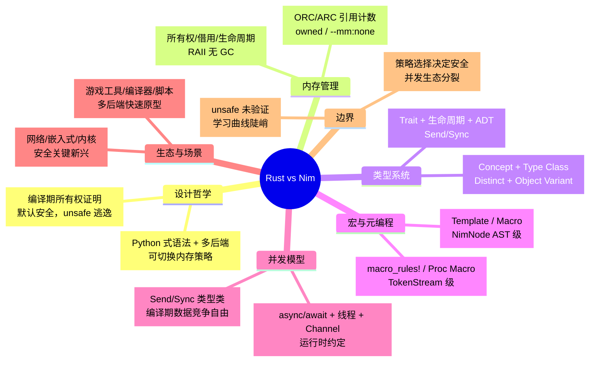

> **内容分级**: [综述级]
> **定理链**: N/A — 描述性/综述性/导航性文档，不涉及形式化定理链
>

# Rust vs Nim：所有权类型系统与 Python 式系统语言的工程对比
>
> **EN**: Rust vs Nim
> **Summary**: Comparative analysis of Rust and Nim across memory management, type systems, compile-time metaprogramming, concurrency, syntax ergonomics, and use cases.
> **Rust 版本**: 1.97.0+ (Edition 2024)
> **Bloom 层级**: L5
> **权威来源**: 本文件为 `concept/` 权威页。
> **受众**: [进阶]
> **定位**: 对比分析 **Rust** 与 **Nim** 在系统编程与脚本式系统语言之间的设计取舍；通用多语言范式坐标详见 [`Paradigm Matrix`](../00_paradigms/01_paradigm_matrix.md)。
> **前置概念**: [Memory Management](../../02_intermediate/02_memory_management/01_memory_management.md) · [Traits](../../02_intermediate/00_traits/01_traits.md) · [Macros](../../03_advanced/03_proc_macros/01_macros.md)
> **后置概念**: [Paradigm Matrix](../00_paradigms/01_paradigm_matrix.md)
> **主要来源**: [Nim Manual](https://nim-lang.org/docs/manual.html) · [Nim Destructors and Move Semantics](https://nim-lang.org/docs/destructors.html) · [Rust Reference](https://doc.rust-lang.org/reference/introduction.html) · [The Rust Programming Language](https://doc.rust-lang.org/book/title-page.html)
>
> **来源**: [Rust Reference](https://doc.rust-lang.org/reference/introduction.html) · [The Rust Programming Language](https://doc.rust-lang.org/book/title-page.html) · [Nim Manual](https://nim-lang.org/docs/manual.html) · [Nim Destructors and Move Semantics](https://nim-lang.org/docs/destructors.html) · [Nim by Example — Concurrency](https://nim-by-example.github.io/concurrency/)
---

> **变更日志**:
>
> - v1.0 (2026-07-16): 初始版本；完成内存管理、类型系统、宏与元编程、并发模型、生态场景、反命题边界与权威来源索引。

---

## 📑 目录

- [Rust vs Nim：所有权类型系统与 Python 式系统语言的工程对比](#rust-vs-nim所有权类型系统与-python-式系统语言的工程对比)
  - [📑 目录](#-目录)
  - [一、概述](#一概述)
    - [1.1 两种系统语言的设计起点](#11-两种系统语言的设计起点)
    - [1.2 核心命题](#12-核心命题)
    - [1.3 认知路径](#13-认知路径)
  - [二、核心维度对比](#二核心维度对比)
    - [2.1 设计哲学与语言本体论](#21-设计哲学与语言本体论)
    - [2.2 综合对比矩阵](#22-综合对比矩阵)
  - [三、内存管理](#三内存管理)
    - [3.1 Rust：所有权、借用与 RAII](#31-rust所有权借用与-raii)
    - [3.2 Nim：可切换内存策略与引用计数](#32-nim可切换内存策略与引用计数)
    - [3.3 内存管理对比矩阵](#33-内存管理对比矩阵)
    - [3.4 边界对比：编译期证明 vs 策略选择](#34-边界对比编译期证明-vs-策略选择)
  - [四、类型系统](#四类型系统)
    - [4.1 Rust：代数类型、Trait 与生命周期](#41-rust代数类型trait-与生命周期)
    - [4.2 Nim：Concept、Type Class、Distinct 与 Object Variant](#42-nimconcepttype-classdistinct-与-object-variant)
    - [4.3 类型系统对比矩阵](#43-类型系统对比矩阵)
    - [4.4 关键差异：Trait 作为接口 vs Concept 作为语义约束](#44-关键差异trait-作为接口-vs-concept-作为语义约束)
  - [五、宏与元编程](#五宏与元编程)
    - [5.1 Rust 宏：声明宏与过程宏](#51-rust-宏声明宏与过程宏)
    - [5.2 Nim 元编程：Template、Macro 与编译期求值](#52-nim-元编程templatemacro-与编译期求值)
    - [5.3 宏与元编程对比矩阵](#53-宏与元编程对比矩阵)
    - [5.4 边界：TokenStream 与 AST 的能力分界](#54-边界tokenstream-与-ast-的能力分界)
  - [六、并发模型](#六并发模型)
    - [6.1 Rust：类型系统保证的并发安全](#61-rust类型系统保证的并发安全)
    - [6.2 Nim：async/await、线程与消息传递](#62-nimasyncawait线程与消息传递)
    - [6.3 并发模型对比矩阵](#63-并发模型对比矩阵)
    - [6.4 边界：形式化保证 vs 灵活组合](#64-边界形式化保证-vs-灵活组合)
  - [七、生态与适用场景](#七生态与适用场景)
    - [7.1 Rust 生态：现代系统与网络](#71-rust-生态现代系统与网络)
    - [7.2 Nim 生态：脚本式系统与工具链](#72-nim-生态脚本式系统与工具链)
    - [7.3 场景决策矩阵](#73-场景决策矩阵)
  - [八、反命题/边界](#八反命题边界)
    - [8.1 Rust 的边界条件](#81-rust-的边界条件)
    - [8.2 Nim 的边界条件](#82-nim-的边界条件)
    - [8.3 边界极限总结](#83-边界极限总结)
  - [九、来源与延伸阅读](#九来源与延伸阅读)
    - [9.1 权威外部来源](#91-权威外部来源)
    - [9.2 项目内部延伸阅读](#92-项目内部延伸阅读)
  - [🧭 思维导图（Mindmap）](#-思维导图mindmap)

---

## 一、概述

本节建立 Rust 与 Nim 的对比坐标：先回顾两种系统语言的设计起点，再提出核心命题，最后用认知路径图引导读者进入后续分维度分析。

### 1.1 两种系统语言的设计起点

**Rust** 与 **Nim** 都面向系统编程，但出发点的哲学差异显著：

- **Rust** 由 Mozilla Research 于 2010 年启动，核心命题是**“在编译期消除整类内存与并发错误”**。它通过**所有权（Ownership）**、**借用（Borrowing）** 和**生命周期（Lifetime）** 将资源管理编码进类型系统，不依赖垃圾回收即可保证 safe Rust 子集无未定义行为。
- **Nim** 由 Andreas Rumpf 于 2008 年启动，核心命题是**“像 Python 一样表达，像 C 一样运行”**。它采用类 Python 的缩进语法、多后端编译（C/C++/JavaScript/ObjC），并提供多种内存管理策略：默认的 ORC（延期引用计数 + 循环回收）、ARC（确定性引用计数）、`owned` 唯一引用以及 `--mm:none` 全手动管理。

> **来源**: [Rust Reference — Introduction](https://doc.rust-lang.org/reference/introduction.html) · [Nim Manual — Introduction](https://nim-lang.org/docs/manual.html) · [Nim Programming Language](https://nim-lang.org/)

### 1.2 核心命题

| **维度** | **Rust** | **Nim** |
|:---|:---|:---|
| **设计起点** | 用所有权类型系统在编译期排除内存与并发错误 | 用 Python 式语法 + 多后端 + 可定制内存管理提升系统编程表达力 |
| **内存安全保证** | safe Rust 编译期排除 UAF/DF/悬垂/数据竞争 | ORC/ARC 通过引用计数 + 析构钩子管理；`--mm:none` 下由程序员负责 |
| **类型系统核心** | 代数数据类型 + Trait + 生命周期 + Send/Sync | 静态类型 + 局部推断 + Concept + Type Class + Distinct + Object Variant |
| **元编程** | `macro_rules!` / 过程宏（TokenStream，不改变语法） | Template / Macro（操作 Nim AST，可深度内省类型与字段） |
| **并发模型** | OS 线程 / async + `Send`/`Sync` 编译期数据竞争自由 | `async`/await 事件循环 + 线程 + Channel；无编译期数据竞争保证 |
| **语法风格** | C/ML 风格，显式类型签名与生命周期标注 | Python 式缩进，显著空白，局部类型推断 |
| **典型场景** | 高可靠系统、网络服务、嵌入式、安全关键 | 游戏工具、编译器、脚本式系统程序、快速原型、多后端应用 |

### 1.3 认知路径

```text
为什么对比 Rust 与 Nim?
    └── 两者都拒绝“C 式手动管理 + 弱类型”的默认假设
        └── Rust: 用借用检查器把安全证明嵌入类型系统
            └── Nim: 用可切换内存策略 + 宏系统保留表达自由
                └── 内存管理：编译期所有权 vs 运行时引用计数/手动
                    └── 类型系统：Trait + 生命周期 vs Concept + Distinct + Variant
                        └── 元编程：TokenStream 宏 vs AST 宏/模板
                            └── 并发：Send/Sync vs async/线程 + Channel
                                └── 语法与生态：Rust-like 严谨 vs Python-like 灵活
```

---

## 二、核心维度对比

本节通过设计语言哲学与综合对比矩阵，快速定位 Rust 的编译期安全证明与 Nim 的策略化表达自由之间的差异。

### 2.1 设计哲学与语言本体论

| **对比项** | **Rust** | **Nim** |
|:---|:---|:---|
| **编程即…** | 构造编译期可证明的安全程序 | 以高表达力编写可移植、可定制的系统程序 |
| **信任边界** | 编译器（借用检查器）保证 safe Rust；`unsafe` 块由程序员负责 | 内存管理策略由编译开关选择；安全级别随策略变化 |
| **抽象代价** | 零成本抽象：泛型单态化、确定性 Drop | 默认零开销迭代器、值类型优先；模板/宏内联展开 |
| **错误处理** | `Result<T,E>` / `Option<T>` / panic，鼓励显式处理 | 异常 + `Option`/`Result` 库（`std/options`、`results`），可选显式 |
| **向后兼容** | Edition 机制（2015/2018/2021/2024） | Nim 1.x → 2.x 有重大变更，社区包需适配 |

### 2.2 综合对比矩阵

| **维度** | **Rust** | **Nim** | **判定说明** |
|:---|:---|:---|:---|
| **内存安全** | safe Rust 编译期无 UAF/DF/悬垂/空指针/数据竞争 | ORC/ARC 下 `ref` 引用计数安全；`--mm:none` 下不安全 | Rust 默认保证更强；Nim 可通过策略选择安全级别 |
| **运行时停顿** | 无 GC，确定性 Drop | ORC/ARC 无全局停顿，引用计数增量；`--mm:none` 无运行时 | 两者均适合低延迟场景，Nim ORC 仍有 RC 开销 |
| **类型系统强度** | 强+静态，借用检查 + 穷尽模式匹配 | 强+静态，Concept 约束 + 类型类；无借用检查 | Rust 编译期不变式更强；Nim 类型约束更灵活 |
| **泛型机制** | Trait bound + 单态化 | Type Class / Concept + 单态化 | 两者均单态化；Rust trait 更贴近接口抽象，Nim concept 更像语义约束 |
| **编译期元编程** | 声明宏 / 过程宏（TokenStream） | Template / Macro / `static[T]` / `typedesc`（AST 级） | Nim 宏可直接操作 AST 并内省类型；Rust 宏受限于 TokenStream |
| **并发安全** | `Send`/`Sync` 编译期排除数据竞争 | 依赖运行时协议与消息传递；无编译期保证 | Rust 在并发安全上提供形式化级别保证 |
| **语法学习曲线** | 陡峭：所有权、生命周期、泛型约束 | 较平缓：Python 式语法，但宏/内存策略有深度 | Nim 入门更快，深入后同样有复杂角落 |
| **包生态** | crates.io 数十万包，工具链成熟 | Nimble 规模较小，但核心库质量高 | Rust 生态明显更大；Nim 在特定领域足够用 |
| **多后端** | LLVM/原生 + WASM 为主 | C/C++/JavaScript/ObjC  transpile | Nim 多后端是其独特优势 |

> **来源**: [Rust Reference — Behavior Considered Undefined](https://doc.rust-lang.org/reference/behavior-considered-undefined.html) · [Nim Manual — Type Classes](https://nim-lang.org/docs/manual.html#type-classes) · [Nim Destructors and Move Semantics](https://nim-lang.org/docs/destructors.html)

---

## 三、内存管理

本节对比 Rust 的所有权/借用/RAII 与 Nim 的可切换内存策略（ORC/ARC/owned/--mm:none），并通过矩阵说明两种资源管理路径的边界。

### 3.1 Rust：所有权、借用与 RAII

Rust 将内存安全编码进类型系统：

- **唯一所有权**：每个值有且仅有一个所有者；所有者离开作用域时自动 `Drop`。
- **借用规则**：对同一数据，同一作用域内要么一个可变引用，要么多个不可变引用。
- **生命周期**：编译器验证引用不会比被引用数据活得更长。
- **`Option<T>` 替代空指针**，切片越界在 safe Rust 中触发 panic 而非未定义行为。

> **来源**: [TRPL — What is Ownership?](https://doc.rust-lang.org/book/ch04-01-what-is-ownership.html) · [Rust Reference — References and Borrowing](https://doc.rust-lang.org/reference/types/reference.html)

```rust
fn main() {
    let mut s = String::from("Rust");
    let r1 = &s;          // 不可变借用
    let r2 = &s;          // 可同时存在多个不可变借用
    println!("{} {}", r1, r2);
    let r3 = &mut s;      // r1/r2 不再使用，可变借用合法
    r3.push_str(" vs Nim");
    println!("{}", r3);
}
```

### 3.2 Nim：可切换内存策略与引用计数

Nim 的内存管理是**策略化**的：

- **默认 `--mm:orc`**（Nim 2.x）：延期引用计数 + 循环收集器，兼具自动内存管理与较好的延迟特性。
- **`--mm:arc`**：纯引用计数 + 析构钩子，无全局 GC，适合嵌入式与实时场景；循环引用需用 `.cursor` 或 `=trace` 处理。
- **`owned` 引用**：实验性唯一引用，类似 C++ `unique_ptr`，禁止复制只能移动；离开作用域时释放，但 dangling unowned 引用在运行时检测。
- **`--mm:none`**：完全手动管理，使用 `ptr T`、`alloc`/`dealloc`；与 C 同级，但失去 stdlib 中依赖 GC 的部分。
- **类型绑定钩子**：`=destroy`、`=sink`、`=copy`、`=trace` 让自定义类型参与 ARC/ORC 的生命周期管理。

> **来源**: [Nim Destructors and Move Semantics](https://nim-lang.org/docs/destructors.html) · [Nim RFC — Owned refs](https://github.com/nim-lang/RFCs/issues/144) · [Nim Manual — Memory Management](https://nim-lang.org/docs/manual.html#types-reference-and-pointer-types)

```nim
# Nim 2.x 默认 ORC：引用计数自动管理
import std/strformat

type
  Node = ref object
    data: int
    next: Node

proc main() =
  var a = Node(data: 1)
  var b = Node(data: 2)
  a.next = b
  echo a.data, " -> ", a.next.data
  # a, b 离开作用域时引用计数归零并释放

main()
```

```nim
# --mm:arc 下用 .cursor 打破循环/降低 RC 开销
type
  Node = ref object
    left: Node          # owning ref
    right {.cursor.}: Node  # non-owning ref，不参与引用计数
```

### 3.3 内存管理对比矩阵

| **威胁** | **Rust 机制** | **Nim 机制** | **说明** |
|:---|:---|:---|:---|
| Use-after-free | 所有权 + 生命周期 | ORC/ARC 引用计数；`--mm:none` 下无保护 | Rust 编译期排除；Nim 依赖运行时策略 |
| Double-free | 所有权唯一性 + RAII | ARC 引用计数；`--mm:none` 下程序员负责 | Rust 无显式 free；Nim `=destroy` 钩子自动 |
| 悬垂指针 | 生命周期检查 | `owned` 运行时检查；`ptr` 无检查 | Rust 静态；Nim 多为动态或缺失 |
| 空指针 | `Option<T>` | `ref` 可为 `nil`；`Option` 库可选 | Rust 编译期强制；Nim 依赖约定/库 |
| 循环引用 | 借用规则 + `Rc<RefCell>`/`Arc<Mutex>` | ORC 循环收集；ARC 需 `.cursor` / `=trace` | Nim ORC 更接近 GC；Rust 需显式选择结构 |
| 内存泄漏 | 可能（`Rc` 循环、`mem::forget`） | ARC 循环结构可能泄漏；ORC 减少但非零 | 两者都不是完整 GC |
| 手动控制 | `unsafe` + 裸指针 | `--mm:none` + `ptr` + `alloc`/`dealloc` | Nim 手动模式更“可选”，Rust 手动模式是显式逃逸 |

### 3.4 边界对比：编译期证明 vs 策略选择

Rust 的安全模型是**“默认安全，允许显式逃逸”**：`unsafe` 块是形式系统的边界突破，程序员需自行维护不变量。Nim 的安全模型是**“策略选择”**：通过 `--mm` 开关在自动管理（ORC/ARC）与完全手动之间切换；选择 `--mm:none` 意味着与 C 同等的不安全级别。

> **相关阅读**: 关于 Rust `unsafe` 边界的完整地图，见 [`Unsafe Rust`](../../03_advanced/02_unsafe/01_unsafe.md) 与 [`Safety Boundaries`](../03_domain_comparisons/01_safety_boundaries.md)。

---

## 四、类型系统

本节对比 Rust 的代数类型/Trait/生命周期与 Nim 的 Concept/Type Class/Distinct/Object Variant，讨论显式接口契约与隐式语义约束的取舍。

### 4.1 Rust：代数类型、Trait 与生命周期

Rust 的类型系统核心：

- **代数数据类型**：`enum`（可含数据）、`struct`、元组；配合 `match` 穷尽检查。
- **Trait**：定义接口与泛型约束，实现零成本多态；`impl` 块实现行为。
- **生命周期参数**：`'a` 显式标注引用有效期，编译器据此验证借用安全。
- **`Send` / `Sync`**：marker trait 将并发安全编码进类型。

> **来源**: [Rust Reference — Types](https://doc.rust-lang.org/reference/types.html) · [TRPL — Traits](https://doc.rust-lang.org/book/ch10-02-traits.html)

```rust
trait Area {
    fn area(&self) -> f64;
}

struct Circle { radius: f64 }

impl Area for Circle {
    fn area(&self) -> f64 {
        std::f64::consts::PI * self.radius * self.radius
    }
}

fn print_area<T: Area>(shape: &T) {
    println!("{}", shape.area());
}

fn main() {
    let c = Circle { radius: 2.0 };
    print_area(&c);
}
```

### 4.2 Nim：Concept、Type Class、Distinct 与 Object Variant

Nim 的类型系统同样静态强类型，但风格更灵活：

- **Type Class**：`SomeInteger`、`SomeFloat`、`object`、`tuple` 等约束，用于泛型与重载；可用布尔组合（`tuple or object`）。
- **Concept**：语义级约束，描述类型必须具有的字段、过程或属性；比 Type Class 更结构化。
- **Distinct Type**：创建与基础类型不兼容的新类型，用于单位安全（如 `Meter` vs `Second`）。
- **Object Variant**：带标签的联合体（case object），实现类似 Rust enum 与 ADT 的功能。
- **UFCS**：统一函数调用语法，允许 `x.foo(y)` 等价于 `foo(x, y)`。
- **方法**：基于运行时多态的 `method`，可选使用。

> **来源**: [Nim Manual — Type Classes](https://nim-lang.org/docs/manual.html#type-classes) · [Nim Manual — Concepts](https://nim-lang.org/docs/manual.html#concepts) · [Nim Manual — Distinct Types](https://nim-lang.org/docs/manual.html#types-distinct-type) · [Nim Manual — Object Variants](https://nim-lang.org/docs/manual.html#types-object-variants)

```nim
# Concept 示例：可比较类型
import std/algorithm

type
  Comparable = concept x, y
    (x < y) is bool

proc minOf[T: Comparable](a, b: T): T =
  if a < b: a else: b

echo minOf(3, 5)
echo minOf("apple", "banana")
```

```nim
# Distinct 类型示例
type
  Meter = distinct int
  Second = distinct int

proc `+`(a, b: Meter): Meter = Meter(int(a) + int(b))

let d = Meter(100) + Meter(200)
# let bad = d + Second(1)  # 编译错误：类型不兼容
```

```nim
# Object Variant（标签联合体）
type
  ShapeKind = enum skCircle, skRectangle
  Shape = object
    case kind: ShapeKind
    of skCircle:
      radius: float
    of skRectangle:
      width, height: float

proc area(s: Shape): float =
  case s.kind
  of skCircle:
    3.1415926 * s.radius * s.radius
  of skRectangle:
    s.width * s.height
```

### 4.3 类型系统对比矩阵

| **维度** | **Rust** | **Nim** |
|:---|:---|:---|
| **核心抽象** | `struct` / `enum` / `trait` / `impl` | `object` / `tuple` / `concept` / `distinct` / `variant` |
| **接口/约束** | Trait（显式 `impl`） | Concept（隐式满足）+ Type Class |
| **类型推导** | 局部推断，泛型边界显式 | 局部推断，泛型参数可省略 |
| **空值安全** | `Option<T>` 编译期强制 | `ref` 可为 `nil`；`Option` 可选 |
| **单位/新类型** | Newtype 模式（tuple struct） | `distinct` 类型 |
| **标签联合体** | `enum` with variants | `object ... case` |
| **多态方式** | 静态单态化 + `dyn Trait` | 静态泛型 + 可选 `method` 动态分派 |
| **并发类型标记** | `Send` / `Sync` | 无内建等价物；需 `Isolated[T]` / 消息传递 |

### 4.4 关键差异：Trait 作为接口 vs Concept 作为语义约束

Rust 的 trait 更接近**“显式实现的接口契约”**：类型必须写 `impl Trait for Type`，编译器据此进行单态化与类型检查。Nim 的 concept 更接近**“结构化/语义约束”**：只要类型具备所需操作，即可通过 concept 匹配，无需显式声明实现。这让 Nim 泛型代码更“鸭子类型”，但也意味着约束不如 Rust trait 那样在 crate 边界处显式可审计。

---

## 五、宏与元编程

本节对比 Rust 的声明宏/过程宏（TokenStream 级）与 Nim 的 Template/Macro（AST 级），分析可操作粒度、卫生性与类型内省能力的差异。

### 5.1 Rust 宏：声明宏与过程宏

Rust 的宏系统分为两层：

- **`macro_rules!`**：基于模式匹配的 hygienic 宏，生成 token。
- **过程宏（Procedural Macros）**：操作 `TokenStream`，分为 `derive`、`attribute`、`function-like` 三种；不能改变 Rust 语法，只能在 token 层面转换。
- **卫生性**：宏生成的标识符默认不会与调用处冲突，由编译器保证。

> **来源**: [Rust Reference — Macros](https://doc.rust-lang.org/reference/macros.html) · [The Rust Programming Language — Macros](https://doc.rust-lang.org/book/ch19-06-macros.html)

```rust
macro_rules! vec_of {
    ($($x:expr),*) => {
        vec![$($x),*]
    };
}

fn main() {
    let v = vec_of![1, 2, 3];
    println!("{:?}", v);
}
```

### 5.2 Nim 元编程：Template、Macro 与编译期求值

Nim 的元编程更靠近“同语言 AST 操作”：

- **Template**： hygienic 的 AST 模板替换，类似 C 宏但类型安全；参数可按值/按名传递。
- **Macro**：在编译期执行 Nim 代码，直接操作 `NimNode` AST；可内省类型字段、生成新标识符、构建复杂 DSL。
- **`static[T]` / `typedesc`**：允许在编译期传递类型与常量值，驱动泛型实例化。
- **卫生性**：Nim 宏默认 hygienic；`{.dirty.}` 可关闭卫生性，让宏内部标识符泄漏到调用上下文。

> **来源**: [Nim Manual — Templates](https://nim-lang.org/docs/manual.html#templates) · [Nim Manual — Macros](https://nim-lang.org/docs/manual.html#macros) · [Nim Tutorial — Metaprogramming](https://nim-lang.org/docs/tut3.html)

```nim
# Template 示例：带日志的断言
import std/strutils

template myAssert(cond: untyped) =
  if not cond:
    raise newException(AssertionDefect, "assertion failed: " & astToStr(cond))

myAssert(1 + 1 == 2)
```

```nim
# Macro 示例：打印字段名与值
import std/macros

macro dumpFieldNames(t: typed): untyped =
  let ty = t.getTypeImpl
  result = newStmtList()
  if ty.kind == nnkObjectTy:
    for identDef in ty[2]:
      for field in identDef:
        if field.kind == nnkIdent:
          result.add(newCall("echo", newLit($field)))

type
  Person = object
    name: string
    age: int

dumpFieldNames(Person)
```

### 5.3 宏与元编程对比矩阵

| **维度** | **Rust** | **Nim** |
|:---|:---|:---|
| **主要机制** | `macro_rules!` + proc macro | Template + Macro + `static[T]` + `typedesc` |
| **操作对象** | `TokenStream` | `NimNode` AST |
| **类型信息** | 过程宏无类型信息（derive 仅见 AST 结构） | 宏可调用 `getTypeImpl`、`hasCustomPragma` 等内省 |
| **语法扩展** | 不能改变语法 | 不能改变语法，但可通过 AST 构造接近 DSL |
| **卫生性** | 默认 hygienic | 默认 hygienic；`{.dirty.}` 可选 |
| **编译期执行** | `const fn`（受限）+ 宏 | 宏即编译期 Nim 代码，可执行任意 Nim 子集 |
| **调试难度** | 过程宏需单独 crate，调试复杂 | 宏与主语言同构，但 AST 构造繁琐 |

### 5.4 边界：TokenStream 与 AST 的能力分界

Rust 过程宏的输入是**扁平 token 流**，宏作者需要重新解析结构；这限制了宏对语义信息的访问。Nim 宏的输入是**已部分类型化的 AST**，可直接查询类型、字段、过程签名，因此能实现更深度的代码生成（如自动序列化、ORM、测试框架）。代价是 Nim 宏更强大也更难审计，滥用会导致“代码在宏里隐身”。

---

## 六、并发模型

本节对比 Rust 的 Send/Sync 编译期数据竞争自由与 Nim 的 async/线程/Channel 运行时组合，指出形式化保证与灵活组合之间的张力。

### 6.1 Rust：类型系统保证的并发安全

Rust 通过 marker trait 将并发安全编码进类型：

- `Send`：类型可安全跨线程转移所有权。
- `Sync`：类型可安全被多线程共享引用。
- 编译器据此排除数据竞争；但死锁、活锁仍需人工分析或运行时协议。

> **来源**: [TRPL — Extensible Concurrency with the Sync and Send Traits](https://doc.rust-lang.org/book/ch16-04-extensible-concurrency-sync-and-send.html)

```rust
use std::sync::{Arc, Mutex};
use std::thread;

fn main() {
    let counter = Arc::new(Mutex::new(0));
    let mut handles = vec![];

    for _ in 0..4 {
        let c = Arc::clone(&counter);
        handles.push(thread::spawn(move || {
            let mut n = c.lock().unwrap();
            *n += 1;
        }));
    }

    for h in handles { h.join().unwrap(); }
    assert_eq!(*counter.lock().unwrap(), 4);
}
```

### 6.2 Nim：async/await、线程与消息传递

Nim 的并发模型呈现“分层”特征：

- **`async`/`await`**：基于 `asyncdispatch`（标准库）或 `chronos`（Status 社区）的单线程事件循环，适合 I/O 密集型并发；`{.async.}` 是宏实现。
- **线程**：编译时开启 `--threads:on`，使用 `system.Thread`、`spawn`（已弃用/迁移）、`Channel`、`Lock` 等。
- **消息传递**：Nim 鼓励通过 Channel 在线程间传递数据，但共享可变状态仍允许，需手动加锁。
- **无编译期数据竞争保证**：不像 Rust，Nim 不通过类型系统排除数据竞争；安全性依赖约定与运行时工具。
- **`Isolated[T]`**：用于安全地将子图发送到另一个线程的库类型，避免共享可变状态。

> **来源**: [Nim Manual — Concurrency](https://nim-lang.org/docs/manual.html#concurrency) · [Nim by Example — Concurrency](https://nim-by-example.github.io/concurrency/) · [Nim RFC — Isolated data](https://github.com/nim-lang/RFCs/issues/244)

```nim
import std/asyncdispatch

proc tick(id: string) {.async.} =
  for i in 1..3:
    await sleepAsync(10)
    echo id, " tick ", i

proc main() {.async.} =
  let a = tick("A")
  let b = tick("B")
  await a and b

waitFor main()
```

```nim
# 线程 + Channel 示例（需 --threads:on）
import std/[os, threadpool]

proc producer(c: ptr Channel[int]) =
  for i in 1..3:
    c[].send(i)

var chan: Channel[int]
chan.open()

var t: Thread[ptr Channel[int]]
createThread(t, producer, addr chan)

for _ in 1..3:
  echo chan.recv()

joinThread(t)
chan.close()
```

### 6.3 并发模型对比矩阵

| **维度** | **Rust** | **Nim** |
|:---|:---|:---|
| **核心抽象** | OS 线程 / async 任务 | `async`/`await` 事件循环 / 线程 / Channel |
| **共享状态** | `Mutex`/`RwLock` + `Arc`；编译期 `Sync` 检查 | `Lock` + 共享内存；无编译期检查 |
| **数据竞争** | 编译期排除 | 依赖约定与运行时检测 |
| **跨线程转移** | `Send` 类型类 | `Isolated[T]` / Channel 消息 |
| **异步 IO** | `async`/await + Tokio / std future | `asyncdispatch` / `chronos` |
| **生态一致性** | `std` + Tokio 主导 | `asyncdispatch` 与 `chronos` 分裂 |
| **调度** | OS 调度器或运行时 | 单线程事件循环 / OS 线程 |
| **死锁** | 不保证；需协议 | 不保证；需协议 |

### 6.4 边界：形式化保证 vs 灵活组合

Rust 的并发安全来自**借用检查器对别名的限制**：如果代码能编译，则 safe Rust 中不存在数据竞争。Nim 的并发安全来自**运行时策略与库约定**：你可以像 C 一样写锁，也可以像 Go 一样用 Channel，但编译器不会阻止你写出竞争条件。Nim 2.0 默认开启 `--threads:on` 后，社区报告了多线程异步代码的性能回归与内存管理问题，说明其并发故事仍在演进中。

---

## 七、生态与适用场景

本节区分 Rust 的现代系统/网络生态与 Nim 的脚本式系统/多后端工具链定位，并通过场景决策矩阵给出选型建议。

### 7.1 Rust 生态：现代系统与网络

Rust 的优势场景：

- **高性能网络服务**：Tokio、hyper、axum、tonic、QUIC 实现。
- **操作系统与内核**：Rust-for-Linux、Theseus、Redleaf、驱动开发。
- **嵌入式与物联网**：`no_std` + Embassy、RTIC、smoltcp、defmt。
- **汽车与工业**：AUTOSAR Adaptive、Ferrocene/HighTec 认证工具链。
- **WebAssembly 与云原生**：wasmtime、Kranelift、容器安全沙箱。
- **安全关键新兴**：Ferrocene 认证、Safety-Critical Rust Consortium 推动。

### 7.2 Nim 生态：脚本式系统与工具链

Nim 的优势场景：

- **游戏开发与工具**：Nim 生成小型原生可执行文件，广泛用于游戏脚本、构建工具、关卡编辑器。
- **编译器与 transpiler**：Nim 自身用 Nim 编写，多后端能力使其适合作为编译器前端。
- **快速原型与命令行工具**：Python 式语法降低脚本迁移成本；`nimble` 包管理 + `nimscript` 构建脚本。
- **多后端应用**：同一套代码可编译到 C/C++、JavaScript、Objective-C。
- **科学/数据处理**：arraymancer（张量计算）、nimdata、plotly 等库。
- **Python/Rust 互操作**：通过 `nimpy` 调用 Python，通过 C ABI 与 Rust/C 互操作。

### 7.3 场景决策矩阵

| **场景** | **首选** | **理由** |
|:---|:---|:---|
| 高并发网络服务 / 分布式系统 | Rust | 数据竞争自由 + Tokio 生态成熟 |
| 嵌入式硬实时 / 认证安全关键 | Rust | Ferrocene/HighTec + `no_std` 证据链 |
| 操作系统内核 / 驱动 | Rust | 所有权模型适合内核不变量 |
| 游戏引擎工具链 / 脚本式系统 | Nim | 小型二进制、Python 式语法、快速迭代 |
| 编译器前端 / 多后端 transpiler | Nim | 多后端编译 + 宏系统适合代码生成 |
| 命令行工具 / 快速原型 | Nim | 编译快、语法简洁、单文件可执行 |
| 需要深度类型安全与长期维护 | Rust | 编译期保证降低大型团队协作成本 |
| 需要宏驱动的 DSL / 代码生成 | Nim | AST 宏可直接内省类型与字段 |
| WebAssembly 高性能模块 | Rust | wasm-bindgen + 工具链成熟 |

---

## 八、反命题/边界

本节主动检验常见过度概括，分别列出 Rust 与 Nim 在内存安全、类型系统、宏与并发方面的边界条件。

### 8.1 Rust 的边界条件

1. **`unsafe` 是未验证边界**：所有 safe Rust 保证在 `unsafe` 块中失效，需要人工证明 + Miri/Kani 等工具辅助。
2. **学习曲线陡峭**：所有权、生命周期、泛型约束、异步状态机同时出现，对新手构成认知负荷。
3. **编译时间长**：单态化 + borrow check + 宏展开使大型项目编译显著慢于 C/Nim。
4. **异步碎片化**：标准库 `Future` 稳定，但生态主要集中在 Tokio，其他运行时兼容性有限。
5. **FFI 边界难证明**：与 C/汇编互操作时，Rust 的类型保证无法跨越语言边界。

### 8.2 Nim 的边界条件

1. **内存安全依赖策略**：默认 ORC/ARC 相对安全，但 `--mm:none` 与 `ptr` 使用与 C 同级风险；`owned` 仍为实验性。
2. **无编译期并发保证**：共享可变状态、锁、Channel 都允许，数据竞争需依赖测试与代码审查。
3. **并发生态分裂**：`asyncdispatch` 与 `chronos` 不兼容；`threadpool`/`spawn` 在 Nim 2.x 中变化频繁。
4. **包生态规模较小**：Nimble 包数量远少于 crates.io，某些领域库缺失或维护不足。
5. **版本迁移风险**：Nim 1.x → 2.x 引入 ARC/ORC 默认与 `--mm` 变更，老代码与部分库需适配。

### 8.3 边界极限总结

| **反命题** | **Rust 反例** | **Nim 反例** |
|:---|:---|:---|
| 所有代码都能自动证明安全 | `unsafe` 块需要外部证明 | `--mm:none` / `ptr` 下无自动保证 |
| 无 GC = 无内存管理复杂性 | 生命周期与借用规则学习曲线高 | ARC/ORC 的循环引用、钩子与 `.cursor` 仍须理解 |
| 宏系统越强越好 | 过程宏只能看 token，难以内省类型 | AST 宏过强可能导致代码难以审计 |
| 并发模型越灵活越好 | Rust 的 `Send`/`Sync` 限制某些设计 | Nim 无编译期保证，易出现数据竞争 |
| 语法简洁 = 工程可维护 | Rust 显式约束提升大型项目可维护性 | Nim 灵活语法若缺乏规范会导致风格分裂 |

---

## 九、来源与延伸阅读

本节汇总 Rust 与 Nim 的权威外部来源、项目内部相关概念链接与延伸阅读入口，便于读者继续深入。

### 9.1 权威外部来源

- [Nim Manual](https://nim-lang.org/docs/manual.html)
- [Nim Destructors and Move Semantics](https://nim-lang.org/docs/destructors.html)
- [Nim Tutorial — Metaprogramming](https://nim-lang.org/docs/tut3.html)
- [Nim by Example — Concurrency](https://nim-by-example.github.io/concurrency/)
- [Nim RFC — Owned refs](https://github.com/nim-lang/RFCs/issues/144)
- [Nim RFC — Isolated data](https://github.com/nim-lang/RFCs/issues/244)
- [Rust Reference](https://doc.rust-lang.org/reference/introduction.html)
- [The Rust Programming Language](https://doc.rust-lang.org/book/title-page.html)
- [Rustonomicon](https://doc.rust-lang.org/nomicon/index.html)

### 9.2 项目内部延伸阅读

- [`concept/02_intermediate/02_memory_management/01_memory_management.md`](../../02_intermediate/02_memory_management/01_memory_management.md) — Rust 内存管理权威页
- [`concept/02_intermediate/00_traits/01_traits.md`](../../02_intermediate/00_traits/01_traits.md) — Rust Trait 系统
- [`concept/03_advanced/03_proc_macros/01_macros.md`](../../03_advanced/03_proc_macros/01_macros.md) — Rust 宏系统
- [`concept/05_comparative/00_paradigms/01_paradigm_matrix.md`](../00_paradigms/01_paradigm_matrix.md) — 多语言范式对比矩阵
- [`concept/05_comparative/01_systems_languages/07_rust_vs_ada_spark.md`](./07_rust_vs_ada_spark.md) — Rust vs Ada/SPARK
- [`concept/05_comparative/01_systems_languages/08_rust_vs_d.md`](./08_rust_vs_d.md) — Rust vs D
- [`concept/05_comparative/01_systems_languages/01_rust_vs_cpp.md`](./01_rust_vs_cpp.md) — Rust vs C++
- [`concept/04_formal/00_type_theory/01_type_theory.md`](../../04_formal/00_type_theory/01_type_theory.md) — 类型论（L4 形式化基础）
- [`concept/04_formal/01_ownership_logic/01_linear_logic.md`](../../04_formal/01_ownership_logic/01_linear_logic.md) — 线性逻辑（L4 所有权形式化）
- [`concept/03_advanced/02_unsafe/01_unsafe.md`](../../03_advanced/02_unsafe/01_unsafe.md) — Unsafe Rust 边界
- [`concept/05_comparative/03_domain_comparisons/01_safety_boundaries.md`](../03_domain_comparisons/01_safety_boundaries.md) — 安全边界全景

---

## 🧭 思维导图（Mindmap）



> **认知功能**: 将 Rust 与 Nim 的对比折叠为“编译期安全证明”与“策略化表达自由”两条路线，帮助在系统编程与脚本式系统工具之间选择技术栈。
