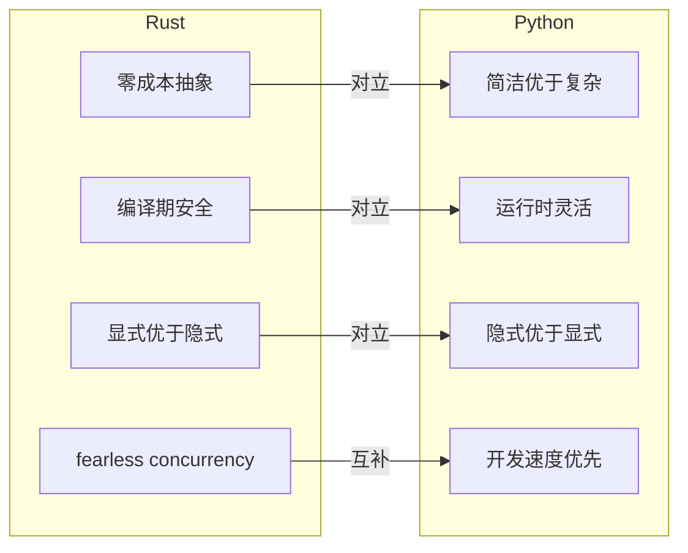
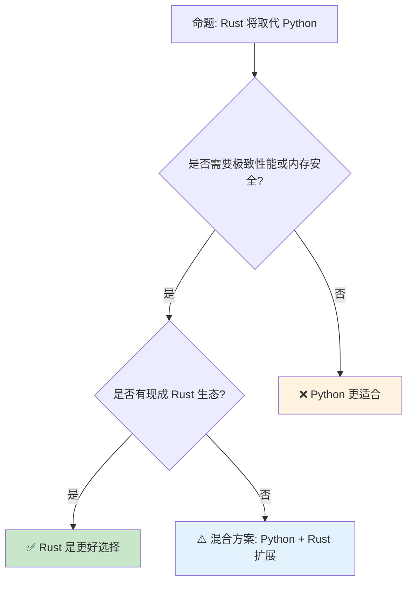

> **内容分级**: [综述级]
> **定理链**: N/A — 描述性/综述性/导航性文档，不涉及形式化定理链
>
# Rust vs Python：系统编程与动态脚本的对照分析
>
> **EN**: Rust vs Python
> **Summary**: Rust vs Python: comparative analysis with Rust across type systems, memory safety, and concurrency.
> **受众**: [进阶]
> **Bloom 层级**: 分析 → 评价
> **定位**: 对比分析 **Rust**（编译型、强类型、内存安全（Memory Safety））与 **Python**（解释型、动态类型、开发效率优先）在语言设计哲学、类型系统（Type System）、内存模型、并发模型和工程实践五个维度的深层差异。
> **前置概念**: [Ownership](../../01_foundation/01_ownership_borrow_lifetime/01_ownership.md) · [Type System](../../01_foundation/02_type_system/04_type_system.md)
> **后置概念**: [Rust vs Go](../01_systems_languages/02_rust_vs_go.md) · [Rust vs Java](06_rust_vs_java.md)

---

> **来源**: [Python Documentation](https://docs.python.org/3/) · · [Brown University — Interactive Rust Book](https://rust-book.cs.brown.edu/) · [Jung et al. — RustBelt: Securing the Foundations of Rust](https://plv.mpi-sws.org/rustbelt/popl18/) · [Itanium C++ ABI](https://itanium-cxx-abi.github.io/cxx-abi/abi.html)
> [PEP 484 — Type Hints](https://peps.python.org/pep-0484/) ·
> [TRPL](https://doc.rust-lang.org/book/title-page.html) ·
> [Rustonomicon](https://doc.rust-lang.org/nomicon/) ·
> [Wikipedia — Python (programming language)](https://en.wikipedia.org/wiki/Python_(programming_language)) ·
> [Wikipedia — Rust (programming language)](https://en.wikipedia.org/wiki/Rust_(programming_language))
> **前置依赖**: [Type Theory](../../04_formal/00_type_theory/02_type_theory.md)

## 📑 目录

- [Rust vs Python：系统编程与动态脚本的对照分析](#rust-vs-python系统编程与动态脚本的对照分析)
  - [📑 目录](#-目录)
  - [一、核心概念](#一核心概念)
    - [1.1 设计哲学对比](#11-设计哲学对比)
    - [1.2 类型系统：静态 vs 动态](#12-类型系统静态-vs-动态)
    - [1.3 内存模型：所有权 vs GC](#13-内存模型所有权-vs-gc)
  - [二、技术细节](#二技术细节)
    - [2.1 错误处理：Result vs Exception](#21-错误处理result-vs-exception)
    - [2.2 并发模型：fearless vs GIL](#22-并发模型fearless-vs-gil)
    - [2.3 元编程：宏 vs 装饰器/元类](#23-元编程宏-vs-装饰器元类)
  - [三、选型决策矩阵](#三选型决策矩阵)
  - [四、反命题与边界分析](#四反命题与边界分析)
    - [4.1 反命题树](#41-反命题树)
    - [4.2 边界极限](#42-边界极限)
  - [五、常见陷阱](#五常见陷阱)
  - [六、来源与延伸阅读](#六来源与延伸阅读)
  - [相关概念文件](#相关概念文件)
  - [权威来源索引](#权威来源索引)
  - [十、边界测试：Rust 与 Python 的编译错误对比](#十边界测试rust-与-python-的编译错误对比)
    - [10.1 边界测试：Python 的动态类型 vs Rust 的静态类型（编译错误）](#101-边界测试python-的动态类型-vs-rust-的静态类型编译错误)
  - [十、边界测试：Rust 与 Python 的编译错误对比](#十边界测试rust-与-python-的编译错误对比-1)
    - [10.1 边界测试：Python 的动态类型 vs Rust 的静态类型（编译错误）](#101-边界测试python-的动态类型-vs-rust-的静态类型编译错误-1)
    - [10.2 边界测试：Python 的 GIL 与 Rust 的所有权并发（编译错误）](#102-边界测试python-的-gil-与-rust-的所有权并发编译错误)
    - [10.5 边界测试：Python 的 GIL 与 Rust 的 `Arc<Mutex<T>>` 的性能对比（运行时开销）](#105-边界测试python-的-gil-与-rust-的-arcmutext-的性能对比运行时开销)
    - [10.3 边界测试：Python 式动态类型在 Rust 中的不可表达（编译错误）](#103-边界测试python-式动态类型在-rust-中的不可表达编译错误)
  - [嵌入式测验（Embedded Quiz）](#嵌入式测验embedded-quiz)
    - [测验 1：Rust 和 Python 在类型系统上的核心区别是什么？（理解层）](#测验-1rust-和-python-在类型系统上的核心区别是什么理解层)
    - [测验 2：Python 的 GIL（全局解释器锁）对并发有什么限制？Rust 有类似限制吗？（理解层）](#测验-2python-的-gil全局解释器锁对并发有什么限制rust-有类似限制吗理解层)
    - [测验 3：为什么 Rust 常被用来重写 Python 的性能瓶颈模块（如 `numpy`、`cryptography`）？（理解层）](#测验-3为什么-rust-常被用来重写-python-的性能瓶颈模块如-numpycryptography理解层)
    - [测验 4：Python 的"鸭子类型"（Duck Typing）与 Rust 的 Trait 系统有什么异同？（理解层）](#测验-4python-的鸭子类型duck-typing与-rust-的-trait-系统有什么异同理解层)
    - [测验 5：在数据科学/ML 领域，Rust 目前为什么还不能完全替代 Python？（理解层）](#测验-5在数据科学ml-领域rust-目前为什么还不能完全替代-python理解层)
  - [认知路径](#认知路径)
    - [核心推理链](#核心推理链)
    - [反命题与边界](#反命题与边界)

---

## 一、核心概念
>
>

### 1.1 设计哲学对比
>



> **认知功能**: 此图展示 Rust 与 Python 的**设计哲学对立与互补**。两者在抽象成本、安全时机、显隐偏好上对立，但在"解决实际问题"的目标上互补。
> [来源: [Rust Reference](https://doc.rust-lang.org/reference/)]
> **使用建议**: 不要用 Rust 的哲学评判 Python，也不要用 Python 的哲学评判 Rust——它们解决不同问题域。
> **关键洞察**: Rust 的"显式"和 Python 的"隐式"不是优劣之分，而是**可靠性 vs 开发效率**的权衡。Rust 为长期维护付出代价，Python 为快速迭代付出代价。
> [来源: [Zen of Python — PEP 20](https://peps.python.org/pep-0020/)] · [来源: [Rust Language Design FAQ](https://doc.rust-lang.org/reference/introduction.html)]

---

### 1.2 类型系统：静态 vs 动态
>

```text
类型系统对比:

  Rust:
  ├── 编译期静态类型检查
  ├── 类型推断（HM 算法）
  ├── 无运行时类型信息（除非 dyn Trait）
  ├── 泛型单态化（零成本）
  ├── 模式匹配穷尽性检查
  └── 错误在编译期捕获

  Python:
  ├── 运行时动态类型
  ├── 类型提示可选（PEP 484，mypy 静态检查）
  ├── 运行时类型信息（type()、isinstance()）
  ├── 泛型通过运行时类型擦除实现
  ├── 无模式匹配（3.10+ match/case 为结构匹配）
  └── 类型错误在运行时抛出

  代码对比:
  Rust:
  fn process(data: Vec<i32>) -> Result<i32, Error> {
      let first = data.first()?;  // 编译期保证不会 panic
      Ok(first * 2)
  }

  Python:
  def process(data: list[int]) -> int | None:
      if not data:
          return None
      return data[0] * 2  # 运行时可能 TypeError
```

> **类型洞察**: Python 的**可选类型提示**（PEP 484）试图弥合动态与静态的鸿沟，但无法提供 Rust 的编译期保证——类型提示是**文档和辅助工具**，不是**安全保证**。
> [来源: [PEP 484 — Type Hints](https://peps.python.org/pep-0484/)] · [来源: [mypy Documentation](https://mypy.readthedocs.io/)]

---

### 1.3 内存模型：所有权 vs GC
>

```text
内存管理对比:

  Rust — 所有权系统:
  ├── 编译期确定内存生命周期
  ├── 无运行时 GC 开销
  ├── RAII：资源获取即初始化
  ├── 确定性 Drop
  ├── 零成本抽象
  └── 学习曲线陡峭

  Python — 垃圾回收:
  ├── 引用计数为主（即时回收）
  ├── 循环引用检测（分代 GC）
  ├── 运行时内存管理开销
  ├── 非确定性销毁（__del__ 不可靠）
  ├── 开发简单
  └── 可能出现内存泄漏（循环引用）

  性能影响:
  ┌─────────────────┬─────────────────┬─────────────────┐
  │ 场景            │ Rust            │ Python          │
  ├─────────────────┼─────────────────┼─────────────────┤
  │ 对象创建        │ 栈分配优先      │ 堆分配 + 引用计数│
  │ 对象销毁        │ 编译期确定      │ 引用计数归零     │
  │ 循环数据结构    │ 编译期检测      │ 需要弱引用或 GC  │
  │ 内存占用        │ 精确控制        │ 解释器开销大     │
  └─────────────────┴─────────────────┴─────────────────┘
```

> **内存洞察**: Python 的**引用（Reference）计数 + GC** 模型在开发体验上更友好，但带来了运行时（Runtime）开销和不确定性。Rust 的所有权（Ownership）模型在编译期解决内存问题，但要求程序员更深入地理解内存语义。
> [来源: [Python C API — Memory Management](https://docs.python.org/3/c-api/memory.html)] · [来源: [Rustonomicon — Ownership](https://doc.rust-lang.org/nomicon/ownership.html)]

---

## 二、技术细节

### 2.1 错误处理：Result vs Exception
>

```rust,ignore
// Rust: 显式错误传播
fn read_config(path: &str) -> Result<Config, io::Error> {
    let contents = fs::read_to_string(path)?;  // ? 传播错误
    let config: Config = toml::from_str(&contents)?;
    Ok(config)
}
// 调用者必须处理 Result

# Python: 异常传播
import tomllib

def read_config(path: str) -> dict:
    with open(path, "rb") as f:
        return tomllib.load(f)
# 调用者可能忘记处理 FileNotFoundError / TOMLDecodeError
```

> **错误处理（Error Handling）洞察**: Rust 的 `Result` 强制**显式错误处理**——忽略 Result 会产生编译警告。Python 的异常是**隐式的控制流**——容易遗漏处理，导致运行时（Runtime）崩溃。Python 的类型提示可以部分缓解（标注 `-> dict` 不表达可能抛出的异常），但无法达到 Rust 的编译期保证。
> [来源: [Rust Error Handling](https://doc.rust-lang.org/book/ch09-00-error-handling.html)] · [来源: [Python Exceptions](https://docs.python.org/3/tutorial/errors.html)]

---

### 2.2 并发模型：fearless vs GIL
>

```text
并发模型对比:

  Rust:
  ├── 无全局锁
  ├── Send/Sync trait 编译期保证线程安全
  ├── 真正的并行（多核利用）
  ├── async/await 协作式并发
  ├── 数据竞争 = 编译错误
  └── 学习成本：理解所有权跨线程转移

  Python:
  ├── GIL（Global Interpreter Lock）
  │   └── 同一时刻只有一个线程执行 Python 字节码
  ├── 多线程用于 IO 并发，不用于 CPU 并行
  ├── CPU 并行需 multiprocessing（多进程）
  ├── asyncio 协作式并发（类似 Rust async）
  ├── 数据竞争可能发生（C 扩展中）
  └── 开发简单（但 GIL 是性能瓶颈）

  GIL 的本质:
  ├── 简化引用计数实现（无需原子操作）
  ├── 简化 C 扩展开发
  └── 代价: 无法利用多核 CPU

  Rust 的 fearless concurrency:
  ├── 编译器证明无数据竞争
  ├── 无需运行时锁（除非显式使用）
  └── 真正的零成本抽象
```

> **并发洞察**: Python 的 **GIL** 是**设计权衡**——它简化了内存管理和 C 扩展开发，但限制了 CPU 并行能力。Rust 通过**类型系统（Type System）**在编译期消除数据竞争，实现了真正的 fearless concurrency。
> [来源: [Python GIL](https://wiki.python.org/moin/GlobalInterpreterLock)] · [来源: [Rust Fearless Concurrency](https://doc.rust-lang.org/book/ch16-00-concurrency.html)]

---

### 2.3 元编程：宏 vs 装饰器/元类
>

```text
元编程对比:

  Rust:
  ├── macro_rules! — 声明式宏（模式匹配替换）
  ├── 过程宏 — 编译期代码生成（derive 等）
  ├── 编译期展开，无运行时开销
  ├── 卫生宏（hygiene）——不污染命名空间
  └── 限制: 无法访问类型信息（声明式宏）

  Python:
  ├── 装饰器 — 函数/类包装
  ├── 元类 — 类创建控制
  ├── 运行时执行，有开销
  ├── 反射/内省 — 运行时访问类型信息
  └── 灵活: 可动态修改对象行为

  代码对比:
  Rust derive:
  #[derive(Debug, Clone)]
  struct Point { x: i32, y: i32 }
  // 编译期生成 impl Debug for Point

  Python dataclass:
  @dataclass
  class Point:
      x: int
      y: int
  # 运行时生成 __init__, __repr__ 等
```

> **元编程洞察**: Rust 的宏（Macro）是**编译期代码生成**——零运行时（Runtime）开销，但限制于编译期可用信息。Python 的元编程是**运行时动态修改**——极其灵活，但有性能代价和可维护性风险。
> [来源: [Rust Macros](https://doc.rust-lang.org/book/ch19-06-macros.html)] · [来源: [Python Decorators](https://docs.python.org/3/glossary.html#term-decorator)]

---

## 三、选型决策矩阵

```text
场景 → 推荐语言 → 关键理由

系统编程 / 操作系统:
  → Rust
  → 内存安全、零成本抽象、 fearless concurrency

Web 后端（高并发）:
  → Rust (Actix/Axum) 或 Python (FastAPI/ Django)
  → Rust: 极致性能；Python: 开发速度 + 生态丰富

数据科学 / ML:
  → Python
  → NumPy/Pandas/PyTorch 生态无可替代
  → Rust 可作为性能瓶颈的扩展（PyO3）

CLI 工具:
  → Rust
  → 单二进制、快速启动、跨平台编译

原型开发 / 脚本:
  → Python
  → REPL、动态类型、丰富标准库

嵌入式 / WASM:
  → Rust
  → 无运行时、精确内存控制、WASM 支持成熟

区块链 / 智能合约:
  → Rust
  → 确定性执行、内存安全、Substrate/Solana 生态
```

> **选型洞察**: Rust 和 Python 不是**竞争关系**，而是**互补关系**——Python 负责快速探索和生态利用，Rust 负责性能瓶颈和系统底层。
> [来源: [PyO3 Documentation](https://pyo3.rs/)] · [来源: [Rust in Production](https://www.rust-lang.org/)]

---

## 四、反命题与边界分析

### 4.1 反命题树
>



> **认知功能**: 此决策树展示 Rust 与 Python 的**互补性**。Rust 不会取代 Python——它们在不同场景下各有优势。
> **使用建议**: 新项目根据性能需求、生态依赖和团队技能选型；现有 Python 项目可通过 PyO3 逐步引入 Rust。
> **关键洞察**: **混合架构**（Python 主逻辑 + Rust 性能模块（Module））是工业界的最佳实践——例如 Python 的 NumPy/Pandas 底层都是 C/Fortran，未来可能更多用 Rust。
> [来源: [PyO3 — Rust bindings for Python](https://pyo3.rs/)]

---

### 4.2 边界极限
>

```text
边界 1: Python 的类型提示覆盖率
├── mypy 等工具需要完整类型标注才能有效检查
├── 大量遗留代码无类型提示
├── 第三方库的类型 stub 不完整
└── 即使类型正确，运行时仍可能因鸭子类型而出错

边界 2: Rust 的学习曲线
├── 所有权、生命周期、借用规则需要数月掌握
├── 团队迁移成本高
├── 某些模式（如图、复杂递归）在 Rust 中表达困难
└── 不适合快速原型和探索性编程

边界 3: FFI 边界
├── Python 调用 Rust（PyO3）或 Rust 调用 Python（cpython）有开销
├── 对象转换、GIL 获取/释放、异常处理都有成本
├── 频繁 FFI 调用可能抵消 Rust 的性能优势
└── 最佳实践: 在 FFI 边界做批处理，减少跨语言调用次数

边界 4: 异步生态差异
├── Rust async/await 是零成本状态机
├── Python asyncio 是事件循环 + 协程
├── 两者的运行时模型不同，不能直接互操作
└── 混合异步代码需要 careful 的桥接（如 tokio 的 block_on）
```

> **边界要点**: Rust 与 Python 的边界主要与**类型系统（Type System）的完备性**、**学习成本**、**FFI 开销**和**异步（Async）模型差异**相关。这些边界决定了两者在实践中的最佳协作方式。
> [来源: [PyO3 Performance Guide](https://pyo3.rs/main/performance.html)]

---

## 五、常见陷阱
>

```text
陷阱 1: 在 Rust 中写 Python 风格的代码
  ❌ fn process(data: Vec<i32>) -> Vec<i32> {
       let mut result = Vec::new();
       for item in data {
         result.push(item * 2);
       }
       result
     }

  ✅ fn process(data: Vec<i32>) -> Vec<i32> {
       data.into_iter().map(|x| x * 2).collect()
     }
     // 更 Rustic 的风格

陷阱 2: 在 Python 中忽视类型提示
  ❌ def process(data):
       return data[0] * 2

  ✅ def process(data: list[int]) -> int:
       if not data:
           raise ValueError("empty list")
       return data[0] * 2

陷阱 3: 频繁 FFI 调用
  ❌ 在循环中逐元素 Python ↔ Rust 转换

  ✅ 批量传递数据，减少 FFI 边界穿越
     # Python
     rust_module.process_batch(numpy_array)

陷阱 4: 忽略 Python GIL 的影响
  ❌ 在 Python 中启动 16 个线程做 CPU 密集型计算
     # 由于 GIL，实际只使用 1 个核心

  ✅ CPU 并行使用 multiprocessing 或迁移到 Rust
     # 或使用 numpy（底层释放 GIL）

陷阱 5: 在 Rust 中过度使用 Rc/Arc
  ❌ 用 Rc<RefCell<T>> 模拟 Python 的共享可变状态

  ✅ 重新设计为所有权传递或不可变共享
     // Rust 的优势就是编译期保证，不要绕过它
```

> **陷阱总结**: Rust 和 Python 的陷阱主要源于**跨语言思维惯性**——用 Python 风格写 Rust（过度分配、共享状态），或用 Rust 风格写 Python（过度工程化）。理解各自的语言哲学是避免这些陷阱的关键。
> [来源: [Rust API Guidelines](https://rust-lang.github.io/api-guidelines/)] · [来源: [Google Python Style Guide](https://google.github.io/styleguide/pyguide.html)]

---

## 六、来源与延伸阅读

| 来源 | 可信度 | 说明 |
|:---|:---:|:---|
| [Python Documentation](https://docs.python.org/3/) | ✅ 一级 | 官方文档 |
| [PEP 484 — Type Hints](https://peps.python.org/pep-0484/) | ✅ 一级 | Python 类型系统 |
| [TRPL](https://doc.rust-lang.org/book/title-page.html) | ✅ 一级 | Rust 入门 |
| [PyO3](https://pyo3.rs/) | ✅ 一级 | Python-Rust 互操作 |
| [mypy](https://mypy.readthedocs.io/) | ✅ 一级 | Python 静态类型检查 |
| [Python GIL](https://wiki.python.org/moin/GlobalInterpreterLock) | ✅ 一级 | GIL 说明 |

---

## 相关概念文件

- [Rust vs Go](../01_systems_languages/02_rust_vs_go.md) — Rust vs Go 对比
- [Rust vs Java](06_rust_vs_java.md) — Rust vs Java 对比
- [Ownership](../../01_foundation/01_ownership_borrow_lifetime/01_ownership.md) — 所有权模型
- [Type System](../../01_foundation/02_type_system/04_type_system.md) — 类型系统

---

> **权威来源**: [Rust Reference](https://doc.rust-lang.org/reference/), [The Rust Programming Language](https://doc.rust-lang.org/book/title-page.html), [Python Documentation](https://docs.python.org/3/)
>
> **权威来源对齐变更日志**: 2026-05-22 创建 [来源: Authority Source Sprint Batch 9]

**文档版本**: 1.0
**对应 Rust 版本**: 1.96.1+ (Edition 2024)
**最后更新**: 2026-05-22
**状态**: ✅ 概念文件创建完成

---

## 权威来源索引

>
>
>

---

---

---

## 十、边界测试：Rust 与 Python 的编译错误对比

### 10.1 边界测试：Python 的动态类型 vs Rust 的静态类型（编译错误）

```rust,ignore
fn main() {
    let x = 42;
    // ❌ 编译错误: expected integer, found `&str`
    // Rust 变量类型在编译期固定，不能重新赋值为不同类型
    let x = "hello"; // shadowing 创建新变量，不是修改原变量类型
}

// 正确: 使用枚举表达多种可能类型
enum Value {
    Int(i32),
    Str(String),
}

fn fixed() {
    let v = Value::Int(42);
    let v = Value::Str(String::from("hello")); // ✅ shadowing
}
```

> **Python 对比**: Python 是动态类型——变量名只是标签，可以指向任何类型的对象：`x = 42; x =

## 十、边界测试：Rust 与 Python 的编译错误对比

### 10.1 边界测试：Python 的动态类型 vs Rust 的静态类型（编译错误）

```rust,ignore
fn main() {
    let x = 42;
    // ❌ 编译错误: expected integer, found `&str`
    // Rust 变量类型在编译期固定，不能重新赋值为不同类型
    // x = "hello"; // 编译错误
}

// 正确: 使用枚举表达多种可能类型
enum Value {
    Int(i32),
    Str(String),
}

fn fixed() {
    let v = Value::Int(42);
    let v = Value::Str(String::from("hello")); // shadowing
}
```

> **Python 对比**: Python 是动态类型——变量名只是标签，可以指向任何类型的对象：`x = 42; x = "hello"` 完全合法。Rust 是静态类型——变量类型在编译期确定，`x = 42` 后 `x` 的类型是 `i32`，不能再赋值为 `String`。Rust 的 shadowing（`let x = ...`）创建新变量而非修改原变量。这消除了 Python 中常见的类型错误（如 `len(42)`），但增加了类型标注的样板代码。[来源: [The Rust Programming Language](https://doc.rust-lang.org/book/title-page.html)]

### 10.2 边界测试：Python 的 GIL 与 Rust 的所有权并发（编译错误）

```rust,compile_fail
use std::rc::Rc;
use std::thread;

fn main() {
    let data = Rc::new(42);
    // ❌ 编译错误: `Rc<i32>` cannot be sent between threads safely
    // Rc 不是 Send，不能跨线程共享
    thread::spawn(move || {
        println!("{}", data);
    }).join().unwrap();
}

// 正确: 使用 Arc（原子引用计数）
use std::sync::Arc;

fn fixed() {
    let data = Arc::new(42);
    let data2 = Arc::clone(&data);
    thread::spawn(move || {
        println!("{}", data2);
    }).join().unwrap();
}
```

> **Python 对比**: Python 通过 **GIL**（Global Interpreter Lock）保证单线程执行字节码，实现"线程安全"——但代价是真正的并行计算受限（CPU 密集型任务无法利用多核）。Rust 没有 GIL，通过**所有权（Ownership）和类型系统**保证线程安全：`Rc<T>`（非原子）不能跨线程，`Arc<T>`（原子）可以。编译器在编译期拒绝数据竞争，无需运行时锁。这使得 Rust 的并发程序既有 C/C++ 的性能，又有 Python 的安全性——但无需全局锁。[来源: [The Rust Programming Language](https://doc.rust-lang.org/book/title-page.html)]

### 10.5 边界测试：Python 的 GIL 与 Rust 的 `Arc<Mutex<T>>` 的性能对比（运行时开销）

```rust,ignore
use std::sync::{Arc, Mutex};
use std::thread;

fn main() {
    let data = Arc::new(Mutex::new(0));
    let mut handles = vec![];

    for _ in 0..8 {
        let d = Arc::clone(&data);
        handles.push(thread::spawn(move || {
            for _ in 0..100000 {
                let mut guard = d.lock().unwrap();
                *guard += 1;
            }
        }));
    }

    for h in handles { h.join().unwrap(); }
    println!("{}", *data.lock().unwrap());

    // ⚠️ 性能注意: Arc<Mutex<T>> 的争用比 Python GIL 更细粒度
    // 但 Mutex 开销在高度争用时显著
}
```

> **修正**: Python 的 **GIL**（Global Interpreter Lock）使多线程 Python 代码**串行执行**——同一时刻只有一个线程执行 Python 字节码。Rust 的 `Arc<Mutex<T>>` 允许**真并行**，但 `Mutex` 的锁争用（lock contention）在高频访问时成为瓶颈。性能对比：1) Python GIL：无锁开销，但无并行；2) Rust `Mutex`：有锁开销（原子操作（Atomic Operations） + 内核调度），但可并行；3) Rust `AtomicUsize`：无锁，最高性能。Rust 的优势：开发者可根据场景选择同步原语（`Mutex`、`RwLock`、`Atomic`、无锁结构），Python 无此选择。这与 Java 的 `synchronized`（类似 Mutex，但 JVM 优化更成熟）或 Go 的 `sync.Mutex`（类似 Rust，但 goroutine 调度更轻量）类似——Rust 提供底层控制，但正确使用需要理解内存模型。[来源: [The Rust Programming Language](https://doc.rust-lang.org/book/ch16-03-shared-state.html)] · [来源: [Python GIL](https://wiki.python.org/moin/GlobalInterpreterLock)]

### 10.3 边界测试：Python 式动态类型在 Rust 中的不可表达（编译错误）

```rust,compile_fail
fn main() {
    let mut x = 42; // x 是 i32
    // ❌ 编译错误: Rust 变量不能改变类型
    x = "hello"; // 期望 i32，找到 &str
    println!("{}", x);
}
```

> **修正**: Python 是**动态类型**：变量无固定类型，`x = 42` 后 `x = "hello"` 完全合法。Rust 是**静态类型**：变量类型在编译期确定且不可变（但值可变，若绑定为 `mut`）。Rust 模拟动态类型的方案：1) `enum`（代数数据类型）：`enum Value { Int(i32), Str(String) }`；2) `Box<dyn Any>`（运行时类型擦除）；3) `serde_json::Value`（通用 JSON 值）。代价：代码膨胀、运行时开销、模式匹配（Pattern Matching）噪音。这与 Go 的 `interface{}`（类似动态类型，但需类型断言）或 TypeScript 的 `any`（编译期绕过检查）不同——Rust 的静态类型是核心设计语言，动态类型是额外抽象。[来源: [The Rust Programming Language](https://doc.rust-lang.org/book/ch03-00-common-programming-concepts.html)] · [来源: [Rust Reference — Types](https://doc.rust-lang.org/reference/types.html)]

## 嵌入式测验（Embedded Quiz）

### 测验 1：Rust 和 Python 在类型系统上的核心区别是什么？（理解层）

**题目**: Rust 和 Python 在类型系统上的核心区别是什么？

<details>
<summary>✅ 答案与解析</summary>

Rust 是静态强类型，类型错误在编译期捕获。Python 是动态类型，类型错误在运行时暴露。Python 3.5+ 的类型提示是可选的，不影响运行时行为。
</details>

---

### 测验 2：Python 的 GIL（全局解释器锁）对并发有什么限制？Rust 有类似限制吗？（理解层）

**题目**: Python 的 GIL（全局解释器锁）对并发有什么限制？Rust 有类似限制吗？

<details>
<summary>✅ 答案与解析</summary>

GIL 阻止 Python 线程真正并行执行 CPU 密集型任务。Rust 没有 GIL，原生线程可真正并行，且 `Send`/`Sync` trait 在编译期防止数据竞争。
</details>

---

### 测验 3：为什么 Rust 常被用来重写 Python 的性能瓶颈模块（如 `numpy`、`cryptography`）？（理解层）

**题目**: 为什么 Rust 常被用来重写 Python 的性能瓶颈模块（Module）（如 `numpy`、`cryptography`）？

<details>
<summary>✅ 答案与解析</summary>

Rust 性能接近 C/C++，且内存安全（Memory Safety）。通过 PyO3 等工具将 Rust 编译为 Python 扩展模块（Module），可在保留 Python 易用性的同时大幅提升热点性能。
</details>

---

### 测验 4：Python 的"鸭子类型"（Duck Typing）与 Rust 的 Trait 系统有什么异同？（理解层）

**题目**: Python 的"鸭子类型"（Duck Typing）与 Rust 的 Trait 系统有什么异同？

<details>
<summary>✅ 答案与解析</summary>

两者都基于行为而非继承。Python 在运行时检查方法存在性（可能失败）。Rust 在编译期通过 trait bound 检查，错误在编译期捕获。
</details>

---

### 测验 5：在数据科学/ML 领域，Rust 目前为什么还不能完全替代 Python？（理解层）

**题目**: 在数据科学/ML 领域，Rust 目前为什么还不能完全替代 Python？

<details>
<summary>✅ 答案与解析</summary>

Python 拥有更成熟的 ML 生态（PyTorch、TensorFlow、Jupyter）。Rust 的 ML 库正在发展，但 API 成熟度、社区规模和研究者熟悉度仍有差距。
</details>

## 认知路径

> **认知路径**: 从 L0 基础概念出发，经由本节的 **Rust vs Python：系统编程与动态脚本的对照分析** 核心原理，通向 L2 进阶模式与 L3 工程实践。

### 核心推理链

| 定理 | 前提 | 结论 | 置信度 |
|:---|:---|:---|:---|
| Rust vs Python：系统编程与动态脚本的对照分析 基础定义 ⟹ 正确用法 | 理解语法与语义 | 能写出符合惯用法的代码 | 高 |
| Rust vs Python：系统编程与动态脚本的对照分析 正确用法 ⟹ 常见陷阱 | 忽略边界条件 | 编译错误或运行时 bug | 高 |
| Rust vs Python：系统编程与动态脚本的对照分析 常见陷阱 ⟹ 深度掌握 | 系统学习反模式 | 能进行代码审查与优化 | 高 |

> **过渡**: 掌握 Rust vs Python：系统编程与动态脚本的对照分析 的基础语法后，下一步需要理解其在类型系统中的位置与与其他概念的交互关系。
> **过渡**: 在实践中应用 Rust vs Python：系统编程与动态脚本的对照分析 时，务必关注边界条件与异常处理，这是从"能编译"到"能生产"的关键跃迁。
> **过渡**: Rust vs Python：系统编程与动态脚本的对照分析 的设计理念体现了 Rust 零成本抽象（Zero-Cost Abstraction）与安全保证的核心权衡，理解这一权衡有助于迁移到更高级的并发与形式化验证领域。

### 反命题与边界

> **反命题**: "Rust vs Python：系统编程与动态脚本的对照分析 在所有场景下都是最佳选择" —— 错误。需要根据具体上下文权衡性能、可读性与安全性，某些场景下显式替代方案可能更优。
