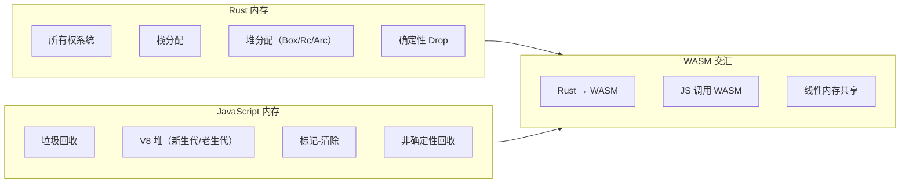
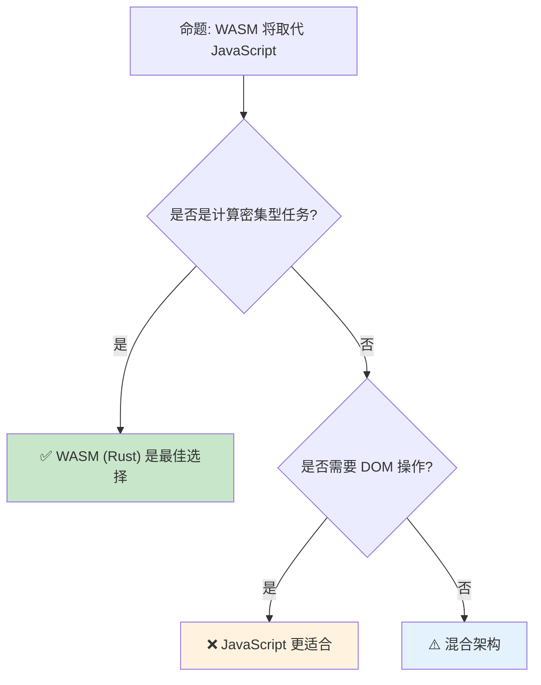

> **生态状态提示**：
>
> 本文档提及 `async-std` 与/或 `wasm32-wasi`。请注意：
>
> - `async-std` 项目已进入维护模式，2024 年后不再活跃开发；新项目建议优先评估 **Tokio** 或 **smol**。
> - `wasm32-wasi` 旧目标名已重命名为 **`wasm32-wasip1`**；WASI Preview 2 对应目标为 **`wasm32-wasip2`**。

---

> **内容分级**: [综述级]
> **定理链**: N/A — 描述性/综述性/导航性文档，不涉及形式化定理链
>
# Rust vs JavaScript：系统编程与脚本执行的范式差异
>
> **EN**: Rust vs JavaScript
> **Summary**: Rust vs JavaScript: comparative analysis with Rust across type systems, memory safety, and concurrency.
> **受众**: [进阶]
> **Bloom 层级**: 分析 → 评价
> **权威来源**: 本文件为 `concept/` 权威页。
> **定位**: 对比分析 **Rust**（编译型、强类型、内存安全（Memory Safety））与 **JavaScript**（解释型、动态类型、事件驱动）在语言语义、运行时（Runtime）模型、异步（Async）处理和生态工具链四个维度的本质差异，特别关注 WASM 作为两者交汇点的作用。
> **前置概念**: [Ownership](../../01_foundation/01_ownership_borrow_lifetime/01_ownership.md) · [Type System](../../01_foundation/02_type_system/04_type_system.md)
> **后置概念**: [WebAssembly](../../06_ecosystem/11_domain_applications/11_webassembly.md) · [Async](../../03_advanced/01_async/02_async.md)

---

> **来源**: · [Brown University — Interactive Rust Book](https://rust-book.cs.brown.edu/) · [Jung et al. — RustBelt: Securing the Foundations of Rust](https://plv.mpi-sws.org/rustbelt/popl18/) · [Itanium C++ ABI](https://itanium-cxx-abi.github.io/cxx-abi/abi.html)
> [ECMAScript Specification](https://tc39.es/ecma262/) ·
> [MDN — JavaScript](https://developer.mozilla.org/en-US/docs/Web/JavaScript) ·
> [TRPL](https://doc.rust-lang.org/book/title-page.html) ·
> [WASM Specification](https://webassembly.github.io/spec/) ·
> [Rust and WASM](https://rustwasm.github.io/docs/book/index.html) ·
> [V8 Blog](https://v8.dev/blog)
> **前置依赖**: [Type Theory](../../04_formal/00_type_theory/02_type_theory.md)

## 📑 目录

- [Rust vs JavaScript：系统编程与脚本执行的范式差异](#rust-vs-javascript系统编程与脚本执行的范式差异)
  - [📑 目录](#-目录)
  - [一、核心概念](#一核心概念)
    - [1.1 运行时模型：编译 vs 解释](#11-运行时模型编译-vs-解释)
    - [1.2 类型系统：静态 vs 动态](#12-类型系统静态-vs-动态)
    - [1.3 内存模型：所有权 vs GC](#13-内存模型所有权-vs-gc)
  - [二、技术细节](#二技术细节)
    - [2.1 异步模型对比](#21-异步模型对比)
    - [2.2 错误处理：Result vs Throw](#22-错误处理result-vs-throw)
    - [2.3 WASM：两个世界的桥梁](#23-wasm两个世界的桥梁)
  - [三、选型决策矩阵](#三选型决策矩阵)
  - [四、反命题与边界分析](#四反命题与边界分析)
    - [4.1 反命题树](#41-反命题树)
    - [4.2 边界极限](#42-边界极限)
  - [五、常见陷阱](#五常见陷阱)
  - [六、来源与延伸阅读](#六来源与延伸阅读)
  - [相关概念文件](#相关概念文件)
  - [权威来源索引](#权威来源索引)
  - [十、边界测试：Rust 与 JavaScript 的编译错误对比](#十边界测试rust-与-javascript-的编译错误对比)
    - [10.1 边界测试：JavaScript 的隐式转换 vs Rust 的显式转换（编译错误）](#101-边界测试javascript-的隐式转换-vs-rust-的显式转换编译错误)
    - [10.2 边界测试：JavaScript 的闭包变量捕获与 Rust 的所有权（编译错误）](#102-边界测试javascript-的闭包变量捕获与-rust-的所有权编译错误)
    - [10.3 边界测试：JavaScript 的 `this` 动态绑定与 Rust 的方法调用（编译错误）](#103-边界测试javascript-的-this-动态绑定与-rust-的方法调用编译错误)
    - [10.4 边界测试：JavaScript 的弱类型与 Rust 的强制类型（编译错误）](#104-边界测试javascript-的弱类型与-rust-的强制类型编译错误)
  - [嵌入式测验（Embedded Quiz）](#嵌入式测验embedded-quiz)
    - [测验 1：Rust 和 JavaScript 在内存管理上的根本区别是什么？（理解层）](#测验-1rust-和-javascript-在内存管理上的根本区别是什么理解层)
    - [测验 2：JavaScript 的 `Promise` 与 Rust 的 `Future` 在语义上有什么区别？（理解层）](#测验-2javascript-的-promise-与-rust-的-future-在语义上有什么区别理解层)
    - [测验 3：为什么 Rust 编译为 WebAssembly 后可以与 JavaScript 互操作？WASM 在这两种语言间扮演什么角色？（理解层）](#测验-3为什么-rust-编译为-webassembly-后可以与-javascript-互操作wasm-在这两种语言间扮演什么角色理解层)
    - [测验 4：JavaScript 的"原型继承"与 Rust 的 `trait` 系统在代码复用上有什么区别？（理解层）](#测验-4javascript-的原型继承与-rust-的-trait-系统在代码复用上有什么区别理解层)
    - [测验 5：Node.js 的 `require`/`import` 模块系统与 Rust 的 `crate`/`mod` 系统有什么主要区别？（理解层）](#测验-5nodejs-的-requireimport-模块系统与-rust-的-cratemod-系统有什么主要区别理解层)
  - [认知路径](#认知路径)
    - [核心推理链](#核心推理链)
    - [反命题与边界](#反命题与边界)

---

## 一、核心概念
>
>

### 1.1 运行时模型：编译 vs 解释
>

```text
运行时模型对比:

  Rust:
  ├── AOT 编译为机器码
  ├── 无运行时（或最小运行时）
  ├── 启动时间：毫秒级
  ├── 内存占用：精确控制
  └── 部署：单二进制文件

  JavaScript:
  ├── JIT 编译（V8/SpiderMonkey/JavaScriptCore）
  ├── 运行时：V8 引擎 + 事件循环
  ├── 启动时间：依赖引擎初始化
  ├── 内存占用：V8 堆（通常 1-2GB）
  └── 部署：源代码或 bundle

  性能特征:
  ┌─────────────────┬─────────────────┬─────────────────┐
  │ 场景            │ Rust            │ JavaScript      │
  ├─────────────────┼─────────────────┼─────────────────┤
  │ 冷启动          │ 快（已编译）    │ 慢（JIT 预热）  │
  │ 峰值性能        │ 原生速度        │ 接近原生（JIT） │
  │ 内存控制        │ 精确            │ GC 非确定性     │
  │ 包体积          │ 小（单二进制）  │ 大（运行时）    │
  │ 跨平台          │ 需交叉编译      │ 随处运行        │
  └─────────────────┴─────────────────┴─────────────────┘
```

> **运行时（Runtime）洞察**: Rust 的**无运行时**设计与 JavaScript 的**重型运行时**形成鲜明对比——Rust 适合资源受限环境，JavaScript 适合快速部署。
> [来源: [V8 Blog — JIT](https://v8.dev/blog/maglev)] · [来源: [TRPL — No Runtime](https://doc.rust-lang.org/book/ch03-00-common-programming-concepts.html)]

---

### 1.2 类型系统：静态 vs 动态
>

```text
类型系统对比:

  Rust:
  ├── 编译期静态类型检查
  ├── 类型推断（HM 算法扩展）
  ├── 无隐式类型转换
  ├── 泛型单态化（零成本）
  └── 错误在编译期捕获

  JavaScript:
  ├── 运行时动态类型
  ├── TypeScript 提供可选静态类型（转译时检查）
  ├── 隐式类型转换（coercion）
  ├── 无泛型（TS 有，但擦除到 JS）
  └── 类型错误在运行时抛出

  TypeScript 的作用:
  ├── 提供编译期类型检查
  ├── 但类型信息在运行时不可用
  ├── 无法防止运行时类型错误（如 JSON.parse）
  └── 与 Rust 的编译期保证有本质区别

  代码对比:
  Rust:
  fn add(a: i32, b: i32) -> i32 { a + b }
  add(1, "2");  // 编译错误

  JavaScript:
  function add(a, b) { return a + b; }
  add(1, "2");  // "12"（字符串拼接）

  TypeScript:
  function add(a: number, b: number): number { return a + b; }
  add(1, "2" as any);  // 编译通过，运行时仍可能出错
```

> **类型洞察**: TypeScript 的"静态类型"是**开发时辅助**，不是**运行时（Runtime）保证**——`as any` 和 `JSON.parse` 可以绕过所有类型检查。Rust 的类型系统（Type System）在编译后仍然有效（通过生成的代码结构）。
> [来源: [TypeScript Handbook](https://www.typescriptlang.org/docs/handbook/intro.html)] · [来源: [Rust Type System](https://doc.rust-lang.org/reference/type-system.html)]

---

### 1.3 内存模型：所有权 vs GC
>



> **认知功能**: 此图展示 Rust 和 JavaScript 的**内存模型差异**及 WASM 的**桥梁作用**。Rust 的确定性内存管理与 JS 的 GC 在 WASM 中通过线性内存交互。
> [来源: [TRPL](https://doc.rust-lang.org/book/title-page.html)]
> **关键洞察**: WASM 是 Rust 和 JavaScript **共存的运行时（Runtime）**——Rust 编译为 WASM 模块（Module），JS 通过 JS API 调用，两者共享线性内存。
> [来源: [WASM Memory Model](https://webassembly.github.io/spec/core/syntax/modules.html#memories)]

---

## 二、技术细节

### 2.1 异步模型对比
>

```text
异步模型对比:

  Rust:
  ├── Future trait: 惰性计算的状态机
  ├── async/await: 语法糖，编译为状态机
  ├── 无内置运行时（需 Tokio/Async-std）
  ├── 零成本抽象：async 代码 ≈ 手写状态机
  └── 错误处理: Result 传播

  JavaScript:
  ├── Promise: 立即执行 + 回调注册
  ├── async/await: Promise 的语法糖
  ├── 事件循环: 单线程 + 任务队列
  ├── 宏任务/微任务: 复杂的调度语义
  └── 错误处理: try/catch + Promise.reject

  关键差异:
  ┌─────────────────┬─────────────────┬─────────────────┐
  │ 特性            │ Rust Future     │ JS Promise      │
  ├─────────────────┼─────────────────┼─────────────────┤
  │ 执行时机        │ 惰性（需 poll） │ 立即执行        │
  │ 取消            │ 支持（Drop）    │ 不支持（需     │
  │                 │                 │ AbortController）│
  │ 运行时          │ 外部（Tokio）   │ 内置（事件循环）│
  │ 内存            │ 栈分配状态机    │ 堆分配 Promise  │
  │ 并发            │ 多线程（Send）  │ 单线程（事件循环│
  │                 │                 │ + Worker）      │
  └─────────────────┴─────────────────┴─────────────────┘
```

> **异步（Async）洞察**: Rust 的 Future 是**惰性**的——创建时不会执行，需要运行时 poll。JavaScript 的 Promise 是**立即执行**的——创建时就开始执行。
> [来源: [Rust Async Book](https://rust-lang.github.io/async-book/index.html)] · [来源: [MDN — Promises](https://developer.mozilla.org/en-US/docs/Web/JavaScript/Reference/Global_Objects/Promise)]

---

### 2.2 错误处理：Result vs Throw
>

```rust,ignore
// Rust: 显式错误传播
fn read_file(path: &str) -> Result<String, io::Error> {
    let contents = fs::read_to_string(path)?;  // ? 传播错误
    Ok(contents)
}

// JavaScript: 异常抛出
function readFile(path) {
    try {
        return fs.readFileSync(path, 'utf8');
    } catch (e) {
        throw e;  // 或返回 undefined
    }
}

// JS async 错误
async function readFile(path) {
    try {
        return await fs.promises.readFile(path, 'utf8');
    } catch (e) {
        // 处理错误
    }
}

// 关键差异:
// - Rust: 错误是类型系统的一部分（Result<T, E>）
// - JS: 错误是控制流机制（try/catch）
// - Rust: 调用者必须处理或传播错误
// - JS: 错误可以被忽略，导致未捕获异常
```

> **错误处理（Error Handling）洞察**: Rust 的 `Result` 将错误提升为**类型**——编译器强制处理。JavaScript 的异常是**运行时控制流**——容易遗漏，导致生产环境崩溃。
> [来源: [Rust Error Handling](https://doc.rust-lang.org/book/ch09-00-error-handling.html)] · [来源: [MDN — try/catch](https://developer.mozilla.org/en-US/docs/Web/JavaScript/Reference/Statements/try...catch)]

---

### 2.3 WASM：两个世界的桥梁
>

```text
Rust + JavaScript + WASM 的工作模式:

  1. Rust 编译为 WASM
     ├── wasm32-unknown-unknown 目标
     ├── wasm-bindgen: 生成 JS 绑定
     └── wasm-pack: 打包为 npm 包

  2. JS 调用 WASM
     ├── 导入 WASM 模块
     ├── 调用 Rust 导出的函数
     └── 通过 wasm-bindgen 自动类型转换

  3. 内存共享
     ├── WASM 使用线性内存（ArrayBuffer）
     ├── JS 可以直接读写 WASM 内存
     └── 高效的数据交换（无需序列化）

  典型应用场景:
  ├── 图像/视频处理（Rust 计算，JS UI）
  ├── 游戏引擎（Rust 逻辑，JS 渲染）
  ├── 加密/哈希（Rust 实现，JS 调用）
  └── 科学计算（Rust 数值计算，JS 可视化）

  性能对比:
  ┌─────────────────┬─────────────────┬─────────────────┬─────────────────┐
  │ 场景            │ JS              │ WASM (Rust)     │ 提升            │
  ├─────────────────┼─────────────────┼─────────────────┼─────────────────┤
  │ 图像处理        │ 1x              │ 5-20x           │ 显著            │
  │ 游戏物理        │ 1x              │ 3-10x           │ 显著            │
  │ DOM 操作        │ 1x              │ 0.5-1x          │ 无（JS 更快）   │
  │ 字符串处理      │ 1x              │ 1-2x            │ 有限            │
  └─────────────────┴─────────────────┴─────────────────┴─────────────────┘
```

> **WASM 洞察**: WASM 不是**替代 JavaScript**，而是**增强 JavaScript**——在计算密集型任务上用 Rust/WASM，在 DOM/I/O 上用 JavaScript。
> [来源: [Rust and WASM Book](https://rustwasm.github.io/docs/book/index.html)] · [来源: [wasm-bindgen Guide](https://rustwasm.github.io/docs/wasm-bindgen/)]

---

## 三、选型决策矩阵

```text
场景 → 推荐技术栈 → 关键理由

Web 前端（UI 密集型）:
  → JavaScript/TypeScript
  → DOM 操作、事件处理、生态系统

Web 性能瓶颈（计算密集型）:
  → Rust + WASM
  → 原生性能、内存安全、与 JS 无缝集成

CLI 工具:
  → Rust
  → 单二进制、快速启动、跨平台

服务端（I/O 密集型）:
  → Rust (Tokio/Axum) 或 Node.js
  → Rust: 极致性能；Node.js: 开发速度

服务端（计算密集型）:
  → Rust
  → CPU 利用率、内存效率、并发安全

嵌入式/IoT:
  → Rust
  → 无运行时、精确内存控制、 fearless 并发

桌面应用:
  → Rust (Tauri) 或 Electron (JS)
  → Tauri: 小体积、Rust 后端；Electron: 大生态
```

> **选型洞察**: Rust 和 JavaScript 的**最佳协作方式**是通过 WASM——各取所长，而非互相替代。
> [来源: [Tauri](https://tauri.app/)] · [source: [Electron](https://www.electronjs.org/)]

---

## 四、反命题与边界分析

### 4.1 反命题树
>



> **认知功能**: 此决策树展示 WASM 的**适用边界**。WASM 不是 JavaScript 的替代品，而是**互补技术**。
> [来源: [Rust Reference](https://doc.rust-lang.org/reference/introduction.html)]
> **关键洞察**: 大多数现代 Web 应用应采用**混合架构**——JS 处理 UI 和 I/O，WASM 处理计算密集型任务。
> [来源: [WASM Use Cases](https://webassembly.org/docs/use-cases/)]

---

### 4.2 边界极限
>

```text
边界 1: WASM 的宿主环境限制
├── WASM 无法直接访问 DOM、网络、文件系统
├── 必须通过 JS 宿主环境代理
├── 频繁的 JS/WASM 边界穿越有开销
└── 缓解: 批量操作、减少边界穿越

边界 2: WASM 的包体积
├── Rust WASM 二进制通常 50KB-500KB
├── 需要 wasm-opt 优化
├── 对比: JS bundle 可能更小（gzip 后）
└── 权衡: 体积 vs 性能

边界 3: 调试体验
├── WASM 调试需要 source map
├── 崩溃信息不如 JS 直观
├── wasm-bindgen 生成代码增加调试复杂度
└── 工具链持续改进中

边界 4: GC 语言的 WASM 支持
├── Java/Kotlin/Go 编译为 WASM 需要 GC 提案
├── 当前 WASM 无内置 GC（提案中）
├── Rust 的优势: 无 GC，WASM 友好
└── 未来 GC 提案可能改变格局

边界 5: 异步模型的不匹配
├── Rust Future 与 JS Promise 的语义差异
├── wasm-bindgen 自动转换但有性能开销
├── 复杂的异步交互可能导致意外行为
└── 需要 careful 的桥接设计
```

> **边界要点**: Rust/JS/WASM 的边界主要与**宿主环境限制**、**包体积**、**调试体验**、**GC 支持**和**异步（Async）语义**相关。
> [source: [WASM Post-MVP](https://github.com/WebAssembly/proposals)]

---

## 五、常见陷阱
>

```text
陷阱 1: 在 WASM 中做 DOM 操作
  ❌ 从 Rust WASM 频繁调用 JS DOM API
     // 边界穿越开销高

  ✅ 在 JS 中处理 DOM，WASM 处理计算
     // 减少 JS/WASM 边界穿越

陷阱 2: 忽略 WASM 包体积
  ❌ 引入大量 Rust 依赖，WASM 体积剧增
     // 用户下载时间长

  ✅ 使用 wasm-opt、wee_alloc、#![no_std]
     // 优化包体积

陷阱 3: 假设 WASM 总是更快
  ❌ 字符串处理、正则表达式在 WASM 中可能更慢
     // JS 引擎对这些高度优化

  ✅ 只在计算密集型场景使用 WASM
     // 先测量，再决定

陷阱 4: 混用两种错误处理风格
  ❌ Rust WASM 返回 Result，JS 侧用 try/catch 处理
     // wasm-bindgen 转换可能不符合预期

  ✅ 明确错误传递约定
     // 使用 wasm-bindgen 的 Result 转换

陷阱 5: 在热路径上创建 JS 对象
  ❌ 从 WASM 返回大量 JS 对象
     // GC 压力、分配开销

  ✅ 使用 TypedArray 共享内存
     // 零拷贝数据交换
```

> **陷阱总结**: Rust/JS/WASM 的陷阱主要与**边界穿越开销**、**包体积**、**性能假设**、**错误处理（Error Handling）**和**内存管理**相关。
> [source: [wasm-bindgen Best Practices](https://rustwasm.github.io/docs/wasm-bindgen/contributing/design/index.html)]

---

## 六、来源与延伸阅读

| 来源 | 可信度 | 说明 |
|:---|:---:|:---|
| [ECMAScript Specification](https://tc39.es/ecma262/) | ✅ 一级 | JavaScript 标准 |
| [MDN — JavaScript](https://developer.mozilla.org/en-US/docs/Web/JavaScript) | ✅ 一级 | JS 文档 |
| [WASM Specification](https://webassembly.github.io/spec/) | ✅ 一级 | WASM 标准 |
| [Rust and WASM Book](https://rustwasm.github.io/docs/book/index.html) | ✅ 一级 | Rust WASM 指南 |
| [wasm-bindgen](https://rustwasm.github.io/docs/wasm-bindgen/) | ✅ 一级 | JS 绑定工具 |
| [V8 Blog](https://v8.dev/blog) | ✅ 二级 | JS 引擎博客 |

---

## 相关概念文件

- [WebAssembly](../../06_ecosystem/11_domain_applications/11_webassembly.md) — WebAssembly 生态
- [Async](../../03_advanced/01_async/02_async.md) — 异步编程
- [Ownership](../../01_foundation/01_ownership_borrow_lifetime/01_ownership.md) — 所有权（Ownership）模型
- [Rust vs Python](07_rust_vs_python.md) — Rust vs Python 对比

---

> **权威来源**: [Rust Reference](https://doc.rust-lang.org/reference/introduction.html), [The Rust Programming Language](https://doc.rust-lang.org/book/title-page.html), [ECMAScript](https://tc39.es/ecma262/)
>
> **权威来源对齐变更日志**: 2026-05-22 创建 [Authority Source Sprint Batch 9](../../00_meta/02_sources/international_authority_index.md)

**文档版本**: 1.0
**对应 Rust 版本**: 1.97.0+ (Edition 2024)
**最后更新**: 2026-05-22
**状态**: ✅ 概念文件创建完成

---

## 权威来源索引

>
>
>

---

---

---

## 十、边界测试：Rust 与 JavaScript 的编译错误对比

### 10.1 边界测试：JavaScript 的隐式转换 vs Rust 的显式转换（编译错误）

```rust,compile_fail
fn main() {
    let s = String::from("42");
    // ❌ 编译错误: expected `i32`, found `String`
    // Rust 没有隐式类型转换
    let n: i32 = s;
}

// 正确: 显式解析
fn fixed() {
    let s = String::from("42");
    let n: i32 = s.parse().unwrap(); // ✅ 显式转换
    println!("{}", n);
}
```

> **JavaScript 对比**: JavaScript 的隐式转换（coercion）允许 `"42" + 1 = "421"` 和 `"42" - 1 = 41`，导致大量意外行为。Rust 禁止所有隐式转换——字符串不能自动转为数字，数字不能自动转为字符串。`parse()` 返回 `Result`，强制处理解析失败。这与 TypeScript 的 `as number` 也不同——TypeScript 的类型断言在编译期检查，但运行期无保护；Rust 的 `parse()` 在运行期验证，返回 `Err` 而非静默失败。[来源: [The Rust Programming Language](https://doc.rust-lang.org/book/title-page.html)]

### 10.2 边界测试：JavaScript 的闭包变量捕获与 Rust 的所有权（编译错误）

```rust,compile_fail
fn main() {
    let mut count = 0;
    let increment = || {
        count += 1; // 闭包以 &mut 捕获 count
    };
    // ❌ 编译错误: cannot borrow `count` as mutable more than once at a time
    count += 1; // 外部同时使用 count
    increment();
}

// 正确: 使用 Cell 或释放闭包后访问
use std::cell::Cell;

fn fixed() {
    let count = Cell::new(0);
    let increment = || {
        count.set(count.get() + 1);
    };
    increment();
    count.set(count.get() + 1); // ✅ Cell 允许内部可变性
    println!("{}", count.get());
}
```

> **JavaScript 对比**: JavaScript 的闭包（Closures）捕获变量引用（Reference），允许在闭包内外同时修改同一变量（`var count = 0; function inc() { count++; }`）。Rust 的闭包根据修改方式捕获环境：若修改变量，则以 `&mut` 捕获，外部不能再访问该变量直到闭包释放。`Cell<T>` 通过内部可变性绕过此限制——`&Cell` 允许修改内部值，因为 `Cell` 禁止获取内部引用。这是 Rust 所有权（Ownership）系统与闭包交互的精妙设计。[来源: [The Rust Programming Language](https://doc.rust-lang.org/book/title-page.html)]

### 10.3 边界测试：JavaScript 的 `this` 动态绑定与 Rust 的方法调用（编译错误）

```rust,compile_fail
struct Counter {
    count: i32,
}

impl Counter {
    fn increment(&mut self) {
        self.count += 1;
    }
}

fn main() {
    let mut c = Counter { count: 0 };
    let f = c.increment; // ❌ 编译错误: 不能将方法提取为函数指针
    // Rust 的方法调用是语法糖，f() 需要 self 参数

    // 正确: 使用闭包捕获 self
    let mut f = || c.increment();
    f();
}
```

> **修正**: JavaScript 的 `this` 是**动态绑定**的：函数作为方法调用时 `this` 是对象，作为普通函数调用时 `this` 是 `undefined`（严格模式）或全局对象。Rust 无 `this` 概念：方法调用 `c.increment()` 是 `Counter::increment(&mut c)` 的语法糖，`self` 是显式参数。提取方法为函数值需要闭包：`|| c.increment()` 捕获 `c` 的引用（Reference）。这与 Python 的 `self`（显式参数，但方法可作为 bound method 提取）或 C++ 的 `std::bind`/`lambda`（类似 Rust 闭包（Closures））不同——Rust 的方法无隐式绑定，所有参数显式传递，消除了 `this` 的歧义。JavaScript 的箭头函数（词法 `this`）解决了部分问题，但 Rust 从根本上避免了动态绑定。来源: [The Rust Programming Language](https://doc.rust-lang.org/book/title-page.html) · 来源: [JavaScript this Keyword]

### 10.4 边界测试：JavaScript 的弱类型与 Rust 的强制类型（编译错误）

```rust,ignore
fn main() {
    let x = "5";
    // ❌ 编译错误: Rust 不会自动类型转换
    // let y = x + 3; // "5" + 3 在 JS 中是 "53"

    // 必须显式转换
    let y = x.parse::<i32>().unwrap() + 3;
    println!("{}", y); // 8
}
```

> **修正**: JavaScript 的**弱类型**系统允许大量隐式转换：`"5" + 3` → `"53"`、`"5" - 3` → `2`、`true + 1` → `2`。这些规则复杂且易错（`[] + {}` → `"[object Object]"`）。Rust 是**强类型**的：几乎所有操作都要求操作数类型匹配，无隐式转换（`i32` → `u32` 需 `as`，`String` → `&str` 需 `&` 或 `Deref`）。这是设计哲学的根本差异：JavaScript 追求灵活和快速开发，Rust 追求安全和可维护。从 JavaScript 迁移到 Rust 的开发者常感"繁琐"，但类型错误在编译期被捕获，而非运行期成为 Heisenbug。这与 Python 的隐式转换（类似 JavaScript）或 Go 的强类型（类似 Rust，但有隐式接口实现）类似——Rust 在强类型谱系中属于最严格的一端。[来源: [The Rust Programming Language](https://doc.rust-lang.org/book/ch03-02-data-types.html)] · [来源: [JavaScript Type Coercion](https://developer.mozilla.org/en-US/docs/Web/JavaScript/Reference/Operators/Equality#type_coercion)]

## 嵌入式测验（Embedded Quiz）

### 测验 1：Rust 和 JavaScript 在内存管理上的根本区别是什么？（理解层）

**题目**: Rust 和 JavaScript 在内存管理上的根本区别是什么？

<details>
<summary>✅ 答案与解析</summary>

Rust 编译期所有权系统，无 GC，内存释放确定。JavaScript 垃圾回收，自动管理但可能有停顿和内存泄漏（循环引用（Reference））。
</details>

---

### 测验 2：JavaScript 的 `Promise` 与 Rust 的 `Future` 在语义上有什么区别？（理解层）

**题目**: JavaScript 的 `Promise` 与 Rust 的 `Future` 在语义上有什么区别？

<details>
<summary>✅ 答案与解析</summary>

Promise 是立即执行且不可变的（eager）。`Future` 是惰性计算的（lazy），需 executor 轮询才推进，可取消和组合。
</details>

---

### 测验 3：为什么 Rust 编译为 WebAssembly 后可以与 JavaScript 互操作？WASM 在这两种语言间扮演什么角色？（理解层）

**题目**: 为什么 Rust 编译为 WebAssembly 后可以与 JavaScript 互操作？WASM 在这两种语言间扮演什么角色？

<details>
<summary>✅ 答案与解析</summary>

WASM 是低级别字节码，两者都可编译为目标。JS 调用 WASM 导出的函数，WASM 通过 `wasm-bindgen` 调用 JS API。WASM 作为安全沙箱桥梁。
</details>

---

### 测验 4：JavaScript 的"原型继承"与 Rust 的 `trait` 系统在代码复用上有什么区别？（理解层）

**题目**: JavaScript 的"原型继承"与 Rust 的 `trait` 系统在代码复用上有什么区别？

<details>
<summary>✅ 答案与解析</summary>

JS 原型继承是运行时的对象链接，可动态修改。Rust trait 是编译期的静态接口，实现后不可变，类型检查在编译期完成。
</details>

---

### 测验 5：Node.js 的 `require`/`import` 模块系统与 Rust 的 `crate`/`mod` 系统有什么主要区别？（理解层）

**题目**: Node.js 的 `require`/`import` 模块（Module）系统与 Rust 的 `crate`/`mod` 系统有什么主要区别？

<details>
<summary>✅ 答案与解析</summary>

Rust 模块（Module）系统是编译期静态的，路径和可见性由编译器解析。Node.js 模块解析在运行时，支持动态 `require()` 和循环依赖。
</details>

## 认知路径

> **认知路径**: 从 L0 基础概念出发，经由本节的 **Rust vs JavaScript：系统编程与脚本执行的范式差异** 核心原理，通向 L2 进阶模式与 L3 工程实践。

### 核心推理链

| 定理 | 前提 | 结论 | 置信度 |
|:---|:---|:---|:---|
| Rust vs JavaScript：系统编程与脚本执行的范式差异 基础定义 ⟹ 正确用法 | 理解语法与语义 | 能写出符合惯用法的代码 | 高 |
| Rust vs JavaScript：系统编程与脚本执行的范式差异 正确用法 ⟹ 常见陷阱 | 忽略边界条件 | 编译错误或运行时 bug | 高 |
| Rust vs JavaScript：系统编程与脚本执行的范式差异 常见陷阱 ⟹ 深度掌握 | 系统学习反模式 | 能进行代码审查与优化 | 高 |

> **过渡**: 掌握 Rust vs JavaScript：系统编程与脚本执行的范式差异 的基础语法后，下一步需要理解其在类型系统（Type System）中的位置与与其他概念的交互关系。
> **过渡**: 在实践中应用 Rust vs JavaScript：系统编程与脚本执行的范式差异 时，务必关注边界条件与异常处理，这是从"能编译"到"能生产"的关键跃迁。
> **过渡**: Rust vs JavaScript：系统编程与脚本执行的范式差异 的设计理念体现了 Rust 零成本抽象（Zero-Cost Abstraction）与安全保证的核心权衡，理解这一权衡有助于迁移到更高级的并发与形式化验证领域。

### 反命题与边界

> **反命题**: "Rust vs JavaScript：系统编程与脚本执行的范式差异 在所有场景下都是最佳选择" —— 错误。需要根据具体上下文权衡性能、可读性与安全性，某些场景下显式替代方案可能更优。
