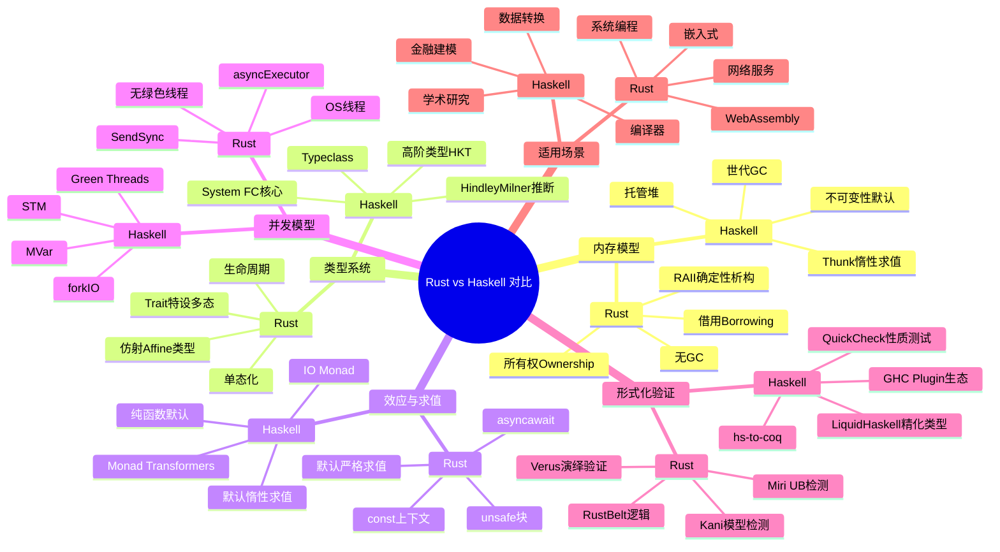

> **内容分级**: [对比级]
> **定理链**: N/A — 描述性/对比性文档，不涉及形式化定理链
>
# Rust vs Haskell：所有权/RAII 与惰性纯函数式语言的系统对比
>
> **EN**: Rust vs Haskell
> **Summary**: A comparative canonical analysis of Rust and Haskell across memory management, type systems, effects, concurrency, formal verification, and expressiveness.
> **Rust 版本**: 1.97.0+ (Edition 2024)
> **受众**: [进阶]
> **Bloom 层级**: L5
> **权威来源**: 本文件为 `concept/` 权威页。
> **定位**: 从**内存模型**、**类型系统**、**效应系统**、**并发模型**、**形式化验证**与**适用场景**六个维度，系统对比 Rust 与 Haskell 的设计哲学与工程权衡。本文是对 [Paradigm Matrix](../00_paradigms/01_paradigm_matrix.md) 中「函数式编程 vs 系统编程」交叉视角的 pairwise 深化，不重复该矩阵的通用范式定义。
> **前置概念**: [Traits](../../02_intermediate/00_traits/01_traits.md) · [Type System](../../01_foundation/02_type_system/01_type_system.md) · [Concurrency](../../03_advanced/00_concurrency/01_concurrency.md)
> **后置概念**: [Paradigm Matrix](../00_paradigms/01_paradigm_matrix.md)

---

> **来源**: [The Rust Programming Language](https://doc.rust-lang.org/book/title-page.html) · [Rust Reference](https://doc.rust-lang.org/reference/introduction.html) · [Haskell.org](https://www.haskell.org/) · [GHC User's Guide](https://downloads.haskell.org/ghc/latest/docs/html/users_guide/) · [Jung et al. — RustBelt: Securing the Foundations of Rust](https://plv.mpi-sws.org/rustbelt/popl18/) · [Liquid Haskell](https://arxiv.org/abs/2001.10820) · [Linear Haskell](https://arxiv.org/abs/1710.09756)
> **前置依赖**: [Type Theory](../../04_formal/00_type_theory/01_type_theory.md)

## 📑 目录

- [Rust vs Haskell：所有权/RAII 与惰性纯函数式语言的系统对比](#rust-vs-haskell所有权raii-与惰性纯函数式语言的系统对比)
  - [📑 目录](#-目录)
  - [概述](#概述)
  - [思维导图](#思维导图)
  - [核心维度对比](#核心维度对比)
  - [内存模型](#内存模型)
    - [3.1 Rust：编译期所有权与 RAII](#31-rust编译期所有权与-raii)
    - [3.2 Haskell：托管堆、分代 GC 与惰性求值](#32-haskell托管堆分代-gc-与惰性求值)
    - [3.3 空间与时间权衡](#33-空间与时间权衡)
  - [类型系统](#类型系统)
    - [4.1 Trait vs Typeclass：两种特设多态](#41-trait-vs-typeclass两种特设多态)
    - [4.2 System F 与 Hindley–Milner：形式化根基](#42-system-f-与-hindleymilner形式化根基)
    - [4.3 单态化 vs GC'd 多态](#43-单态化-vs-gcd-多态)
    - [4.4 高阶类型：Haskell 的杀手级抽象](#44-高阶类型haskell-的杀手级抽象)
  - [并发模型](#并发模型)
    - [5.1 Rust：所有权驱动的线程安全](#51-rust所有权驱动的线程安全)
    - [5.2 Haskell：Green Threads 与 STM](#52-haskellgreen-threads-与-stm)
    - [5.3 并发模型对比](#53-并发模型对比)
  - [效应系统](#效应系统)
    - [6.1 Rust：词法/上下文显式效应](#61-rust词法上下文显式效应)
    - [6.2 Haskell：单子与纯函数默认](#62-haskell单子与纯函数默认)
    - [6.3 效应模型对比](#63-效应模型对比)
  - [形式化与验证](#形式化与验证)
    - [7.1 Rust 验证工具链](#71-rust-验证工具链)
    - [7.2 Haskell 验证工具链](#72-haskell-验证工具链)
    - [7.3 验证方向对比](#73-验证方向对比)
  - [表达力：仿射类型、经典类型与 Linear Haskell](#表达力仿射类型经典类型与-linear-haskell)
    - [8.1 Rust 的仿射类型与资源控制](#81-rust-的仿射类型与资源控制)
    - [8.2 Haskell 的经典类型与高阶抽象](#82-haskell-的经典类型与高阶抽象)
    - [8.3 Linear Haskell：在 Haskell 中引入线性类型](#83-linear-haskell在-haskell-中引入线性类型)
  - [生态与适用场景](#生态与适用场景)
    - [9.1 Rust 的典型领域](#91-rust-的典型领域)
    - [9.2 Haskell 的典型领域](#92-haskell-的典型领域)
    - [9.3 场景适用矩阵](#93-场景适用矩阵)
  - [反命题/边界](#反命题边界)
    - [10.1 Rust 不适合的场景](#101-rust-不适合的场景)
    - [10.2 Haskell 不适合的场景](#102-haskell-不适合的场景)
    - [10.3 常见误解澄清](#103-常见误解澄清)
  - [来源与延伸阅读](#来源与延伸阅读)
    - [国际权威参考](#国际权威参考)
    - [相关概念](#相关概念)
    - [权威来源索引](#权威来源索引)
  - [对应测验](#对应测验)

---

## 概述

Rust 与 Haskell 是两种静态强类型语言，却站在编程语言设计的两个极端：

- **Rust** 以**编译期所有权（ownership）**、**仿射类型（affine types）**和**无垃圾回收（GC-free）**的 RAII 语义为核心，目标是在不牺牲运行时性能的前提下提供内存与线程安全。
- **Haskell** 以**纯函数式（purely functional）**、**默认惰性求值（lazy evaluation by default）**和**高阶类型（higher-kinded polymorphism）**为核心，通过强大的类型抽象与托管运行时（generational GC、green threads、STM）提升表达力与组合能力。

两者都拒绝传统的 null 指针与 unchecked 异常，都支持代数数据类型（ADT）与模式匹配，都通过类型系统承载大量程序不变量。但它们的「安全债务」支付方式截然相反：

| 债务维度 | Rust | Haskell |
|---|---|---|
| 内存安全 | 编译期借用/所有权检查 | 运行时不可变数据 + GC |
| 线程安全 | 编译期 `Send`/`Sync` trait | 不可变性 + STM/MVar |
| 副作用 | 通过 `unsafe`/`async`/`const` 等上下文显式标记 | 通过 `IO` monad 与类型类显式封装 |
| 抽象代价 | 单态化零成本抽象 | 字典传递/惰性 thunk 的运行时成本 |

> **关键洞察**：Rust 将复杂性前移到编译期，换取可预测的延迟与内存布局；Haskell 将复杂性托管给运行时与惰性求值器，换取更高的抽象层级与组合弹性。
>
> **与 Paradigm Matrix 的关系**：`concept/05_comparative/00_paradigms/01_paradigm_matrix.md` 给出函数式、命令式、系统级、托管运行时的通用分类；本文聚焦 Rust 与 Haskell 这一对具体语言，补充范式矩阵无法覆盖的实现细节、工程权衡与形式化工具链差异。

---

## 思维导图



> **认知功能**：该思维导图将 Rust 与 Haskell 的对比组织为「内存—类型—效应—并发—验证—场景」六层，便于定位每一小节在整体图景中的位置。

---

## 核心维度对比

下表从实现策略、类型理论、运行时与工程生态四个层面，对 Rust 与 Haskell 进行快速对照。表中每一行的描述都将在后续小节展开。

| 维度 | Rust | Haskell | 关键观察 |
|---|---|---|---|
| **核心隐喻** | 所有权 + RAII + 零成本抽象 | 纯函数 + 惰性求值 + 高阶抽象 | Rust 偏向「系统构建」，Haskell 偏向「逻辑表达」 |
| **内存管理** | 编译期所有权与借用；无 GC | 托管堆 + 分代 GC | Rust 延迟可预测；Haskell 开发者负担低但存在 GC 暂停 |
| **默认求值策略** | 严格求值（迭代器惰性是库级行为） | 默认惰性求值（可用 `!`/`seq` 强制严格） | Haskell 的 thunk 可能带来空间泄漏；Rust 求值顺序直观 |
| **参数多态实现** | 单态化（零成本）+ trait object vtable | 类型类字典传递 + GHC 特化优化 | Rust 静态分发更贴近 C++ 模板；Haskell 更灵活但默认有运行时开销 |
| **特设多态机制** | `trait` + `impl`（结构化，无继承） | `typeclass` + `instance`（支持 MPTC、类型族） | 两者都类似 typeclass，但 Rust trait 不支持高阶类型直接抽象 |
| **高阶类型 HKT** | 不直接支持；可用 GAT/`impl Trait` 模拟 | 原生支持；`Functor f`、`Monad m` 等 | Haskell 的类型构造器抽象是函数式编程的基础 |
| **生命周期/线性** | 显式生命周期标注 + 仿射类型 | 无显式生命周期；Linear Haskell 提供线性箭头 | Rust 的借用检查是语言核心；Haskell 线性类型是可选扩展 |
| **效应系统** | 词法效应：`unsafe`、`async`、`const` | 单子效应：`IO`、`Reader`、`State`、`Except` 等 | Rust 的效应是上下文标记；Haskell 将效应编码为类型 |
| **并发抽象** | `std::thread` + `Send`/`Sync` + `async`/executor | `forkIO` green threads + `STM` + `MVar` | Haskell 运行时提供 M:N 调度；Rust 依赖异步执行器或 OS 线程 |
| **形式化验证** | Kani、Verus、Miri、RustBelt | Liquid Haskell、hs-to-coq、GHC 插件 | Rust 侧重内存安全与并发协议；Haskell 侧重精化类型与程序等价 |
| **运行时体积/延迟** | 无运行时；可裁剪至嵌入式 | GHC 运行时较大；GC 可能引入暂停 | Rust 更适合延迟敏感型嵌入式与系统软件 |
| **主要优势** | 性能、内存安全、可控布局、可预测性 | 表达力、抽象组合、惰性、学术验证 | 两者互补：Rust 做底层，Haskell 做高层转换 |
| **主要代价** | 学习曲线陡峭、编译时间长、借用限制 | GC 暂停、惰性空间泄漏、运行时依赖、二进制大 | 选择取决于延迟预算与抽象需求 |

> **来源**: [Rust Reference — Ownership](https://doc.rust-lang.org/book/ch04-00-understanding-ownership.html) · [GHC User's Guide — Strictness](https://downloads.haskell.org/ghc/latest/docs/html/users_guide/exts/strict.html) · [GHC User's Guide — Linear Types](https://downloads.haskell.org/ghc/latest/docs/html/users_guide/exts/linear_types.html)

---

## 内存模型

### 3.1 Rust：编译期所有权与 RAII

Rust 的内存安全不依赖运行时检查，而是依赖**借用检查器（borrow checker）**在编译期验证以下三条规则：

1. 每个值在任一时刻有且仅有一个所有者（owner）。
2. 要么存在任意数量的不可变引用 `&T`，要么存在唯一一个可变引用 `&mut T`，二者不可同时存在。
3. 引用必须总是有效的，不能出现悬垂引用（dangling references）。

这三条规则通过**生命周期（lifetime）**参数化，编译器据此推断引用的有效范围。当所有者离开作用域时，Rust 调用 `Drop::drop` 进行**确定性析构**，这就是 RAII（Resource Acquisition Is Initialization）。

```rust
fn ownership_demo() {
    let s = String::from("hello");   // s 是堆字符串的所有者
    let r1 = &s;                     // 不可变借用 OK
    let r2 = &s;                     // 多个不可变借用 OK
    println!("{} {}", r1, r2);
    // let r3 = &mut s;              // ERROR：不能同时拥有可变借用
    let t = s;                       // 所有权 move 给 t
    // println!("{}", s);            // ERROR：s 已失效
    println!("{}", t);
} // t 在此离开作用域，drop 被确定性调用
```

> **关键洞察**：Rust 将「何时释放资源」的决策前移到编译期，因此运行时没有 GC 线程、没有 stop-the-world，也没有隐式的堆遍历。
>
> **来源**: [TRPL — Understanding Ownership](https://doc.rust-lang.org/book/ch04-00-understanding-ownership.html) · [Rust Reference — Ownership](https://doc.rust-lang.org/book/ch04-00-understanding-ownership.html)

### 3.2 Haskell：托管堆、分代 GC 与惰性求值

Haskell 默认**纯函数式且不可变（immutable）**，所有堆对象的生命周期由 GHC 运行时（RTS）的分代垃圾回收器管理。开发者不需要显式释放内存；GC 在堆满或显式触发时回收不可达对象。

与 Rust 的严格求值不同，Haskell 采用**默认惰性求值（call-by-need）**：表达式在被强制求值之前以 **thunk**（未求值的闭包）形式存在，求值后结果会被记忆化（memoized）以避免重复计算。

```haskell
-- ints 是一个无限列表，但在未被消费前它只是一个 thunk
ints :: [Int]
ints = [1..]

main :: IO ()
main = do
    let xs = ints           -- 没有实际分配 1.. 的所有元素
    print (take 5 xs)       -- 强制求值前 5 个元素
    print (take 5 xs)       -- 第二次使用已记忆化的结果
```

> **重要澄清**：Haskell 没有 Rust 式的所有权类型；内存管理完全由 GC 负责。即使使用 `LinearTypes` 扩展，线性 Haskell 也只是可选的类型系统扩展，并未替代 GC。
>
> **来源**: [GHC User's Guide — Garbage Collection](https://downloads.haskell.org/ghc/latest/docs/html/users_guide/runtime_control.html#garbage-collection) · [Haskell.org — Lazy Evaluation](https://www.haskell.org/tutorial/functions.html)

### 3.3 空间与时间权衡

| 方面 | Rust | Haskell |
|---|---|---|
| **延迟可预测性** | 高；无 GC 暂停，析构确定性 | 中低；GC 可能引入停顿，lazy thunk 可能导致意外延迟 |
| **空间泄漏风险** | 低（除非 `Rc`/`Arc` 循环或 `mem::forget`） | 高；thunk 累积是常见空间泄漏来源 |
| **堆布局控制** | 精确；可控制栈/堆、对齐、内存池 | 抽象；由 RTS 与惰性求值器决定 |
| **共享可变状态** | 通过 `&mut` 或 `Mutex` 显式管理 | 默认不可变；可变状态用 `IORef`/`TVar`/`MVar` |
| **零成本抽象** | 是；泛型单态化后无运行时开销 | 否默认；抽象常通过字典/thunk 实现 |

> **边界案例**：Rust 中可以通过 `std::mem::forget` 或 `Rc`/`Arc` 循环造成内存泄漏，但这不是借用检查器的失败，而是显式选择或运行时引用计数无法回收的循环；Haskell 中则可能因为 `sum [1..1000000]` 等 thunk 链导致栈溢出或空间泄漏，需用 `seq` 或 `BangPatterns` 打破惰性。
>
> **来源**: [GHC User's Guide — Strictness](https://downloads.haskell.org/ghc/latest/docs/html/users_guide/exts/strict.html) · [Rust Reference — The Drop Trait](https://doc.rust-lang.org/reference/destructors.html)

---

## 类型系统

### 4.1 Trait vs Typeclass：两种特设多态

Rust 的 `trait` 与 Haskell 的 `typeclass` 都实现**特设多态（ad-hoc polymorphism）**：同一操作名可以根据类型有不同的实现。两者在语法上高度相似，但语义与扩展性存在显著差异。

**Rust trait**：

```rust
pub trait Semigroup {
    fn combine(self, other: Self) -> Self;
}

impl Semigroup for i32 {
    fn combine(self, other: Self) -> Self {
        self + other
    }
}

fn mconcat<T: Semigroup>(x: T, y: T, z: T) -> T {
    x.combine(y).combine(z)
}
```

**Haskell typeclass**：

```haskell
class Semigroup a where
    (<>) :: a -> a -> a

instance Semigroup Int where
    (<>) = (+)

mconcat :: Semigroup a => a -> a -> a -> a
mconcat x y z = x <> y <> z
```

| 特性 | Rust `trait` | Haskell `typeclass` |
|---|---|---|
| **实现方式** | 结构化实现；无继承 | 名义式 instance；无继承 |
| **关联类型** | `type Output;` | `type family` / `associated type` |
| **多参数** | 单参数为主；可用 generic associated types 模拟 | 原生支持 MPTC + functional dependencies |
| **默认实现** | 支持默认方法 | 支持 default signatures |
| **孤儿规则** | 严格：trait 或类型至少一个定义在当前 crate | 相对宽松，但重叠 instance 需用 `OVERLAPPABLE` 等处理 |
| **高阶类型** | 不直接支持 | 原生支持 `Functor f` 中的 `f :: * -> *` |

> **关键洞察**：Rust trait 的设计目标是为零成本抽象服务，因此默认走向单态化；Haskell typeclass 的设计目标是为高阶抽象服务，因此默认走向字典传递，并允许更灵活的类型级编程。
>
> **来源**: [Rust Reference — Traits](https://doc.rust-lang.org/reference/items/traits.html) · [Haskell 2010 Report — Type Classes](https://www.haskell.org/onlinereport/haskell2010/haskellch4.html#x10-750004.3)

### 4.2 System F 与 Hindley–Milner：形式化根基

Haskell 的表面类型系统基于 **Hindley–Milner（HM）** 类型推断，并可通过语言扩展支持高秩类型（rank-N types）、GADT、类型族等。GHC 编译后的中间语言 **Core** 是一种 **System FC** 变体，即在 System F 基础上加入显式类型强制（coercions），用于表达 GADT 与类型族等扩展。

Rust 的类型系统**不是 HM 系统**：它采用基于约束的局部类型推断，要求函数签名显式写出大部分类型参数与生命周期。其形式化模型更接近「System F + 区域类型（region types） + 线性/仿射类型」，并通过对 trait 的约束求解实现特设多态。RustBelt 使用 **Iris 分离逻辑** 证明了 Rust 子集在所有权与生命周期下的安全性。

> **准确表述**：不应说「Rust 的类型系统就是 System F」，也不应说「Haskell 的类型系统只是 HM」。Rust 是 HM 与 System F 之外的第三类设计；Haskell 的表面是 HM，核心是 System FC。
>
> **来源**: [Jung et al. — RustBelt](https://plv.mpi-sws.org/rustbelt/popl18/) · [System FC: Equality Constraints and Coercions](https://www.microsoft.com/en-us/research/publication/system-f-with-type-equality-coercions/)

### 4.3 单态化 vs GC'd 多态

Rust 对泛型函数和 trait 泛型参数采用**单态化（monomorphization）**：为每个具体类型生成一份专用代码。这消除了运行时分发开销，但也增加了编译时间与二进制体积。

```rust
fn identity<T>(x: T) -> T { x }

fn main() {
    let _ = identity(42i32);    // 生成 identity::<i32>
    let _ = identity("hi");     // 生成 identity::<&str>
}
```

Haskell 默认对多态函数采用**字典传递（dictionary passing）**：每个类型类约束在运行时对应一个包含方法指针的字典。例如 `mconcat :: Semigroup a => ...` 会额外接收一个 `Semigroup a` 字典参数。GHC 可以通过 `INLINEABLE` 与 `-fspecialise` 在特定调用点进行特化，但这属于优化而非默认语义。

```haskell
-- 默认行为：运行时传递 Semigroup 字典
-- GHC 可在优化阶段特化，但语义上仍是多态
mconcat :: Semigroup a => a -> a -> a -> a
mconcat x y z = x <> y <> z
```

| 维度 | Rust 单态化 | Haskell 字典传递 |
|---|---|---|
| **运行时开销** | 无（静态分发） | 字典查找；可优化消除 |
| **二进制体积** | 大（每类型一份代码） | 小（共享多态代码） |
| **编译时间** | 长 | 短 |
| **动态分发** | `dyn Trait` vtable | 始终可字典传递；也可 `INLINABLE` 特化 |
| **抽象泄漏** | 低 | 高（单态化失败时性能骤降） |

> **来源**: [Rust Reference — Generic Parameters](https://doc.rust-lang.org/reference/items/generics.html) · [GHC User's Guide — Specialisation](https://downloads.haskell.org/ghc/latest/docs/html/users_guide/exts/rewrite_rules.html)

### 4.4 高阶类型：Haskell 的杀手级抽象

Haskell 原生支持**高阶类型（Higher-Kinded Types, HKT）**，即类型构造器本身可以作为参数。这是 `Functor`、`Applicative`、`Monad`、`Traversable` 等抽象能够跨列表、`Maybe`、`IO` 等容器统一表达的基础。

```haskell
class Functor f where
    fmap :: (a -> b) -> f a -> f b

instance Functor [] where
    fmap = map

instance Functor Maybe where
    fmap _ Nothing  = Nothing
    fmap f (Just x) = Just (f x)
```

Rust 目前**不支持直接对类型构造器进行抽象**。例如无法定义 `trait Functor<F<_>>`。Rust 社区通过以下方式模拟：

- **泛型关联类型（GATs）**：让 trait 的关联类型携带自己的泛型参数。
- **高阶 trait bounds（HRTB）**：对生命周期进行高阶量化。
- **`impl Trait` / `type_alias_impl_trait`**：隐藏返回类型中的高阶结构。

```rust
// Rust 中无法直接写 trait Functor<F<_>>，但可用 GAT 部分模拟
pub trait Functor {
    type Item;
    type Mapped<B>: Functor<Item = B>;
    fn map<B, F: Fn(Self::Item) -> B>(self, f: F) -> Self::Mapped<B>;
}
```

> **关键洞察**：HKT 使 Haskell 在表达「容器/上下文/效应」这类高阶抽象时更为自然；Rust 由于缺乏 HKT，通常需要生成式宏、具体容器类型或 `impl Trait` 来近似，代码更冗长但更贴近最终机器表示。
>
> **来源**: [GHC User's Guide — Kind Polymorphism](https://downloads.haskell.org/ghc/latest/docs/html/users_guide/exts/poly_kinds.html) · [Rust RFC — Generic Associated Types](https://rust-lang.github.io/rfcs/1598-generic_associated_types.html)

---

## 并发模型

### 5.1 Rust：所有权驱动的线程安全

Rust 的并发安全同样建立在所有权与借用规则之上：

- 若类型 `T` 实现 `Send`，则其值可以安全地**转移**到另一个线程。
- 若类型 `T` 实现 `Sync`，则其引用 `&T` 可以安全地**共享**到多个线程。
- 大部分类型自动实现这两个 trait；包含 `Rc` 或裸指针的类型则不实现，从而在编译期排除数据竞争。

Rust 标准库提供**操作系统线程**（`std::thread`），并通过 `Mutex`、`RwLock`、`mpsc` 通道等原语协调共享状态。异步并发（`async`/`await`）由运行时库（如 tokio）提供，标准库本身不包含 green threads。

```rust
use std::sync::{Arc, Mutex};
use std::thread;

fn rust_shared_counter() {
    let data = Arc::new(Mutex::new(0));
    let mut handles = vec![];

    for _ in 0..10 {
        let d = Arc::clone(&data);
        handles.push(thread::spawn(move || {
            let mut v = d.lock().unwrap();
            *v += 1;
        }));
    }

    for h in handles {
        h.join().unwrap();
    }

    println!("counter = {}", *data.lock().unwrap());
}
```

> **关键洞察**：Rust 借用检查器保证了 `Mutex` 守卫（`MutexGuard`）的生命周期与锁持有期一致，从而避免「锁了但没释放」或「在锁外访问受保护数据」等低级错误。
>
> **来源**: [The Rust Programming Language — Fearless Concurrency](https://doc.rust-lang.org/book/ch16-00-concurrency.html) · [Rust Atomics and Locks](https://marabos.nl/atomics/)

### 5.2 Haskell：Green Threads 与 STM

Haskell 的运行时提供**轻量级 green threads**：`forkIO` 创建的线程由 GHC RTS 以 M:N 模型调度到少量 OS 线程上，创建成本极低（可创建数百万线程）。默认的不可变性意味着大部分数据无需同步即可安全共享。

当需要共享可变状态时，Haskell 提供两种主要抽象：

- **`MVar`**：阻塞式可变变量，类似 Rust 的 `Mutex`。
- **`STM`（Software Transactional Memory）**：将多个内存操作组合为一个原子事务，支持 `retry`/`orElse`，实现可组合的阻塞与选择。

```haskell
import Control.Concurrent.STM

transfer :: TVar Int -> TVar Int -> Int -> STM ()
transfer from to amount = do
    fromBalance <- readTVar from
    check (fromBalance >= amount)
    writeTVar from (fromBalance - amount)
    toBalance <- readTVar to
    writeTVar to (toBalance + amount)

main :: IO ()
main = do
    a <- newTVarIO 100
    b <- newTVarIO 50
    atomically $ transfer a b 30
    finalA <- atomically (readTVar a)
    print finalA   -- 输出 70
```

> **关键洞察**：STM 的「可组合性」是传统锁模型难以实现的：两个独立的 `atomically` 事务可以安全地合并为一个新事务，而锁则必须重新设计加锁顺序以避免死锁。
>
> **来源**: [Harris et al. — Composable Memory Transactions](https://www.microsoft.com/en-us/research/publication/composable-memory-transactions/) · [GHC User's Guide — Concurrent Haskell](https://downloads.haskell.org/ghc/latest/docs/html/users_guide/exts/concurrent_haskell.html)

### 5.3 并发模型对比

| 维度 | Rust | Haskell |
|---|---|---|
| **线程模型** | OS 线程（1:1） | Green threads（M:N） |
| **线程创建成本** | 高（内核资源） | 极低（用户态栈） |
| **共享状态安全** | 编译期 `Send`/`Sync` + 借用检查 | 默认不可变 + `STM`/`MVar` |
| **死锁风险** | 可能存在（如 `Mutex` 嵌套） | STM 通过事务回滚降低；`MVar` 仍可能死锁 |
| **异步模型** | `async/await` + executor（tokio 等） | 原生 `IO` monad + green threads |
| **阻塞语义** | `async` 中阻塞会钉住线程/任务 | `retry` 在 STM 中可高效阻塞不消耗 OS 线程 |

> **准确表述**：Rust 标准库**没有 green threads**（1.0 之前曾有过，但已被移除）；Haskell 的 green threads 与 STM 是 GHC RTS 的内置能力，不是可选库。

---

## 效应系统

### 6.1 Rust：词法/上下文显式效应

Rust 没有像 Haskell 那样将副作用编码为类型，而是通过**词法上下文**显式标记不同类别的效应：

- **`unsafe`**：表示当前块可能违反 Rust 的内存安全保证，需要程序员手动维护不变量。`unsafe` 不是函数类型上的效应，而是块级别的能力标记。
- **`async`**：函数返回一个 `Future`，必须通过 `.await` 或 executor 驱动才能执行。这是 Rust 中的「函数染色」机制。
- **`const`**：函数可在编译期执行，其内部只允许受限操作；`const` 上下文禁止堆分配和大多数副作用。

```rust
// async 效应：返回 Future，不会立即执行
async fn fetch(url: &str) -> String {
    format!("fetched {}", url)
}

// unsafe 效应：在 unsafe 块中可调用 unsafe 函数
unsafe fn raw_deref(ptr: *const i32) -> i32 {
    *ptr
}

// const 效应：编译期可求值
const fn double(x: i32) -> i32 {
    x * 2
}
```

> **关键洞察**：Rust 的效应系统是「可选且局部的」——普通函数默认可以执行任意副作用，只有需要特殊保证时才加上 `unsafe`、`async` 或 `const`。
>
> **来源**: [Rust Reference — Unsafe Blocks](https://doc.rust-lang.org/reference/unsafe-blocks.html) · [Async Book](https://rust-lang.github.io/async-book/)

### 6.2 Haskell：单子与纯函数默认

Haskell 采用**纯函数默认（pure by default）**：类型签名中不含 `IO` 的函数承诺不执行输入输出、不修改全局状态、不抛出非底部异常。任何副作用必须显式包装在 `IO` monad 或 `ST`、`State`、`Reader`、`Except` 等计算上下文中。

```haskell
-- pure：无效应
incrementAll :: [Int] -> [Int]
incrementAll = map (+1)

-- effectful：涉及 IO
readAndPrint :: IO ()
readAndPrint = do
    putStrLn "Enter a number:"
    line <- getLine
    let n = read line :: Int
    print (incrementAll [n])
```

Haskell 的 monad transformer 与更现代的效果系统（如 `fused-effects`、`polysemy`、`effectful`）允许在类型层面组合多种效应，而无需像传统面向对象语言那样将效应隐藏在全局可变状态中。

> **关键洞察**：Haskell 的 `IO a` 不是「不纯的值」，而是一个**描述如何产生 `a` 的动作（action）**。这种设计使纯代码与效应代码在类型上完全可分，便于推理与测试。
>
> **来源**: [Haskell 2010 Report — IO](https://www.haskell.org/onlinereport/haskell2010/haskellch7.html) · [GHC User's Guide — Monad Transformers](https://downloads.haskell.org/ghc/latest/docs/html/users_guide/exts/monad_comprehensions.html)

### 6.3 效应模型对比

| 维度 | Rust | Haskell |
|---|---|---|
| **默认语义** | 命令式、严格、可含副作用 | 纯函数、惰性、无副作用 |
| **副作用显式化** | `unsafe`/`async`/`const` 上下文 | `IO`、`State`、`Reader` 等 monad |
| **类型级追踪** | 较弱；`async` 在返回类型中可见，`unsafe` 不可见 | 强；`IO a` 与 `a` 在类型上区分 |
| **函数染色** | `async` 具有明显的调用方染色 | 任意纯函数可自由调用；只有 `IO` 需要 `lift` |
| **测试友好性** | 普通函数可测试；`async` 需 executor | 纯函数天然可测试；`IO` 可用 transformer  mock |
| **惰性交互** | 无；Rust 严格求值 | 惰性只影响纯代码；`IO` 顺序由 do 记法显式控制 |

> **准确表述**：Rust 中普通函数默认是**不纯的**（可执行任意副作用），而 Haskell 中普通函数默认是**纯的**。不要把 Rust 的 `unsafe` 与 Haskell 的 `IO` 等同：`unsafe` 是关于内存安全的能力，`IO` 是关于副作用的追踪。

---

## 形式化与验证

### 7.1 Rust 验证工具链

Rust 的验证生态主要围绕**内存安全、未定义行为（UB）与并发协议**展开：

- **Kani**：基于 CBMC 的模型检查器，可为 unsafe Rust 代码生成反例。通过在函数上加 `#[kani::proof]`，可以验证断言在所有输入下成立。
- **Verus**：基于 Z3 的演绎验证工具，支持前置条件、后置条件、循环不变量与所有权规范。
- **Miri**：Rust 的中间表示解释器，用于检测未定义行为（如越界、use-after-free、违反 stacked borrows/tree borrows）。
- **RustBelt**：使用 Iris 分离逻辑在 Coq 中形式化证明 Rust 的 `unsafe` 代码指南，是 Rust 内存模型的理论基础。

```rust
// Kani 示例：验证 u32 加法在假设无溢出时满足交换律
#[cfg(kani)]
#[kani::proof]
fn add_commutative() {
    let a: u32 = kani::any();
    let b: u32 = kani::any();
    kani::assume(a.checked_add(b).is_some());
    assert_eq!(a + b, b + a);
}
```

> **来源**: [Kani Documentation](https://model-checking.github.io/kani/) · [Verus Guide](https://verus-lang.github.io/verus/guide/) · [Miri README](https://github.com/rust-lang/miri) · [RustBelt](https://plv.mpi-sws.org/rustbelt/popl18/)

### 7.2 Haskell 验证工具链

Haskell 的验证生态更偏向**精化类型、程序等价与编译器级验证**：

- **Liquid Haskell**：在 Haskell 类型之上增加 SMT 可判的精化类型，例如 `{v:Int | v > 0}`。它通过 GHC 插件在编译期验证规范。
- **hs-to-coq**：将 Haskell 子集翻译到 Coq，以进行任意复杂度的形式化证明。
- **GHC Plugin 生态**：如 `inspection-testing` 可在编译期验证优化规则是否生效；类型检查器插件可扩展 GHC 的约束求解。
- **QuickCheck / Hedgehog**：基于属性的随机测试，虽然不是完全形式化，但与 LiquidHaskell 形成「轻—重」互补。

```haskell
{-@ type Pos = {v:Int | v > 0} @-}

{-@ addPos :: Pos -> Pos -> Pos @-}
addPos :: Int -> Int -> Int
addPos x y = x + y
```

> **来源**: [Liquid Haskell Paper](https://arxiv.org/abs/2001.10820) · [Liquid Haskell Blog](https://ucsd-progsys.github.io/liquidhaskell-blog/) · [hs-to-coq](https://github.com/plclub/hs-to-coq) · [GHC User's Guide — Plugins](https://downloads.haskell.org/ghc/latest/docs/html/users_guide/exts/plugins.html)

### 7.3 验证方向对比

| 维度 | Rust 验证 | Haskell 验证 |
|---|---|---|
| **核心关注点** | 内存安全、UB、所有权协议、并发 | 精化类型、程序等价、类型级不变量 |
| **典型工具** | Kani / Verus / Miri / RustBelt | Liquid Haskell / hs-to-coq / GHC plugins |
| **验证粒度** | 函数/模块级；Miri 可逐行执行 | 函数/模块级；可连接 Coq 做任意深度证明 |
| **与编译器集成** | Kani/Verus 作为外部工具；Miri 使用 rustc 内部 | Liquid Haskell 作为 GHC 插件，直接融入编译流程 |
| **自动化程度** | 高（SMT/模型检查） | 中高（SMT 精化类型）+ 低（Coq 人工证明） |
| **适用代码** | unsafe/底层/并发代码 | 纯函数/数据结构/业务不变量 |

> **关键洞察**：Rust 的形式化工具首先回答「这段代码是否安全」；Haskell 的形式化工具首先回答「这段代码是否满足规范」。两者关注的「正确性」层级不同，但都借助类型系统作为验证入口。

---

## 表达力：仿射类型、经典类型与 Linear Haskell

### 8.1 Rust 的仿射类型与资源控制

Rust 的 Ownership/Borrowing 本质上是**仿射类型（affine types）**的工程实现：一个值最多只能被使用一次（move），之后原变量失效。这种限制带来了两类能力：

1. **确定性资源管理**：文件句柄、锁、内存可以在编译期追踪，确保不会 double-free 或 use-after-free。
2. **别名与可变性的解耦**：在任意时刻，要么存在多个只读别名，要么存在一个可变别名，从而消除数据竞争。

```rust
fn consume(v: Vec<i32>) -> Vec<i32> {
    v
}

fn affine_demo() {
    let v = vec![1, 2, 3];
    let v2 = consume(v);
    // println!("{:?}", v);   // ERROR: value moved
    println!("{:?}", v2);
}
```

> **关键洞察**：仿射类型牺牲了一部分表达自由（不能随意共享和复制），换取了对资源生命周期和内存布局的精确控制。
>
> **来源**: [Rust Reference — Moved and Copy Types](https://doc.rust-lang.org/book/ch04-00-understanding-ownership.html#moved-and-copied-types)

### 8.2 Haskell 的经典类型与高阶抽象

Haskell 默认采用**经典类型（classical types）**：值可以被任意复制、共享和延迟求值，没有使用次数的限制。这种自由使得高阶抽象极为自然：

- `Functor`、`Monad`、`Foldable`、`Traversable` 等抽象可以跨越列表、树、`Maybe`、`Either`、`IO` 等类型构造器统一表达。
- 类型族（type families）与 GADT 允许在类型层面进行几乎任意的计算。

```haskell
-- 任意共享与组合，无需担心资源生命周期
twice :: (a -> a) -> a -> a
twice f x = f (f x)

main :: IO ()
main = print (twice (*2) 5)   -- 输出 20
```

> **关键洞察**：Haskell 的表达力来自类型层面的抽象自由，而非运行时的资源控制。它更适合描述「什么」而非「如何管理内存」。

### 8.3 Linear Haskell：在 Haskell 中引入线性类型

**Linear Haskell** 是 GHC 的实验性扩展，通过**线性箭头 `a ->. b`** 表示函数必须恰好使用其参数一次。它让 Haskell 可以表达类似 Rust 的资源协议，但**并不替代 GC**，也不改变 Haskell 默认的惰性求值。

```haskell
{-# LANGUAGE LinearTypes #-}

-- 必须恰好使用 x 一次
useOnce :: a ->. a
useOnce x = x

-- 如果使用两次或零次，编译器报错
-- useTwice :: a ->. (a, a)
-- useTwice x = (x, x)   -- ERROR: linear type mismatch
```

| 维度 | Rust 仿射类型 | Haskell 经典类型 | Linear Haskell |
|---|---|---|---|
| **默认语义** | 默认 move/affine | 默认无限制共享 | 默认无限制；线性箭头显式启用 |
| **资源管理** | 确定性析构；无 GC | GC 管理 | 仍由 GC 管理 |
| **别名控制** | 编译期强制 | 无限制 | 线性参数可限制使用次数 |
| **高阶抽象** | 受限（无 HKT） | 非常丰富 | 与 Haskell 类型系统兼容 |
| **使用场景** | 系统编程、嵌入式 | 编译器、数据流、研究 | 协议、资源句柄、线性逻辑研究 |

> **准确表述**：Linear Haskell 让 Haskell 可以表达「使用一次」的协议，但它仍然运行在 GHC 运行时之上，堆对象仍由 GC 回收。Rust 的仿射类型是语言核心，直接决定内存布局与生命周期。
>
> **来源**: [Linear Haskell](https://arxiv.org/abs/1710.09756) · [GHC User's Guide — Linear Types](https://downloads.haskell.org/ghc/latest/docs/html/users_guide/exts/linear_types.html)

---

## 生态与适用场景

### 9.1 Rust 的典型领域

Rust 的设计目标决定了它在以下场景具有不可替代性：

- **系统软件与操作系统**：如 Redox OS、这些场景需要直接控制内存布局与中断处理。
- **嵌入式与裸机**：`no_std` 生态允许在微控制器上运行无堆分配的 Rust。
- **网络服务与基础设施**：tokio/hyper 提供高性能异步 IO；AWS Firecracker、Cloudflare 的代理栈使用 Rust。
- **WebAssembly**：Rust 的 zero-cost 抽象与 `wasm32` 目标使其成为 WASM 宿主/客户端开发的主流语言。
- **游戏引擎与图形**：Bevy、wgpu 等利用 Rust 的所有权管理 GPU 资源。

> **来源**: [Rust Embedded Book](https://doc.rust-lang.org/stable/embedded-book/) · [Tokio](https://tokio.rs/) · [WebAssembly Rust Book](https://rustwasm.github.io/book/)

### 9.2 Haskell 的典型领域

Haskell 的抽象能力与惰性求值使其在以下领域表现突出：

- **编译器与语言工具**：GHC 本身、Pandoc 文档转换器、HLint 等。
- **数据转换与 ETL**：管道式函数组合、强类型保证中间格式正确性。
- **金融建模与定量分析**：强类型与精化类型可编码复杂的业务不变量。
- **区块链与智能合约**：Cardano 的 Plutus 平台使用 Haskell 进行链上/链下程序开发。
- **学术研究与教学**：类型理论、范畴论、函数式编程课程的标准载体。

> **来源**: [Haskell.org — Industrial Users](https://wiki.haskell.org/Haskell_in_industry) · [Pandoc](https://pandoc.org/) · [Cardano Plutus](https://plutus.readthedocs.io/)

### 9.3 场景适用矩阵

| 场景 | 推荐语言 | 理由 |
|---|---|---|
| 操作系统/内核 | Rust | 无运行时、确定性内存、可直接操作硬件 |
| 实时/嵌入式（µs 级延迟） | Rust | 无 GC 暂停、可裁剪运行时 |
| 高并发网络代理 | Rust | async executor + 零成本抽象 |
| WebAssembly 模块 | Rust | 成熟工具链与无运行时输出 |
| 编译器前端/DSL | Haskell | ADT、模式匹配、惰性树遍历、类型推断 |
| 数据流/ETL 管道 | Haskell | 高阶组合、惰性流、强类型 |
| 金融合约/精化类型验证 | Haskell | Liquid Haskell 可编码复杂不变量 |
| 学术研究/类型理论原型 | Haskell | 最接近现代类型理论的实用语言 |
| 需要兼顾性能与安全的 CLI | Rust | 单二进制、快速启动、低内存占用 |
| 需要快速原型与高度抽象的 Web 后端 | Haskell | Yesod/Servant 的类型安全路由与模板 |

> **关键洞察**：Rust 与 Haskell 并非零和替代，而是互补的「底层-顶层」组合：Rust 负责资源敏感、延迟敏感的底层；Haskell 负责抽象密集、验证密集的顶层转换。

---

## 反命题/边界

### 10.1 Rust 不适合的场景

- **极度依赖高阶类型抽象**：如通用 `Functor`/`Monad` 变换器库，Rust 需要大量模板代码或宏来模拟。
- **快速探索性数据分析**：借用检查器会在早期原型阶段成为摩擦。
- **默认惰性算法**：Rust 的迭代器惰性是库级行为，不能像 Haskell 一样在语言级无限延迟表达式。
- **需要极短编译迭代的脚本**：Rust 编译时间相对较长，不适合一次性脚本（除非使用 `cargo script`）。

### 10.2 Haskell 不适合的场景

- **硬实时系统**：GC 暂停与惰性求值的不可预测延迟难以满足严格截止时间。
- **资源极度受限的嵌入式**：GHC 运行时体积与内存占用远超 `no_std` Rust。
- **需要精确内存布局**：Haskell 抽象掉对象布局，难以像 Rust 一样控制 struct 字段对齐。
- **对启动时间敏感的可执行文件**：GHC 生成的二进制通常较大，启动需要初始化 RTS。
- **默认严格求值需求**：Haskell 的惰性默认可能导致空间泄漏，需要显式 `BangPatterns`/`seq`/`strict` 调整。

### 10.3 常见误解澄清

| 误解 | 正确表述 |
|---|---|
| Haskell 有 Rust 式的所有权类型 | Haskell 默认没有所有权类型；内存由 GC 管理。Linear Haskell 只是可选扩展 |
| Rust 默认惰性求值 | Rust 默认严格求值；只有迭代器等库结构提供惰性 |
| Rust 的 `unsafe` 等价于 Haskell 的 `IO` | `unsafe` 是内存安全能力标记；`IO` 是副作用追踪；二者语义不同 |
| Haskell 的 STM 会回滚任意副作用 | STM 只回滚 `TVar` 事务内的内存写入；外部 `IO` 不应放在 `atomically` 中 |
| Rust trait 完全等同于 Haskell typeclass | 两者相似，但 Rust trait 不支持高阶类型直接抽象，默认单态化 |

> **关键洞察**：每一种语言的设计都是一种**权衡的外在化**。Rust 用编译期约束换取运行时确定性；Haskell 用运行时管理与惰性换取抽象高度。理解边界，比争论「谁更好」更有价值。

---

## 来源与延伸阅读

### 国际权威参考

- [The Rust Programming Language](https://doc.rust-lang.org/book/title-page.html)
- [Rust Reference](https://doc.rust-lang.org/reference/introduction.html)
- [RustBelt: Securing the Foundations of Rust](https://plv.mpi-sws.org/rustbelt/popl18/)
- [The Async Book](https://rust-lang.github.io/async-book/)
- [Rust Embedded Book](https://doc.rust-lang.org/stable/embedded-book/)
- [Haskell.org](https://www.haskell.org/)
- [Haskell 2010 Language Report](https://www.haskell.org/onlinereport/haskell2010/)
- [GHC User's Guide](https://downloads.haskell.org/ghc/latest/docs/html/users_guide/)
- [Composable Memory Transactions (Harris et al.)](https://www.microsoft.com/en-us/research/publication/composable-memory-transactions/)
- [Liquid Haskell Paper (Vazou et al.)](https://arxiv.org/abs/2001.10820)
- [Linear Haskell Paper (Bernardy et al.)](https://arxiv.org/abs/1710.09756)
- [System FC: Equality Constraints and Coercions](https://www.microsoft.com/en-us/research/publication/system-f-with-type-equality-coercions/)

### 相关概念

- [Traits](../../02_intermediate/00_traits/01_traits.md)
- [Type System](../../01_foundation/02_type_system/01_type_system.md)
- [Concurrency](../../03_advanced/00_concurrency/01_concurrency.md)
- [Paradigm Matrix](../00_paradigms/01_paradigm_matrix.md)

### 权威来源索引

| 引用主题 | 权威来源 |
|---|---|
| Rust 所有权与借用 | Rust Reference / TRPL |
| Rust 形式化基础 | Jung et al. — RustBelt |
| Haskell 惰性求值与 GC | GHC User's Guide / Haskell.org |
| Haskell 类型类与 HM | Haskell 2010 Report / GHC User's Guide |
| Haskell STM | Harris et al. — Composable Memory Transactions |
| Liquid Haskell | Vazou et al. — Refinement Types for Haskell |
| Linear Haskell | Bernardy et al. — Linear Haskell |
| Rust async | Rust Async Book |

> **最后更新**: 2026-07-16 · 对齐 Rust 1.97.0 stable / GHC 9.12+

---

## 对应测验

完成 [L3 语义模型与跨语言对比测验](../../03_advanced/00_concurrency/10_quiz_semantic_models.md) 验证对 Rust vs Haskell（含 STM §5.2）、代数效应、依赖/细化类型、分布式共识与语言语义模型矩阵的掌握程度（15 题：🟢3 / 🟡10 / 🔴2）。
