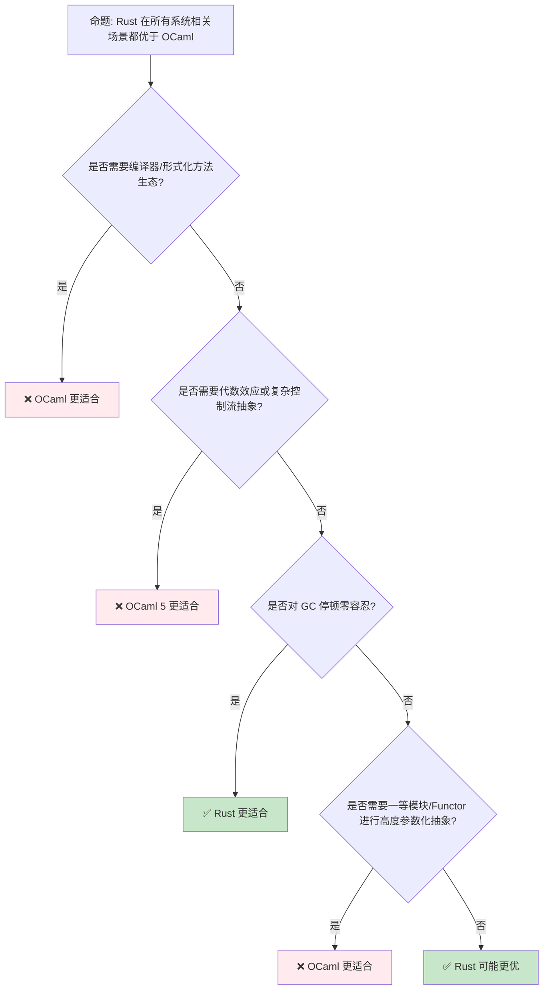
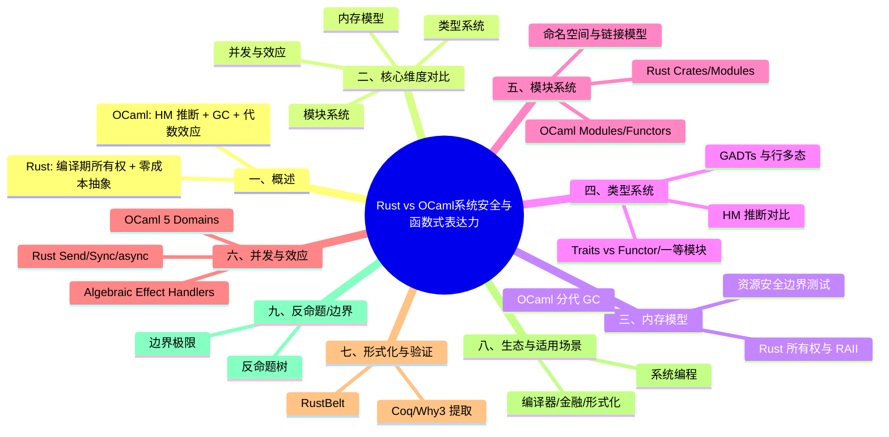

> **内容分级**: [对比级]
> **定理链**: N/A — 描述性/对比性文档，不涉及形式化定理链
>
# Rust vs OCaml：系统安全与函数式表达力的对比
>
> **EN**: Rust vs OCaml: Ownership and Algebraic Effects in Systems and Functional Programming
> **Summary**: A comparative analysis of Rust and OCaml across memory management, type systems, effects, concurrency, modules, and application domains, highlighting OCaml 5's algebraic effect handlers as a key differentiator.
> **Rust 版本**: 1.97.0+ (Edition 2024)
> **OCaml 版本**: 5.2+
> **受众**: [进阶]
> **Bloom 层级**: L5
> **权威来源**: 本文件为 `concept/` 权威页。
> **定位**: 从**内存模型**、**类型系统（Type System）**、**效应系统（Effect System）**、**并发模型**和**模块系统**五个维度，系统对比 Rust 与 OCaml 的设计哲学差异，揭示 Rust 的编译期资源控制与 OCaml 的代数效应/垃圾回收在系统编程、编译器构造和形式化方法中的适用边界。
> **前置概念**: [Traits](../../02_intermediate/00_traits/01_traits.md) · [Module System](../../01_foundation/07_modules_and_items/11_crates_and_source_files.md) · [Algebraic Effects](../../04_formal/07_concurrency_semantics/04_algebraic_effects.md)
> **后置概念**: [Paradigm Matrix](../00_paradigms/01_paradigm_matrix.md)

---

> **来源**: [The Rust Programming Language](https://doc.rust-lang.org/book/title-page.html) · [Rust Reference](https://doc.rust-lang.org/reference/introduction.html) · [OCaml.org](https://ocaml.org/) · [OCaml 5 Manual](https://ocaml.org/manual/5.2/index.html) · [OCaml Effects Tutorial](https://ocaml.org/manual/5.2/effects.html) · [Multicore OCaml](https://github.com/ocaml-multicore/ocaml-multicore) · [Real World OCaml](https://dev.realworldocaml.org/) · [RustBelt: Securing the Foundations of Rust](https://plv.mpi-sws.org/rustbelt/popl18/) · [Wikipedia — OCaml](https://en.wikipedia.org/wiki/OCaml)

---

## 📑 目录

- [Rust vs OCaml：系统安全与函数式表达力的对比](#rust-vs-ocaml系统安全与函数式表达力的对比)
  - [📑 目录](#-目录)
  - [一、概述](#一概述)
  - [二、核心维度对比](#二核心维度对比)
    - [2.1 设计语言DNA](#21-设计语言dna)
    - [2.2 总览矩阵](#22-总览矩阵)
  - [三、内存模型](#三内存模型)
    - [3.1 Rust：所有权与 RAII](#31-rust所有权与-raii)
    - [3.2 OCaml：分代垃圾回收](#32-ocaml分代垃圾回收)
    - [3.3 资源安全边界测试](#33-资源安全边界测试)
  - [四、类型系统](#四类型系统)
    - [4.1 类型推断：两种 HM 传统](#41-类型推断两种-hm-传统)
    - [4.2 Traits vs 模块/Functor/第一类等价](#42-traits-vs-模块functor第一类等价)
    - [4.3 GADTs 与行多态](#43-gadts-与行多态)
    - [4.4 类型系统边界测试](#44-类型系统边界测试)
  - [五、模块系统](#五模块系统)
    - [5.1 Rust Crates 与 Modules](#51-rust-crates-与-modules)
    - [5.2 OCaml Modules、Functors 与 First-Class Modules](#52-ocaml-modulesfunctors-与-first-class-modules)
    - [5.3 命名空间与链接模型对比](#53-命名空间与链接模型对比)
  - [六、并发与效应](#六并发与效应)
    - [6.1 Rust：所有权驱动的并发](#61-rust所有权驱动的并发)
    - [6.2 OCaml 5：Domains + Algebraic Effects](#62-ocaml-5domains--algebraic-effects)
    - [6.3 显式效应 vs 代数效应处理器](#63-显式效应-vs-代数效应处理器)
    - [6.4 并发模型边界测试](#64-并发模型边界测试)
  - [七、形式化与验证](#七形式化与验证)
    - [7.1 语义基础](#71-语义基础)
    - [7.2 证明工具生态](#72-证明工具生态)
  - [八、生态与适用场景](#八生态与适用场景)
    - [8.1 典型应用领域](#81-典型应用领域)
    - [8.2 场景推荐矩阵](#82-场景推荐矩阵)
  - [九、反命题/边界](#九反命题边界)
    - [9.1 反命题树](#91-反命题树)
    - [9.2 边界极限](#92-边界极限)
  - [十、来源与延伸阅读](#十来源与延伸阅读)
  - [相关概念](#相关概念)
  - [🧭 思维导图（Mindmap）](#-思维导图mindmap)

---

## 一、概述

Rust 与 OCaml 都诞生于对**可靠系统编程**的追求，但选择了截然不同的约束策略：

- **Rust** 将资源安全前移到编译期，通过**所有权（Ownership）**、**借用（Borrowing）**和**生命周期（Lifetimes）**消除数据竞争与悬垂指针，以**零成本抽象（Zero-Cost Abstraction）**服务系统编程、嵌入式和高性能基础设施。
- **OCaml** 继承 ML 传统，以**Hindley-Milner 类型推断**、**代数数据类型（Algebraic Data Types）**和**模块化抽象**为核心，通过**分代垃圾回收（Generational GC）**和 OCaml 5 引入的**代数效应处理器（Algebraic Effect Handlers）**服务编译器、形式化方法和金融工具。

两者都拥有强大的静态类型系统和模式匹配，但 Rust 用**线性/仿射类型**约束程序行为，OCaml 用**高阶类型构造**和**效应系统**扩展表达力。理解这一对比，有助于在"系统边界"与"形式化表达"之间做出工程选择。

> **关键洞察**: Rust 与 OCaml 不是零和竞争，而是**约束强度**与**表达力**之间的取舍。Rust 选择"编译期拒绝危险程序"；OCaml 选择"用类型和效应精确刻画程序语义"，将部分安全责任委托给 GC 和运行时调度。

---

## 二、核心维度对比

### 2.1 设计语言DNA

```text
设计哲学对比:

  Rust:
  ├── 默认安全：借用检查器在编译期消除数据竞争
  ├── 零成本抽象：无 GC、无运行时，AOT 编译为机器码
  ├── 显式资源管理：所有权移动 + RAII 析构
  ├── 类型系统 ≈ 系统 F + 区域类型 + 仿射类型
  └── 工程目标：系统编程、嵌入式、浏览器引擎、数据库内核

  OCaml:
  ├── 默认表达力：HM 推断 + GADT + 行多态
  ├── 托管运行时：分代 GC + OCaml 5 并行 Domains
  ├── 模块化抽象：Functor + First-Class Module
  ├── 代数效应：OCaml 5 effect handlers 作为并发/回溯/状态统一机制
  └── 工程目标：编译器、定理证明器、金融模型、形式化工具
```

> **来源**: [Rust Reference](https://doc.rust-lang.org/reference/introduction.html) · [OCaml.org](https://ocaml.org/)

---

### 2.2 总览矩阵

| 维度 | Rust | OCaml | 关键差异 |
|:---|:---|:---|:---|
| **内存管理** | 所有权 + RAII，无 GC | 分代 GC（minor/major heap） | Rust 确定性释放，OCaml 自动回收 |
| **类型推断** | HM 风格，局部推断 | 完整 HM 推断 | OCaml 全局推断更强，Rust 要求签名显式 |
| **多态机制** | Trait / Generic / Associated Type | Module / Functor / First-Class Module | Rust 结构化特设多态，OCaml 模块化多态 |
| **类型构造** | ADT、GAT、impl Trait | ADT、GADT、Row Polymorphism | OCaml 行多态与 GADT 更原生 |
| **效应模型** | 显式类型（`Result`、`async`、`unsafe`） | OCaml 5 Algebraic Effect Handlers | Rust 用类型编码效应，OCaml 用处理器捕获/恢复 continuations |
| **并发模型** | `Send`/`Sync` + 线程/async | Domains（并行）+ Effects（并发） | Rust 编译期保证无数据竞争，OCaml 依赖 GC 与运行时调度 |
| **模块系统** | Crate/Module/Use，无一等模块 | Module/Functor/First-Class Module | OCaml 模块是值，Rust 模块是命名空间 |
| **运行时** | 可选最小运行时 | 必需 OCaml 运行时 | Rust 无 GC 暂停，OCaml 有 GC 停顿 |
| **二进制部署** | 原生静态/动态链接 | 原生 + OCaml 运行时 | Rust 更易嵌入，OCaml 依赖运行时 |
| **典型领域** | 系统、嵌入式、基础设施、游戏 | 编译器、金融、定理证明、形式化 | 互补场景 |

> **来源**: [Rust Reference — Types](https://doc.rust-lang.org/reference/types.html) · [OCaml 5 Manual](https://ocaml.org/manual/5.2/index.html)

---

## 三、内存模型

### 3.1 Rust：所有权与 RAII

Rust 的内存安全建立在**所有权规则**上：

1. 每个值有且只有一个所有者；
2. 当所有者离开作用域，值被释放（`Drop`）；
3. 同时只能存在一个可变引用，或多个不可变引用；
4. 引用必须始终有效。

```rust
// Rust: 所有权与确定性析构
struct FileHandle {
    path: String,
}

impl Drop for FileHandle {
    fn drop(&mut self) {
        println!("closing {}", self.path);
    }
}

fn process() {
    let file = FileHandle { path: "data.txt".to_string() };
    // file 在作用域结束时自动调用 Drop，时机确定
} // <- Drop 在这里调用

fn main() {
    process();
}
```

> **来源**: [TRPL — Ownership](https://doc.rust-lang.org/book/ch04-00-understanding-ownership.html) · [TRPL — Drop](https://doc.rust-lang.org/book/ch15-03-drop.html)

---

### 3.2 OCaml：分代垃圾回收

OCaml 使用**分代 GC**：大多数对象在 minor heap 上快速分配和回收，长生命周期对象晋升到 major heap。程序员不手动管理内存，但失去释放时机的确定性。

```ocaml
(* OCaml: GC 自动管理内存 *)
type file_handle = { path : string }

let process () =
  let file = { path = "data.txt" } in
  Printf.printf "using %s\n" file.path
  (* file 不再被引用后由 GC 回收，时机不确定 *)

let () = process ()
```

OCaml 5 支持**并行 minor GC**和**并发 major GC**，大幅改善多核场景下的 GC 表现，但仍存在 STW（Stop-the-World）阶段。

> **来源**: [OCaml 5 GC](https://ocaml.org/manual/5.2/gc.html) · [Multicore OCaml Memory Model](https://github.com/ocaml-multicore/ocaml-multicore/wiki)

---

### 3.3 资源安全边界测试

```rust,compile_fail
// Rust: 移动后不能再次使用
struct FileHandle { path: String }

fn consume(f: FileHandle) {
    println!("consumed {}", f.path);
}

fn main() {
    let file = FileHandle { path: "data.txt".to_string() };
    consume(file);
    // ❌ 编译错误: value used here after move
    println!("{}", file.path);
}
```

```ocaml
(* OCaml: 没有移动语义，记录可被多次引用 *)
type file_handle = { path : string }

let consume f = Printf.printf "consumed %s\n" f.path

let () =
  let file = { path = "data.txt" } in
  consume file;
  Printf.printf "%s\n" file.path  (* ✅ 合法：GC 管理共享 *)
```

> **判定依据**: Rust 通过所有权移动将资源释放责任转移到新所有者；OCaml 通过 GC 共享对象，代价是释放时机不确定。

---

## 四、类型系统

### 4.1 类型推断：两种 HM 传统

Rust 与 OCaml 都继承 Hindley-Milner（HM）类型推断，但工程约束不同：

- **OCaml**: 完整 HM，函数返回类型通常可省略，支持**多态变体（Polymorphic Variants）**和**行多态**。
- **Rust**: 局部 HM，函数签名必须显式（泛型参数、生命周期、trait bounds），但局部变量类型可推断。

```ocaml
(* OCaml: 完整类型推断 *)
let rec map f = function
  | [] -> []
  | x :: xs -> f x :: map f xs

(* 类型自动推断为: ('a -> 'b) -> 'a list -> 'b list *)
```

```rust
// Rust: 函数签名显式，函数体可推断
fn map<T, U, F>(f: F, list: Vec<T>) -> Vec<U>
where
    F: Fn(T) -> U,
{
    list.into_iter().map(f).collect()
}
```

> **来源**: [OCaml Type Inference](https://ocaml.org/docs/type-inference) · [Rust Reference — Type Inference](https://doc.rust-lang.org/reference/type-inference.html)

---

### 4.2 Traits vs 模块/Functor/第一类等价

Rust 的 **trait** 提供结构化特设多态：

```rust
// Rust: trait 作为类型类/接口
trait Area {
    fn area(&self) -> f64;
}

struct Circle { radius: f64 }

impl Area for Circle {
    fn area(&self) -> f64 {
        std::f64::consts::PI * self.radius * self.radius
    }
}

fn total_area<T: Area>(shapes: &[T]) -> f64 {
    shapes.iter().map(|s| s.area()).sum()
}
```

OCaml 没有 trait，而是通过**模块签名（Module Signature）**、**Functor** 和**一等模块（First-Class Module）**实现多态：

```ocaml
(* OCaml: 模块签名 + Functor *)
module type SHAPE = sig
  type t
  val area : t -> float
end

module Circle : SHAPE with type t = float = struct
  type t = float
  let area r = Float.pi *. r *. r
end

module MakeTotal (S : SHAPE) = struct
  let total_area shapes = List.fold_left (fun acc s -> acc +. S.area s) 0.0 shapes
end

module CircleTotal = MakeTotal(Circle)
```

一等模块允许将模块作为值传递：

```ocaml
(* OCaml: 一等模块 *)
let total_area (type a) (module S : SHAPE with type t = a) shapes =
  List.fold_left (fun acc s -> acc +. S.area s) 0.0 shapes
```

> **关键差异**: Rust trait 是**类型约束**，自动由编译器解析实例；OCaml 模块/Functor 是**显式参数化**，提供更强的模块化抽象能力但语法更冗长。

> **来源**: [Rust Reference — Traits](https://doc.rust-lang.org/reference/items/traits.html) · [Real World OCaml — Modules](https://dev.realworldocaml.org/files-modules-and-programs.html)

---

### 4.3 GADTs 与行多态

OCaml 原生支持 **GADTs（Generalized Algebraic Data Types）** 和 **Row Polymorphism**：

```ocaml
(* OCaml: GADT *)
type _ expr =
  | Int : int -> int expr
  | Bool : bool -> bool expr
  | Add : int expr * int expr -> int expr
  | If : bool expr * 'a expr * 'a expr -> 'a expr

let rec eval : type a. a expr -> a = function
  | Int n -> n
  | Bool b -> b
  | Add (a, b) -> eval a + eval b
  | If (c, t, e) -> if eval c then eval t else eval e

(* 行多态：函数接受任何带有 #area 方法的记录 *)
let print_area obj = Printf.printf "%f\n" obj#area
```

Rust 没有原生 GADT，但可通过 **枚举 + 泛型关联类型（GATs）** 模拟，行多态则没有直接对应（最接近的是 trait object 或动态分发）：

```rust
// Rust: 用 GAT 模拟 GADT（类型层面）
trait Expr<T> {
    fn eval(&self) -> T;
}

struct Int(i32);
impl Expr<i32> for Int {
    fn eval(&self) -> i32 { self.0 }
}

struct Add<L, R>(L, R);
impl<L: Expr<i32>, R: Expr<i32>> Expr<i32> for Add<L, R> {
    fn eval(&self) -> i32 { self.0.eval() + self.1.eval() }
}
```

> **来源**: [OCaml GADTs](https://ocaml.org/docs/gadts) · [Rust Reference — Generic Items](https://doc.rust-lang.org/reference/items/generics.html)

---

### 4.4 类型系统边界测试

```rust,compile_fail
// Rust: 没有 null，Option 强制处理
fn main() {
    let s: Option<String> = None;
    // ❌ 编译错误: no method named `len` found for enum `Option`
    let _ = s.len();
}
```

```ocaml
(* OCaml: option 类型存在，但编译器不强制 exhaustiveness 检查变量使用 *)
let s = None
(* let _ = String.length s  (* 类型错误：string option 不是 string *) *)
let len = match s with Some v -> String.length v | None -> 0
```

> **判定依据**: Rust 用 `Option<T>` 完全替代 null，不可空类型是默认；OCaml 也有 `'a option`，但 OCaml 中存在 `Obj.magic` 等逃逸口，且与 C 互操作时仍可能引入 null。

---

## 五、模块系统

### 5.1 Rust Crates 与 Modules

Rust 的模块系统以 **crate** 为编译/发布单元，内部通过 `mod` 和 `use` 组织命名空间：

```rust
// Rust: crate 结构
// src/lib.rs
pub mod parser;
pub mod codegen;

// src/parser.rs
pub struct Parser;
impl Parser {
    pub fn parse(&self, input: &str) -> Result<(), ()> { Ok(()) }
}

// src/codegen.rs
use crate::parser::Parser;

pub fn generate(p: &Parser) { p.parse("input").unwrap(); }
```

Rust 模块是**静态命名空间**，不支持一等模块，也不支持 Functor。

> **来源**: [Rust Reference — Crates and Source Files](https://doc.rust-lang.org/reference/crates-and-source-files.html) · [TRPL — Modules](https://doc.rust-lang.org/book/ch07-00-managing-growing-projects-with-packages-crates-and-modules.html)

---

### 5.2 OCaml Modules、Functors 与 First-Class Modules

OCaml 的模块系统是语言的一等公民：

```ocaml
(* OCaml: 模块、Functor、一等模块 *)
module type COMPARABLE = sig
  type t
  val compare : t -> t -> int
end

module type SET = sig
  type t
  type elt
  val empty : t
  val add : elt -> t -> t
  val mem : elt -> t -> bool
end

module MakeSet (E : COMPARABLE) : SET with type elt = E.t = struct
  type elt = E.t
  type t = elt list
  let empty = []
  let add x s = if List.mem x s then s else x :: s
  let mem = List.mem
end

module IntSet = MakeSet(struct
  type t = int
  let compare = compare
end)

let s = IntSet.add 42 IntSet.empty
let b = IntSet.mem 42 s  (* true *)
```

一等模块允许模块在运行时被选择：

```ocaml
let choose_set (type a) (module E : COMPARABLE with type t = a) =
  let module S = MakeSet(E) in
  (module S : SET with type elt = a)
```

> **来源**: [Real World OCaml — Functors](https://dev.realworldocaml.org/functors.html)

---

### 5.3 命名空间与链接模型对比

| 维度 | Rust | OCaml |
|:---|:---|:---|
| **编译单元** | Crate | `.ml`/`.mli` 文件 + OCaml module |
| **依赖管理** | Cargo + crates.io + `Cargo.lock` | opam + dune + lock 文件 |
| **命名空间层级** | Crate → Module → Item | File/Module → Submodule → Item |
| **参数化模块** | 不支持 | Functor |
| **一等模块** | 不支持 | 支持（`(module M : S)`） |
| **接口文件** | `pub` 可见性 | `.mli` 签名文件 |
| **动态链接** | 支持 `.so`/`.dll` | 支持 `.cmxs`/`.cma` |

> **关键洞察**: Rust 的模块系统更贴近"代码组织 + 可见性"；OCaml 的模块系统同时承担"类型约束 + 抽象边界 + 代码复用"三重角色，是语言设计的核心。

---

## 六、并发与效应

### 6.1 Rust：所有权驱动的并发

Rust 通过类型系统保证并发安全：

- `Send`: 可以安全地在线程间转移所有权；
- `Sync`: 可以安全地在线程间共享引用；
- `Mutex<T>`、`RwLock<T>`、`Atomic*` 提供同步原语；
- `async/await` 提供协作式并发。

```rust
use std::sync::Arc;
use std::thread;

fn main() {
    let data = Arc::new(vec![1, 2, 3]);
    let mut handles = vec![];

    for i in 0..3 {
        let d = Arc::clone(&data);
        handles.push(thread::spawn(move || {
            println!("thread {} sees {:?}", i, d);
        }));
    }

    for h in handles { h.join().unwrap(); }
}
```

> **来源**: [Rustnomicon — Send and Sync](https://doc.rust-lang.org/nomicon/send-and-sync.html) · [TRPL — Concurrency](https://doc.rust-lang.org/book/ch16-00-concurrency.html)

---

### 6.2 OCaml 5：Domains + Algebraic Effects

OCaml 5 引入两个核心并发原语：

1. **Domains**: 真正的操作系统级并行，多个 OCaml 运行时线程共享 major heap；
2. **Effects**: 代数效应处理器，允许捕获/恢复 continuations，实现协程、生成器、结构化并发等。

```ocaml
(* OCaml 5: Domain 并行 *)
let d = Domain.spawn (fun () -> 42)
let result = Domain.join d  (* 42 *)

(* OCaml 5: Algebraic Effect Handler *)
effect Get : int

let () =
  let x = match
    (perform Get) + 1
  with
  | v -> v
  | effect Get k -> continue k 10
  in
  Printf.printf "result = %d\n" x  (* 11 *)
```

> **来源**: [OCaml 5 Effects](https://ocaml.org/manual/5.2/effects.html) · [OCaml 5 Parallel Programming](https://ocaml.org/manual/5.2/parallelism.html)

---

### 6.3 显式效应 vs 代数效应处理器

Rust 没有内置的代数效应处理器，而是通过**显式类型**编码各种效应：

| 效应类型 | Rust | OCaml 5 |
|:---|:---|:---|
| **可失败计算** | `Result<T, E>` | `('a, 'e) result` 或 effect |
| **异步计算** | `async fn` → `Future<Output = T>` | effect + handler |
| **可变状态** | `&mut T`、`Cell`、`RefCell` | `ref` / mutable record / effect |
| **非局部控制流** | `?`、panic、coroutine crate | `effect`/`perform` + `continue`/`discontinue` |
| **IO** | 直接系统调用或 `tokio` | 直接系统调用或 effect 抽象 |

```rust
// Rust: 用 Result 显式编码失败效应
fn read_file(path: &str) -> Result<String, std::io::Error> {
    std::fs::read_to_string(path)
}

fn main() -> Result<(), Box<dyn std::error::Error>> {
    let content = read_file("data.txt")?;
    println!("{}", content);
    Ok(())
}
```

```ocaml
(* OCaml: 用 effect handler 统一失败/状态/并发 *)
effect Read_file : string -> string

let run_filesystem () =
  match
    let content = perform (Read_file "data.txt") in
    Printf.printf "%s\n" content
  with
  | () -> ()
  | effect (Read_file path) k ->
      let content = In_channel.with_open_text path In_channel.input_all in
      continue k content
```

> **关键洞察**: OCaml 5 的代数效应处理器是**主要差异化特性**——它提供了一种统一的、可组合的控制流抽象，而 Rust 通过显式类型将效应分散到 `Result`、`Option`、`Future`、`Iterator` 等类型中。Rust 的选择更利于零成本和编译期验证，OCaml 的选择更利于表达力和组合性。

---

### 6.4 并发模型边界测试

```rust,compile_fail
// Rust: 非 Send 类型不能跨线程
use std::rc::Rc;
use std::thread;

fn main() {
    let data = Rc::new(42);
    // ❌ 编译错误: `Rc<i32>` cannot be sent between threads safely
    thread::spawn(move || {
        println!("{}", *data);
    });
}
```

```ocaml
(* OCaml: 默认不可变数据可在 Domain 间共享，可变数据需同步 *)
let counter = Atomic.make 0

let d = Domain.spawn (fun () -> Atomic.incr counter)
let () = Domain.join d
let () = Printf.printf "%d\n" (Atomic.get counter)
```

> **判定依据**: Rust 在编译期拒绝非线程安全数据的跨线程传递；OCaml 5 提供原子操作和域局部状态，但共享可变数据的正确性更多依赖程序员约定。

---

## 七、形式化与验证

### 7.1 语义基础

| 方面 | Rust | OCaml |
|:---|:---|:---|
| **形式化模型** | RustBelt（Iris 分离逻辑） | OCaml 有操作语义和类型安全证明 |
| **类型安全** | 借用检查器保证（无 formal proof 覆盖 unsafe） | 标准核心语言有类型安全证明 |
| **所有权逻辑** | 仿射/线性类型 | 无（GC 释放） |
| **未定义行为** | `unsafe` 块可触发 | 也存在 `Obj.magic` 等逃逸 |

Rust 的 `unsafe` 块允许绕过借用检查器，直接操作裸指针、调用 extern 函数、实现 `Send`/`Sync` 等。RustBelt 项目证明了标准库中大量 `unsafe` 抽象的安全性，但整个语言尚无完整机械证明。

OCaml 的核心类型系统有长期的形式化研究，但 `Obj.magic`、C FFI 等同样可以破坏类型安全。

> **来源**: [RustBelt](https://plv.mpi-sws.org/rustbelt/popl18/) · [OCaml Type Safety](https://ocaml.org/docs/type-inference)

---

### 7.2 证明工具生态

| 工具 | Rust | OCaml |
|:---|:---|:---|
| **交互式定理证明** | 无原生；可嵌入 Coq/Lean | Coq、Why3 原生 OCaml 提取目标 |
| **程序验证** | Kani（模型检测）、Prusti | Why3、Gospel、Cameleer |
| **形式化语义** | RustBelt、Aeneas、K-Rust | Ott、Iris 应用 |
| **编译器验证** | 研究中 | CompCert 提取到 OCaml |

> **关键洞察**: OCaml 在传统形式化方法工具链中占据核心位置（Coq 提取、Why3、CompCert），而 Rust 的程序验证生态更年轻，主要面向系统代码的模型检测和分离逻辑证明。

---

## 八、生态与适用场景

### 8.1 典型应用领域

```text
Rust 主战场:
  ├── 系统编程：操作系统、文件系统、数据库内核
  ├── 网络服务：Actix、Axum、Tokio 生态
  ├── 嵌入式与 no_std
  ├── 区块链/Web3：Solana、Substrate
  ├── 游戏引擎：Bevy
  └── 浏览器/基础设施：Firefox、Cloudflare

OCaml 主战场:
  ├── 编译器：OCaml 自身、Rustc（早期 bootstrap）、Jane Street 工具链
  ├── 定理证明器：Coq 提取目标、Why3
  ├── 金融工程：Jane Street、Bloomberg 量化工具
  ├── 静态分析：Infer、Frama-C
  ├── 形式化方法工具链
  └── 编程语言研究原型
```

> **来源**: [OCaml Industrial Users](https://ocaml.org/industrial-users) · [Rust Production Users](https://www.rust-lang.org/production/users)

---

### 8.2 场景推荐矩阵

| 场景 | Rust | OCaml | 推荐 |
|:---|:---|:---|:---:|
| **操作系统/内核** | ✅ 无运行时，直接内存控制 | ⚠️ 可行但非主流 | **Rust** |
| **嵌入式/IoT** | ✅ no_std，极小二进制 | ❌ 运行时太大 | **Rust** |
| **实时系统** | ✅ 确定性延迟 | ❌ GC 暂停 | **Rust** |
| **编译器前端/类型检查器** | ⚠️ 可用，但 AST 重写较繁琐 | ✅ ADT/GADT/模块系统非常适合 | **OCaml** |
| **定理证明辅助工具** | ⚠️ 生态年轻 | ✅ Coq/Why3 提取目标 | **OCaml** |
| **金融模型/量化交易** | ✅ 低延迟基础设施 | ✅ 建模表达力强，Jane Street 主力 | **视团队而定** |
| **静态分析/形式化验证** | ⚠️ 发展中 | ✅ Infer、Frama-C、Why3 成熟 | **OCaml** |
| **Web 后端** | ✅ Tokio/Axum 高性能 | ⚠️ 生态较小（Dream、Opium） | **Rust** |
| **编程语言研究** | ⚠️ 类型系统表达力受限 | ✅ 模块/效应/GADT 理想 | **OCaml** |
| **需要代数效应的复杂控制流** | ⚠️ 需库模拟（coroutine、eff） | ✅ OCaml 5 原生支持 | **OCaml** |

> **场景洞察**: Rust 在**系统边界**和**延迟敏感**场景占优；OCaml 在**编译器构造**、**形式化方法**和**高表达力建模**场景占优。金融量化领域两者均有重量级用户，选择取决于"低延迟基础设施"还是"模型复杂度"哪个是瓶颈。

---

## 九、反命题/边界

### 9.1 反命题树



> **认知功能**: 此决策树评估 Rust 替代 OCaml 的可行性。核心判断标准是**生态依赖**、**效应模型需求**、**延迟敏感性**和**模块化抽象需求**。

---

### 9.2 边界极限

```text
边界 1: 学习曲线
├── Rust: 所有权/生命周期需要数月掌握
├── OCaml: 模块系统/Functor/GADT 需要数月掌握
├── 两者都有陡峭的认知门槛，但门槛位于不同维度
└── 团队转型成本是选择的主要障碍

边界 2: 运行时可控性
├── Rust: 无 GC，内存/CPU 行为可精确预测
├── OCaml: GC 自动管理，OCaml 5 大幅改善但仍非实时
└── 延迟敏感场景 Rust 是结构性优势

边界 3: 类型表达力
├── Rust: trait + GAT 强大，但无行多态/一等模块
├── OCaml: GADT + 行多态 + 一等模块，表达力更高
└── 需要高度参数化抽象时 OCaml 更自然

边界 4: 效应建模
├── Rust: Result/Option/Future/Iterator 显式编码，零成本
├── OCaml: effect handlers 统一抽象，可组合但有效应捕获开销
└── 简单效应场景 Rust 更直接；复杂控制流 OCaml 更优雅

边界 5: 互操作性
├── Rust: C ABI 原生支持，嵌入其他语言容易
├── OCaml: C FFI 成熟，但作为库嵌入不如 Rust 轻量
└--- 需要作为"通用胶水"时 Rust 占优
```

> **边界要点**: Rust 和 OCaml 的边界取决于**延迟敏感性**、**类型表达力需求**、**效应复杂度**和**生态依赖**。两者在系统编程的上层（编译器、工具链）可以互补：Rust 负责性能关键路径，OCaml 负责语义分析与形式化验证。

---

## 十、来源与延伸阅读

| 来源 | 可信度 | 说明 |
|:---|:---:|:---|
| [Rust Reference](https://doc.rust-lang.org/reference/introduction.html) | ✅ 一级 | Rust 语言参考 |
| [The Rust Programming Language](https://doc.rust-lang.org/book/title-page.html) | ✅ 一级 | Rust 官方书 |
| [Rustnomicon](https://doc.rust-lang.org/nomicon/index.html) | ✅ 一级 | Rust 高级/unsafe 指南 |
| [OCaml.org](https://ocaml.org/) | ✅ 一级 | OCaml 官方网站 |
| [OCaml 5 Manual](https://ocaml.org/manual/5.2/index.html) | ✅ 一级 | OCaml 5 官方手册 |
| [OCaml Effects](https://ocaml.org/manual/5.2/effects.html) | ✅ 一级 | 代数效应处理器文档 |
| [Real World OCaml](https://dev.realworldocaml.org/) | ✅ 二级 | OCaml 权威教材 |
| [Multicore OCaml](https://github.com/ocaml-multicore/ocaml-multicore) | ✅ 二级 | OCaml 5 多核实现 |
| [RustBelt](https://plv.mpi-sws.org/rustbelt/popl18/) | ✅ 一级 | Rust 形式化验证 |
| [Wikipedia — OCaml](https://en.wikipedia.org/wiki/OCaml) | ✅ 一级 | 语言概述 |

---

## 相关概念

- [Traits](../../02_intermediate/00_traits/01_traits.md) — Rust 特设多态机制
- [Module System](../../01_foundation/07_modules_and_items/11_crates_and_source_files.md) — Rust 模块与 crate 系统
- [Algebraic Effects](../../04_formal/07_concurrency_semantics/04_algebraic_effects.md) — 代数效应形式化基础
- [Paradigm Matrix](../00_paradigms/01_paradigm_matrix.md) — 编程范式定位矩阵
- [Rust vs Scala](./05_rust_vs_scala.md) — 另一门 JVM/函数式语言对比
- [Rust vs Java](./01_rust_vs_java.md) — 托管运行时对比

---

> **权威来源**: [Rust Reference](https://doc.rust-lang.org/reference/introduction.html), [OCaml.org](https://ocaml.org/), [OCaml 5 Manual](https://ocaml.org/manual/5.2/index.html)
>
> **权威来源对齐变更日志**: 2026-07-16 创建，对齐 Rust 1.97.0+ (Edition 2024) / OCaml 5.2+

**文档版本**: 1.0
**最后更新**: 2026-07-16
**状态**: ✅ 概念文件创建完成

---

## 🧭 思维导图（Mindmap）


