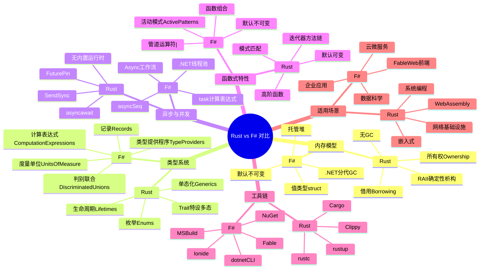
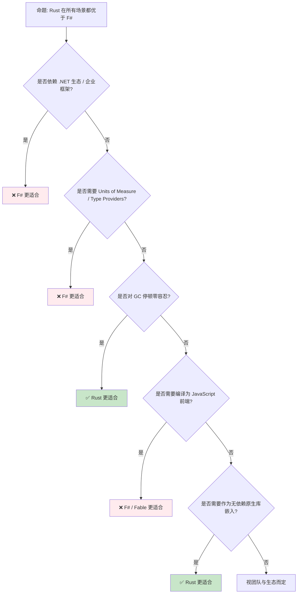

> **内容分级**: [对比级]
> **定理链**: N/A — 描述性/对比性文档，不涉及形式化定理链
>
# Rust vs F#：系统所有权与函数式数据生态的对比
>
> **EN**: Rust vs F#: Ownership-Centric Systems Programming vs Functional Data-Oriented .NET Development
> **Summary**: A comparative canonical analysis of Rust and F# across memory management, type systems, async models, functional features, tooling, and application domains within the .NET ecosystem.
> **Rust 版本**: 1.97.0+ (Edition 2024)
> **F# 版本**: F# 9.0 / .NET 9
> **受众**: [进阶]
> **Bloom 层级**: L5
> **权威来源**: 本文件为 `concept/` 权威页。
> **定位**: 从**内存模型**、**类型系统**、**异步与并发**、**函数式特性**、**工具链**与**适用场景**六个维度，系统对比 Rust 与 F# 的设计哲学与工程权衡。本文是对 [Paradigm Matrix](../00_paradigms/01_paradigm_matrix.md) 中「系统编程 vs 托管函数式编程」交叉视角的 pairwise 深化，不重复该矩阵的通用范式定义。
> **前置概念**: [Traits](../../02_intermediate/00_traits/01_traits.md) · [Type System](../../01_foundation/02_type_system/01_type_system.md) · [Async/Await](../../03_advanced/01_async/01_async.md)
> **后置概念**: [Paradigm Matrix](../00_paradigms/01_paradigm_matrix.md)

---

> **来源**: [The Rust Programming Language](https://doc.rust-lang.org/book/title-page.html) · [Rust Reference](https://doc.rust-lang.org/reference/introduction.html) · [F# Documentation](https://learn.microsoft.com/en-us/dotnet/fsharp/) · [F# Language Reference](https://learn.microsoft.com/en-us/dotnet/fsharp/language-reference/) · [Fable](https://fable.io/) · [.NET Runtime Documentation](https://learn.microsoft.com/en-us/dotnet/fundamentals/runtime/) · [Ionide](http://ionide.io/) · [NuGet](https://www.nuget.org/) · [MSBuild](https://learn.microsoft.com/en-us/visualstudio/msbuild/msbuild) · [Jung et al. — RustBelt: Securing the Foundations of Rust](https://plv.mpi-sws.org/rustbelt/popl18/)
> **前置依赖**: [Type Theory](../../04_formal/00_type_theory/01_type_theory.md)

---

## 📑 目录

- [Rust vs F#：系统所有权与函数式数据生态的对比](#rust-vs-f系统所有权与函数式数据生态的对比)
  - [📑 目录](#-目录)
  - [概述](#概述)
  - [思维导图](#思维导图)
  - [核心维度对比](#核心维度对比)
  - [内存模型](#内存模型)
    - [3.1 Rust：编译期所有权与 RAII](#31-rust编译期所有权与-raii)
    - [3.2 F#：托管堆、分代 GC 与值类型](#32-f托管堆分代-gc-与值类型)
    - [3.3 内存模型对比总结](#33-内存模型对比总结)
  - [类型系统](#类型系统)
    - [4.1 Rust：Trait、枚举与生命周期](#41-rusttrait枚举与生命周期)
    - [4.2 F#：Discriminated Unions、Records、Units of Measure 与 Type Providers](#42-fdiscriminated-unionsrecordsunits-of-measure-与-type-providers)
    - [4.3 特设多态：Rust Trait vs F# 接口与 SRTP](#43-特设多态rust-trait-vs-f-接口与-srtp)
    - [4.4 类型系统对比总结](#44-类型系统对比总结)
  - [异步与并发](#异步与并发)
    - [5.1 Rust：Future、async/await 与执行器分离](#51-rustfutureasyncawait-与执行器分离)
    - [5.2 F#：Async 工作流与 task 计算表达式](#52-fasync-工作流与-task-计算表达式)
    - [5.3 异步模型对比总结](#53-异步模型对比总结)
  - [函数式特性](#函数式特性)
    - [6.1 模式匹配](#61-模式匹配)
    - [6.2 不可变性默认 vs 显式可变性](#62-不可变性默认-vs-显式可变性)
    - [6.3 管道运算符与高阶函数](#63-管道运算符与高阶函数)
    - [6.4 函数式特性对比总结](#64-函数式特性对比总结)
  - [生态与适用场景](#生态与适用场景)
    - [7.1 Rust 的典型领域](#71-rust-的典型领域)
    - [7.2 F# 的典型领域](#72-f-的典型领域)
    - [7.3 工具链对比](#73-工具链对比)
    - [7.4 场景适用矩阵](#74-场景适用矩阵)
  - [反命题/边界](#反命题边界)
    - [8.1 Rust 不适合的场景](#81-rust-不适合的场景)
    - [8.2 F# 不适合的场景](#82-f-不适合的场景)
    - [8.3 常见误解澄清](#83-常见误解澄清)
    - [8.4 反命题决策树](#84-反命题决策树)
  - [来源与延伸阅读](#来源与延伸阅读)
    - [国际权威参考](#国际权威参考)
    - [相关概念](#相关概念)
    - [权威来源索引](#权威来源索引)

---

## 概述

Rust 与 F# 都是**静态强类型**语言，都支持**代数数据类型**、**模式匹配**和**高阶函数**，但两者的设计起点与工程目标截然不同：

- **Rust** 以**编译期所有权（ownership）**、**借用检查（borrowing）**和**生命周期（lifetimes）**为核心，通过无垃圾回收的 RAII 语义，在不牺牲运行时性能的前提下提供内存与线程安全。其目标领域是系统软件、嵌入式、网络基础设施与浏览器/WebAssembly 运行时。
- **F#** 是运行在 **.NET Common Language Runtime (CLR)** 上的**托管函数式语言**，继承 ML 传统，强调**默认不可变性**、**类型推断**、**类型提供程序（type providers）**、**度量单位（units of measure）**和**计算表达式（computation expressions）**。它借助 .NET 的泛型垃圾回收运行时，在数据科学、云原生服务、企业应用和可编译为 JavaScript 的 Web 前端（Fable）中发挥作用。

两者都拒绝 null 作为默认值，都支持 `Option`/`Result` 风格的显式错误处理，都能通过类型系统编码大量不变量。但它们的「安全债务」支付方式存在结构性差异：

| 债务维度 | Rust | F# |
|---|---|---|
| 内存安全 | 编译期所有权/借用检查 | 运行时不可变数据 + .NET GC |
| 线程安全 | 编译期 `Send`/`Sync` trait | 不可变性默认 + `Async`/`Task` 协作式并发 |
| 副作用表达 | `unsafe`/`async`/`mut` 显式标记 | 默认纯函数 + `async`/`task` 计算表达式 |
| 抽象代价 | 单态化零成本抽象 | JIT/CLR 优化 + 偶尔装箱（boxing）开销 |

> **关键洞察**：Rust 将资源管理前移到编译期，换取可预测的延迟与内存布局；F# 将资源管理托管给 .NET CLR，换取高阶数据抽象、类型提供程序和跨语言互操作的生态便利。两者在 .NET 生态内部已经呈现互补：F# 负责数据建模与业务逻辑，C# 负责 UI/企业框架，而 Rust 可在性能关键路径上通过 P/Invoke 或 NativeAOT 暴露库。
>
> **与 Paradigm Matrix 的关系**：`concept/05_comparative/00_paradigms/01_paradigm_matrix.md` 给出函数式、命令式、系统级、托管运行时的通用分类；本文聚焦 Rust 与 F# 这一对具体语言，补充范式矩阵无法覆盖的实现细节、工程权衡与 .NET 互操作差异。

---

## 思维导图



> **认知功能**：该思维导图将 Rust 与 F# 的对比组织为「内存—类型—异步—函数式—工具—场景」六层，便于定位每一小节在整体图景中的位置。

---

## 核心维度对比

下表从实现策略、类型理论、运行时与工程生态四个层面，对 Rust 与 F# 进行快速对照。表中每一行的描述都将在后续小节展开。

| 维度 | Rust | F# | 关键观察 |
|---|---|---|---|
| **核心隐喻** | 所有权 + RAII + 零成本抽象 | 托管函数式 + 数据导向 + .NET 互操作 | Rust 偏向「系统构建」，F# 偏向「数据建模与转换」 |
| **内存管理** | 编译期所有权与借用；无 GC | .NET 分代 GC + 值类型 `struct` | Rust 延迟可预测；F# 开发者负担低但存在 GC 暂停 |
| **默认求值策略** | 严格求值 | 严格求值 | 两者默认均严格；F# 通过 `seq`/`lazy` 提供惰性序列 |
| **参数多态实现** | 单态化（零成本）+ trait object vtable | .NET 泛型（reified，JIT 特化） | Rust 静态分发更贴近 C++ 模板；F# 共享 .NET 运行时泛型 |
| **特设多态机制** | `trait` + `impl`（结构化，无继承） | .NET 接口 + F# 对象表达式 + SRTP（静态解析类型参数） | Rust trait 类似 typeclass；F# 既可用接口也可用 SRTP 模拟 typeclass |
| **类型构造** | ADT、GAT、`impl Trait`、生命周期 | DU、Records、Units of Measure、Type Providers、Computation Expressions | F# 在数据建模与领域类型上更富表达力 |
| **效应系统** | 词法效应：`unsafe`、`async`、`const` | 计算表达式：`async`、`task`、`seq`、`maybe` | Rust 的效应是上下文标记；F# 用计算表达式统一嵌套控制流 |
| **并发抽象** | `std::thread` + `Send`/`Sync` + `async`/executor | `Async<'T>` + `task` CE + `asyncSeq` + `MailboxProcessor` | F# 依托 .NET 线程池；Rust 依赖异步执行器或 OS 线程 |
| **不可变性** | 默认可变；可用 `let` 绑定 + `mut` 显式可变 | 默认不可变；`mutable`/`ref` 显式可变 | F# 函数式风格更自然；Rust 偏向命令式性能 |
| **运行时体积/延迟** | 无运行时；可裁剪至嵌入式 | .NET CLR 必须存在；NativeAOT 可裁剪但仍需 GC | Rust 更适合延迟敏感型嵌入式与系统软件 |
| **跨语言互操作** | C ABI 原生；与 .NET 互操作需 C API/P/Invoke | 与 C#、VB、所有 .NET 语言原生互操作 | F# 是 .NET 生态的一等公民；Rust 是跨语言原生库的一等公民 |
| **主要优势** | 性能、内存安全、可控布局、可预测性 | 数据建模、类型推断、跨 .NET 生态、Fable/Web | 互补：Rust 做底层，F# 做高层数据与业务 |
| **主要代价** | 学习曲线陡峭、编译时间长、借用限制 | GC 暂停、CLR 启动时间、.NET 运行时依赖 | 选择取决于延迟预算、生态依赖与抽象需求 |

> **来源**: [Rust Reference — Ownership](https://doc.rust-lang.org/book/ch04-00-understanding-ownership.html) · [F# Language Reference](https://learn.microsoft.com/en-us/dotnet/fsharp/language-reference/) · [.NET Garbage Collection](https://learn.microsoft.com/en-us/dotnet/standard/garbage-collection/)

---

## 内存模型

### 3.1 Rust：编译期所有权与 RAII

Rust 的内存安全不依赖运行时检查，而是依赖**借用检查器（borrow checker）**在编译期验证以下三条规则：

1. 每个值在任一时刻有且仅有一个所有者（owner）。
2. 要么存在任意数量的不可变引用 `&T`，要么存在唯一一个可变引用 `&mut T`，二者不可同时存在。
3. 引用必须总是有效的，不能出现悬垂引用（dangling references）。

这三条规则通过**生命周期（lifetime）**参数化，编译器据此推断引用的有效范围。当所有者离开作用域时，Rust 调用 `Drop::drop` 进行**确定性析构**，这就是 RAII（Resource Acquisition Is Initialization）。

```rust
fn ownership_demo() {
    let s = String::from("hello");   // s 是堆字符串的所有者
    let r1 = &s;                     // 不可变借用 OK
    let r2 = &s;                     // 多个不可变借用 OK
    println!("{} {}", r1, r2);
    // let r3 = &mut s;              // ERROR：不能同时拥有可变借用
    let t = s;                       // 所有权 move 给 t
    // println!("{}", s);            // ERROR：s 已失效
    println!("{}", t);
} // t 在此离开作用域，drop 被确定性调用
```

> **关键洞察**：Rust 将「何时释放资源」的决策前移到编译期，因此运行时没有 GC 线程、没有 stop-the-world，也没有隐式的堆遍历。
>
> **来源**: [TRPL — Understanding Ownership](https://doc.rust-lang.org/book/ch04-00-understanding-ownership.html) · [Rust Reference — Ownership](https://doc.rust-lang.org/book/ch04-00-understanding-ownership.html)

### 3.2 F#：托管堆、分代 GC 与值类型

F# 运行在 .NET CLR 之上，所有引用类型（reference types）对象的生命周期由 **.NET 分代垃圾回收器**管理。开发者不需要显式释放内存；GC 在堆满或显式触发时回收不可达对象。CLR GC 将托管堆划分为 **Gen 0、Gen 1、Gen 2** 三代，并设有**大对象堆（LOH）**处理大于 85,000 字节的分配。

与 Rust 不同，F# 还提供**值类型（value types / `struct`）**，它们通常分配在栈上或内联在包含对象中，从而减轻 GC 压力。但值类型 boxing/unboxing 会引入额外开销，需谨慎使用。

```fsharp
// F#: 引用类型由 GC 管理
let processFile () =
    let data = Array.init 1000 (fun i -> i * 2)  // int[] 是引用类型，托管堆分配
    printfn "sum = %d" (Array.sum data)
    // data 离开作用域后由 .NET GC 最终回收，时机不确定

// F#: 值类型 struct 减少堆分配
[<Struct>]
type Point2D = { X: float; Y: float }

let origin = { X = 0.0; Y = 0.0 }  // struct 通常在栈上分配
printfn "origin = (%f, %f)" origin.X origin.Y
```

F# 也支持 `use` 绑定，它在作用域结束时调用 `IDisposable.Dispose()`，用于非托管资源（文件句柄、数据库连接等）的确定性释放：

```fsharp
// F#: use 绑定确定性释放 IDisposable 资源
open System.IO

let readFirstLine (path: string) =
    use reader = new StreamReader(path)
    reader.ReadLine()
```

> **关键洞察**：F# 通过 .NET GC 自动管理大部分对象生命周期，通过 `use`/`IDisposable` 处理非托管资源，通过 `struct` 控制部分堆分配。与 Rust 相比，F# 牺牲了一部分内存布局与释放时机的确定性，换取开发效率与托管运行时安全。
>
> **来源**: [.NET Garbage Collection Fundamentals](https://learn.microsoft.com/en-us/dotnet/standard/garbage-collection/fundamentals) · [F# Language Reference — Values](https://learn.microsoft.com/en-us/dotnet/fsharp/language-reference/values/) · [IDisposable](https://learn.microsoft.com/en-us/dotnet/api/system.idisposable)

### 3.3 内存模型对比总结

| 特性 | Rust | F# |
|---|---|---|
| **所有权模型** | 编译期所有权 + 借用 | GC 自动管理引用类型 |
| **释放时机** | 确定性（RAII / `Drop`） | 非确定性（GC 触发） |
| **堆分配控制** | 精确控制（`Box`、`Rc`、`Arc`、栈数组） | 依赖 .NET JIT 与 `struct` |
| **非托管资源** | `Drop` trait / `unsafe` 释放 | `IDisposable` / `use` 绑定 |
| **大对象处理** | 程序员显式控制 | LOH（≥85KB）单独回收 |
| **延迟可预测性** | 高（无 GC 暂停） | 中（存在 GC 停顿） |
| **嵌入式/无堆** | `no_std` 支持 | 不支持 |

---

## 类型系统

### 4.1 Rust：Trait、枚举与生命周期

Rust 的类型系统以**代数数据类型（ADT）**、**trait**、**泛型**和**生命周期**为支柱。`enum` 可携带数据，与模式匹配配合实现类似 F# discriminated union 的表达；`trait` 提供结构化特设多态；生命周期参数化引用有效期，是借用检查的核心。

```rust
// Rust: enum + trait + 模式匹配
enum Shape {
    Circle { radius: f64 },
    Rectangle { width: f64, height: f64 },
}

trait Area {
    fn area(&self) -> f64;
}

impl Area for Shape {
    fn area(&self) -> f64 {
        match self {
            Shape::Circle { radius } => std::f64::consts::PI * radius * radius,
            Shape::Rectangle { width, height } => width * height,
        }
    }
}

fn main() {
    let s = Shape::Circle { radius: 2.0 };
    println!("{}", s.area());
}
```

Rust trait 通过**单态化（monomorphization）**实现零成本抽象，但无法直接表达高阶类型（higher-kinded types，HKT）。生命周期标注在跨函数边界时必须显式声明，这是 Rust 学习曲线的主要来源。

> **来源**: [Rust Reference — Traits](https://doc.rust-lang.org/reference/traits.html) · [Rust Reference — Lifetimes](https://doc.rust-lang.org/reference/lifetime-migration.html)

### 4.2 F#：Discriminated Unions、Records、Units of Measure 与 Type Providers

F# 的类型系统基于 .NET 类型系统，并叠加 ML 风格类型推断与若干独有的领域建模特性：

- **Discriminated Unions（DU）**：与 Rust `enum` 等价，但语法更轻量。
- **Records**：带标签的乘积类型，默认不可变，支持 `with` 复制更新。
- **Units of Measure**：在类型层面对物理单位进行编码与检查。
- **Type Providers**：编译时从外部数据源（数据库、REST API、CSV、JSON Schema）生成类型。
- **Computation Expressions（CE）**：统一的语法糖，用于表达 `async`、`task`、`seq`、`maybe` 等控制流上下文。

```fsharp
// F#: Discriminated Union + Record + Units of Measure
[<Measure>] type m
[<Measure>] type s

type Velocity = { Value: float<m/s> }

type Shape =
    | Circle of radius: float
    | Rectangle of width: float * height: float

let area shape =
    match shape with
    | Circle r -> System.Math.PI * r * r
    | Rectangle(w, h) -> w * h

let v = { Value = 10.0<m/s> }
printfn "area = %f" (area (Circle 2.0))
```

Units of Measure 示例：

```fsharp
// F#: Units of Measure 在编译期防止单位混用
[<Measure>] type kg
[<Measure>] type m
[<Measure>] type s

let mass = 5.0<kg>
let acceleration = 9.8<m/s^2>
let force = mass * acceleration  // 类型为 float<kg m/s^2> = float<N>

// 错误示例：取消注释会导致编译错误
// let bad = mass + acceleration
```

Type Provider 示例（概念性，需引用对应 NuGet 包）：

```fsharp
// F#: Type Provider 在编译期从数据源生成类型
// #r "nuget: FSharp.Data"
// open FSharp.Data
// type Stocks = CsvProvider<"https://.../msft.csv">
// let row = Stocks.GetSample().Rows |> Seq.head
```

> **关键洞察**：Rust 的类型系统为**资源协议与零成本抽象**服务；F# 的类型系统为**领域建模、数据契约与业务不变量**服务。F# 的 Type Providers 与 Units of Measure 在数据密集型领域（科学计算、金融、物联网）提供了 Rust 目前没有的编译期数据集成能力。
>
> **来源**: [F# Discriminated Unions](https://learn.microsoft.com/en-us/dotnet/fsharp/language-reference/discriminated-unions) · [F# Records](https://learn.microsoft.com/en-us/dotnet/fsharp/language-reference/records) · [Units of Measure](https://learn.microsoft.com/en-us/dotnet/fsharp/language-reference/units-of-measure) · [Type Providers](https://learn.microsoft.com/en-us/dotnet/fsharp/tutorials/type-providers/) · [Computation Expressions](https://learn.microsoft.com/en-us/dotnet/fsharp/language-reference/computation-expressions)

### 4.3 特设多态：Rust Trait vs F# 接口与 SRTP

| 特性 | Rust Trait | F# 接口 / SRTP |
|---|---|---|
| **定义方式** | `trait Trait { fn method(&self); }` | `type IShape = abstract Area: unit -> float` |
| **实现方式** | `impl Trait for Type {}` | `interface IShape with ...` / 对象表达式 |
| **静态分发** | 默认单态化 | SRTP（Statically Resolved Type Parameters） |
| **动态分发** | `dyn Trait` | 接口引用（`#IShape` / 显式接口实现） |
| **关联类型** | `type Output;` | 类型函数可通过成员约束表达 |
| **类型类模拟** | 接近 typeclass，但无 HKT | SRTP + inline 可模拟部分 typeclass |

F# 的 **SRTP** 允许在类型参数上声明成员约束，实现编译期静态解析，与 Rust trait bound 类似：

```fsharp
// F#: SRTP 模拟 typeclass/静态多态
let inline addTwice (x: ^T) (y: ^T) : ^T =
    (^T : (static member (+) : ^T * ^T -> ^T) (x, y))

let result = addTwice 3 4  // 解析为 int 加法
```

Rust 的对应实现：

```rust
// Rust: trait bound 静态分发
fn add_twice<T: std::ops::Add<Output = T>>(x: T, y: T) -> T {
    x + y
}

fn main() {
    let _ = add_twice(3, 4);
}
```

> **来源**: [F# Statically Resolved Type Parameters](https://learn.microsoft.com/en-us/dotnet/fsharp/language-reference/generics/statically-resolved-type-parameters) · [Rust Reference — Trait Bounds](https://doc.rust-lang.org/reference/trait-bounds.html)

### 4.4 类型系统对比总结

| 特性 | Rust | F# |
|---|---|---|
| **核心构造** | `struct`、`enum`、`trait` | `type`（alias/record/DU）、`class`、接口 |
| **模式匹配** | `match`（穷尽检查） | `match`（穷尽检查） |
| **类型推断** | 局部 HM 推断，签名常需显式 | 完整 HM 推断，签名常可省略 |
| **空值处理** | `Option<T>` | `Option<T>` / 可空值类型 |
| **领域类型** | 依赖 enum/struct + derive 宏 | DU、Records、Units of Measure、Type Providers |
| **效应抽象** | `Result`/`Option`/`Future`/`Iterator` trait | `async`/`task`/`seq`/`maybe` 计算表达式 |
| **高阶类型** | 不直接支持 | 不直接支持（.NET 泛型限制） |

---

## 异步与并发

### 5.1 Rust：Future、async/await 与执行器分离

Rust 的 `async/await` 将异步函数编译为返回 `Future` 的状态机。Rust 标准库只定义 `Future` trait，**不提供内置执行器**；实际调度依赖 Tokio、async-std 或 embassy 等第三方运行时。

```rust
// Rust: async/await + ? 传播错误
use std::fs;

async fn read_config(path: &str) -> Result<String, std::io::Error> {
    let contents = tokio::fs::read_to_string(path).await?;
    Ok(contents.trim().to_string())
}

#[tokio::main]
async fn main() -> Result<(), Box<dyn std::error::Error>> {
    let cfg = read_config("app.toml").await?;
    println!("{}", cfg);
    Ok(())
}
```

Rust 通过 `Send`/`Sync` trait 在编译期保证跨线程/任务共享的安全：`Send` 表示可跨线程转移，`Sync` 表示可被多线程共享引用。

> **来源**: [The Rust Async Book](https://rust-lang.github.io/async-book/) · [Rust Reference — async/await](https://doc.rust-lang.org/reference/expressions/await-expr.html)

### 5.2 F#：Async 工作流与 task 计算表达式

F# 提供两种主要异步抽象：

1. **`Async<'T>`**：F# 原生的异步工作流，基于 .NET `ThreadPool`，支持 `let!`、`do!`、`return!` 等组合子，默认**热启动（hot start）**由运行时调度。
2. **`task` 计算表达式**：通过 `Microsoft.FSharp.Control.TaskBuilder` 或 `FsToolkit.ErrorHandling.TaskResult` 提供，直接生成 .NET `Task`/`Task<'T>`，与 C# async/await 互操作更自然。

```fsharp
// F#: async 工作流
open System.IO

let readConfigAsync (path: string) = async {
    use reader = new StreamReader(path)
    let! contents = reader.ReadToEndAsync() |> Async.AwaitTask
    return contents.Trim()
}

// F#: task 计算表达式
let readConfigTask (path: string) = task {
    use reader = new StreamReader(path)
    let! contents = reader.ReadToEndAsync()
    return contents.Trim()
}

// 运行
async {
    let! cfg = readConfigAsync "app.toml"
    printfn "%s" cfg
}
|> Async.RunSynchronously
```

F# 的 `MailboxProcessor` 提供基于消息传递的 Actor 模型抽象，用于并发状态管理：

```fsharp
// F#: MailboxProcessor Actor 风格并发
let counter =
    MailboxProcessor.Start(fun inbox ->
        let rec loop n =
            async {
                let! msg = inbox.Receive()
                return! loop (n + msg)
            }
        loop 0)

counter.Post(1)
counter.Post(2)
```

> **关键洞察**：Rust async 强调**零成本、执行器可插拔、编译期线程安全**；F# async 强调**与 .NET 运行时集成、与 C# 互操作、声明式组合**。Rust 需要理解 `Pin` 与状态机；F# 需要理解 `Async` 与 `Task` 的启动语义差异。
>
> **来源**: [F# Async Programming](https://learn.microsoft.com/en-us/dotnet/fsharp/tutorials/async) · [F# task CE](https://learn.microsoft.com/en-us/dotnet/fsharp/language-reference/task-expressions) · [.NET Task Parallel Library](https://learn.microsoft.com/en-us/dotnet/standard/parallel-programming/task-parallel-library-tpl)

### 5.3 异步模型对比总结

| 特性 | Rust | F# |
|---|---|---|
| **核心抽象** | `Future<T>` | `Async<'T>` / `Task<'T>` |
| **内置执行器** | 否（依赖 Tokio 等） | 是（.NET ThreadPool） |
| **错误传播** | `?` 在 async 中传播 `Result` | `let!` + `Result` CE 或 `taskResult` |
| **启动语义** | Future 是惰性状态机，需 await/执行器 | `Async` 冷启动，`Task` 热启动 |
| **线程安全保证** | 编译期 `Send`/`Sync` | 不可变性默认 + .NET 同步原语 |
| **自引用安全** | `Pin` 强制保证 | 由 CLR 托管对象保证 |
| **跨语言互操作** | 需 C ABI/FFI | 与 C# `Task` 原生互操作 |

---

## 函数式特性

### 6.1 模式匹配

Rust 与 F# 都提供穷尽（exhaustive）模式匹配，且都基于 ADT。Rust 的 `match` 与 F# 的 `match ... with` 在语义上等价。

```rust
// Rust: match + Option
fn discount(category: &str) -> Option<f64> {
    match category {
        "student" => Some(0.2),
        "senior" => Some(0.15),
        _ => None,
    }
}
```

```fsharp
// F#: match + Option
let discount category =
    match category with
    | "student" -> Some 0.2
    | "senior"  -> Some 0.15
    | _         -> None
```

F# 额外支持**活动模式（Active Patterns）**，允许程序员定义可参与 `match` 的自定义谓词：

```fsharp
// F#: Active Pattern
let (|Even|Odd|) n = if n % 2 = 0 then Even else Odd

let describe n =
    match n with
    | Even -> "even"
    | Odd  -> "odd"
```

Rust 可通过宏或第三方 crate（如 `auto_enums`）模拟部分活动模式行为，但无语言级原生支持。

> **来源**: [F# Pattern Matching](https://learn.microsoft.com/en-us/dotnet/fsharp/language-reference/pattern-matching) · [F# Active Patterns](https://learn.microsoft.com/en-us/dotnet/fsharp/language-reference/active-patterns) · [Rust Reference — Match Expressions](https://doc.rust-lang.org/reference/expressions/match-expr.html)

### 6.2 不可变性默认 vs 显式可变性

| 语言 | 默认 | 显式可变 |
|---|---|---|
| Rust | `let x = ...` 默认可重新绑定但不可变值 | `let mut x = ...` |
| F# | `let x = ...` 默认完全不可变 | `let mutable x = ...` / `ref` |

```rust
// Rust: 默认不可重新赋值，需要 mut
fn main() {
    let x = 5;
    // x = 6; // ERROR
    let mut y = 5;
    y = 6; // OK
}
```

```fsharp
// F#: 默认完全不可变
let x = 5
// x <- 6  // ERROR

let mutable y = 5
y <- 6  // OK
```

> **关键洞察**：Rust 的 `let` 允许**遮蔽（shadowing）**同名绑定，因此不可变性针对的是绑定而非变量名；F# 的 `let` 默认禁止重新赋值，函数式风格更纯粹。

### 6.3 管道运算符与高阶函数

F# 提供原生管道运算符 `|>`、`||>`、`|||>`，将数据从左向右流向函数：

```fsharp
// F#: 管道运算符
let sumOfSquares n =
    [1..n]
    |> List.map (fun x -> x * x)
    |> List.sum

printfn "%d" (sumOfSquares 5)  // 55
```

Rust 没有原生管道运算符（nightly 实验性特性 `pipeline` 除外），通常使用方法链（method chaining）实现类似风格：

```rust
// Rust: 方法链实现类似管道
fn sum_of_squares(n: u32) -> u32 {
    (1..=n).map(|x| x * x).sum()
}

fn main() {
    println!("{}", sum_of_squares(5)); // 55
}
```

两者都支持高阶函数、闭包与部分应用（F# 更自然；Rust 闭包需考虑 `Fn`/`FnMut`/`FnOnce` 三种 trait）。

> **来源**: [F# Functions](https://learn.microsoft.com/en-us/dotnet/fsharp/language-reference/functions/) · [Rust Closures](https://doc.rust-lang.org/book/ch13-01-closures.html)

### 6.4 函数式特性对比总结

| 特性 | Rust | F# |
|---|---|---|
| **默认不可变** | 值默认不可变；绑定可遮蔽 | 绑定默认完全不可变 |
| **模式匹配** | `match`（穷尽） | `match ... with`（穷尽）+ Active Patterns |
| **管道/组合** | 方法链为主；无稳定管道运算符 | `\|>`、`>>`、函数组合 |
| **高阶函数** | 闭包（`Fn`/`FnMut`/`FnOnce`） | 函数与闭包统一为 `let` |
| **递归** | 支持；需显式优化尾递归 | 支持；部分场景自动尾递归优化 |
| **集合处理** | Iterator trait + 方法链 | `List`、`Seq`、`Array` 模块函数 |
| **惰性序列** | `std::iter` 是惰性的 | `seq { ... }` 计算表达式 |

---

## 生态与适用场景

### 7.1 Rust 的典型领域

Rust 的设计目标决定了它在以下场景具有不可替代性：

- **系统软件与操作系统**：如 Redox OS、这些场景需要直接控制内存布局与中断处理。
- **嵌入式与裸机**：`no_std` 生态允许在微控制器上运行无堆分配的 Rust。
- **网络服务与基础设施**：tokio/hyper 提供高性能异步 IO；AWS Firecracker、Cloudflare 的代理栈使用 Rust。
- **WebAssembly**：Rust 的 zero-cost 抽象与 `wasm32` 目标使其成为 WASM 宿主/客户端开发的主流语言。
- **游戏引擎与图形**：Bevy、wgpu 等利用 Rust 的所有权管理 GPU 资源。

> **来源**: [Rust Embedded Book](https://doc.rust-lang.org/stable/embedded-book/) · [Tokio](https://tokio.rs/) · [WebAssembly Rust Book](https://rustwasm.github.io/book/)

### 7.2 F# 的典型领域

F# 的数据建模能力与 .NET 生态集成使其在以下领域表现出色：

- **数据科学与机器学习**：Deedle（DataFrame）、FSharp.Stats、ML.NET 的 F# API、Plotly.NET 可视化。
- **金融建模与定量分析**：强类型、Units of Measure、类型提供程序可编码复杂的业务不变量；Jane Street 等也使用 OCaml/SML 家族语言。
- **企业应用与云微服务**：在 .NET Aspire、Giraffe、Saturn 等框架下构建类型安全的 Web API 与微服务。
- **Web 前端（Fable）**：Fable 将 F# 编译为 JavaScript，使用 React/Elmish 架构构建前端应用。
- **脚本与数据转换**：F# 交互式（FSI）和 `dotnet fsi` 适合快速数据探索与 ETL 脚本。

> **来源**: [F# Software Foundation](https://fsharp.org/) · [Fable Documentation](https://fable.io/docs/) · [Giraffe](https://github.com/giraffe-fsharp/Giraffe) · [Saturn](https://saturnframework.org/) · [Deedle](https://github.com/fslaborg/Deedle) · [Plotly.NET](https://plotly.net/)

### 7.3 工具链对比

| 工具/能力 | Rust | F# |
|---|---|---|
| **包管理器** | Cargo | NuGet + `dotnet add package` |
| **构建系统** | Cargo（内置） | MSBuild + `dotnet build` |
| **编译器** | rustc | `dotnet fsc`（F# 编译器） |
| **工具链管理** | rustup | `dotnet install` / global.json |
| **IDE 支持** | rust-analyzer（VS Code/Vim/Emacs） | Ionide（VS Code/Vim）+ Visual Studio |
| **REPL / 脚本** | `cargo script` / `evcxr` | `dotnet fsi`（F# Interactive） |
| **跨平台编译** | rustup target | `dotnet publish -r` |
| **跨语言编译** | wasm32、LLVM IR | Fable（→ JavaScript） |
| **静态分析** | Clippy、Miri、Kani | FSharpLint、Ionide 提示 |

> **来源**: [Cargo Book](https://doc.rust-lang.org/cargo/) · [dotnet CLI](https://learn.microsoft.com/en-us/dotnet/core/tools/) · [Ionide](http://ionide.io/) · [NuGet](https://www.nuget.org/)

### 7.4 场景适用矩阵

| 场景 | 推荐 | 理由 |
|---|---|---|
| **操作系统/内核/驱动** | Rust | 无运行时、确定性内存、可直接操作硬件 |
| **实时/嵌入式（µs 级延迟）** | Rust | 无 GC 暂停、可裁剪运行时 |
| **高并发网络代理/网关** | Rust | async executor + 零成本抽象 |
| **WebAssembly 模块** | Rust | 成熟工具链与无运行时输出 |
| **数据科学/统计/可视化** | F# | Deedle、FSharp.Stats、Plotly.NET、交互式 FSI |
| **金融合约/量化分析** | F# | Units of Measure、强类型、.NET 金融生态 |
| **企业 Web API / 微服务** | F# | Giraffe/Saturn + .NET Aspire + C# 互操作 |
| **可编译为 JS 的 Web 前端** | F# | Fable + Elmish + React |
| **快速数据探索脚本** | F# | `dotnet fsi` 与类型推断降低脚本摩擦 |
| **跨 .NET 团队共享库** | F# | 与 C#/VB 原生互操作，共享 NuGet 生态 |
| **需要作为原生库被多语言调用** | Rust | C ABI + NativeAOT 输出独立二进制或动态库 |

> **关键洞察**：Rust 与 F# 并非零和替代，而是互补的「底层-顶层」组合：Rust 负责资源敏感、延迟敏感的底层；F# 负责数据密集、模型密集、与 .NET 生态紧密集成的上层。

---

## 反命题/边界

### 8.1 Rust 不适合的场景

- **极度依赖 .NET 企业框架**：如 WPF、ASP.NET Core 的某些控件生态，Rust 没有直接等价物。
- **快速探索性数据分析**：借用检查器会在早期原型阶段成为摩擦；F# 的 FSI 更适合交互式探索。
- **需要 Units of Measure 或 Type Providers 的强类型数据集成**：Rust 需通过宏或 build script 模拟，开发成本更高。
- **需要编译为 JavaScript 的前端开发**：Rust 可编译为 WASM，但与 DOM/JS 互操作不如 Fable 直接。
- **需要极短编译迭代的脚本**：Rust 编译时间相对较长，不适合一次性脚本（除非使用 `cargo script`）。

### 8.2 F# 不适合的场景

- **硬实时系统**：.NET GC 暂停与 CLR 启动时间难以满足严格截止时间。
- **资源极度受限的嵌入式**：CLR 运行时体积与内存占用远超 `no_std` Rust。
- **需要精确内存布局与零分配**：F# 抽象掉对象布局，难以像 Rust 一样控制 struct 字段对齐与分配时机。
- **对启动时间敏感的可执行文件**：即使使用 NativeAOT，CLR 初始化与 GC 仍存在固定开销。
- **需要作为无依赖原生库被广泛嵌入**：F# 输出依赖 .NET 运行时；Rust 可输出纯 C ABI 库。

### 8.3 常见误解澄清

| 误解 | 正确表述 |
|---|---|
| F# 有 Rust 式的所有权类型 | F# 默认没有所有权类型；内存由 .NET GC 管理 |
| Rust 默认完全不可变 | Rust 值默认不可变，但绑定可遮蔽；`mut` 显式启用可变性 |
| F# 的 `async` 等价于 Rust 的 `async` | F# `Async<'T>` 是 .NET 线程池上的工作流；Rust `Future` 是惰性状态机，需执行器 |
| Rust trait 完全等同于 F# 接口 | 两者相似，但 Rust trait 默认单态化，F# 接口是 .NET 引用类型并支持动态分发 |
| F# 只能做函数式编程 | F# 是多范式语言，支持 OOP、命令式与函数式风格 |
| Rust 不能做函数式编程 | Rust 支持高阶函数、闭包、模式匹配、迭代器，只是默认可变且受借用约束 |

### 8.4 反命题决策树



> **边界要点**: Rust 与 F# 的边界取决于**延迟敏感性**、**.NET 生态依赖**、**数据建模需求**和**目标平台**。两者在 .NET 云原生与系统边界项目中可以互补：Rust 负责性能关键原生组件，F# 负责业务逻辑与数据流。

---

## 来源与延伸阅读

### 国际权威参考

- [The Rust Programming Language](https://doc.rust-lang.org/book/title-page.html)
- [Rust Reference](https://doc.rust-lang.org/reference/introduction.html)
- [The Rust Async Book](https://rust-lang.github.io/async-book/)
- [Rust Embedded Book](https://doc.rust-lang.org/stable/embedded-book/)
- [RustBelt: Securing the Foundations of Rust](https://plv.mpi-sws.org/rustbelt/popl18/)
- [F# Documentation](https://learn.microsoft.com/en-us/dotnet/fsharp/)
- [F# Language Reference](https://learn.microsoft.com/en-us/dotnet/fsharp/language-reference/)
- [F# Style Guide](https://learn.microsoft.com/en-us/dotnet/fsharp/style-guide/)
- [.NET Garbage Collection Fundamentals](https://learn.microsoft.com/en-us/dotnet/standard/garbage-collection/fundamentals)
- [.NET Runtime Documentation](https://learn.microsoft.com/en-us/dotnet/fundamentals/runtime/)
- [Fable Documentation](https://fable.io/docs/)
- [Ionide](http://ionide.io/)
- [NuGet](https://www.nuget.org/)
- [MSBuild](https://learn.microsoft.com/en-us/visualstudio/msbuild/msbuild)
- [F# Software Foundation](https://fsharp.org/)

### 相关概念

- [Traits](../../02_intermediate/00_traits/01_traits.md) — Rust 特设多态机制
- [Type System](../../01_foundation/02_type_system/01_type_system.md) — Rust 类型系统基础
- [Async/Await](../../03_advanced/01_async/01_async.md) — Rust 异步模型
- [Paradigm Matrix](../00_paradigms/01_paradigm_matrix.md) — 编程范式定位矩阵
- [Rust vs C#](./06_rust_vs_csharp.md) — 同一 .NET 生态下的命令式语言对比
- [Rust vs OCaml](./10_rust_vs_ocaml.md) — 另一门 ML 家族语言对比
- [Rust vs Haskell](./09_rust_vs_haskell.md) — 纯函数式语言对比

### 权威来源索引

| 引用主题 | 权威来源 |
|---|---|
| Rust 所有权与借用 | Rust Reference / TRPL |
| Rust 形式化基础 | Jung et al. — RustBelt |
| Rust async | Rust Async Book |
| F# 类型系统与 DU/Records | F# Language Reference |
| F# Units of Measure / Type Providers | F# Language Reference |
| F# async / task CE | F# Documentation |
| .NET GC | .NET Runtime Documentation |
| Fable / Ionide / NuGet | 各项目官方文档 |

---

> **权威来源**: [Rust Reference](https://doc.rust-lang.org/reference/introduction.html), [F# Documentation](https://learn.microsoft.com/en-us/dotnet/fsharp/), [.NET Runtime Documentation](https://learn.microsoft.com/en-us/dotnet/fundamentals/runtime/)
>
> **权威来源对齐变更日志**: 2026-07-16 创建，对齐 Rust 1.97.0+ (Edition 2024) / F# 9.0 / .NET 9

**文档版本**: 1.0
**最后更新**: 2026-07-16
**状态**: ✅ 概念文件创建完成
