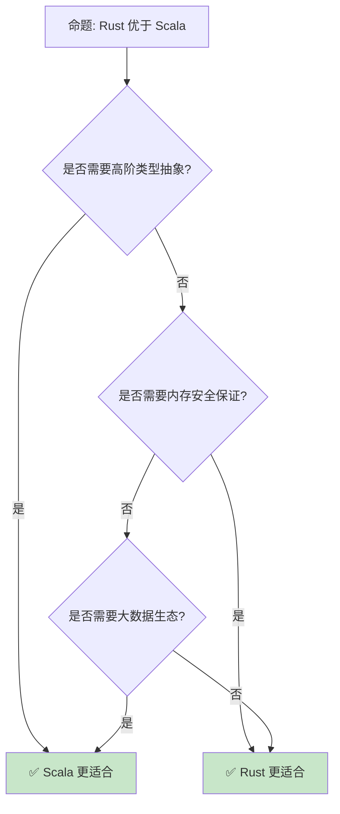

> **内容分级**: [综述级]
> **定理链**: N/A — 描述性/综述性/导航性文档，不涉及形式化定理链
>
# Rust vs Scala：类型系统的两种哲学
>
> **EN**: Rust vs Scala
> **Summary**: Comparative analysis of Rust and Scala across type systems, functional programming, and runtime.
>
> **受众**: [进阶]
> **Bloom 层级**: 分析 → 评价
> **定位**: 对比分析 **Rust** 与 **Scala** 的设计哲学——从类型推断（Type Inference）、模式匹配（Pattern Matching）到并发模型，揭示两种语言如何在类型表达力和运行时（Runtime）表示之间做出选择。
> **前置概念**: [Ownership](../../01_foundation/01_ownership_borrow_lifetime/01_ownership.md) · [Type System](../../01_foundation/02_type_system/04_type_system.md) · [Generics](../../02_intermediate/01_generics/02_generics.md)
> **后置概念**: [JVM Ecosystem](../../06_ecosystem/02_core_crates/03_core_crates.md) · [Functional Programming](../00_paradigms/03_paradigm_matrix.md)

---

> **来源**: [The Rust Programming Language](https://doc.rust-lang.org/book/title-page.html) · [Scala Documentation](https://docs.scala-lang.org/) · [Scala Book](https://docs.scala-lang.org/scala3/book/introduction.html) · [Wikipedia — Scala](https://en.wikipedia.org/wiki/Scala_(programming_language)) · [Wikipedia — Rust](https://en.wikipedia.org/wiki/Rust_(programming_language)) · [Brown University — Interactive Rust Book](https://rust-book.cs.brown.edu/) · [Jung et al. — RustBelt: Securing the Foundations of Rust](https://plv.mpi-sws.org/rustbelt/popl18/) · [Itanium C++ ABI](https://itanium-cxx-abi.github.io/cxx-abi/abi.html)
> **前置依赖**: [Type Theory](../../04_formal/00_type_theory/02_type_theory.md)

## 📑 目录

- Rust vs Scala：类型系统（Type System）的两种哲学
  - [📑 目录](#-目录)
  - [一、核心对比](#一核心对比)
    - [1.1 类型系统（Type System）](#11-类型系统)
    - 1.2 模式匹配（Pattern Matching）
    - [1.3 并发模型](#13-并发模型)
  - [二、语言特性差异](#二语言特性差异)
    - 2.1 类型推断（Type Inference）
    - [2.2 隐式与 Trait](#22-隐式与-trait)
    - 2.3 宏（Macro）系统
  - [三、工程实践差异](#三工程实践差异)
    - [3.1 构建系统](#31-构建系统)
    - [3.2 互操作性](#32-互操作性)
  - [四、反命题与边界分析](#四反命题与边界分析)
    - [4.1 反命题树](#41-反命题树)
    - [4.2 边界极限](#42-边界极限)
  - [五、常见陷阱](#五常见陷阱)
  - [六、来源与延伸阅读](#六来源与延伸阅读)
  - [相关概念文件](#相关概念文件)
  - [权威来源索引](#权威来源索引)
  - [十、边界测试：Rust 与 Scala 的编译错误对比](#十边界测试rust-与-scala-的编译错误对比)
    - [10.1 边界测试：Scala 的隐式转换与 Rust 的显式 trait（编译错误）](#101-边界测试scala-的隐式转换与-rust-的显式-trait编译错误)
    - [10.2 边界测试：Scala 的 null 与 Rust 的 Option（编译错误）](#102-边界测试scala-的-null-与-rust-的-option编译错误)
    - [10.3 边界测试：Scala 的隐式转换与 Rust 的显式 `From`/`Into`（编译错误）](#103-边界测试scala-的隐式转换与-rust-的显式-frominto编译错误)
    - 10.4 边界测试：Scala 的 actor 模型与 Rust 的 async/channel 的并发模型差异（运行时（Runtime）死锁）
    - [10.3 边界测试：Scala 的隐式转换与 Rust 的显式类型安全（编译错误）](#103-边界测试scala-的隐式转换与-rust-的显式类型安全编译错误)
  - [嵌入式测验（Embedded Quiz）](#嵌入式测验embedded-quiz)
    - [测验 1：Scala 的"混合面向对象与函数式"与 Rust 的" mostly 函数式"有什么设计哲学差异？（理解层）](#测验-1scala-的混合面向对象与函数式与-rust-的-mostly-函数式有什么设计哲学差异理解层)
    - [测验 2：Scala 的隐式参数（Implicits）与 Rust 的 trait bounds 在类型类机制上有什么区别？（理解层）](#测验-2scala-的隐式参数implicits与-rust-的-trait-bounds-在类型类机制上有什么区别理解层)
    - [测验 3：Scala 运行在 JVM 上，Rust 编译为原生。这对 GC 和实时性有什么影响？（理解层）](#测验-3scala-运行在-jvm-上rust-编译为原生这对-gc-和实时性有什么影响理解层)
    - [测验 4：Scala 的 case class 与 Rust 的 `#[derive(Debug, Clone)]` struct 有什么对应关系？（理解层）](#测验-4scala-的-case-class-与-rust-的-derivedebug-clone-struct-有什么对应关系理解层)
    - [测验 5：为什么 Rust 的类型推断（Type Inference）比 Scala 更保守？（理解层）](#测验-5为什么-rust-的类型推断比-scala-更保守理解层)
  - [认知路径](#认知路径)
    - [核心推理链](#核心推理链)
    - [反命题与边界](#反命题与边界)

---

## 一、核心对比
>
>

### 1.1 类型系统
>

```text
类型系统对比:

  Scala:
  ├── 静态类型 + 强类型
  ├── 子类型多态（继承）
  ├── 参数多态（泛型）
  ├── 特设多态（隐式）
  ├── 高阶类型（Higher-Kinded Types）
  ├── 类型构造器抽象
  └── 类型擦除（JVM）

  Rust:
  ├── 静态类型 + 强类型
  ├── 参数多态（泛型）
  ├── 特设多态（Trait）
  ├── 无继承（组合优先）
  ├── 无高阶类型（直接）
  ├── 单态化（零成本）
  └── 无类型擦除

  高阶类型对比:
  Scala: trait Functor[F[_]] { def map[A, B](fa: F[A])(f: A => B): F[B] }
  Rust:  trait Functor { type Item; fn map<B, F: Fn(Self::Item) -> B>(self, f: F) -> impl Functor<Item = B>; }
  // Rust 通过 GAT 和 impl Trait 间接实现

  代码对比:

  Scala:
    def map[F[_]: Functor, A, B](fa: F[A])(f: A => B): F[B] =
      implicitly[Functor[F]].map(fa)(f)

  Rust:
    fn map<I, F, B>(iter: I, f: F) -> impl Iterator<Item = B>
    where
        I: Iterator,
        F: Fn(I::Item) -> B,
    {
        iter.map(f)
    }
```

> **类型洞察**: **Scala 的类型系统（Type System）更表达丰富（HKT），Rust 的类型系统更安全（所有权）**——两者代表了不同的设计哲学。
> [来源: [Scala Type System](https://docs.scala-lang.org/scala3/book/types-introduction.html)]

---

### 1.2 模式匹配
>

```text
模式匹配对比:

  Scala:
  ├── 强大的 extractors
  ├── 守卫条件（guards）
  ├── 密封 trait（sealed trait）
  ├── 编译期穷尽性检查
  └── 可以匹配任意对象

  Rust:
  ├── 结构化模式匹配
  ├── 守卫条件
  ├── 枚举（enum）天然封闭
  ├── 编译期穷尽性检查
  └── 不可反驳/可反驳模式

  代码对比:

  Scala:
    val result = expr match {
      case Some(x) if x > 0 => x
      case None => 0
      case _ => -1
    }

  Rust:
    let result = match expr {
        Some(x) if x > 0 => x,
        None => 0,
        _ => -1,
    };

  差异:
  ├── Scala 匹配更灵活（运行时类型匹配）
  ├── Rust 匹配更高效（编译期优化）
  ├── Scala 有 extractors 自定义模式
  └── Rust 的 match 是表达式（返回值）
```

> **匹配洞察**: **Scala 的模式匹配（Pattern Matching）更灵活，Rust 的模式匹配更高效**——两者都提供编译期穷尽性检查。
> [来源: [Scala Pattern Matching](https://docs.scala-lang.org/tour/pattern-matching.html)]

---

### 1.3 并发模型
>

```text
并发对比:

  Scala:
  ├── Actor 模型（Akka）
  ├── Future/Promise
  ├── 并行集合
  ├── STM（软件事务内存）
  └── JVM 线程模型

  Rust:
  ├── 所有权保证线程安全
  ├── async/await
  ├── Send/Sync trait
  ├── 无数据竞争
  └── 原生线程

  Actor 模型:
  Scala/Akka: 消息传递，状态隔离
  Rust: 无内置 Actor，但可用 actix/riker

  代码对比:

  Scala:
    import scala.concurrent.Future
    import scala.concurrent.ExecutionContext.Implicits.global

    val result = for {
      a <- fetchA()
      b <- fetchB()
    } yield a + b

  Rust:
    async fn result() -> i32 {
        let (a, b) = tokio::join!(fetch_a(), fetch_b());
        a + b
    }
```

> **并发洞察**: **Scala 的 Actor 模型适合分布式，Rust 的所有权模型适合系统级**——两者各有主战场。
> [来源: [Akka](https://akka.io/)]

---

## 二、语言特性差异

### 2.1 类型推断
>

```text
类型推断对比:

  Scala:
  ├── Hindley-Milner 扩展
  ├── 局部类型推断
  ├── 高阶类型推断
  ├── 流敏感类型
  └── 有时需要显式标注

  Rust:
  ├── HM 风格
  ├── 强大的局部推断
  ├── 泛型约束传播
  ├── 生命周期推断
  └── 大多数情况下无需标注

  差异:
  ├── Scala 推断更强大（高阶类型）
  ├── Rust 推断更实用（生命周期）
  ├── Scala 可能类型不明确
  ├── Rust 类型通常明确
  └── 两者推断能力都强
```

> **推断洞察**: **Scala 的类型推断（Type Inference）更学术化，Rust 的类型推断更工程化**——两者都减少样板代码。
> [来源: [Scala Type Inference](https://docs.scala-lang.org/scala3/book/types-inferred.html)]

---

### 2.2 隐式与 Trait
>

```text
隐式（Scala）vs Trait（Rust）:

  Scala 隐式:
  ├── implicit val/def/class
  ├── 自动注入参数
  ├── 隐式转换
  ├── 隐式类（扩展方法）
  └── 上下文界定

  Rust Trait:
  ├── impl Trait for Type
  ├── Orphan Rule 限制
  ├── 显式实现
  ├── 无隐式转换
  └── 无隐式参数

  代码对比:

  Scala:
    implicit val ordering: Ordering[Person] = new Ordering[Person] {
      def compare(a: Person, b: Person): Int = a.age.compare(b.age)
    }
    // 自动使用隐式 Ordering
    val sorted = people.sorted

  Rust:
    impl Ord for Person {
        fn cmp(&self, other: &Self) -> Ordering {
            self.age.cmp(&other.age)
        }
    }
    // 显式排序
    let sorted = people.sort();

  差异:
  ├── Scala 隐式更自动（可能隐藏）
  ├── Rust Trait 更明确（显式实现）
  ├── Scala 隐式转换灵活但危险
  ├── Rust 无隐式转换（安全但啰嗦）
  └── Scala 3 改为 given/using 更明确
```

> **隐式洞察**: **Scala 的隐式是"魔法"，Rust 的 Trait 是"契约"**——Rust 更强调显式性。
> [来源: [Scala 3 Given](https://docs.scala-lang.org/scala3/book/ca-given-using-clauses.html)]

---

### 2.3 宏系统
>

```text
宏系统对比:

  Scala:
  ├── 编译期宏（def macros）
  ├── 准引用（quasiquotes）
  ├── 内联（inline）
  ├── 类型级编程
  └── 反射（运行时）

  Rust:
  ├── macro_rules!（声明式）
  ├── 过程宏（derive/attribute/function-like）
  ├── TokenStream 处理
  ├── 编译期执行
  └── 无运行时反射

  代码对比:

  Scala:
    inline def debug(inline expr: Any): Unit = {
      println(s"${expr} = ${expr}")
    }

  Rust:
    macro_rules! debug {
        ($expr:expr) => {
            println!("{} = {:?}", stringify!($expr), $expr);
        };
    }

  差异:
  ├── Scala 宏更强大（可访问类型信息）
  ├── Rust 宏更安全（TokenStream 限制）
  ├── Scala 宏更复杂
  ├── Rust 宏更易用
  └── Scala 3 inline 简化了部分用例
```

> **宏（Macro）洞察**: **Scala 宏更强大但复杂，Rust 宏更简单但受限**——两者适合不同的元编程场景。
> [来源: [Scala Macros](https://docs.scala-lang.org/scala3/guides/macros/macros.html)]

---

## 三、工程实践差异

### 3.1 构建系统
>

```text
构建系统对比:

  Scala:
  ├── sbt（主要）
  ├── Mill
  ├── Gradle
  ├── Maven
  └── 依赖: Maven Central

  Rust:
  ├── Cargo（唯一）
  ├── Cargo.toml
  ├── crates.io
  └── 简单统一

  对比:
  ├── Scala 构建系统多样（sbt 复杂）
  ├── Rust Cargo 简单统一
  ├── Scala 编译慢（类型推断复杂）
  ├── Rust 编译中等（单态化）
  └── Scala 启动慢（JVM 预热）
```

> **构建洞察**: **Rust 的 Cargo 比 Scala 的 sbt 更易用**——统一工具链减少了配置负担。
> [来源: [sbt](https://www.scala-sbt.org/)]

---

### 3.2 互操作性
>

```text
互操作对比:

  Scala:
  ├── Java: 100% 互操作
  ├── Kotlin: 良好互操作
  ├── JavaScript: Scala.js
  ├── Native: Scala Native
  └── JVM 生态

  Rust:
  ├── C: FFI（零开销）
  ├── C++: cxx / bindgen
  ├── WebAssembly: wasm-bindgen
  ├── Python: PyO3
  └── 多语言胶水

  Scala 优势:
  ├── Java 生态无缝使用
  ├── Spark、Kafka 等大数据工具
  ├── 企业级库丰富
  └── 函数式库成熟

  Rust 优势:
  ├── C ABI 原生支持
  ├── 无 GC 开销
  ├── 系统级控制
  └── WebAssembly 优势
```

> **互操作洞察**: **Scala 是 JVM 生态的"最佳公民"，Rust 是系统编程的"通用胶水"**。
> [来源: [Scala Interop](https://docs.scala-lang.org/scala3/book/interacting-with-java.html)]

---

## 四、反命题与边界分析

### 4.1 反命题树



> **认知功能**: **高阶类型/大数据选 Scala，内存安全（Memory Safety）/系统编程选 Rust**——两者在不同领域不可替代。
> [来源: [Scala vs Rust Discussion](https://users.scala-lang.org/)]

---

### 4.2 边界极限

```text
边界 1: 学习曲线
├── Scala: 类型系统复杂，概念多
├── Rust: 所有权独特，借用检查严格
├── Scala: 更学术化
└── Rust: 更工程化

边界 2: 编译时间
├── Scala: 慢（类型推断复杂）
├── Rust: 中等（单态化）
└── 两者都需要优化

边界 3: 运行时性能
├── Scala: JVM JIT 优化好，但有 GC
├── Rust: AOT 编译，无 GC，内存少
└── Rust 系统级性能更优

边界 4: 生态
├── Scala: 大数据、机器学习成熟
├── Rust: 系统工具、Web 后端增长快
└── 根据领域选择

边界 5: 团队
├── Scala: 函数式编程背景
├── Rust: 系统编程背景
└── 培训成本不同
```

> **边界要点**: Rust vs Scala 的边界与**学习曲线**、**编译时间**、**性能**、**生态**和**团队**相关。
> [来源: [Scala Documentation](https://docs.scala-lang.org/)]

---

## 五、常见陷阱
>

```text
陷阱 1: 在 Rust 中写 Scala 风格代码
  ❌ 过度使用 Rc/RefCell 模拟可变状态
     let x = Rc::new(RefCell::new(HashMap::new()));

  ✅ 利用所有权和不可变性
     let mut x = HashMap::new();

陷阱 2: 在 Scala 中写 Rust 风格代码
  ❌ 过度使用 val 模拟不可变
     // Scala 中 var 也是合理选择

  ✅ 根据场景选择 val/var
     // Scala 鼓励不可变，但不强制

陷阱 3: 混淆隐式和 Trait
  ❌ 在 Rust 中期望自动注入
     // Rust 无隐式参数

  ✅ 显式传递或使用类型系统
     // Rust 更明确

陷阱 4: 忽略 JVM 开销
  ❌ 用 Scala 写系统工具
     // JVM 启动慢，内存大

  ✅ 系统工具选 Rust
     // AOT 编译，启动快

陷阱 5: 过度抽象
  ❌ 用高阶类型解决简单问题
     // 增加复杂度无收益

  ✅ 保持简单
     // KISS 原则
```

> **陷阱总结**: Rust vs Scala 的陷阱主要与**风格模仿**、**隐式**、**JVM 开销**和**过度抽象**相关。

---

## 六、来源与延伸阅读

| 来源 | 可信度 | 说明 |
|:---|:---:|:---|
| [Scala Documentation](https://docs.scala-lang.org/) | ✅ 一级 | 官方文档 |
| [TRPL](https://doc.rust-lang.org/book/title-page.html) | ✅ 一级 | Rust 官方书 |
| [Scala Book](https://docs.scala-lang.org/scala3/book/introduction.html) | ✅ 一级 | Scala 3 书 |
| [Akka](https://akka.io/) | ✅ 二级 | Actor 框架 |
| [Scala vs Rust](https://users.scala-lang.org/) | ✅ 三级 | 社区讨论 |
| [Wikipedia — Scala](https://en.wikipedia.org/wiki/Scala_(programming_language)) | ✅ 一级 | 语言概述 |

---

```rust
fn main() {
    let msg = "Hello from Rust";
    println!("{}", msg);
}
```

## 相关概念文件

- [Ownership](../../01_foundation/01_ownership_borrow_lifetime/01_ownership.md) — 所有权
- [Type System](../../01_foundation/02_type_system/04_type_system.md) — 类型系统（Type System）
- [Generics](../../02_intermediate/01_generics/02_generics.md) — 泛型（Generics）
- [Paradigm Matrix](../00_paradigms/03_paradigm_matrix.md) — 范式矩阵

---

> **权威来源**: [Rust Reference](https://doc.rust-lang.org/reference/introduction.html)
>
> **权威来源对齐变更日志**: 2026-05-22 创建 [Authority Source Sprint Batch 12](../../00_meta/02_sources/international_authority_index.md)

**文档版本**: 1.0
**对应 Rust 版本**: 1.96.1+ (Edition 2024)
**最后更新**: 2026-05-22
**状态**: ✅ 概念文件创建完成

---

## 权威来源索引

>
>
>

---

---

---

## 十、边界测试：Rust 与 Scala 的编译错误对比

### 10.1 边界测试：Scala 的隐式转换与 Rust 的显式 trait（编译错误）

```rust,ignore
trait ToJson {
    fn to_json(&self) -> String;
}

fn main() {
    let x = 42;
    // ❌ 编译错误: `i32` 未实现 `ToJson`
    // Rust 没有隐式转换，必须显式调用方法
    // let json = x.to_json();
}

// 正确: 显式实现 trait
impl ToJson for i32 {
    fn to_json(&self) -> String {
        format!("{}", self)
    }
}

fn fixed() {
    let x = 42;
    let json = x.to_json(); // ✅ i32 实现了 ToJson
}
```

> **Scala 对比**: Scala 的隐式转换（`implicit def`）允许自动将 `Int` 转为 `JsonValue`。Rust 禁止隐式转换——必须显式 `impl Trait for Type`。Scala 的隐式解析在编译期执行，但可能导致意外转换和难以追踪的编译错误。Rust 的显式实现确保每个类型转换都是设计者的有意选择，错误信息更精确。这与 Scala 3 的 `given`/`using`（显式隐式）方向一致——Rust 从一开始就选择了显式路径。[来源: [The Rust Programming Language](https://doc.rust-lang.org/book/title-page.html)]

### 10.2 边界测试：Scala 的 null 与 Rust 的 Option（编译错误）

```rust,ignore
fn main() {
    // ❌ 编译错误: Rust 没有 null
    // let s: Option<String> = null; // 编译错误
    let s: Option<String> = None; // ✅ 使用 Option 表示空值
}

// 正确: Option 的模式匹配
fn fixed() {
    let s: Option<String> = Some(String::from("hello"));
    match s {
        Some(v) => println!("{}", v),
        None => println!("empty"),
    }
}
```

> **Scala 对比**: Scala 运行在 JVM 上，与 Java 互操作，因此存在 `null`（`String = null`）。Scala 推荐使用 `Option[T]`，但无法完全禁止 `null`。Rust 没有 `null`——引用（Reference）类型（`&T`、`Box<T>`）永远指向有效内存，`Option<T>` 是唯一的可空表示。这消除了 NullPointerException 的整个类别，是 Rust 相对于 JVM 语言的核心安全优势。[来源: [The Rust Programming Language](https://doc.rust-lang.org/book/title-page.html)]

### 10.3 边界测试：Scala 的隐式转换与 Rust 的显式 `From`/`Into`（编译错误）

```rust,ignore
struct Meters(u32);
struct Kilometers(u32);

// Rust: 无隐式转换，必须显式实现 From/Into
impl From<Kilometers> for Meters {
    fn from(k: Kilometers) -> Self {
        Meters(k.0 * 1000)
    }
}

fn main() {
    let k = Kilometers(5);
    // ❌ 编译错误: 不能隐式转换 Kilometers 为 Meters
    // let m: Meters = k;

    // 正确: 显式转换
    let m: Meters = k.into();
    println!("{}", m.0);
}
```

> **修正**: Scala 的**隐式转换**（implicit conversions）允许编译器在类型不匹配时自动插入转换函数：`implicit def kmToM(k: Kilometers): Meters = Meters(k.value * 1000)`。这提供了极大的便利性（如 `5.km` 自动转为 `Meters`），但也导致难以追踪的编译错误（隐式解析失败时的错误信息复杂）和意外行为（不期望的转换被应用）。Rust 的 `From`/`Into` trait 要求**显式** `.into()` 调用，转换点一目了然。这与 C++ 的隐式转换构造函数（单参数构造函数自动成为转换）或 Go 的无转换（必须显式）不同——Rust 选择了 Go 的显式路径，但提供了 `From`/`Into` 的标准化转换接口。Scala 3 的 `given`/`using` 替代了 `implicit`，但隐式转换仍存在（需显式导入）。[来源: [The Rust Programming Language](https://doc.rust-lang.org/book/ch10-02-traits.html)] · [来源: [Scala Implicit Conversions](https://docs.scala-lang.org/scala3/reference/contextual/conversions.html)]

### 10.4 边界测试：Scala 的 actor 模型与 Rust 的 async/channel 的并发模型差异（运行时死锁）

```rust,compile_fail
use tokio::sync::mpsc;

async fn actor_style() {
    let (tx, mut rx) = mpsc::channel(10);

    // Scala/Akka: actor 有邮箱，消息异步处理，actor 内部单线程
    // Rust: channel 只是数据传输，接收方需显式处理

    tx.send("hello".to_string()).await.unwrap();

    // ❌ 运行时死锁风险: 若接收方阻塞发送方（同步通道）
    // 或接收方未运行（异步通道但任务未 spawn）
    let msg = rx.recv().await.unwrap();
    println!("{}", msg);
}
```

> **修正**: Scala/Akka 的 **Actor 模型** 中，每个 actor 有独立的邮箱和单线程执行上下文，消息发送是 fire-and-forget，actor 按顺序处理消息。Rust 的 `tokio::sync::mpsc` 只是**通道**（channel）：发送和接收是显式操作，无内置的 actor 语义。在 Rust 中实现 actor：1) 用 `tokio::spawn` 创建任务作为 actor；2) 用 `mpsc` 作为邮箱；3) 在任务循环中 `recv().await` 处理消息。这比 Akka 更底层但更灵活：无 actor 层次监督（supervision）、无路由（routing）、无持久化（persistence）。`actix` crate 提供了 Rust 的 actor 框架，但不如 Akka 成熟。这与 Erlang/Elixir 的 OTP（成熟的 actor 框架）或 Go 的 CSP（channel + goroutine，类似 Rust）类似——Rust 的并发原语是底层的，高层抽象由库提供。[来源: [Tokio Documentation](https://docs.rs/tokio/)] · [来源: [Akka Actor Model](https://doc.akka.io/docs/akka/current/typed/actors.html)]

### 10.3 边界测试：Scala 的隐式转换与 Rust 的显式类型安全（编译错误）

```rust,compile_fail
struct Meters(u32);
struct Feet(u32);

// Scala 中: implicit def metersToFeet(m: Meters): Feet = Feet(m.value * 3)
// Rust 中: 无隐式转换

fn main() {
    let m = Meters(10);
    // ❌ 编译错误: Meters 不能隐式转为 Feet
    let f: Feet = m;
}
```

> **修正**: Rust **禁止隐式类型转换**（除少数自动强制：`&T` → `&U` 若 `T: U`、`&mut T` → `&T`、`T` → `U` 若 `T: Into<U>` 但在特定上下文）。`Meters` 和 `Feet` 是不同的类型，即使语义相关，也不能直接赋值。显式转换：1) `impl From<Meters> for Feet` + `let f: Feet = m.into()`；2) `impl Into<Feet> for Meters`；3) 解构：`let Feet(f) = m.into()`。Scala 的隐式转换（`implicit def` / `given` / `using`）允许库作者定义自动转换，但可能导致"隐式解析地狱"（编译时间长、错误信息难读）。Rust 的设计哲学：**显式优于隐式**。这与 C++ 的转换构造函数（单参数构造函数隐式调用）或 Go 的接口实现（隐式满足接口）不同——Rust 的显式转换使代码更易读、错误更易定位。[来源: [The Rust Programming Language](https://doc.rust-lang.org/book/ch03-02-data-types.html)] · [来源: [Rust API Guidelines](https://rust-lang.github.io/api-guidelines/)]

## 嵌入式测验（Embedded Quiz）

### 测验 1：Scala 的"混合面向对象与函数式"与 Rust 的" mostly 函数式"有什么设计哲学差异？（理解层）

**题目**: Scala 的"混合面向对象与函数式"与 Rust 的" mostly 函数式"有什么设计哲学差异？

<details>
<summary>✅ 答案与解析</summary>

Scala 保留完整的 OOP（继承、多态、可变状态），函数式是可选风格。Rust 强制所有权和不可变引用（Immutable Reference），函数式是默认，OOP 通过 trait 实现且不支持继承。
</details>

---

### 测验 2：Scala 的隐式参数（Implicits）与 Rust 的 trait bounds 在类型类机制上有什么区别？（理解层）

**题目**: Scala 的隐式参数（Implicits）与 Rust 的 trait bounds 在类型类机制上有什么区别？

<details>
<summary>✅ 答案与解析</summary>

Scala implicits 自动搜索作用域内的实例，灵活但可能产生晦涩错误。Rust trait bounds 显式声明，编译器在编译期解析，更严格但更易于理解和调试。
</details>

---

### 测验 3：Scala 运行在 JVM 上，Rust 编译为原生。这对 GC 和实时性有什么影响？（理解层）

**题目**: Scala 运行在 JVM 上，Rust 编译为原生。这对 GC 和实时性有什么影响？

<details>
<summary>✅ 答案与解析</summary>

Scala 受 JVM GC 影响，可能出现不可预测的停顿。Rust 无 GC，内存释放是确定性的，适合实时系统和延迟敏感应用。
</details>

---

### 测验 4：Scala 的 case class 与 Rust 的 `#[derive(Debug, Clone)]` struct 有什么对应关系？（理解层）

**题目**: Scala 的 case class 与 Rust 的 `#[derive(Debug, Clone)]` struct 有什么对应关系？

<details>
<summary>✅ 答案与解析</summary>

两者都提供不可变数据结构和自动派生方法。Scala case class 自动提供 `copy`、`equals`、`hashCode`、模式匹配（Pattern Matching）。Rust 需显式 derive，但控制权更大。
</details>

---

### 测验 5：为什么 Rust 的类型推断比 Scala 更保守？（理解层）

**题目**: 为什么 Rust 的类型推断（Type Inference）比 Scala 更保守？

<details>
<summary>✅ 答案与解析</summary>

Rust 要求函数签名通常显式标注类型（生命周期（Lifetimes）和泛型（Generics））。Scala 支持更激进的局部类型推断（Type Inference）（如 Hindley-Milner 扩展）。Rust 的保守性是为了编译速度和明确的接口契约。
</details>

## 认知路径

> **认知路径**: 从 L0 基础概念出发，经由本节的 **Rust vs Scala：类型系统（Type System）的两种哲学** 核心原理，通向 L2 进阶模式与 L3 工程实践。

### 核心推理链

| 定理 | 前提 | 结论 | 置信度 |
|:---|:---|:---|:---|
| Rust vs Scala：类型系统（Type System）的两种哲学 基础定义 ⟹ 正确用法 | 理解语法与语义 | 能写出符合惯用法的代码 | 高 |
| Rust vs Scala：类型系统（Type System）的两种哲学 正确用法 ⟹ 常见陷阱 | 忽略边界条件 | 编译错误或运行时（Runtime） bug | 高 |
| Rust vs Scala：类型系统（Type System）的两种哲学 常见陷阱 ⟹ 深度掌握 | 系统学习反模式 | 能进行代码审查与优化 | 高 |

> **过渡**: 掌握 Rust vs Scala：类型系统的两种哲学 的基础语法后，下一步需要理解其在类型系统中的位置与与其他概念的交互关系。
> **过渡**: 在实践中应用 Rust vs Scala：类型系统的两种哲学 时，务必关注边界条件与异常处理，这是从"能编译"到"能生产"的关键跃迁。
> **过渡**: Rust vs Scala：类型系统的两种哲学 的设计理念体现了 Rust 零成本抽象（Zero-Cost Abstraction）与安全保证的核心权衡，理解这一权衡有助于迁移到更高级的并发与形式化验证领域。

### 反命题与边界

> **反命题**: "Rust vs Scala：类型系统的两种哲学 在所有场景下都是最佳选择" —— 错误。需要根据具体上下文权衡性能、可读性与安全性，某些场景下显式替代方案可能更优。
