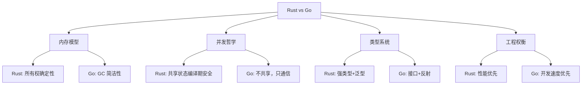
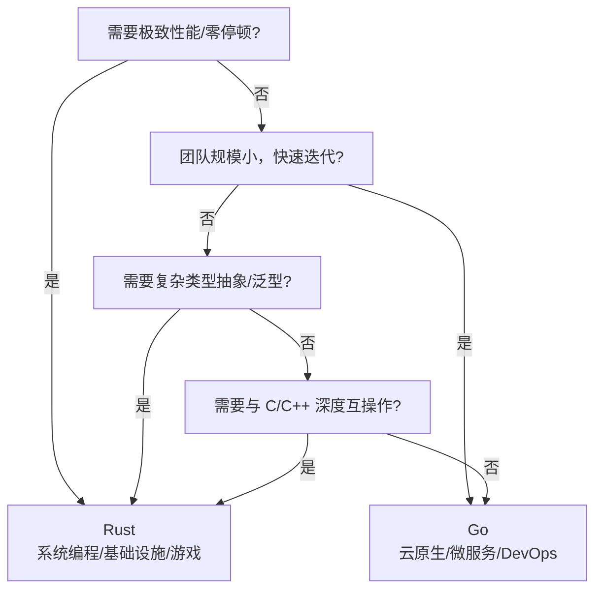

# Rust vs Go：线性所有权 vs CSP 过程逻辑

> **层级**: L5 对比分析
> **前置概念**: [Ownership](../01_foundation/01_ownership.md) · [Concurrency](../03_advanced/01_concurrency.md) · [Memory Management](../02_intermediate/03_memory_management.md)
> **后置概念**: [Paradigm Matrix](./03_paradigm_matrix.md)
> **主要来源**: [TRPL] · [Effective Go] · [Wikipedia: Communicating sequential processes] · [Wikipedia: Go]

---

**变更日志**:

- v1.0 (2026-05-12): 初始版本，完成本体论对比、并发模型对比、内存模型对比、决策树

---

## 一、权威定义

### 1.1 设计哲学对比

> **[TRPL]** Rust's central feature is ownership — a set of rules checked by the compiler that govern how a Rust program manages memory.
> **[Effective Go]** Go's approach to concurrency differs from Rust's. Go communicates by sharing memory (via channels), while Rust shares memory by communicating (through ownership transfer).

### 1.2 核心命题

| **维度** | **Rust** | **Go** |
|:---|:---|:---|
| **设计起点** | 如何用类型论消除整类错误 | 如何用简单机制构建可扩展系统 |
| **信任对象** | 编译器（数学证明） | 程序员（简单代码+运行时） |
| **内存安全** | 编译期保证（所有权） | 运行时 GC |
| **并发模型** | 所有权 + Send/Sync | Goroutine + Channel (CSP) |
| **形式化基础** | 线性/仿射类型论 | 无统一形式化（工程惯例） |
| **零成本抽象** | ✅ 核心承诺 | ⚠️ GC 有运行时开销 |
| **编译速度** | 慢（借用检查+单态化） | 快 |
| **学习曲线** | 陡峭 | 平缓 |

---

## 二、概念属性矩阵

### 2.1 内存管理对比矩阵

| **维度** | **Rust** | **Go** |
|:---|:---|:---|
| **机制** | 所有权 + RAII | 垃圾回收（GC） |
| **运行时开销** | 零（除 Drop） | GC 停顿（通常 <1ms） |
| **内存碎片** | 可控（明确释放） | GC 压缩减少碎片 |
| **实时性** | ✅ 确定性释放 | ❌ GC 停顿不可预测 |
| **循环引用** | 编译期阻止（所有权）或 Weak | GC 自动处理 |
| **内存泄漏** | 可能（Rc 循环、 forgetting） | 可能（全局引用） |

### 2.2 并发模型对比矩阵

| **维度** | **Rust** | **Go** |
|:---|:---|:---|
| **核心抽象** | OS 线程 / async 任务 | Goroutine（M:N 调度） |
| **通信方式** | 所有权转移（channel）+ 共享状态（Mutex） | Channel（值拷贝） |
| **共享内存** | 编译期验证安全（Sync） | 程序员责任 |
| **数据竞争** | 编译期消除 | 运行时可能存在 |
| **调度器** | OS 或运行时（Tokio） | Go runtime（M:N） |
| **栈大小** | 固定（通常 2MB） | 动态增长（2KB 起始） |
| **创建成本** | 较高（OS 线程） | 极低（~2KB） |

### 2.3 错误处理对比矩阵

| **维度** | **Rust** | **Go** |
|:---|:---|:---|
| **机制** | `Result<T, E>` + `?` | 多返回值 `(T, error)` |
| **强制性** | 强（必须处理或传播） | 弱（可忽略） |
| **组合性** | ✅ `and_then`, `map` | ⚠️ 手动检查 |
| **堆栈信息** | 可选 backtrace | 默认无（需 fmt.Errorf） |
| **panic** | 不可恢复，默认展开 | recover() 可捕获 |

---

## 三、思维导图

---

## 四、决策树

---

## 五、知识来源关系

| **论断** | **来源** | **可信度** |
|:---|:---|:---|
| Rust 所有权编译期保证安全 | [TRPL] | ✅ |
| Go 通过 GC 简化内存管理 | [Effective Go] | ✅ |
| Go 的并发模型基于 CSP | [Wikipedia: CSP] | ✅ |
| Rust 无 GC 有确定性释放 | [TRPL] | ✅ |

---

## 六、待补充

- [ ] **TODO**: 补充具体微服务场景的性能对比数据
- [ ] **TODO**: 补充混合使用 Rust+Go 的架构模式
