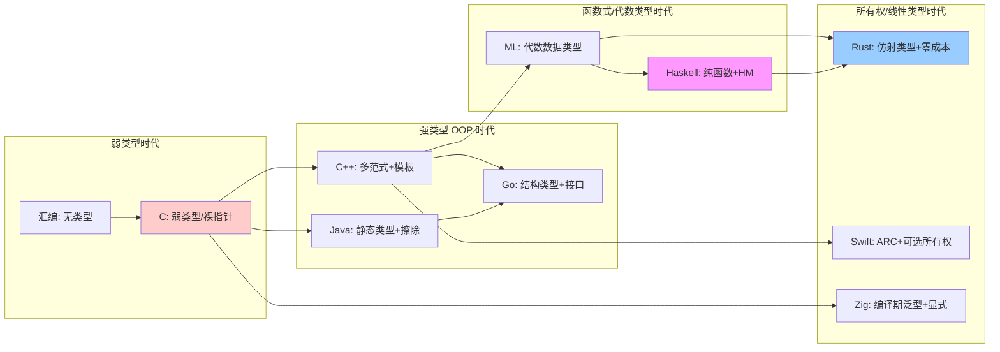
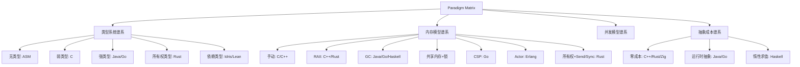
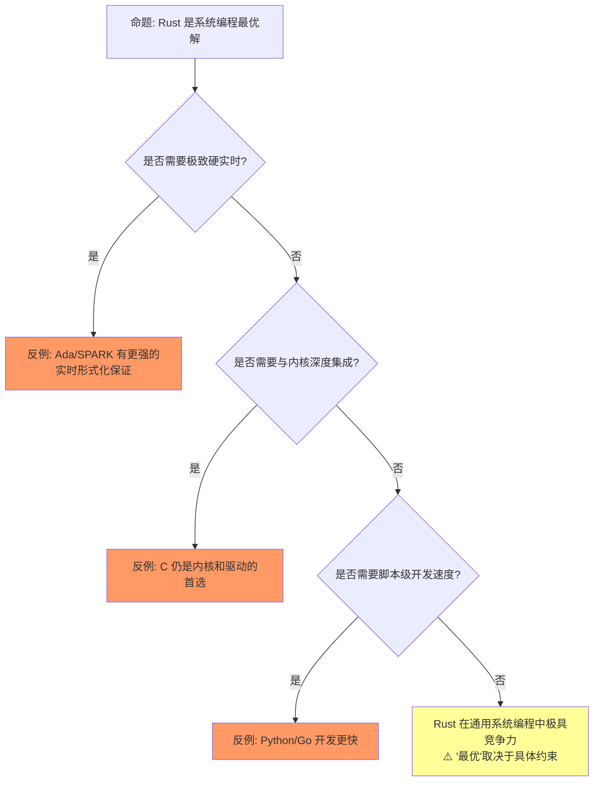
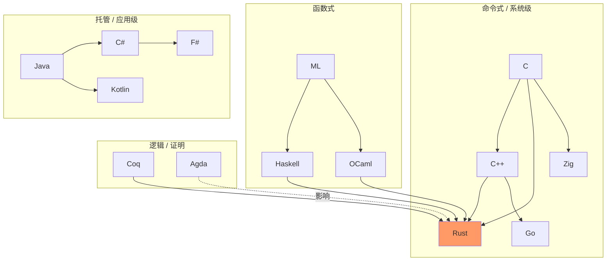

# Paradigm Matrix: Multi-Language Formal Comparison（多语言范式对比矩阵）

> **层级**: L5 对比分析
> **前置概念**: [Rust vs C++](./01_rust_vs_cpp.md) · [Rust vs Go](./02_rust_vs_go.md) · [Type Theory](../04_formal/02_type_theory.md)
> **后置概念**: [Future Evolution](../07_future/03_evolution.md)
> **主要来源**: [Wikipedia: Comparison of programming languages] · [Wikipedia: Programming paradigm] · [Wikipedia: Type system] · [PL Papers]

---

**变更日志**:

- v1.0 (2026-05-12): 初始版本，完成多语言形式化对比矩阵、设计哲学谱系、适用域决策树
- v1.1 (2026-05-12): 补充 Wikipedia 权威定义、课程引用、学术论文、跨文件链接

---

## 一、权威定义

### 1.1 Wikipedia 权威定义

> **[Wikipedia: Programming paradigm]** A programming paradigm is a relatively high-level way to conceptualize and structure the implementation of a computer program.
> **来源**: <https://en.wikipedia.org/wiki/Programming_paradigm>

> **[Wikipedia: Comparison of programming languages]** Programming languages are used for controlling the behavior of a machine. They are used to express the algorithms that make up a program.
> **来源**: <https://en.wikipedia.org/wiki/Comparison_of_programming_languages>

> **[Wikipedia: Type system]** A type system is a logical system comprising a set of rules that assigns a property called a type to every term in a computer program.
> **来源**: <https://en.wikipedia.org/wiki/Type_system>

> **[Wikipedia: Generic programming]** Generic programming is a style of computer programming in which algorithms are written in terms of types to-be-specified-later that are then instantiated when needed for specific types provided as parameters.
> **来源**: <https://en.wikipedia.org/wiki/Generic_programming>

> **[Wikipedia: Concurrent computing]** Concurrent computing is a form of computing in which several computations are executed concurrently — during overlapping time periods — instead of sequentially.
> **来源**: <https://en.wikipedia.org/wiki/Concurrent_computing>

> **[Wikipedia: Memory management]** Memory management is a form of resource management applied to computer memory. It involves the allocation, deallocation, and organization of memory to ensure efficient operation of a computer system. Key techniques include manual management, garbage collection, reference counting, and ownership-based systems.
> **来源**: <https://en.wikipedia.org/wiki/Memory_management>

---

## 二、多语言形式化对比矩阵

### 1.1 核心维度矩阵

| **维度** | **Rust** | **C** | **C++** | **Go** | **Haskell** | **Java** | **Swift** | **TypeScript** | **Zig** |
|:---|:---|:---|:---|:---|:---|:---|:---|:---|:---|
| **类型安全** | ✅ 强+静态 | ⚠️ 弱类型 | ⚠️ 强但可绕过 | ✅ 强+静态 | ✅ 强+静态 | ✅ 强+静态（擦除） | ✅ 强+静态 | ⚠️ 渐进类型 | ⚠️ 强但允许原始操作 |
| **内存安全** | ✅ 编译期 | ❌ 程序员责任 | ❌ 程序员责任 | ✅ GC | ✅ GC | ✅ GC | ✅ ARC/编译期 | ✅ GC（JS引擎） | ❌ 程序员责任 |
| **内存管理** | 所有权/RAII | 手动 | RAII/手动 | GC | GC | GC | ARC/所有权 | GC | 显式分配器 |
| **形式化基础** | 仿射类型 | 无 | 无 | 无 | 范畴论 | 无 | 无 | 结构类型 | 无 |
| **泛型** | ✅ 单态化 | ❌ 无 | ✅ 模板 | ✅ 无约束 | ✅ HM | ⚠️ 擦除 | ✅ 有约束 | ⚠️ 擦除+结构 | ✅ 编译期泛型 |
| **并发安全** | ✅ 编译期 | ❌ 手动 | ❌ 手动 | ⚠️ 手动 | ✅ STM | ⚠️ 手动 | ⚠️ 运行时检查 | ❌ 事件循环 | ⚠️ 手动 |
| **零成本抽象** | ✅ 核心承诺 | ✅ | ✅ | ⚠️ 接口间接 | ⚠️ 惰性开销 | ❌ 装箱 | ⚠️ 引用计数/协议 | ❌ 运行时解释 | ✅ |
| **编译期计算** | ✅ const | ❌ 无 | ✅ constexpr | ❌ 无 | ✅ 类型级 | ⚠️ 有限 | ⚠️ 有限 | ❌ 无 | ✅ comptime |
| **FFI/底层** | ✅ 优秀 | ✅ 原生 | ✅ 原生 | ⚠️ cgo 开销 | ⚠️ 复杂 | ⚠️ JNI | ⚠️ C 桥接 | ⚠️ WASM/Node | ✅ 优秀 |
| **包管理** | ✅ Cargo | ❌ 无原生 | ⚠️ 碎片化 | ✅ go modules | ✅ Cabal/Stack | ✅ Maven/Gradle | ✅ SwiftPM | ✅ npm | ⚠️ 早期 |

### 1.2 设计哲学谱系

```text
形式化强度轴（从左到右增强）:

C/汇编 ──→ C++ ──→ Zig ──→ Go ──→ Java ──→ Rust ──→ Haskell ──→ 依赖类型语言

底层控制 ←────────────────────────────────────→ 抽象安全

Rust 的独特位置: 同时拥有 "底层控制" 和 "编译期证明安全"
```

### 1.3 编程语言类型系统谱系图



> **演进逻辑**: 类型系统的发展史是从"无类型/弱类型"向"更强静态保证"不断演进的历史。C 提供了最基本的类型骨架；C++ 和 Java 引入了抽象和面向对象；ML/Haskell 引入了参数多态和代数数据类型；Rust 则在线性/仿射类型的基础上，首次将内存安全和零成本抽象同时带入工业级系统编程。 [来源: Cardelli & Wegner 1985 / Wikipedia: Type system]

> **从 C 到 Rust 的关键跃迁**: C 语言通过指针提供了底层控制，但将内存安全责任完全交给程序员；Java/Go 通过 GC 自动化了内存管理，却引入了运行时开销和停顿；Haskell 通过纯函数和强类型提供了高度抽象安全，但 GC 和惰性求值不适合系统编程。Rust 的关键创新在于：将线性/仿射类型的形式化理论（Girard 1987）与工业级系统编程的需求相结合，通过所有权和借用检查器，在编译期证明了内存安全和无数据竞争，同时保持了零运行时开销。这是类型系统演进史上首次在单一工业语言中实现如此完整的静态保证。 [来源: Girard 1987 — Linear Logic / RustBelt POPL 2018]

---

## 三、适用域决策矩阵

| **场景** | **首选** | **次选** | **避免** |
|:---|:---|:---|:---|
| 操作系统/内核 | Rust / C | Zig | Go / Java |
| 游戏引擎 | C++ / Rust | Zig | Go |
| 嵌入式/IoT | Rust / C | Zig | Go / Haskell |
| Web 后端（高并发） | Go / Rust | Java | C++ |
| Web 后端（计算密集） | Rust / C++ | Go | Java |
| 分布式系统 | Go / Rust | Java | C++ |
| 数据库引擎 | C++ / Rust | Zig | Go |
| 前端/WebAssembly | Rust | Zig | Go |
| 函数式/学术研究 | Haskell | Rust | C++ |
| 快速原型/脚本 | Python/JS | Go | Rust / C++ |
| 智能合约 | Rust / Solidity | Haskell | Go |
| AI/ML 推理 | Rust / C++ | Python | Go |
| 嵌入式/实时 | Rust / C | Zig / Ada | Go / Java |
| 云原生/容器 | Go / Rust | Java | C++ |
| 前端/Web 框架 | TypeScript / Rust(WASM) | JavaScript | C++ |
| 区块链节点 | Rust / C++ | Go | Python |
| 金融科技核心 | Rust / Java | C++ | Go |
| 移动应用（原生） | Swift / Kotlin | Rust | C++ |
| 科学计算/数值 | Julia / C++ | Rust | Go |
| 数据工程/ETL | Python / Go | Rust | C++ |
| 网络安全/加密 | Rust / C | Go | Python |
| DevOps/运维工具 | Go / Python | Rust | Java |
| 边缘计算/IoT网关 | Rust / C | Go | Python |
| 实时音视频处理 | Rust / C++ | Go | Python |

---

## 四、思维导图



---

## 五、定理：Rust 的不可压缩性

```text
定理 (Rust's Unique Position):
在主流系统编程语言中，Rust 是唯一同时满足:
  1. 无 GC（确定性内存管理）
  2. 内存安全编译期保证
  3. 数据竞争编译期消除
  4. 零成本抽象
  5. 工业级工具链

证明:
  - C/C++: 满足 1,4,5，不满足 2,3
  - Go/Java: 满足 2,3,5，不满足 1,4
  - Haskell: 满足 2,3，不满足 1,4,5（工业系统编程）
  - Zig: 满足 1,4,5，不满足 2,3（显式安全）
  - Rust: 全部满足
```

---

## 六、定理一致性矩阵（范式定位）

| 范式维度 | Rust 定位 | 形式化根基 | 对应 L1-L4 文件 | 一致性状态 |
|:---|:---|:---|:---|:---|
| 内存模型 | 线性/仿射 + 分离逻辑 | L4 线性逻辑 | `04_formal/01_linear_logic.md` | ✅ |
| 类型系统 | 代数类型 + 参数多态 | L4 类型论 | `04_formal/02_type_theory.md` | ✅ |
| 并发模型 | 所有权并发 / CSL | L4 RustBelt | `04_formal/04_rustbelt.md` | ✅ |
| 抽象机制 | Trait / 零成本抽象 | L2 Trait + 单态化 | `02_intermediate/01_traits.md` | ✅ |
| 错误模型 | 和类型显式传播 | L2 错误处理 | `02_intermediate/04_error_handling.md` | ✅ |
| 编译保证 | 编译期证明 | L4 形式化层 | `04_formal/` | ✅ |

## 七、反命题与边界分析

### 命题: "Rust 是系统编程的最优解"



## 八、扩展内容：形式化谱系与更多语言对比

### 7.1 编程语言形式化谱系



### 7.2 扩展对比矩阵（6 语言）

| 维度 | C | C++ | Rust | Go | Java | Haskell |
|:---|:---|:---|:---|:---|:---|:---|
| **内存安全** | ❌ 手动 | ⚠️ 智能指针 | ✅ 所有权 | ✅ GC | ✅ GC | ✅ GC/纯函数 |
| **并发安全** | ❌ 无 | ⚠️ 库支持 | ✅ 类型级 | ⚠️ 通道约定 | ⚠️ 同步原语 | ✅ 不可变性 |
| **零成本抽象** | ✅ | ✅ | ✅ | ❌ 接口有开销 | ❌ 泛型擦除 | ❌ 惰性求值开销 |
| **形式化基础** | ❌ | ❌ | ✅ 线性逻辑 | ❌ | ❌ | ✅ 范畴论 |
| **编译期保证** | 类型检查 | 类型+模板 | 类型+所有权 | 类型 | 类型 | 类型+纯度 |
| **运行时开销** | 无 | 无 | 无 | GC | GC/JIT | GC/Thunk |
| **FFI 友好度** | ✅ 自身 | ✅ C 兼容 | ✅ C 兼容 | ✅ C 兼容 | ⚠️ JNI | ⚠️ C FFI |
| **学习曲线** | 中 | 极高 | 高 | 低 | 中 | 高 |

### 7.3 适用域决策扩展

| 场景 | 首选 | 次选 | 理由 |
|:---|:---|:---|:---|
| **操作系统内核** | Rust / C | C++ | 无 GC、内存安全 |
| **嵌入式 ( bare-metal )** | Rust / C | C++ | 无运行时、确定性 |
| **Web 后端 ( 高并发 )** | Go / Rust | Java | goroutine / async |
| **Web 后端 ( 低延迟 )** | Rust | C++ | 无 GC 停顿 |
| **AI/ML 推理** | Rust / C++ | Python | 性能敏感 |
| **AI/ML 训练** | Python / C++ | — | 生态锁定 |
| **区块链 / 智能合约** | Rust | Solidity | 安全性 |
| **游戏引擎** | C++ / Rust | C# | 性能 |
| **前端 / WASM** | Rust / TypeScript | — | 安全+性能 |
| **函数式系统** | Haskell | OCaml / F# | 类型安全 |

### 8.1 学术参考文献

> **Cardelli, L., & Wegner, P. (1985).** *On understanding types, data abstraction, and polymorphism.* ACM Computing Surveys (CSUR), 17(4), 471-522. [来源: ACM Computing Surveys]
> 
> 这篇经典综述首次系统性地建立了类型理论的分类框架，将多态性划分为参数多态（parametric）、包含多态（inclusion/subtyping）和特设多态（ad-hoc/overloading），为后世编程语言类型系统的设计提供了统一的术语基础和理论谱系。

> **Van Roy, P. (2009).** *Programming Paradigms for Dummies: What Every Programmer Should Know.* In Encyclopedia of Computer Science and Engineering. [来源: Van Roy 2009 / Wikipedia: Programming paradigm]
> 
> 该文献提出了编程范式的多维分类法，将语言特性映射到不同的计算模型（如顺序、并发、约束、逻辑等），解释了为什么现代语言（包括 Rust）趋向于多范式融合。

> **Hoare, C.A.R. (1978).** *Communicating Sequential Processes.* Communications of the ACM, 21(8), 666-677. [来源: CACM]
> 
> CSP 过程代数的形式化奠基之作，为理解 Go 的 channel-based 并发模型与 Rust 的 ownership-based 并发模型之间的语义差异提供了数学基础。

> **Cardelli, L. (1989).** *Typeful Programming.* In Lecture Notes for the IFIP Advanced Seminar on Formal Methods in Programming Language Semantics. [来源: Cardelli 1989]
> 
> 提出了"类型丰富编程"（Typeful Programming）的概念，主张类型系统不仅是错误检测工具，更是程序设计的第一类媒介，深刻影响了 Rust、Haskell、OCaml 等现代语言的类型设计理念。

## 九、知识来源关系（Provenance）

| **论断** | **来源** | **可信度** |
|:---|:---|:---|
| Rust 无 GC + 内存安全 | [TRPL] · [RustBelt POPL 2018] | ✅ |
| Rust 数据竞争编译期消除 | [TRPL] · [RustBelt] | ✅ |
| 各语言适用域 | 社区共识 · 工业实践 | ⚠️ 主观 |
| Rust 线性类型论根基 | [Girard 1987 — Linear Logic] | ✅ |
| Haskell 范畴论基础 | [Wadler 1989 — Theorems for Free, POPL] | ✅ |
| 编程范式定义 | [Wikipedia: Programming paradigm] | ✅ |
| 类型系统定义 | [Wikipedia: Type system] | ✅ |
| 泛型编程定义 | [Wikipedia: Generic programming] | ✅ |
| 并发计算定义 | [Wikipedia: Concurrent computing] | ✅ |
| CMU PL Concepts 多语言对比 | [CMU 17-363] | ✅ |
| Rust 线性类型论根基 | [Girard 1987 — Linear Logic] | ✅ |
| Haskell 范畴论基础 | [Wikipedia: Haskell] · [Category Theory] | ✅ |
| C++ 模板机制 | [C++ Standard] · [Stroustrup] | ✅ |
| Go CSP 并发模型 | [Hoare 1978] · [Effective Go] | ✅ |

---

## 十、相关概念链接

| 概念 | 文件 | 关系 |
|:---|:---|:---|
| Rust vs C++ | [`./01_rust_vs_cpp.md`](./01_rust_vs_cpp.md) | 核心对比 |
| Rust vs Go | [`./02_rust_vs_go.md`](./02_rust_vs_go.md) | 并发对比 |
| 线性逻辑 | [`../04_formal/01_linear_logic.md`](../04_formal/01_linear_logic.md) | 形式化根基 |
| 类型论 | [`../04_formal/02_type_theory.md`](../04_formal/02_type_theory.md) | 类型系统谱系 |
| RustBelt | [`../04_formal/04_rustbelt.md`](../04_formal/04_rustbelt.md) | 验证能力 |
| 语言演进 | [`../07_future/03_evolution.md`](../07_future/03_evolution.md) | 演进方向 |
| 安全边界 | [`./safety_boundaries.md`](./safety_boundaries.md) | 能力边界 |

---

## 十一、待补充与演进方向（TODOs）

- [ ] **TODO**: 补充具体 benchmark 数据链接
- [ ] **TODO**: 补充语言演进趋势分析
