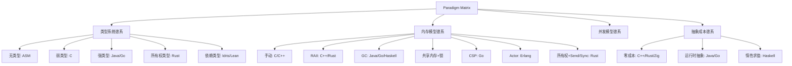

# Paradigm Matrix: Multi-Language Formal Comparison（多语言范式对比矩阵）

> **层级**: L5 对比分析
> **前置概念**: [Rust vs C++](./01_rust_vs_cpp.md) · [Rust vs Go](./02_rust_vs_go.md) · [Type Theory](../04_formal/02_type_theory.md)
> **后置概念**: [Future Evolution](../07_future/03_evolution.md)
> **主要来源**: [Wikipedia: Comparison of programming languages] · [Type Systems] · [PL Papers]

---

**变更日志**:

- v1.0 (2026-05-12): 初始版本，完成多语言形式化对比矩阵、设计哲学谱系、适用域决策树

---

## 一、多语言形式化对比矩阵

### 1.1 核心维度矩阵

| **维度** | **Rust** | **C++** | **Go** | **Haskell** | **Java** | **Zig** |
|:---|:---|:---|:---|:---|:---|:---|
| **类型安全** | ✅ 强+静态 | ⚠️ 强但可绕过 | ✅ 强+静态 | ✅ 强+静态 | ✅ 强+静态（擦除） | ⚠️ 强但允许原始操作 |
| **内存安全** | ✅ 编译期 | ❌ 程序员责任 | ✅ GC | ✅ GC | ✅ GC | ❌ 程序员责任 |
| **内存管理** | 所有权/RAII | RAII/手动 | GC | GC | GC | 显式分配器 |
| **形式化基础** | 仿射类型 | 无 | 无 | 范畴论 | 无 | 无 |
| **泛型** | ✅ 单态化 | ✅ 模板 | ✅ 无约束 | ✅ HM | ⚠️ 擦除 | ✅ 编译期泛型 |
| **并发安全** | ✅ 编译期 | ❌ 手动 | ⚠️ 手动 | ✅ STM | ⚠️ 手动 | ⚠️ 手动 |
| **零成本抽象** | ✅ 核心承诺 | ✅ | ⚠️ 接口间接 | ⚠️ 惰性开销 | ❌ 装箱 | ✅ |
| **编译期计算** | ✅ const | ✅ constexpr | ❌ 无 | ✅ 类型级 | ⚠️ 有限 | ✅ comptime |
| **FFI/底层** | ✅ 优秀 | ✅ 原生 | ⚠️ cgo 开销 | ⚠️ 复杂 | ⚠️ JNI | ✅ 优秀 |
| **包管理** | ✅ Cargo | ⚠️ 碎片化 | ✅ go modules | ✅ Cabal/Stack | ✅ Maven/Gradle | ⚠️ 早期 |

### 1.2 设计哲学谱系

```text
形式化强度轴（从左到右增强）:

C/汇编 ──→ C++ ──→ Zig ──→ Go ──→ Java ──→ Rust ──→ Haskell ──→ 依赖类型语言

底层控制 ←────────────────────────────────────→ 抽象安全

Rust 的独特位置: 同时拥有 "底层控制" 和 "编译期证明安全"
```

---

## 二、适用域决策矩阵

| **场景** | **首选** | **次选** | **避免** |
|:---|:---|:---|:---|
| 操作系统/内核 | Rust / C | Zig | Go / Java |
| 游戏引擎 | C++ / Rust | Zig | Go |
| 嵌入式/IoT | Rust / C | Zig | Go / Haskell |
| Web 后端（高并发） | Go / Rust | Java | C++ |
| Web 后端（计算密集） | Rust / C++ | Go | Java |
| 分布式系统 | Go / Rust | Java | C++ |
| 数据库引擎 | C++ / Rust | Zig | Go |
| 前端/WebAssembly | Rust | Zig | Go |
| 函数式/学术研究 | Haskell | Rust | C++ |
| 快速原型/脚本 | Python/JS | Go | Rust / C++ |
| 智能合约 | Rust / Solidity | Haskell | Go |
| AI/ML 推理 | Rust / C++ | Python | Go |

---

## 三、思维导图



---

## 四、定理：Rust 的不可压缩性

```text
定理 (Rust's Unique Position):
在主流系统编程语言中，Rust 是唯一同时满足:
  1. 无 GC（确定性内存管理）
  2. 内存安全编译期保证
  3. 数据竞争编译期消除
  4. 零成本抽象
  5. 工业级工具链

证明:
  - C/C++: 满足 1,4,5，不满足 2,3
  - Go/Java: 满足 2,3,5，不满足 1,4
  - Haskell: 满足 2,3，不满足 1,4,5（工业系统编程）
  - Zig: 满足 1,4,5，不满足 2,3（显式安全）
  - Rust: 全部满足
```

---

## 五、知识来源关系

| **论断** | **来源** | **可信度** |
|:---|:---|:---|
| Rust 无 GC + 内存安全 | [TRPL] · [RustBelt] | ✅ |
| Rust 数据竞争编译期消除 | [TRPL] · [RustBelt] | ✅ |
| 各语言适用域 | 社区共识 · 工业实践 | ⚠️ 主观 |

---

## 六、待补充

- [ ] **TODO**: 补充具体 benchmark 数据链接
- [ ] **TODO**: 补充语言演进趋势分析
