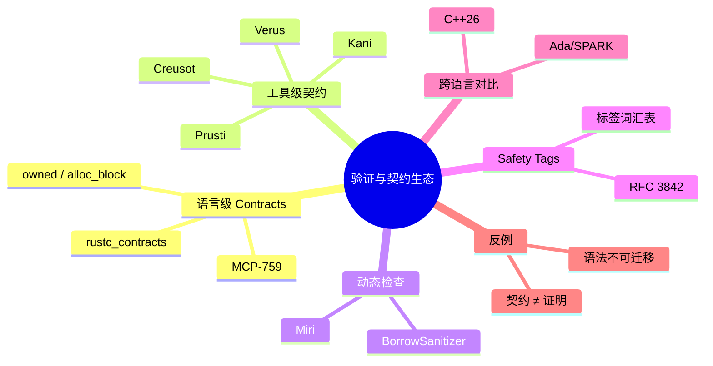

# 验证与契约生态导览

> **EN**: Verification and Contracts Ecosystem Overview
> **Summary**: A map of language-level and tool-level contract systems for Rust and related ecosystems, linking to the Rust Contracts canonical page and cross-language comparison.
> **Rust 版本**: 1.97.0+ (Edition 2024)
> **Bloom 层级**: L4-L5
> **权威来源**: 本文件为 `concept/` 权威页；通用 Rust Contracts 概念请参见 [`concept/04_formal/04_model_checking/12_rust_contracts.md`](../../04_formal/04_model_checking/12_rust_contracts.md)。

---

Rust 的验证与契约生态同时存在于两个层面：

1. **语言级契约（Language-level Contracts）**：由 Rust 编译器团队主导的 MCP-759 / `feature(contracts)`，目标是把 `unsafe fn` 的前后置条件变成编译器可识别的属性；
2. **工具级契约（Tool-level Contracts）**：Kani、Prusti、Creusot、Verus 等验证器各自的 `requires`/`ensures` 方言，以及 Miri、BorrowSanitizer 等动态检查工具。

本目录把两者放在同一专题下对比，帮助读者判断“什么时候用语言级 Contracts、什么时候用 Safety Tags、什么时候用形式化验证工具”。

> **来源**: [MCP-759 — Contracts](https://github.com/rust-lang/compiler-team/issues/759) · [Kani 文档](https://model-checking.github.io/kani/) · [Prusti User Guide](https://viperproject.github.io/prusti-dev/user-guide/) · [Creusot](https://creusot.rs/) · [Verus OSDI 2023](https://www.microsoft.com/en-us/research/publication/verus-verifying-rust-programs-using-linear-ghost-types/)

---

## 一、本专题包含的权威页

| 页 | 作用 | 主要覆盖 |
| :--- | :--- | :--- |
| [Rust 语言级 Contracts](../../04_formal/04_model_checking/12_rust_contracts.md) | Rust 契约语言权威页 | `#[rustc_contracts::requires/ensures/invariant]`、`owned`/`alloc_block` |
| [契约系统对比](01_contracts_comparison.md) | 跨语言/跨工具比较 | Rust / C++26 / Ada-SPARK / Kani / Prusti / Creusot / Verus |

---

## 二、语言级 vs 工具级契约

| 维度 | 语言级 Contracts (MCP-759) | 工具级契约（Kani/Prusti/Creusot/Verus） |
| :--- | :--- | :--- |
| 入口 | `#[rustc_contracts::requires]` 等属性 | `#[kani::requires]` / `#[requires]` / `ensures` 等 |
| 与编译器关系 | 编译器原生支持，稳定后零成本 | 依赖外部工具解析 |
| 动态检查 | Miri 可消费契约 | 一般无动态检查 |
| 静态检查 | Kani/Prusti/Creusot/Verus 可消费 | 各工具自带证明后端 |
| 当前状态 | Nightly `feature(contracts)` | 已可用，但语法/能力各异 |

> **关键洞察**: 语言级 Contracts 不替代工具级验证器，而是为它们提供统一语法入口；工具级验证器则为 Contracts 提供实际证明能力。

---

## 三、与 Safety Tags 的三角关系

```text
                 语言级 Contracts
                      │
                      │ 可执行/可验证
                      ▼
Safety Tags ◄───────► 契约表达式
(标签词汇表)            │
                      │
                      ▼
              工具验证器 (Kani/Prusti/...)
```

- **Safety Tags** 回答“这是什么安全属性”（如 `valid_ptr`、`aligned`）；
- **Contracts** 回答“该属性的精确前后置条件是什么”；
- **验证器** 回答“这些条件是否被满足”。

详见 [Safety Tags 预览](../../07_future/02_preview_features/03_safety_tags_preview.md)。

> **来源**: [RFC #3842 — Safety Tags](https://github.com/rust-lang/rfcs/pull/3842)

---

## 四、⚠️ 反例与边界

### 4.1 反例：把“契约”当成“证明”

语言级 Contracts 本身只是**规格说明**；默认情况下它们不运行任何检查，也不自动产生证明。把它们当成“加了属性就安全”会制造虚假安全感。

```text
错误推理链:
 unsafe fn f(ptr: *const i32)
   ↓ 添加 #[rustc_contracts::requires(...)]
 就认为所有调用点都已自动验证
   ↓ 实际仍依赖 Miri/Kani/人工审查
```

> **修正**: Contracts 是“验证意图的可机器读取格式”，不是验证本身。必须配套测试、Miri、Kani 或形式化证明。

### 4.2 反例：混淆“工具级语法”与“语言级语法”

Kani 的 `#[kani::requires]`、Prusti 的 `#[requires]` 与 MCP-759 的 `#[rustc_contracts::requires]` 是不同属性。在 stable 1.97 上，只有工具级属性可被对应 crate 识别；`rustc_contracts` 路径会编译失败。

```rust,compile_fail
// 错误：在 stable 1.97 上 rustc_contracts 不可用
#[rustc_contracts::requires(for safety: !ptr.is_null())]
unsafe fn deref(ptr: *const i32) -> i32 {
    *ptr
}
```

> **修正**: 当前 stable 项目应使用工具级契约或结构化 SAFETY 注释；语言级 Contracts 仅在 nightly 实验。

### 4.3 边界：不同工具的契约语义不一致

- Kani 的 `requires` 在 BMC 边界内是**假设**；
- Prusti 的 `requires` 是**前置条件**，用 Viper 权限模型证明；
- Verus 的 `requires` 与线性幽灵状态绑定。

迁移代码时不能直接复制粘贴属性，必须重新理解语义。

---

## 五、来源与延伸阅读

| 来源 | 可信度 | 说明 |
| :--- | :---: | :--- |
| [MCP-759 — Contracts](https://github.com/rust-lang/compiler-team/issues/759) | ✅ 一级 | Rust 语言级契约 |
| [Kani 文档](https://model-checking.github.io/kani/) | ✅ 一级 | 有界模型检查 |
| [Prusti User Guide](https://viperproject.github.io/prusti-dev/user-guide/) | ✅ 一级 | 演绎验证 |
| [Creusot](https://creusot.rs/) | ✅ 一级 | Why3 后端 |
| [Verus OSDI 2023](https://www.microsoft.com/en-us/research/publication/verus-verifying-rust-programs-using-linear-ghost-types/) | ✅ 一级 | 线性幽灵类型 |
| [C++26 Contracts P2900/P3846](https://www.open-std.org/jtc1/sc22/wg21/docs/papers/2025/p3846r0.pdf) | ✅ 一级 | 跨语言对比 |
| [Ada/SPARK Contracts](https://learn.adacore.com/courses/intro-to-spark/index.html) | ✅ 一级 | 形式化契约先驱 |

---

## 相关概念

- [Rust 语言级 Contracts](../../04_formal/04_model_checking/12_rust_contracts.md)
- [契约系统对比](01_contracts_comparison.md)
- [Safety Tags 预览](../../07_future/02_preview_features/03_safety_tags_preview.md)
- [Kani](../../04_formal/04_model_checking/09_kani.md)

---

## 🧭 思维导图（Mindmap）


