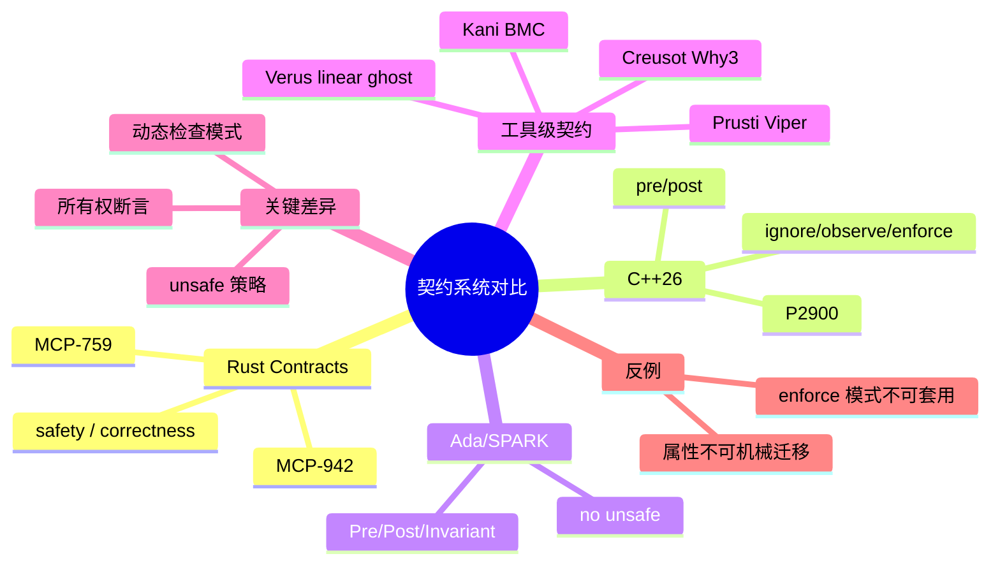

# 契约系统对比：Rust、C++26、Ada/SPARK 与演绎验证器

> **EN**: Comparative Contracts: Rust, C++26, Ada/SPARK, and Deductive Verifiers
> **Summary**: Compare language-level and tool-level contract systems across Rust (MCP-759/942), C++26 (P2900), Ada/SPARK, and Rust verifiers (Kani, Prusti, Creusot, Verus).
> **Rust 版本**: 1.97.0+ (Edition 2024)
> **Bloom 层级**: L4-L5
> **权威来源**: 本文件为 `concept/` 权威页；Rust 语言级 Contracts 的完整概念请参见 [`concept/04_formal/04_model_checking/12_rust_contracts.md`](../../04_formal/04_model_checking/12_rust_contracts.md)。

---

不同语言与工具的契约系统共享同一套 Hoare 逻辑骨架，但在**语法形态、安全/正确性分离、所有权断言、动态检查、与 unsafe 的关系**五个维度上差异显著。本页把这些差异汇总为一张决策表，并提供最小代码样例。

> **来源**: [MCP-759 — Contracts](https://github.com/rust-lang/compiler-team/issues/759) · [MCP-942 — ownership assertions](https://github.com/rust-lang/compiler-team/issues/942) · [C++26 Contracts P2900/P3846](https://www.open-std.org/jtc1/sc22/wg21/docs/papers/2025/p3846r0.pdf) · [Ada/SPARK Contracts](https://learn.adacore.com/courses/intro-to-spark/index.html)

---

## 一、核心维度对比表

| 维度 | Rust Contracts | C++26 Contracts (P2900) | Ada/SPARK | Kani | Prusti | Creusot | Verus |
| :--- | :--- | :--- | :--- | :--- | :--- | :--- | :--- |
| 语法形态 | `#[rustc_contracts::requires]` 属性 | `[[pre:]]` / `[[post:]]` / `contract_assert` | `Pre`/`Post`/`Invariant` 方面 | `#[kani::requires]` | `#[requires]` | `#[requires]` | `requires`/`ensures` 子句 |
| 安全/正确性分离 | `for safety:` / `for correctness:` | 无显式分离 | 可区分，但不使用相同关键字 | 无显式分离 | 无显式分离 | 无显式分离 | `spec`/`proof`/`exec` 三模 |
| 所有权断言 | `owned`/`alloc_block` | 无原生支持 | 通过 access 子句 | `can_dereference` | Viper permissions | prophecy variables | linear ghost |
| 动态检查 | Miri / runtime opt-in | ignore/observe/enforce/quick-enforce | 运行时断言 + GNATprove | 无 | 无 | 无 | 无 |
| 静态检查 | 工具消费 | 部分编译器假设 | SPARK Prover | BMC (CBMC) | 分离逻辑 (Viper) | Why3 | SMT |
| 与 unsafe 关系 | 直接服务 unsafe 前置条件 | Safe C++ P3390 借鉴 Rust | SPARK 禁止或隔离 unsafe | 可验证 unsafe | 有限 | 有限 | 需 Verus 原语 |

> **来源**: [Safe C++ P3390R0](https://www.open-std.org/jtc1/sc22/wg21/docs/papers/2024/p3390r0.html) · [Kani paper (arXiv:2607.01504)](https://arxiv.org/abs/2607.01504) · [Prusti User Guide](https://viperproject.github.io/prusti-dev/user-guide/) · [Creusot](https://creusot.rs/) · [Verus OSDI 2023](https://www.microsoft.com/en-us/research/publication/verus-verifying-rust-programs-using-linear-ghost-types/)

---

## 二、代码样例对比

### 2.1 Rust 语言级 Contracts（Nightly）

```rust,ignore
#![feature(contracts)]

#[rustc_contracts::requires(for safety: !ptr.is_null())]
#[rustc_contracts::requires(for safety: count <= isize::MAX as usize)]
#[rustc_contracts::ensures(|ret: &Vec<u8>| ret.len() == count)]
pub unsafe fn read_bytes(ptr: *const u8, count: usize) -> Vec<u8> {
    // ...
    Vec::new()
}
```

### 2.2 C++26 Contracts

```cpp
#include <contract>

std::size_t read_bytes(const std::byte* ptr, std::size_t count)
    [[pre: ptr != nullptr]]
    [[pre: count <= PTRDIFF_MAX]]
    [[post ret: /* ret.size() == count */]]
{
    return 0;
}
```

> **来源**: [P2900 — C++ Contracts](https://www.open-std.org/jtc1/sc22/wg21/docs/papers/2025/p3846r0.pdf) · [moderncpp.dev contracts overview](https://moderncpp.dev/articles/contracts-cpp26/)

### 2.3 Ada/SPARK

```ada
procedure Read_Bytes (Ptr : access Byte; Count : Natural; Ret : out Byte_Array)
  with Pre  => Ptr /= null and Count <= Byte_Array'Length,
       Post => Ret'Length = Count;
```

> **来源**: [AdaCore — SPARK Contracts](https://learn.adacore.com/courses/intro-to-spark/index.html)

### 2.4 Kani

```rust,ignore
#[kani::requires(!ptr.is_null())]
#[kani::ensures(|ret| *ret == unsafe { *ptr })]
unsafe fn deref(ptr: *const i32) -> i32 {
    *ptr
}

#[kani::proof]
fn check_deref() {
    let x = kani::any::<i32>();
    let ptr = &x as *const i32;
    unsafe { deref(ptr); }
}
```

> **来源**: [Kani 文档](https://model-checking.github.io/kani/)

### 2.5 Prusti

```rust,ignore
use prusti_contracts::*;

#[requires(!ptr.is_null())]
#[ensures(*ptr == result)]
unsafe fn deref(ptr: *const i32) -> i32 {
    *ptr
}
```

> **来源**: [Prusti User Guide](https://viperproject.github.io/prusti-dev/user-guide/)

### 2.6 Creusot

```rust,ignore
use creusot_contracts::*;

#[requires(!ptr.is_null())]
#[ensures(result == *ptr)]
unsafe fn deref(ptr: *const i32) -> i32 {
    *ptr
}
```

> **来源**: [Creusot 文档](https://creusot.rs/)

### 2.7 Verus

```rust,ignore
use vstd::prelude::*;

verus! {

unsafe fn deref(ptr: *const i32) -> (ret: i32)
    requires !ptr.is_null(),
    ensures ret == unsafe { *ptr },
{
    unsafe { *ptr }
}

}
```

> **来源**: [Verus OSDI 2023 paper](https://www.microsoft.com/en-us/research/publication/verus-verifying-rust-programs-using-linear-ghost-types/)

---

## 三、关键差异解析

### 3.1 安全 / 正确性分离

Rust Contracts 是目前少数在语法层面区分 **safety**（违反即 UB）和 **correctness**（违反即 bug）的契约系统。C++26、Ada/SPARK 和现有 Rust 验证器都没有同名的显式分类，虽然它们可以通过 `pragma`、ghost code 或 `proof` 函数实现类似区分。

> **来源**: [MCP-759 — safety vs correctness](https://github.com/rust-lang/compiler-team/issues/759)

### 3.2 所有权断言

Rust 的 `owned::<T>(p)` 与 `alloc_block::<T>(p)` 直接对应分离逻辑中的 points-to 与 block 断言。C++26 没有原生等价物；Ada/SPARK 用 access 子句或 ownership 策略表达；Kani 用 `can_dereference` 宏；Prusti 用 Viper 权限；Creusot 用 prophecy variables；Verus 用 linear ghost permissions。

> **来源**: [MCP-942 — tool mapping](https://github.com/rust-lang/compiler-team/issues/942) · [Fulminate (POPL 2025)](https://doi.org/10.1145/3704886)

### 3.3 动态检查模式

C++26 Contracts 明确定义了四种执行模式：

- `ignore`：完全忽略；
- `observe`：记录违约但继续执行；
- `enforce`：违约时终止；
- `quick-enforce`：编译期假设契约成立。

Rust Contracts 当前设计更接近“默认零开销 + Miri/运行时 opt-in”，还没有完整定义 observe/enforce/quick-enforce 的语义。

> **来源**: [P2900 — Contract Semantics](https://www.open-std.org/jtc1/sc22/wg21/docs/papers/2025/p3846r0.pdf)

---

## 四、⚠️ 反例与边界

### 4.1 反例：直接迁移属性

Rust 工具级属性不能 Mechanical 地替换为语言级属性。例如 Kani 的 `#[kani::ensures(|ret| *ptr == result)]` 中的闭包在语言级 Contracts 中可能有不同的求值上下文；Prusti 的 `pledges` 在语言级中尚无对应物。

```rust,ignore
// 错误示范：把 Prusti 属性直接改成 rustc_contracts 而不检查语义
#[rustc_contracts::requires(!ptr.is_null())]
#[rustc_contracts::ensures(*ptr == result)] // 语义可能不匹配
unsafe fn deref(ptr: *const i32) -> i32 { *ptr }
```

> **修正**: 迁移时必须对照各工具的契约语义文档，不能只做字符串替换。

### 4.2 反例：把 C++ 的 `enforce` 模式套用到 Rust

C++ `enforce` 违约时调用 `std::terminate`，而 Rust `for safety:` 契约违反当前设计**不自动触发 UB**。若按 C++ 思维认为“safety contract 违反必崩溃”，会误判 Rust Contracts 的行为。

> **修正**: Rust 的 safety contract 服务于 `unsafe` 前置条件，但违反 contract 本身在当前提案中不等价于立即触发语言级 UB。

### 4.3 边界：SPARK 禁止 unsafe，Rust Contracts 拥抱 unsafe

Ada/SPARK 的证明策略是**尽可能消除 unsafe/未初始化/指针算术**，因此它的契约系统不需要像 `owned`/`alloc_block` 这样复杂的内存所有权断言。Rust Contracts 则必须直面 unsafe 代码，这是两者设计差异的根源。

---

## 五、决策树：何时选择哪种契约系统

```text
是否需要 Rust 编译器原生支持？
├── 是 → 等待/实验 MCP-759 语言级 Contracts
└── 否 → 需要实际证明能力？
    ├── 是 → 需要 BMC？ → Kani
    │            需要分离逻辑？ → Prusti
    │            需要 Why3/预言变量？ → Creusot
    │            需要线性幽灵状态？ → Verus
    └── 否 → 只需要结构化标签 → Safety Tags (RFC #3842)
```

---

## 六、来源与延伸阅读

| 来源 | 可信度 | 说明 |
| :--- | :---: | :--- |
| [MCP-759 — Contracts](https://github.com/rust-lang/compiler-team/issues/759) | ✅ 一级 | Rust 语言级契约 |
| [MCP-942 — ownership assertions](https://github.com/rust-lang/compiler-team/issues/942) | ✅ 一级 | `owned`/`alloc_block` |
| [C++26 Contracts P2900/P3846](https://www.open-std.org/jtc1/sc22/wg21/docs/papers/2025/p3846r0.pdf) | ✅ 一级 | 跨语言对比 |
| [Safe C++ P3390R0](https://www.open-std.org/jtc1/sc22/wg21/docs/papers/2024/p3390r0.html) | ✅ 一级 | C++ 对 Rust unsafe 模型的借鉴 |
| [Ada/SPARK Contracts](https://learn.adacore.com/courses/intro-to-spark/index.html) | ✅ 一级 | 形式化契约先驱 |
| [Kani 文档](https://model-checking.github.io/kani/) | ✅ 一级 | BMC 验证 |
| [Prusti User Guide](https://viperproject.github.io/prusti-dev/user-guide/) | ✅ 一级 | 分离逻辑验证 |
| [Creusot](https://creusot.rs/) | ✅ 一级 | Why3 后端 |
| [Verus OSDI 2023](https://www.microsoft.com/en-us/research/publication/verus-verifying-rust-programs-using-linear-ghost-types/) | ✅ 一级 | 线性幽灵类型 |
| [Fulminate (POPL 2025)](https://doi.org/10.1145/3704886) | ✅ 一级 | 可执行分离逻辑 |

---

## 相关概念

- [Rust 语言级 Contracts](../../04_formal/04_model_checking/12_rust_contracts.md)
- [验证与契约生态导览](00_verification_and_contracts_overview.md)
- [Safety Tags 预览](../../07_future/02_preview_features/03_safety_tags_preview.md)
- [Kani](../../04_formal/04_model_checking/09_kani.md)

---

## 🧭 思维导图（Mindmap）



---

## 国际权威来源（P2 补充）

- [Verus verifier (GitHub)](https://github.com/verus-lang/verus)
- [Creusot verifier (GitHub)](https://github.com/creusot-rs/creusot)
