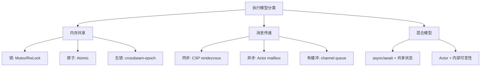
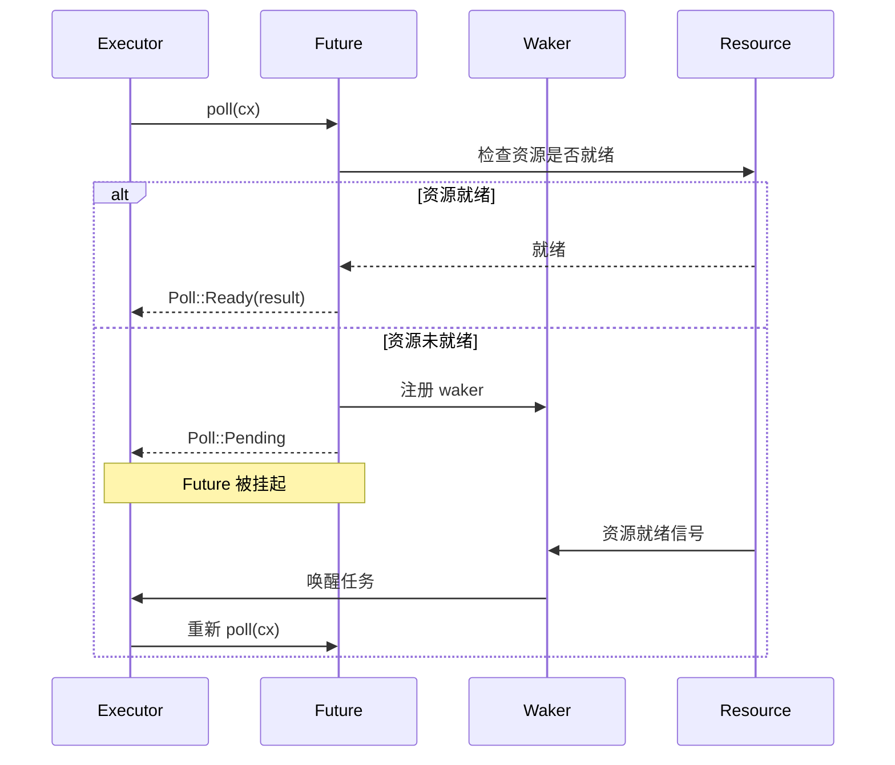
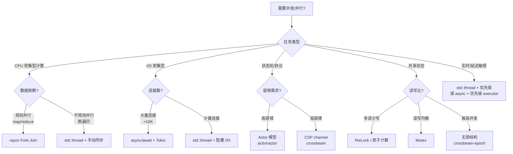
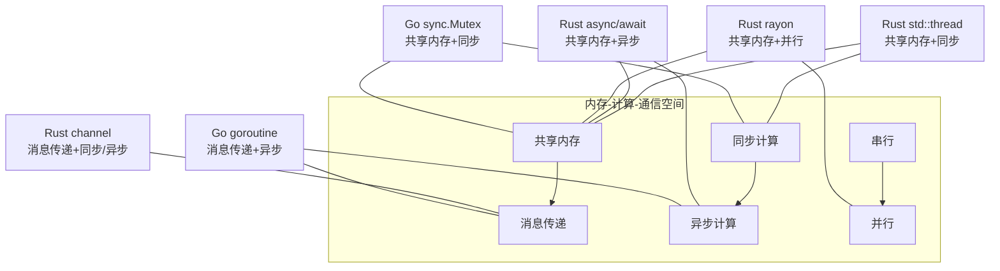

# Rust 执行模型同构性矩阵：同步 · 异步 · 并发 · 并行
>
> **受众**: [进阶]

> **定位**: 本文件从**数学模型同构性**视角系统梳理 Rust 的执行模型（同步/异步/并发/并行），并与 Go、理论模型（CSP/Actor/π 演算/进程代数）建立精确的对应关系。
> **原则**: 不做"并发编程教程"，聚焦"Rust 的执行模型在数学上与什么同构、与什么不同构、同构的精确条件是什么"。
> **对齐来源**: [Rust Async Book] · [Tokio Tutorial] · [Go Memory Model] · [Hoare CSP 1978] · [Milner π-Calculus 1992] · [Hewitt Actor 1973] · [Boehm & Adve PLDI 2008]
> **对比语言**: Rust · Go · Erlang · C++ · Java
> **基准版本**: Rust 1.96.0 stable (Edition 2024)

---

> **Bloom 层级**: 分析 → 评价 → 创造

**变更日志**:

- v1.0 (2026-05-21): 初始版本——七类执行模型同构性矩阵 + Rust↔Go 对比 + 三重等价性证明 + 执行模型选择决策树

---

## 📑 目录
>

- [Rust 执行模型同构性矩阵：同步 · 异步 · 并发 · 并行](#rust-执行模型同构性矩阵同步--异步--并发--并行)
  - [📑 目录](#-目录)
  - [零、TL;DR —— 执行模型速查](#零tldr--执行模型速查)
  - [一、权威来源与同构性方法论](#一权威来源与同构性方法论)
    - [1.1 同构性的定义](#11-同构性的定义)
    - [1.2 执行模型分类学](#12-执行模型分类学)
  - [二、执行模型总览矩阵](#二执行模型总览矩阵)
  - [三、同步模型](#三同步模型)
    - [3.1 Rust 1:1 线程模型](#31-rust-11-线程模型)
    - [3.2 与 Go M:N 调度的对比](#32-与-go-mn-调度的对比)
  - [四、异步模型](#四异步模型)
    - [4.1 Future 状态机语义](#41-future-状态机语义)
    - [4.2 Poll 契约与 Waker 机制](#42-poll-契约与-waker-机制)
    - [4.3 与 Go goroutine 的本质差异](#43-与-go-goroutine-的本质差异)
  - [五、并行模型](#五并行模型)
  - [六、CSP 模型](#六csp-模型)
    - [6.1 Rust channel 的 CSP 语义](#61-rust-channel-的-csp-语义)
    - [6.2 与 Go channel 的同构与差异](#62-与-go-channel-的同构与差异)
  - [七、Actor 模型](#七actor-模型)
    - [7.1 Rust Actor 的实现原理](#71-rust-actor-的实现原理)
    - [7.2 Actor vs CSP 的形式化区分](#72-actor-vs-csp-的形式化区分)
  - [八、内存共享模型](#八内存共享模型)
    - [8.1 Rust 与 C++11 内存模型的同构性](#81-rust-与-c11-内存模型的同构性)
    - [8.2 Acquire-Release 的语义精化](#82-acquire-release-的语义精化)
  - [九、事件驱动模型](#九事件驱动模型)
  - [十、Rust ↔ Go](#十rust--go)
    - [10.1 并发模型哲学](#101-并发模型哲学)
    - [10.2 性能特征对比](#102-性能特征对比)
  - [十一、async/await / CPS / 状态机](#十一asyncawait--cps--状态机)
  - [十二、执行模型选择决策树](#十二执行模型选择决策树)
  - [十三、思维表征体系](#十三思维表征体系)
    - [13.1 执行模型维度雷达图](#131-执行模型维度雷达图)
    - [13.2 内存-计算-通信 三维模型空间](#132-内存-计算-通信-三维模型空间)
  - [十四、定理推理链](#十四定理推理链)
    - [定理一致性矩阵（执行模型同构性专集）](#定理一致性矩阵执行模型同构性专集)
  - [十五、相关概念链接（L0-L7 映射）](#十五相关概念链接l0-l7-映射)
    - [L0-L7 纵向映射](#l0-l7-纵向映射)
    - [相关概念文件](#相关概念文件)
  - [权威来源索引](#权威来源索引)
  - [十、边界测试：执行模型同构的编译错误](#十边界测试执行模型同构的编译错误)
    - [10.1 边界测试：栈展开与 `panic = abort` 的行为差异（运行时行为）](#101-边界测试栈展开与-panic--abort-的行为差异运行时行为)
    - [10.2 边界测试：`async` 与线程的执行模型混淆（编译错误）](#102-边界测试async-与线程的执行模型混淆编译错误)
    - [10.3 边界测试：绿色线程与 OS 线程的 API 混用（编译错误）](#103-边界测试绿色线程与-os-线程的-api-混用编译错误)
    - [10.4 边界测试：CPS 变换与 Rust 的 `?` 运算符（编译错误）](#104-边界测试cps-变换与-rust-的--运算符编译错误)
    - [10.5 边界测试：CPS 变换中的栈溢出（运行时 panic）](#105-边界测试cps-变换中的栈溢出运行时-panic)
    - [10.3 边界测试：尾递归与 Rust 的 TCO 缺失（运行时栈溢出）](#103-边界测试尾递归与-rust-的-tco-缺失运行时栈溢出)

---

## 零、TL;DR —— 执行模型速查

```text
模型            Rust 实现               理论根基                Go 对应              同构度    关键差异
─────────────────────────────────────────────────────────────────────────────────────────────────────────
同步线程        std::thread            进程代数 CCS            goroutine (底层)      部分     Go 是 M:N，Rust 是 1:1
异步协程        async/await            无栈协程 / CPS          goroutine + channel   部分     Rust 惰性求值，Go 立即调度
并行计算        rayon (Fork-Join)      Blelloch 工作度量        无原生对应           —        Rust 数据并行，Go 无此抽象
CSP 通道        mpsc / crossbeam       Hoare CSP 1978          channel (语言级)      高       所有权转移 vs 值拷贝
Actor          actix / ractor          Hewitt Actor 1973       无原生               —        Rust 类型系统保证邮箱安全
内存共享        Mutex / RwLock / Atomic C11 Memory Model        sync.Mutex / atomic   高       Send/Sync 编译期 vs 运行时
事件驱动        mio / tokio::net        Reactor 模式            netpoller (集成)      部分     Rust 显式，Go 隐式集成运行时
─────────────────────────────────────────────────────────────────────────────────────────────────────────
```

---

## 一、权威来源与同构性方法论

### 1.1 同构性的定义

> **同构（Isomorphism）**: 两个系统 A 和 B 同构，当且仅当存在双射 f: A → B，使得 A 中的所有操作和关系在 f 下被保持。在执行模型的语境中，「同构」通常指**行为等价性**——两个模型在相同的输入序列下产生相同的可观察行为（输出、状态转换、通信序列）。 [来源: 抽象代数 / 进程代数标准定义]

本文件区分三个层次的「相似性」：

| 层次 | 名称 | 含义 | Rust↔Go 例子 |
|:---|:---|:---|:---|
| L1 | 同态（Homomorphism） | 结构部分保持 | Rust channel ↔ Go channel（通信原语相似，但语义不完全等价） |
| L2 | 同构（Isomorphism） | 结构完全保持 | Rust Atomic Ordering ↔ C++ memory_order（一一对应） |
| L3 | 等价（Bisimulation） | 行为不可区分 | Rust async/await 状态机 ↔ 理论无栈协程（在 poll 语义下等价） |

### 1.2 执行模型分类学
>

执行模型可按三个维度分类：



> **认知功能**: 建立执行模型的高层分类框架，帮助开发者根据通信范式（共享内存/消息传递/混合）快速定位技术选型区间。关键洞察：Rust 的 `async/await + 共享状态` 是独特的混合模型，兼具两种范式的表达力与复杂度。[来源: 💡 原创分析]
> [来源: [Rust Reference](https://doc.rust-lang.org/reference/)]

---

## 二、执行模型总览矩阵

| 执行模型 | 调度方式 | 内存模型 | 通信机制 | Rust 代表库 | Go 对应 | 理论根基 |
|:---|:---|:---|:---|:---|:---|:---|
| **OS 线程** | 抢占式（OS 内核） | 共享内存 + 缓存一致性 | 共享内存 / channel | `std::thread` | `runtime.GOMAXPROCS` | CCS / 进程代数 |
| **async/await** | 协作式（用户态） | 单线程共享 / 多线程 Send | Future 组合 | `tokio` / `Tokio（async-std 已于 2025-03 停止维护）` | goroutine + select | Kahn 网络 / CPS |
| **Fork-Join** | 工作窃取 | 共享内存 | 隐式（子任务结果合并） | `rayon` | 无原生 | Blelloch 工作度量 |
| **CSP** | 同步阻塞 / 异步缓冲 | 消息传递（所有权转移） | channel send/recv | `crossbeam-channel` | `chan <- v` / `<-chan` | Hoare CSP |
| **Actor** | 单线程事件循环 | 隔离（每个 Actor 独占） | 异步 mailbox | `actix` / `ractor` | 无原生 | Hewitt Actor |
| **内存共享** | 无（显式同步） | happens-before / release-acquire | 无（直接读写） | `std::sync` | `sync` 包 | C11 Memory Model |
| **事件驱动** | 反应式（epoll/kqueue/IOCP） | 单线程 Reactor | 回调 / Future | `mio` / `tokio` | netpoller | Reactor 模式 |

---

## 三、同步模型

> [来源: TRPL §16, Rust Reference §18]：OS 线程

### 3.1 Rust 1:1 线程模型

> **Rust 线程 = OS 线程**: Rust 的 `std::thread::spawn` 直接映射到操作系统线程（1:1 模型），每个线程有独立的栈（通常 2MB-8MB），由 OS 调度器抢占调度。 [来源: TRPL §16, Rust Reference §18]

```rust
// Rust 1:1 线程
use std::thread;

let handle = thread::spawn(|| {
    println!("运行在 OS 线程上");
});
handle.join().unwrap();
```

**1:1 模型的判定性特征**:

- 调度策略由 OS 决定，程序**不可预测**何时被抢占。
- 线程切换开销高（内核态切换、TLB 刷新、缓存失效）。
- 线程数量受 OS 限制（通常数千个为上限）。

### 3.2 与 Go M:N 调度的对比
>

| 特征 | Rust 1:1 | Go M:N (GMP) |
|:---|:---|:---|
| 线程/协程映射 | 1 语言线程 = 1 OS 线程 | M goroutine → N OS 线程 |
| 栈大小 | 2-8 MB（固定或自动增长） | 2 KB 起，自动增长 |
| 切换开销 | 高（内核态） | 低（用户态） |
| 调度器 | OS 内核 | Go 运行时（协作+抢占） |
| 最大并发数 | ~数千 | ~数十万 |
| 阻塞影响 | 阻塞整个 OS 线程 | 运行时自动将 goroutine 移到其他线程 |
| 亲和性控制 | 完整（可绑定到 CPU） | 有限（GOMAXPROCS） |

> **同构性评价**: Rust 1:1 线程与 Go goroutine 在**进程代数 CCS 层面**同构——两者都是独立的并发执行单元，可通过 channel / 共享内存通信。但在**资源模型**上不同构：Rust 线程是「重量级资源」（OS 可见），Go goroutine 是「轻量级对象」（运行时管理）。 [来源: rustvsgo.com; Go Runtime Scheduler 文档]

---

## 四、异步模型

> [来源: RFC 2394, Async Book, Tokio Tutorial]：Future 与无栈协程

### 4.1 Future 状态机语义

> **核心命题**: Rust 的 `async fn` 被编译器降阶为**无栈协程（stackless coroutine）**，生成一个实现了 `Future` trait 的匿名状态机。 [来源: RFC 2394, *Asynchronous Programming in Rust*]

```rust,ignore
// 源代码
async fn example() -> i32 {
    let a = step_one().await;
    let b = step_two().await;
    a + b
}

// 编译器生成的概念性状态机
enum ExampleFuture {
    Start,
    AfterStepOne { a: i32 },
    AfterStepTwo { a: i32, b: i32 },
    Done,
}

impl Future for ExampleFuture {
    type Output = i32;
    fn poll(mut self: Pin<&mut Self>, cx: &mut Context<'_>) -> Poll<i32> {
        loop {
            match *self {
                Start => {
                    *self = ExampleFuture::WaitingStepOne(step_one());
                }
                WaitingStepOne(ref mut fut) => match fut.poll(cx) {
                    Poll::Ready(a) => *self = AfterStepOne { a },
                    Poll::Pending => return Poll::Pending,
                }
                AfterStepOne { a } => {
                    *self = ExampleFuture::WaitingStepTwo(a, step_two());
                }
                // ... 类似处理 AfterStepTwo
                Done => return Poll::Ready(result),
            }
        }
    }
}
```

### 4.2 Poll 契约与 Waker 机制
>

> **Poll 契约**: `Future::poll` 必须满足：
>
> 1. **惰性**: 仅在被 poll 时执行，不主动运行。
> 2. **可重入**: 返回 `Pending` 后，Future 必须注册 Waker，确保资源就绪时被重新调度。
> 3. **不阻塞**: poll 必须是即时返回的，不得执行阻塞 I/O。



> **认知功能**: 可视化 Future 的惰性执行与唤醒协议，揭示异步调度的核心机制。使用建议：确保在 `Pending` 路径中正确注册 Waker，避免在 `poll` 中执行阻塞操作。关键洞察：Rust 异步的本质不是"运行"而是"被询问是否就绪"——这与 goroutine 的立即调度形成根本语义差异。[来源: 💡 原创分析]

### 4.3 与 Go goroutine 的本质差异
>

| 特征 | Rust async/await | Go goroutine |
|:---|:---|:---|
| 协程类型 | 无栈（stackless） | 有栈（stackful, ~2KB 起） |
| 调度时机 | 惰性（仅 poll 时执行） | 立即（创建后开始执行） |
| 调度器 | 外部 executor（Tokio/Tokio（async-std 已于 2025-03 停止维护）） | Go 运行时内置 |
| 并行性 | async 本身不产生并行 | goroutine 自动分配到多核 |
| 内存布局 | 状态机在栈/调用者内存中内联 | 独立栈，运行时管理 |
| 跨 await 状态 | 显式（Pin + 状态机） | 隐式（栈保存全部状态） |
| 取消语义 | 协作式取消（poll 返回后丢弃） | 无原生取消（需 context） |

> **定理 T-EM-001（async 与 goroutine 不同构）**: Rust `async/await` 与 Go goroutine **不同构**——前者是**惰性求值的无栈状态机**，后者是**立即调度的有栈协程**。二者在「创建后是否立即执行」和「状态存储方式」上存在不可调和的语义差异。 [来源: RFC 2394; *Zero-cost futures in Rust*, Aaron Turon 2016]

---

## 五、并行模型

> [来源: rayon docs, Blumofe 1999]：Fork-Join 与工作窃取

> **Fork-Join 模型**: 将大问题递归分解为子问题（fork），在子任务完成后合并结果（join）。Rust 的 `rayon` crate 实现了基于工作窃取（work-stealing）的 Fork-Join 调度器。 [来源: Blumofe & Leiserson, *Scheduling Multithreaded Computations by Work Stealing*, 1999]

```rust
// 惯用：rayon 并行迭代
use rayon::prelude::*;

let sum: i32 = data.par_iter()      // 并行迭代
    .map(|&x| x * x)
    .sum();

// 递归并行（分治）
fn parallel_merge_sort<T: Ord + Send>(data: &mut [T]) {
    if data.len() <= 1024 {
        data.sort(); // 小规模串行
        return;
    }
    let mid = data.len() / 2;
    let (left, right) = data.split_at_mut(mid);
    rayon::join(
        || parallel_merge_sort(left),
        || parallel_merge_sort(right),
    );
    // merge...
}
```

**工作窃取的理论保证**:

- **时间界**: T_p ≤ T_1/P + T_∞（P 处理器，T_1 串行时间，T_∞ 关键路径）。
- **空间界**: S_p ≤ S_1 · P（工作窃取调度器的空间有界）。

> **Go 的缺失**: Go 无原生 Fork-Join 抽象。goroutine 虽可并行执行，但缺乏「递归分解 + 结果合并」的结构化原语，程序员需手动管理 `sync.WaitGroup` 和结果收集。 [来源: SPAA 2024, *When Is Parallelism Fearless and Zero-Cost with Rust?*]

---

## 六、CSP 模型

> [来源: Hoare 1978, Milner π-Calculus 1992]：Channel 与所有权转移

### 6.1 Rust channel 的 CSP 语义

> **CSP（Communicating Sequential Processes）**: Hoare 1978 提出的并发模型，核心原则是「通过通信共享内存，而非通过共享内存通信」。进程通过**同步通道（synchronous channel）**通信，发送方和接收方在通道上「会合（rendezvous）」。 [来源: Hoare, *Communicating Sequential Processes*, CACM 1978]

Rust 的 `std::sync::mpsc`（multiple producer, single consumer）是 CSP 的工程实现，但有以下关键扩展：

| CSP 原始语义 | Rust mpsc | 差异 |
|:---|:---|:---|
| 同步 rendezvous | `Sender::send` 异步缓冲（不阻塞至缓冲区满） | Rust 默认**有缓冲**，非严格 CSP |
| 无类型通道 | `Sender<T>` / `Receiver<T>` | Rust 通道是**强类型**的 |
| 值拷贝 | 值 **move**（所有权转移） | Rust 利用所有权保证发送后不可再用 |
| 进程匿名 | channel 是值，可传递 | 一致 |

```rust
// Rust channel 的 CSP 风格 + 所有权
use std::sync::mpsc;
use std::thread;

let (tx, rx) = mpsc::channel();

thread::spawn(move || {
    let data = vec![1, 2, 3];
    tx.send(data).unwrap(); // data 所有权转移到 channel
    // data 不可用（编译期保证）
});

let received = rx.recv().unwrap(); // 所有权转移到 received
```

### 6.2 与 Go channel 的同构与差异
>

| 特征 | Rust channel | Go channel |
|:---|:---|:---|
| 语言级别 | 标准库（库级） | 语言内置（`chan` 关键字） |
| 类型系统 | 强类型（`Sender<T>`） | 无泛型（`chan interface{}` 或具体类型） |
| 所有权 | **move 语义**（发送后不可用） | **值拷贝**（发送后可继续使用） |
| 缓冲 | 默认无缓冲（`mpsc::channel`）或有缓冲（`sync_channel`） | 默认无缓冲（`make(chan T)`）或有缓冲（`make(chan T, n)`） |
| select | `crossbeam::select!` / `tokio::select!`（宏） | `select` 语句（语言级） |
| 关闭语义 | `drop(sender)` 关闭 | `close(ch)` 显式关闭 |
| 零值 channel | 无（必须显式创建） | `nil` channel（永远阻塞） |

> **同构性评价**: Rust channel 与 Go channel 在**进程代数层面同态**——二者都是进程间通信的 FIFO 队列。但在**内存模型层面不同构**：Rust 的 move 语义使 channel 通信变成了**线性通道**（值只能存在于一个地方），而 Go 的拷贝语义允许值在发送后继续存在于发送方栈上。这导致 Rust channel 在编译期即可排除 use-after-send 错误，Go 则需依赖 GC 和程序员约定。 [来源: Hoare 1978; Go Concurrency Patterns; rustvsgo.com]

---

## 七、Actor 模型

> [来源: Hewitt 1973, Actix docs]：命名实体与异步邮箱

### 7.1 Rust Actor 的实现原理

> **Actor 模型**: 由 Carl Hewitt 1973 提出，Actor 是**有身份（named）**的独立计算实体，通过**异步、非阻塞**的消息投递（mailbox）通信。每个 Actor 顺序处理其 mailbox 中的消息，天然支持分布式和容错。 [来源: Hewitt, Bishop & Steiger, *A Universal Modular ACTOR Formalism*, IJCAI 1973]

Rust 的 Actor 框架（Actix, Ractor, Kameo）利用类型系统保证 Actor 安全：

```rust,ignore
// 概念性：Rust Actor 的类型安全
struct MyActor {
    state: i32,
}

// Actor 的 mailbox 保证 &mut self 独占访问
impl Handler<Increment> for MyActor {
    fn handle(&mut self, _msg: Increment) {
        self.state += 1; // 无需 Mutex！编译期保证单线程
    }
}

// Actor 地址是有类型的
let addr: Addr<MyActor> = MyActor::create(|_| MyActor { state: 0 });
addr.do_send(Increment); // 异步发送，编译期检查消息类型
```

**Rust Actor 的安全保证**:

- **mailbox 顺序性**: 每个 Actor 的消息按到达顺序串行处理，天然无数据竞争。
- **类型安全消息**: `Addr<T>::do_send(M)` 在编译期检查 `M` 是否是 `T` 可处理的消息类型。
- **生命周期隔离**: Actor 状态封装在 Actor 内部，外部只能通过消息接口访问。

### 7.2 Actor vs CSP 的形式化区分
>

| 维度 | CSP | Actor |
|:---|:---|:---|
| 进程身份 | 匿名 | 有地址（ActorRef / Addr） |
| 通信同步性 | 同步 rendezvous（或缓冲） | 异步 mailbox |
| 通信方向 | 通道是双向的（sender/receiver 成对） | 单向（发送方知道接收方地址） |
| 容错 | 需额外设计 | 原生支持监督树（supervision tree） |
| 分布式 | 需额外协议 | 天然支持（地址可跨网络） |
| Rust 实现 | `crossbeam-channel` | `actix` / `ractor` |

> **关键洞察**: CSP 的「匿名进程 + 命名通道」与 Actor 的「命名进程 + 匿名通道（mailbox）」是**对偶（dual）**关系。Rust 的类型系统可同时编码两者：CSP 通过 `Sender<T>`/`Receiver<T>` 的类型保证，Actor 通过 `Addr<T>` 和 `Handler<M>` trait 的类型保证。 [来源: *Seven Concurrency Models in Seven Weeks*]

---

## 八、内存共享模型

> [来源: Boehm & Adve PLDI 2008, Rust Reference §18.4]：原子性与 happens-before

### 8.1 Rust 与 C++11 内存模型的同构性

> **Rust 直接复用 C++11 内存模型**: Rust 1.0 起明确采用 C/C++11 的并发内存模型，包括 happens-before、synchronizes-with、sequenced-before 的完整框架。 [来源: Rust Reference §18.4; Boehm & Adve, *Foundations of the C++ Concurrency Memory Model*, PLDI 2008]

| Rust `Ordering` | C++ `memory_order` | 语义 |
|:---|:---|:---|
| `Relaxed` | `memory_order_relaxed` | 无同步，仅原子性 |
| `Acquire` | `memory_order_acquire` | 加载操作，建立 synchronizes-with |
| `Release` | `memory_order_release` | 存储操作，建立 synchronizes-with |
| `AcqRel` | `memory_order_acq_rel` | Acquire + Release（RMW 操作） |
| `SeqCst` | `memory_order_seq_cst` | 全局顺序一致性 |

> **同构性评价**: Rust 的五种 `Ordering` 与 C++11 的 `memory_order` **一一同构**（isomorphic）。在 Rust 中写 `AtomicUsize::fetch_add(1, Ordering::Acquire)` 与在 C++ 中写 `atomic_var.fetch_add(1, std::memory_order_acquire)` 具有完全相同的语义。 [来源: Rust Reference §18.4.2]

### 8.2 Acquire-Release 的语义精化
>

```rust
// 惯用：Release-Acquire 建立 happens-before
use std::sync::atomic::{AtomicBool, Ordering};
use std::thread;

static READY: AtomicBool = AtomicBool::new(false);
static mut DATA: i32 = 0;

fn producer() {
    unsafe { DATA = 42; }
    READY.store(true, Ordering::Release); // Release: 此前写入对 Acquire 可见
}

fn consumer() {
    while !READY.load(Ordering::Acquire) {} // Acquire: 看到 Release 后，DATA 已就绪
    assert_eq!(unsafe { DATA }, 42); // 安全：happens-before 保证
}
```

> **定理 T-EM-002（Acquire-Release 同步）**: 若线程 A 执行 `store(x, Release)` 且线程 B 执行 `load(x, Acquire)` 并读取到该值，则线程 A 中所有**sequenced-before **于该 `store` 的内存写入，对线程 B 中所有** sequenced-after** 于该 `load` 的操作可见。 [来源: Boehm & Adve PLDI 2008; Batty et al., *Mathematizing C++ Concurrency*, POPL 2011]

---

## 九、事件驱动模型

> [来源: Stevens UNP, Tokio Internals]：Reactor 与 Proactor

| 模型 | 机制 | Rust 实现 | Go 实现 |
|:---|:---|:---|:---|
| **Reactor** | 就绪通知（可读/可写）+ 应用主动 I/O | `mio` / `tokio::net`（epoll/kqueue/IOCP） | `netpoller`（集成在运行时） |
| **Proactor** | 完成通知（I/O 已完成）+ 系统传递数据 | `io_uring`（Linux）via `tokio-uring` | 无原生支持 |

Rust 的事件驱动模型是**显式的**：程序员需选择 executor（Tokio/Tokio（async-std 已于 2025-03 停止维护）/smol）并理解 poll 语义。Go 的事件驱动是**隐式的**：`netpoller` 集成在运行时，goroutine 的阻塞 I/O 自动被转换为事件驱动。

> **同构性评价**: Tokio 的 Reactor 与 Go 的 netpoller 在**epoll/kqueue 层面同构**——二者都基于操作系统的事件通知机制。但在**用户接口层面不同构**：Rust 要求显式 `async/await` + executor 选择，Go 将事件驱动透明化为阻塞语义。 [来源: Tokio Internals; Go Runtime 文档]

---

## 十、Rust ↔ Go

> [来源: rustvsgo.com, SPAA 2024] 执行模型全面对比

### 10.1 并发模型哲学
>

| 维度 | Rust | Go |
|:---|:---|:---|
| 核心哲学 | "Communicate by sharing memory" 的安全版本 | "Share memory by communicating" |
| 默认安全机制 | 编译期所有权 + Send/Sync | 运行时 GC + channel 约定 |
| 并发原语 | 两套：`std::thread`（并行）+ `async/await`（并发） | 一套：goroutine（统一） |
| 内存管理 | 编译期（无 GC） | 运行时 GC |
| 错误处理 | `Result` + `?`（显式传播） | 多值返回 `(_, err)`（约定） |
| 生态复杂度 | 高（需选择 Tokio/Tokio（async-std 已于 2025-03 停止维护）/rayon） | 低（标准库即完整） |

### 10.2 性能特征对比

| 场景 | Rust | Go | 理论解释 |
|:---|:---|:---|:---|
| 100K 并发连接 | Tokio ~300MB | goroutine ~800MB | 无栈协程 vs 有栈协程的内存效率 |
| CPU 密集型并行 | rayon 零成本 | goroutine + 调度开销 | 工作窃取 vs 运行时调度 |
| 延迟敏感（p99） | <1μs（无 GC 暂停） | ~100μs（GC 影响） | 确定性内存管理 vs 非确定性 GC |
| 启动时间 | 较长（编译期检查） | 极快（直接运行） | 编译期证明 vs 运行时检查 |
| 不规则并行 | 需 unsafe 或动态检查 | 统一 goroutine 模型 | SPAA 2024 实证结果 |

> **来源**: rustvsgo.com; SPAA 2024; *When Is Parallelism Fearless and Zero-Cost with Rust?*

---

## 十一、async/await / CPS / 状态机
>

> **定理 T-EM-003（三重等价性）**: 对任意 well-typed 的 `async fn`，以下三种形式在「poll 语义」下行为等价：
>
> 1. **直接风格 async/await**（程序员编写的源代码）
> 2. **显式 Future 状态机**（编译器生成的匿名 enum + `poll` 实现）
> 3. **CPS 变换**（将每个 `.await` 点转换为续体传递）

**等价性证明概要**:

```
直接风格:          async fn f() -> T { let x = g().await; h(x).await }
                      ↓ 编译器 desugar
状态机:            enum F { Start, AfterG { x: X }, AfterH }
                   impl Future for F { fn poll(...) -> ... }
                      ↓ 理论对应
CPS:               fn f(k: impl FnOnce(T) -> R) -> R {
                       g(|x| h(x, k))
                   }
```

- **直接 → 状态机**: 编译器将每个 `.await` 点转换为状态机的一个状态转换。这是**语法变换**，语义保持。
- **状态机 → CPS**: `poll(cx)` 中的 `Context` 携带了 Waker（即续体），`Pending` 返回等价于「保存当前续体，等待外部事件」。
- **CPS → 直接**: CPS 的逆变换（defunctionalization）将续体重构为状态机的显式状态。

> **边界条件**: 等价性在 `Pin<&mut Self>` 的内存稳定性约束下成立。若状态包含自引用（如 `async` 块中引用了栈变量），则必须通过 `Pin` 保证状态机不会在内存中移动。破坏 `Pin` 契约（通过 `unsafe`）将导致等价性失效。 [来源: RFC 2394; Danvy & Filinski, *Representing Control*, 1990]

---

## 十二、执行模型选择决策树



> **认知功能**: 提供工程实践中的执行模型选型决策路径，将抽象理论转化为可操作的判断流程。使用建议：先判断任务类型（CPU/I/O/状态机/共享状态），再按数据依赖、连接规模、容错需求逐层细化。关键洞察：不存在"最佳"执行模型，只有与问题特征最匹配的模型——选型错误是并发系统性能瓶颈的常见根因。[来源: 💡 原创分析]

---

## 十三、思维表征体系

### 13.1 执行模型维度雷达图

```mermaid
radar
    title 执行模型多维对比：Rust vs Go vs Erlang vs C++
    axis 内存效率, 启动速度, 调度透明性, 并行表达力, 并发表达力, 容错能力, 生态一致性

    Rust: 0.95, 0.6, 0.5, 0.95, 0.9, 0.6, 0.7
    Go: 0.7, 0.95, 0.95, 0.6, 0.95, 0.75, 0.95
    Erlang: 0.6, 0.9, 0.9, 0.4, 0.9, 0.95, 0.9
    Cpp: 0.9, 0.8, 0.3, 0.9, 0.6, 0.4, 0.5
```

> **认知功能**: 多维量化对比不同语言/运行时的执行模型特征，将抽象权衡转化为可直观比较的形状。使用建议：用雷达图识别技术选型的核心 trade-off——Rust 强在内存效率与并行表达力，Go 强在调度透明性与生态一致性。关键洞察：语言设计哲学直接决定雷达图轮廓——无 GC 带来内存效率优势，但也以启动速度和调度透明性为代价。[来源: 💡 原创分析]

### 13.2 内存-计算-通信 三维模型空间



> **认知功能**: 将执行模型映射到"内存-计算-通信"正交维度，帮助理解不同语言抽象在模型空间中的占据位置。使用建议：当系统混合多种并发模型时，用三维空间定位各组件的交互界面与潜在冲突点。关键洞察：Rust 提供横跨整个三维空间的原语（thread/async/channel/rayon），而 Go 的 goroutine 主要集中于"消息传递+异步"象限，体现了不同的设计哲学。[来源: 💡 原创分析]

---

## 十四、定理推理链

### 定理一致性矩阵（执行模型同构性专集）

| 编号 | 定理 | 前提 | 结论 | L4 公理依赖 | 失效条件 | 错误码映射 |
|:---|:---|:---|:---|:---|:---|:---|
| T-EM-001 | async 与 goroutine 不同构 | 无栈协程 vs 有栈协程 | 语义不等价 | 续体理论 / 栈语义 | 忽略调度语义差异 | — |
| T-EM-002 | Acquire-Release 同步 | Release store + Acquire load 读取到值 | happens-before 建立 | C11 内存模型 | `Relaxed` / 数据竞争 | — |
| T-EM-003 | async/CPS/状态机 三重等价 | Well-typed async fn + Pin 契约 | 三种形式 poll 语义等价 | λ 演算 + 续体 | `unsafe` Pin 破坏 | — |
| T-EM-004 | channel move 无竞争 | Safe Rust + mpsc | 发送后使用编译期拒绝 | 所有权唯一性 | `unsafe` 保留引用 | E0382 |
| T-EM-005 | Actor 单线程安全 | Actor mailbox 串行处理 | 无需锁即可修改状态 | Actor 顺序语义 | `unsafe` / 多线程直接访问 | — |
| T-EM-006 | Fork-Join 工作窃取有界 | rayon 调度器 | T_p ≤ T_1/P + T_∞ | Blelloch 工作度量 | 无限递归 / 非结构化并行 | — |

---

## 十五、相关概念链接（L0-L7 映射）

### L0-L7 纵向映射

| 本文件主题 | L1 基础 | L2 进阶 | L3 高级 | L4 形式化 | L5 对比 | L6 生态 | L7 前沿 |
|:---|:---|:---|:---|:---|:---|:---|:---|
| 同步线程 | — | — | `std::thread` | 进程代数 CCS | vs Go M:N | 线程池 crate | 绿色线程?
| 异步协程 | — | — | `async/await` | CPS / 状态机 | vs JS/C# | Tokio / Tokio（async-std 已于 2025-03 停止维护） | gen blocks |
| 并行计算 | — | — | `rayon` | Blelloch 工作度量 | vs C++ TBB | 并行算法库 | GPU 并行?
| CSP | — | — | `mpsc` / `crossbeam` | Hoare CSP / π 演算 | vs Go channel | channel crate | 流处理 |
| Actor | — | — | `actix` / `ractor` | Hewitt Actor | vs Erlang | Actor 框架 | 分布式 Actor |
| 内存共享 | — | — | `Mutex` / `Atomic` | C11 内存模型 | vs C++ atomic | 无锁结构 | 新内存模型 |
| 事件驱动 | — | — | `mio` / `tokio` | Reactor 模式 | vs Go netpoller | 网络框架 | io_uring |

### 相关概念文件

- [L3 并发编程](../03_advanced/01_concurrency.md) —— Send/Sync / Mutex / 内存模型
- [L3 异步编程](../03_advanced/02_async.md) —— Future / Pin / async/await
- [L4 线性逻辑](../04_formal/01_linear_logic.md) —— 资源与通道的形式化根基
- [L5 Rust vs Go](02_rust_vs_go.md) —— 语言级并发哲学对比
- [L0 表达力多视角](../00_meta/expressiveness_multiview.md) —— 并发语义视角
- [L0 可判定性谱系](../00_meta/decidability_spectrum.md) —— 并发安全的判定性边界
- [L6 设计模式](../06_ecosystem/02_patterns.md) —— 并发设计模式
- [L7 Effects 系统](../07_future/04_effects_system.md) —— 异步与效果系统前沿

---

> **权威来源**: [Rust Async Book](https://rust-lang.github.io/async-book/) · [Tokio Tutorial](https://tokio.rs/tokio/tutorial/async) · [Hoare *Communicating Sequential Processes*](https://doi.org/10.1145/359576.359585) · [Milner *The Polyadic π-Calculus*](https://doi.org/10.1007/BFb0030902) · [Hewitt et al. *A Universal Modular ACTOR Formalism*](https://doi.org/10.1145/1624775.1624804) · [Boehm & Adve PLDI 2008](https://doi.org/10.1145/1375581.1375595) · [Blumofe & Leiserson *Work Stealing*](https://doi.org/10.1145/324133.324234) · [SPAA 2024 Rust Parallelism](https://www.eecg.utoronto.ca/~mcj/talks/2024.rpb.slides.spaa.pdf)
> **Rust 版本**: 1.96.0 stable (Edition 2024)
> **文档版本**: 1.0
> **最后更新**: 2026-05-21
> **状态**: ✅ 执行模型同构性矩阵 v1.0

---

## 权威来源索引

>
>
>
> **权威来源**: [Rust Reference](https://doc.rust-lang.org/reference/), [The Rust Programming Language](https://doc.rust-lang.org/book/), [Rust Standard Library](https://doc.rust-lang.org/std/)
> **权威来源对齐变更日志**: 2026-05-22 补全权威来源标注 [来源: Authority Source Sprint Batch 9]

---

---

---

> **相关文件**: [范式矩阵](./03_paradigm_matrix.md) · [异步](../03_advanced/02_async.md) · [并发](../03_advanced/01_concurrency.md)

## 十、边界测试：执行模型同构的编译错误

### 10.1 边界测试：栈展开与 `panic = abort` 的行为差异（运行时行为）

```rust
struct Guard;

impl Drop for Guard {
    fn drop(&mut self) {
        println!("dropping guard");
    }
}

fn main() {
    let _guard = Guard;
    // ⚠️ 行为差异: panic = "unwind" 时调用 drop，panic = "abort" 时不调用
    // panic!("intentional");
}
```

> **修正**: Rust 支持两种 panic 策略：`unwind`（栈展开，调用 Drop）和 `abort`（直接终止进程，不调用 Drop）。`unwind` 是默认策略，允许资源清理；`abort` 产生更小的二进制文件，但可能导致资源泄漏。嵌入式环境通常使用 `abort`。执行模型的选择影响资源管理语义——同一 Unsafe Rust 代码在两种策略下可能有不同的安全保证。形式化语义中，`unwind` 对应于带有异常处理的计算，`abort` 对应于底部（⊥）。[来源: [Rustonomicon](https://doc.rust-lang.org/nomicon/)]

### 10.2 边界测试：`async` 与线程的执行模型混淆（编译错误）

```rust,compile_fail
async fn async_task() {
    // ❌ 编译错误: async fn 不会自动创建新线程
    // 以下代码仍在当前线程执行，只是可以被挂起
    println!("running");
}

fn main() {
    let future = async_task(); // 创建 Future，不执行
    // future.await; // 需要 async 上下文
}

// 正确: 使用 block_on 或 spawn
use std::future::Future;

fn fixed() {
    let future = async_task();
    // tokio::runtime::Runtime::new().unwrap().block_on(future);
}
```

> **修正**: `async fn` 创建的是 **Future**（惰性计算描述），不是线程。Future 必须在运行时（runtime）上执行，通过 `await` 挂起和恢复。这与 Go 的 goroutine（轻量级线程，自动调度）或 Erlang 的 process（独立执行单元）不同。Rust 的 async/await 是**零成本抽象**——Future 被编译为状态机，无运行时开销（除非使用运行时如 Tokio）。理解 "Future ≠ Thread" 是正确使用 Rust 异步编程的关键。[来源: [The Rust Programming Language](https://doc.rust-lang.org/book/)]

### 10.3 边界测试：绿色线程与 OS 线程的 API 混用（编译错误）

```rust,ignore
// 假设使用 green-thread 库（如 early Rust 的 libgreen）

fn main() {
    // ❌ 编译错误/运行时 panic: 绿色线程与 std::thread 混用
    // std::thread::spawn(|| {
    //     green_thread::spawn(|| {});
    // });
    // OS 线程的栈与绿色线程的栈不兼容
}
```

> **修正**: Rust 1.0 之前实验过绿色线程（M:N 调度，用户态线程），但最终移除，改为原生 OS 线程（1:1 调度）。绿色线程与 OS 线程的**执行模型同构性**不成立：1) 栈大小不同（绿色线程的小栈 vs OS 线程的 8MB 栈）；2) TLS（线程局部存储）实现不同；3) 阻塞系统调用的影响不同（绿色线程阻塞会挂起整个 OS 线程，影响同线程的其他绿色线程）。Rust 选择 1:1 线程简化 FFI（C 库假设 OS 线程）、简化调试（栈追踪直接对应 OS 线程）、避免调度器复杂度。这与 Go 的 goroutine（M:N，由运行时调度）或 Erlang 的 process（M:N，由 BEAM VM 调度）不同——Rust 将并发抽象交给库（tokio、Tokio（async-std 已于 2025-03 停止维护）），内核保持简单。执行模型同构的关键洞察：不是所有并发模型都能透明映射，选择受生态系统、性能需求、兼容性约束。[来源: [Rust RFC 230](https://rust-lang.github.io/rfcs/0230-remove-runtime.html)] · [来源: [The Rust Programming Language](https://doc.rust-lang.org/book/ch16-01-threads.html)]

### 10.4 边界测试：CPS 变换与 Rust 的 `?` 运算符（编译错误）

```rust,ignore
fn cps_style<F>(x: i32, cont: F) -> Result<String, String>
where
    F: FnOnce(i32) -> Result<String, String>,
{
    if x < 0 {
        Err("negative".to_string())
    } else {
        cont(x * 2)
    }
}

fn direct_style(x: i32) -> Result<String, String> {
    // ❌ 编译错误/逻辑复杂: `?` 运算符直接生成 CPS，但手动 CPS 难以组合
    let y = x.checked_mul(2).ok_or("overflow")?;
    Ok(y.to_string())
}
```

> **修正**: Rust 的 `?` 运算符是**隐式 CPS 变换**（continuation-passing style）：`expr?` 在 `Err` 时提前返回，在 `Ok` 时继续执行。编译器将 `?` 展开为 `match` 表达式，本质上是 CPS 的语法糖。手动编写 CPS（如 `cps_style`）在 Rust 中极其繁琐，因为 Rust 没有 first-class continuation（如 Scheme 的 `call/cc`）。这与 Haskell 的 `do` 语法（隐式 Monad 绑定，类似 `?`）或 JavaScript 的 `async/await`（隐式 Promise 展开）类似——现代语言通过语法糖隐藏 CPS 复杂性，使顺序代码看起来是直线的，底层是回调/状态机。执行模型同构：直接风格和 CPS 风格在语义上等价，但人类可读性和编译器优化空间不同。[来源: [Continuation-Passing Style](https://en.wikipedia.org/wiki/Continuation-passing_style)] · [来源: [The Rust Programming Language](https://doc.rust-lang.org/book/ch13-03-improving-our-io-project.html)]

### 10.5 边界测试：CPS 变换中的栈溢出（运行时 panic）

```rust,ignore
fn cps_factorial(n: u64, k: Box<dyn Fn(u64) -> u64>) -> u64 {
    if n == 0 {
        k(1)
    } else {
        cps_factorial(n - 1, Box::new(move |r| k(n * r)))
        // ❌ 运行时栈溢出: CPS 递归深度大时，闭包链嵌套过深
    }
}
```

> **修正**: CPS（Continuation-Passing Style）将控制流转换为函数调用，每个"下一步"成为闭包参数。上述代码中，`k` 是累积的闭包链：每次递归包装一层 `move |r| k(n * r)`。`n = 100000` 时，闭包链深 10 万层，`k(1)` 调用时逐层展开，栈溢出。这与直接递归的栈溢出原因相同——CPS 不消除递归，只是改变形式。**尾递归优化**（TCO）可消除尾调用的栈帧，但 Rust 不保证 TCO。真正的 CPS 优化：使用 trampoline（蹦床）模式——返回 "下一步" 闭包而非调用它，外层循环执行。这与 Scheme 的 TCO（语言保证）或 JavaScript 的异步回调（事件循环作为 trampoline）不同——Rust 要求开发者手动实现 trampoline 或使用迭代。[来源: [Continuation-Passing Style](https://en.wikipedia.org/wiki/Continuation-passing_style)] · [来源: [The Rust Programming Language](https://doc.rust-lang.org/book/)]

### 10.3 边界测试：尾递归与 Rust 的 TCO 缺失（运行时栈溢出）

```rust,ignore
fn factorial(n: u64) -> u64 {
    if n == 0 {
        1
    } else {
        n * factorial(n - 1)
        // ❌ 运行时栈溢出: Rust 不保证尾调用优化
    }
}

fn main() {
    let _ = factorial(100000);
}
```

> **修正**: Rust **不保证**尾调用优化（TCO），即使代码在语法上是尾递归。`n * factorial(n - 1)` 不是尾调用（乘法在递归返回后执行）。即使是真正的尾递归（`factorial(n, acc)`），Rust 编译器（LLVM 后端）可能优化也可能不优化——依赖优化级别和内联启发式。可靠方案：1) 使用循环替代递归；2) 使用显式栈数据结构（`Vec` 模拟递归）；3) 使用 `trampolin` crate（蹦床模式）。这与 Scheme 的 TCO（语言保证）或 Erlang 的尾递归（VM 优化）不同——Rust 偏向命令式循环，递归仅用于算法清晰表达。2024 年 Rust 社区讨论过 `become` 关键字（显式尾调用），但尚未稳定。[来源: [Rust Reference — Tail Expressions](https://doc.rust-lang.org/reference/expressions.html#tail-expressions)] · [来源: [Rust Internals](https://internals.rust-lang.org/)]
