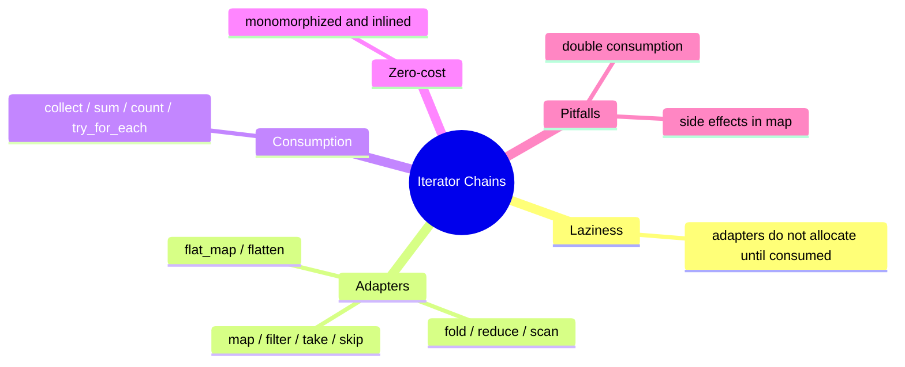

# 迭代器链

**EN**: Iterator Chains
**Summary**: Compose lazy data transformations with iterator adapters to write declarative, zero-cost Rust code.



> **Rust 版本**: 1.97.0+ (Edition 2024)
> **Bloom 层级**: L5
> **权威来源**: 本文件为 `concept/` 权威页。
> **前置概念**: [集合](../../01_foundation/05_collections/01_collections.md) · [闭包与迭代器](../../02_intermediate/07_iterators_and_closures/01_iterator_patterns.md)
> **后置概念**: [算法表达](../02_algorithms/README.md)

---

## 一、权威定义

迭代器链（Iterator Chains）是将多个**迭代器适配器（iterator adapters）**组合成一个惰性求值的转换管道。链中的每一步只描述“做什么”，真正的计算由最终的**消费器（consumer）**触发。

Rust 的迭代器是零成本抽象：在 release 模式下，编译器通常会将整个链单态化并内联成与手写循环等价的机器码。

## 二、核心属性与关系

| 属性 | 说明 |
|:---|:---|
| **惰性（Lazy）** | `map`、`filter` 等适配器不立即执行，仅返回新的迭代器。 |
| **单次消费** | 大多数迭代器只能被消费一次；重复消费需要 `collect` 成集合或使用 `.clone()`（若实现 `Clone`）。 |
| **零成本** | 适配器链经单态化后通常与手写 `for` 循环性能相同。 |
| **错误传播** | `try_for_each`、`filter_map` 等支持在链中传播 `Result`/`Option`。 |

## 三、正向推理决策树

```text
需要对集合进行多步转换？
├── 否 → 直接使用 for 循环或单一方法。
└── 是
    ├── 转换步骤是否固定且可组合？
    │   ├── 否 → 使用显式循环，便于调试。
    │   └── 是
    │       ├── 是否需要短路/错误传播？
    │       │   └── 是 → 使用 try_for_each / collect::<Result<Vec<_>, _>>。
    │       └── 否 → 使用 map / filter / collect 链。
    └── 是否需要并发？
        └── 是 → 考虑 rayon 的 parallel iterator（需引入依赖）。
```

## 四、反向推理决策树

```text
迭代器链性能或行为异常？
├── 是否意外多次消费同一迭代器？
│   └── 是 → collect 成 Vec 或重新生成迭代器。
├── 是否在 map 中产生副作用？
│   └── 是 → 改为 for 循环，避免依赖求值顺序。
├── 是否 collect 到不必要的集合？
│   └── 是 → 使用 try_for_each / count / sum 等直接消费。
└── 是否因链过长导致类型推断失败？
    └── 是 → 显式标注 collect 目标类型或拆分为 let 绑定。
```

## 五、Rust 表达与示例

```rust
fn main() {
    let numbers = vec![1, 2, 3, 4, 5, 6, 7, 8, 9, 10];

    let sum_of_even_squares: i32 = numbers
        .iter()
        .filter(|&&x| x % 2 == 0)
        .map(|x| x * x)
        .sum();

    assert_eq!(sum_of_even_squares, 220);
}
```

## 六、反例与常见错误

迭代器只能被消费一次：

```rust,compile_fail,E0382
fn main() {
    let v = vec![1, 2, 3];
    let iter = v.into_iter();
    let a: Vec<_> = iter.collect();
    let b: Vec<_> = iter.collect(); // ❌ iter 已被 move
    println!("{:?} {:?}", a, b);
}
```

## 七、国际权威来源

- [Rust Design Patterns — Functional Programming / Idioms](https://rust-unofficial.github.io/patterns/functional/iterators.html)
- [The Rust Programming Language — Iterators](https://doc.rust-lang.org/book/ch13-02-iterators.html)
- [Rust API Guidelines — Iterators](https://rust-lang.github.io/api-guidelines/flexibility.html#c-iter)
