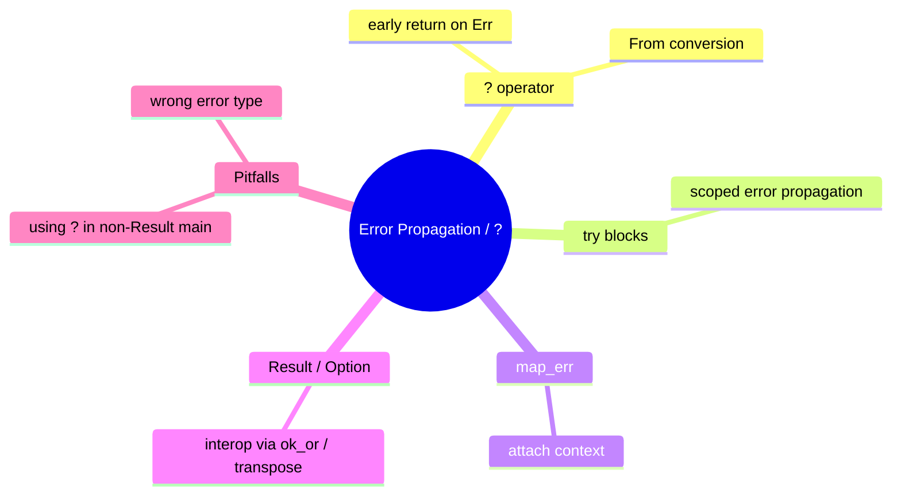

# 错误传播与 `?` 运算符

**EN**: Error Propagation and the `?` Operator
**Summary**: Propagate `Result` and `Option` errors concisely while preserving context through the `From` trait.



> **Rust 版本**: 1.97.0+ (Edition 2024)
> **Bloom 层级**: L5
> **权威来源**: 本文件为 `concept/` 权威页。
> **前置概念**: [错误处理基础](../../../01_foundation/08_error_handling/01_error_handling_basics.md) · [Result 与 Option](../../../02_intermediate/03_error_handling/01_error_handling.md)
> **后置概念**: [Into/From/AsRef](./03_into_from_asref.md)

---

## 一、权威定义

`?` 运算符是 Rust 中**错误传播**的语法糖。它作用于 `Result` 或 `Option`：若值为 `Err(e)` / `None`，则立即从当前函数返回；若值为 `Ok(v)` / `Some(v)`，则解包为 `v`。

`?` 要求当前函数的返回类型能够容纳错误类型。对于 `Result<T, E>`，需要实现 `From<E_inner>` for `E`，以自动转换内部错误。

## 二、核心属性与关系

| 属性 | 说明 |
|:---|:---|
| **自动转换** | 通过 `From` trait 将内部错误转换为目标错误类型。 |
| **零额外运行时开销** | `?` 与显式 `match` 等价，不引入额外分配。 |
| **可组合** | 可与 `map_err` 结合附加上下文，与 `ok_or` 转换 `Option`。 |
| **try 块** | Edition 2021+ 的 `try { ... }` 块可限制 `?` 的作用范围。 |

## 三、正向推理决策树

```text
函数中可能出现错误并需要向上传递？
├── 否 → 使用 unwrap/expect（仅示例/测试）或显式 match。
└── 是
    ├── 当前函数返回 Result？
    │   ├── 否 → 改为返回 Result，或在局部 try 块中使用 ?。
    │   └── 是
    │       ├── 错误类型是否一致？
    │       │   ├── 否 → 实现 From<InnerError> for OuterError，或使用 map_err。
    │       │   └── 是 → 直接使用 ?。
    └── 是否需要附加上下文？
        └── 是 → 使用 .map_err(|e| MyError::Context(e, ...))?。
```

## 四、反向推理决策树

```text
? 运算符导致编译错误？
├── 函数返回类型不是 Result/Option？
│   └── 是 → 修改返回类型，或改用 match。
├── 错误类型无法自动转换？
│   └── 是 → 实现 From trait 或 map_err。
├── 在闭包/回调中使用 ?？
│   └── 是 → 确保闭包返回 Result/Option，或使用 try 块。
└── ? 吞掉了必要上下文？
    └── 是 → 使用 thiserror/anyhow 等错误包装 crate。
```

## 五、Rust 表达与示例

```rust
use std::fs::File;
use std::io::{self, Read};

fn read_config(path: &str) -> Result<String, io::Error> {
    let mut file = File::open(path)?;
    let mut content = String::new();
    file.read_to_string(&mut content)?;
    Ok(content)
}

fn main() {
    // 仅演示，不依赖真实文件
    let _ = read_config("/dev/null");
}
```

## 六、反例与常见错误

在返回 `()` 的函数中使用 `?` 会导致类型不匹配：

```rust,compile_fail,E0277
use std::fs::File;

fn open_file(path: &str) {
    let _file = File::open(path)?; // ❌ 函数返回 ()，不是 Result
}

fn main() {
    open_file("/dev/null");
}
```

## 七、国际权威来源

- [The Rust Programming Language — Recoverable Errors with Result](https://doc.rust-lang.org/book/ch09-02-recoverable-errors-with-result.html)
- [Rust Reference — The ? operator](https://doc.rust-lang.org/reference/expressions/operator-expr.html#the-question-mark-operator)
- [Rust API Guidelines — Error Types](https://rust-lang.github.io/api-guidelines/interoperability.html#c-err-msg)

- [Rust Design Patterns](https://rust-unofficial.github.io/patterns/)

## 来源与延伸阅读

- [RustBelt — Logical Foundations for Safe Systems Programming](https://plv.mpi-sws.org/rustbelt/)（P1 形式化基础）
- [Leveraging Rust Types for Modular Specification and Verification](https://dl.acm.org/doi/10.1145/3360573)（P1 OOPSLA 2019）
- [anyhow — Idiomatic Error Handling](https://docs.rs/anyhow/latest/anyhow/)（P2 生态）
- [thiserror — Derive Error](https://docs.rs/thiserror/latest/thiserror/)
- [anyhow on crates.io](https://crates.io/crates/anyhow)
- [What the Error Handling Project Group is Working On](https://blog.rust-lang.org/inside-rust/2020/11/23/What-the-error-handling-project-group-is-working-on/)（P2 官方博客）

## 形式化基础

本页的工程模式可追溯到以下 L4 形式化/理论权威页：

- [类型论基础](../../../04_formal/00_type_theory/01_type_theory.md)
- [操作语义](../../../04_formal/03_operational_semantics/03_operational_semantics.md)
- [λ 演算与可计算性](../../../04_formal/00_type_theory/05_lambda_calculus.md)
