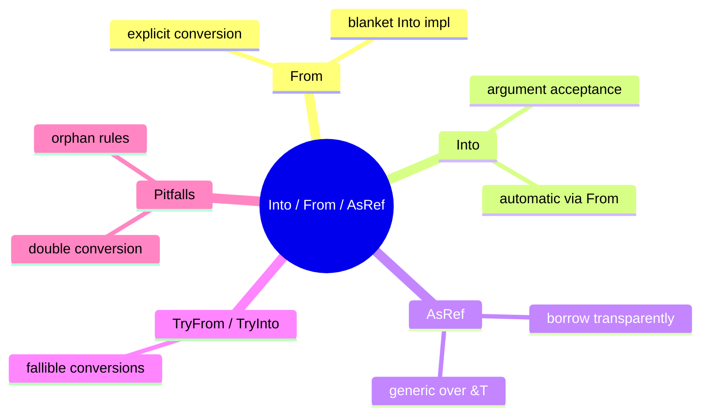

# Into / From / AsRef 转换惯用法

**EN**: Into, From, and AsRef Conversion Idioms
**Summary**: Use trait-based conversions to write generic, ergonomic APIs that avoid ownership ambiguity.



> **Rust 版本**: 1.97.0+ (Edition 2024)
> **Bloom 层级**: L5
> **权威来源**: 本文件为 `concept/` 权威页。
> **前置概念**: [Trait](../../../02_intermediate/00_traits/01_traits.md) · [泛型](../../../02_intermediate/01_generics/01_generics.md)
> **后置概念**: [错误传播](./02_error_propagation.md) · [Newtype](./04_newtype.md)

---

## 一、权威定义

Rust 使用 trait 对类型转换进行编码：

- **`From<T>`**：从 `T` 构造 `Self`，表示**无失败**的转换。
- **`Into<U>`**：将 `Self` 转换为 `U`。标准库提供 blanket impl：`impl<T, U> Into<U> for T where U: From<T>`，因此通常只需实现 `From`。
- **`AsRef<T>`**：以 `&T` 形式借用，强调“透明借用”而非所有权转移。
- **`TryFrom` / `TryInto`**：用于可能失败的转换，返回 `Result`。

## 二、核心属性与关系

| 属性 | 说明 |
|:---|:---|
| **无失败 vs 可失败** | `From` 保证成功；可能失败用 `TryFrom`。 |
| **所有权** | `From` 通常消耗原值；`AsRef` 只借用一个引用。 |
| **泛型参数接受** | 函数参数使用 `impl Into<T>` 或 `<T: Into<U>>` 可接受多种输入。 |
| **孤儿规则** | 不能为外部类型实现外部 trait；Newtype 可绕过此限制。 |

## 三、正向推理决策树

```text
需要在类型之间转换？
├── 只是借用并以统一接口使用？
│   └── 是 → 使用 AsRef<T>。
├── 需要消耗原值并构造新类型？
│   ├── 转换可能失败？
│   │   ├── 是 → 实现 TryFrom。
│   │   └── 否 → 实现 From，自动获得 Into。
└── 函数希望接受多种输入？
    └── 使用 impl Into<T> 作为参数类型。
```

## 四、反向推理决策树

```text
转换相关编译错误？
├── 为外部类型实现外部 trait（E0117）？
│   └── 使用 Newtype 包装后再实现。
├── 调用 .into() 后类型推断失败？
│   └── 显式标注目标类型，如 `let s: String = x.into()`。
├── 需要引用但实现了 From？
│   └── 改为实现 AsRef，避免不必要的 clone。
└── 循环转换导致模糊？
    └── 明确使用显式函数或 newtype。
```

## 五、Rust 表达与示例

```rust
#[derive(Debug)]
struct Identifier(String);

impl From<&str> for Identifier {
    fn from(value: &str) -> Self {
        Identifier(value.trim().to_lowercase())
    }
}

impl AsRef<str> for Identifier {
    fn as_ref(&self) -> &str {
        &self.0
    }
}

fn print_id(id: impl AsRef<str>) {
    println!("id = {}", id.as_ref());
}

fn main() {
    let id: Identifier = "HelloWorld".into();
    print_id(&id);
}
```

## 六、反例与常见错误

为外部类型实现外部 trait 违反孤儿规则：

```rust,compile_fail,E0117
impl From<u64> for String {
    fn from(_: u64) -> Self {
        "number".to_string()
    }
}

fn main() {}
```

## 七、国际权威来源

- [The Rust Programming Language — From and Into](https://doc.rust-lang.org/book/ch10-02-traits.html#traits-as-parameters)
- [Rust API Guidelines — Type Conversions](https://rust-lang.github.io/api-guidelines/naming.html#c-conv)
- [Rust Reference — The From trait](https://doc.rust-lang.org/std/convert/trait.From.html)
