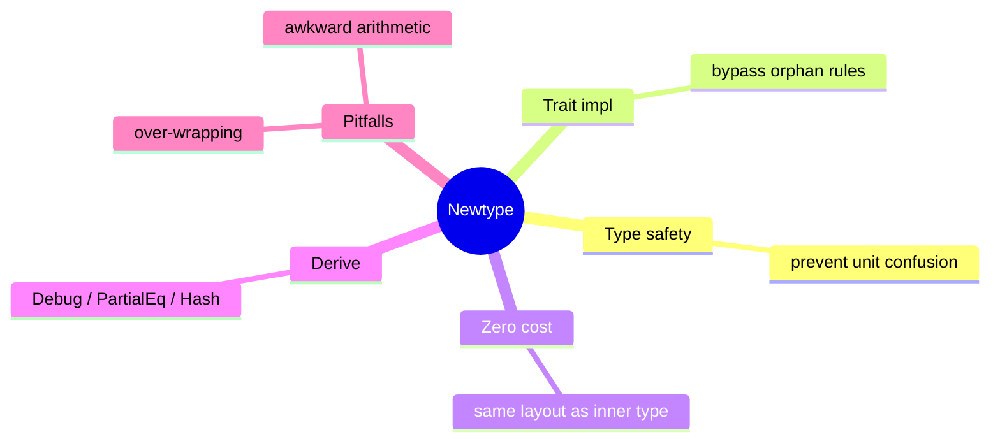

# Newtype 惯用法

**EN**: Newtype Idiom
**Summary**: Wrap a primitive or foreign type in a single-field struct to gain type safety, custom traits, and semantic clarity at zero runtime cost.



> **Rust 版本**: 1.97.0+ (Edition 2024)
> **Bloom 层级**: L5
> **权威来源**: 本文件为 `concept/` 权威页。
> **前置概念**: [结构体](../../01_foundation/02_type_system/03_structs.md) · [Trait](../../02_intermediate/00_traits/01_traits.md)
> **后置概念**: [Into/From/AsRef](./03_into_from_asref.md)

---

## 一、权威定义

Newtype 惯用法是指用**单字段元组结构体**包装已有类型，从而创造一个语义不同但运行时布局相同的新类型。它广泛应用于：

- 避免单位混淆（如 `Meters` vs `Kilometers`）；
- 为外部类型实现外部 trait（绕过孤儿规则）；
- 为整数 ID 提供强类型，防止传错参数；
- 隐藏实现细节并控制可用操作。

## 二、核心属性与关系

| 属性 | 说明 |
|:---|:---|
| **零运行时开销** | Newtype 与内部类型通常具有相同的内存布局和 ABI。 |
| **类型隔离** | 编译器将 Newtype 与内部类型视为不同类型，防止意外混用。 |
| **trait 自定义** | 可以为 Newtype 实现 `Display`、`FromStr`、`Hash` 等，而内部类型不能。 |
| **解包成本** | 需要通过 `.0` 或方法访问内部值，可能增加少量样板代码。 |

## 三、正向推理决策树

```text
需要使用原始类型但又想增加语义或实现 trait？
├── 否 → 直接使用原始类型或 enum。
└── 是
    ├── 是否需要为外部类型实现外部 trait？
    │   └── 是 → Newtype 是标准解决方案。
    ├── 是否涉及单位/ID 语义？
    │   └── 是 → Newtype 防止单位混用。
    └── 是否需要限制可用操作？
        └── 是 → Newtype + 私有字段 + 受控方法。
```

## 四、反向推理决策树

```text
Newtype 带来太多样板代码？
├── 是否所有操作都需要透传？
│   └── 是 → 考虑派生 `Deref`（仅限透明包装）或直接使用原类型。
├── 是否需要跨大量 API 传递？
│   └── 是 → 评估是否值得；可使用类型别名暂时过渡。
└── 是否因算术频繁导致 .0 泛滥？
    └── 是 → 为 Newtype 实现 `Add`、`Sub` 等运算符 trait。
```

## 五、Rust 表达与示例

```rust
#[derive(Debug, Clone, Copy, PartialEq, Eq, Hash)]
struct UserId(u64);

impl UserId {
    fn new(id: u64) -> Self {
        UserId(id)
    }

    fn value(&self) -> u64 {
        self.0
    }
}

fn find_user(id: UserId) -> String {
    format!("user-{}", id.value())
}

fn main() {
    let id = UserId::new(42);
    println!("{}", find_user(id));
}
```

## 六、反例与常见错误

没有 Newtype 时，不同含义的 `u64` 可以混用，导致逻辑错误。虽然以下代码能编译，但属于**语义反例**：

```rust
// 反例：使用裸 u64 表示用户 ID 与订单 ID，容易传错参数。
fn find_user(id: u64) {}
fn find_order(id: u64) {}

fn main() {
    let user_id = 42u64;
    find_order(user_id); // 编译通过，但语义错误
}
```

若尝试直接为 `u64` 实现外部 trait，则违反孤儿规则：

```rust,compile_fail,E0117
use std::fmt;

impl fmt::Display for u64 {
    fn fmt(&self, f: &mut fmt::Formatter<'_>) -> fmt::Result {
        write!(f, "id={}", self)
    }
}

fn main() {}
```

## 七、国际权威来源

- [Rust API Guidelines — Newtype Pattern](https://rust-lang.github.io/api-guidelines/flexibility.html#c-newtype)
- [The Rust Programming Language — Tuple Structs](https://doc.rust-lang.org/book/ch05-01-defining-structs.html#using-tuple-structs-without-named-fields-to-create-different-types)
- [Rust Reference — Orphan Rules](https://doc.rust-lang.org/reference/items/implementations.html#orphan-rules)
