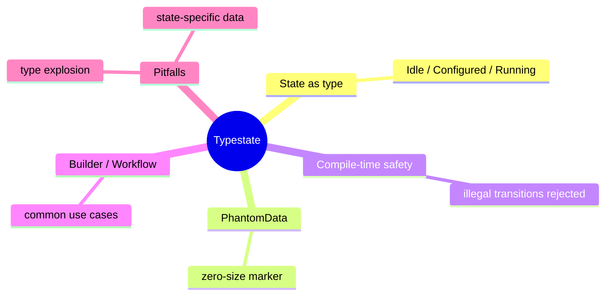

# Typestate 惯用法

**EN**: Typestate Idiom
**Summary**: Encode state machine states as types so that illegal transitions are rejected at compile time.



> **Rust 版本**: 1.97.0+ (Edition 2024)
> **Bloom 层级**: L5-L6
> **权威来源**: 本文件为 `concept/` 权威页。
> **前置概念**: [泛型](../../../02_intermediate/01_generics/01_generics.md) · [PhantomData](../../../02_intermediate/00_traits/01_traits.md)
> **后置概念**: [状态机模式](../03_design_patterns/04_state_machine.md)

---

## 一、权威定义

Typestate 是一种将**状态编码进类型**的设计技术。通过为每个状态定义一个空类型（marker type），并让结构体以泛型参数持有当前状态，只有合法的转换方法才返回带新状态参数的类型实例。

Rust 的所有权和类型系统使 Typestate 特别自然：非法操作会在编译期被拒绝，而不是运行期。

## 二、核心属性与关系

| 属性 | 说明 |
|:---|:---|
| **编译期保证** | 不合法的状态转换无法通过类型检查。 |
| **零运行时开销** | 状态标记类型通常使用 `PhantomData`，不占用内存。 |
| **与状态机互补** | Typestate 适合状态数量固定、转换规则明确的场景；动态状态更适合枚举驱动的状态机。 |
| **API 明确性** | 方法的可用性由类型决定，IDE 与文档可精确提示。 |

## 三、正向推理决策树

```text
对象生命周期中存在严格的阶段顺序？
├── 否 → 使用普通字段或 enum 状态机。
└── 是
    ├── 阶段数量是否有限且稳定？
    │   ├── 否 → enum 状态机更灵活。
    │   └── 是 → Typestate 提供最强编译期保证。
    └── 是否需要阶段专属 API？
        └── 是 → Typestate 让只有特定阶段可调用的方法在类型上可见。
```

## 四、反向推理决策树

```text
Typestate 导致使用困难？
├── 状态组合爆炸？
│   └── 是 → 考虑将正交维度拆分为独立类型或改用 enum。
├── 需要在运行时序列化状态？
│   └── 是 → Typestate 不适合，改用 enum + match。
├── 每个状态携带不同数据？
│   └── 是 → 使用泛型字段或不同结构体表示各状态。
└── 测试需要反复构造完整链？
    └── 是 → 提供从每个状态开始的构造器，或使用 builder 辅助。
```

## 五、Rust 表达与示例

```rust
use std::marker::PhantomData;

pub struct Idle;
pub struct Configured;
pub struct Running;

pub struct Workflow<S> {
    name: String,
    _state: PhantomData<S>,
}

impl Workflow<Idle> {
    pub fn new(name: impl Into<String>) -> Self {
        Workflow {
            name: name.into(),
            _state: PhantomData,
        }
    }

    pub fn configure(self) -> Workflow<Configured> {
        Workflow {
            name: self.name,
            _state: PhantomData,
        }
    }
}

impl Workflow<Configured> {
    pub fn start(self) -> Workflow<Running> {
        Workflow {
            name: self.name,
            _state: PhantomData,
        }
    }
}

impl Workflow<Running> {
    pub fn status(&self) -> String {
        format!("{} is running", self.name)
    }
}

fn main() {
    let workflow = Workflow::new("etl").configure().start();
    println!("{}", workflow.status());
}
```

## 六、反例与常见错误

尝试在 `Idle` 状态调用 `start` 会在编译期失败：

```rust,compile_fail,E0599
use std::marker::PhantomData;

pub struct Idle;
pub struct Running;

pub struct Workflow<S> {
    name: String,
    _state: PhantomData<S>,
}

impl Workflow<Idle> {
    pub fn new(name: impl Into<String>) -> Self {
        Workflow { name: name.into(), _state: PhantomData }
    }
}

impl Workflow<Running> {
    pub fn start(self) -> Self { self }
    pub fn status(&self) -> String { format!("{} is running", self.name) }
}

fn main() {
    let workflow = Workflow::<Idle>::new("etl");
    // ❌ Idle 状态没有 start/status 方法
    println!("{}", workflow.status());
}
```

## 七、国际权威来源

- [Rust Design Patterns — Typestate](https://rust-unofficial.github.io/patterns/typestate.html)
- [The Rust Programming Language — Phantom Data](https://doc.rust-lang.org/book/ch19-04-advanced-types.html#dynamically-sized-types-and-the-sized-trait)
- [Typestate Programming (Wikipedia)](https://en.wikipedia.org/wiki/Typestate_analysis)

## 来源与延伸阅读

- [RustBelt — Logical Foundations for Safe Systems Programming](https://plv.mpi-sws.org/rustbelt/)（P1 形式化基础）
- [SquirrelFS: Using the Rust Compiler to Check File-System Crash Consistency](https://arxiv.org/abs/2406.09649)（P1 Typestate 应用）
- [typestate — Proc-macro Typestate DSL](https://docs.rs/typestate/latest/typestate/)（P2 生态）
- [typestate on crates.io](https://crates.io/crates/typestate)
- [Stabilizing async fn in traits in 2023](https://blog.rust-lang.org/inside-rust/2023/05/03/stabilizing-async-fn-in-trait.html)（P2 官方博客，提及 builder-provider 模式）

## 形式化基础

本页的工程模式可追溯到以下 L4 形式化/理论权威页：

- [类型论基础](../../../04_formal/00_type_theory/01_type_theory.md)
- [操作语义](../../../04_formal/03_operational_semantics/03_operational_semantics.md)
- [λ 演算与可计算性](../../../04_formal/00_type_theory/05_lambda_calculus.md)
