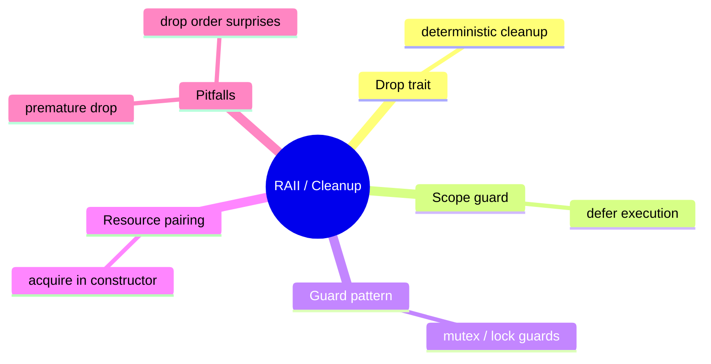

# RAII 与 Cleanup 惯用法

**EN**: RAII and Cleanup Idioms
**Summary**: Tie resource acquisition and release to object lifetime using `Drop` and scope guards.



> **Rust 版本**: 1.97.0+ (Edition 2024)
> **Bloom 层级**: L5
> **权威来源**: 本文件为 `concept/` 权威页。
> **前置概念**: [所有权与借用](../../../01_foundation/01_ownership_borrow_lifetime/01_ownership.md) · [Drop trait](../../../02_intermediate/02_memory_management/01_memory_management.md)
> **后置概念**: [Defer](./08_defer.md)

---

## 一、权威定义

RAII（Resource Acquisition Is Initialization）将**资源获取**与对象初始化绑定，将**资源释放**与对象析构绑定。Rust 通过 `Drop` trait 在值离开作用域时自动调用清理逻辑，从而保证资源（内存、文件、锁、网络句柄）的确定性释放。

Scope guard 是 RAII 的轻量扩展：它允许在作用域退出时执行任意闭包，常用于临时恢复状态或记录日志。

## 二、核心属性与关系

| 属性 | 说明 |
|:---|:---|
| **确定性** | 资源释放时机由作用域决定，无 GC 停顿。 |
| **异常安全** | 即使发生 panic，`Drop` 仍会被调用（除非 abort）。 |
| **零成本** | `Drop` 调用直接内联，无虚拟析构开销。 |
| **组合性** | 多个 RAII 对象按声明的逆序析构。 |

## 三、正向推理决策树

```text
需要管理非内存资源（文件、锁、句柄）？
├── 否 → 通常无需自定义 Drop。
└── 是
    ├── 资源是否由标准库/已知 crate 提供？
    │   └── 是 → 直接使用其 RAII 包装（如 MutexGuard、File）。
    └── 是否需要自定义清理？
        ├── 清理逻辑是否简单且局部？
        │   └── 是 → 使用 scope guard。
        └── 清理逻辑是否随类型生命周期绑定？
            └── 是 → 实现 Drop。
```

## 四、反向推理决策树

```text
资源泄漏或重复释放？
├── 是否在 Drop 中使用 unsafe 并手动 free？
│   └── 是 → 确保指针唯一所有权，避免 double free / use-after-free。
├── 是否提前 mem::forget 了 RAII 对象？
│   └── 是 → 明确是否需要抑制 Drop；通常应避免。
├── 是否需要按特定顺序释放？
│   └── 是 → 调整字段声明顺序，或显式在 Drop 中控制。
└── 闭包中是否引用了已 drop 的值？
    └── 是 → 确保 scope guard 闭包只移动owned数据。
```

## 五、Rust 表达与示例

```rust
struct TempFile {
    path: String,
}

impl TempFile {
    fn new(path: impl Into<String>) -> Self {
        TempFile { path: path.into() }
    }
}

impl Drop for TempFile {
    fn drop(&mut self) {
        // 实际场景应调用 std::fs::remove_file
        println!("cleaning up {}", self.path);
    }
}

fn main() {
    {
        let _tmp = TempFile::new("/tmp/data.txt");
    } // Drop 自动调用
}
```

## 六、反例与常见错误

显式调用 `drop` 后再使用值会导致编译错误：

```rust,compile_fail,E0382
struct Guard;

fn main() {
    let guard = Guard;
    drop(guard);
    let _used = guard; // ❌ guard 已被 move 进 drop
}
```

另一个常见反例是在 `Drop` 中持有被 drop 值的引用：

```rust,compile_fail,E0505
struct Guard<'a> {
    msg: &'a String,
}

impl<'a> Drop for Guard<'a> {
    fn drop(&mut self) {
        println!("{}", self.msg);
    }
}

fn main() {
    let msg = String::from("hello");
    let _guard = Guard { msg: &msg };
    drop(msg); // msg 在 guard 之前被释放
}
```

## 七、国际权威来源

- [The Rust Programming Language — Drop Trait](https://doc.rust-lang.org/book/ch15-03-drop.html)
- [Rust Reference — Destructor](https://doc.rust-lang.org/reference/destructors.html)
- [Rust API Guidelines — RAII](https://rust-lang.github.io/api-guidelines/flexibility.html#c-raii)

## 来源与延伸阅读

- [RustBelt — Logical Foundations for Safe Systems Programming](https://plv.mpi-sws.org/rustbelt/)（P1 形式化基础）
- [Resource Polymorphism](https://arxiv.org/abs/1803.02796)（P1 资源管理 / RAII 理论）
- [scopeguard — Scope Guards and Defer](https://docs.rs/scopeguard/latest/scopeguard/)（P2 生态）
- [scopeguard on crates.io](https://crates.io/crates/scopeguard)
- [Announcing Rust 1.82.0](https://blog.rust-lang.org/2024/10/17/Rust-1.82.0/)（P2 官方博客）

## 形式化基础

本页的工程模式可追溯到以下 L4 形式化/理论权威页：

- [类型论基础](../../../04_formal/00_type_theory/01_type_theory.md)
- [操作语义](../../../04_formal/03_operational_semantics/03_operational_semantics.md)
- [λ 演算与可计算性](../../../04_formal/00_type_theory/05_lambda_calculus.md)
