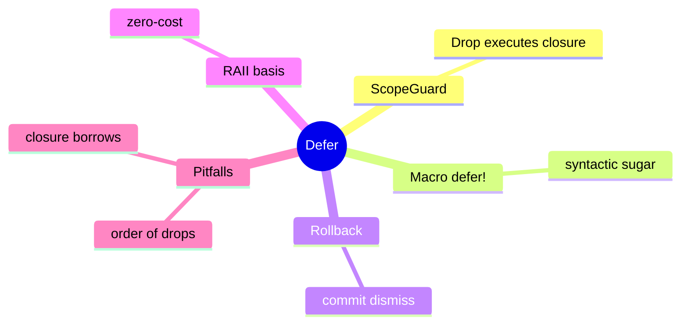

# Defer 惯用法

**EN**: Defer Idiom
**Summary**: Ensure cleanup or rollback code runs at the end of a scope using a RAII guard or the `defer!` macro.



> **Rust 版本**: 1.97.0+ (Edition 2024)
> **Bloom 层级**: L5
> **权威来源**: 本文件为 `concept/` 权威页。
> **前置概念**: [RAII / Cleanup](./06_raii_cleanup.md) · [Drop trait](../../../02_intermediate/02_memory_management/01_memory_management.md)
> **后置概念**: [错误传播](./02_error_propagation.md)

---

## 一、权威定义

Defer 惯用法用于在**作用域退出时**执行一段代码，无论退出原因是正常返回、break、continue 还是 panic。Rust 没有内置 `defer` 关键字，但可通过 RAII `Drop` 实现等价的 `ScopeGuard` 或 `defer!` 宏。

与手动在每条退出路径调用清理代码相比，defer 更健壮，可避免遗漏。

## 二、核心属性与关系

| 属性 | 说明 |
|:---|:---|
| **作用域绑定** | 清理代码与 guard 的生命周期绑定，离开作用域自动执行。 |
| **可取消** | 提供 `dismiss` 方法可在成功提交后取消 guard。 |
| **零额外开销** | guard 为空结构体加闭包，drop 时直接调用。 |
| **与 ? 兼容** | guard 在 `?` 提前返回时仍会 drop。 |

## 三、正向推理决策树

```text
作用域内需要临时恢复状态或执行清理？
├── 否 → 无需 defer。
└── 是
    ├── 清理逻辑是否与某个具体对象生命周期绑定？
    │   └── 是 → 为该对象实现 Drop。
    └── 是否是局部、临时的恢复/回滚？
        └── 是 → 使用 ScopeGuard / defer! 宏。
```

## 四、反向推理决策树

```text
defer 闭包行为异常？
├── 闭包捕获了被移动的值？
│   └── 是 → 确保只 move owned 数据，或使用 clone。
├── drop 顺序与预期相反？
│   └── 是 → Rust 按声明逆序 drop，调整 guard 声明顺序。
├── 已成功提交却仍触发回滚？
│   └── 是 → 在成功路径调用 guard.dismiss()。
└── defer 闭包 panic 导致双重 panic？
    └── 是 → 保持 defer 闭包简单，避免 panic。
```

## 五、Rust 表达与示例

```rust
pub struct ScopeGuard<F: FnOnce()> {
    callback: Option<F>,
}

impl<F: FnOnce()> ScopeGuard<F> {
    pub fn new(callback: F) -> Self {
        Self { callback: Some(callback) }
    }

    pub fn dismiss(mut self) {
        self.callback.take();
    }
}

impl<F: FnOnce()> Drop for ScopeGuard<F> {
    fn drop(&mut self) {
        if let Some(callback) = self.callback.take() {
            callback();
        }
    }
}

fn main() {
    let mut flag = false;
    {
        let _guard = ScopeGuard::new(|| flag = true);
        // 作用域结束时 flag 会被置为 true
    }
    assert!(flag);
}
```

## 六、反例与常见错误

defer 闭包中借用了一个在 guard 之前离开作用域的值会导致编译错误：

```rust,compile_fail,E0505
pub struct ScopeGuard<F: FnOnce()> {
    callback: Option<F>,
}

impl<F: FnOnce()> ScopeGuard<F> {
    pub fn new(callback: F) -> Self { Self { callback: Some(callback) } }
}

impl<F: FnOnce()> Drop for ScopeGuard<F> {
    fn drop(&mut self) {
        if let Some(callback) = self.callback.take() { callback(); }
    }
}

fn main() {
    let msg = String::from("hello");
    let _guard = ScopeGuard::new(|| println!("{}", msg));
    drop(msg); // ❌ msg 在 guard 之前被释放
}
```

## 七、国际权威来源

- [Rust Design Patterns — RAII Guards](https://rust-unofficial.github.io/patterns/idioms/raii-guards.html)
- [The Rust Programming Language — Drop Trait](https://doc.rust-lang.org/book/ch15-03-drop.html)
- [Go Blog — Defer, Panic, and Recover](https://go.dev/blog/defer-panic-and-recover)（概念对比）

- [Rust API Guidelines](https://rust-lang.github.io/api-guidelines/)

## 来源与延伸阅读

- [RustBelt — Logical Foundations for Safe Systems Programming](https://plv.mpi-sws.org/rustbelt/)（P1 形式化基础）
- [Resource Polymorphism](https://arxiv.org/abs/1803.02796)（P1 资源管理 / 作用域退出语义）
- [scopeguard — Scope Guards and `defer!`](https://docs.rs/scopeguard/latest/scopeguard/)（P2 生态）
- [scopeguard on crates.io](https://crates.io/crates/scopeguard)
- [What the Error Handling Project Group is Working On](https://blog.rust-lang.org/inside-rust/2020/11/23/What-the-error-handling-project-group-is-working-on/)（P2 官方博客，defer 与错误处理）

## 形式化基础

本页的工程模式可追溯到以下 L4 形式化/理论权威页：

- [类型论基础](../../../04_formal/00_type_theory/01_type_theory.md)
- [操作语义](../../../04_formal/03_operational_semantics/03_operational_semantics.md)
- [λ 演算与可计算性](../../../04_formal/00_type_theory/05_lambda_calculus.md)
