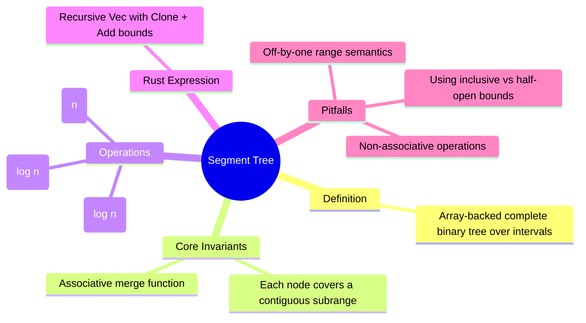

# 线段树

**EN**: Segment Tree
**Summary**: A complete binary-tree-like array structure that answers range aggregate queries and point updates in logarithmic time.



> **Rust 版本**: 1.97.0+ (Edition 2024)
> **Bloom 层级**: L5-L6
> **权威来源**: 本文件为 `concept/` 权威页。
> **前置概念**: [`../../../01_foundation/05_collections/01_collections.md`](../../../01_foundation/05_collections/01_collections.md), [`../../../02_intermediate/07_iterators_and_closures/01_iterator_patterns.md`](../../../02_intermediate/07_iterators_and_closures/01_iterator_patterns.md), [`../../../06_ecosystem/16_algorithm_patterns/01_algorithmic_paradigms.md`](../../../06_ecosystem/16_algorithm_patterns/01_algorithmic_paradigms.md)
> **后置概念**: [`../04_graph_algorithms.md`](./04_graph_algorithms.md), [`../../../06_ecosystem/16_algorithm_patterns/04_cache_friendly_and_simd_algorithms.md`](../../../06_ecosystem/16_algorithm_patterns/04_cache_friendly_and_simd_algorithms.md), [`../../../06_ecosystem/16_algorithm_patterns/18_competitive_programming_idioms.md`](../../../06_ecosystem/16_algorithm_patterns/18_competitive_programming_idioms.md)

## 一、权威定义

线段树（Segment Tree）是一种基于数组的完全二叉树结构，用于维护一个序列的区间信息。它将序列的每个区间映射到树中的一个节点，支持：

- **建树（build）**：根据原始序列一次性构造树；
- **区间查询（range query）**：返回任意连续子区间的聚合结果；
- **单点更新（point update）**：修改序列中某一个位置的值，并同步更新受影响的节点。

线段树适用于聚合操作具有**结合律**且存在**单位元**的场景，例如求和、最大值、最小值、按位与/或、GCD 等。

## 二、核心属性与关系

1. **结合律（Associativity）**：合并操作必须满足 `(a ⊕ b) ⊕ c = a ⊕ (b ⊕ c)`。若操作不满足结合律（如普通减法），线段树的查询结果将依赖于拆分顺序。
2. **单位元（Identity）**：空区间必须返回不影响合并的值，例如求和的单位元是 `0`，最大值的单位元是 `−∞`（或 `T::MIN`）。
3. **区间覆盖**：根节点覆盖 `[0, n)`，每个内部节点覆盖某个连续子区间，叶子节点覆盖单个元素。
4. **递归二分**：对于覆盖 `[l, r)` 的节点，左子节点覆盖 `[l, mid)`，右子节点覆盖 `[mid, r)`，其中 `mid = (l + r) / 2`。
5. **与树状数组的关系**：树状数组（Fenwick Tree）也能处理点更新 + 区间查询，但通常要求操作具有可逆性；线段树不要求可逆性，实现更通用。

## 三、正向推理决策树

```text
需要支持数组区间查询与单点更新？
├── 否
│   └── 若只需静态查询，考虑前缀和或稀疏表（Sparse Table）。
└── 是
    └── 聚合操作是否满足结合律且存在单位元？
        ├── 否
        │   └── 线段树不适用；考虑莫队算法或离线分治。
        └── 是
            ├── 查询区间是否总是前缀 [0, i]？
            │   └── 是 → 可用树状数组获得更小的常数。
            └── 否 → 使用线段树；选择迭代式或递归式实现。
                ├── 是否需要区间更新（如区间加）？
                │   └── 是 → 引入懒标记（Lazy Propagation）。
                └── 否 → 标准点更新线段树。
```

## 四、反向推理决策树

```text
线段树结果错误或超时？
├── 结果错误
│   ├── 操作是否满足结合律？
│   │   └── 否 → 更换算法，不能硬套线段树。
│   ├── 查询区间语义是否正确？（[l, r) vs [l, r]）
│   │   └── 否 → 统一为半开区间 [l, r)。
│   ├── 更新后是否沿父链重新合并？
│   │   └── 否 → 检查更新递归/迭代路径。
│   └── 单位元是否选对？
│       └── 否 → 使用对应操作的单位元。
└── 超时
    ├── 查询/更新是否只访问 O(log n) 个节点？
    │   └── 否 → 检查递归边界或循环条件。
    └── 是否使用了过大递归深度？
        └── 是 → 改用迭代式线段树或增加栈空间。
```

## 五、Rust 表达与示例

下面的实现使用递归式线段树，要求元素类型实现 `Clone + Add<Output = T> + Default`。`Default` 充当单位元。

```rust
use std::ops::Add;

struct SegmentTree<T> {
    n: usize,
    tree: Vec<T>,
}

impl<T: Clone + Add<Output = T> + Default> SegmentTree<T> {
    fn new(arr: &[T]) -> Self {
        let n = arr.len();
        let mut tree = vec![T::default(); 4 * n.max(1)];
        if n > 0 {
            Self::build(1, 0, n, arr, &mut tree);
        }
        Self { n, tree }
    }

    fn build(node: usize, l: usize, r: usize, arr: &[T], tree: &mut [T]) {
        if r - l == 1 {
            tree[node] = arr[l].clone();
            return;
        }
        let mid = (l + r) / 2;
        Self::build(node * 2, l, mid, arr, tree);
        Self::build(node * 2 + 1, mid, r, arr, tree);
        tree[node] = tree[node * 2].clone() + tree[node * 2 + 1].clone();
    }

    fn update(&mut self, idx: usize, value: T) {
        self.update_rec(1, 0, self.n, idx, value);
    }

    fn update_rec(&mut self, node: usize, l: usize, r: usize, idx: usize, value: T) {
        if r - l == 1 {
            self.tree[node] = value;
            return;
        }
        let mid = (l + r) / 2;
        if idx < mid {
            self.update_rec(node * 2, l, mid, idx, value);
        } else {
            self.update_rec(node * 2 + 1, mid, r, idx, value);
        }
        self.tree[node] = self.tree[node * 2].clone() + self.tree[node * 2 + 1].clone();
    }

    fn query(&self, ql: usize, qr: usize) -> T {
        self.query_rec(1, 0, self.n, ql, qr)
    }

    fn query_rec(&self, node: usize, l: usize, r: usize, ql: usize, qr: usize) -> T {
        if qr <= l || r <= ql {
            return T::default();
        }
        if ql <= l && r <= qr {
            return self.tree[node].clone();
        }
        let mid = (l + r) / 2;
        self.query_rec(node * 2, l, mid, ql, qr)
            + self.query_rec(node * 2 + 1, mid, r, ql, qr)
    }
}

fn main() {
    let arr = vec![1u32, 3, 5, 7, 9];
    let mut st = SegmentTree::new(&arr);

    assert_eq!(st.query(1, 4), 15); // 3 + 5 + 7
    st.update(2, 10);
    assert_eq!(st.query(1, 4), 20); // 3 + 10 + 7
    assert_eq!(st.query(0, 5), 30); // 1 + 3 + 10 + 7 + 9
}
```

## 六、反例与常见错误

### 对不满足结合律的类型实例化线段树

线段树的 `T` 要求 `Add`，但 `&str` 没有实现 `Add<Output = &str>`，因此会在编译期被拒绝。

```rust,compile_fail,E0277
use std::ops::Add;

struct SegmentTree<T> {
    n: usize,
    tree: Vec<T>,
}

impl<T: Clone + Add<Output = T> + Default> SegmentTree<T> {
    fn new(arr: &[T]) -> Self {
        let n = arr.len();
        let mut tree = vec![T::default(); 4 * n.max(1)];
        if n > 0 {
            Self::build(1, 0, n, arr, &mut tree);
        }
        Self { n, tree }
    }

    fn build(node: usize, l: usize, r: usize, arr: &[T], tree: &mut [T]) {
        if r - l == 1 {
            tree[node] = arr[l].clone();
            return;
        }
        let mid = (l + r) / 2;
        Self::build(node * 2, l, mid, arr, tree);
        Self::build(node * 2 + 1, mid, r, arr, tree);
        tree[node] = tree[node * 2].clone() + tree[node * 2 + 1].clone();
    }
}

fn main() {
    let _st = SegmentTree::new(&["a", "b", "c"]);
}
```

### 区间端点语义混淆

如果代码按 `[l, r]` 理解但接口实现为 `[l, r)`，会导致漏取或越界。下面的调用在示例实现中是合法的，但语义上很容易写错成 `st.query(1, 3)` 想取 `[1, 4)`：

```rust
// 错误示例（运行时结果错误，非编译错误）
// 本意查询 [1, 4]，却写成 query(1, 3)，漏掉了索引 3。
```

### 使用减法等非结合操作

若把 `a ⊕ b` 实现为 `a - b`，则区间拆分后的结果取决于拆分方式，导致查询不可复现。例如 `(a[0]-a[1])-a[2] ≠ a[0]-(a[1]-a[2])`。

## 七、复杂度与安全性分析

| 操作 | 时间复杂度 | 空间复杂度 |
|---|---|---|
| 建树 | O(n) | O(n)（通常开 4n） |
| 区间查询 | O(log n) | O(log n) 递归栈 |
| 单点更新 | O(log n) | O(log n) 递归栈 |
| 带懒标记区间更新 | O(log n) | O(n) 额外懒标记数组 |

**安全性**：

- Rust 实现无需 `unsafe`；索引访问均通过 `Vec` 的边界检查或手工约束在合法范围内。
- 递归深度为 O(log n)，通常不会超过默认线程栈。
- 类型系统保证聚合操作满足 `Add` 与 `Clone`，不满足的类型会在编译期被拒绝（见反例）。

## 八、国际权威来源

- *Introduction to Algorithms* (CLRS), 4th ed. — 区间树、顺序统计树等区间数据结构。
- *The Algorithm Design Manual* (Skiena), 3rd ed. — 区间查询与树形数据结构的算法选择框架。
- [cp-algorithms: Segment Tree](https://cp-algorithms.com/data_structures/segment_tree.html) — 线段树的迭代与递归实现、懒标记扩展。
- [Rust Standard Library: `std::ops::Add`](https://doc.rust-lang.org/std/ops/trait.Add.html) — 用于泛型聚合操作。
- [Rust Standard Library: `std::default::Default`](https://doc.rust-lang.org/std/default/trait.Default.html) — 作为结合操作的单位元来源。

## 形式化基础

本页的工程模式可追溯到以下 L4 形式化/理论权威页：

- [算法语义与霍尔逻辑](../../../04_formal/08_algorithm_semantics/01_hoare_logic_for_rust.md)
- [算法等价性](../../../04_formal/08_algorithm_semantics/05_algorithm_equivalence.md)
- [形式化算法理论](../../../04_formal/00_type_theory/13_formal_algorithm_theory.md)

## 来源与延伸阅读

- [The Rust Reference](https://doc.rust-lang.org/reference/)
- [std::collections](https://doc.rust-lang.org/std/collections/)
- [Rust RFCs](https://rust-lang.github.io/rfcs/)
- [The Rust Programming Language](https://doc.rust-lang.org/book/)
