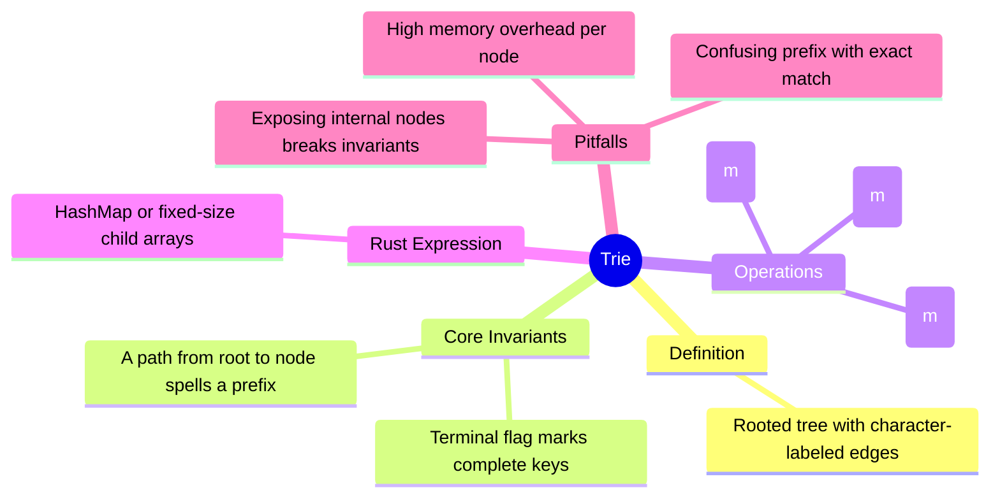

# 字典树

**EN**: Trie (Prefix Tree)
**Summary**: A rooted tree where each edge is labeled with a character, used for efficient prefix-based string storage and retrieval.



> **Rust 版本**: 1.97.0+ (Edition 2024)
> **Bloom 层级**: L5-L6
> **权威来源**: 本文件为 `concept/` 权威页。
> **前置概念**: [`../../../01_foundation/05_collections/01_collections.md`](../../../01_foundation/05_collections/01_collections.md), [`../../../01_foundation/06_strings_and_text/01_strings_and_text.md`](../../../01_foundation/06_strings_and_text/01_strings_and_text.md), [`../../../06_ecosystem/16_algorithm_patterns/02_ownership_aware_data_structures.md`](../../../06_ecosystem/16_algorithm_patterns/02_ownership_aware_data_structures.md)
> **后置概念**: [`../../../06_ecosystem/16_algorithm_patterns/07_string_algorithms_in_rust.md`](../../../06_ecosystem/16_algorithm_patterns/07_string_algorithms_in_rust.md), [`../../../06_ecosystem/16_algorithm_patterns/18_competitive_programming_idioms.md`](../../../06_ecosystem/16_algorithm_patterns/18_competitive_programming_idioms.md), [`../04_graph_algorithms.md`](./04_graph_algorithms.md)

## 一、权威定义

字典树（Trie），又称前缀树（Prefix Tree），是一种用于存储字符串集合的有根树结构。每条从父节点指向子节点的边标记一个字符，从根到某节点的路径上的字符序列即为某个字符串的前缀。节点通常包含一个标记，表示从根到该节点的路径是否构成集合中的完整字符串。

字典树的核心操作：

- **插入（insert）**：沿着字符边向下走，缺少的节点动态创建；到达末尾后设置终止标记。
- **精确查找（search）**：逐字符匹配边；到达末尾后检查终止标记。
- **前缀匹配（starts_with）**：只需逐字符匹配成功即可，不需要终止标记。

## 二、核心属性与关系

1. **前缀共享**：所有拥有公共前缀的字符串共享根到分歧点之间的路径，因此前缀查询天然高效。
2. **路径即前缀**：任意节点到根的路径上的字符序列唯一对应一个字符串前缀。
3. **终止标记**：仅当节点被标记为终止时，才表示该节点对应路径是集合中的完整关键字，而非仅前缀。
4. **子节点表示**：
   - `HashMap<char, Node>`：通用，支持 Unicode，但每个节点有哈希表开销。
   - `[Option<Node>; 26]`：适用于固定小字符集，访问快但内存浪费。
   - 压缩 Trie（Radix Tree）：合并单分支路径，减少节点数量。
5. **与图的关系**：Trie 是一种特殊的有向无环图（DAG 退化成的树），每个节点入度为 1（根节点除外）。

## 三、正向推理决策树

```text
需要大量字符串的前缀查询、自动补全或字典匹配？
├── 否
│   └── 字符串数量少或只需精确查找 → 用 HashSet<String> 或 BTreeSet<String>。
└── 是
    └── 字符集是否固定且较小？
        ├── 是 → 可用固定数组子节点，降低常数。
        └── 否 → 用 HashMap<char, Node> 支持任意 Unicode。
            ├── 内存是否敏感？
            │   ├── 是 → 考虑压缩 Trie（Radix Tree）或双数组 Trie。
            │   └── 否 → 标准 Trie。
            └── 是否需要统计频次或顺序？
                ├── 是 → 在节点中维护计数器或有序子节点。
                └── 否 → 仅保存终止布尔值。
```

## 四、反向推理决策树

```text
Trie 占用内存过大或查询结果错误？
├── 内存过大
│   ├── 是否每个节点都是 HashMap？
│   │   └── 是 → 对小字符集改用数组；或改用压缩 Trie。
│   ├── 是否存在大量单分支长链？
│   │   └── 是 → 压缩 Trie 合并链式节点。
│   └── 是否存储了完整字符串在叶子中？
│       └── 是 → 删除冗余存储，路径本身即字符串。
└── 查询结果错误
    ├── 是否混淆了前缀存在与完整关键字存在？
    │   └── 是 → 区分 `starts_with` 与 `search` 的终止标记判断。
    ├── 是否暴露了内部节点供外部直接修改？
    │   └── 是 → 将 `root` 和 `Node` 设为私有，通过方法维护不变式。
    └── 插入时是否忘记设置终止标记？
        └── 是 → 在每条关键字的最后一个字符处设置 `is_end = true`。
```

## 五、Rust 表达与示例

下面的实现使用 `HashMap<char, Node>` 表示子节点，完全基于标准库，支持任意 `char`。

```rust
use std::collections::HashMap;

struct Node {
    children: HashMap<char, Node>,
    is_end: bool,
}

impl Node {
    fn new() -> Self {
        Self {
            children: HashMap::new(),
            is_end: false,
        }
    }
}

struct Trie {
    root: Node,
}

impl Trie {
    fn new() -> Self {
        Self { root: Node::new() }
    }

    fn insert(&mut self, word: &str) {
        let mut cur = &mut self.root;
        for ch in word.chars() {
            cur = cur.children.entry(ch).or_insert_with(Node::new);
        }
        cur.is_end = true;
    }

    fn search(&self, word: &str) -> bool {
        self.walk(word).map_or(false, |node| node.is_end)
    }

    fn starts_with(&self, prefix: &str) -> bool {
        self.walk(prefix).is_some()
    }

    fn walk(&self, s: &str) -> Option<&Node> {
        let mut cur = &self.root;
        for ch in s.chars() {
            cur = cur.children.get(&ch)?;
        }
        Some(cur)
    }
}

fn main() {
    let mut trie = Trie::new();
    trie.insert("rust");
    trie.insert("rustc");
    trie.insert("cargo");

    assert!(trie.search("rust"));
    assert!(!trie.search("rus"));
    assert!(trie.starts_with("rus"));
    assert!(trie.starts_with("car"));
    assert!(!trie.starts_with("java"));
}
```

## 六、反例与常见错误

### 访问私有内部字段破坏封装

`Trie::root` 是私有的，外部代码直接访问会触发编译错误 `E0616`。

```rust,compile_fail,E0616
mod trie {
    use std::collections::HashMap;

    pub struct Node {
        children: HashMap<char, Node>,
        is_end: bool,
    }

    pub struct Trie {
        root: Node, // private field
    }

    impl Trie {
        pub fn new() -> Self {
            Self { root: Node { children: HashMap::new(), is_end: false } }
        }
    }
}

fn main() {
    let trie = trie::Trie::new();
    // 错误：root 字段私有
    let _ = trie.root;
}
```

### 前缀存在误判为精确匹配

```rust
// 错误示例（运行时语义错误，非编译错误）
// 仅检查 starts_with("rus") 为 true 就断言 search("rus") 为 true，
// 忽略了终止标记。
```

### 在共享引用期间修改内部节点

下面的代码试图在持有对 `children` 的引用时再次可变借用，违反借用规则：

```rust
// 错误示例（编译错误 E0499/E0502）
// let node = &trie.root;
// trie.insert("new"); // 与 node 的共享/可变借用冲突
```

## 七、复杂度与安全性分析

| 操作 | 时间复杂度 | 空间复杂度 |
|---|---|---|
| 插入长度为 m 的字符串 | O(m) | O(m)（仅新增必要节点） |
| 精确查找 | O(m) | O(1) |
| 前缀查询 | O(m) | O(1) |
| 遍历所有关键字 | O(关键字总长度) | O(递归栈深度) |

**安全性**：

- 本实现无需 `unsafe`。
- `HashMap::entry` 保证在插入时无需手动维护链式指针，避免 C 风格指针错误。
- `Node` 与 `root` 私有，避免外部破坏树的不变式（如终止标记缺失、子节点非法）。
- 由于节点通过 `HashMap`  owning 子节点，所有权清晰，不存在悬垂引用。

## 八、国际权威来源

- *Introduction to Algorithms* (CLRS), 4th ed. — 字符串匹配与树形数据结构基础。
- *The Algorithm Design Manual* (Skiena), 3rd ed. — 字符串与字典问题的数据结构选择。
- [cp-algorithms: Trie](https://cp-algorithms.com/string/string_structures.html) — 前缀树的实现与应用。
- [Rust Standard Library: `std::collections::HashMap`](https://doc.rust-lang.org/std/collections/struct.HashMap.html) — 子节点映射的标准实现。
- [Rust Standard Library: `std::str::Chars`](https://doc.rust-lang.org/std/str/struct.Chars.html) — Unicode 字符迭代器。

## 形式化基础

本页的工程模式可追溯到以下 L4 形式化/理论权威页：

- [算法语义与霍尔逻辑](../../../04_formal/08_algorithm_semantics/01_hoare_logic_for_rust.md)
- [算法等价性](../../../04_formal/08_algorithm_semantics/05_algorithm_equivalence.md)
- [形式化算法理论](../../../04_formal/00_type_theory/13_formal_algorithm_theory.md)

## 来源与延伸阅读

- [Exploring the Trie of Rules: a fast data structure for the representation of association rules](https://arxiv.org/abs/2310.17355) — P1：前缀树/字典树结构的学术论文参考。
- [trie on crates.io](https://crates.io/crates/trie) — P2：通用 Trie Rust crate。
- [trie docs on docs.rs](https://docs.rs/trie/latest/trie/) — P2：Trie crate API 文档。
- [radix_trie on crates.io](https://crates.io/crates/radix_trie) — P2：压缩 Trie（Radix Tree）Rust 实现。
- [radix_trie docs on docs.rs](https://docs.rs/radix_trie/latest/radix_trie/) — P2：压缩 Trie API 文档。
