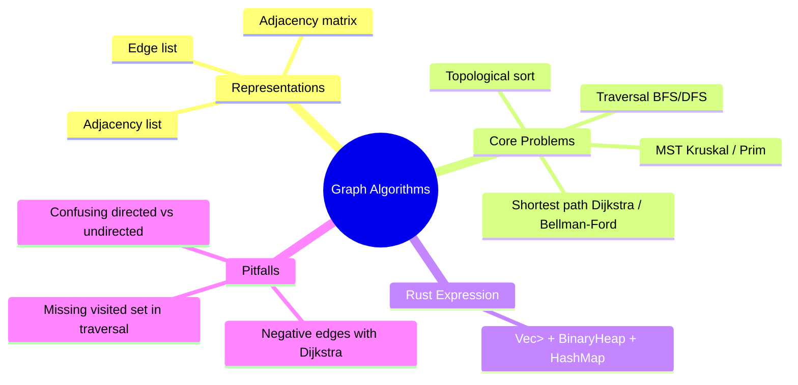

# 图算法

**EN**: Graph Algorithms
**Summary**: Algorithms that operate on vertices and edges to solve traversal, connectivity, shortest-path, spanning-tree, and ordering problems.



> **Rust 版本**: 1.97.0+ (Edition 2024)
> **Bloom 层级**: L5-L6
> **权威来源**: 本文件为 `concept/` 权威页。
> **前置概念**: [`../../../01_foundation/05_collections/01_collections.md`](../../../01_foundation/05_collections/01_collections.md), [`../03_union_find.md`](./03_union_find.md), [`../../../06_ecosystem/16_algorithm_patterns/01_algorithmic_paradigms.md`](../../../06_ecosystem/16_algorithm_patterns/01_algorithmic_paradigms.md)
> **后置概念**: [`../../../06_ecosystem/16_algorithm_patterns/03_graph_algorithms_in_rust.md`](../../../06_ecosystem/16_algorithm_patterns/03_graph_algorithms_in_rust.md), [`../../../06_ecosystem/16_algorithm_patterns/14_network_flow_and_matching.md`](../../../06_ecosystem/16_algorithm_patterns/14_network_flow_and_matching.md), [`../../../06_ecosystem/16_algorithm_patterns/19_parallel_and_gpu_algorithms.md`](../../../06_ecosystem/16_algorithm_patterns/19_parallel_and_gpu_algorithms.md)

## 一、权威定义

图算法是在图（Graph）结构——由顶点（vertex）和边（edge）组成的数据结构——上求解问题的算法集合。根据问题类型，可分为：

- **遍历（Traversal）**：广度优先搜索（BFS）和深度优先搜索（DFS），用于可达性、连通分量、层次关系等。
- **最短路径（Shortest Path）**：Dijkstra（非负权）、Bellman-Ford（可处理负权）、Floyd-Warshall（全源最短路径）。
- **最小生成树（MST）**：Kruskal（基于并查集）和 Prim（基于优先队列）。
- **拓扑排序（Topological Sort）**：Kahn 算法或 DFS 后序，用于有向无环图（DAG）的任务调度。

## 二、核心属性与关系

1. **图表示**：
   - **邻接表（Adjacency List）**：`Vec<Vec<Edge>>`，适合稀疏图，空间 O(V + E)。
   - **邻接矩阵（Adjacency Matrix）**：`Vec<Vec<bool/W>>`，适合稠密图或需要快速判断两点是否相连。
   - **边列表（Edge List）**：`Vec<(u, v, w)>`，适合 Kruskal 等按边处理的算法。
2. **有向 vs 无向**：无向边需在两个方向的邻接表中都插入；有向边只插一次。
3. **权重与负权**：Dijkstra 要求非负权，负权会导致贪心选择失效；负权需使用 Bellman-Ford。
4. **DAG**：有向无环图保证拓扑排序存在；含环图不存在拓扑排序。
5. **与并查集的关系**：Kruskal 算法使用并查集维护连通分量，以判断加入边是否会形成环。

## 三、正向推理决策树

```text
需要解决图上的什么问题？
├── 仅判断可达性或层次遍历
│   └── 用 BFS（无权图最短层数）或 DFS。
├── 求单源最短路径
│   ├── 边权是否有负数？
│   │   ├── 是 → Bellman-Ford（可检测负环）或 SPFA。
│   │   └── 否 → Dijkstra + 优先队列。
├── 求全源最短路径
│   └── Floyd-Warshall（稠密图）或对每个点跑 Dijkstra（稀疏图）。
├── 求最小生成树
│   ├── 图是否稠密？
│   │   ├── 是 → Prim。
│   │   └── 否 → Kruskal（并查集）。
└── 任务依赖排序
    └── DAG 拓扑排序（Kahn 或 DFS 后序）。
```

## 四、反向推理决策树

```text
图算法输出错误？
├── 最短路径结果错误
│   ├── 是否存在负权边却用了 Dijkstra？
│   │   └── 是 → 改用 Bellman-Ford。
│   ├── 是否把有向图当成了无向图处理？
│   │   └── 是 → 只插入单方向边。
│   └── 优先队列的排序方向是否反了？
│       └── 是 → 使用 `std::cmp::Reverse` 取最小值。
├── 遍历结果错误
│   ├── 是否有 visited 集合避免重复访问？
│   │   └── 否 → 添加 `Vec<bool>` 或 `HashSet`。
│   └── 起始点是否覆盖所有连通分量？
│       └── 否 → 外层循环遍历所有顶点。
└── MST 结果错误
    ├── Kruskal 是否按权重排序后再 union？
    │   └── 否 → 先排序。
    └── Prim 是否从多个连通分量分别开始？
        └── 否 → 非连通图需外层循环。
```

## 五、Rust 表达与示例

下面的示例实现了邻接表、BFS、DFS 和 Dijkstra，全部基于标准库。

```rust
use std::cmp::Reverse;
use std::collections::{BinaryHeap, VecDeque};

struct Graph {
    adj: Vec<Vec<(usize, usize)>>, // (neighbor, weight)
}

impl Graph {
    fn new(n: usize) -> Self {
        Self { adj: vec![Vec::new(); n] }
    }

    fn add_edge(&mut self, u: usize, v: usize, w: usize) {
        self.adj[u].push((v, w));
    }

    fn bfs(&self, start: usize) -> Vec<Option<usize>> {
        let n = self.adj.len();
        let mut dist = vec![None; n];
        let mut q = VecDeque::new();
        dist[start] = Some(0);
        q.push_back(start);
        while let Some(u) = q.pop_front() {
            let d = dist[u].unwrap();
            for &(v, _) in &self.adj[u] {
                if dist[v].is_none() {
                    dist[v] = Some(d + 1);
                    q.push_back(v);
                }
            }
        }
        dist
    }

    fn dfs(&self, start: usize) -> Vec<usize> {
        let n = self.adj.len();
        let mut visited = vec![false; n];
        let mut order = Vec::new();
        self.dfs_rec(start, &mut visited, &mut order);
        order
    }

    fn dfs_rec(&self, u: usize, visited: &mut [bool], order: &mut Vec<usize>) {
        visited[u] = true;
        order.push(u);
        for &(v, _) in &self.adj[u] {
            if !visited[v] {
                self.dfs_rec(v, visited, order);
            }
        }
    }

    fn dijkstra(&self, start: usize) -> Vec<Option<usize>> {
        let n = self.adj.len();
        let mut dist = vec![None; n];
        let mut heap = BinaryHeap::new();
        dist[start] = Some(0);
        heap.push(Reverse((0, start)));
        while let Some(Reverse((d, u))) = heap.pop() {
            if Some(d) != dist[u] {
                continue;
            }
            for &(v, w) in &self.adj[u] {
                let nd = d + w;
                if dist[v].map_or(true, |old| nd < old) {
                    dist[v] = Some(nd);
                    heap.push(Reverse((nd, v)));
                }
            }
        }
        dist
    }
}

fn main() {
    let mut g = Graph::new(5);
    g.add_edge(0, 1, 4);
    g.add_edge(0, 2, 1);
    g.add_edge(2, 1, 2);
    g.add_edge(1, 3, 1);
    g.add_edge(2, 3, 5);
    g.add_edge(3, 4, 3);

    let bfs = g.bfs(0);
    assert_eq!(bfs[4], Some(3));

    let dfs = g.dfs(0);
    assert_eq!(dfs[0], 0);

    let dist = g.dijkstra(0);
    assert_eq!(dist[4], Some(7)); // 0 -> 2 -> 1 -> 3 -> 4 = 1+2+1+3
}
```

## 六、反例与常见错误

### 将自定义类型直接用作 HashMap 键

若用自定义类型作为 `HashMap` 的键，必须实现 `Eq` 与 `Hash`，否则会触发 `E0277`。

```rust,compile_fail,E0277
use std::collections::HashMap;

struct NodeId(u32);

fn main() {
    // 错误：NodeId 没有实现 Eq + Hash
    let mut dist: HashMap<NodeId, i32> = HashMap::new();
    dist.insert(NodeId(0), 0);
}
```

### Dijkstra 处理负权边

```rust
// 错误示例（运行时得到错误的最短路径）
// g.add_edge(1, 2, -5); // Dijkstra 会失败，因为假设非负权重。
```

### 无向图只插单边

```rust
// 错误示例（运行时语义错误）
// g.add_edge(u, v, w); // 若图无向，还应执行 g.add_edge(v, u, w);
```

## 七、复杂度与安全性分析

| 算法 | 时间复杂度 | 空间复杂度 |
|---|---|---|
| BFS | O(V + E) | O(V) |
| DFS（递归） | O(V + E) | O(V)（递归栈） |
| Dijkstra（二叉堆） | O((V + E) log V) | O(V) |
| Bellman-Ford | O(VE) | O(V) |
| Kruskal | O(E log E) | O(V + E) |
| Prim（二叉堆） | O((V + E) log V) | O(V) |
| 拓扑排序（Kahn） | O(V + E) | O(V) |

**安全性**：

- 本示例完全基于 safe Rust，无需 `unsafe`。
- `Vec` 索引访问在越界时 panic；若图顶点 ID 来自外部输入，应先校验范围。
- 递归 DFS 在最坏情况下深度为 O(V)，对于大 V 可能栈溢出，可改用显式栈实现。
- `BinaryHeap` 配合 `Reverse` 保证取出最小代价，避免手动维护最小堆。

## 八、国际权威来源

- *Introduction to Algorithms* (CLRS), 4th ed. — 第 VI 部分 Graph Algorithms。
- *The Algorithm Design Manual* (Skiena), 3rd ed. — 图遍历、最短路径与生成树。
- [cp-algorithms: Graphs](https://cp-algorithms.com/graph/index.html) — BFS、DFS、Dijkstra、Bellman-Ford、Kruskal、Prim 等实现。
- [Rust Standard Library: `std::collections::BinaryHeap`](https://doc.rust-lang.org/std/collections/struct.BinaryHeap.html) — 优先队列实现。
- [Rust Standard Library: `std::collections::VecDeque`](https://doc.rust-lang.org/std/collections/struct.VecDeque.html) — BFS 队列实现。
