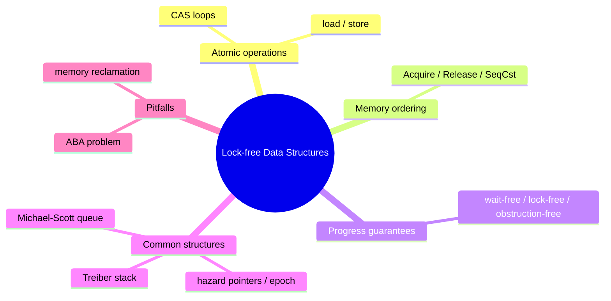

# 无锁数据结构

**EN**: Lock-free Data Structures
**Summary**: Implement concurrent data structures using atomic operations and memory ordering instead of mutexes to avoid blocking and priority inversion.



> **Rust 版本**: 1.97.0+ (Edition 2024)
> **Bloom 层级**: L6
> **权威来源**: 本文件为 `concept/` 权威页。
> **前置概念**: [并发基础](../../../03_advanced/00_concurrency/01_concurrency.md) · [Send / Sync](../../../03_advanced/00_concurrency/02_send_sync_auto_traits.md)
> **后置概念**: [图算法](./04_graph_algorithms.md)

---

## 一、权威定义

无锁数据结构（Lock-free Data Structures）是一种通过**原子操作**而非互斥锁实现线程安全共享的数据结构。一个数据结构被称为 *lock-free*，当至少有一个线程能在有限步骤内完成操作，即使其他线程挂起或延迟。

更严格的级别包括：

- **Wait-free**：每个线程都在有限步骤内完成；
- **Lock-free**：系统整体持续前进；
- **Obstruction-free**：无竞争时单个线程可在有限步骤完成。

## 二、核心属性与关系

| 属性 | 说明 |
|:---|:---|
| **无阻塞** | 线程不会因锁被占用而休眠，减少上下文切换和优先级反转。 |
| **原子操作** | 核心依赖 `compare_exchange`（CAS）循环实现状态迁移。 |
| **内存序** | `Acquire`/`Release` 配对保证跨线程可见性，`SeqCst` 用于更强的全局序。 |
| **内存回收** | 无锁删除节点需要安全回收（hazard pointers、epoch-based reclamation）。 |

## 三、正向推理决策树

```text
并发场景需要共享可变数据结构？
├── 否 → 使用消息传递或不可变共享。
└── 是
    ├── 竞争是否激烈？
    │   ├── 否 → Mutex/RwLock 更简单且足够。
    │   └── 是
    │       ├── 是否需要避免线程阻塞？
    │       │   └── 是 → 考虑 lock-free。
    │       └── 是否能接受更高实现复杂度？
    │           └── 否 → 使用成熟 crate（crossbeam）。
    └── 数据结构是否为栈/队列/计数器等经典结构？
        └── 是 → 优先复用 crossbeam / dashmap 等已验证实现。
```

## 四、反向推理决策树

```text
无锁结构出现数据竞争或内存问题？
├── CAS 循环是否考虑 ABA 问题？
│   └── 否 → 使用 tagged pointer 或 epoch reclamation。
├── 内存序是否过弱？
│   └── 是 → 加载用 Acquire，存储用 Release，必要时 SeqCst。
├── 删除的节点是否被其他线程访问？
│   └── 是 → 使用 hazard pointer / epoch 延迟回收。
└── 是否误将非原子操作当作原子？
    └── 是 → 所有共享可变状态必须通过 Atomic* 访问。
```

## 五、Rust 表达与示例

无锁栈（Treiber Stack）依赖 `crossbeam-epoch` 进行安全内存回收。本 crate 示例见 `crates/c08_algorithms/src/p10_algorithms.rs`。

```rust,no_run
// 需依赖 crossbeam-epoch
use crossbeam_epoch::{Atomic, Owned};
use std::sync::atomic::Ordering;

pub struct Node<T> {
    data: T,
    next: Atomic<Node<T>>,
}

pub struct LockFreeStack<T> {
    head: Atomic<Node<T>>,
}

impl<T> LockFreeStack<T> {
    pub fn new() -> Self {
        LockFreeStack { head: Atomic::null() }
    }

    pub fn push(&self, value: T) {
        let guard = &crossbeam_epoch::pin();
        let new = Owned::new(Node {
            data: value,
            next: Atomic::null(),
        }).into_shared(guard);
        loop {
            let head = self.head.load(Ordering::Relaxed, guard);
            unsafe { new.deref().next.store(head, Ordering::Relaxed); }
            if self.head.compare_exchange(
                head, new, Ordering::Release, Ordering::Relaxed, guard
            ).is_ok() {
                break;
            }
        }
    }
}
```

## 六、反例与常见错误

使用普通 `Box` 指针实现 pop 并立即释放，而其他线程仍可能读取该节点，会导致 use-after-free：

```rust,compile_fail,E0599
use std::sync::atomic::{AtomicPtr, Ordering};

struct Node<T> {
    data: T,
    next: *mut Node<T>,
}

struct Stack<T> {
    head: AtomicPtr<Node<T>>,
}

impl<T> Stack<T> {
    // 错误：没有 epoch 保护，pop 后立即 Box::from_raw 释放节点，
    // 其他线程的 CAS 可能读到悬垂指针。
}

fn use_stack<T>(s: &Stack<T>) {
    s.pop(); // ❌ Stack 未实现 pop，且即使实现也存在无 epoch 保护的 use-after-free 风险
}
```

## 七、国际权威来源

- [Treiber Stack — SPAA 1986](https://doi.org/10.1145/19852.808718)
- [crossbeam-epoch crate docs](https://docs.rs/crossbeam-epoch/)
- [Rust Atomics and Locks — Mara Bos](https://marabos.nl/atomics/)
- [The Rust Reference — Memory Model](https://doc.rust-lang.org/reference/memory-model.html)

## 形式化基础

本页的工程模式可追溯到以下 L4 形式化/理论权威页：

- [算法语义与霍尔逻辑](../../../04_formal/08_algorithm_semantics/01_hoare_logic_for_rust.md)
- [算法等价性](../../../04_formal/08_algorithm_semantics/05_algorithm_equivalence.md)
- [形式化算法理论](../../../04_formal/00_type_theory/13_formal_algorithm_theory.md)
