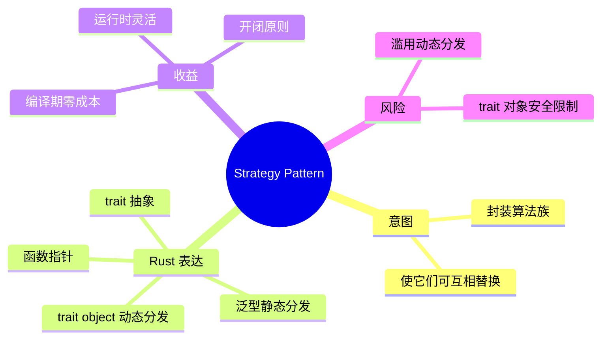
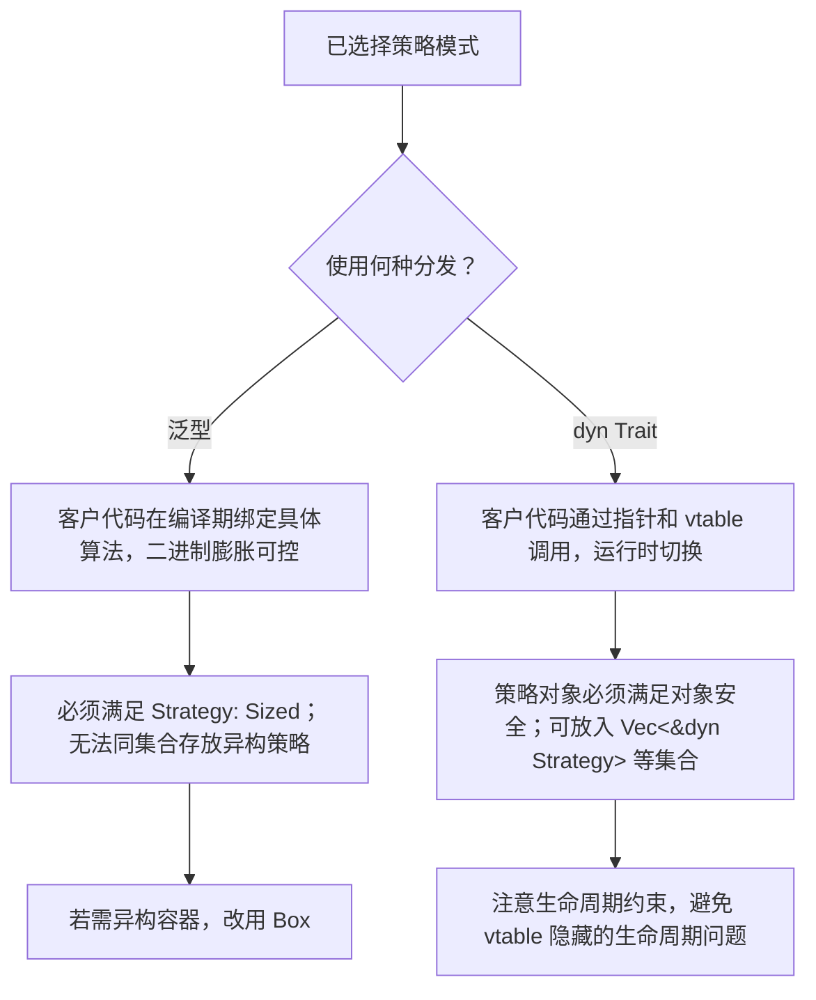

# 策略模式

**EN**: Strategy Pattern
**Summary**: Encapsulate a family of interchangeable algorithms behind a common interface so that callers can vary behavior without changing their own code.

> **Rust 版本**: 1.97.0+ (Edition 2024)
> **Bloom 层级**: L5–L6
> **权威来源**: 本文件为 `concept/` 权威页。
> **前置概念**: [`trait`](../../../02_intermediate/00_traits/01_traits.md)、[`泛型`](../../../02_intermediate/01_generics/01_generics.md)、[`分发机制`](../../../02_intermediate/00_traits/02_dispatch_mechanisms.md)
> **后置概念**: [`02_command.md`](./02_command.md)、[`04_state_machine.md`](./04_state_machine.md)、[`06_decorator.md`](./06_decorator.md)

## 概念导图



## 一、权威定义

策略模式（Strategy Pattern）定义**一系列算法**，把它们一个个**封装起来**，并且使它们可以**相互替换**。该模式让算法的变化独立于使用算法的客户，从而把条件分支转化为多态调用。

在 Rust 中，策略模式通常表现为：

- 一个 `trait` 声明策略契约；
- 多个具体类型实现该 `trait`；
- 客户代码通过**泛型**（静态分发）或 **`dyn Trait`**（动态分发）使用策略。

## 二、核心属性与关系

| 属性 | 说明 |
|------|------|
| **策略接口** | `trait PaymentStrategy` 等统一契约，隐藏具体算法。 |
| **具体策略** | 实现该 trait 的多个结构体/枚举。 |
| **上下文** | 持有策略引用并在运行时调用策略方法的代码。 |
| **分发方式** | 泛型 + `impl Trait` / `dyn Trait` 决定静态或动态分发。 |
| **零成本** | 泛型版本单态化后无运行时开销；`dyn` 有 vtable 间接调用开销。 |

关系：上下文 **uses** 策略接口；具体策略 **implements** 策略接口。Rust 的 trait 系统让策略模式同时具备面向对象的“多态”与系统语言的“零成本抽象”。

## 三、正向推理决策树

```mermaid
flowchart TD
    A[问题：需要在一组可互换的算法中选择一种] --> B{这些算法是否共享同一契约？}
    B -->|是| C{选择时机？}
    B -->|否| D[不是策略模式，考虑其他重构]
    C -->|编译期确定| E[使用泛型静态分发：fn foo<T: Strategy>(s: &T)]
    C -->|运行期确定| F[使用动态分发：&dyn Strategy 或 Box<dyn Strategy>]
    C -->|仅需函数，无状态| G[使用函数指针 fn(...) -> ... 或闭包]
    E --> H[获得零成本抽象]
    F --> I[获得运行时灵活性，付出 vtable 开销]
    G --> J[最轻量，但无法携带自定义状态]
```

## 四、反向推理决策树



## 五、Rust 零成本表达与示例

```rust
fn main() {
    // 不同策略可以混用静态分发与动态分发。
    let cash = Cash;
    let card = CreditCard { fee_rate: 0.02 };
    let crypto = Crypto { discount: 0.05 };

    // 静态分发：编译器会为 checkout::<Cash> 单态化一份代码。
    println!("cash    = {}", checkout(100.0, &cash));

    // 动态分发：运行时通过 vtable 调用。
    println!("card    = {}", checkout_dyn(100.0, &card));
    println!("crypto  = {}", checkout_dyn(100.0, &crypto));
}

// 策略接口
trait PaymentStrategy {
    fn pay(&self, amount: f64) -> f64;
}

// 具体策略 A：现金，无手续费
struct Cash;
impl PaymentStrategy for Cash {
    fn pay(&self, amount: f64) -> f64 {
        amount
    }
}

// 具体策略 B：信用卡，按比例收费
struct CreditCard {
    fee_rate: f64,
}
impl PaymentStrategy for CreditCard {
    fn pay(&self, amount: f64) -> f64 {
        amount * (1.0 + self.fee_rate)
    }
}

// 具体策略 C：加密货币，折扣
struct Crypto {
    discount: f64,
}
impl PaymentStrategy for Crypto {
    fn pay(&self, amount: f64) -> f64 {
        amount * (1.0 - self.discount)
    }
}

// 静态分发版本：零成本抽象
fn checkout<S: PaymentStrategy>(amount: f64, strategy: &S) -> f64 {
    strategy.pay(amount)
}

// 动态分发版本：运行时灵活
fn checkout_dyn(amount: f64, strategy: &dyn PaymentStrategy) -> f64 {
    strategy.pay(amount)
}
```

## 六、反例与常见错误

### 错误 1：把 trait object 当作值类型使用

`dyn Trait` 是动态大小类型（DST），必须以引用或 `Box` 等智能指针持有。

```rust,compile_fail,E0277
trait PaymentStrategy {
    fn pay(&self, amount: f64) -> f64;
}

struct Cash;
impl PaymentStrategy for Cash {
    fn pay(&self, amount: f64) -> f64 {
        amount
    }
}

fn main() {
    // ERROR: `dyn PaymentStrategy` 的大小在编译期未知
    let s: dyn PaymentStrategy = Cash;
    s.pay(10.0);
}
```

**修正**：`let s: &dyn PaymentStrategy = &Cash;` 或 `Box<dyn PaymentStrategy>`。

### 错误 2：trait 方法不满足对象安全

若策略 trait 包含泛型方法或 `self: Self` 消耗自身，则不能构造 `dyn Trait`。

```rust,compile_fail,E0038
trait PaymentStrategy {
    fn pay<T: Into<f64>>(&self, amount: T) -> f64; // 泛型方法破坏对象安全
}

fn use_strategy(_s: &dyn PaymentStrategy) {}
fn main() {}
```

**修正**：把泛型参数改为 `f64` 等具体类型，或保留泛型但使用静态分发。

## 七、国际权威来源

- [Rust Design Patterns - Strategy](https://rust-unofficial.github.io/patterns/patterns/behavioural/strategy.html)
- [Refactoring Guru - Strategy Pattern](https://refactoring.guru/design-patterns/strategy)
- GoF, *Design Patterns: Elements of Reusable Object-Oriented Software*, Strategy pattern.
- The Rust Programming Language, Chapter 10: Generic Types, Traits, and Lifetimes.
