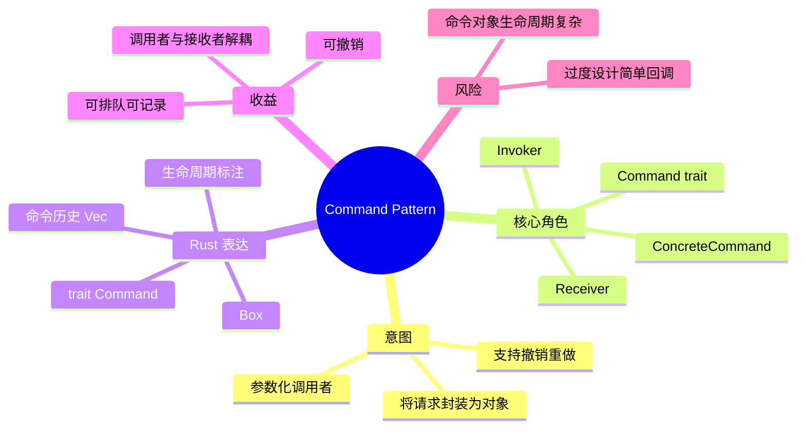
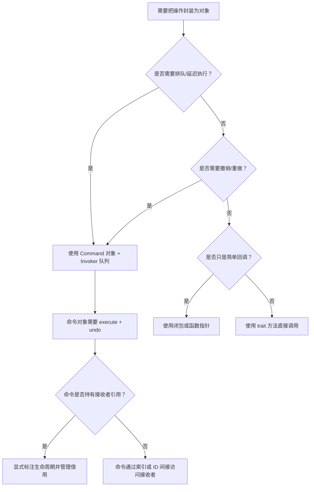
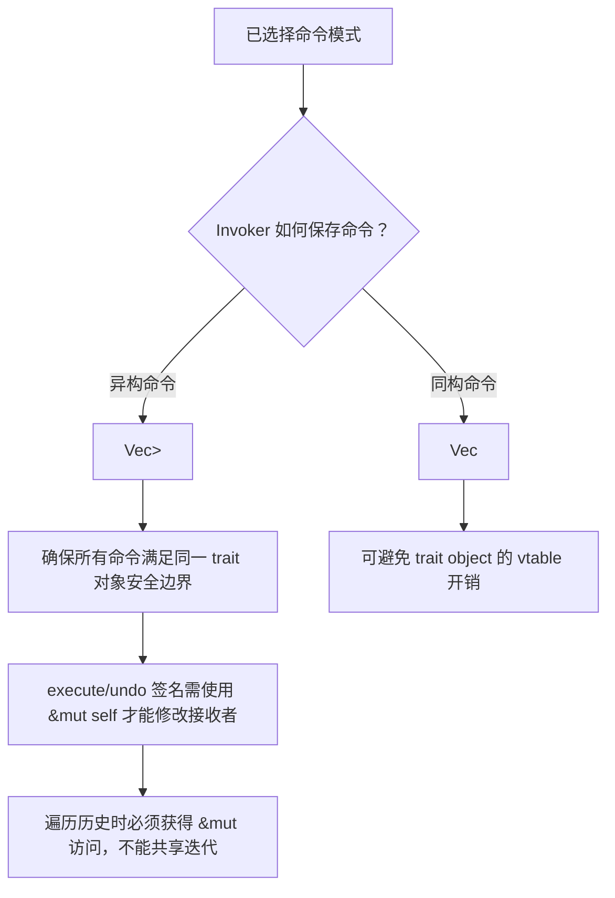

# 命令模式

**EN**: Command Pattern
**Summary**: Encapsulate a request as an object, thereby letting you parameterize clients with different requests, queue or log requests, and support undoable operations.

> **Rust 版本**: 1.97.0+ (Edition 2024)
> **Bloom 层级**: L5–L6
> **权威来源**: 本文件为 `concept/` 权威页。
> **前置概念**: [`trait`](../../../02_intermediate/00_traits/01_traits.md)、[`所有权与借用`](../../../01_foundation/01_ownership_borrow_lifetime/02_borrowing.md)、[`Vec`](../../../01_foundation/05_collections/01_collections.md)
> **后置概念**: [`01_strategy.md`](./01_strategy.md)、[`04_state_machine.md`](./04_state_machine.md)、[`03_visitor.md`](./03_visitor.md)

## 概念导图



## 一、权威定义

命令模式（Command Pattern）将**请求**封装成对象，从而可用不同的请求对客户进行参数化；对请求排队、记录日志，以及支持**可撤销**的操作。它把“调用操作的对象”与“知道如何执行操作的对象”解耦。

在 Rust 中，命令模式通常表现为：

- 一个 `Command` trait，声明 `execute` 与可选的 `undo`；
- 具体命令持有对接收者的引用或索引；
- `Invoker` 维护命令历史，负责触发执行、撤销、重做。

## 二、核心属性与关系

| 属性 | 说明 |
|------|------|
| **Command** | 声明执行与撤销操作的接口。 |
| **ConcreteCommand** | 绑定接收者，调用接收者的实际方法。 |
| **Receiver** | 真正执行业务逻辑的对象。 |
| **Invoker** | 持有并触发命令，维护历史记录。 |
| **生命周期** | 命令常借用接收者，需要显式标注 `'a`。 |

关系：Invoker **uses** Command；ConcreteCommand **has-a** Receiver 并 **implements** Command。Rust 的所有权模型要求：若命令需要撤销，必须保证命令对象在撤销时仍然合法地访问接收者。

## 三、正向推理决策树



## 四、反向推理决策树



## 五、Rust 零成本表达与示例

```rust
fn main() {
    let mut light = Light::new();
    let mut invoker = Invoker::new();

    invoker.run(Box::new(TurnOn(&mut light)));
    assert!(light.is_on());

    invoker.run(Box::new(TurnOff(&mut light)));
    assert!(!light.is_on());

    invoker.undo_all();
    assert!(light.is_on()); // 先撤销 TurnOff，再撤销 TurnOn

    println!("command pattern ok");
}

// 命令接口
trait Command {
    fn execute(&mut self);
    fn undo(&mut self);
}

// 接收者
struct Light(bool);
impl Light {
    fn new() -> Self { Self(false) }
    fn turn_on(&mut self) { self.0 = true; }
    fn turn_off(&mut self) { self.0 = false; }
    fn is_on(&self) -> bool { self.0 }
}

// 具体命令：开灯
struct TurnOn<'a>(&'a mut Light);
impl<'a> Command for TurnOn<'a> {
    fn execute(&mut self) { self.0.turn_on(); }
    fn undo(&mut self) { self.0.turn_off(); }
}

// 具体命令：关灯
struct TurnOff<'a>(&'a mut Light);
impl<'a> Command for TurnOff<'a> {
    fn execute(&mut self) { self.0.turn_off(); }
    fn undo(&mut self) { self.0.turn_on(); }
}

// 调用者：维护命令历史
struct Invoker<'a> {
    history: Vec<Box<dyn Command + 'a>>,
}

impl<'a> Invoker<'a> {
    fn new() -> Self {
        Self { history: Vec::new() }
    }

    fn run(&mut self, mut cmd: Box<dyn Command + 'a>) {
        cmd.execute();
        self.history.push(cmd);
    }

    fn undo_all(&mut self) {
        while let Some(mut cmd) = self.history.pop() {
            cmd.undo();
        }
    }
}
```

## 六、反例与常见错误

### 错误 1：用不可变引用遍历并执行需要 `&mut self` 的命令

命令的 `execute` 需要修改接收者，因此遍历时必须持有 `&mut`。

```rust,compile_fail,E0596
trait Command {
    fn execute(&mut self);
}

struct Dummy;
impl Command for Dummy {
    fn execute(&mut self) {}
}

fn replay(history: &Vec<Box<dyn Command>>) {
    // ERROR: `cmd` 是 `&Box<dyn Command>`，无法借出 &mut
    for cmd in history {
        cmd.execute();
    }
}

fn main() {}
```

**修正**：使用 `for cmd in &mut history { cmd.execute(); }` 或 `history.iter_mut().for_each(...)`。

### 错误 2：命令借用接收者，却把接收者与命令同时可变借用

```rust,compile_fail,E0499
struct Light(bool);
struct TurnOn<'a>(&'a mut Light);

fn main() {
    let mut light = Light(false);
    let cmd = TurnOn(&mut light);
    light.0 = true; // ERROR: 已经借出 &mut light 给 cmd
    let _ = cmd;
}
```

**修正**：在命令执行期间不要再直接修改接收者；或让命令拥有接收者/使用内部可变性。

## 七、国际权威来源

- [Rust Design Patterns - Command](https://rust-unofficial.github.io/patterns/patterns/behavioural/command.html)
- [Refactoring Guru - Command Pattern](https://refactoring.guru/design-patterns/command)
- GoF, *Design Patterns: Elements of Reusable Object-Oriented Software*, Command pattern.
- The Rust Programming Language, Chapter 8: Common Collections.
