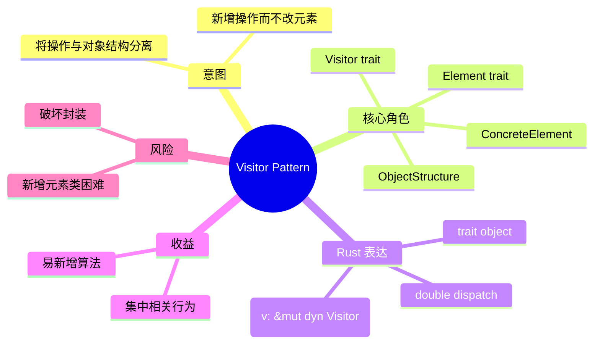
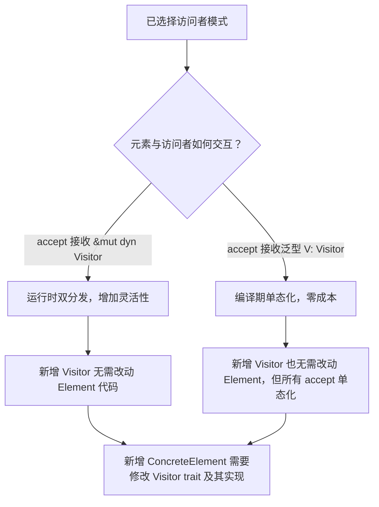

# 访问者模式

**EN**: Visitor Pattern
**Summary**: Represent an operation to be performed on the elements of an object structure, letting you define a new operation without changing the classes of the elements on which it operates.

> **Rust 版本**: 1.97.0+ (Edition 2024)
> **Bloom 层级**: L5–L6
> **权威来源**: 本文件为 `concept/` 权威页。
> **前置概念**: [`trait`](../../../02_intermediate/00_traits/01_traits.md)、[`trait object`](../../../03_advanced/06_low_level_patterns/03_type_erasure.md)、[`分发机制`](../../../02_intermediate/00_traits/02_dispatch_mechanisms.md)
> **后置概念**: [`02_command.md`](./02_command.md)、[`04_state_machine.md`](./04_state_machine.md)、[`05_adapter.md`](./05_adapter.md)

## 概念导图



## 一、权威定义

访问者模式（Visitor Pattern）表示一个作用于某对象结构中各元素的操作，它使你可以在不改变各元素类的前提下定义作用于这些元素的新操作。其核心是**双分发**（double dispatch）：元素调用访问者，访问者再回调到元素的具体类型。

在 Rust 中，访问者模式通常表现为：

- `Visitor` trait：为每个具体元素定义一个 `visit_*` 方法；
- `Element` trait：声明 `accept(&self, visitor: &mut dyn Visitor)`；
- 具体元素在 `accept` 中调用访问者对应的方法。

## 二、核心属性与关系

| 属性 | 说明 |
|------|------|
| **Visitor** | 定义对每一种具体元素的访问操作。 |
| **Element** | 定义 `accept`，接收访问者。 |
| **双分发** | 运行时的实际调用目标由“元素类型 + 访问者类型”共同决定。 |
| **trait object** | `&mut dyn Visitor` 让异构元素共享同一访问者接口。 |
| **开闭方向** | 对“新增操作”开放，对“新增元素类型”封闭。 |

关系：ObjectStructure **contains** Elements；Elements **accept** Visitor；Visitor **visits** ConcreteElements。Rust 的 trait object 让访问者类型可以在运行时替换，而无需修改元素结构。

## 三、正向推理决策树

```mermaid
flowchart TD
    A[需要对一组稳定类型执行多种不同操作] --> B{元素类层次是否稳定？}
    B -->|是| C{操作数量是否远多于元素类型？}
    B -->|否| D[访问者会频繁因新增类型而破坏，考虑 enum 或 match]
    C -->|是| E[使用 Visitor：Element trait + Visitor trait]
    C -->|否| F[直接在元素上添加方法更简单]
    E --> G{是否需要运行时切换访问者？}
    G -->|是| H[使用 &mut dyn Visitor]
    G -->|否| I[使用泛型 Visitor: accept<V: Visitor>(&self, v: &mut V)]
```

## 四、反向推理决策树



## 五、Rust 零成本表达与示例

```rust
fn main() {
    let shapes: Vec<Box<dyn Shape>> = vec![
        Box::new(Circle { radius: 1.0 }),
        Box::new(Square { side: 2.0 }),
    ];

    let mut area = AreaVisitor::new();
    for s in &shapes {
        s.accept(&mut area);
    }
    println!("total area = {:.2}", area.total());

    let mut print = PrintVisitor;
    for s in &shapes {
        s.accept(&mut print);
    }
}

// 访问者接口
trait Visitor {
    fn visit_circle(&mut self, c: &Circle);
    fn visit_square(&mut self, s: &Square);
}

// 元素接口
trait Shape {
    fn accept(&self, visitor: &mut dyn Visitor);
}

// 具体元素
struct Circle { radius: f64 }
struct Square { side: f64 }

impl Shape for Circle {
    fn accept(&self, visitor: &mut dyn Visitor) {
        visitor.visit_circle(self);
    }
}

impl Shape for Square {
    fn accept(&self, visitor: &mut dyn Visitor) {
        visitor.visit_square(self);
    }
}

// 具体访问者：计算面积
struct AreaVisitor { total: f64 }
impl AreaVisitor {
    fn new() -> Self { Self { total: 0.0 } }
    fn total(&self) -> f64 { self.total }
}
impl Visitor for AreaVisitor {
    fn visit_circle(&mut self, c: &Circle) {
        self.total += std::f64::consts::PI * c.radius * c.radius;
    }
    fn visit_square(&mut self, s: &Square) {
        self.total += s.side * s.side;
    }
}

// 具体访问者：打印信息
struct PrintVisitor;
impl Visitor for PrintVisitor {
    fn visit_circle(&mut self, c: &Circle) {
        println!("circle r={}", c.radius);
    }
    fn visit_square(&mut self, s: &Square) {
        println!("square side={}", s.side);
    }
}
```

## 六、反例与常见错误

### 错误 1：新增元素类型但 Visitor trait 未扩展

访问者模式对新增元素类型不友好：若 `Visitor` 没有对应 `visit_*` 方法，调用处会直接编译失败。

```rust,compile_fail,E0599
trait Visitor {
    fn visit_circle(&mut self, c: &Circle);
}
struct Circle;
struct Triangle;

fn visit_triangle(t: &Triangle, v: &mut dyn Visitor) {
    // ERROR: `Visitor` trait 中没有 `visit_triangle` 方法
    v.visit_triangle(t);
}

fn main() {}
```

**修正**：扩展 `Visitor` trait 并在所有实现中补全新方法，或改用 `enum` + `match` 以更方便地新增变体。

### 错误 2：忘记实现 Visitor 的全部方法

```rust,compile_fail,E0046
trait Visitor {
    fn visit_circle(&mut self, c: &Circle);
    fn visit_square(&mut self, s: &Square);
}
struct Circle;
struct Square;
struct MyVisitor;

impl Visitor for MyVisitor {}

fn main() {}
```

**修正**：为 `MyVisitor` 实现所有 `visit_*` 方法，或使用默认方法体。

## 七、国际权威来源

- [Rust Design Patterns - Visitor](https://rust-unofficial.github.io/patterns/patterns/behavioural/visitor.html)
- [Refactoring Guru - Visitor Pattern](https://refactoring.guru/design-patterns/visitor)
- GoF, *Design Patterns: Elements of Reusable Object-Oriented Software*, Visitor pattern.
- The Rust Programming Language, Chapter 17: Object-Oriented Programming Features of Rust.

## 形式化基础

本页的工程模式可追溯到以下 L4 形式化/理论权威页：

- [形式化设计模式理论](../../../04_formal/00_type_theory/11_formal_design_pattern_theory.md)
- [模式组合代数](../../../04_formal/00_type_theory/12_pattern_composition_algebra.md)
- [类型系统进阶](../../../04_formal/00_type_theory/01_type_theory.md)
