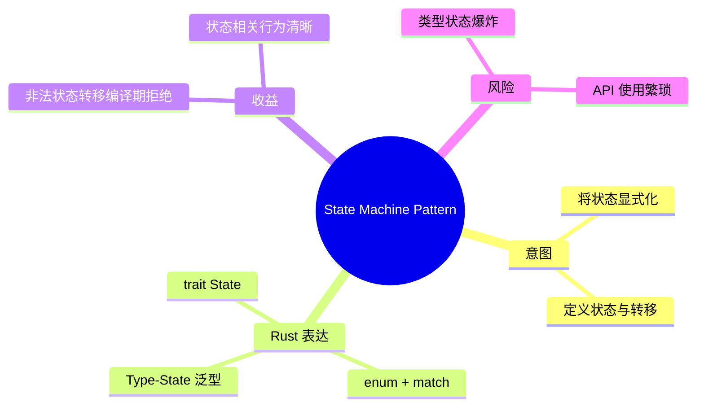
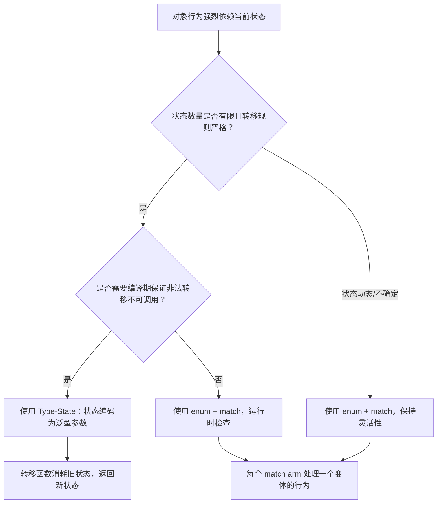
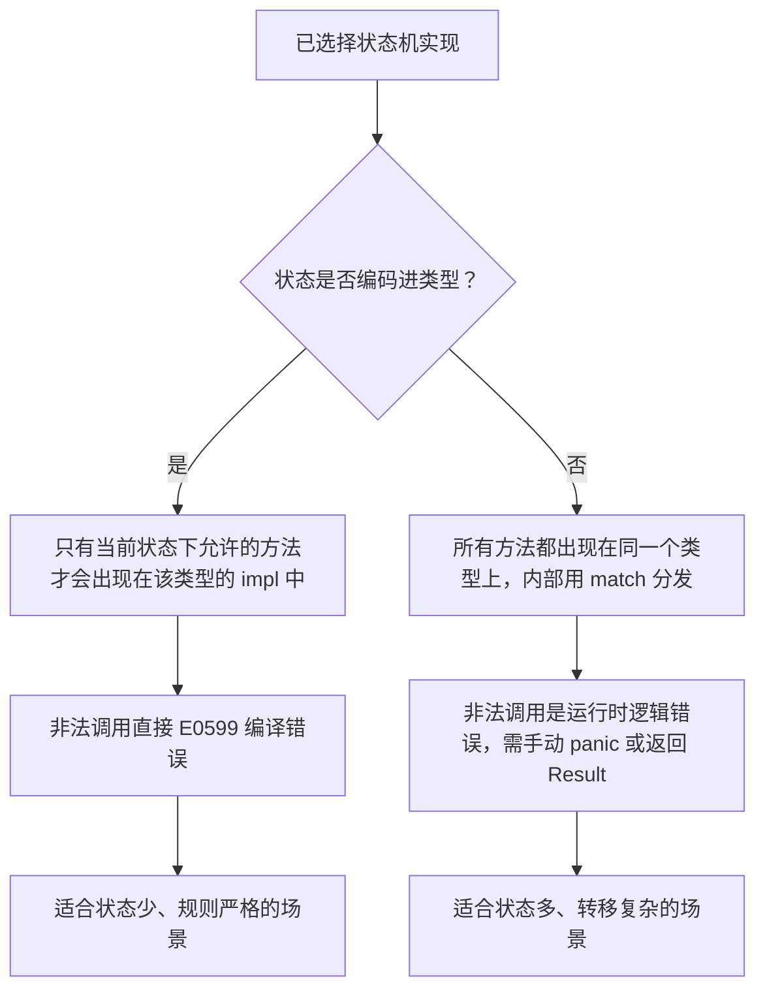

# 状态机模式

**EN**: State Machine Pattern
**Summary**: Model an object whose behavior changes depending on its internal state, making states explicit and transitions well-defined.

> **Rust 版本**: 1.97.0+ (Edition 2024)
> **Bloom 层级**: L5–L6
> **权威来源**: 本文件为 `concept/` 权威页。
> **前置概念**: [`枚举`](../../../01_foundation/07_modules_and_items/05_enumerations.md)、[`泛型`](../../../02_intermediate/01_generics/01_generics.md)、[`类型系统`](../../../01_foundation/02_type_system/01_type_system.md)
> **后置概念**: [`01_strategy.md`](./01_strategy.md)、[`02_command.md`](./02_command.md)、[`03_visitor.md`](./03_visitor.md)

## 概念导图



## 一、权威定义

状态机模式（State Machine Pattern）用于建模**行为随内部状态改变而改变**的对象。它把状态提升为显式概念，并定义状态之间的合法转移，从而避免用一堆布尔标志或条件分支来描述复杂行为。

在 Rust 中，状态机通常有两种实现方式：

- **类型状态（Type-State）**：把状态编码到类型参数中，转移通过消耗旧状态、返回新状态的函数实现；非法转移在编译期被拒绝。
- **枚举状态**：用 `enum` 表示状态，配合 `match` 处理不同分支；更灵活，但运行时需要检查分支。

## 二、核心属性与关系

| 属性 | 说明 |
|------|------|
| **状态（State）** | 对象某一时刻的条件，决定可执行的行为。 |
| **转移（Transition）** | 在事件触发下从一个状态到另一个状态的合法变换。 |
| **Type-State** | 利用泛型把当前状态编码进类型，转移即类型变换。 |
| **Enum State** | 用枚举变体表示状态，运行时使用 `match` 分发。 |
| **零成本** | Type-State 在编译期消除无效状态，无运行时检查开销。 |

关系：Context **has-a** State；Events **trigger** Transitions；Type-State 使转移关系由函数签名静态保证。

## 三、正向推理决策树



## 四、反向推理决策树



## 五、Rust 零成本表达与示例

```rust
fn main() {
    // Type-State：只有 Locked 能投币，只有 Unlocked 能通过。
    let turnstile = Turnstile::<Locked>::new();
    let turnstile = turnstile.insert_coin(); // 转移到 Unlocked
    let turnstile = turnstile.push();        // 转移到 Locked
    println!("turnstile is {}", turnstile.state_name());
}

// 状态标签类型
struct Locked;
struct Unlocked;

// 上下文：状态被编码到泛型参数 S
struct Turnstile<S> {
    _state: std::marker::PhantomData<S>,
}

impl Turnstile<Locked> {
    fn new() -> Self {
        Self { _state: std::marker::PhantomData }
    }

    fn state_name(&self) -> &'static str {
        "locked"
    }

    // 投币后进入 Unlocked 状态
    fn insert_coin(self) -> Turnstile<Unlocked> {
        Turnstile { _state: std::marker::PhantomData }
    }
}

impl Turnstile<Unlocked> {
    fn state_name(&self) -> &'static str {
        "unlocked"
    }

    // 推开后回到 Locked 状态
    fn push(self) -> Turnstile<Locked> {
        Turnstile { _state: std::marker::PhantomData }
    }

    fn pass(&self) -> &'static str {
        "passing through"
    }
}
```

## 六、反例与常见错误

### 错误 1：在 Type-State 中调用不属于当前状态的方法

Type-State 的代价是：状态错配的方法在编译期就无法调用。

```rust,compile_fail,E0599
struct Locked;
struct Unlocked;

struct Turnstile<S> {
    _state: std::marker::PhantomData<S>,
}

impl Turnstile<Locked> {
    fn new() -> Self { Self { _state: std::marker::PhantomData } }
}

impl Turnstile<Unlocked> {
    fn pass(&self) -> &'static str { "passing" }
}

fn main() {
    let t = Turnstile::<Locked>::new();
    // ERROR: `Turnstile<Locked>` 没有 `pass` 方法
    println!("{}", t.pass());
}
```

**修正**：先通过合法转移把对象转换到拥有该方法的状态，例如 `let t = t.insert_coin(); t.pass();`。

### 错误 2：枚举状态未穷尽匹配

```rust,compile_fail,E0004
enum TurnstileState {
    Locked,
    Unlocked,
}

fn handle(state: TurnstileState) -> &'static str {
    match state {
        TurnstileState::Locked => "locked",
    }
}

fn main() {}
```

**修正**：补全 `TurnstileState::Unlocked` 分支，或写 `_ => ...` 通配分支（会牺牲穷尽性检查的好处）。

## 七、国际权威来源

- [Rust Design Patterns - Typestate](https://rust-unofficial.github.io/patterns/patterns/behavioural/typestate.html)
- [Refactoring Guru - State Pattern](https://refactoring.guru/design-patterns/state)
- GoF, *Design Patterns: Elements of Reusable Object-Oriented Software*, State pattern.
- The Rust Programming Language, Chapter 6: Enums and Pattern Matching.

- [Refactoring Guru — Design Patterns in Rust](https://refactoring.guru/design-patterns/rust)
- [design-patterns-rust (fadeevab)](https://github.com/fadeevab/design-patterns-rust)
## 形式化基础

本页的工程模式可追溯到以下 L4 形式化/理论权威页：

- [形式化设计模式理论](../../../04_formal/00_type_theory/11_formal_design_pattern_theory.md)
- [模式组合代数](../../../04_formal/00_type_theory/12_pattern_composition_algebra.md)
- [类型系统进阶](../../../04_formal/00_type_theory/01_type_theory.md)

## 来源与延伸阅读

> 以下链接按 P0（官方/语言级）、P1（学术/形式化）与 P2（社区/生态）分级，用于补全本页的国际化权威来源覆盖。

- **P0**: [The Rust Programming Language — Enums and Pattern Matching](https://doc.rust-lang.org/book/ch06-00-enums.html)
- **P0**: [The Rust Reference — Enumerations](https://doc.rust-lang.org/reference/items/enumerations.html)
- **P0**: [The Rust Reference — Traits](https://doc.rust-lang.org/reference/items/traits.html)
- **P0**: [The Rust API Guidelines — C-TRAITS (traits for flexible, composable APIs)](https://rust-lang.github.io/api-guidelines/flexibility.html#c-traits)
- **P1**: DeLine, R., Fähndrich, M. *Typestates for Objects*. In ECOOP 2004, Springer, 2004. [Springer](https://link.springer.com/chapter/10.1007/978-3-540-24851-4_21)
- **P1**: Strom, R. E., Yemini, S. *Typestate: A Programming Language Concept for Enhancing Software Reliability*. IEEE Transactions on Software Engineering, 1986. [IEEE Xplore](https://ieeexplore.ieee.org/document/6312929)
- **P2**: [Rust Design Patterns - Generics as Type Classes (Type State discussion)](https://rust-unofficial.github.io/patterns/functional/generics-type-classes.html)
- **P2**: [Refactoring Guru - State Pattern](https://refactoring.guru/design-patterns/state)
