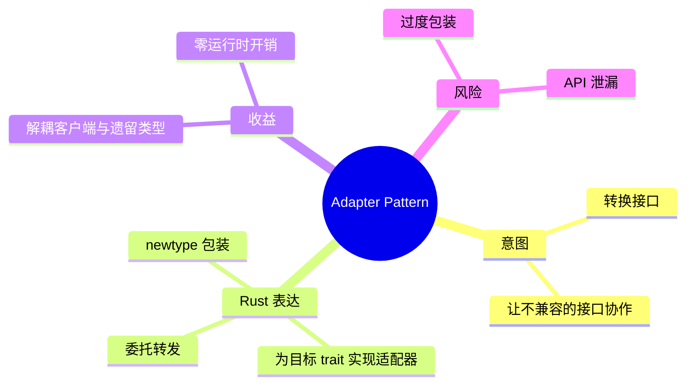
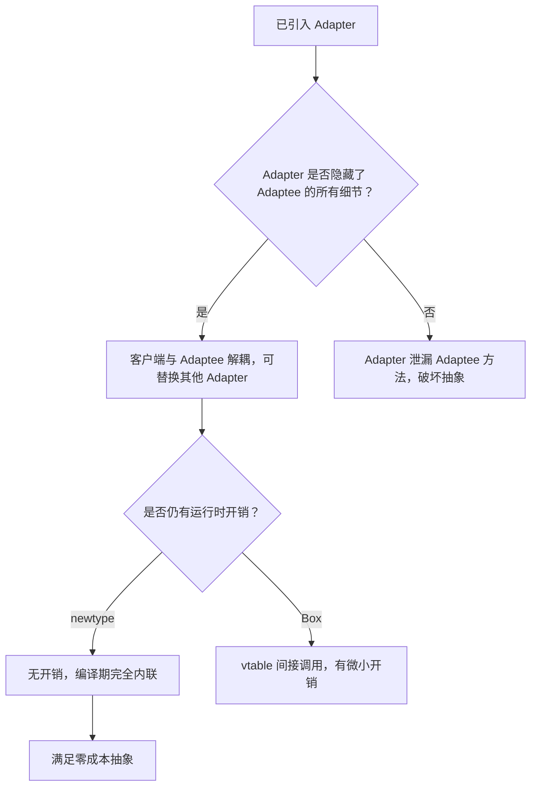

# 适配器模式

**EN**: Adapter Pattern
**Summary**: Convert the interface of a class into another interface clients expect, allowing otherwise incompatible interfaces to work together.

> **Rust 版本**: 1.97.0+ (Edition 2024)
> **Bloom 层级**: L5–L6
> **权威来源**: 本文件为 `concept/` 权威页。
> **前置概念**: [`trait`](../../../02_intermediate/00_traits/01_traits.md)、[`newtype 模式`](../../../01_foundation/02_type_system/05_data_abstraction_spectrum.md)、[`孤儿规则`](../../../02_intermediate/00_traits/04_advanced_traits.md)
> **后置概念**: [`01_strategy.md`](./01_strategy.md)、[`06_decorator.md`](./06_decorator.md)、[`03_visitor.md`](./03_visitor.md)

## 概念导图



## 一、权威定义

适配器模式（Adapter Pattern）将一个类的接口转换成客户希望的另外一个接口。适配器让原本由于接口不兼容而不能一起工作的那些类可以一起工作。它通过引入一个**包装器**来隔离目标接口与待适配实现。

在 Rust 中，适配器模式几乎总是通过 **newtype 模式**实现：

- 定义一个元组结构体包装待适配类型；
- 为包装器实现客户端期望的 trait；
- 方法内部委托给被包装对象的方法。

newtype 在 Rust 中不仅是类型别名，它是一个全新的类型，因此可以绕过**孤儿规则**（orphan rules），为外部类型实现外部 trait。

## 二、核心属性与关系

| 属性 | 说明 |
|------|------|
| **Target** | 客户端期望的接口（trait）。 |
| **Adaptee** | 已存在但接口不兼容的类型。 |
| **Adapter** | 包装 Adaptee 并实现 Target 的 newtype。 |
| **委托** | Adapter 方法把调用转发给 Adaptee。 |
| **零成本** | newtype 在编译期完全擦除，无运行时包装开销。 |

关系：Client **uses** Target；Adapter **implements** Target；Adapter **wraps** Adaptee。Rust 的 trait 系统 + newtype 让适配器不需要运行时反射或继承。

## 三、正向推理决策树

```mermaid
flowchart TD
    A[需要使用某个已有类型，但其接口与当前代码不匹配] --> B{能否修改该类型的源码？}
    B -->|能| C[直接修改源码或增加方法]
    B -->|不能| D{该类型与目标 trait 是否都在当前 crate 外？}
    D -->|是| E[使用 newtype Adapter：struct Adapter(Adaptee)]
    D -->|否| F[可直接 impl Target for Adaptee]
    E --> G[为 Adapter impl Target，方法委托给 Adaptee]
    G --> H[客户端只依赖 Target，不依赖 Adaptee]
```

## 四、反向推理决策树



## 五、Rust 零成本表达与示例

```rust
fn main() {
    // 旧系统中有一个 LegacyRectangle，但客户端只接受 Area trait。
    let legacy = LegacyRectangle { width: 10, height: 20 };

    // 使用 newtype 适配器，无需修改 LegacyRectangle。
    let adapter = RectAdapter(legacy);
    report_area(&adapter);
}

// 客户端期望的目标接口
trait Area {
    fn area(&self) -> u32;
}

// 需要适配的遗留类型（假设来自外部 crate，无法修改）
struct LegacyRectangle {
    width: u32,
    height: u32,
}

impl LegacyRectangle {
    fn width(&self) -> u32 { self.width }
    fn height(&self) -> u32 { self.height }
}

// 适配器：newtype 包装
struct RectAdapter(LegacyRectangle);

impl Area for RectAdapter {
    fn area(&self) -> u32 {
        self.0.width() * self.0.height()
    }
}

fn report_area<T: Area>(shape: &T) {
    println!("area = {}", shape.area());
}
```

## 六、反例与常见错误

### 错误 1：试图为外部类型实现外部 trait，违反孤儿规则

Rust 禁止在第三方 crate 之外为“两个外部项”实现 impl，否则会导致冲突。

```rust,compile_fail,E0117
// 错误：Vec<u8> 和 std::fmt::Display 都不是当前 crate 定义的类型/ trait
impl std::fmt::Display for Vec<u8> {
    fn fmt(&self, f: &mut std::fmt::Formatter<'_>) -> std::fmt::Result {
        write!(f, "custom vec")
    }
}

fn main() {}
```

**修正**：用 newtype 包装外部类型：`struct ByteVec(Vec<u8>); impl std::fmt::Display for ByteVec { ... }`。

### 错误 2：适配器未实现目标 trait 的所有方法

```rust,compile_fail,E0046
trait Area {
    fn area(&self) -> u32;
    fn perimeter(&self) -> u32;
}

struct RectAdapter {
    width: u32,
    height: u32,
}

impl Area for RectAdapter {
    fn area(&self) -> u32 {
        self.width * self.height
    }
    // 漏掉了 perimeter
}

fn main() {}
```

**修正**：补全 `perimeter` 方法，或为 trait 提供默认实现。

## 七、国际权威来源

- [Rust Design Patterns - Newtype](https://rust-unofficial.github.io/patterns/patterns/behavioural/newtype.html)
- [Refactoring Guru - Adapter Pattern](https://refactoring.guru/design-patterns/adapter)
- GoF, *Design Patterns: Elements of Reusable Object-Oriented Software*, Adapter pattern.
- The Rust Programming Language, Chapter 19: Advanced Features — Newtype Pattern.

## 形式化基础

本页的工程模式可追溯到以下 L4 形式化/理论权威页：

- [形式化设计模式理论](../../../04_formal/00_type_theory/11_formal_design_pattern_theory.md)
- [模式组合代数](../../../04_formal/00_type_theory/12_pattern_composition_algebra.md)
- [类型系统进阶](../../../04_formal/00_type_theory/01_type_theory.md)

## 来源与延伸阅读

> 以下链接按 P0（官方/语言级）、P1（学术/形式化）与 P2（社区/生态）分级，用于补全本页的国际化权威来源覆盖。

- **P0**: [The Rust Programming Language — Advanced Traits](https://doc.rust-lang.org/book/ch19-03-advanced-traits.html)
- **P0**: [The Rust Reference — Implementations](https://doc.rust-lang.org/reference/items/implementations.html)
- **P0**: [The Rust Reference — Traits](https://doc.rust-lang.org/reference/items/traits.html)
- **P0**: [The Rust API Guidelines — C-TRAITS (traits for flexible, composable APIs)](https://rust-lang.github.io/api-guidelines/flexibility.html#c-traits)
- **P1**: Gamma, E., Helm, R., Johnson, R., Vlissides, J. *Design Patterns: Abstraction and Reuse of Object-Oriented Design*. In *Software Pioneers*, Springer, 2002. [PDF](https://link.springer.com/content/pdf/10.1007/978-3-642-59412-0_40.pdf)
- **P2**: [Rust Design Patterns - Newtype](https://rust-unofficial.github.io/patterns/patterns/behavioural/newtype.html)
- **P2**: [Refactoring Guru - Adapter Pattern](https://refactoring.guru/design-patterns/adapter)
