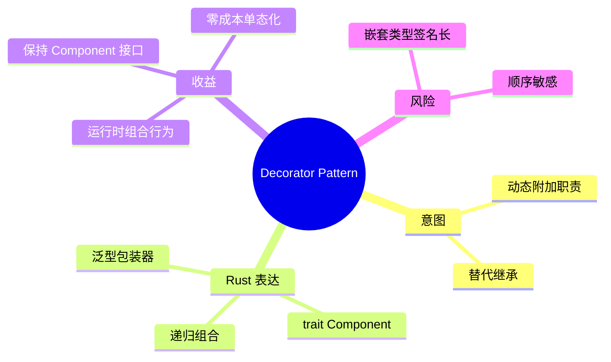
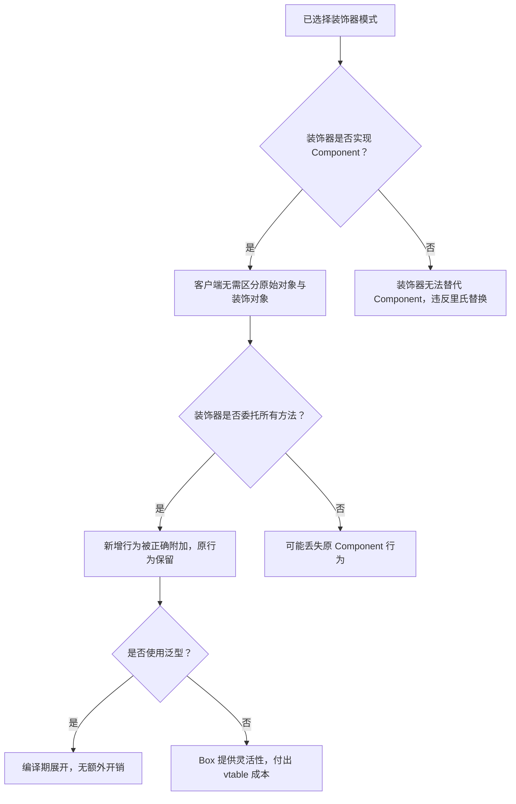

# 装饰器模式

**EN**: Decorator Pattern
**Summary**: Attach additional responsibilities to an object dynamically, providing a flexible alternative to subclassing for extending functionality.

> **Rust 版本**: 1.97.0+ (Edition 2024)
> **Bloom 层级**: L5–L6
> **权威来源**: 本文件为 `concept/` 权威页。
> **前置概念**: [`trait`](../../../02_intermediate/00_traits/01_traits.md)、[`泛型`](../../../02_intermediate/01_generics/01_generics.md)、[`newtype 模式`](../../../01_foundation/02_type_system/05_data_abstraction_spectrum.md)
> **后置概念**: [`01_strategy.md`](./01_strategy.md)、[`05_adapter.md`](./05_adapter.md)、[`04_state_machine.md`](./04_state_machine.md)

## 概念导图



## 一、权威定义

装饰器模式（Decorator Pattern）**动态地**给一个对象添加一些额外的职责。就增加功能来说，装饰器模式相比生成子类更为灵活。它通过组合而非继承，把行为层层包装在原始对象之外，同时保持对外接口不变。

在 Rust 中，装饰器模式通常表现为：

- 一个 `Component` trait 定义公共接口；
- 一个或多个具体组件实现该 trait；
- 装饰器也是 `Component` 的实现，内部持有另一个 `Component` 并在调用前后添加行为。

由于 Rust 没有继承，泛型 newtype 是装饰器的天然实现方式，并且编译器会单态化每个组合，达到零成本。

## 二、核心属性与关系

| 属性 | 说明 |
|------|------|
| **Component** | 被装饰对象与装饰器共同实现的接口。 |
| **ConcreteComponent** | 原始对象。 |
| **Decorator** | 持有 Component 并在其前后附加行为的对象。 |
| **组合** | 装饰器可以嵌套：`Sugar(Milk(SimpleCoffee))`。 |
| **零成本** | 泛型装饰器编译期展开，无运行时间接。 |

关系：Decorator **is-a** Component；Decorator **has-a** Component。Rust 通过泛型 `Decorator<C: Component>` 实现组合，而不是继承。

## 三、正向推理决策树

```mermaid
flowchart TD
    A[需要为对象动态增加职责] --> B{是否可以通过继承子类实现？}
    B -->|能，但组合更灵活| C[使用 Decorator]
    B -->|否| C
    C --> D{装饰器是否只在运行时确定？}
    D -->|否| E[使用泛型装饰器：struct Milk<C: Coffee>(C)]
    D -->|是| F[使用 Box<dyn Coffee> 包装，运行期组合]
    E --> G[零成本，但类型签名包含完整嵌套]
    F --> H[有 vtable 开销，但类型签名统一]
```

## 四、反向推理决策树



## 五、Rust 零成本表达与示例

```rust
fn main() {
    // 通过泛型嵌套组合行为，类型系统精确描述结构。
    let coffee = Sugar(Milk(SimpleCoffee));
    println!("{} costs ${:.2}", coffee.description(), coffee.cost());

    // 也可以只用一种装饰。
    let coffee2 = Milk(SimpleCoffee);
    println!("{} costs ${:.2}", coffee2.description(), coffee2.cost());
}

// Component 接口
trait Coffee {
    fn cost(&self) -> f64;
    fn description(&self) -> String;
}

// 具体组件
struct SimpleCoffee;
impl Coffee for SimpleCoffee {
    fn cost(&self) -> f64 { 2.0 }
    fn description(&self) -> String { "simple coffee".to_string() }
}

// 装饰器：加牛奶
struct Milk<C: Coffee>(C);
impl<C: Coffee> Coffee for Milk<C> {
    fn cost(&self) -> f64 { self.0.cost() + 0.5 }
    fn description(&self) -> String {
        format!("{} + milk", self.0.description())
    }
}

// 装饰器：加糖
struct Sugar<C: Coffee>(C);
impl<C: Coffee> Coffee for Sugar<C> {
    fn cost(&self) -> f64 { self.0.cost() + 0.2 }
    fn description(&self) -> String {
        format!("{} + sugar", self.0.description())
    }
}
```

## 六、反例与常见错误

### 错误 1：装饰器未实现 Component 的全部方法

装饰器必须保持与原组件相同的接口，否则无法透明替换。

```rust,compile_fail,E0046
trait Coffee {
    fn cost(&self) -> f64;
    fn description(&self) -> String;
}

struct SimpleCoffee;
impl Coffee for SimpleCoffee {
    fn cost(&self) -> f64 { 2.0 }
    fn description(&self) -> String { "coffee".to_string() }
}

struct Milk<C: Coffee>(C);
impl<C: Coffee> Coffee for Milk<C> {
    fn cost(&self) -> f64 { self.0.cost() + 0.5 }
    // ERROR: 缺少 description 方法
}

fn main() {}
```

**修正**：补全 `description` 方法并委托给 `self.0`。

### 错误 2：忘记委托，导致装饰器丢失原行为

```rust
// 逻辑错误示例（不会编译失败，但行为错误）
trait Coffee { fn cost(&self) -> f64; }
struct SimpleCoffee;
impl Coffee for SimpleCoffee { fn cost(&self) -> f64 { 2.0 } }
struct Milk<C: Coffee>(C);
impl<C: Coffee> Coffee for Milk<C> {
    fn cost(&self) -> f64 { 0.5 } // 漏了 self.0.cost()
}
fn main() {
    let c = Milk(SimpleCoffee);
    assert_eq!(c.cost(), 2.5); // 实际为 0.5，断言失败
}
```

**修正**：每个装饰器方法都应调用 `self.0.method()` 并在此基础上扩展。

## 七、国际权威来源

- [Rust Design Patterns - Decorator](https://rust-unofficial.github.io/patterns/patterns/structural/decorator.html)
- [Refactoring Guru - Decorator Pattern](https://refactoring.guru/design-patterns/decorator)
- GoF, *Design Patterns: Elements of Reusable Object-Oriented Software*, Decorator pattern.
- The Rust Programming Language, Chapter 10: Generic Types, Traits, and Lifetimes.

## 形式化基础

本页的工程模式可追溯到以下 L4 形式化/理论权威页：

- [形式化设计模式理论](../../../04_formal/00_type_theory/11_formal_design_pattern_theory.md)
- [模式组合代数](../../../04_formal/00_type_theory/12_pattern_composition_algebra.md)
- [类型系统进阶](../../../04_formal/00_type_theory/01_type_theory.md)

## 来源与延伸阅读

> 以下链接按 P1（学术/形式化）与 P2（社区/生态）分级，用于补全本页的国际化权威来源覆盖。

- **P1**: Gamma, E., Helm, R., Johnson, R., Vlissides, J. *Design Patterns: Abstraction and Reuse of Object-Oriented Design*. In *Software Pioneers*, Springer, 2002. [PDF](https://link.springer.com/content/pdf/10.1007/978-3-642-59412-0_40.pdf)
- **P2**: [Rust Design Patterns - Compose Structs](https://rust-unofficial.github.io/patterns/patterns/structural/compose-structs.html)
- **P2**: [Refactoring Guru - Decorator Pattern](https://refactoring.guru/design-patterns/decorator)
