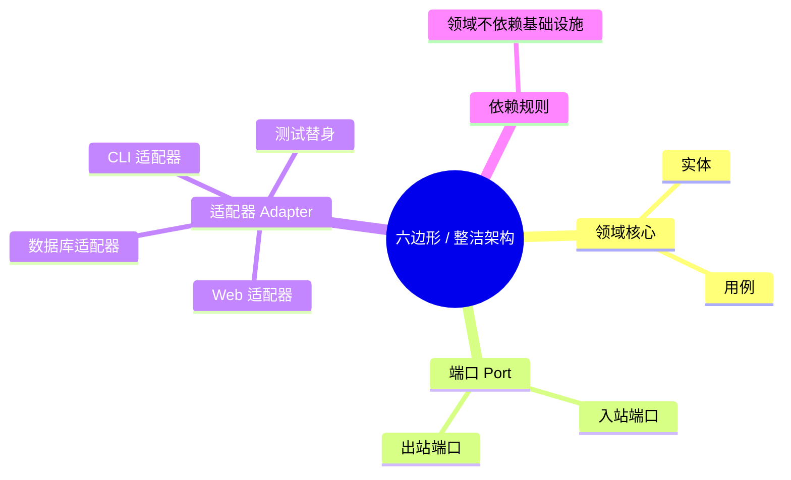

# 六边形架构与整洁架构

**EN**: Hexagonal and Clean Architecture
**Summary**: A design that isolates domain logic from infrastructure through explicit ports and adapters, enabling testability and technology substitution.

> **Rust 版本**: 1.97.0+ (Edition 2024)
> **Bloom 层级**: L5-L6
> **权威来源**: 本文件为 `concept/` 权威页。
> **前置概念**: [策略模式](../03_design_patterns/01_strategy.md) · [适配器模式](../03_design_patterns/05_adapter.md) · [装饰器模式](../03_design_patterns/06_decorator.md)
> **后置概念**: [并发原语](../../03_advanced/00_concurrency/01_concurrency.md) · [异步运行时](../../03_advanced/01_async/01_async.md) · [FFI 基础](../../03_advanced/04_ffi/01_rust_ffi.md)



## 一、权威定义

六边形架构（Hexagonal Architecture）由 Alistair Cockburn 提出，也称“端口与适配器架构”。其中心是**领域逻辑（domain logic）**，周围通过**端口（ports）**定义进出领域的契约，再由**适配器（adapters）**将端口映射到具体技术（Web 框架、数据库、消息队列、CLI）。

整洁架构（Clean Architecture）由 Robert C. Martin 提出，核心规则相同：**依赖关系只能向内指向更稳定的层**。常见层从内到外为：实体 → 用例 → 接口适配器 → 框架/驱动。

两者共同约束：

- 领域代码不直接依赖框架、UI 或数据库；
- 边界由抽象（trait / interface）表达；
- 适配器可替换，测试可注入替身。

## 二、核心属性与关系

| 元素 | 职责 | Rust 表达 |
|---|---|---|
| 领域（Domain） | 业务规则、不变量、用例 | 纯函数、struct、enum |
| 端口（Port） | 领域需要的外部能力契约 | `trait` |
| 适配器（Adapter） | 具体技术对端口的实现 | `impl Trait for Struct` |
| 依赖规则 | 外层依赖内层，内层无知 | `use` 方向向内 |
| 测试替身 | 用内存实现替代真实 IO | 同 trait 的另一实现 |

关系链：**领域用例依赖 trait → 适配器实现 trait → 主程序组合（compose）所有对象**。

## 三、正向推理决策树

```text
需要隔离业务逻辑与 IO 吗？
  └─ 是
      └─ 识别领域需要哪些外部能力
          ├─ 数据持久化 ──► 定义 Repository trait（出站端口）
          ├─ 接收用户输入 ──► 定义 Service/Controller trait（入站端口）
          └─ 调用外部服务 ──► 定义 Client trait（出站端口）
              └─ 用纯函数/struct 实现领域用例，只引用上述 trait
                  └─ 为每种技术（PostgreSQL、Redis、Mock）写适配器
                      └─ 在 main / 启动器里注入真实适配器
```

## 四、反向推理决策树

```text
目标：在不改领域代码的情况下替换数据库
  └─ 领域只依赖抽象 trait，不依赖具体 crate
      └─ 数据库访问由适配器实现 trait
          └─ 新数据库替换只需新增适配器实现
              └─ 启动器替换注入对象
                  └─ 领域与测试无需修改
```

## 五、Rust 实践与示例

```rust
use std::collections::HashMap;

// 出站端口：领域需要的持久化能力
trait UserRepository {
    fn find(&self, id: u64) -> Option<String>;
    fn save(&mut self, id: u64, name: String);
}

// 领域用例，只依赖端口
fn greet_user(repo: &impl UserRepository, id: u64) -> String {
    match repo.find(id) {
        Some(name) => format!("Hello, {}!", name),
        None => "Hello, guest!".into(),
    }
}

// 内存适配器（测试替身）
struct InMemoryRepo(HashMap<u64, String>);

impl UserRepository for InMemoryRepo {
    fn find(&self, id: u64) -> Option<String> {
        self.0.get(&id).cloned()
    }
    fn save(&mut self, id: u64, name: String) {
        self.0.insert(id, name);
    }
}

fn main() {
    let mut repo = InMemoryRepo(HashMap::new());
    repo.save(1, "Ada".into());
    println!("{}", greet_user(&repo, 1));
}
```

## 六、反例与常见错误

基础设施泄漏到领域：直接调用 `std::fs` 或 SQL 客户端会让代码难以测试。

```rust,compile_fail,E0277
// 端口
trait UserRepository {
    fn find(&self, id: u64) -> Option<String>;
}

// 具体基础设施
struct SqliteRepository;

// 领域用例依赖端口
fn update_username(repo: &impl UserRepository, id: u64, name: &str) {
    if let Some(mut user) = repo.find(id) {
        user = name.to_string();
    }
}

fn main() {
    let repo = SqliteRepository;        // 未实现端口
    update_username(&repo, 1, "Ada");   // 错误：trait bound 不满足
}
```

其他反模式：

- **循环依赖**：领域模块 `use` 适配器，适配器又 `use` 领域具体类型，破坏依赖规则。
- **端口过大**：一个 trait 同时承担持久化、日志、配置，导致适配器臃肿。
- **在领域内部处理序列化**：JSON/XML 属于适配器职责。

## 七、国际权威来源

- [Hexagonal Architecture - Alistair Cockburn](https://alistair.cockburn.us/hexagonal-architecture/)
- [Martin Fowler - Pattern: Repository](https://martinfowler.com/eaaCatalog/repository.html)
- [Robert C. Martin - The Clean Architecture](https://blog.cleancoder.com/uncle-bob/2012/08/13/the-clean-architecture.html)
- [Rust Design Patterns](https://rust-unofficial.github.io/patterns/)
- [Microsoft - Dependency Injection](https://learn.microsoft.com/en-us/dotnet/architecture/modern-web-apps-azure/architectural-principles#dependency-inversion)
