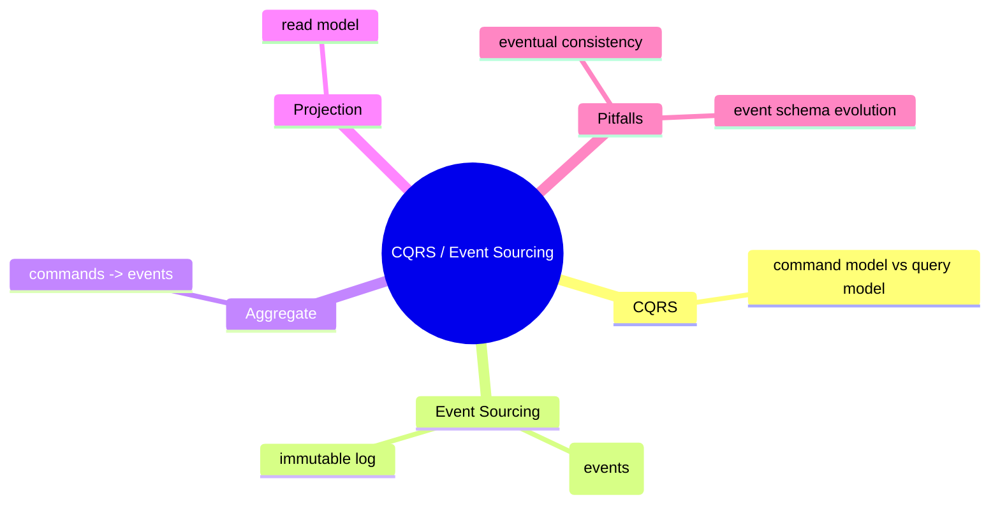

# CQRS / Event Sourcing

**EN**: CQRS and Event Sourcing
**Summary**: Separate read and write models and persist domain state as an immutable stream of events.



> **Rust 版本**: 1.97.0+ (Edition 2024)
> **Bloom 层级**: L6
> **权威来源**: 本文件为 `concept/` 权威页。
> **前置概念**: [错误传播](../01_idioms/02_error_propagation.md) · [设计模式](../03_design_patterns/README.md)
> **后置概念**: [微服务](./03_microservices.md) · [事件总线](./06_event_bus.md)

---

## 一、权威定义

**CQRS（Command Query Responsibility Segregation）** 将系统的**写模型（Command）**与**读模型（Query）**分离，使两者可以针对各自负载独立优化。

**Event Sourcing（事件溯源）** 将系统状态表示为**不可变事件序列**的折叠结果。状态变更不直接修改当前状态，而是追加事件；当前状态通过重放事件计算得出。

二者常结合使用：命令侧生成事件，事件被持久化后投影到读模型。

## 二、核心属性与关系

| 属性 | 说明 |
|:---|:---|
| **写模型负责不变式** | Aggregate 验证命令并产生事件，确保业务规则。 |
| **读模型负责查询效率** | Projection 可按查询需求构建反规范化视图。 |
| **不可变事件日志** | 提供审计追踪、时间旅行调试和事件重放能力。 |
| **最终一致性** | 读模型可能滞后于写模型，需要显式处理。 |

## 三、正向推理决策树

```text
业务领域需要复杂的写入规则和多变的查询需求？
├── 否 → 单一数据模型即可。
└── 是
    ├── 读/写负载特征差异大？
    │   └── 是 → 引入 CQRS 分离模型。
    ├── 是否需要完整审计或状态历史？
    │   └── 是 → 使用 Event Sourcing 持久化事件流。
    └── 是否能接受最终一致性？
        └── 否 → 慎用 CQRS/ES，或采用同步投影。
```

## 四、反向推理决策树

```text
CQRS/ES 系统复杂度过高？
├── 读模型与写模型数据严重漂移？
│   └── 是 → 建立事件版本契约与投影测试。
├── 事件schema频繁变更？
│   └── 是 → 使用 upcasting / schema registry。
├── 读模型更新延迟导致业务问题？
│   └── 是 → 评估同步投影或降低一致性要求。
└── 调试困难？
    └── 是 → 利用事件日志重放和状态快照。
```

## 五、Rust 表达与示例

```rust
use std::collections::HashMap;

#[derive(Debug, Clone, PartialEq, Eq)]
pub enum InventoryCommand {
    AddStock(String, u32),
    RemoveStock(String, u32),
}

#[derive(Debug, Clone, PartialEq, Eq)]
pub enum InventoryEvent {
    StockAdded(String, u32),
    StockRemoved(String, u32),
}

pub struct InventoryAggregate;

impl InventoryAggregate {
    pub fn handle(command: InventoryCommand) -> Vec<InventoryEvent> {
        match command {
            InventoryCommand::AddStock(sku, qty) => {
                vec![InventoryEvent::StockAdded(sku, qty)]
            }
            InventoryCommand::RemoveStock(sku, qty) => {
                vec![InventoryEvent::StockRemoved(sku, qty)]
            }
        }
    }

    pub fn project(events: &[InventoryEvent]) -> HashMap<String, i64> {
        let mut state = HashMap::new();
        for event in events {
            match event {
                InventoryEvent::StockAdded(sku, qty) => {
                    *state.entry(sku.clone()).or_insert(0) += *qty as i64;
                }
                InventoryEvent::StockRemoved(sku, qty) => {
                    *state.entry(sku.clone()).or_insert(0) -= *qty as i64;
                }
            }
        }
        state
    }
}

fn main() {
    let events = vec![
        InventoryAggregate::handle(InventoryCommand::AddStock("A".into(), 10)),
        InventoryAggregate::handle(InventoryCommand::RemoveStock("A".into(), 3)),
    ]
    .into_iter()
    .flatten()
    .collect::<Vec<_>>();

    let state = InventoryAggregate::project(&events);
    assert_eq!(state.get("A"), Some(&7));
}
```

## 六、反例与常见错误

直接在命令处理中修改读模型，跳过事件持久化，会破坏事件溯源的审计能力：

```rust
// 反例：命令直接修改状态，没有生成事件。
pub fn add_stock_directly(state: &mut HashMap<String, u32>, sku: &str, qty: u32) {
    *state.entry(sku.to_string()).or_insert(0) += qty;
}
```

## 七、国际权威来源

- [Microsoft — CQRS Journey](https://msdn.microsoft.com/en-us/library/jj554200.aspx)
- [Martin Fowler — CQRS](https://martinfowler.com/bliki/CQRS.html)
- [Martin Fowler — Event Sourcing](https://martinfowler.com/eaaDev/EventSourcing.html)
- [Greg Young — CQRS Documents](https://cqrs.files.wordpress.com/2010/11/cqrs_documents.pdf)
