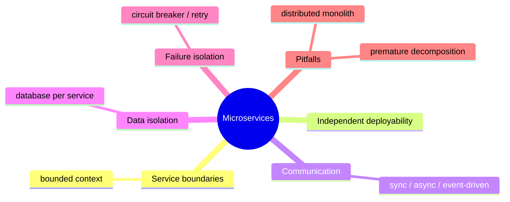

# 微服务

**EN**: Microservices in Rust
**Summary**: Decompose a system into independently deployable services with explicit boundaries and lightweight communication.



> **Rust 版本**: 1.97.0+ (Edition 2024)
> **Bloom 层级**: L6
> **权威来源**: 本文件为 `concept/` 权威页。
> **前置概念**: [Hexagonal / Clean Architecture](./01_hexagonal_clean_architecture.md) · [Actor](./04_actor.md)
> **后置概念**: [事件总线](./06_event_bus.md)

---

## 一、权威定义

微服务架构将应用程序拆分为一组**小型、自治、围绕业务能力组织**的服务。每个服务拥有独立的数据存储、部署生命周期和进程边界，通过定义良好的 API（通常是 HTTP/gRPC 或消息队列）通信。

在 Rust 中，微服务常利用 Cargo workspace 组织多个 crate，每个 crate 对应一个服务或共享库。

## 二、核心属性与关系

| 属性 | 说明 |
|:---|:---|
| **边界明确** | 服务按业务边界（bounded context）划分，接口契约稳定。 |
| **独立部署** | 单个服务可独立构建、发布、扩缩容。 |
| **数据隔离** | 每个服务管理自己的数据，避免直接访问其他服务数据库。 |
| **故障隔离** | 单个服务故障不必然级联，需要熔断、重试、限流。 |

## 三、正向推理决策树

```text
系统规模或团队规模持续增长？
├── 否 → 单体应用更简单。
└── 是
    ├── 是否存在清晰的业务边界？
    │   ├── 否 → 先进行领域建模，避免分布式单体。
    │   └── 是
    │       ├── 是否需要独立扩缩容或技术栈？
    │       │   └── 是 → 适合微服务。
    │       └── 团队是否能承受分布式复杂性？
    │           └── 否 → 考虑模块化单体。
```

## 四、反向推理决策树

```text
微服务系统陷入运维灾难？
├── 服务间调用呈网状且无清晰边界？
│   └── 是 → 重新划分 bounded context，减少同步调用。
├── 多个服务共享数据库？
│   └── 是 → 按服务拆分数据，使用 API 或事件同步。
├── 故障频繁级联？
│   └── 是 → 引入熔断、舱壁、超时与重试策略。
└── 部署流水线复杂且缓慢？
    └── 是 → 统一构建基座，共享 CI/CD 模板与容器基础镜像。
```

## 五、Rust 表达与示例

```rust
use std::collections::HashMap;

pub trait Service {
    type Request;
    type Response;
    fn handle(&self, req: Self::Request) -> Self::Response;
}

#[derive(Debug)]
pub struct UserRequest {
    pub user_id: u64,
}

#[derive(Debug, PartialEq, Eq)]
pub struct UserProfile {
    pub user_id: u64,
    pub name: String,
}

pub struct UserService;

impl Service for UserService {
    type Request = UserRequest;
    type Response = UserProfile;

    fn handle(&self, req: Self::Request) -> Self::Response {
        UserProfile {
            user_id: req.user_id,
            name: format!("User {}", req.user_id),
        }
    }
}

pub struct ServiceRegistry {
    users: UserService,
}

impl ServiceRegistry {
    pub fn new() -> Self {
        Self { users: UserService }
    }

    pub fn get_user(&self, user_id: u64) -> UserProfile {
        self.users.handle(UserRequest { user_id })
    }
}

fn main() {
    let registry = ServiceRegistry::new();
    let profile = registry.get_user(42);
    assert_eq!(profile.name, "User 42");
}
```

## 六、反例与常见错误

多个服务直接访问同一数据库，破坏服务自治：

```rust
// 反例：订单服务直接查询用户服务的数据库表。
fn get_user_email_from_user_db(user_id: u64) -> String {
    // 直接访问用户库，导致紧耦合。
    format!("user{}@example.com", user_id)
}
```

## 七、国际权威来源

- [Martin Fowler — Microservices](https://martinfowler.com/articles/microservices.html)
- [The Twelve-Factor App](https://12factor.net/)
- [AWS — Microservices on AWS](https://docs.aws.amazon.com/whitepapers/latest/microservices-on-aws/introduction.html)
- [Rust Async Book — Building a Service](https://rust-lang.github.io/async-book/)
