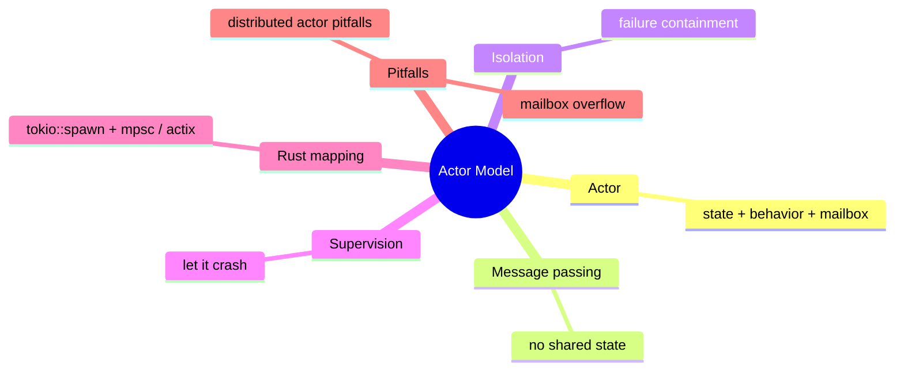

# Actor 模型

**EN**: Actor Model in Rust
**Summary**: Encapsulate state and behavior in actors that communicate exclusively through asynchronous messages.



> **Rust 版本**: 1.97.0+ (Edition 2024)
> **Bloom 层级**: L6
> **权威来源**: 本文件为 `concept/` 权威页。
> **前置概念**: [并发基础](../../../03_advanced/00_concurrency/01_concurrency.md) · [Channel](../../../03_advanced/00_concurrency/03_channels.md)
> **后置概念**: [事件总线](./06_event_bus.md) · [微服务](./03_microservices.md)

---

## 一、权威定义

Actor 模型是一种并发计算模型：每个 **Actor** 是一个独立的计算单元，拥有私有状态、行为和一个**邮箱（mailbox）**。Actor 之间不共享内存，只通过**异步消息传递**进行通信。收到消息后，Actor 可以：

- 修改自身状态；
- 向其他 Actor 发送消息；
- 创建新的 Actor。

Rust 的所有权模型与 Actor 模型天然契合：消息通常通过 channel 转移所有权，避免数据竞争。

## 二、核心属性与关系

| 属性 | 说明 |
|:---|:---|
| **封装** | 状态仅由 Actor 自身访问，外部通过消息交互。 |
| **无锁并发** | 不存在共享可变状态，天然避免数据竞争。 |
| **位置透明** | Actor 地址与物理位置解耦，便于分布扩展。 |
| **容错** | 通过监督（supervision）策略隔离和恢复故障。 |

## 三、正向推理决策树

```text
并发实体之间需要强隔离且消息语义自然？
├── 否 → 使用共享内存 + Mutex/Arc 或数据并行。
└── 是
    ├── 状态是否天然属于某个实体？
    │   └── 是 → Actor 是合适模型。
    ├── 是否需要跨网络分布？
    │   └── 是 → Actor 位置透明性便于扩展。
    └── 是否需要容错监督树？
        └── 是 → 使用 actix / akka-style 框架。
```

## 四、反向推理决策树

```text
Actor 系统出现性能或复杂度问题？
├── 消息序列化开销过高？
│   └── 是 → 对高频数据使用零拷贝或共享内存（需额外同步）。
├── 邮箱堆积导致 OOM？
│   └── 是 → 设置 bounded mailbox 与背压策略。
├── Actor 之间形成大量同步请求-响应？
│   └── 是 → 评估是否退化为 RPC；考虑 CQRS/事件驱动。
└── 分布式 Actor 出现网络分区幻觉？
    └── 是 → 明确超时、重试与一致性模型。
```

## 五、Rust 表达与示例

使用 `std::sync::mpsc` 的最小 Actor：

```rust
use std::sync::mpsc::{channel, Sender};
use std::thread;

#[derive(Debug, Clone, PartialEq, Eq)]
pub enum CounterMessage {
    Increment(u64),
    Get,
}

pub struct CounterActor;

impl CounterActor {
    pub fn spawn() -> Sender<CounterMessage> {
        let (tx, rx) = channel::<CounterMessage>();
        thread::spawn(move || {
            let mut count = 0u64;
            for msg in rx {
                match msg {
                    CounterMessage::Increment(n) => count += n,
                    CounterMessage::Get => println!("count = {}", count),
                }
            }
        });
        tx
    }
}

fn main() {
    let actor = CounterActor::spawn();
    actor.send(CounterMessage::Increment(3)).unwrap();
    actor.send(CounterMessage::Increment(2)).unwrap();
    actor.send(CounterMessage::Get).unwrap();
}
```

生产环境通常使用 `tokio::sync::mpsc` 或 `actix`。

## 六、反例与常见错误

Actor 之间共享可变状态会重新引入数据竞争：

```rust,compile_fail,E0277
use std::sync::Arc;
use std::cell::RefCell;
use std::sync::mpsc::channel;

fn main() {
    let shared = Arc::new(RefCell::new(0));
    let (tx, _rx) = channel::<()>();
    // ❌ RefCell 不是 Send/Sync，不能在线程间共享
    std::thread::spawn(move || {
        *shared.borrow_mut() += 1;
    });
}
```

## 七、国际权威来源

- [Hewitt, Bishop & Steiger — A Universal Modular Actor Formalism](https://dl.acm.org/doi/10.1145/1624775.1624804)
- [Akka Documentation — Actor Model](https://akka.io/docs/)
- [actix crate](https://actix.rs/)
- [The Rust Programming Language — Message Passing](https://doc.rust-lang.org/book/ch16-02-message-passing.html)
