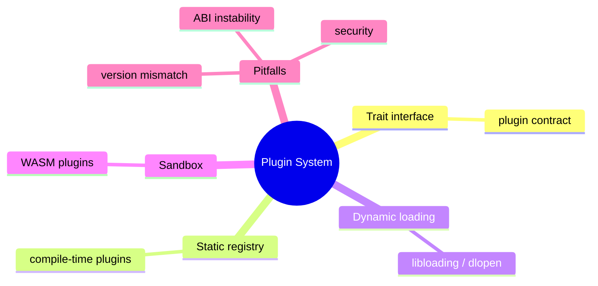

# 插件系统

**EN**: Plugin System in Rust
**Summary**: Load and execute extensions at runtime through trait-based registries or dynamic libraries.



> **Rust 版本**: 1.97.0+ (Edition 2024)
> **Bloom 层级**: L6
> **权威来源**: 本文件为 `concept/` 权威页。
> **前置概念**: [Trait](../../../02_intermediate/00_traits/01_traits.md) · [模块系统](../../../01_foundation/07_modules_and_items/01_modules_and_paths.md)
> **后置概念**: [事件总线](./06_event_bus.md)

---

## 一、权威定义

插件系统允许核心程序在不修改自身代码的情况下，通过定义良好的接口加载并执行外部扩展。Rust 中常见两种形态：

1. **静态插件**：在编译期通过 trait 和注册表将插件链接进二进制；
2. **动态插件**：在运行期通过 `libloading` 或 WASM 加载外部模块。

插件接口通常使用 trait 描述，核心通过 trait 对象调用插件能力，从而实现解耦。

## 二、核心属性与关系

| 属性 | 说明 |
|:---|:---|
| **扩展性** | 新功能通过新增插件实现，无需修改核心。 |
| **隔离性** | 插件失败通常不会拖垮核心（动态加载 + 错误处理）。 |
| **ABI 风险** | 动态加载要求插件与核心使用兼容的 ABI 和 Rust 版本。 |
| **WASM 沙箱** | 使用 wasmtime 等运行时可在安全沙箱中执行插件。 |

## 三、正向推理决策树

```text
需要允许第三方扩展核心功能？
├── 否 → 普通 trait + 组合即可。
└── 是
    ├── 插件是否需要在运行时加载/卸载？
    │   ├── 否 → 静态注册表更简单、无 ABI 风险。
    │   └── 是
    │       ├── 是否允许不可信代码？
    │       │   └── 是 → 使用 WASM 沙箱。
    │       └── 是否要求高性能且信任插件来源？
    │           └── 是 → 使用 libloading 动态库。
```

## 四、反向推理决策树

```text
插件系统不稳定？
├── 动态库 ABI 不匹配导致崩溃？
│   └── 是 → 使用 C ABI 接口或 WASM 隔离；严格版本管理。
├── 插件加载失败导致核心不可用？
│   └── 是 → 插件错误隔离，核心继续运行。
├── 插件权限过大？
│   └── 是 → 使用 capability 模型或 WASM 沙箱限制。
└── 插件发现机制复杂？
    └── 是 → 提供 manifest / metadata 文件规范。
```

## 五、Rust 表达与示例

```rust
pub trait Plugin: Send + Sync {
    fn name(&self) -> &'static str;
    fn execute(&self, input: &str) -> String;
}

pub struct PluginRegistry {
    plugins: Vec<Box<dyn Plugin>>,
}

impl PluginRegistry {
    pub fn new() -> Self {
        Self { plugins: Vec::new() }
    }

    pub fn register(&mut self, plugin: Box<dyn Plugin>) {
        self.plugins.push(plugin);
    }

    pub fn run_all(&self, input: &str) -> Vec<String> {
        self.plugins
            .iter()
            .map(|p| format!("[{}] {}", p.name(), p.execute(input)))
            .collect()
    }
}

pub struct UpperPlugin;
impl Plugin for UpperPlugin {
    fn name(&self) -> &'static str {
        "upper"
    }
    fn execute(&self, input: &str) -> String {
        input.to_uppercase()
    }
}

fn main() {
    let mut registry = PluginRegistry::new();
    registry.register(Box::new(UpperPlugin));
    let results = registry.run_all("hello");
    assert_eq!(results, vec!["[upper] HELLO"]);
}
```

## 六、反例与常见错误

插件 trait 中包含泛型方法会导致 trait object 不可用：

```rust,compile_fail,E0038
pub trait Plugin {
    fn name(&self) -> &'static str;
    fn execute<T>(&self, input: T) -> String; // ❌ 泛型方法不能成为对象安全
}

fn use_plugin(p: &dyn Plugin) {
    let _ = p.name();
}

fn main() {}
```

## 七、国际权威来源

- [Rust API Guidelines — Traits](https://rust-lang.github.io/api-guidelines/flexibility.html#c-traits)
- [libloading crate docs](https://docs.rs/libloading/)
- [wasmtime — Sandboxed Plugins in Rust](https://docs.wasmtime.dev/)
- [Dynamic Loading in Rust — The Rust Reference](https://doc.rust-lang.org/reference/linkage.html)
