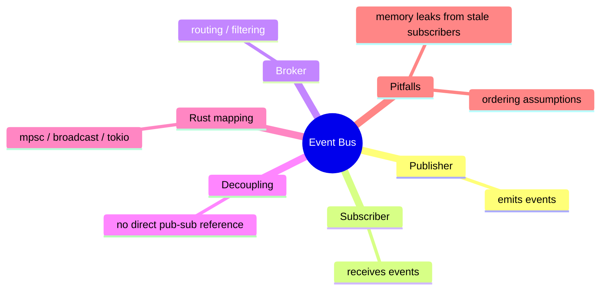

# 事件总线

**EN**: Event Bus in Rust
**Summary**: Decouple publishers and subscribers through a central channel or broker that routes events asynchronously.



> **Rust 版本**: 1.97.0+ (Edition 2024)
> **Bloom 层级**: L6
> **权威来源**: 本文件为 `concept/` 权威页。
> **前置概念**: [Channel](../../03_advanced/00_concurrency/03_channels.md) · [Actor](./04_actor.md)
> **后置概念**: [CQRS / Event Sourcing](./02_cqrs_event_sourcing.md)

---

## 一、权威定义

事件总线（Event Bus）是一种**发布-订阅（pub-sub）**中间件：发布者将事件发送到总线，总线负责将事件路由给所有感兴趣的订阅者。发布者与订阅者互不直接引用，从而实现解耦。

在 Rust 中，事件总线可用 `std::sync::mpsc`（单生产者）、`tokio::sync::broadcast`（多订阅者）或自定义 registry 实现。

## 二、核心属性与关系

| 属性 | 说明 |
|:---|:---|
| **解耦** | 发布者不知道订阅者存在，订阅者不知道事件来源。 |
| **可扩展** | 新增事件类型或订阅者无需修改发布代码。 |
| **异步友好** | 天然适合 async/await 和 actor 模型。 |
| **风险** | 订阅者泄漏、事件顺序、背压处理需要显式设计。 |

## 三、正向推理决策树

```text
系统中存在一对多通知需求？
├── 否 → 直接函数调用或返回值。
└── 是
    ├── 发布者与订阅者需要完全解耦？
    │   └── 是 → 使用事件总线。
    ├── 是否需要跨进程/网络？
    │   └── 是 → 引入消息队列（Kafka/RabbitMQ/NATS）。
    └── 是否对延迟极度敏感？
        └── 是 → 使用内存 channel，避免序列化开销。
```

## 四、反向推理决策树

```text
事件总线出现调试或性能问题？
├── 订阅者内存泄漏？
│   └── 是 → 使用 weak reference 或 bounded channel，清理关闭的接收者。
├── 事件顺序被误解？
│   └── 是 → 明确总线是否保证 FIFO，必要时使用时间戳/版本号。
├── 生产者过快导致 OOM？
│   └── 是 → 使用 bounded channel 或背压策略。
└── 订阅者处理失败影响其他订阅者？
    └── 是 → 隔离每个订阅者的处理路径。
```

## 五、Rust 表达与示例

```rust
use std::collections::HashMap;
use std::sync::mpsc::{channel, Sender};

#[derive(Debug, Clone, PartialEq, Eq, Hash)]
pub enum AppEvent {
    UserLoggedIn(u64),
    OrderPlaced(String),
}

pub struct EventBus {
    subscribers: HashMap<AppEvent, Vec<Sender<AppEvent>>>,
}

impl EventBus {
    pub fn new() -> Self {
        Self {
            subscribers: HashMap::new(),
        }
    }

    pub fn subscribe(&mut self, event: AppEvent, sender: Sender<AppEvent>) {
        self.subscribers.entry(event).or_default().push(sender);
    }

    pub fn publish(&self, event: AppEvent) {
        if let Some(subs) = self.subscribers.get(&event) {
            for sender in subs {
                let _ = sender.send(event.clone());
            }
        }
    }
}

fn main() {
    let mut bus = EventBus::new();
    let (tx, rx) = channel();
    bus.subscribe(AppEvent::OrderPlaced("X".into()), tx);
    bus.publish(AppEvent::OrderPlaced("X".into()));
    assert_eq!(rx.recv().unwrap(), AppEvent::OrderPlaced("X".into()));
}
```

## 六、反例与常见错误

总线持有订阅者的 `Sender` 强引用，若订阅者已退出但未被移除，会导致事件被发送到已关闭的 channel。应使用 `std::sync::mpsc::Sender` 的 `send` 返回值忽略失败，或使用 `Weak` 引用：

```rust
// 反例：总线没有清理已关闭的订阅者，事件可能静默丢失。
use std::sync::mpsc::channel;
use std::collections::HashMap;

fn main() {
    let (tx, rx) = channel::<i32>();
    drop(rx); // 接收者已关闭
    let mut bus: HashMap<&str, Vec<_>> = HashMap::new();
    bus.entry("event").or_default().push(tx);
    // 发布时 send 返回 Err，需要显式处理或清理。
}
```

## 七、国际权威来源

- [Martin Fowler — Event Bus](https://martinfowler.com/articles/events.html)
- [tokio sync — broadcast](https://docs.rs/tokio/latest/tokio/sync/broadcast/index.html)
- [NATS — Cloud Native Messaging](https://nats.io/)
- [The Rust Programming Language — Message Passing](https://doc.rust-lang.org/book/ch16-02-message-passing.html)
