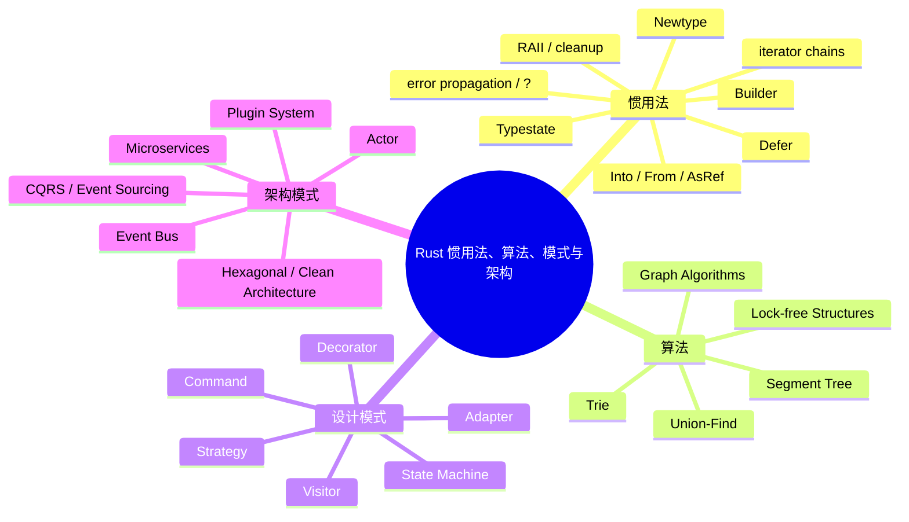

> **内容分级**: [综述级]
> **定理链**: N/A — 描述性/综述性/导航性文档，不涉及形式化定理链

# Rust 惯用法、算法、设计模式与架构模式

**EN**: Rust Idioms, Algorithms, Design Patterns, and Architecture Patterns
**Summary**: Canonical survey of reusable Rust solutions spanning idioms, classic algorithms, design patterns, and architecture patterns.
**Rust 版本**: 1.97.0+ (Edition 2024)
**受众**: [进阶]
**权威来源**: 本文件为 `concept/` 权威页。
**层级**: L5 对比分析 / L6 生态工程
**前置概念**: [所有权与借用](../../01_foundation/01_ownership_borrow_lifetime/01_ownership.md) · [Trait 与泛型](../../02_intermediate/00_traits/01_traits.md) · [并发模型](../../03_advanced/00_concurrency/01_concurrency.md)
**后置概念**: [Rust 系统设计原则](../../06_ecosystem/03_design_patterns/03_system_design_principles.md) · [算法模式](../../06_ecosystem/16_algorithm_patterns/00_algorithm_patterns_overview.md)

---

> **Bloom 层级**: L5-L6

## 认知入口

## 目录

- [01 惯用法（Idioms）](./01_idioms/README.md)
- [02 算法（Algorithms）](./02_algorithms/README.md)
- [03 设计模式（Design Patterns）](./03_design_patterns/README.md)
- [04 架构模式（Architecture Patterns）](./04_architecture/README.md)

## 与国际权威来源的对齐

本系列参考并链接到以下国际权威来源：

- [Rust Design Patterns](https://rust-unofficial.github.io/patterns/)
- [Rust API Guidelines](https://rust-lang.github.io/api-guidelines/)
- [The Rust Programming Language](https://doc.rust-lang.org/book/)
- [The Rust Reference](https://doc.rust-lang.org/reference/introduction.html)
- [Refactoring Guru — Design Patterns](https://refactoring.guru/design-patterns)
- [Martin Fowler](https://martinfowler.com/)
- [Alistair Cockburn — Hexagonal Architecture](https://alistair.cockburn.us/hexagonal-architecture/)
- [Hewitt, Bishop & Steiger — A Universal Modular Actor Formalism](https://dl.acm.org/doi/10.1145/1624775.1624804)
- [Cormen et al. — Introduction to Algorithms (CLRS)](https://mitpress.mit.edu/9780262046305/introduction-to-algorithms/)
