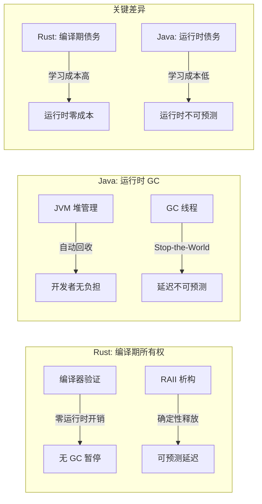
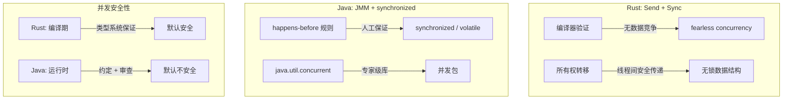
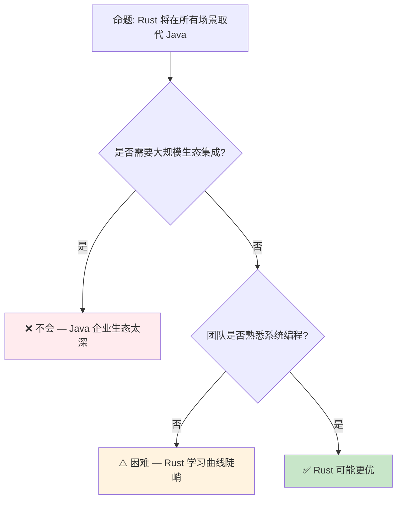

# Rust vs Java：系统编程与托管运行时的范式对比

> **Bloom 层级**: 分析 → 评价
> **定位**: 从**内存模型**、**并发语义**、**类型系统**和**运行时架构**四个维度，系统对比 Rust 与 Java 的设计哲学差异，分析两种范式在系统编程、云原生和嵌入式场景的适用边界。
> **前置概念**: [Ownership](../01_foundation/01_ownership.md) · [Concurrency](../03_advanced/01_concurrency.md) · [Type System](../01_foundation/04_type_system.md)
> **后置概念**: [Application Domains](../06_ecosystem/04_application_domains.md)

---

> **来源**: [The Java Language Specification](https://docs.oracle.com/javase/specs/jls/se21/html/index.html) ·
> [JVM Specification](https://docs.oracle.com/javase/specs/jvms/se21/html/index.html) ·
> [Rust Reference](https://doc.rust-lang.org/reference/) ·
> [TRPL — Ownership](https://doc.rust-lang.org/book/ch04-00-understanding-ownership.html) ·
> [Java Memory Model (JMM)](https://docs.oracle.com/javase/specs/jls/se21/html/jls-17.html)

## 📑 目录

- [Rust vs Java：系统编程与托管运行时的范式对比](#rust-vs-java系统编程与托管运行时的范式对比)
  - [📑 目录](#-目录)
  - [一、核心概念](#一核心概念)
    - [1.1 内存管理：所有权 vs GC](#11-内存管理所有权-vs-gc)
    - [1.2 类型系统：静态显式 vs 静态推断](#12-类型系统静态显式-vs-静态推断)
    - [1.3 并发模型：所有权约束 vs JMM](#13-并发模型所有权约束-vs-jmm)
  - [二、技术细节](#二技术细节)
    - [2.1 运行时架构对比](#21-运行时架构对比)
    - [2.2 异常处理哲学](#22-异常处理哲学)
    - [2.3 泛型实现：单态化 vs 擦除](#23-泛型实现单态化-vs-擦除)
  - [三、场景适用矩阵](#三场景适用矩阵)
  - [四、反命题与边界分析](#四反命题与边界分析)
    - [4.1 反命题树](#41-反命题树)
    - [4.2 边界极限](#42-边界极限)
  - [五、迁移路径](#五迁移路径)
  - [六、来源与延伸阅读](#六来源与延伸阅读)
  - [相关概念文件](#相关概念文件)

---

## 一、核心概念

### 1.1 内存管理：所有权 vs GC



> **认知功能**: 此图对比 Rust 与 Java 的**内存管理债务转移**——Rust 将复杂性前移到编译期，Java 将其后移到运行时。
> **使用建议**: 延迟敏感场景（实时系统、高频交易、游戏引擎）选 Rust；快速迭代、延迟不敏感场景选 Java。
> **关键洞察**: GC 的"开发者无负担"是一种**假象**——GC 调优（堆大小、GC 算法、暂停时间）在大型 Java 应用中同样复杂，只是复杂性从"写代码"转移到"运维调优"。
> [来源: [TRPL — Ownership](https://doc.rust-lang.org/book/ch04-00-understanding-ownership.html)] · [Java GC Tuning Guide](https://docs.oracle.com/en/java/javase/21/gctuning/)

---

### 1.2 类型系统：静态显式 vs 静态推断

```text
类型系统对比:

  Rust                          Java
  ├── 显式生命周期标注           ├── 无生命周期概念
  ├── 所有权/借用作为类型系统部分  ├── 引用即指针（无借用检查）
  ├── Trait（结构化子类型）       ├── 接口（名义子类型）
  ├── 无 null（Option<T>）        ├── null 存在（NullPointerException）
  ├── 泛型单态化                 ├── 泛型擦除（类型参数运行时不可用）
  ├── 代数数据类型（enum）        ├── 传统继承层次
  └── 模式匹配 + 穷尽性检查       └── switch + 默认 case

形式化差异:
  Rust 类型系统 ≈ 系统 F + 区域类型 + 线性类型
  Java 类型系统 ≈ 系统 F<: + 子类型多态 + 泛型擦除
```

> **类型洞察**: Rust 的 `Option<T>` 和模式匹配将**空值检查**从运行时异常转化为编译期错误。Java 的 `Optional<T>`（Java 8+）是类似的尝试，但因向后兼容性无法强制使用。
> [来源: [Rust Reference — Types](https://doc.rust-lang.org/reference/types.html)] · [JLS — Types](https://docs.oracle.com/javase/specs/jls/se21/html/jls-4.html)

---

### 1.3 并发模型：所有权约束 vs JMM



> **认知功能**: 此图对比两种语言的**并发安全模型**——Rust 通过类型系统（Send/Sync）在编译期消除数据竞争；Java 通过 JMM 和开发者约定在运行时管理并发。
> **使用建议**: 高并发系统（微服务、网络服务）选 Rust（编译期安全）；遗留系统或需大量共享状态的系统选 Java（成熟的并发库生态）。
> **关键洞察**: Rust 的 `Send`/`Sync` 是**类型系统的并发安全标记**——与 Java 的 `synchronized` 不同，它们不引入运行时开销，只是编译期的约束检查。
> [来源: [Rustnomicon — Send and Sync](https://doc.rust-lang.org/nomicon/send-and-sync.html)] · [JLS — Memory Model](https://docs.oracle.com/javase/specs/jls/se21/html/jls-17.html)

---

## 二、技术细节

### 2.1 运行时架构对比

| 维度 | Rust | Java |
|:---|:---|:---|
| **运行时** | 可选（标准库 minimal） | 必需（JVM） |
| **启动时间** | 毫秒级（原生二进制） | 秒级（JVM 初始化） |
| **内存占用** | 低（无运行时） | 高（JVM + 元空间） |
| **JIT 编译** | 无（AOT 编译） | 有（HotSpot C1/C2） |
| **反射** | 有限（编译期宏） | 完整（运行时类型信息） |
| **动态加载** | 复杂（需 dlopen 等） | 原生（ClassLoader） |
| **调试** | LLDB/GDB | JDWP/JVM TI |

> **架构洞察**: Rust 的**零运行时**设计使其适合资源受限环境（嵌入式、边缘计算、无服务器冷启动）。Java 的**富运行时**（JIT、GC、反射）使其适合长生命周期的服务端应用。
> [来源: [JVM Specification](https://docs.oracle.com/javase/specs/jvms/se21/html/index.html)] · [Rust Runtime](https://doc.rust-lang.org/reference/runtime.html)

---

### 2.2 异常处理哲学

```text
异常处理对比:

  Rust: Result<T, E> + panic
  ├── Result: 可恢复错误的显式处理
  │   └── fn read_file() -> Result<String, io::Error>
  ├── panic: 不可恢复错误的栈展开
  │   └── 默认终止程序（可配置为 abort）
  ├── ? 操作符: 错误传播的语法糖
  │   └── let content = read_file()?;
  └── 哲学: "错误是返回值的一部分"

  Java: checked + unchecked exceptions
  ├── checked: 编译期强制处理（IOException）
  │   └── 需显式 throws 或 try-catch
  ├── unchecked: 运行时异常（NullPointerException）
  │   └── 不强制处理
  └── 哲学: "异常是控制流机制"

关键差异:
  - Rust 的错误处理是**类型系统的一部分**（Result 是类型）
  - Java 的错误处理是**控制流机制**（异常跳转）
  - Rust 无异常开销（无栈展开成本，除非 panic）
  - Java 的异常创建有成本（填充栈跟踪）
```

> **错误洞察**: Rust 的 `Result<T, E>` 将**错误处理显式化**——调用者必须处理或传播错误。Java 的 checked exception 有类似目标，但 unchecked exception 的存在破坏了这一保证。
> [来源: [Rust Error Handling](https://doc.rust-lang.org/book/ch09-00-error-handling.html)] · [JLS — Exceptions](https://docs.oracle.com/javase/specs/jls/se21/html/jls-11.html)

---

### 2.3 泛型实现：单态化 vs 擦除

```rust,ignore
// Rust: 泛型单态化（Monomorphization）
fn identity<T>(x: T) -> T { x }

// 编译器生成多个副本:
// fn identity_i32(x: i32) -> i32 { x }
// fn identity_string(x: String) -> String { x }
// 零运行时开销，但二进制膨胀
```

```java
// Java: 泛型擦除（Type Erasure）
public static <T> T identity(T x) { return x; }

// 编译后擦除类型参数:
// public static Object identity(Object x) { return x; }
// 运行时类型信息丢失，需自动装箱/拆箱
```

> **实现洞察**: Rust 单态化提供**类型特化的性能**（无装箱），但增加二进制大小。Java 擦除保持**二进制兼容性**（泛型库可向后兼容），但引入装箱开销和运行时类型丢失。
> [来源: [Rust Reference — Generics](https://doc.rust-lang.org/reference/items/generics.html)] · [JLS — Type Erasure](https://docs.oracle.com/javase/specs/jls/se21/html/jls-4.html#jls-4.6)

---

## 三、场景适用矩阵

| 场景 | Rust | Java | 推荐 |
|:---|:---|:---|:---:|
| **操作系统/内核** | ✅ 无运行时，直接内存控制 | ❌ 需 JVM，不可行 | **Rust** |
| **嵌入式/IoT** | ✅ no_std，极小二进制 | ❌ JVM 太大 | **Rust** |
| **实时系统** | ✅ 确定性延迟 | ❌ GC 暂停 | **Rust** |
| **微服务/云原生** | ✅ 低内存，快启动 | ✅ 成熟生态，快速开发 | **视团队而定** |
| **大数据处理** | ⚠️ 生态发展中 | ✅ Spark, Flink 生态 | **Java** |
| **Android 开发** | ⚠️ 可通过 JNI | ✅ 原生支持 | **Java/Kotlin** |
| **Web 后端** | ✅ Actix, Axum 高性能 | ✅ Spring 生态成熟 | **视规模而定** |
| **机器学习** | ⚠️ tch-rs, burn | ✅ DL4J, Smile | **Java/Python** |
| **金融高频交易** | ✅ 零分配，确定延迟 | ❌ GC 不可接受 | **Rust** |
| **企业级应用** | ⚠️ 生态待成熟 | ✅ Spring, Jakarta EE | **Java** |

> **场景洞察**: Rust 在**系统边界**（底层基础设施、延迟敏感）有绝对优势；Java 在**应用层**（业务系统、大数据）生态更成熟。两者在**微服务层**正在竞争。
> [来源: [Stack Overflow Developer Survey 2025](https://survey.stackoverflow.co/)]

---

## 四、反命题与边界分析

### 4.1 反命题树



> **认知功能**: 此决策树评估 Rust 替代 Java 的可行性。核心判断标准是**生态依赖**和**团队能力**。
> **使用建议**: 新项目在系统层优先 Rust；遗留系统或强依赖 Java 生态的场景保持 Java；微服务层可渐进迁移。
> **关键洞察**: 语言选择是**社会-技术决策**——技术优劣只是因素之一，团队技能、生态依赖、维护成本同样重要。
> [来源: 💡 原创分析]

---

### 4.2 边界极限

```text
边界 1: 学习曲线
├── Rust 所有权/生命周期需要数月掌握
├── Java 入门简单，但掌握并发/JVM 调优同样需要深入
└── 团队转型成本是 Rust 采纳的主要障碍

边界 2: 调试体验
├── Rust 编译错误信息优秀（但量大）
├── Java 运行时调试成熟（IDE 支持、热替换）
└── Rust 的编译期严格性减少了运行时调试需求，但增加了编译期排错时间

边界 3: 动态性需求
├── Java 反射、动态代理、字节码生成生态丰富
├── Rust 编译期元编程（宏）强大，但运行时动态性有限
└── 需要高度动态性的框架（如 Spring）难以在 Rust 中复制

边界 4: 互操作性
├── Rust 通过 JNI/FFI 可与 Java 互操作
├── GraalVM Native Image 可将 Java 编译为原生（但非 Rust 替代）
└── 实际趋势: 混合架构——Java 业务层 + Rust 性能关键路径
```

> **边界要点**: Rust 和 Java 不是零和竞争，而是**互补共存**。未来的系统架构可能是多语言的——Rust 处理底层基础设施，Java/Kotlin 处理业务逻辑。
> [来源: [Rust vs Java Industry Analysis](https://survey.stackoverflow.co/)]

---

## 五、迁移路径

```text
Java → Rust 的渐进迁移策略:

  阶段 1: 独立服务（Sidecar）
  ├── 将性能关键组件（解析器、压缩、加密）用 Rust 重写
  ├── 通过 gRPC/HTTP 与 Java 服务通信
  └── 风险低，回滚容易

  阶段 2: JNI/FFI 集成
  ├── Rust 库编译为动态库
  ├── Java 通过 JNI/Panama 调用
  └── 同一进程内，减少通信开销

  阶段 3: 核心路径替换
  ├── 识别 Java 应用的 CPU/内存热点
  ├── 用 Rust 重写热点路径
  └── 保留 Java 的业务框架层

  阶段 4: 完整重写（极少需要）
  ├── 仅在新项目或彻底重构时考虑
  └── 大多数场景混合架构更实际
```

> **迁移洞察**: 从 Java 到 Rust 的迁移应遵循**"性能热点优先"**原则——不是全部重写，而是识别并替换最关键的组件。
> [来源: [Rust in Production — Migration Stories](https://rust-lang.github.io/rust-project-goals/)]

---

## 六、来源与延伸阅读

| 来源 | 可信度 | 说明 |
|:---|:---:|:---|
| [Java Language Specification](https://docs.oracle.com/javase/specs/jls/se21/html/index.html) | ✅ 一级 | Java 语言规范 |
| [JVM Specification](https://docs.oracle.com/javase/specs/jvms/se21/html/index.html) | ✅ 一级 | JVM 规范 |
| [TRPL — Ownership](https://doc.rust-lang.org/book/ch04-00-understanding-ownership.html) | ✅ 一级 | Rust 所有权 |
| [Rust Reference](https://doc.rust-lang.org/reference/) | ✅ 一级 | Rust 语言参考 |
| [Stack Overflow Developer Survey](https://survey.stackoverflow.co/) | 🔍 三级 | 行业采用数据 |
| [Java Memory Model](https://docs.oracle.com/javase/specs/jls/se21/html/jls-17.html) | ✅ 一级 | JMM 规范 |

---

## 相关概念文件

- [Rust vs C++](./01_rust_vs_cpp.md) — Rust 与 C++ 的对比
- [Rust vs Go](./02_rust_vs_go.md) — Rust 与 Go 的对比
- [Ownership](../01_foundation/01_ownership.md) — Rust 所有权模型
- [Concurrency](../03_advanced/01_concurrency.md) — Rust 并发模型
- [Application Domains](../06_ecosystem/04_application_domains.md) — 应用领域分析

---

> **权威来源**: [Rust Reference](https://doc.rust-lang.org/reference/), [The Rust Programming Language](https://doc.rust-lang.org/book/), [Rustonomicon](https://doc.rust-lang.org/nomicon/)
>
> **权威来源对齐变更日志**: 2026-05-21 创建，对齐 Rust 1.95.0+ (Edition 2024)

**文档版本**: 1.0
**对应 Rust 版本**: 1.95.0+ (Edition 2024)
**最后更新**: 2026-05-21
**状态**: ✅ 概念文件创建完成
