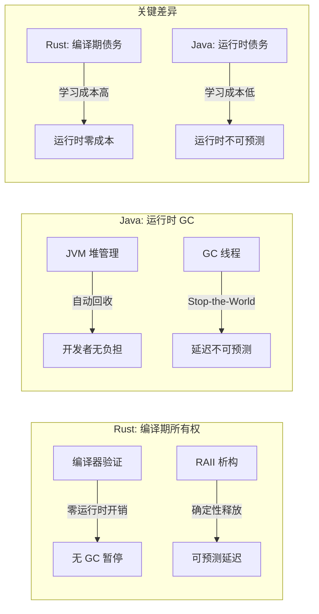
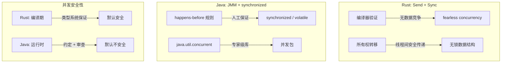
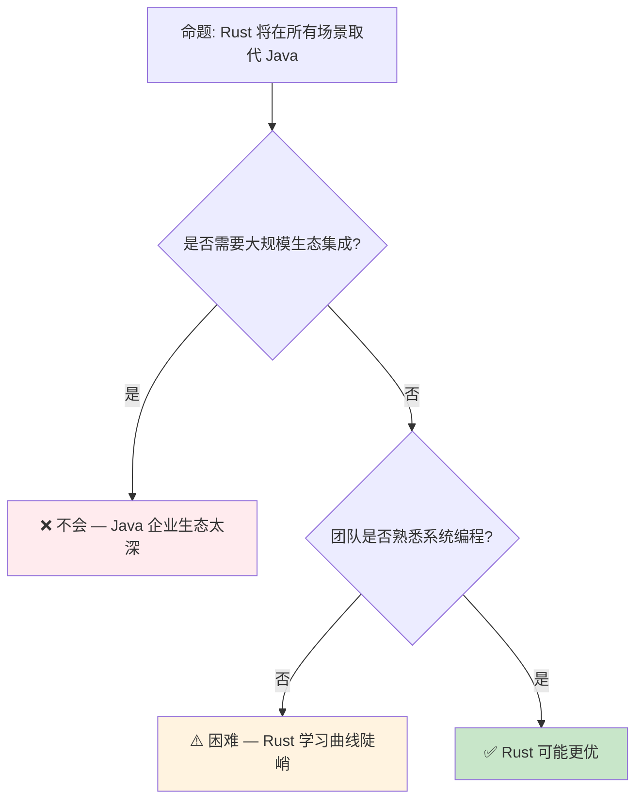

> **内容分级**: [综述级]
> **定理链**: N/A — 描述性/综述性/导航性文档，不涉及形式化定理链
>
# Rust vs Java：系统编程与托管运行时的范式对比
>
> **EN**: Rust vs Java
> **Summary**: Rust vs Java: comparative analysis with Rust across type systems, memory safety, and concurrency.
> **受众**: [进阶]
> **Bloom 层级**: 分析 → 评价
> **定位**: 从**内存模型**、**并发语义**、**类型系统（Type System）**和**运行时（Runtime）架构**四个维度，系统对比 Rust 与 Java 的设计哲学差异，分析两种范式在系统编程、云原生和嵌入式场景的适用边界。
> **前置概念**: [Ownership](../01_foundation/01_ownership.md) · [Concurrency](../03_advanced/01_concurrency.md) · [Type System](../01_foundation/04_type_system.md)
> **后置概念**: [Application Domains](../06_ecosystem/04_application_domains.md)

---

> **来源**: [The Java Language Specification](https://docs.oracle.com/javase/specs/jls/se21/html/index.html) · · [Brown University — Interactive Rust Book](https://rust-book.cs.brown.edu/) · [Jung et al. — RustBelt: Securing the Foundations of Rust](https://plv.mpi-sws.org/rustbelt/popl18/) · [Itanium C++ ABI](https://itanium-cxx-abi.github.io/cxx-abi/abi.html)
> [JVM Specification](https://docs.oracle.com/javase/specs/jvms/se21/html/index.html) ·
> [Rust Reference](https://doc.rust-lang.org/reference/) ·
> [TRPL — Ownership](https://doc.rust-lang.org/book/ch04-00-understanding-ownership.html) ·
> [Java Memory Model (JMM)](https://docs.oracle.com/javase/specs/jls/se21/html/jls-17.html)
> **前置依赖**: [Type Theory](../04_formal/02_type_theory.md)

## 📑 目录
>
>

- Rust vs Java：系统编程与托管运行时（Runtime）的范式对比
  - [📑 目录](#-目录)
  - [一、核心概念](#一核心概念)
    - 1.1 内存管理：所有权（Ownership） vs GC
    - 1.2 类型系统（Type System）：静态显式 vs 静态推断
    - [1.3 并发模型：所有权约束 vs JMM](#13-并发模型所有权约束-vs-jmm)
  - [二、技术细节](#二技术细节)
    - [2.1 运行时架构对比](#21-运行时架构对比)
    - [2.2 异常处理哲学](#22-异常处理哲学)
    - 2.3 泛型（Generics）实现：单态化（Monomorphization） vs 擦除
  - [三、场景适用矩阵](#三场景适用矩阵)
  - [四、反命题与边界分析](#四反命题与边界分析)
    - [4.1 反命题树](#41-反命题树)
    - [4.2 边界极限](#42-边界极限)
  - [五、迁移路径](#五迁移路径)
  - [六、来源与延伸阅读](#六来源与延伸阅读)
  - [相关概念文件](#相关概念文件)
  - [权威来源索引](#权威来源索引)
  - [十、边界测试：Rust 与 Java 的编译错误对比](#十边界测试rust-与-java-的编译错误对比)
    - [10.1 边界测试：Java 的泛型擦除 vs Rust 的单态化（编译错误）](#101-边界测试java-的泛型擦除-vs-rust-的单态化编译错误)
    - [10.2 边界测试：Java 的 null 与 Rust 的 `Option`（编译错误）](#102-边界测试java-的-null-与-rust-的-option编译错误)
    - [10.3 边界测试：Java 的泛型擦除与 Rust 的单态化（编译错误）](#103-边界测试java-的泛型擦除与-rust-的单态化编译错误)
    - [10.4 边界测试：Java 的 GC 与 Rust 的所有权的资源管理差异（编译错误）](#104-边界测试java-的-gc-与-rust-的所有权的资源管理差异编译错误)
    - [10.3 边界测试：Java 的泛型擦除与 Rust 的单态化（编译后差异）](#103-边界测试java-的泛型擦除与-rust-的单态化编译后差异)
    - [10.4 边界测试：Java 的 null 安全与 Rust 的 Option 编译期检查（编译错误）](#104-边界测试java-的-null-安全与-rust-的-option-编译期检查编译错误)
  - [嵌入式测验（Embedded Quiz）](#嵌入式测验embedded-quiz)
    - [测验 1：Rust 和 Java 在内存管理上的最根本区别是什么？（理解层）](#测验-1rust-和-java-在内存管理上的最根本区别是什么理解层)
    - [测验 2：Java 的泛型（Generics）使用类型擦除，Rust 的泛型使用单态化。这对运行时性能和类型安全有什么影响？（理解层）](#测验-2java-的泛型generics使用类型擦除rust-的泛型使用单态化这对运行时性能和类型安全有什么影响理解层)
    - [测验 3：为什么 Rust 没有 Java 那样的"受检异常"（Checked Exceptions）？Rust 如何处理错误？（理解层）](#测验-3为什么-rust-没有-java-那样的受检异常checked-exceptionsrust-如何处理错误理解层)
    - [测验 4：Rust 的 `async/await` 与 Java 的 `CompletableFuture`/`Virtual Threads` 在并发模型上有什么区别？（理解层）](#测验-4rust-的-asyncawait-与-java-的-completablefuturevirtual-threads-在并发模型上有什么区别理解层)
    - [测验 5：在需要与大量现有 Java 生态集成的场景下，Rust 通常如何与 Java 交互？（理解层）](#测验-5在需要与大量现有-java-生态集成的场景下rust-通常如何与-java-交互理解层)
  - [认知路径](#认知路径)
    - [核心推理链](#核心推理链)
    - [反命题与边界](#反命题与边界)

---

## 一、核心概念
>
>

### 1.1 内存管理：所有权 vs GC
>



> **认知功能**: 此图对比 Rust 与 Java 的**内存管理债务转移**——Rust 将复杂性前移到编译期，Java 将其后移到运行时。
> [来源: [TRPL](https://doc.rust-lang.org/book/title-page.html)]
> **使用建议**: 延迟敏感场景（实时系统、高频交易、游戏引擎）选 Rust；快速迭代、延迟不敏感场景选 Java。
> **关键洞察**: GC 的"开发者无负担"是一种**假象**——GC 调优（堆大小、GC 算法、暂停时间）在大型 Java 应用中同样复杂，只是复杂性从"写代码"转移到"运维调优"。
> [来源: [TRPL — Ownership](https://doc.rust-lang.org/book/ch04-00-understanding-ownership.html)] · [Java GC Tuning Guide](https://docs.oracle.com/en/java/javase/21/gctuning/)
> [来源: [Wikipedia — Java (programming language)](https://en.wikipedia.org/wiki/Java_(programming_language))]

---

### 1.2 类型系统：静态显式 vs 静态推断
>

```text
类型系统对比:

  Rust                          Java
  ├── 显式生命周期标注           ├── 无生命周期概念
  ├── 所有权/借用作为类型系统部分  ├── 引用即指针（无借用检查）
  ├── Trait（结构化子类型）       ├── 接口（名义子类型）
  ├── 无 null（Option<T>）        ├── null 存在（NullPointerException）
  ├── 泛型单态化                 ├── 泛型擦除（类型参数运行时不可用）
  ├── 代数数据类型（enum）        ├── 传统继承层次
  └── 模式匹配 + 穷尽性检查       └── switch + 默认 case

形式化差异:
  Rust 类型系统 ≈ 系统 F + 区域类型 + 线性类型
  Java 类型系统 ≈ 系统 F<: + 子类型多态 + 泛型擦除
```

> **类型洞察**: Rust 的 `Option<T>` 和模式匹配（Pattern Matching）将**空值检查**从运行时异常转化为编译期错误。Java 的 `Optional<T>`（Java 8+）是类似的尝试，但因向后兼容性无法强制使用。
> [来源: [Rust Reference — Types](https://doc.rust-lang.org/reference/types.html)] · [JLS — Types](https://docs.oracle.com/javase/specs/jls/se21/html/jls-4.html)

---

### 1.3 并发模型：所有权约束 vs JMM
>



> **认知功能**: 此图对比两种语言的**并发安全（Concurrency Safety）模型**——Rust 通过类型系统（Send/Sync）在编译期消除数据竞争；Java 通过 JMM 和开发者约定在运行时管理并发。
> **使用建议**: 高并发系统（微服务、网络服务）选 Rust（编译期安全）；遗留系统或需大量共享状态的系统选 Java（成熟的并发库生态）。
> **关键洞察**: Rust 的 `Send`/`Sync` 是**类型系统（Type System）的并发安全（Concurrency Safety）标记**——与 Java 的 `synchronized` 不同，它们不引入运行时开销，只是编译期的约束检查。
> [来源: [Rustnomicon — Send and Sync](https://doc.rust-lang.org/nomicon/send-and-sync.html)] · [JLS — Memory Model](https://docs.oracle.com/javase/specs/jls/se21/html/jls-17.html)

---

## 二、技术细节

### 2.1 运行时架构对比
>

| 维度 | Rust | Java |
|:---|:---|:---|
| **运行时（Runtime）** | 可选（标准库 minimal） | 必需（JVM） |
| **启动时间** | 毫秒级（原生二进制） | 秒级（JVM 初始化） |
| **内存占用** | 低（无运行时） | 高（JVM + 元空间） |
| **JIT 编译** | 无（AOT 编译） | 有（HotSpot C1/C2） |
| **反射** | 有限（编译期宏（Macro）） | 完整（运行时类型信息） |
| **动态加载** | 复杂（需 dlopen 等） | 原生（ClassLoader） |
| **调试** | LLDB/GDB | JDWP/JVM TI |

> **架构洞察**: Rust 的**零运行时**设计使其适合资源受限环境（嵌入式、边缘计算、无服务器冷启动）。Java 的**富运行时**（JIT、GC、反射）使其适合长生命周期（Lifetimes）的服务端应用。
> [来源: [JVM Specification](https://docs.oracle.com/javase/specs/jvms/se21/html/index.html)] · [Rust Runtime](https://doc.rust-lang.org/reference/runtime.html)

---

### 2.2 异常处理哲学
>

```text
异常处理对比:

  Rust: Result<T, E> + panic
  ├── Result: 可恢复错误的显式处理
  │   └── fn read_file() -> Result<String, io::Error>
  ├── panic: 不可恢复错误的栈展开
  │   └── 默认终止程序（可配置为 abort）
  ├── ? 操作符: 错误传播的语法糖
  │   └── let content = read_file()?;
  └── 哲学: "错误是返回值的一部分"

  Java: checked + unchecked exceptions
  ├── checked: 编译期强制处理（IOException）
  │   └── 需显式 throws 或 try-catch
  ├── unchecked: 运行时异常（NullPointerException）
  │   └── 不强制处理
  └── 哲学: "异常是控制流机制"

关键差异:
  - Rust 的错误处理是**类型系统的一部分**（Result 是类型）
  - Java 的错误处理是**控制流机制**（异常跳转）
  - Rust 无异常开销（无栈展开成本，除非 panic）
  - Java 的异常创建有成本（填充栈跟踪）
```

> **错误洞察**: Rust 的 `Result<T, E>` 将**错误处理（Error Handling）显式化**——调用者必须处理或传播错误。Java 的 checked exception 有类似目标，但 unchecked exception 的存在破坏了这一保证。
> [来源: [Rust Error Handling](https://doc.rust-lang.org/book/ch09-00-error-handling.html)] · [JLS — Exceptions](https://docs.oracle.com/javase/specs/jls/se21/html/jls-11.html)

---

### 2.3 泛型实现：单态化 vs 擦除
>

```rust
// Rust: 泛型单态化（Monomorphization）
fn identity<T>(x: T) -> T { x }

// 编译器生成多个副本:
// fn identity_i32(x: i32) -> i32 { x }
// fn identity_string(x: String) -> String { x }
// 零运行时开销，但二进制膨胀
```

```java
// Java: 泛型擦除（Type Erasure）
public static <T> T identity(T x) { return x; }

// 编译后擦除类型参数:
// public static Object identity(Object x) { return x; }
// 运行时类型信息丢失，需自动装箱/拆箱
```

> **实现洞察**: Rust 单态化（Monomorphization）提供**类型特化的性能**（无装箱），但增加二进制大小。Java 擦除保持**二进制兼容性**（泛型（Generics）库可向后兼容），但引入装箱开销和运行时类型丢失。
> [来源: [Rust Reference — Generics](https://doc.rust-lang.org/reference/items/generics.html)] · [JLS — Type Erasure](https://docs.oracle.com/javase/specs/jls/se21/html/jls-4.html#jls-4.6)

---

## 三、场景适用矩阵

| 场景 | Rust | Java | 推荐 |
|:---|:---|:---|:---:|
| **操作系统/内核** | ✅ 无运行时，直接内存控制 | ❌ 需 JVM，不可行 | **Rust** |
| **嵌入式/IoT** | ✅ no_std，极小二进制 | ❌ JVM 太大 | **Rust** |
| **实时系统** | ✅ 确定性延迟 | ❌ GC 暂停 | **Rust** |
| **微服务/云原生** | ✅ 低内存，快启动 | ✅ 成熟生态，快速开发 | **视团队而定** |
| **大数据处理** | ⚠️ 生态发展中 | ✅ Spark, Flink 生态 | **Java** |
| **Android 开发** | ⚠️ 可通过 JNI | ✅ 原生支持 | **Java/Kotlin** |
| **Web 后端** | ✅ Actix, Axum 高性能 | ✅ Spring 生态成熟 | **视规模而定** |
| **机器学习** | ⚠️ tch-rs, burn | ✅ DL4J, Smile | **Java/Python** |
| **金融高频交易** | ✅ 零分配，确定延迟 | ❌ GC 不可接受 | **Rust** |
| **企业级应用** | ⚠️ 生态待成熟 | ✅ Spring, Jakarta EE | **Java** |

> **场景洞察**: Rust 在**系统边界**（底层基础设施、延迟敏感）有绝对优势；Java 在**应用层**（业务系统、大数据）生态更成熟。两者在**微服务层**正在竞争。
> [来源: [Stack Overflow Developer Survey 2025](https://survey.stackoverflow.co/)]

---

## 四、反命题与边界分析

### 4.1 反命题树
>



> **认知功能**: 此决策树评估 Rust 替代 Java 的可行性。核心判断标准是**生态依赖**和**团队能力**。
> [来源: [Rust Reference](https://doc.rust-lang.org/reference/)]
> **使用建议**: 新项目在系统层优先 Rust；遗留系统或强依赖 Java 生态的场景保持 Java；微服务层可渐进迁移。
> **关键洞察**: 语言选择是**社会-技术决策**——技术优劣只是因素之一，团队技能、生态依赖、维护成本同样重要。
> [来源: 💡 原创分析]

---

### 4.2 边界极限
>

```text
边界 1: 学习曲线
├── Rust 所有权/生命周期需要数月掌握
├── Java 入门简单，但掌握并发/JVM 调优同样需要深入
└── 团队转型成本是 Rust 采纳的主要障碍

边界 2: 调试体验
├── Rust 编译错误信息优秀（但量大）
├── Java 运行时调试成熟（IDE 支持、热替换）
└── Rust 的编译期严格性减少了运行时调试需求，但增加了编译期排错时间

边界 3: 动态性需求
├── Java 反射、动态代理、字节码生成生态丰富
├── Rust 编译期元编程（宏）强大，但运行时动态性有限
└── 需要高度动态性的框架（如 Spring）难以在 Rust 中复制

边界 4: 互操作性
├── Rust 通过 JNI/FFI 可与 Java 互操作
├── GraalVM Native Image 可将 Java 编译为原生（但非 Rust 替代）
└── 实际趋势: 混合架构——Java 业务层 + Rust 性能关键路径
```

> **边界要点**: Rust 和 Java 不是零和竞争，而是**互补共存**。未来的系统架构可能是多语言的——Rust 处理底层基础设施，Java/Kotlin 处理业务逻辑。
> [来源: [Rust vs Java Industry Analysis](https://survey.stackoverflow.co/)]

---

## 五、迁移路径
>

```text
Java → Rust 的渐进迁移策略:

  阶段 1: 独立服务（Sidecar）
  ├── 将性能关键组件（解析器、压缩、加密）用 Rust 重写
  ├── 通过 gRPC/HTTP 与 Java 服务通信
  └── 风险低，回滚容易

  阶段 2: JNI/FFI 集成
  ├── Rust 库编译为动态库
  ├── Java 通过 JNI/Panama 调用
  └── 同一进程内，减少通信开销

  阶段 3: 核心路径替换
  ├── 识别 Java 应用的 CPU/内存热点
  ├── 用 Rust 重写热点路径
  └── 保留 Java 的业务框架层

  阶段 4: 完整重写（极少需要）
  ├── 仅在新项目或彻底重构时考虑
  └── 大多数场景混合架构更实际
```

> **迁移洞察**: 从 Java 到 Rust 的迁移应遵循**"性能热点优先"**原则——不是全部重写，而是识别并替换最关键的组件。
> [来源: [Rust in Production — Migration Stories](https://rust-lang.github.io/rust-project-goals/)]

---

## 六、来源与延伸阅读

| 来源 | 可信度 | 说明 |
|:---|:---:|:---|
| [Java Language Specification](https://docs.oracle.com/javase/specs/jls/se21/html/index.html) | ✅ 一级 | Java 语言规范 |
| [JVM Specification](https://docs.oracle.com/javase/specs/jvms/se21/html/index.html) | ✅ 一级 | JVM 规范 |
| [TRPL — Ownership](https://doc.rust-lang.org/book/ch04-00-understanding-ownership.html) | ✅ 一级 | Rust 所有权（Ownership） |
| [Rust Reference](https://doc.rust-lang.org/reference/) | ✅ 一级 | Rust 语言参考 |
| [Stack Overflow Developer Survey](https://survey.stackoverflow.co/) | 🔍 三级 | 行业采用数据 |
| [Java Memory Model](https://docs.oracle.com/javase/specs/jls/se21/html/jls-17.html) | ✅ 一级 | JMM 规范 |
| [TechEmpower Benchmarks](https://www.techempower.com/benchmarks/) | 🔍 三级 | Web 框架性能对比 |
| [Wikipedia — Java](https://en.wikipedia.org/wiki/Java_(programming_language)) | ✅ 一级 | 语言概述 |

---

## 相关概念文件

- [Rust vs C++](01_rust_vs_cpp.md) — Rust 与 C++ 的对比
- [Rust vs Go](02_rust_vs_go.md) — Rust 与 Go 的对比
- [Ownership](../01_foundation/01_ownership.md) — Rust 所有权（Ownership）模型
- [Concurrency](../03_advanced/01_concurrency.md) — Rust 并发模型
- [Application Domains](../06_ecosystem/04_application_domains.md) — 应用领域分析

---

> **权威来源**: [Rust Reference](https://doc.rust-lang.org/reference/), [The Rust Programming Language](https://doc.rust-lang.org/book/title-page.html), [Rustonomicon](https://doc.rust-lang.org/nomicon/)
>
> **权威来源对齐变更日志**: 2026-05-21 创建，对齐 Rust 1.96.1+ (Edition 2024)

**文档版本**: 1.0
**对应 Rust 版本**: 1.96.1+ (Edition 2024)
**最后更新**: 2026-05-21
**状态**: ✅ 概念文件创建完成

---

## 权威来源索引

>
>
>

---

---

---

## 十、边界测试：Rust 与 Java 的编译错误对比

### 10.1 边界测试：Java 的泛型擦除 vs Rust 的单态化（编译错误）

```rust,compile_fail
fn generic_id<T>(x: T) -> T {
    x
}

fn main() {
    let a = generic_id(42i32);
    let b = generic_id(3.14f64);
    // ❌ 编译错误: `a` 和 `b` 是不同类型，不能放入同一 Vec
    // Rust 的单态化生成独立代码，a 和 b 没有共同类型
    let v = vec![a, b];
}

// 正确: 使用枚举或 trait object 统一类型
enum Number {
    Int(i32),
    Float(f64),
}

fn fixed() {
    let v = vec![Number::Int(42), Number::Float(3.14)];
}
```

> **Java 对比**: Java 的泛型通过**类型擦除**（type erasure）实现——编译后 `List<Integer>` 和 `List<String>` 都是 `List<Object>`，运行时无类型信息。Rust 通过**单态化**（monomorphization）实现泛型——为每个具体类型生成独立代码，`generic_id<i32>` 和 `generic_id<f64>` 是完全不同的函数。Java 的擦除允许运行时类型统一（`List<?>`），但无法获取泛型参数；Rust 的单态化提供零成本抽象（Zero-Cost Abstraction），但不同类型不能共存于同质集合（需用 `enum` 或 `Box<dyn Trait>`）。[来源: [The Rust Programming Language](https://doc.rust-lang.org/book/title-page.html)]

### 10.2 边界测试：Java 的 null 与 Rust 的 `Option`（编译错误）

```rust,compile_fail
fn main() {
    // ❌ 编译错误: `Option<String>` 不能直接与字符串操作
    let s: Option<String> = None;
    // Rust 没有 null，必须显式解包 Option
    let len = s.len(); // 编译错误
}

// 正确: 显式处理 Option
fn fixed() {
    let s: Option<String> = Some(String::from("hello"));
    let len = s.map(|v| v.len()).unwrap_or(0); // ✅ 安全处理 None
    println!("{}", len);
}
```

> **Java 对比**: Java 的引用（Reference）类型默认可为 `null`——`String s = null;` 编译通过，但运行时 `s.length()` 抛出 `NullPointerException`。Rust 的 `Option<T>` 将可空性编码到类型中，`Some` 和 `None` 是两个不同的变体，`match` 强制处理两者。这与 Java 8+ 的 `Optional<T>` 类似，但 Rust 的 `Option` 是语言核心（零开销），而 Java 的 `Optional` 是库类（有对象包装开销）。Rust 消除了十亿美元错误（billion-dollar mistake）。[来源: [The Rust Programming Language](https://doc.rust-lang.org/book/title-page.html)]

### 10.3 边界测试：Java 的泛型擦除与 Rust 的单态化（编译错误）

```rust,ignore
// Java: List<String> 和 List<Integer> 运行时相同（类型擦除）
// List list = new ArrayList<String>();
// list.add(42); // 运行时允许，但可能 ClassCastException

// Rust: Vec<String> 和 Vec<i32> 是完全不同的类型
fn process_strings(v: Vec<String>) {
    for s in v {
        println!("{}", s.len());
    }
}

fn main() {
    let nums = vec![1, 2, 3];
    // ❌ 编译错误: Vec<i32> 不能传给需要 Vec<String> 的函数
    // process_strings(nums);
}
```

> **修正**: Java 的泛型使用**类型擦除**（type erasure）：编译后 `List<String>` 和 `List<Integer>` 都是 `List<Object>`，泛型信息仅用于编译期检查。Rust 使用**单态化**（monomorphization）：`Vec<String>` 和 `Vec<i32>` 编译为完全不同的机器码，无运行时类型信息。Java 的优势：二进制兼容性（泛型类只需编译一次）、反射可访问泛型信息（通过 `TypeToken`）。Rust 的优势：零成本抽象（Zero-Cost Abstraction）（无装箱、无类型检查）、编译期错误更精确。Java 的擦除导致运行时 `ClassCastException`，Rust 的单态化在编译期消除此类错误。这与 C++ 的模板（同样单态化）或 C# 的泛型（运行时实例化，保留类型信息）不同——Rust 选择了 C++ 的路径，但增加了类型推断（Type Inference）和 trait bound 的安全性。[来源: [The Rust Programming Language](https://doc.rust-lang.org/book/ch10-01-syntax.html)] · [来源: [Java Generics Tutorial](https://docs.oracle.com/javase/tutorial/java/generics/)]

### 10.4 边界测试：Java 的 GC 与 Rust 的所有权的资源管理差异（编译错误）

```rust,ignore
struct FileHandle {
    path: String,
}

impl Drop for FileHandle {
    fn drop(&mut self) {
        println!("closing {}", self.path);
    }
}

fn main() {
    let file = FileHandle { path: "data.txt".to_string() };
    // ❌ 逻辑错误: 从 Java 迁移时，可能假设 file 在作用域结束时自动关闭
    // Rust 确实自动调用 drop，但时机是确定性的（作用域结束），
    // 而非 GC 的非确定性回收

    // 但若提前移动:
    let file2 = file;
    // file 在这里已被移动，drop 将在 file2 结束时调用
    // 不是 file 的原作用域!
}
```

> **修正**: Java 的资源管理依赖**垃圾回收**（GC）：非内存资源（文件句柄、网络连接）通过 `try-finally` 或 `try-with-resources` 显式关闭，否则等待 GC 的**终结器**（finalizer，不确定时机）。Rust 的 `Drop` trait 提供**确定性析构**：资源在值离开作用域时立即释放，无 GC 延迟。但 Rust 的所有权移动改变析构时机：`let file2 = file;` 后，`file` 的所有权转移到 `file2`，`Drop` 在 `file2` 的作用域结束时调用。这与 C++ 的 RAII（同样确定性，但拷贝语义可能多次析构）或 Python 的 `with` 语句（确定性，但依赖开发者使用）不同——Rust 的所有权 + Drop 将资源管理与类型系统绑定，无需显式关闭（大部分情况），也无 GC 不确定性。[来源: [The Rust Programming Language](https://doc.rust-lang.org/book/ch15-03-drop.html)] · [来源: [Java Finalization](https://docs.oracle.com/javase/9/docs/api/java/lang/ref/Finalizer.html)]

### 10.3 边界测试：Java 的泛型擦除与 Rust 的单态化（编译后差异）

```rust,ignore
fn process<T: std::fmt::Display>(x: T) {
    println!("{}", x);
}

fn main() {
    process(42i32);
    process("hello");
    // ❌ 编译后: Rust 为每个 T 生成独立代码（单态化）
    // Java 的泛型擦除: List<Integer> 和 List<String> 运行时共享同一份代码
}
```

> **修正**: Rust 的**单态化**（monomorphization）：为每个具体类型生成独立的机器码。`process::<i32>` 和 `process::<&str>` 是两份代码。优势：零运行时开销（无装箱、无类型检查）；劣势：二进制膨胀（代码重复）。Java 的**类型擦除**（type erasure）：编译后 `List<Integer>` 和 `List<String>` 都是 `List<Object>`，运行时无类型信息。优势：二进制小、向后兼容；劣势：运行时 `ClassCastException`、无法 `new T()`、无原始类型特化。Rust 通过 `dyn Trait` 提供类型擦除选项（ fat pointer + vtable），但默认是单态化。这与 C++ 的模板（同样单态化）或 C# 的泛型（运行时特化，但共享代码）不同——Rust 在编译期完全单态化，性能最优但体积需权衡。[来源: [The Rust Programming Language](https://doc.rust-lang.org/book/ch10-01-syntax.html)] · [来源: [Rust Reference — Generic Items](https://doc.rust-lang.org/reference/items/generics.html)]

### 10.4 边界测试：Java 的 null 安全与 Rust 的 Option 编译期检查（编译错误）

```rust,ignore
fn main() {
    // Java: String s = null; int len = s.length(); // NullPointerException at runtime

    // Rust 的编译期保护:
    let s: Option<String> = None;
    // ❌ 编译错误: 不能直接在 Option<String> 上调用 String 方法
    // let len = s.len();

    // 必须显式处理 None:
    let len = match s {
        Some(ref s) => s.len(),
        None => 0,
    };
    println!("{}", len);
}
```

> **修正**: Rust 的 `Option<T>` 消除了 **null 指针异常**：1) `None` 和 `Some(T)` 是不同的变体，编译器强制处理；2) `unwrap()` 在 `None` 时 panic（显式选择）；3) `?` 运算符传播 `None`（在返回 `Option` 的函数中）。Java 8+ 的 `Optional<T>` 类似，但：1) `Optional` 可仍为 `null`（`Optional` 本身是引用类型）；2) 不强制使用（编译器不检查）；3) 序列化问题。Kotlin 的 `T?`（可空类型）与 Rust 的 `Option<T>` 更接近，但 Kotlin 在 JVM 上运行时仍有 null（与 Java 互操作）。这与 Swift 的 `Optional<T>`（类似 Rust，但语法糖 `?`/`!`）或 Haskell 的 `Maybe a`（同样编译期强制处理）相同——Rust 的 `Option` 是类型系统的核心，非可选特性。[来源: [The Rust Programming Language](https://doc.rust-lang.org/book/ch06-01-defining-an-enum.html)] · [来源: [Rust Reference — Option](https://doc.rust-lang.org/std/option/enum.Option.html)]

## 嵌入式测验（Embedded Quiz）

### 测验 1：Rust 和 Java 在内存管理上的最根本区别是什么？（理解层）

**题目**: Rust 和 Java 在内存管理上的最根本区别是什么？

<details>
<summary>✅ 答案与解析</summary>

Rust 使用编译期所有权系统（无 GC），内存释放由编译器静态确定。Java 使用垃圾回收器（GC），内存释放由运行时自动管理，可能引入停顿。
</details>

---

### 测验 2：Java 的泛型（Generics）使用类型擦除，Rust 的泛型使用单态化。这对运行时性能和类型安全有什么影响？（理解层）

**题目**: Java 的泛型（Generics）使用类型擦除，Rust 的泛型使用单态化。这对运行时性能和类型安全有什么影响？

<details>
<summary>✅ 答案与解析</summary>

Rust 单态化为每种具体类型生成独立代码，运行时无类型检查开销，性能更高。Java 类型擦除保留一个通用实现，运行时可能需要类型转换，但有更小的二进制体积。
</details>

---

### 测验 3：为什么 Rust 没有 Java 那样的"受检异常"（Checked Exceptions）？Rust 如何处理错误？（理解层）

**题目**: 为什么 Rust 没有 Java 那样的"受检异常"（Checked Exceptions）？Rust 如何处理错误？

<details>
<summary>✅ 答案与解析</summary>

Rust 使用 `Result<T, E>` 作为返回值显式传播错误，由类型系统强制处理。Java 的受检异常在方法签名中声明，可能破坏接口稳定性且增加模板代码。
</details>

---

### 测验 4：Rust 的 `async/await` 与 Java 的 `CompletableFuture`/`Virtual Threads` 在并发模型上有什么区别？（理解层）

**题目**: Rust 的 `async/await` 与 Java 的 `CompletableFuture`/`Virtual Threads` 在并发模型上有什么区别？

<details>
<summary>✅ 答案与解析</summary>

Rust async 是协作式调度、零成本抽象（Zero-Cost Abstraction），基于状态机。Java Virtual Threads 是 JVM 管理的轻量级线程，由 OS 线程支持，调度更灵活但有一定运行时开销。
</details>

---

### 测验 5：在需要与大量现有 Java 生态集成的场景下，Rust 通常如何与 Java 交互？（理解层）

**题目**: 在需要与大量现有 Java 生态集成的场景下，Rust 通常如何与 Java 交互？

<details>
<summary>✅ 答案与解析</summary>

通过 JNI（Java Native Interface）或 Panama 项目（FFI）调用 Rust 编译的动态库。也可用 gRPC/HTTP 等网络协议进行跨语言服务通信。
</details>

## 认知路径

> **认知路径**: 从 L0 基础概念出发，经由本节的 **Rust vs Java：系统编程与托管运行时的范式对比** 核心原理，通向 L2 进阶模式与 L3 工程实践。

### 核心推理链

| 定理 | 前提 | 结论 | 置信度 |
|:---|:---|:---|:---|
| Rust vs Java：系统编程与托管运行时的范式对比 基础定义 ⟹ 正确用法 | 理解语法与语义 | 能写出符合惯用法的代码 | 高 |
| Rust vs Java：系统编程与托管运行时的范式对比 正确用法 ⟹ 常见陷阱 | 忽略边界条件 | 编译错误或运行时 bug | 高 |
| Rust vs Java：系统编程与托管运行时的范式对比 常见陷阱 ⟹ 深度掌握 | 系统学习反模式 | 能进行代码审查与优化 | 高 |

> **过渡**: 掌握 Rust vs Java：系统编程与托管运行时的范式对比 的基础语法后，下一步需要理解其在类型系统中的位置与与其他概念的交互关系。
> **过渡**: 在实践中应用 Rust vs Java：系统编程与托管运行时的范式对比 时，务必关注边界条件与异常处理，这是从"能编译"到"能生产"的关键跃迁。
> **过渡**: Rust vs Java：系统编程与托管运行时的范式对比 的设计理念体现了 Rust 零成本抽象与安全保证的核心权衡，理解这一权衡有助于迁移到更高级的并发与形式化验证领域。

### 反命题与边界

> **反命题**: "Rust vs Java：系统编程与托管运行时的范式对比 在所有场景下都是最佳选择" —— 错误。需要根据具体上下文权衡性能、可读性与安全性，某些场景下显式替代方案可能更优。
