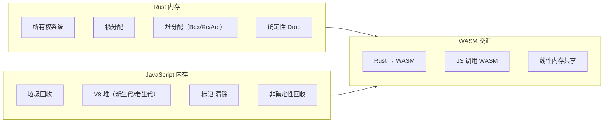
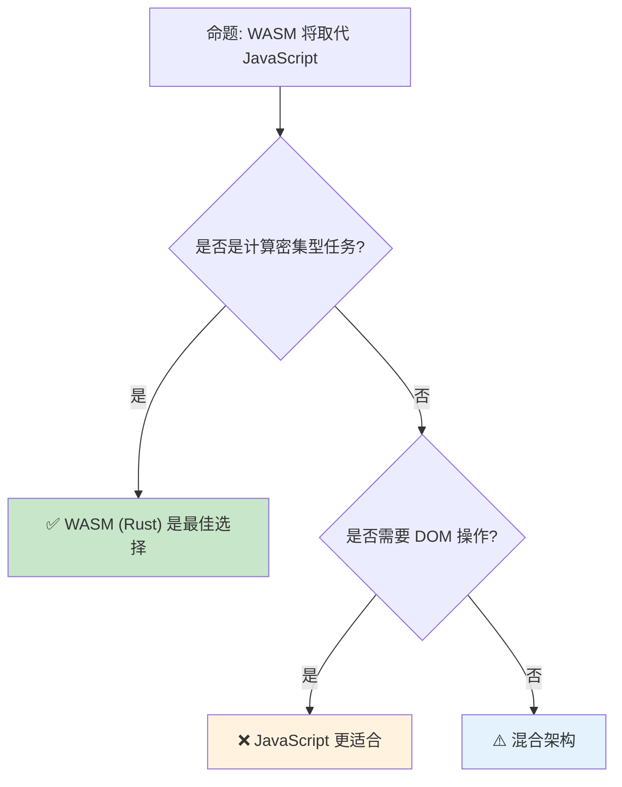

# Rust vs JavaScript：系统编程与脚本执行的范式差异

> **Bloom 层级**: 分析 → 评价
> **定位**: 对比分析 **Rust**（编译型、强类型、内存安全）与 **JavaScript**（解释型、动态类型、事件驱动）在语言语义、运行时模型、异步处理和生态工具链四个维度的本质差异，特别关注 WASM 作为两者交汇点的作用。
> **前置概念**: [Ownership](../01_foundation/01_ownership.md) · [Type System](../01_foundation/04_type_system.md)
> **后置概念**: [WebAssembly](../06_ecosystem/11_webassembly.md) · [Async](../03_advanced/02_async.md)

---

> **来源**: [ECMAScript Specification](https://tc39.es/ecma262/) · [MDN — JavaScript](https://developer.mozilla.org/en-US/docs/Web/JavaScript) · [TRPL](https://doc.rust-lang.org/book/) · [WASM Specification](https://webassembly.github.io/spec/) · [Rust and WASM](https://rustwasm.github.io/book/) · [V8 Blog](https://v8.dev/blog)

## 📑 目录
>
> [来源: [Rust Reference](https://doc.rust-lang.org/reference/)]
>
> [来源: [TRPL](https://doc.rust-lang.org/book/)]

- [Rust vs JavaScript：系统编程与脚本执行的范式差异](#rust-vs-javascript系统编程与脚本执行的范式差异)
  - [📑 目录](#-目录)
  - [一、核心概念](#一核心概念)
    - [1.1 运行时模型：编译 vs 解释](#11-运行时模型编译-vs-解释)
    - [1.2 类型系统：静态 vs 动态](#12-类型系统静态-vs-动态)
    - [1.3 内存模型：所有权 vs GC](#13-内存模型所有权-vs-gc)
  - [二、技术细节](#二技术细节)
    - [2.1 异步模型对比](#21-异步模型对比)
    - [2.2 错误处理：Result vs Throw](#22-错误处理result-vs-throw)
    - [2.3 WASM：两个世界的桥梁](#23-wasm两个世界的桥梁)
  - [三、选型决策矩阵](#三选型决策矩阵)
  - [四、反命题与边界分析](#四反命题与边界分析)
    - [4.1 反命题树](#41-反命题树)
    - [4.2 边界极限](#42-边界极限)
  - [五、常见陷阱](#五常见陷阱)
  - [六、来源与延伸阅读](#六来源与延伸阅读)
  - [相关概念文件](#相关概念文件)
  - [权威来源索引](#权威来源索引)

---

## 一、核心概念
>
> [来源: [Rust Reference](https://doc.rust-lang.org/reference/)]
>
> [来源: [Rust Reference](https://doc.rust-lang.org/reference/)]

### 1.1 运行时模型：编译 vs 解释
>
> **[来源: [Rust Reference](https://doc.rust-lang.org/reference/)]**

```text
运行时模型对比:

  Rust:
  ├── AOT 编译为机器码
  ├── 无运行时（或最小运行时）
  ├── 启动时间：毫秒级
  ├── 内存占用：精确控制
  └── 部署：单二进制文件

  JavaScript:
  ├── JIT 编译（V8/SpiderMonkey/JavaScriptCore）
  ├── 运行时：V8 引擎 + 事件循环
  ├── 启动时间：依赖引擎初始化
  ├── 内存占用：V8 堆（通常 1-2GB）
  └── 部署：源代码或 bundle

  性能特征:
  ┌─────────────────┬─────────────────┬─────────────────┐
  │ 场景            │ Rust            │ JavaScript      │
  ├─────────────────┼─────────────────┼─────────────────┤
  │ 冷启动          │ 快（已编译）    │ 慢（JIT 预热）  │
  │ 峰值性能        │ 原生速度        │ 接近原生（JIT） │
  │ 内存控制        │ 精确            │ GC 非确定性     │
  │ 包体积          │ 小（单二进制）  │ 大（运行时）    │
  │ 跨平台          │ 需交叉编译      │ 随处运行        │
  └─────────────────┴─────────────────┴─────────────────┘
```

> **运行时洞察**: Rust 的**无运行时**设计与 JavaScript 的**重型运行时**形成鲜明对比——Rust 适合资源受限环境，JavaScript 适合快速部署。
> [来源: [V8 Blog — JIT](https://v8.dev/blog/jit)] · [来源: [TRPL — No Runtime](https://doc.rust-lang.org/book/ch03-00-common-programming-concepts.html)]

---

### 1.2 类型系统：静态 vs 动态
>
> **[来源: [The Rust Programming Language](https://doc.rust-lang.org/book/)]**

```text
类型系统对比:

  Rust:
  ├── 编译期静态类型检查
  ├── 类型推断（HM 算法扩展）
  ├── 无隐式类型转换
  ├── 泛型单态化（零成本）
  └── 错误在编译期捕获

  JavaScript:
  ├── 运行时动态类型
  ├── TypeScript 提供可选静态类型（转译时检查）
  ├── 隐式类型转换（coercion）
  ├── 无泛型（TS 有，但擦除到 JS）
  └── 类型错误在运行时抛出

  TypeScript 的作用:
  ├── 提供编译期类型检查
  ├── 但类型信息在运行时不可用
  ├── 无法防止运行时类型错误（如 JSON.parse）
  └── 与 Rust 的编译期保证有本质区别

  代码对比:
  Rust:
  fn add(a: i32, b: i32) -> i32 { a + b }
  add(1, "2");  // 编译错误

  JavaScript:
  function add(a, b) { return a + b; }
  add(1, "2");  // "12"（字符串拼接）

  TypeScript:
  function add(a: number, b: number): number { return a + b; }
  add(1, "2" as any);  // 编译通过，运行时仍可能出错
```

> **类型洞察**: TypeScript 的"静态类型"是**开发时辅助**，不是**运行时保证**——`as any` 和 `JSON.parse` 可以绕过所有类型检查。Rust 的类型系统在编译后仍然有效（通过生成的代码结构）。
> [来源: [TypeScript Handbook](https://www.typescriptlang.org/docs/handbook/intro.html)] · [来源: [Rust Type System](https://doc.rust-lang.org/reference/type-system.html)]

---

### 1.3 内存模型：所有权 vs GC
>
> **[来源: [Rust Standard Library](https://doc.rust-lang.org/std/)]**



> **认知功能**: 此图展示 Rust 和 JavaScript 的**内存模型差异**及 WASM 的**桥梁作用**。Rust 的确定性内存管理与 JS 的 GC 在 WASM 中通过线性内存交互。
> [来源: [TRPL](https://doc.rust-lang.org/book/)]
> **关键洞察**: WASM 是 Rust 和 JavaScript **共存的运行时**——Rust 编译为 WASM 模块，JS 通过 JS API 调用，两者共享线性内存。
> [来源: [WASM Memory Model](https://webassembly.github.io/spec/core/syntax/modules.html#memories)]

---

## 二、技术细节
>
> [来源: [Rust Reference](https://doc.rust-lang.org/reference/)]
>
> [来源: [TRPL](https://doc.rust-lang.org/book/)]

### 2.1 异步模型对比
>
> **[来源: [Rustonomicon](https://doc.rust-lang.org/nomicon/)]**

```text
异步模型对比:

  Rust:
  ├── Future trait: 惰性计算的状态机
  ├── async/await: 语法糖，编译为状态机
  ├── 无内置运行时（需 Tokio/Async-std）
  ├── 零成本抽象：async 代码 ≈ 手写状态机
  └── 错误处理: Result 传播

  JavaScript:
  ├── Promise: 立即执行 + 回调注册
  ├── async/await: Promise 的语法糖
  ├── 事件循环: 单线程 + 任务队列
  ├── 宏任务/微任务: 复杂的调度语义
  └── 错误处理: try/catch + Promise.reject

  关键差异:
  ┌─────────────────┬─────────────────┬─────────────────┐
  │ 特性            │ Rust Future     │ JS Promise      │
  ├─────────────────┼─────────────────┼─────────────────┤
  │ 执行时机        │ 惰性（需 poll） │ 立即执行        │
  │ 取消            │ 支持（Drop）    │ 不支持（需     │
  │                 │                 │ AbortController）│
  │ 运行时          │ 外部（Tokio）   │ 内置（事件循环）│
  │ 内存            │ 栈分配状态机    │ 堆分配 Promise  │
  │ 并发            │ 多线程（Send）  │ 单线程（事件循环│
  │                 │                 │ + Worker）      │
  └─────────────────┴─────────────────┴─────────────────┘
```

> **异步洞察**: Rust 的 Future 是**惰性**的——创建时不会执行，需要运行时 poll。JavaScript 的 Promise 是**立即执行**的——创建时就开始执行。
> [来源: [Rust Async Book](https://rust-lang.github.io/async-book/)] · [来源: [MDN — Promises](https://developer.mozilla.org/en-US/docs/Web/JavaScript/Reference/Global_Objects/Promise)]

---

### 2.2 错误处理：Result vs Throw
>
> **[来源: [Rust By Example](https://doc.rust-lang.org/rust-by-example/)]**

```rust,ignore
// Rust: 显式错误传播
fn read_file(path: &str) -> Result<String, io::Error> {
    let contents = fs::read_to_string(path)?;  // ? 传播错误
    Ok(contents)
}

// JavaScript: 异常抛出
function readFile(path) {
    try {
        return fs.readFileSync(path, 'utf8');
    } catch (e) {
        throw e;  // 或返回 undefined
    }
}

// JS async 错误
async function readFile(path) {
    try {
        return await fs.promises.readFile(path, 'utf8');
    } catch (e) {
        // 处理错误
    }
}

// 关键差异:
// - Rust: 错误是类型系统的一部分（Result<T, E>）
// - JS: 错误是控制流机制（try/catch）
// - Rust: 调用者必须处理或传播错误
// - JS: 错误可以被忽略，导致未捕获异常
```

> **错误处理洞察**: Rust 的 `Result` 将错误提升为**类型**——编译器强制处理。JavaScript 的异常是**运行时控制流**——容易遗漏，导致生产环境崩溃。
> [来源: [Rust Error Handling](https://doc.rust-lang.org/book/ch09-00-error-handling.html)] · [来源: [MDN — try/catch](https://developer.mozilla.org/en-US/docs/Web/JavaScript/Reference/Statements/try...catch)]

---

### 2.3 WASM：两个世界的桥梁
>
> **[来源: [Rust Cookbook](https://rust-lang-nursery.github.io/rust-cookbook/)]**

```text
Rust + JavaScript + WASM 的工作模式:

  1. Rust 编译为 WASM
     ├── wasm32-unknown-unknown 目标
     ├── wasm-bindgen: 生成 JS 绑定
     └── wasm-pack: 打包为 npm 包

  2. JS 调用 WASM
     ├── 导入 WASM 模块
     ├── 调用 Rust 导出的函数
     └── 通过 wasm-bindgen 自动类型转换

  3. 内存共享
     ├── WASM 使用线性内存（ArrayBuffer）
     ├── JS 可以直接读写 WASM 内存
     └── 高效的数据交换（无需序列化）

  典型应用场景:
  ├── 图像/视频处理（Rust 计算，JS UI）
  ├── 游戏引擎（Rust 逻辑，JS 渲染）
  ├── 加密/哈希（Rust 实现，JS 调用）
  └── 科学计算（Rust 数值计算，JS 可视化）

  性能对比:
  ┌─────────────────┬─────────────────┬─────────────────┬─────────────────┐
  │ 场景            │ JS              │ WASM (Rust)     │ 提升            │
  ├─────────────────┼─────────────────┼─────────────────┼─────────────────┤
  │ 图像处理        │ 1x              │ 5-20x           │ 显著            │
  │ 游戏物理        │ 1x              │ 3-10x           │ 显著            │
  │ DOM 操作        │ 1x              │ 0.5-1x          │ 无（JS 更快）   │
  │ 字符串处理      │ 1x              │ 1-2x            │ 有限            │
  └─────────────────┴─────────────────┴─────────────────┴─────────────────┘
```

> **WASM 洞察**: WASM 不是**替代 JavaScript**，而是**增强 JavaScript**——在计算密集型任务上用 Rust/WASM，在 DOM/I/O 上用 JavaScript。
> [来源: [Rust and WASM Book](https://rustwasm.github.io/book/)] · [来源: [wasm-bindgen Guide](https://rustwasm.github.io/wasm-bindgen/)]

---

## 三、选型决策矩阵
>
> [来源: [Rust Reference](https://doc.rust-lang.org/reference/)]
>
> [来源: [TRPL](https://doc.rust-lang.org/book/)]

```text
场景 → 推荐技术栈 → 关键理由

Web 前端（UI 密集型）:
  → JavaScript/TypeScript
  → DOM 操作、事件处理、生态系统

Web 性能瓶颈（计算密集型）:
  → Rust + WASM
  → 原生性能、内存安全、与 JS 无缝集成

CLI 工具:
  → Rust
  → 单二进制、快速启动、跨平台

服务端（I/O 密集型）:
  → Rust (Tokio/Axum) 或 Node.js
  → Rust: 极致性能；Node.js: 开发速度

服务端（计算密集型）:
  → Rust
  → CPU 利用率、内存效率、并发安全

嵌入式/IoT:
  → Rust
  → 无运行时、精确内存控制、 fearless 并发

桌面应用:
  → Rust (Tauri) 或 Electron (JS)
  → Tauri: 小体积、Rust 后端；Electron: 大生态
```

> **选型洞察**: Rust 和 JavaScript 的**最佳协作方式**是通过 WASM——各取所长，而非互相替代。
> [来源: [Tauri](https://tauri.app/)] · [source: [Electron](https://www.electronjs.org/)]

---

## 四、反命题与边界分析
>
> [来源: [Rust Reference](https://doc.rust-lang.org/reference/)]
>
> [来源: [Rust Reference](https://doc.rust-lang.org/reference/)]

### 4.1 反命题树
>
> **[来源: [crates.io](https://crates.io/)]**



> **认知功能**: 此决策树展示 WASM 的**适用边界**。WASM 不是 JavaScript 的替代品，而是**互补技术**。
> [来源: [Rust Reference](https://doc.rust-lang.org/reference/)]
> **关键洞察**: 大多数现代 Web 应用应采用**混合架构**——JS 处理 UI 和 I/O，WASM 处理计算密集型任务。
> [来源: [WASM Use Cases](https://webassembly.org/docs/use-cases/)]

---

### 4.2 边界极限
>
> **[来源: [docs.rs](https://docs.rs/)]**

```text
边界 1: WASM 的宿主环境限制
├── WASM 无法直接访问 DOM、网络、文件系统
├── 必须通过 JS 宿主环境代理
├── 频繁的 JS/WASM 边界穿越有开销
└── 缓解: 批量操作、减少边界穿越

边界 2: WASM 的包体积
├── Rust WASM 二进制通常 50KB-500KB
├── 需要 wasm-opt 优化
├── 对比: JS bundle 可能更小（gzip 后）
└── 权衡: 体积 vs 性能

边界 3: 调试体验
├── WASM 调试需要 source map
├── 崩溃信息不如 JS 直观
├── wasm-bindgen 生成代码增加调试复杂度
└── 工具链持续改进中

边界 4: GC 语言的 WASM 支持
├── Java/Kotlin/Go 编译为 WASM 需要 GC 提案
├── 当前 WASM 无内置 GC（提案中）
├── Rust 的优势: 无 GC，WASM 友好
└── 未来 GC 提案可能改变格局

边界 5: 异步模型的不匹配
├── Rust Future 与 JS Promise 的语义差异
├── wasm-bindgen 自动转换但有性能开销
├── 复杂的异步交互可能导致意外行为
└── 需要 careful 的桥接设计
```

> **边界要点**: Rust/JS/WASM 的边界主要与**宿主环境限制**、**包体积**、**调试体验**、**GC 支持**和**异步语义**相关。
> [source: [WASM Post-MVP](https://github.com/WebAssembly/proposals)]

---

## 五、常见陷阱
>
> [来源: [Rust Reference](https://doc.rust-lang.org/reference/)]

```text
陷阱 1: 在 WASM 中做 DOM 操作
  ❌ 从 Rust WASM 频繁调用 JS DOM API
     // 边界穿越开销高

  ✅ 在 JS 中处理 DOM，WASM 处理计算
     // 减少 JS/WASM 边界穿越

陷阱 2: 忽略 WASM 包体积
  ❌ 引入大量 Rust 依赖，WASM 体积剧增
     // 用户下载时间长

  ✅ 使用 wasm-opt、wee_alloc、#![no_std]
     // 优化包体积

陷阱 3: 假设 WASM 总是更快
  ❌ 字符串处理、正则表达式在 WASM 中可能更慢
     // JS 引擎对这些高度优化

  ✅ 只在计算密集型场景使用 WASM
     // 先测量，再决定

陷阱 4: 混用两种错误处理风格
  ❌ Rust WASM 返回 Result，JS 侧用 try/catch 处理
     // wasm-bindgen 转换可能不符合预期

  ✅ 明确错误传递约定
     // 使用 wasm-bindgen 的 Result 转换

陷阱 5: 在热路径上创建 JS 对象
  ❌ 从 WASM 返回大量 JS 对象
     // GC 压力、分配开销

  ✅ 使用 TypedArray 共享内存
     // 零拷贝数据交换
```

> **陷阱总结**: Rust/JS/WASM 的陷阱主要与**边界穿越开销**、**包体积**、**性能假设**、**错误处理**和**内存管理**相关。
> [source: [wasm-bindgen Best Practices](https://rustwasm.github.io/wasm-bindgen/contributing/design.html)]

---

## 六、来源与延伸阅读
>
> [来源: [Rust Reference](https://doc.rust-lang.org/reference/)]

| 来源 | 可信度 | 说明 |
|:---|:---:|:---|
| [ECMAScript Specification](https://tc39.es/ecma262/) | ✅ 一级 | JavaScript 标准 |
| [MDN — JavaScript](https://developer.mozilla.org/en-US/docs/Web/JavaScript) | ✅ 一级 | JS 文档 |
| [WASM Specification](https://webassembly.github.io/spec/) | ✅ 一级 | WASM 标准 |
| [Rust and WASM Book](https://rustwasm.github.io/book/) | ✅ 一级 | Rust WASM 指南 |
| [wasm-bindgen](https://rustwasm.github.io/wasm-bindgen/) | ✅ 一级 | JS 绑定工具 |
| [V8 Blog](https://v8.dev/blog) | ✅ 二级 | JS 引擎博客 |

---

## 相关概念文件
>
> [来源: [Rust Reference](https://doc.rust-lang.org/reference/)]
>
> [来源: [Rust Reference](https://doc.rust-lang.org/reference/)]

- [WebAssembly](../06_ecosystem/11_webassembly.md) — WebAssembly 生态
- [Async](../03_advanced/02_async.md) — 异步编程
- [Ownership](../01_foundation/01_ownership.md) — 所有权模型
- [Rust vs Python](./07_rust_vs_python.md) — Rust vs Python 对比

---

> **权威来源**: [Rust Reference](https://doc.rust-lang.org/reference/), [The Rust Programming Language](https://doc.rust-lang.org/book/), [ECMAScript](https://tc39.es/ecma262/)
>
> **权威来源对齐变更日志**: 2026-05-22 创建 [来源: Authority Source Sprint Batch 9]

**文档版本**: 1.0
**对应 Rust 版本**: 1.96.0+ (Edition 2024)
**最后更新**: 2026-05-22
**状态**: ✅ 概念文件创建完成

---

## 权威来源索引

> **[来源: [Rust Reference](https://doc.rust-lang.org/reference/)]**
>
> **[来源: [The Rust Programming Language](https://doc.rust-lang.org/book/)]**
>
> **[来源: [Rust Standard Library](https://doc.rust-lang.org/std/)]**
>

---

> **[来源: [Rust Reference](https://doc.rust-lang.org/reference/)]**

> **[来源: [The Rust Programming Language](https://doc.rust-lang.org/book/)]**

> **[来源: [Rust Standard Library](https://doc.rust-lang.org/std/)]**

> **[来源: [Rustonomicon](https://doc.rust-lang.org/nomicon/)]**

> **[来源: [Rust By Example](https://doc.rust-lang.org/rust-by-example/)]**

> **[来源: [Rust Cookbook](https://rust-lang-nursery.github.io/rust-cookbook/)]**

> **[来源: [crates.io](https://crates.io/)]**

> **[来源: [docs.rs](https://docs.rs/)]**

> **[来源: [This Week in Rust](https://this-week-in-rust.org/)]**

> **[来源: [Rust RFCs](https://rust-lang.github.io/rfcs/)]**

> **[来源: [Rust Reference](https://doc.rust-lang.org/reference/)]**

> **[来源: [The Rust Programming Language](https://doc.rust-lang.org/book/)]**

> **[来源: [Rust Standard Library](https://doc.rust-lang.org/std/)]**

> **[来源: [Rustonomicon](https://doc.rust-lang.org/nomicon/)]**

> **[来源: [Rust By Example](https://doc.rust-lang.org/rust-by-example/)]**

> **[来源: [Rust Cookbook](https://rust-lang-nursery.github.io/rust-cookbook/)]**

> **[来源: [crates.io](https://crates.io/)]**

> **[来源: [docs.rs](https://docs.rs/)]**

> **[来源: [This Week in Rust](https://this-week-in-rust.org/)]**

> **[来源: [Rust RFCs](https://rust-lang.github.io/rfcs/)]**

> **[来源: [Rust Reference](https://doc.rust-lang.org/reference/)]**

> **[来源: [The Rust Programming Language](https://doc.rust-lang.org/book/)]**

> **[来源: [Rust Standard Library](https://doc.rust-lang.org/std/)]**

> **[来源: [Rustonomicon](https://doc.rust-lang.org/nomicon/)]**

> **[来源: [Rust By Example](https://doc.rust-lang.org/rust-by-example/)]**

> **[来源: [Rust Cookbook](https://rust-lang-nursery.github.io/rust-cookbook/)]**

> **[来源: [crates.io](https://crates.io/)]**

> **[来源: [docs.rs](https://docs.rs/)]**

> **[来源: [This Week in Rust](https://this-week-in-rust.org/)]**

> **[来源: [Rust RFCs](https://rust-lang.github.io/rfcs/)]**

> **[来源: [Rust Reference](https://doc.rust-lang.org/reference/)]**

> **[来源: [The Rust Programming Language](https://doc.rust-lang.org/book/)]**

> **[来源: [Rust Standard Library](https://doc.rust-lang.org/std/)]**

> **[来源: [Rustonomicon](https://doc.rust-lang.org/nomicon/)]**

---

> **[来源: [Rust Reference](https://doc.rust-lang.org/reference/)]**

> **[来源: [The Rust Programming Language](https://doc.rust-lang.org/book/)]**

> **[来源: [Rust Standard Library](https://doc.rust-lang.org/std/)]**

> **[来源: [Rustonomicon](https://doc.rust-lang.org/nomicon/)]**

> **[来源: [Rust By Example](https://doc.rust-lang.org/rust-by-example/)]**

> **[来源: [Rust Cookbook](https://rust-lang-nursery.github.io/rust-cookbook/)]**

> **[来源: [crates.io](https://crates.io/)]**

> **[来源: [docs.rs](https://docs.rs/)]**

> **[来源: [This Week in Rust](https://this-week-in-rust.org/)]**

> **[来源: [Rust RFCs](https://rust-lang.github.io/rfcs/)]**

> **[来源: [Rust Reference](https://doc.rust-lang.org/reference/)]**

> **[来源: [The Rust Programming Language](https://doc.rust-lang.org/book/)]**

---

> **[来源: [Rust Reference](https://doc.rust-lang.org/reference/)]**

> **[来源: [The Rust Programming Language](https://doc.rust-lang.org/book/)]**

> **[来源: [Rust Standard Library](https://doc.rust-lang.org/std/)]**

> **[来源: [Rustonomicon](https://doc.rust-lang.org/nomicon/)]**

> **[来源: [Rust By Example](https://doc.rust-lang.org/rust-by-example/)]**
