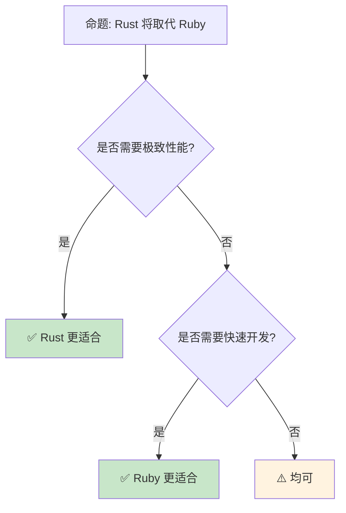

> **内容分级**: [综述级]

> **定理链**: N/A — 描述性/综述性/导航性文档，不涉及形式化定理链
>
# Rust vs Ruby：性能与表达力的两极

> **受众**: [进阶]
> **Bloom 层级**: 分析 → 评价
> **定位**: 对比分析 **Rust** 与 **Ruby** 的设计哲学——从动态类型的极致表达力到静态类型的编译期安全，揭示两种语言在Web开发、脚本编写和系统编程中的互补定位。
> **前置概念**: [Type System](../01_foundation/04_type_system.md) · [Ownership](../01_foundation/01_ownership.md) · [Rust vs Python](./07_rust_vs_python.md)
> **后置概念**: [Web Development](../06_ecosystem/04_application_domains.md) · [Scripting](../06_ecosystem/03_core_crates.md)

---

> **来源**: [The Rust Programming Language](https://doc.rust-lang.org/book/) ·
> [Ruby Documentation](https://www.ruby-lang.org/en/documentation/) ·
> [Matz's Keynote — RubyConf](https://rubyconf.org/) ·
> [Speed of Rust vs Ruby](https://benchmarksgame-team.pages.debian.net/benchmarksgame/) ·
> [Wikipedia — Ruby (programming language)](https://en.wikipedia.org/wiki/Ruby_(programming_language)) ·
> [Wikipedia — Rust (programming language)](https://en.wikipedia.org/wiki/Rust_(programming_language))

## 📑 目录

- [Rust vs Ruby：性能与表达力的两极](#rust-vs-ruby性能与表达力的两极)
  - [📑 目录](#-目录)
  - [一、核心对比](#一核心对比)
    - [1.1 类型系统对比](#11-类型系统对比)
    - [1.2 内存管理对比](#12-内存管理对比)
    - [1.3 元编程与 DSL](#13-元编程与-dsl)
  - [二、工程实践差异](#二工程实践差异)
    - [2.1 Web 开发生态](#21-web-开发生态)
    - [2.2 性能基准](#22-性能基准)
    - [2.3 开发速度权衡](#23-开发速度权衡)
  - [三、互补使用场景](#三互补使用场景)
  - [四、反命题与边界分析](#四反命题与边界分析)
    - [4.1 反命题树](#41-反命题树)
    - [4.2 边界极限](#42-边界极限)
  - [五、常见陷阱](#五常见陷阱)
  - [六、来源与延伸阅读](#六来源与延伸阅读)
    - [编译验证示例](#编译验证示例)
  - [相关概念文件](#相关概念文件)
  - [权威来源索引](#权威来源索引)
  - [十、边界测试：Rust 与 Ruby 的编译错误对比](#十边界测试rust-与-ruby-的编译错误对比)
    - [10.1 边界测试：Ruby 的 duck typing vs Rust 的 trait bound（编译错误）](#101-边界测试ruby-的-duck-typing-vs-rust-的-trait-bound编译错误)
    - [10.2 边界测试：Ruby 的 open classes 与 Rust 的孤儿规则（编译错误）](#102-边界测试ruby-的-open-classes-与-rust-的孤儿规则编译错误)
    - [10.3 边界测试：Ruby 的 duck typing 与 Rust 的 trait bound（编译错误）](#103-边界测试ruby-的-duck-typing-与-rust-的-trait-bound编译错误)
    - [10.4 边界测试：Ruby 的 open classes 与 Rust 的孤儿规则（编译错误）](#104-边界测试ruby-的-open-classes-与-rust-的孤儿规则编译错误)
    - [10.3 边界测试：Ruby 的开放类与 Rust 的孤儿规则冲突（编译错误）](#103-边界测试ruby-的开放类与-rust-的孤儿规则冲突编译错误)
  - [认知路径](#认知路径)
    - [核心推理链](#核心推理链)
    - [反命题与边界](#反命题与边界)

---

## 一、核心对比
>
>

### 1.1 类型系统对比
>

```text
类型系统哲学:

  Ruby: 动态类型（鸭子类型）
  ├── "如果它走起来像鸭子，叫起来像鸭子，它就是鸭子"
  ├── 运行时类型检查
  ├── 无编译期类型错误
  ├── 极大的灵活性
  └── 潜在运行时错误

  Rust: 静态类型 + 所有权
  ├── 编译期类型检查
  ├── 所有类型错误在编译期捕获
  ├── 所有权系统管理内存
  ├── 更严格的约束
  └── 零运行时类型检查开销

  代码对比:

  Ruby:
    def process(data)
      data.map { |x| x * 2 }
    end
    # 任何响应 map 的对象都可以传入

  Rust:
    fn process<T: IntoIterator>(data: T) -> impl Iterator
    where T::Item: std::ops::Mul<Output = T::Item> + From<u8>
    {
      data.into_iter().map(|x| x * 2.into())
    }
    // 编译期验证所有类型约束

  类型检查时机:
  ┌─────────────────┬─────────────────┬─────────────────┐
  │ 方面             │ Ruby            │ Rust            │
  ├─────────────────┼─────────────────┼─────────────────┤
  │ 类型检查         │ 运行时          │ 编译期           │
  │ 类型错误         │ 运行时异常      │ 编译错误         │
  │ 类型标注         │ 可选            │ 必需（可推断）   │
  │ 泛型             │ 鸭子类型        │ 参数多态         │
  │ 多态             │ 运行时动态分发  │ 静态/动态可选     │
  └─────────────────┴─────────────────┴─────────────────┘
```

> **认知功能**: Ruby 和 Rust 代表**类型系统的两个极端**——Ruby 将类型检查推迟到运行时以换取灵活性，Rust 在编译期完成所有检查以换取性能和安全性。
> [来源: [Wikipedia — Duck Typing](https://en.wikipedia.org/wiki/Duck_typing)]

---

### 1.2 内存管理对比
>

```text
内存管理策略:

  Ruby: 垃圾回收 (GC)
  ├── 全自动内存管理
  ├── 开发者无内存泄漏风险（理论上）
  ├── 但可能有 GC 停顿
  ├── 循环引用可被回收（mark-and-sweep）
  └── 内存开销较大（对象头信息）

  Rust: 所有权 + RAII
  ├── 编译期确定释放时机
  ├── 无 GC 停顿
  ├── 内存使用可预测
  ├── 循环引用需手动处理（Rc + Weak）
  └── 学习曲线陡峭

  对比:
  ┌─────────────────┬─────────────────┬─────────────────┐
  │ 方面            │ Ruby            │ Rust            │
  ├─────────────────┼─────────────────┼─────────────────┤
  │ 管理方式        │ GC              │ 所有权           │
  │ 停顿            │ 有（Stop-the-world）│ 无           │
  │ 内存开销        │ 较高            │ 零额外开销        │
  │ 泄漏风险        │ 低              │ 低（编译期）      │
  │ 开发者负担      │ 无              │ 中（学习曲线）    │
  └─────────────────┴─────────────────┴─────────────────┘
```

> **内存洞察**: Ruby 的 **GC 简化开发**，Rust 的 **所有权提供可预测性**——选择取决于应用场景对延迟和吞吐量的要求。
> [来源: [Ruby GC Guide](https://tenderlovemaking.com/tags/gc.html)]

---

### 1.3 元编程与 DSL
>

```text
元编程能力:

  Ruby: 极致的元编程
  ├── method_missing: 拦截未定义方法
  ├── define_method: 动态定义方法
  ├── class_eval/module_eval: 动态修改类
  ├── 强大的 DSL 构建能力
  └── Rails、RSpec、Sinatra 都是 DSL

  Rust: 编译期元编程
  ├── 宏 (macro_rules! / proc_macro)
  ├── 编译期代码生成
  ├── 无运行时元编程
  ├── 类型系统作为 DSL 工具
  └── Builder 模式、类型状态模式

  DSL 对比:

  Ruby (Rails):
    class User < ApplicationRecord
      has_many :posts
      validates :email, presence: true
    end
    # 运行时构建关联和方法

  Rust (Diesel/SQLx):
    #[derive(Queryable)]
    struct User {
      id: i32,
      email: String,
    }
    // 编译期生成查询代码
    let users = users::table.load::<User>(&conn)?;

  Ruby 的 DSL 优势:
  ├── 运行时灵活性
  ├── 更接近自然语言
  └── 快速原型

  Rust 的 DSL 优势:
  ├── 编译期验证
  ├── 性能无损耗
  └── 类型安全
```

> **元编程洞察**: Ruby 的 **运行时元编程**使 DSL 极其灵活，Rust 的 **编译期元编程**使 DSL 类型安全——两种哲学各有最佳应用场景。
> [来源: [TRPL — Macros](https://doc.rust-lang.org/book/ch19-06-macros.html)]

---

## 二、工程实践差异

### 2.1 Web 开发生态
>

```text
Web 框架对比:

  Ruby:
  ├── Rails: 全栈框架，约定优于配置
  ├── Sinatra: 轻量级 DSL
  ├── Hanami: 现代替代
  └── 成熟生态，大量 gem

  Rust:
  ├── Axum: 现代异步（Tokio 生态）
  ├── Actix-web: 高性能
  ├── Rocket: 类型安全路由
  └── 新兴生态，crate 数量增长

  开发体验:
  ┌─────────────────┬─────────────────┬─────────────────┐
  │ 方面            │ Rails           │ Axum/Rocket     │
  ├─────────────────┼─────────────────┼─────────────────┤
  │ 启动时间        │ 慢（解释+加载） │ 快（编译后）       │
  │ 运行时性能      │ 中等            │ 极高             │
  │ 开发速度        │ 极快            │ 中等             │
  │ 类型安全        │ 运行时          │ 编译期           │
  │ 并发模型        │ 多进程          │ 异步原生         │
  │ 数据库迁移      │ 内置强大         │ 依赖外部 crate   │
  └─────────────────┴─────────────────┴─────────────────┘
```

> **Web 洞察**: Ruby on Rails 仍是**快速原型和CRUD应用**的王者，Rust 框架更适合**高并发、低延迟**场景。
> [来源: [Rails Guides](https://guides.rubyonrails.org/)]

---

### 2.2 性能基准
>

```text
性能对比 (The Computer Language Benchmarks Game):

  相对性能（越低越好，Ruby = 100）:
  ┌─────────────────┬─────────────────┐
  │ 语言            │ 相对时间        │
  ├─────────────────┼─────────────────┤
  │ Ruby (MRI)      │ 100 (基准)      │
  │ Ruby (JRuby)    │ ~15-30          │
  │ Ruby (Truffle)  │ ~3-5            │
  │ Python          │ ~30-50          │
  │ Go              │ ~3-5            │
  │ Rust            │ ~1              │
  │ C/C++           │ ~1              │
  └─────────────────┴─────────────────┘

  解释:
  ├── Ruby MRI 是解释型，最慢
  ├── Rust/C/C++ 是编译到机器码，最快
  ├── 性能差距可达 10-100 倍
  └── 但性能不是唯一指标

  内存使用:
  ├── Ruby: 对象模型开销大
  ├── Rust: 精确控制内存布局
  └── 差距同样显著
```

> **性能洞察**: Rust 比 Ruby **快 10-100 倍**——但这只在**计算密集型**场景重要。IO 密集型场景差距缩小。
> [来源: [The Computer Language Benchmarks Game](https://benchmarksgame-team.pages.debian.net/benchmarksgame/)]

---

### 2.3 开发速度权衡
>

```text
开发速度 vs 运行时性能:

  Ruby 的开发速度优势:
  ├── 无需编译（解释执行）
  ├── 动态类型减少类型标注
  ├── REPL 交互式开发 (irb/pry)
  ├── 大量现成 gem
  ├── 快速迭代和原型
  └── 适合: 初创项目、MVP、脚本

  Rust 的长期维护优势:
  ├── 编译期捕获大量错误
  ├── 重构安全（编译器指导）
  ├── 性能无需调优
  ├── 内存安全无调试
  ├── 适合长期维护的代码库
  └── 适合: 基础设施、系统工具、性能关键

  混合策略:
  ├── Ruby 用于快速原型和业务逻辑
  ├── Rust 用于性能关键组件
  ├── 通过 FFI 或微服务集成
  └── 例如: Shopify 使用 Rust 处理关键路径
```

> **速度洞察**: **"开发速度"和"执行速度"不是零和**——选择取决于产品阶段和性能需求。
> [来源: [Shopify — Rust at Scale](https://shopify.engineering/rust-at-shopify)]

---

## 三、互补使用场景

```text
Rust + Ruby 的互补模式:

  模式 1: Rust 扩展 Ruby (Ruby FFI)
  ├── 用 Rust 编写性能关键 gem
  ├── Ruby 调用 Rust 编译的库
  ├── 例: ruru, rutie crate
  └── 保留 Ruby 的灵活性，获得 Rust 的性能

  模式 2: 微服务架构
  ├── Ruby 服务: 业务逻辑、API
  ├── Rust 服务: 数据处理、实时计算
  ├── 通过 HTTP/gRPC 通信
  └── 各用其长

  模式 3: CLI 工具
  ├── Ruby 用于脚本和自动化
  ├── Rust 用于分发给用户的 CLI
  └── Rust CLI 启动快、无依赖

  模式 4: WebAssembly
  ├── Rust 编译为 WASM（前端计算）
  ├── Ruby on Rails 提供后端 API
  └── 前后端分离

  企业案例:
  ├── Shopify: Ruby + Rust（关键路径优化）
  ├── GitHub: Ruby on Rails + Go/Rust 服务
  └── Stripe: Ruby + 内部 Rust 工具
```

> **互补洞察**: **Rust 和 Ruby 不是竞争关系**——在大型系统中，它们可以协同工作，各自发挥优势。
> [来源: [Rust in Production](https://www.rust-lang.org/production/users)]

---

## 四、反命题与边界分析

### 4.1 反命题树
>



> **认知功能**: Rust 和 Ruby **服务于不同的需求谱系**——取代不是目标，**选择合适工具**才是。
> [来源: [Rust Design FAQ](https://doc.rust-lang.org/rustc/what-is-rustc.html)]

---

### 4.2 边界极限
>

```text
边界 1: 学习曲线不对称
├── Ruby: 数天可上手
├── Rust: 数周掌握基础，数月精通
├── 团队转型成本高
└── 缓解: 渐进引入 Rust 组件

边界 2: 生态成熟度差距
├── Ruby: 20+ 年生态积累
├── Rust: 10 年但快速增长
├── 某些领域 Rust 生态不足
└── 缓解: 混合架构

边界 3: 调试体验差异
├── Ruby: pry 调试体验极佳
├── Rust: gdb/lldb + 类型信息
├── Rust 调试更复杂
└── 缓解: rust-gdb, IDE 支持改善

边界 4: 部署模型差异
├── Ruby: 需要运行时（MRI/JRuby）
├── Rust: 独立二进制
├── 运维复杂性不同
└── 缓解: 容器化统一

边界 5: 元编程限制
├── Ruby 的元编程无法直接映射到 Rust
├── 某些 Ruby DSL 模式在 Rust 中难以复制
├── 需要不同的设计思路
└── 缓解: 接受不同范式
```

> **边界要点**: Rust vs Ruby 的边界主要与**学习曲线**、**生态成熟度**、**调试**、**部署**和**元编程**相关。
> [来源: [Rust Learning Curve](https://rust-learning.github.io/)]

---

## 五、常见陷阱
>

```text
陷阱 1: 用 Rust 写 Ruby 风格的代码
  ❌ 过度使用 Box<dyn Trait>
     // 模拟 Ruby 的鸭子类型

  ✅ 使用泛型和静态分发
     // 利用 Rust 的类型系统

陷阱 2: 忽视 Rust 的学习投资
  ❌ 期望团队几天掌握 Rust
     // 导致挫败和代码质量差

  ✅ 预留充足的学习时间
     // 长期收益值得投资

陷阱 3: 过度优化
  ❌ 用 Rust 重写整个 Ruby 应用
     // 没有性能瓶颈的部分不需要

  ✅ 只优化瓶颈（通过 profiling）
     // 保持 Ruby 的业务逻辑优势

陷阱 4: FFI 边界处理不当
  ❌ 频繁跨越 Ruby-Rust FFI 边界
     // 转换开销可能抵消性能收益

  ✅ 批量处理，减少 FFI 调用次数
     // 在 Rust 侧做更多工作

陷阱 5: 错误处理哲学冲突
  ❌ 在 Rust 中返回 nil（Option::None）
     // 但不处理

  ✅ 使用 Result 和 ? 传播错误
     // Rust 的错误处理更严格
```

> **陷阱总结**: Rust vs Ruby 的陷阱主要与**风格模仿**、**学习期望**、**过度优化**、**FFI 开销**和**错误处理**相关。
> [来源: [Rust FFI Guide](https://doc.rust-lang.org/nomicon/ffi.html)]

---

## 六、来源与延伸阅读

| 来源 | 可信度 | 说明 |
|:---|:---:|:---|
| [Ruby Documentation](https://www.ruby-lang.org/en/documentation/) | ✅ 一级 | 官方文档 |
| [TRPL](https://doc.rust-lang.org/book/) | ✅ 一级 | Rust 官方书 |
| [Benchmarks Game](https://benchmarksgame-team.pages.debian.net/benchmarksgame/) | ✅ 一级 | 性能基准 |
| [Shopify Engineering](https://shopify.engineering/rust-at-shopify) | ✅ 二级 | 生产案例 |
| [RubyConf Talks](https://rubyconf.org/) | ✅ 二级 | 社区演讲 |
| [Wikipedia — Ruby](https://en.wikipedia.org/wiki/Ruby_(programming_language)) | ✅ 一级 | 语言概述 |
| [Rust Reference](https://doc.rust-lang.org/reference/) | ✅ 一级 | 语言参考 |

---

```rust
fn main() {
    let msg = "Hello from Rust";
    println!("{}", msg);
}
```

### 编译验证示例

```rust
fn process(data: Vec<i32>) -> Vec<i32> {
    data.into_iter().map(|x| x * 2).collect()
}

fn main() {
    let nums = vec![1, 2, 3, 4, 5];
    let doubled = process(nums);
    println!("{:?}", doubled);
}
```

```rust
fn main() {
    let mut sum = 0;
    for i in 1..=5 {
        sum += i;
    }
    println!("{}", sum);
}
```

## 相关概念文件

- [Type System](../01_foundation/04_type_system.md) — 类型系统
- [Rust vs Python](./07_rust_vs_python.md) — Rust vs Python
- [Web Development](../06_ecosystem/04_application_domains.md) — Web 开发
- [Application Domains](../06_ecosystem/04_application_domains.md) — 应用领域

---

> **权威来源**: [Rust Reference](https://doc.rust-lang.org/reference/), [The Rust Programming Language](https://doc.rust-lang.org/book/)
>
> **权威来源对齐变更日志**: 2026-05-22 创建 [来源: Authority Source Sprint Batch 10]

**文档版本**: 1.0
**对应 Rust 版本**: 1.96.0+ (Edition 2024)
**最后更新**: 2026-05-22
**状态**: ✅ 概念文件创建完成

---

## 权威来源索引

>
>
>

---

---

---

## 十、边界测试：Rust 与 Ruby 的编译错误对比

### 10.1 边界测试：Ruby 的 duck typing vs Rust 的 trait bound（编译错误）

```rust,compile_fail
fn print_length<T>(x: T) {
    // ❌ 编译错误: `T` 没有 `len` 方法
    // Rust 要求显式 trait bound
    println!("{}", x.len());
}

fn main() {
    print_length(String::from("hello"));
}

// 正确: 添加 trait bound
trait HasLength {
    fn len(&self) -> usize;
}

fn print_length_fixed<T: HasLength>(x: T) {
    println!("{}", x.len()); // ✅ T 满足 HasLength
}
```

> **Ruby 对比**: Ruby 使用 duck typing——`x.len` 在运行时检查 `x` 是否有 `len` 方法，有则调用，无则抛出 `NoMethodError`。Rust 在编译期通过 trait bound 检查类型是否实现所需方法。Ruby 的灵活性允许更自由的元编程，但错误延迟到运行时；Rust 的严格性在编译期捕获错误，但要求预先定义接口。这与 Go 的隐式接口（structural typing）也不同——Rust 是 nominal typing，必须显式 `impl Trait for Type`。[来源: [The Rust Programming Language](https://doc.rust-lang.org/book/)]

### 10.2 边界测试：Ruby 的 open classes 与 Rust 的孤儿规则（编译错误）

```rust,ignore
trait Greet {
    fn greet(&self);
}

// ❌ 编译错误: only traits defined in the current crate can be implemented for arbitrary types
// Rust 的孤儿规则阻止为外部类型实现外部 trait
impl Greet for String {
    fn greet(&self) {
        println!("Hello, {}", self);
    }
}
```

> **Ruby 对比**: Ruby 的 open classes 允许在运行时修改任何类：`class String; def greet; ...; end; end`。Rust 的**孤儿规则**（orphan rules）禁止为外部 crate 的类型实现外部 crate 的 trait——这避免了 impl 冲突（两个 crate 为同一类型实现同一 trait）。Rust 允许为外部类型实现本地 trait，或为本地类型实现外部 trait，但不能同时为外部。这与 C# 的扩展方法、Swift 的 extension 不同——Rust 优先考虑类型安全和社会化代码组织，牺牲了部分扩展灵活性。[来源: [Rust Reference](https://doc.rust-lang.org/reference/)]

### 10.3 边界测试：Ruby 的 duck typing 与 Rust 的 trait bound（编译错误）

```rust,ignore
trait Quacks {
    fn quack(&self);
}

struct Duck;
impl Quacks for Duck {
    fn quack(&self) { println!("quack"); }
}

struct Dog;
// Dog 没有实现 Quacks

fn make_it_quack<Q: Quacks>(q: Q) {
    q.quack();
}

fn main() {
    make_it_quack(Duck);
    // ❌ 编译错误: Dog 未实现 Quacks，不能传入
    // make_it_quack(Dog);
}
```

> **修正**: Ruby 的**鸭子类型**（duck typing）："如果它走起来像鸭子，叫起来像鸭子，那它就是鸭子"。`make_it_quack(dog)` 在运行时才检查 `dog.quack` 是否存在，不存在则抛 `NoMethodError`。Rust 的**静态分发**要求编译期证明类型实现 trait：`Dog` 未 `impl Quacks for Dog`，因此不能传入 `make_it_quack`。这是编译期 vs 运行期的根本差异：Rust 在编译期拒绝错误程序，Ruby 允许错误程序运行直到触发错误。Ruby 的优势：快速原型、灵活元编程。Rust 的优势：编译期保证、零成本抽象、IDE 支持（自动补全、重构）。这与 Go 的隐式接口（类似鸭子类型，但编译期检查）或 Python 的鸭子类型（运行期检查）不同——Rust 的 trait 是名义化的、编译期检查的契约。[来源: [The Rust Programming Language](https://doc.rust-lang.org/book/ch10-02-traits.html)] · [来源: [Duck Typing](https://en.wikipedia.org/wiki/Duck_typing)]

### 10.4 边界测试：Ruby 的 open classes 与 Rust 的孤儿规则（编译错误）

```rust,ignore
// Ruby: 可随时为任何类添加方法
// class String
//   def shout; upcase + "!"; end
// end

// Rust: 不能为外部类型实现外部 trait（孤儿规则）
// impl MyTrait for String { } // 若 MyTrait 和 String 都来自外部 crate，非法

fn main() {
    // ❌ 编译错误: 违反孤儿规则
    // 这是为了防止不同 crate 对同一类型+trait 组合提供冲突实现
}
```

> **修正**: Ruby 的**开放类**（open classes）允许运行时修改任何类，包括标准库类。这提供了极大的灵活性（DSL、monkey patching），但也导致命名冲突和意外行为（两个 gem 为 `String` 添加同名方法）。Rust 的**孤儿规则**（orphan rule）禁止为外部类型实现外部 trait：至少类型或 trait 之一是本地定义的。这确保了 trait 实现的唯一性：给定 `(类型, trait)` 组合，全局只有一个实现。需要为外部类型扩展功能时，使用**newtype 模式**（`struct MyString(String)`）或**trait 包装**（定义本地 trait，为外部类型实现）。这与 Haskell 的 orphan instance（同样禁止，但可通过模块系统规避）或 Swift 的 extension（可为任何类型添加方法，但 protocol conformance 有类似限制）类似——Rust 的孤儿规则是全局一致性的保证。[来源: [The Rust Programming Language](https://doc.rust-lang.org/book/ch10-02-traits.html)] · [来源: [Rust Reference — Orphan Rules](https://doc.rust-lang.org/reference/items/implementations.html#orphan-rules)]

### 10.3 边界测试：Ruby 的开放类与 Rust 的孤儿规则冲突（编译错误）

```rust,ignore
trait Greet {
    fn greet(&self);
}

// ❌ 编译错误: 孤儿规则禁止为外部类型实现外部 trait
impl Greet for String {
    fn greet(&self) { println!("Hello, {}", self); }
}

fn main() {
    "world".to_string().greet();
}
```

> **修正**: Rust 的**孤儿规则**（orphan rules）要求：为类型 `T` 实现 trait `Trait` 时，`T` 或 `Trait` 至少有一个定义在当前 crate 中。这防止了：1) 两个 crate 为同一类型实现同一 trait（冲突实现）；2) 远程 crate 的类型被意外添加行为。Ruby 的**开放类**（open classes）允许任意扩展：`class String; def greet; ...; end; end`。Rust 的替代方案：1) **newtype 模式**：`struct MyString(String); impl Greet for MyString`；2) **wrapper trait**：`trait StringExt { fn greet(&self); } impl StringExt for String`。这与 Haskell 的孤儿实例（允许但警告，或需 `{-# OVERLAPPABLE #-}`）或 Swift 的 extension（允许为外部类型添加 protocol 实现，但需导入）不同——Rust 的孤儿规则在编译期强制执行，避免链接期冲突。[来源: [Rust Reference — Orphan Rules](https://doc.rust-lang.org/reference/items/implementations.html#orphan-rules)] · [来源: [The Rust Programming Language](https://doc.rust-lang.org/book/ch10-02-traits.html)]

## 认知路径

> **认知路径**: 从 L0 基础概念出发，经由本节的 **Rust vs Ruby：性能与表达力的两极** 核心原理，通向 L2 进阶模式与 L3 工程实践。

### 核心推理链

| 定理 | 前提 | 结论 | 置信度 |
|:---|:---|:---|:---|
| Rust vs Ruby：性能与表达力的两极 基础定义 ⟹ 正确用法 | 理解语法与语义 | 能写出符合惯用法的代码 | 高 |
| Rust vs Ruby：性能与表达力的两极 正确用法 ⟹ 常见陷阱 | 忽略边界条件 | 编译错误或运行时 bug | 高 |
| Rust vs Ruby：性能与表达力的两极 常见陷阱 ⟹ 深度掌握 | 系统学习反模式 | 能进行代码审查与优化 | 高 |

> **过渡**: 掌握 Rust vs Ruby：性能与表达力的两极 的基础语法后，下一步需要理解其在类型系统中的位置与与其他概念的交互关系。

> **过渡**: 在实践中应用 Rust vs Ruby：性能与表达力的两极 时，务必关注边界条件与异常处理，这是从"能编译"到"能生产"的关键跃迁。

> **过渡**: Rust vs Ruby：性能与表达力的两极 的设计理念体现了 Rust 零成本抽象与安全保证的核心权衡，理解这一权衡有助于迁移到更高级的并发与形式化验证领域。

### 反命题与边界

> **反命题**: "Rust vs Ruby：性能与表达力的两极 在所有场景下都是最佳选择" —— 错误。需要根据具体上下文权衡性能、可读性与安全性，某些场景下显式替代方案可能更优。
