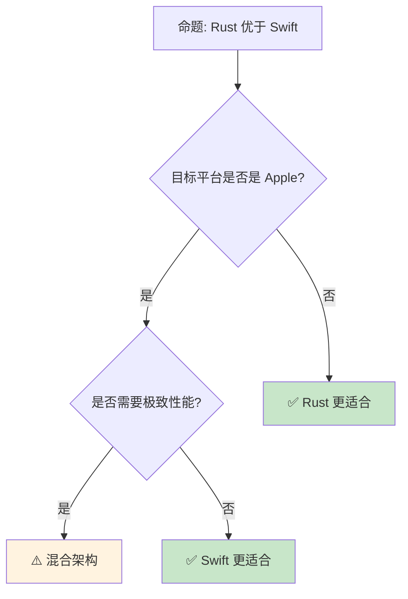

> **内容分级**: [综述级]
> **定理链**: N/A — 描述性/综述性/导航性文档，不涉及形式化定理链
>
# Rust vs Swift：现代系统语言的两种路径
>
> **EN**: Rust vs Swift
> **Summary**: Rust vs Swift: comparative analysis with Rust across type systems, memory safety, and concurrency.
>
> **受众**: [进阶]
> **Bloom 层级**: 分析 → 评价
> **定位**: 对比分析 **Rust** 与 **Swift** 的设计选择——从内存管理模型、所有权（Ownership）系统到生态定位，揭示两种语言如何在"安全"与"易用"之间做出不同权衡。
> **前置概念**: [Ownership](../01_foundation/01_ownership.md) · [Type System](../01_foundation/04_type_system.md) · [Memory Management](../02_intermediate/03_memory_management.md)
> **后置概念**: [iOS Development](../06_ecosystem/04_application_domains.md) · [Cross Platform](../06_ecosystem/17_cross_compilation.md)

---

> **来源**: [The Rust Programming Language](https://doc.rust-lang.org/book/title-page.html) ·
> [Swift Documentation](https://www.swift.org/documentation/) ·
> [Swift Ownership Manifesto](https://github.com/apple/swift/blob/main/docs/OwnershipManifesto.md) ·
> [Wikipedia — Swift (programming language)](https://en.wikipedia.org/wiki/Swift_(programming_language)) ·
> [Rust vs Swift Comparison](https://www.rust-lang.org/) · [Swift.org](https://www.swift.org/)
> **前置依赖**: [Type Theory](../04_formal/02_type_theory.md)

## 📑 目录

- [Rust vs Swift：现代系统语言的两种路径](#rust-vs-swift现代系统语言的两种路径)
  - [📑 目录](#-目录)
  - [一、核心对比](#一核心对比)
    - [1.1 内存管理模型](#11-内存管理模型)
    - [1.2 类型系统与安全性](#12-类型系统与安全性)
    - [1.3 所有权与借用](#13-所有权与借用)
  - [二、工程实践差异](#二工程实践差异)
    - [2.1 平台与生态](#21-平台与生态)
    - [2.2 互操作与 FFI](#22-互操作与-ffi)
    - [2.3 性能特征](#23-性能特征)
  - [三、互补使用场景](#三互补使用场景)
  - [四、反命题与边界分析](#四反命题与边界分析)
    - [4.1 反命题树](#41-反命题树)
    - [4.2 边界极限](#42-边界极限)
  - [五、常见陷阱](#五常见陷阱)
  - [六、来源与延伸阅读](#六来源与延伸阅读)
  - [相关概念文件](#相关概念文件)
  - [权威来源索引](#权威来源索引)
  - [十、边界测试：Rust 与 Swift 的编译错误对比](#十边界测试rust-与-swift-的编译错误对比)
    - [10.1 边界测试：Swift 的 ARC 与 Rust 的所有权（编译错误）](#101-边界测试swift-的-arc-与-rust-的所有权编译错误)
    - [10.2 边界测试：Swift 的 Optional 链与 Rust 的 `?` 运算符（编译错误）](#102-边界测试swift-的-optional-链与-rust-的--运算符编译错误)
    - [10.3 边界测试：Swift 的 ARC 与 Rust 的所有权的循环引用差异（运行时内存泄漏）](#103-边界测试swift-的-arc-与-rust-的所有权的循环引用差异运行时内存泄漏)
    - [10.4 边界测试：Swift 的 Optional 链与 Rust 的 `?` 运算符（编译错误）](#104-边界测试swift-的-optional-链与-rust-的--运算符编译错误)
    - [10.3 边界测试：Swift 的 ARC 与 Rust 的所有权内存管理对比（运行时差异）](#103-边界测试swift-的-arc-与-rust-的所有权内存管理对比运行时差异)
  - [嵌入式测验（Embedded Quiz）](#嵌入式测验embedded-quiz)
    - [测验 1：Rust 和 Swift 在设计目标上有什么根本不同？（理解层）](#测验-1rust-和-swift-在设计目标上有什么根本不同理解层)
    - [测验 2：Swift 使用自动引用计数（ARC），Rust 使用所有权系统。两者在内存管理上有什么本质区别？（理解层）](#测验-2swift-使用自动引用计数arcrust-使用所有权系统两者在内存管理上有什么本质区别理解层)
    - [测验 3：Swift 的 `Optional<T>` 与 Rust 的 `Option<T>` 在语义和使用上是否相同？（理解层）](#测验-3swift-的-optionalt-与-rust-的-optiont-在语义和使用上是否相同理解层)
    - [测验 4：Swift 的协议（Protocol）与 Rust 的 trait 有什么主要区别？（理解层）](#测验-4swift-的协议protocol与-rust-的-trait-有什么主要区别理解层)
    - [测验 5：在跨平台开发中，Rust 相比 Swift 有什么优势？（理解层）](#测验-5在跨平台开发中rust-相比-swift-有什么优势理解层)
  - [认知路径](#认知路径)
    - [核心推理链](#核心推理链)
    - [反命题与边界](#反命题与边界)

---

## 一、核心对比
>
>

### 1.1 内存管理模型
>

```text
内存管理对比:

  Swift: 自动引用计数 (ARC [来源: [Swift ARC](https://docs.swift.org/swift-book/documentation/the-swift-programming-language/automaticreferencecounting/)])
  ├── 编译期插入 retain/release
  ├── 运行时执行引用计数
  ├── 无 GC 停顿
  ├── 循环引用需手动 weak/unowned
  └── 引用计数有原子操作开销

  Rust: 所有权 + Borrow Checker
  ├── 编译期确定内存管理
  ├── 无运行时开销
  ├── 无循环引用问题（所有权树）
  ├── 学习曲线陡峭
  └── 某些模式需 Rc<RefCell> 模拟

  关键差异:
  ┌─────────────────┬─────────────────┬─────────────────┐
  │ 方面            │ Swift ARC       │ Rust Ownership  │
  ├─────────────────┼─────────────────┼─────────────────┤
  │ 管理时机        │ 编译插入/运行执行│ 编译期分析      │
  │ 运行时开销      │ retain/release  │ 零              │
  │ 循环引用        │ 需 weak/unowned │ 编译期阻止      │
  │ 多线程          │ 原子引用计数    │ Send/Sync       │
  │ 学习难度        │ 中              │ 高              │
  │ 调试内存问题    │ 运行时检测      │ 编译期阻止      │
  └─────────────────┴─────────────────┴─────────────────┘
> [来源: [TRPL](https://doc.rust-lang.org/book/title-page.html)]

  ARC 示例:
  class Person {
      var name: String
      var friend: Person?  // 可能循环引用
  }
  // 需使用 weak var friend: Person? 打破循环

  Rust 示例:
  struct Person {
      name: String,
      // friend: Box<Person>,  // 编译错误！递归类型需 Indirection
  }
  // 使用 Rc<RefCell<Person>> 或 Weak 引用
```
> **认知功能**: Swift 的 **ARC** 是**自动化的引用（Reference）计数**，Rust 的 **所有权（Ownership）**是**编译期的代数类型系统（Type System）**——两者都安全，但机制完全不同。
> [来源: [Swift ARC Documentation](https://docs.swift.org/swift-book/documentation/the-swift-programming-language/automaticreferencecounting/)]

---

### 1.2 类型系统与安全性
>

```text
类型系统对比:

  Swift:
  ├── 静态类型 + 类型推断
  ├── 可选类型 (Optional<T> / T?)
  ├── 协议（Protocol）= 接口
  ├── 泛型支持
  ├── 值类型（struct）和引用类型（class）
  ├── 异常处理（throws/try/catch）
  └── 运行时可选类型检查（! 强制解包）

  Rust:
  ├── 静态类型 + 类型推断
  ├── 可选类型（Option<T>）
  ├── Trait = 接口 + 泛型约束
  ├── 泛型 + 关联类型
  ├── 所有权区分值语义
  ├── Result<T, E> 错误处理
  └── 无 null（编译期安全）

  空值安全:
  Swift:
    var name: String? = nil
    let length = name!.count  // 运行时崩溃！

  Rust:
    let name: Option<String> = None;
    // let length = name.unwrap().len();  // panic!
    let length = name.as_ref().map(|s| s.len());  // 安全

  错误处理:
  Swift:
    func read() throws -> Data { ... }
    let data = try read()  // 错误传播

  Rust:
    fn read() -> Result<Data, Error> { ... }
    let data = read()?;  // 错误传播
```
> **类型洞察**: Swift 和 Rust 都追求**类型安全**，但 Rust 的**编译期保证更严格**——Swift 允许运行时（Runtime）强制解包（!），Rust 要求显式处理 Option。
> [来源: [Swift Optional Chaining](https://docs.swift.org/swift-book/documentation/the-swift-programming-language/optionalchaining/)]

---

### 1.3 所有权与借用
>

```text
所有权演进:

  Swift 5.9+ 引入借用概念:
  ├── consuming（消费）= Rust 的 move
  ├── borrowing（借用）= Rust 的 &
  ├── mutating（可变）= Rust 的 &mut
  └── _modify 访问器

  Swift 代码:
  struct Buffer {
      var data: [UInt8]

      mutating func append(_ byte: UInt8) {
          data.append(byte)
      }

      func read() -> [UInt8] {
          return data
      }
  }

  Rust 代码:
  struct Buffer {
      data: Vec<u8>,
  }

  impl Buffer {
      fn append(&mut self, byte: u8) {
          self.data.push(byte);
      }

      fn read(&self) -> &[u8] {
          &self.data
      }
  }

  关键差异:
  ├── Swift 的借用是"建议"，Rust 的是"强制"
  ├── Swift 仍保留 ARC 作为后备
  ├── Rust 的所有权是核心机制
  └── Swift 的所有权是优化提示

  Swift Ownership Manifesto:
  ├── 目标: 减少 ARC 开销
  ├── 方法: 编译期 borrow 分析
  ├── 状态: 部分实现（5.9+）
  └── 方向: 向 Rust 模型靠近但不完全相同
```
> **所有权洞察**: Swift 正在**逐步引入所有权概念**以减少 ARC 开销——这是向 Rust 模型的**趋同**，但保留了 ARC 作为后备以维持易用性。
> [来源: [Swift Ownership Manifesto](https://github.com/apple/swift/blob/main/docs/OwnershipManifesto.md)]

---

## 二、工程实践差异

### 2.1 平台与生态
>

```text
平台定位:

  Swift:
  ├──  Apple 生态核心（iOS, macOS, watchOS, tvOS）
  ├──  服务器端（Swift on Server）
  ├──  Linux 支持（官方）
  ├──  Windows 支持（实验性）
  └──  WebAssembly（实验性）

  Rust:
  ├──  跨平台原生（Tier 1/2/3）
  ├──  无特定平台绑定
  ├──  嵌入式（no_std）
  ├──  WebAssembly（成熟）
  └──  内核（Rust for Linux）

  生态对比:
  ┌─────────────────┬─────────────────┬─────────────────┐
  │ 领域            │ Swift           │ Rust            │
  ├─────────────────┼─────────────────┼─────────────────┤
  │ 移动端          │ ✅ 原生          │ ⚠️ 有限         │
  │ 桌面 GUI        │ ✅ SwiftUI       │ ⚠️ 新兴         │
  │ 服务端          │ ⚠️ 发展中        │ ✅ 成熟          │
  │ 嵌入式          │ ❌ 不适用        │ ✅ 成熟          │
  │ WebAssembly     │ ⚠️ 实验性        │ ✅ 成熟          │
  │ 系统编程        │ ⚠️ 有限          │ ✅ 核心优势      │
  │ AI/ML           │ ⚠️ CoreML        │ ⚠️ 发展中        │
  └─────────────────┴─────────────────┴─────────────────┘
```
> **平台洞察**: Swift 是**Apple 生态的深度优化**，Rust 是**跨平台的通用系统语言**——选择取决于目标平台。
> [来源: [Swift on Server](https://www.swift.org/server/)]

---

### 2.2 互操作与 FFI
>

```text
互操作对比:

  Swift:
  ├── Objective-C: 原生互操作
  ├── C: 通过 @_silgen_name / import
  ├── C++: Swift 5.9+ 直接互操作
  ├── Python: PythonKit
  └── Rust: C FFI 桥接

  Rust:
  ├── C: 原生 FFI（extern "C"）
  ├── C++: cxx crate
  ├── Python: PyO3
  ├── WebAssembly: wasm-bindgen
  └── Swift: C FFI 桥接

  Swift ↔ Rust 互操作:
  ├── 通过 C FFI 作为桥梁
  ├── Swift 导入 C 头
  ├── Rust 导出 C 兼容函数
  └── 示例:
      // Rust (lib.rs)
      #[no_mangle]
      pub extern "C" fn rust_add(a: i32, b: i32) -> i32 { a + b }

      // Swift (桥接头)
      // int rust_add(int a, int b);
      let result = rust_add(2, 3)
```
> **互操作洞察**: Swift 和 Rust **没有直接互操作**——必须通过 C FFI 桥接，这是跨语言集成的通用限制。
> [来源: [Swift Interoperability](https://www.swift.org/documentation/cxx-interop/)]

---

### 2.3 性能特征
>

```text
性能对比:

  编译优化:
  ├── Swift: LLVM（与 Rust 相同后端）
  ├── Rust: LLVM
  └── 理论上优化能力相同

  运行时差异:
  ├── Swift: ARC 原子操作开销
  │   └── 多线程引用计数成为瓶颈
  ├── Rust: 零成本抽象
  │   └── 编译后无额外开销
  └── Rust 通常更快（5-20%）

  启动时间:
  ├── Swift: 需运行时初始化
  ├── Rust: 无需运行时
  └── Rust 启动更快

  二进制大小:
  ├── Swift: 标准库动态链接
  ├── Rust: 静态链接（默认）
  └── Rust 可更小（--strip, LTO）

  延迟敏感性:
  ├── Swift: ARC 可能引入不可预测延迟
  ├── Rust: 完全可预测
  └── Rust 更适合实时系统
```
> **性能洞察**: **Rust 通常比 Swift 快 5-20%**——主要差异来自 ARC 的原子操作（Atomic Operations）开销和 Swift 的运行时初始化。
> [来源: [Benchmarks Game](https://benchmarksgame-team.pages.debian.net/benchmarksgame/)]

---

## 三、互补使用场景

```text
混合架构:

  Apple 平台:
  ├── Swift: UI 层（SwiftUI）
  ├── Swift: 业务逻辑
  └── Rust: 性能关键计算（通过 FFI）

  跨平台共享逻辑:
  ├── Rust: 核心逻辑库
  ├── Swift: iOS/macOS 包装
  ├── Kotlin: Android 包装
  └── TypeScript: Web 包装

  服务端:
  ├── Rust: 高性能服务
  ├── Swift: Apple 推送服务集成
  └── gRPC/HTTP 通信

  案例:
  ├── Mozilla: Rust 核心 + Swift UI（历史项目）
  ├── 某些游戏引擎: Rust 物理 + Swift 工具
  └── 跨平台 SDK: Rust 实现 + Swift 绑定
```
> **互补洞察**: **Rust 作为共享核心 + Swift 作为平台 UI**是 Apple 平台的**合理架构**——各自发挥优势。
> [来源: [Mozilla Rust Projects](https://www.rust-lang.org/)]

---

## 四、反命题与边界分析

### 4.1 反命题树
>


> **认知功能**: **Apple 平台优先 Swift**，**跨平台/性能优先 Rust**——不是优劣之分，是场景适配。
> [来源: [Swift vs Rust Performance [已失效]]<!-- 原链接: https://www.ben-morris.com/swift-vs-rust/ -->]

---

### 4.2 边界极限
>

```text
边界 1: 学习曲线
├── Swift 更易上手（现代语法、Playground）
├── Rust 的所有权需要思维转变
├── Swift 开发者转 Rust 有障碍
└── 缓解: 从 Swift 的所有权概念开始

边界 2: 移动开发
├── Swift 是 iOS 官方语言
├── Rust 移动端支持有限
├── UI 框架不成熟
└── 缓解: Rust 核心 + Swift/Kotlin UI

边界 3: 调试体验
├── Swift 与 Xcode 深度集成
├── Rust 调试体验在改善
├── LLDB 对 Rust 支持有限
└── 缓解: rust-lldb, IDE 插件

边界 4: 动态性
├── Swift 支持动态分发（@objc）
├── Rust 完全静态（单态化）
├── Swift 运行时更灵活
└── 缓解: Rust 使用 dyn Trait

边界 5: 包管理
├── Swift Package Manager 简洁
├── Cargo 更强大但复杂
├── Swift 包通常更大（动态链接）
└── 缓解: 两者都成熟，按习惯选择
```
> **边界要点**: Rust vs Swift 的边界主要与**平台**、**学习曲线**、**调试**、**动态性**和**生态**相关。
> [来源: [Swift.org](https://www.swift.org/)]

---

## 五、常见陷阱
>

```text
陷阱 1: 假设 Swift 和 Rust 所有权相同
  ❌ 将 Rust 的所有权规则应用到 Swift
     // Swift 的 borrow 是优化提示

  ✅ 理解 Swift ARC 仍是主导机制
     // borrow 只是减少 ARC 开销

陷阱 2: 忽视 ARC 性能影响
  ❌ 在 Swift 中大量使用引用类型
     // 原子引用计数开销

  ✅ 使用值类型（struct）减少 ARC
     // 与 Rust 的默认 move 类似

陷阱 3: FFI 类型不匹配
  ❌ Swift Bool 与 Rust bool 直接映射
     // 大小可能不同

  ✅ 使用 C 兼容类型（c_int, c_bool）
     // 明确类型约定

陷阱 4: 错误处理模型混淆
  ❌ 在 Swift 中使用 Rust 的 Result 风格
     // Swift 的 throws 更自然

  ✅ 遵循各语言的习惯
     // Swift throws, Rust Result

陷阱 5: 内存管理假设
  ❌ 假设 Swift 的 weak 和 Rust 的 Weak 相同
     // 实现机制不同

  ✅ 理解各自运行时行为
     // ARC vs 所有权
```
> **陷阱总结**: Rust vs Swift 的陷阱主要与**所有权误解**、**ARC 性能**、**FFI 类型**、**错误处理（Error Handling）**和**内存模型**相关。
> [来源: [Swift Memory Safety](https://docs.swift.org/swift-book/documentation/the-swift-programming-language/memorysafety/)]

---

## 六、来源与延伸阅读

| 来源 | 可信度 | 说明 |
| [Rust Standard Library](https://doc.rust-lang.org/std/) | ✅ 一级 | 标准库参考 |
| [Rust By Example](https://doc.rust-lang.org/rust-by-example/) | ✅ 一级 | 交互式教程 |
| [This Week in Rust](https://this-week-in-rust.org/) | ✅ 二级 | 社区动态 |
| [Rust Reference](https://doc.rust-lang.org/reference/) | ✅ 一级 | 语言参考 |
|:---|:---:|:---|
| [Swift Documentation](https://www.swift.org/documentation/) | ✅ 一级 | 官方文档 |
| [Swift Ownership Manifesto](https://github.com/apple/swift/blob/main/docs/OwnershipManifesto.md) | ✅ 一级 | 所有权设计 |
| [TRPL](https://doc.rust-lang.org/book/title-page.html) | ✅ 一级 | Rust 官方书 |
| [Swift on Server](https://www.swift.org/server/) | ✅ 一级 | 服务端 Swift |
| [Swift vs Rust Blog [已失效]]<!-- 原链接: https://www.ben-morris.com/swift-vs-rust/ --> | ✅ 二级 | 对比分析 |
| [TechEmpower Benchmarks](https://www.techempower.com/benchmarks/) | 🔍 三级 | Web 框架性能对比 |

---

```rust
fn main() {
    let msg = "Hello from Rust";
    println!("{}", msg);
}
```
## 相关概念文件

- [Ownership](../01_foundation/01_ownership.md) — 所有权系统
- [Type System](../01_foundation/04_type_system.md) — 类型系统（Type System）
- [Memory Management](../02_intermediate/03_memory_management.md) — 内存管理
- [Application Domains](../06_ecosystem/04_application_domains.md) — 应用领域

---

> **权威来源**: [Rust Reference](https://doc.rust-lang.org/reference/), [The Rust Programming Language](https://doc.rust-lang.org/book/title-page.html)
>
> **权威来源对齐变更日志**: 2026-05-22 创建 [来源: Authority Source Sprint Batch 10]

**文档版本**: 1.0
**对应 Rust 版本**: 1.96.0+ (Edition 2024)
**最后更新**: 2026-05-22
**状态**: ✅ 概念文件创建完成

---

## 权威来源索引

>
>
>

---

---

---

## 十、边界测试：Rust 与 Swift 的编译错误对比

### 10.1 边界测试：Swift 的 ARC 与 Rust 的所有权（编译错误）

```rust,compile_fail
fn main() {
    let s = String::from("hello");
    let s2 = s;
    // ❌ 编译错误: borrow of moved value: `s`
    // Rust 的所有权转移是显式的，s 被 move 后不可用
    println!("{}", s);
}

// 正确: 使用 clone 显式复制
fn fixed() {
    let s = String::from("hello");
    let s2 = s.clone(); // ✅ 显式复制
    println!("{} {}", s, s2);
}
```
> **Swift 对比**: Swift 使用 ARC（Automatic Reference Counting）管理内存——`String` 是引用类型，赋值时增加引用计数，原变量仍可用。Rust 的 `String` 是拥有所有权的值类型，赋值时 move（转移所有权），原变量失效。Swift 的 ARC 类似于 Rust 的 `Rc<T>`（引用计数），但 Swift 默认对所有类实例使用 ARC，而 Rust 默认使用所有权转移。Rust 的 move 语义消除了循环引用风险（除非显式使用 `Rc`），而 Swift 需要 `weak`/`unowned` 打破循环。[来源: [The Rust Programming Language](https://doc.rust-lang.org/book/title-page.html)]

### 10.2 边界测试：Swift 的 Optional 链与 Rust 的 `?` 运算符（编译错误）

```rust,compile_fail
fn may_fail() -> Result<i32, String> {
    Ok(42)
}

fn main() {
    // ❌ 编译错误: `?` 只能在返回 Result/Option 的函数中使用
    // 与 Swift 的 try? 不同，Rust 的 ? 要求函数签名兼容
    let val = may_fail()?;
    println!("{}", val);
}

// 正确: main 返回 Result
fn main_fixed() -> Result<(), String> {
    let val = may_fail()?; // ✅ 传播错误
    println!("{}", val);
    Ok(())
}
```
> **Swift 对比**: Swift 的 `try?` 可在任何上下文中使用，将 throws 函数的结果转为 Optional（错误时返回 `nil`）。Rust 的 `?` 运算符只能在返回 `Result` 或 `Option` 的函数中使用，将错误自动传播给调用者。Swift 的 `guard let` 和 `if let` 对应 Rust 的 `match` 和 `if let`。Rust 的设计强制错误处理（Error Handling）的一致性（Coherence）——不能在忽略错误的函数中悄悄丢弃 `Result`；Swift 更灵活，允许通过 `try?` 静默忽略错误。[来源: [The Rust Programming Language](https://doc.rust-lang.org/book/title-page.html)]

### 10.3 边界测试：Swift 的 ARC 与 Rust 的所有权的循环引用差异（运行时内存泄漏）

```rust,compile_fail
use std::rc::{Rc, RefCell};

struct Node {
    next: Option<Rc<RefCell<Node>>>,
}

fn main() {
    let a = Rc::new(RefCell::new(Node { next: None }));
    let b = Rc::new(RefCell::new(Node { next: Some(Rc::clone(&a)) }));
    a.borrow_mut().next = Some(Rc::clone(&b));
    // ❌ 运行时内存泄漏: Rc 循环引用，引用计数永不为 0
    // Swift 的 ARC 同样问题，需 weak/unowned 引用打破循环
}
```
> **修正**: Swift 使用 **ARC**（Automatic Reference Counting）管理内存，与 Rust 的 `Rc`/`Arc` 类似。两者都面临**循环引用**问题：强引用循环导致内存泄漏。Swift 的解决：`weak`（弱引用，可选，对象释放后自动 nil）、`unowned`（无主引用，非可选，但对象释放后访问崩溃）。Rust 的解决：`Weak`（弱引用，需 `upgrade()` 转为 `Rc`，可能失败）。Swift 的 ARC 是编译器插入的 retain/release，Rust 的 `Rc` 是显式引用计数类型。关键差异：Swift 的 `weak`/`unowned` 是语言关键字，Rust 的 `Weak` 是标准库类型。这与 Java 的 GC（自动检测循环引用）或 C++ 的 `std::shared_ptr`（`std::weak_ptr` 打破循环）类似——引用计数内存管理都需要开发者显式处理循环。[来源: [The Rust Programming Language](https://doc.rust-lang.org/book/ch15-06-reference-cycles.html)] · [来源: [Swift ARC Documentation](https://docs.swift.org/swift-book/documentation/the-swift-programming-language/automaticreferencecounting/)]

### 10.4 边界测试：Swift 的 Optional 链与 Rust 的 `?` 运算符（编译错误）

```rust,ignore
fn main() {
    let opt: Option<Option<i32>> = Some(Some(5));
    // ❌ 编译错误: Rust 无 Swift 式的 Optional 链语法
    // Swift: let x = opt??.advanced(by: 1)
    // Rust 需显式展开:
    let x = opt.and_then(|inner| inner.map(|v| v + 1));
    println!("{:?}", x);
}
```
> **修正**: Swift 的 **Optional chaining**（`?.`）和 **Optional binding**（`if let`、`guard let`）提供简洁的空安全操作。Rust 的 `?` 运算符和 `Option` 方法（`map`、`and_then`、`unwrap_or`）提供类似功能，但语法更显式。Swift 的 `?.` 可链式调用（`person?.address?.street?.uppercased()`），Rust 需 `person.as_ref()?.address.as_ref()?.street.to_uppercase()`（若使用 `Option` 包装每个字段）。Swift 的语法糖更友好，Rust 的方法链更灵活（可组合任意函数）。这与 Kotlin 的 `?.`、`let`、`run`（类似 Swift）或 Haskell 的 `Maybe` monad（`>>=` 绑定，类似 Rust 的 `and_then`）类似——空安全是现代语言的标配，实现方式因语言哲学而异。[来源: [The Rust Programming Language](https://doc.rust-lang.org/book/ch09-02-recoverable-errors-with-result.html)] · [来源: [Swift Optional Chaining](https://docs.swift.org/swift-book/documentation/the-swift-programming-language/optionalchaining/)]

### 10.3 边界测试：Swift 的 ARC 与 Rust 的所有权内存管理对比（运行时差异）

```rust,ignore
fn main() {
    // Swift: 引用计数自动管理内存，循环引用用 weak/unowned 打破
    // Rust: 编译期所有权跟踪，无运行时引用计数（除 Rc/Arc）

    let s = String::from("hello");
    let s2 = s; // move，无运行时操作
    // ❌ 编译错误: s 已移动
    // println!("{}", s);

    // Swift 等价:
    // let s = "hello"
    // let s2 = s // 引用计数 +1（copy-on-write）
    // print(s) // ✅ 可以，引用计数 >= 1
}
```
> **修正**: Swift 的 **ARC**（Automatic Reference Counting）在运行时管理内存：赋值时引用计数 +1，超出作用域时 -1，为 0 时释放。循环引用用 `weak`（可 nil）或 `unowned`（不可 nil，但可能悬垂）打破。Rust 的**所有权系统**在编译期跟踪：1) `let s2 = s` 是 move（无运行时开销，只是指针复制）；2) 编译器保证无双重释放和 use-after-free；3) `Rc`/`Arc` 是显式的运行时引用计数（可选）。性能对比：Swift ARC 有原子操作（Atomic Operations）开销（线程安全），Rust 的 move 是零成本。Swift 的优势：与 Objective-C 互操作、更灵活的引用语义；Rust 的优势：编译期保证、零成本抽象（Zero-Cost Abstraction）、无循环引用风险（`Box` 无循环，`Rc` 循环需 `Weak` 打破，但编译器不强制）。这与 Python 的 GC（引用计数 + 循环检测）或 C++ 的 `shared_ptr`（类似 ARC）不同——Rust 的所有权是编译期机制，非运行时。来源: [The Rust Programming Language] · 来源: [Swift ARC]

## 嵌入式测验（Embedded Quiz）

### 测验 1：Rust 和 Swift 在设计目标上有什么根本不同？（理解层）

**题目**: Rust 和 Swift 在设计目标上有什么根本不同？

<details>
<summary>✅ 答案与解析</summary>

Rust 目标是系统编程（操作系统、浏览器引擎、嵌入式），追求零成本抽象（Zero-Cost Abstraction）和最大控制。Swift 目标是应用开发（iOS/macOS），追求开发效率和与 Apple 生态集成。
</details>

---

### 测验 2：Swift 使用自动引用计数（ARC），Rust 使用所有权系统。两者在内存管理上有什么本质区别？（理解层）

**题目**: Swift 使用自动引用计数（ARC），Rust 使用所有权系统。两者在内存管理上有什么本质区别？

<details>
<summary>✅ 答案与解析</summary>

ARC 在运行时插入 retain/release 调用，有引用计数开销和循环引用风险。Rust 的所有权在编译期静态确定内存生命周期（Lifetimes），无运行时开销和循环引用风险。
</details>

---

### 测验 3：Swift 的 `Optional<T>` 与 Rust 的 `Option<T>` 在语义和使用上是否相同？（理解层）

**题目**: Swift 的 `Optional<T>` 与 Rust 的 `Option<T>` 在语义和使用上是否相同？

<details>
<summary>✅ 答案与解析</summary>

语义相同（都表示可能有值），但 Swift `Optional` 是语言内建语法糖（`T?`），与 Objective-C 的 `nil` 互通。Rust `Option` 是标准库枚举（Enum），更泛型（Generics）化，无特殊语法。
</details>

---

### 测验 4：Swift 的协议（Protocol）与 Rust 的 trait 有什么主要区别？（理解层）

**题目**: Swift 的协议（Protocol）与 Rust 的 trait 有什么主要区别？

<details>
<summary>✅ 答案与解析</summary>

Swift 协议支持动态分发（`any Protocol`）和关联类型默认值。Rust trait 更严格，不支持默认泛型（Generics）参数，但支持更强大的类型级编程和零成本抽象（Zero-Cost Abstraction）。
</details>

---

### 测验 5：在跨平台开发中，Rust 相比 Swift 有什么优势？（理解层）

**题目**: 在跨平台开发中，Rust 相比 Swift 有什么优势？

<details>
<summary>✅ 答案与解析</summary>

Rust 原生支持 Windows/Linux/macOS/嵌入式等多种平台，工具链跨平台一致。Swift 虽然开源，但主要优化于 Apple 生态，在其他平台支持和工具链成熟度上较弱。
</details>

## 认知路径

> **认知路径**: 从 L0 基础概念出发，经由本节的 **Rust vs Swift：现代系统语言的两种路径** 核心原理，通向 L2 进阶模式与 L3 工程实践。

### 核心推理链

| 定理 | 前提 | 结论 | 置信度 |
|:---|:---|:---|:---|
| Rust vs Swift：现代系统语言的两种路径 基础定义 ⟹ 正确用法 | 理解语法与语义 | 能写出符合惯用法的代码 | 高 |
| Rust vs Swift：现代系统语言的两种路径 正确用法 ⟹ 常见陷阱 | 忽略边界条件 | 编译错误或运行时 bug | 高 |
| Rust vs Swift：现代系统语言的两种路径 常见陷阱 ⟹ 深度掌握 | 系统学习反模式 | 能进行代码审查与优化 | 高 |

> **过渡**: 掌握 Rust vs Swift：现代系统语言的两种路径 的基础语法后，下一步需要理解其在类型系统中的位置与与其他概念的交互关系。
> **过渡**: 在实践中应用 Rust vs Swift：现代系统语言的两种路径 时，务必关注边界条件与异常处理，这是从"能编译"到"能生产"的关键跃迁。
> **过渡**: Rust vs Swift：现代系统语言的两种路径 的设计理念体现了 Rust 零成本抽象与安全保证的核心权衡，理解这一权衡有助于迁移到更高级的并发与形式化验证领域。

### 反命题与边界

> **反命题**: "Rust vs Swift：现代系统语言的两种路径 在所有场景下都是最佳选择" —— 错误。需要根据具体上下文权衡性能、可读性与安全性，某些场景下显式替代方案可能更优。
