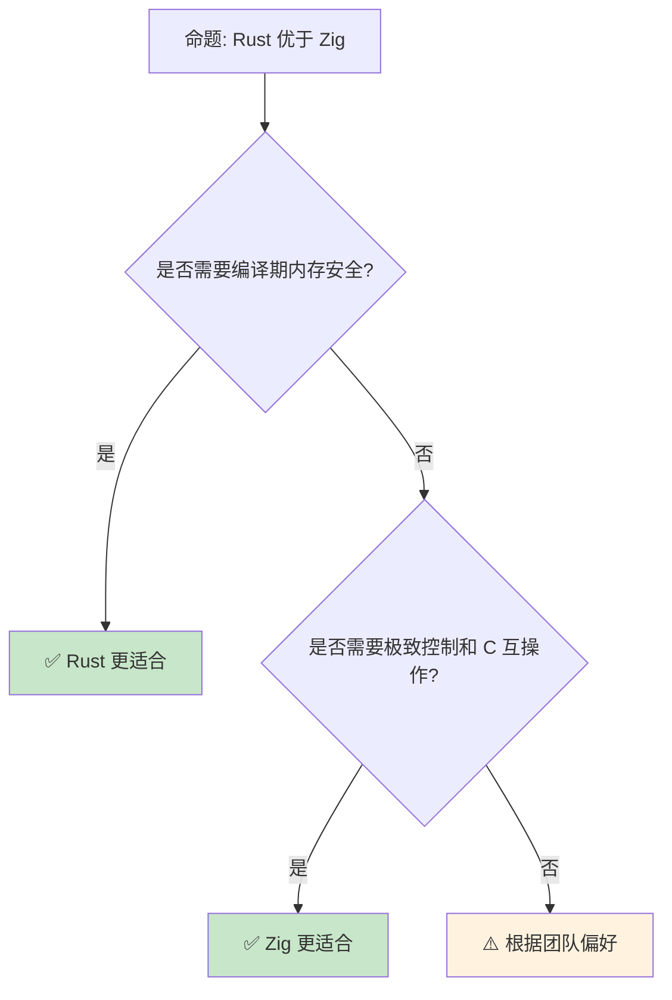

# Rust vs Zig：现代系统语言的两种哲学

> **Bloom 层级**: 分析 → 评价
> **定位**: 对比分析 **Rust** 与 **Zig** 的设计哲学——从编译期计算、错误处理到内存管理，揭示两种语言如何在"显式控制"与"抽象安全"之间做出选择。
> **前置概念**: [Ownership](../01_foundation/01_ownership.md) · [Type System](../01_foundation/04_type_system.md) · [Comptime](../06_ecosystem/03_core_crates.md)
> **后置概念**: [Cross Compilation](../06_ecosystem/17_cross_compilation.md) · [Embedded](../06_ecosystem/04_application_domains.md)

---

> **来源**: [The Rust Programming Language](https://doc.rust-lang.org/book/) · [Zig Documentation](https://ziglang.org/documentation/master/) · [Ziglang.org](https://ziglang.org/) · [Andrew Kelley — Zig Design](https://ziglang.org/learn/overview/) · [Wikipedia — Zig (programming language)](https://en.wikipedia.org/wiki/Zig_(programming_language))

## 📑 目录

- [Rust vs Zig：现代系统语言的两种哲学](#rust-vs-zig现代系统语言的两种哲学)
  - [📑 目录](#-目录)
  - [一、核心对比](#一核心对比)
    - [1.1 编译期计算](#11-编译期计算)
    - [1.2 错误处理哲学](#12-错误处理哲学)
    - [1.3 内存管理](#13-内存管理)
  - [二、工程实践差异](#二工程实践差异)
    - [2.1 构建系统](#21-构建系统)
    - [2.2 交叉编译](#22-交叉编译)
    - [2.3 C 互操作](#23-c-互操作)
  - [三、互补使用场景](#三互补使用场景)
  - [四、反命题与边界分析](#四反命题与边界分析)
    - [4.1 反命题树](#41-反命题树)
    - [4.2 边界极限](#42-边界极限)
  - [五、常见陷阱](#五常见陷阱)
  - [六、来源与延伸阅读](#六来源与延伸阅读)
  - [相关概念文件](#相关概念文件)

---

## 一、核心对比

### 1.1 编译期计算

```text
编译期计算对比:

  Zig: comptime
  ├── 任何代码都可以是 comptime
  ├── 无特殊语法，只需 comptime 关键字
  ├── 完整的编译期图灵完备语言
  ├── 可以调用任何函数（如果参数是 comptime 已知的）
  └── 哲学: 无特殊宏系统，用 comptime 替代

  Rust: const fn / 宏
  ├── const fn: 受限的编译期计算
  ├── 宏: macro_rules! / proc_macro
  ├── 类型系统: 泛型 + 关联类型
  └── 哲学: 类型系统和宏分离

  代码对比:

  Zig:
    fn makeArray(comptime T: type, comptime size: usize) [size]T {
        var arr: [size]T = undefined;
        var i: usize = 0;
        while (i < size) : (i += 1) {
            arr[i] = i;
        }
        return arr;
    }
    const my_array = makeArray(i32, 10);  // 编译期执行

  Rust:
    const fn make_array<const N: usize>() -> [i32; N] {
        let mut arr = [0; N];
        let mut i = 0;
        while i < N {
            arr[i] = i as i32;
            i += 1;
        }
        arr
    }
    const MY_ARRAY: [i32; 10] = make_array();

  关键差异:
  ├── Zig comptime 更灵活（完整语言子集）
  ├── Rust const fn 更安全（受限但保证终止）
  ├── Zig 无宏系统，comptime 替代
  └── Rust 宏系统和 const fn 互补
```

> **认知功能**: **Zig 的 comptime 是"无宏的元编程"**——用同一套语言实现编译期和运行时代码，而 Rust 保持两者分离。
> [来源: [Zig Overview — comptime](https://ziglang.org/learn/overview/#comptime)]

---

### 1.2 错误处理哲学

```text
错误处理对比:

  Zig: 显式错误联合类型
  ├── 函数返回 Union: T ! E
  ├── 调用者必须处理错误
  ├── 无隐式传播（除非 try/catch）
  ├── 错误是值，不是异常
  └── 哲学: 显式、无隐藏控制流

  Rust: Result<T, E>
  ├── 函数返回 Result
  ├── ? 运算符传播错误
  ├── match / if let 处理
  ├── 类型系统强制处理
  └── 哲学: 类型安全、可组合

  代码对比:

  Zig:
    const std = @import("std");

    fn readFile(path: []const u8) ![]u8 {
        const file = try std.fs.cwd().openFile(path, .{});
        defer file.close();
        return file.readToEndAlloc(allocator, max_size);
    }

    // 使用:
    const content = readFile("file.txt") catch |err| {
        std.debug.print("Error: {}\n", .{err});
        return;
    };

  Rust:
    fn read_file(path: &str) -> Result<String, io::Error> {
        let mut file = File::open(path)?;
        let mut content = String::new();
        file.read_to_string(&mut content)?;
        Ok(content)
    }

    // 使用:
    let content = read_file("file.txt")?;

  差异:
  ├── Zig 的 try 类似 Rust 的 ?
  ├── Zig 错误类型通常是枚举
  ├── Rust 错误类型是具体类型（可带数据）
  └── Zig 无 Result 包装，直接联合类型
```

> **错误洞察**: **Zig 的错误处理更底层、更透明**——Rust 的 Result 提供更多组合能力，Zig 的 error unions 更简单直接。
> [来源: [Zig Error Handling](https://ziglang.org/documentation/master/#Error-Set-Type)]

---

### 1.3 内存管理

```text
内存管理对比:

  Zig: 显式 + 可选分配器
  ├── 无默认分配器
  ├── 每个数据结构接受 Allocator 参数
  ├── 内存分配显式、可追踪
  ├── 无 RAII（需手动 defer）
  ├── 无所有权检查（运行时安全可选）
  └── 哲学: 程序员完全控制

  Rust: 所有权 + RAII
  ├── 编译期所有权检查
  ├── 默认栈分配，堆分配显式（Box, Vec）
  ├── RAII 自动释放
  ├── 无 GC，无运行时
  ├── 内存安全编译期保证
  └── 哲学: 安全与零成本的平衡

  代码对比:

  Zig:
    var gpa = std.heap.GeneralPurposeAllocator(.{}){};
    defer _ = gpa.deinit();
    const allocator = gpa.allocator();

    var list = std.ArrayList(i32).init(allocator);
    defer list.deinit();  // 手动释放

    try list.append(42);

  Rust:
    let mut list = Vec::new();  // 默认全局分配器
    list.push(42);
    // list 在这里自动 drop

  差异:
  ├── Zig 分配器传递显式
  ├── Rust 分配器隐式（可自定义）
  ├── Zig defer 类似 Go/Rust Drop
  ├── Rust 所有权自动管理生命周期
  └── Zig 更灵活，Rust 更安全
```

> **内存洞察**: **Zig 的显式分配器设计适合系统编程和嵌入式**——Rust 的自动所有权更适合应用开发。
> [来源: [Zig Memory](https://ziglang.org/documentation/master/#Memory)]

---

## 二、工程实践差异

### 2.1 构建系统

```text
构建系统对比:

  Zig:
  ├── zig build: 内置构建系统
  ├── build.zig: Zig 代码定义构建
  ├── 无外部依赖（自托管编译器）
  ├── C/C++ 编译内置
  └── 哲学: 零依赖，自包含

  Rust:
  ├── Cargo: 包管理 + 构建
  ├── Cargo.toml: 声明式配置
  ├── crates.io: 包注册表
  ├── 丰富的生态（10万+ crate）
  └── 哲学: 生态优先，可复用

  对比:
  ┌─────────────────┬─────────────────┬─────────────────┐
  │ 方面            │ zig build       │ Cargo           │
  ├─────────────────┼─────────────────┼─────────────────┤
  │ 配置方式        │ Zig 代码        │ TOML            │
  │ 包管理          │ 有限            │ 成熟            │
  │ 外部依赖        │ 子模块/手动     │ 自动解析        │
  │ C 编译          │ 内置            │ build.rs/cc     │
  │ 构建脚本        │ Zig             │ Rust/TOML       │
  └─────────────────┴─────────────────┴─────────────────┘
```

> [来源: [Zig Documentation](https://ziglang.org/documentation/master/)]

> **构建洞察**: **Zig 的构建系统是语言的延伸**——用 Zig 代码定义构建逻辑，而非学习新的配置语言。
> [来源: [Zig Build System](https://ziglang.org/learn/build-system/)]

---

### 2.2 交叉编译

```text
交叉编译对比:

  Zig:
  ├── 内置交叉编译支持
  ├── zig targets 列出所有目标
  ├── C 头文件解析内置
  ├── 自带 libc 实现（musl, glibc）
  └── 哲学: 交叉编译零配置

  Rust:
  ├── rustup target add 安装目标
  ├── 需要链接器（gcc, clang）
  ├── 某些目标需要额外配置
  ├── cross 工具简化流程
  └── 哲学: 工具链管理

  Zig 的优势:
  $ zig build-exe main.zig -target aarch64-linux-gnu
  // 无需安装任何额外工具！

  Rust 的流程:
  $ rustup target add aarch64-unknown-linux-gnu
  $ sudo apt install gcc-aarch64-linux-gnu
  $ cargo build --target aarch64-unknown-linux-gnu

  Zig 的差异化:
  ├── 自带 C 编译器
  ├── 可以编译 C/C++ 代码
  ├── 为 C 项目提供交叉编译
  └── 适合混合语言项目
```

> **交叉编译洞察**: **Zig 的交叉编译是杀手级特性**——它消除了 C/C++ 交叉编译的复杂性，对嵌入式和系统开发极具吸引力。
> [来源: [Zig Cross Compilation](https://ziglang.org/learn/overview/#cross-compiling-is-a-first-class-use-case)]

---

### 2.3 C 互操作

```text
C 互操作对比:

  Zig:
  ├── 导入 C 头文件: @cImport(@cInclude("foo.h"))
  ├── 内置 C ABI 支持
  ├── 可以编译为 C 兼容库
  ├── 翻译 C 代码为 Zig
  └── 哲学: C 互操作是核心功能

  Rust:
  ├── bindgen: 生成 C 绑定
  ├── cbindgen: 生成 C 头
  ├── cxx: C++ 互操作
  ├── extern "C" 块
  └── 哲学: 安全包装，逐步替换

  Zig 的 C 翻译:
  $ zig translate-c foo.h > foo.zig
  // 自动将 C 头翻译为 Zig 代码

  代码对比:

  Zig 调用 C:
    const c = @cImport({
        @cInclude("stdio.h");
    });
    c.printf("Hello, %s!\n", "world");

  Rust 调用 C:
    extern "C" {
        fn printf(fmt: *const c_char, ...) -> c_int;
    }
    unsafe {
        printf(b"Hello, world!\n".as_ptr() as *const c_char);
    }
```

> **互操作洞察**: **Zig 的 C 互操作更直接**——无需外部工具，内置头文件解析，降低了与 C 生态的集成成本。
> [来源: [Zig C Interop](https://ziglang.org/learn/overview/#integration-with-c-libraries-without-ffibindings)]

---

## 三、互补使用场景

```text
互补使用:

  Zig 的优势场景:
  ├── 嵌入式/固件（显式控制）
  ├── 操作系统/内核
  ├── 游戏引擎（与 C/C++ 互操作）
  ├── 交叉编译工具链
  ├── C 项目增量改进
  └── 需要完全控制分配的场景

  Rust 的优势场景:
  ├── Web 服务（安全 + 性能）
  ├── 系统工具（可靠 + 可维护）
  ├── 并发系统（数据竞争自由）
  ├── 大规模应用（生态 + 类型安全）
  └── 需要长期维护的代码库

  混合使用:
  ├── Zig 编译 C 依赖
  ├── Rust 提供安全高层 API
  ├── C ABI 作为边界
  └── 各自发挥优势
```

> **互补洞察**: **Zig 和 Rust 不是直接竞争**——Zig 更适合需要极端控制和 C 互操作的场景，Rust 更适合需要安全保证的大规模系统。
> [来源: [Zig Use Cases](https://ziglang.org/learn/overview/)]

---

## 四、反命题与边界分析

### 4.1 反命题树



> **认知功能**: **安全需求选 Rust，控制需求选 Zig**——两者在现代系统编程中各有不可替代的位置。
> [来源: [Zig vs Rust Discussion](https://news.ycombinator.com/item?id=27608507)]
> [来源: [Rust Reference](https://doc.rust-lang.org/reference/)]

---

### 4.2 边界极限

```text
边界 1: 生态成熟度
├── Zig 生态远小于 Rust
├── 关键库可能缺失
├── 生产环境使用较少
└── 缓解: 使用 C 库，逐步建设

边界 2: 学习曲线
├── Zig 更简单（小语言设计）
├── 但手动内存管理易出错
├── Rust 的所有权需要思维转变
└── 缓解: 根据背景选择

边界 3: 调试和工具
├── Zig 调试器支持不如 Rust
├── 缺少 Miri 等高级工具
├── 错误信息持续改善中
└── 缓解: 使用 GDB/LLDB

边界 4: 编译时间
├── Zig 编译极快（设计目标之一）
├── Rust 编译较慢（单态化 + borrow check）
├── 大型项目差异显著
└── 缓解: Rust 使用 sccache

边界 5: 标准化和稳定性
├── Zig 尚未 1.0，语言可能变化
├── Rust 已稳定多年
├── 企业级采用风险不同
└── 缓解: 评估项目时间线
```

> **边界要点**: Rust vs Zig 的边界主要与**生态成熟度**、**学习曲线**、**工具链**、**编译时间**和**稳定性**相关。
> [来源: [Zig Status](https://ziglang.org/zsf/)]

---

## 五、常见陷阱

```text
陷阱 1: 用 Zig 写 Rust 风格的代码
  ❌ 在 Zig 中尝试模拟所有权系统
     // Zig 不检查所有权

  ✅ 接受 Zig 的显式管理哲学
     // 使用 defer 和分配器模式

陷阱 2: 忽略 Zig 的 defer 限制
  ❌ defer 在 Zig 中按 LIFO 执行
     // 与 Rust 的 Drop 顺序不同

  ✅ 理解 defer 的执行顺序
     // 与作用域退出顺序相反

陷阱 3: 在 Rust 中过度使用 unsafe
  ❌ 为了"像 Zig 一样控制"使用 unsafe
     // 放弃了 Rust 的核心优势

  ✅ 只在必要时使用 unsafe
     // 并创建 safe 抽象层

陷阱 4: 混淆 comptime 和 runtime
  ❌ 假设 comptime 代码可以访问运行时数据
     // comptime 只能访问 comptime 已知值

  ✅ 明确区分编译期和运行时值
     // comptime 参数必须明确标记

陷阱 5: 忽视错误处理
  ❌ 在 Zig 中忽略错误返回值
     // 可能导致未定义行为

  ✅ 始终处理错误或使用 try/catch
     // Zig 的错误不可静默忽略
```

> **陷阱总结**: Rust vs Zig 的陷阱主要与**风格模仿**、**defer 顺序**、**unsafe 滥用**、**comptime 混淆**和**错误处理**相关。
> [来源: [Zig Documentation](https://ziglang.org/documentation/master/)]

---

## 六、来源与延伸阅读

| 来源 | 可信度 | 说明 |
|:---|:---:|:---|
| [Zig Documentation](https://ziglang.org/documentation/master/) | ✅ 一级 | 官方文档 |
| [Zig Overview](https://ziglang.org/learn/overview/) | ✅ 一级 | 设计概览 |
| [TRPL](https://doc.rust-lang.org/book/) | ✅ 一级 | Rust 官方书 |
| [Zig Build System](https://ziglang.org/learn/build-system/) | ✅ 一级 | 构建系统 |
| [Zig News](https://ziglang.org/news/) | ✅ 二级 | 社区新闻 |
| [Wikipedia — Zig](https://en.wikipedia.org/wiki/Zig_(programming_language)) | ✅ 一级 | 语言概述 |
| [TechEmpower Benchmarks](https://www.techempower.com/benchmarks/) | 🔍 三级 | 性能基准 |

---

## 相关概念文件

- [Ownership](../01_foundation/01_ownership.md) — 所有权系统
- [Type System](../01_foundation/04_type_system.md) — 类型系统
- [Cross Compilation](../06_ecosystem/17_cross_compilation.md) — 交叉编译
- [FFI](../03_advanced/05_rust_ffi.md) — 外部函数接口

---

> **权威来源**: [Rust Reference](https://doc.rust-lang.org/reference/), [The Rust Programming Language](https://doc.rust-lang.org/book/)
>
> **权威来源对齐变更日志**: 2026-05-22 创建 [来源: Authority Source Sprint Batch 10]

**文档版本**: 1.0
**对应 Rust 版本**: 1.96.0+ (Edition 2024)
**最后更新**: 2026-05-22
**状态**: ✅ 概念文件创建完成
