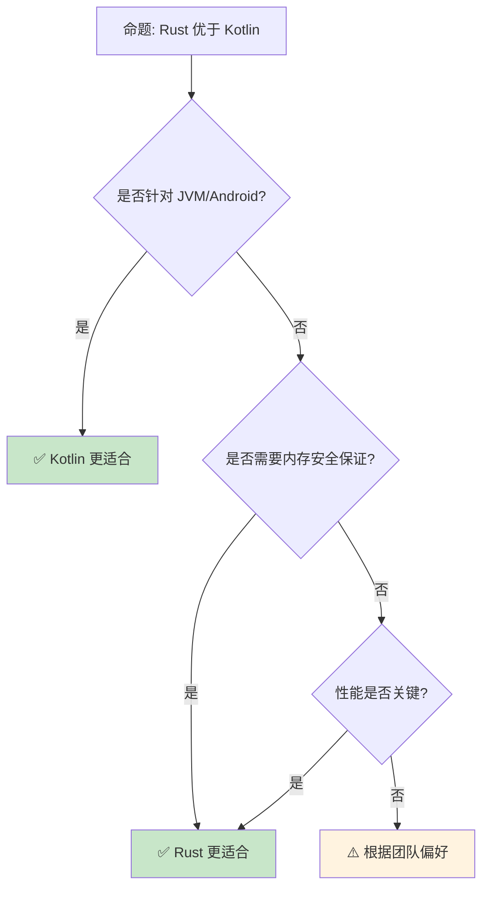

# Rust vs Kotlin：静态安全的两种路径

> **Bloom 层级**: 分析 → 评价
> **定位**: 对比分析 **Rust** 与 **Kotlin** 的设计哲学——从空安全、并发模型到平台支持，揭示静态类型语言如何在不同生态中实现安全与表达力的平衡。
> **前置概念**: [Ownership](../01_foundation/01_ownership.md) · [Type System](../01_foundation/04_type_system.md) · [Null Safety](../02_intermediate/04_error_handling.md)
> **后置概念**: [JVM Ecosystem](../06_ecosystem/03_core_crates.md) · [Android Development](../06_ecosystem/04_application_domains.md)

---

> **来源**: [The Rust Programming Language](https://doc.rust-lang.org/book/) · [Kotlin Documentation](https://kotlinlang.org/docs/home.html) · [Kotlinlang.org](https://kotlinlang.org/) · [Wikipedia — Kotlin](https://en.wikipedia.org/wiki/Kotlin_(programming_language)) · [Wikipedia — Rust](https://en.wikipedia.org/wiki/Rust_(programming_language))

## 📑 目录
> [来源: [Rust Reference](https://doc.rust-lang.org/reference/)]
>
> [来源: [TRPL](https://doc.rust-lang.org/book/)]

- [Rust vs Kotlin：静态安全的两种路径](#rust-vs-kotlin静态安全的两种路径)
  - [📑 目录](#-目录)
  - [一、核心对比](#一核心对比)
    - [1.1 空安全机制](#11-空安全机制)
    - [1.2 并发模型](#12-并发模型)
    - [1.3 平台与生态](#13-平台与生态)
  - [二、语言特性差异](#二语言特性差异)
    - [2.1 类型推断与泛型](#21-类型推断与泛型)
    - [2.2 扩展函数与 Trait](#22-扩展函数与-trait)
    - [2.3 协程与 async/await](#23-协程与-asyncawait)
  - [三、工程实践差异](#三工程实践差异)
    - [3.1 构建系统](#31-构建系统)
    - [3.2 互操作性](#32-互操作性)
    - [3.3 工具链](#33-工具链)
  - [四、反命题与边界分析](#四反命题与边界分析)
    - [4.1 反命题树](#41-反命题树)
    - [4.2 边界极限](#42-边界极限)
  - [五、常见陷阱](#五常见陷阱)
  - [六、来源与延伸阅读](#六来源与延伸阅读)
  - [相关概念文件](#相关概念文件)

---

## 一、核心对比
> [来源: [Rust Reference](https://doc.rust-lang.org/reference/)]
>
> [来源: [Rust Reference](https://doc.rust-lang.org/reference/)]

### 1.1 空安全机制

```text
空安全对比:

  Kotlin:
  ├── 可空类型: String?（可为 null）
  ├── 非空类型: String（不可为 null）
  ├── ?. 安全调用: str?.length
  ├── ?: Elvis: str ?: "default"
  ├── !! 非空断言: str!!
  ├── lateinit: 延迟初始化（运行时检查）
  └── 编译期空安全（除 lateinit、平台类型）

  Rust:
  ├── Option<T>: Some(T) 或 None
  ├── 无 null 指针
  ├── unwrap(): 显式提取
  ├── ? 传播: opt?
  ├── unwrap_or(): 默认值
  ├── if let / match: 模式匹配
  └── 编译期强制处理

  代码对比:

  Kotlin:
    fun findUser(id: Int): User? { ... }
    val user = findUser(1)
    val name = user?.name ?: "Unknown"
    // 安全访问 + 默认值

  Rust:
    fn find_user(id: u32) -> Option<User> { ... }
    let user = find_user(1);
    let name = user.map(|u| u.name).unwrap_or("Unknown".to_string());
    // 函数式组合 + 默认值

  差异:
  ├── Kotlin 更简洁（?. 链式调用）
  ├── Rust 更函数式（map, and_then）
  ├── Kotlin 有 !! 逃逸口
  ├── Rust 无逃逸口（必须处理）
  └── 两者都优于 Java 的可空性
```

> **空安全洞察**: **Kotlin 的空安全是语法糖层面的改进，Rust 的 Option 是类型系统的根本设计**——Rust 强制处理，Kotlin 允许逃逸。
> [来源: [Kotlin Null Safety](https://kotlinlang.org/docs/null-safety.html)]

---

### 1.2 并发模型

```text
并发对比:

  Kotlin:
  ├── 协程（Coroutines）: 轻量级线程
  ├── suspend 函数
  ├── 结构化并发（Structured Concurrency）
  ├── 通道（Channel）: 类似 Go
  ├── Flow: 响应式流
  ├── 共享状态需同步（Mutex、Atomic）
  └── JVM 线程调度

  Rust:
  ├── 原生线程（OS threads）
  ├── async/await + Future
  ├── 所有权保证数据竞争自由
  ├── Send + Sync trait
  ├── 通道: std::sync::mpsc / crossbeam
  ├── 运行时可选（Tokio、async-std）
  └── 编译期并发安全

  代码对比:

  Kotlin:
    suspend fun fetchData(): String = coroutineScope {
        val deferred1 = async { fetchFromApi1() }
        val deferred2 = async { fetchFromApi2() }
        deferred1.await() + deferred2.await()
    }

  Rust:
    async fn fetch_data() -> String {
        let (r1, r2) = tokio::join!(
            fetch_from_api1(),
            fetch_from_api2()
        );
        format!("{}{}", r1, r2)
    }

  差异:
  ├── Kotlin 协程更轻量（JVM 上数百万协程）
  ├── Rust async 零成本抽象
  ├── Kotlin 需要运行时（JVM）
  ├── Rust 编译期安全保证
  └── Kotlin 协程调试更友好
```

> **并发洞察**: **Kotlin 协程适合 I/O 密集型，Rust 适合计算密集型**——两者在不同场景各有优势。
> [来源: [Kotlin Coroutines](https://kotlinlang.org/docs/coroutines-overview.html)]

---

### 1.3 平台与生态

```text
平台支持对比:

  Kotlin:
  ├── JVM（主要目标）
  ├── Android（官方支持）
  ├── Native（Kotlin/Native，LLVM）
  ├── JavaScript（Kotlin/JS）
  ├── WASM（实验性）
  ├── 服务端（Spring、Ktor）
  └── 数据科学（Kotlin DL）

  Rust:
  ├── 原生（LLVM）
  ├── WASM（成熟支持）
  ├── 嵌入式（no_std）
  ├── Linux 内核（Rust for Linux）
  ├── Web 服务（Actix、Axum）
  ├── CLI 工具
  └── 游戏（Bevy）

  生态对比:
  ┌─────────────────┬─────────────────┬─────────────────┐
  │ 领域            │ Kotlin          │ Rust            │
  ├─────────────────┼─────────────────┼─────────────────┤
  │ Android         │ ✅ 首选         │ ⚠️ 有限         │
  │ Web 后端        │ ✅ Spring/Ktor  │ ✅ Actix/Axum   │
  │ 系统编程        │ ❌ 不适合       │ ✅ 原生         │
  │ 嵌入式          │ ⚠️ Native       │ ✅ no_std       │
  │ WASM            │ ⚠️ 实验性       │ ✅ 成熟         │
  │ 机器学习        │ ⚠️ 新兴         │ ⚠️ 新兴         │
  └─────────────────┴─────────────────┴─────────────────┘
```

> [来源: [Wikipedia — Kotlin](https://en.wikipedia.org/wiki/Kotlin_(programming_language))]

> **平台洞察**: **Kotlin 是 JVM 生态的最佳语言，Rust 是系统编程的最佳语言**——两者在各自主场无可替代。
> [来源: [Kotlin Multiplatform](https://kotlinlang.org/docs/multiplatform.html)]

---

## 二、语言特性差异
> [来源: [Rust Reference](https://doc.rust-lang.org/reference/)]
>
> [来源: [TRPL](https://doc.rust-lang.org/book/)]

### 2.1 类型推断与泛型

```text
类型推断对比:

  Kotlin:
  ├── 局部变量类型推断: val x = 1
  ├── 泛型: List<String>
  ├── 型变: in / out（声明处型变）
  ├── 星投影: List<*>
  ├── reified: 运行时泛型信息
  └── 类型别名: typealias

  Rust:
  ├── let x = 1（类型推断）
  ├── 泛型: Vec<String>
  ├── 型变: 无显式语法（通过生命周期推导）
  ├── 关联类型: Iterator::Item
  ├── Const Generics: [T; N]
  └── 类型别名: type

  差异:
  ├── Kotlin 型变更显式
  ├── Rust 生命周期更强大
  ├── Kotlin reified 方便反射
  ├── Rust 无运行时泛型开销
  └── 两者类型系统都强大
```

> **类型洞察**: **Kotlin 的类型系统服务于 JVM 互操作，Rust 的类型系统服务于零成本抽象**——设计目标不同。
> [来源: [Kotlin Generics](https://kotlinlang.org/docs/generics.html)]

---

### 2.2 扩展函数与 Trait

```text
扩展对比:

  Kotlin 扩展函数:
  fun String.addExclamation(): String = this + "!"
  "hello".addExclamation() // "hello!"

  Rust Trait:
  trait Exclaim {
      fn exclaim(&self) -> String;
  }
  impl Exclaim for str {
      fn exclaim(&self) -> String {
          format!("{}!", self)
      }
  }
  "hello".exclaim() // "hello!"

  差异:
  ├── Kotlin 扩展: 语法糖，静态分发
  ├── Rust Trait: 类型系统的一部分
  ├── Kotlin 扩展可访问私有成员
  ├── Rust Trait 定义接口契约
  ├── Kotlin 无 Orphan Rule
  └── Rust Orphan Rule 限制实现
```

> **扩展洞察**: **Kotlin 扩展是语法层面的便利，Rust Trait 是语义层面的抽象**——Rust 更注重类型安全。
> [来源: [Kotlin Extensions](https://kotlinlang.org/docs/extensions.html)]

---

### 2.3 协程与 async/await

```text
协程对比:

  Kotlin:
  ├── suspend 函数标记
  ├── 协程构建器: launch, async, runBlocking
  ├── 调度器: Dispatchers.Default, IO, Main
  ├── 上下文: CoroutineContext
  ├── Job: 结构化并发管理
  └── 取消: cooperative cancellation

  Rust:
  ├── async fn / async {}
  ├── .await 挂起点
  ├── 运行时: Tokio, async-std, smol
  ├── JoinHandle: 任务管理
  ├── 取消: AbortHandle
  └── Pin: 自引用类型安全

  关键差异:
  ├── Kotlin 协程是语言内置
  ├── Rust async 是库实现
  ├── Kotlin 调试更友好
  ├── Rust 性能更优（零成本）
  ├── Kotlin 更易学习
  └── Rust 更安全（所有权）
```

> **协程洞察**: **Kotlin 协程是"易用优先"，Rust async 是"性能优先"**——两者代表了不同的设计权衡。
> [来源: [Kotlin Coroutines Guide](https://kotlinlang.org/docs/coroutines-guide.html)]

---

## 三、工程实践差异
> [来源: [Rust Reference](https://doc.rust-lang.org/reference/)]
>
> [来源: [TRPL](https://doc.rust-lang.org/book/)]

### 3.1 构建系统

```text
构建系统对比:

  Kotlin:
  ├── Gradle（主要）
  ├── Maven
  ├── Kotlin Script (.kts)
  ├── 依赖: repositories + dependencies
  └── 多平台: kotlin-multiplatform

  Rust:
  ├── Cargo（唯一）
  ├── Cargo.toml
  ├── crates.io
  ├── 工作区（Workspace）
  └── 特性（Features）

  对比:
  ├── Kotlin 构建系统灵活（Gradle 配置复杂）
  ├── Rust Cargo 简单统一
  ├── Kotlin 生态成熟（JVM）
  ├── Rust 编译更快（增量编译）
  └── Kotlin 启动慢（JVM 预热）
```

> **构建洞察**: **Rust 的 Cargo 是语言工具链的典范**——简单、统一、快速，而 Kotlin 依赖复杂的 Gradle 生态。
> [来源: [Kotlin Gradle](https://kotlinlang.org/docs/gradle.html)]

---

### 3.2 互操作性

```text
互操作对比:

  Kotlin:
  ├── Java: 100% 互操作（双向）
  ├── C: 通过 JNI / JNA
  ├── Objective-C: Kotlin/Native
  ├── Swift: 有限互操作
  └── JavaScript: Kotlin/JS

  Rust:
  ├── C: FFI（零开销）
  ├── C++: cxx / bindgen
  ├── WebAssembly: wasm-bindgen
  ├── Python: PyO3
  ├── Node.js: neon
  └── 其他: 通过 C ABI

  Kotlin 的优势:
  ├── Java 生态无缝使用
  ├── Android SDK 完全访问
  ├── Spring 生态成熟
  └── 企业级库丰富

  Rust 的优势:
  ├── C ABI 原生支持
  ├── 无 GC 开销
  ├── 嵌入任何语言
  └── 系统级控制
```

> **互操作洞察**: **Kotlin 是 JVM 生态的"最佳公民"，Rust 是跨语言互操作的"通用胶水"**——两者互操作策略不同。
> [来源: [Kotlin Interop](https://kotlinlang.org/docs/java-interop.html)]

---

### 3.3 工具链

```text
工具链对比:

  Kotlin:
  ├── IntelliJ IDEA（最佳支持）
  ├── Android Studio
  ├── Kotlin Playground
  ├── Dokka（文档生成）
  ├── ktlint（代码风格）
  └── 调试器（JVM 成熟）

  Rust:
  ├── rust-analyzer（LSP）
  ├── VS Code / Vim / Emacs
  ├── Rust Playground
  ├── rustdoc（文档生成）
  ├── clippy（lint）
  ├── rustfmt（格式化）
  ├── cargo（包管理）
  └── Miri（未定义行为检测）

  IDE 体验:
  ├── Kotlin: IntelliJ 无敌
  ├── Rust: rust-analyzer 接近
  ├── Kotlin 重构更强大
  ├── Rust 类型推断更准确
  └── 两者都有出色的 IDE 支持
```

> **工具链洞察**: **Kotlin 的 IntelliJ 支持是行业标杆，Rust 的 rust-analyzer 是开源社区奇迹**——两者都提供顶级开发体验。
> [来源: [Kotlin Tools](https://kotlinlang.org/docs/command-line.html)]

---

## 四、反命题与边界分析
> [来源: [Rust Reference](https://doc.rust-lang.org/reference/)]
>
> [来源: [Rust Reference](https://doc.rust-lang.org/reference/)]

### 4.1 反命题树



> **认知功能**: **JVM/Android 选 Kotlin，系统/性能选 Rust**——两者在现代语言生态中互补而非竞争。
> [来源: [Kotlin vs Rust Comparison](https://kotlinlang.org/docs/comparison-to-java.html)]
> [来源: [Rust Reference](https://doc.rust-lang.org/reference/)]

---

### 4.2 边界极限

```text
边界 1: 编译时间
├── Kotlin 编译快（增量编译成熟）
├── Rust 编译慢（单态化 + borrow check）
├── Kotlin 有 Gradle 缓存
└── Rust 有 sccache

边界 2: 运行时性能
├── Kotlin: JVM JIT 优化好，但启动慢
├── Rust: AOT 编译，启动快，内存少
├── Kotlin GC 停顿
└── Rust 无 GC，但 borrow check 限制

边界 3: 学习曲线
├── Kotlin: 对 Java 开发者友好
├── Rust: 所有权需要思维转变
├── Kotlin 更易上手
└── Rust 更陡峭但回报高

边界 4: 元编程
├── Kotlin: 强（反射、KSP、编译器插件）
├── Rust: 中（宏、过程宏、const fn）
├── Kotlin 反射更强大
└── Rust 宏编译期安全

边界 5: 生态成熟度
├── Kotlin: JVM 生态巨大
├── Rust:  crates 增长快
├── Kotlin 企业库丰富
└── Rust 系统库优质
```

> **边界要点**: Rust vs Kotlin 的边界与**编译时间**、**运行时**、**学习曲线**、**元编程**和**生态**相关。
> [来源: [Kotlin Roadmap](https://kotlinlang.org/docs/roadmap.html)]

---

## 五、常见陷阱
> [来源: [Rust Reference](https://doc.rust-lang.org/reference/)]

```text
陷阱 1: 在 Rust 中写 Kotlin 风格代码
  ❌ 过度使用 Rc/Arc 模拟 GC
     let x = Rc::new(RefCell::new(vec![]));

  ✅ 利用所有权和借用
     let mut x = vec![];
     // 直接传递

陷阱 2: 在 Kotlin 中写 Rust 风格代码
  ❌ 过度使用 !! 模拟 Rust 的 panic
     val x = nullable!!

  ✅ 使用 ?. 和 ?: 处理空值
     val x = nullable ?: default

陷阱 3: 忽略平台差异
  ❌ 假设 Kotlin/Native 性能与 Rust 相同
     // K/N 有 GC 和运行时开销

  ✅ 在性能关键场景选 Rust
     // Kotlin 用于业务逻辑

陷阱 4: 协程与线程混淆
  ❌ 在 Rust 中假设 async = 协程
     // Rust async 是状态机，不是协程

  ✅ 理解 Tokio 运行时模型
     // async/await + 运行时调度

陷阱 5: 互操作过度乐观
  ❌ 假设 Kotlin/Java 互操作零成本
     // 有装箱和 JNI 开销

  ✅ 使用 @JvmInline value class
     // 减少装箱
```

> **陷阱总结**: Rust vs Kotlin 的陷阱主要与**风格模仿**、**空安全**、**平台假设**、**并发模型**和**互操作**相关。
> [来源: [Kotlin Documentation](https://kotlinlang.org/docs/home.html)]

---

## 六、来源与延伸阅读
> [来源: [Rust Reference](https://doc.rust-lang.org/reference/)]

| 来源 | 可信度 | 说明 |
|:---|:---:|:---|
| [Kotlin Documentation](https://kotlinlang.org/docs/home.html) | ✅ 一级 | 官方文档 |
| [TRPL](https://doc.rust-lang.org/book/) | ✅ 一级 | Rust 官方书 |
| [Kotlin vs Java](https://kotlinlang.org/docs/comparison-to-java.html) | ✅ 一级 | 对比 |
| [Kotlin Coroutines](https://kotlinlang.org/docs/coroutines-overview.html) | ✅ 一级 | 协程 |
| [Kotlin Multiplatform](https://kotlinlang.org/docs/multiplatform.html) | ✅ 一级 | 多平台 |
| [Wikipedia — Kotlin](https://en.wikipedia.org/wiki/Kotlin_(programming_language)) | ✅ 一级 | 语言概述 |
| [TechEmpower Benchmarks](https://www.techempower.com/benchmarks/) | 🔍 三级 | 性能基准 |

---

## 相关概念文件
> [来源: [Rust Reference](https://doc.rust-lang.org/reference/)]
>
> [来源: [Rust Reference](https://doc.rust-lang.org/reference/)]

- [Ownership](../01_foundation/01_ownership.md) — 所有权
- [Type System](../01_foundation/04_type_system.md) — 类型系统
- [Error Handling](../02_intermediate/04_error_handling.md) — 错误处理
- [Async](../03_advanced/02_async.md) — 异步编程

---

> **权威来源**: [Rust Reference](https://doc.rust-lang.org/reference/), [Kotlin Documentation](https://kotlinlang.org/docs/home.html)
>
> **权威来源对齐变更日志**: 2026-05-22 创建 [来源: Authority Source Sprint Batch 11]

**文档版本**: 1.0
**对应 Rust 版本**: 1.96.0+ (Edition 2024)
**最后更新**: 2026-05-22
**状态**: ✅ 概念文件创建完成
