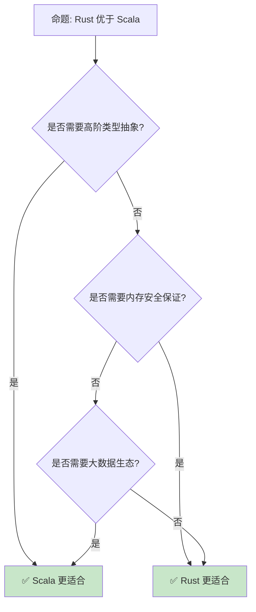

# Rust vs Scala：类型系统的两种哲学

> **Bloom 层级**: 分析 → 评价
> **定位**: 对比分析 **Rust** 与 **Scala** 的设计哲学——从类型推断、模式匹配到并发模型，揭示两种语言如何在类型表达力和运行时表示之间做出选择。
> **前置概念**: [Ownership](../01_foundation/01_ownership.md) · [Type System](../01_foundation/04_type_system.md) · [Generics](../02_intermediate/02_generics.md)
> **后置概念**: [JVM Ecosystem](../06_ecosystem/03_core_crates.md) · [Functional Programming](../05_comparative/03_paradigm_matrix.md)

---

> **来源**: [The Rust Programming Language](https://doc.rust-lang.org/book/) · [Scala Documentation](https://docs.scala-lang.org/) · [Scala Book](https://docs.scala-lang.org/scala3/book/introduction.html) · [Wikipedia — Scala](https://en.wikipedia.org/wiki/Scala_(programming_language)) · [Wikipedia — Rust](https://en.wikipedia.org/wiki/Rust_(programming_language))

## 📑 目录

- [Rust vs Scala：类型系统的两种哲学](#rust-vs-scala类型系统的两种哲学)
  - [📑 目录](#-目录)
  - [一、核心对比](#一核心对比)
    - [1.1 类型系统](#11-类型系统)
    - [1.2 模式匹配](#12-模式匹配)
    - [1.3 并发模型](#13-并发模型)
  - [二、语言特性差异](#二语言特性差异)
    - [2.1 类型推断](#21-类型推断)
    - [2.2 隐式与 Trait](#22-隐式与-trait)
    - [2.3 宏系统](#23-宏系统)
  - [三、工程实践差异](#三工程实践差异)
    - [3.1 构建系统](#31-构建系统)
    - [3.2 互操作性](#32-互操作性)
  - [四、反命题与边界分析](#四反命题与边界分析)
    - [4.1 反命题树](#41-反命题树)
    - [4.2 边界极限](#42-边界极限)
  - [五、常见陷阱](#五常见陷阱)
  - [六、来源与延伸阅读](#六来源与延伸阅读)
  - [相关概念文件](#相关概念文件)

---

## 一、核心对比

### 1.1 类型系统

```text
类型系统对比:

  Scala:
  ├── 静态类型 + 强类型
  ├── 子类型多态（继承）
  ├── 参数多态（泛型）
  ├── 特设多态（隐式）
  ├── 高阶类型（Higher-Kinded Types）
  ├── 类型构造器抽象
  └── 类型擦除（JVM）

  Rust:
  ├── 静态类型 + 强类型
  ├── 参数多态（泛型）
  ├── 特设多态（Trait）
  ├── 无继承（组合优先）
  ├── 无高阶类型（直接）
  ├── 单态化（零成本）
  └── 无类型擦除

  高阶类型对比:
  Scala: trait Functor[F[_]] { def map[A, B](fa: F[A])(f: A => B): F[B] }
  Rust:  trait Functor { type Item; fn map<B, F: Fn(Self::Item) -> B>(self, f: F) -> impl Functor<Item = B>; }
  // Rust 通过 GAT 和 impl Trait 间接实现

  代码对比:

  Scala:
    def map[F[_]: Functor, A, B](fa: F[A])(f: A => B): F[B] =
      implicitly[Functor[F]].map(fa)(f)

  Rust:
    fn map<I, F, B>(iter: I, f: F) -> impl Iterator<Item = B>
    where
        I: Iterator,
        F: Fn(I::Item) -> B,
    {
        iter.map(f)
    }
```

> **类型洞察**: **Scala 的类型系统更表达丰富（HKT），Rust 的类型系统更安全（所有权）**——两者代表了不同的设计哲学。
> [来源: [Scala Type System](https://docs.scala-lang.org/scala3/book/types-intro.html)]

---

### 1.2 模式匹配

```text
模式匹配对比:

  Scala:
  ├── 强大的 extractors
  ├── 守卫条件（guards）
  ├── 密封 trait（sealed trait）
  ├── 编译期穷尽性检查
  └── 可以匹配任意对象

  Rust:
  ├── 结构化模式匹配
  ├── 守卫条件
  ├── 枚举（enum）天然封闭
  ├── 编译期穷尽性检查
  └── 不可反驳/可反驳模式

  代码对比:

  Scala:
    val result = expr match {
      case Some(x) if x > 0 => x
      case None => 0
      case _ => -1
    }

  Rust:
    let result = match expr {
        Some(x) if x > 0 => x,
        None => 0,
        _ => -1,
    };

  差异:
  ├── Scala 匹配更灵活（运行时类型匹配）
  ├── Rust 匹配更高效（编译期优化）
  ├── Scala 有 extractors 自定义模式
  └── Rust 的 match 是表达式（返回值）
```

> **匹配洞察**: **Scala 的模式匹配更灵活，Rust 的模式匹配更高效**——两者都提供编译期穷尽性检查。
> [来源: [Scala Pattern Matching](https://docs.scala-lang.org/tour/pattern-matching.html)]

---

### 1.3 并发模型

```text
并发对比:

  Scala:
  ├── Actor 模型（Akka）
  ├── Future/Promise
  ├── 并行集合
  ├── STM（软件事务内存）
  └── JVM 线程模型

  Rust:
  ├── 所有权保证线程安全
  ├── async/await
  ├── Send/Sync trait
  ├── 无数据竞争
  └── 原生线程

  Actor 模型:
  Scala/Akka: 消息传递，状态隔离
  Rust: 无内置 Actor，但可用 actix/riker

  代码对比:

  Scala:
    import scala.concurrent.Future
    import scala.concurrent.ExecutionContext.Implicits.global

    val result = for {
      a <- fetchA()
      b <- fetchB()
    } yield a + b

  Rust:
    async fn result() -> i32 {
        let (a, b) = tokio::join!(fetch_a(), fetch_b());
        a + b
    }
```

> **并发洞察**: **Scala 的 Actor 模型适合分布式，Rust 的所有权模型适合系统级**——两者各有主战场。
> [来源: [Akka](https://akka.io/)]

---

## 二、语言特性差异

### 2.1 类型推断

```text
类型推断对比:

  Scala:
  ├── Hindley-Milner 扩展
  ├── 局部类型推断
  ├── 高阶类型推断
  ├── 流敏感类型
  └── 有时需要显式标注

  Rust:
  ├── HM 风格
  ├── 强大的局部推断
  ├── 泛型约束传播
  ├── 生命周期推断
  └── 大多数情况下无需标注

  差异:
  ├── Scala 推断更强大（高阶类型）
  ├── Rust 推断更实用（生命周期）
  ├── Scala 可能类型不明确
  ├── Rust 类型通常明确
  └── 两者推断能力都强
```

> **推断洞察**: **Scala 的类型推断更学术化，Rust 的类型推断更工程化**——两者都减少样板代码。
> [来源: [Scala Type Inference](https://docs.scala-lang.org/scala3/book/types-inference.html)]

---

### 2.2 隐式与 Trait

```text
隐式（Scala）vs Trait（Rust）:

  Scala 隐式:
  ├── implicit val/def/class
  ├── 自动注入参数
  ├── 隐式转换
  ├── 隐式类（扩展方法）
  └── 上下文界定

  Rust Trait:
  ├── impl Trait for Type
  ├── Orphan Rule 限制
  ├── 显式实现
  ├── 无隐式转换
  └── 无隐式参数

  代码对比:

  Scala:
    implicit val ordering: Ordering[Person] = new Ordering[Person] {
      def compare(a: Person, b: Person): Int = a.age.compare(b.age)
    }
    // 自动使用隐式 Ordering
    val sorted = people.sorted

  Rust:
    impl Ord for Person {
        fn cmp(&self, other: &Self) -> Ordering {
            self.age.cmp(&other.age)
        }
    }
    // 显式排序
    let sorted = people.sort();

  差异:
  ├── Scala 隐式更自动（可能隐藏）
  ├── Rust Trait 更明确（显式实现）
  ├── Scala 隐式转换灵活但危险
  ├── Rust 无隐式转换（安全但啰嗦）
  └── Scala 3 改为 given/using 更明确
```

> **隐式洞察**: **Scala 的隐式是"魔法"，Rust 的 Trait 是"契约"**——Rust 更强调显式性。
> [来源: [Scala 3 Given](https://docs.scala-lang.org/scala3/book/ca-given-using-clauses.html)]

---

### 2.3 宏系统

```text
宏系统对比:

  Scala:
  ├── 编译期宏（def macros）
  ├── 准引用（quasiquotes）
  ├── 内联（inline）
  ├── 类型级编程
  └── 反射（运行时）

  Rust:
  ├── macro_rules!（声明式）
  ├── 过程宏（derive/attribute/function-like）
  ├── TokenStream 处理
  ├── 编译期执行
  └── 无运行时反射

  代码对比:

  Scala:
    inline def debug(inline expr: Any): Unit = {
      println(s"${expr} = ${expr}")
    }

  Rust:
    macro_rules! debug {
        ($expr:expr) => {
            println!("{} = {:?}", stringify!($expr), $expr);
        };
    }

  差异:
  ├── Scala 宏更强大（可访问类型信息）
  ├── Rust 宏更安全（TokenStream 限制）
  ├── Scala 宏更复杂
  ├── Rust 宏更易用
  └── Scala 3 inline 简化了部分用例
```

> **宏洞察**: **Scala 宏更强大但复杂，Rust 宏更简单但受限**——两者适合不同的元编程场景。
> [来源: [Scala Macros](https://docs.scala-lang.org/scala3/guides/macros/macros.html)]

---

## 三、工程实践差异

### 3.1 构建系统

```text
构建系统对比:

  Scala:
  ├── sbt（主要）
  ├── Mill
  ├── Gradle
  ├── Maven
  └── 依赖: Maven Central

  Rust:
  ├── Cargo（唯一）
  ├── Cargo.toml
  ├── crates.io
  └── 简单统一

  对比:
  ├── Scala 构建系统多样（sbt 复杂）
  ├── Rust Cargo 简单统一
  ├── Scala 编译慢（类型推断复杂）
  ├── Rust 编译中等（单态化）
  └── Scala 启动慢（JVM 预热）
```

> **构建洞察**: **Rust 的 Cargo 比 Scala 的 sbt 更易用**——统一工具链减少了配置负担。
> [来源: [sbt](https://www.scala-sbt.org/)]

---

### 3.2 互操作性

```text
互操作对比:

  Scala:
  ├── Java: 100% 互操作
  ├── Kotlin: 良好互操作
  ├── JavaScript: Scala.js
  ├── Native: Scala Native
  └── JVM 生态

  Rust:
  ├── C: FFI（零开销）
  ├── C++: cxx / bindgen
  ├── WebAssembly: wasm-bindgen
  ├── Python: PyO3
  └── 多语言胶水

  Scala 优势:
  ├── Java 生态无缝使用
  ├── Spark、Kafka 等大数据工具
  ├── 企业级库丰富
  └── 函数式库成熟

  Rust 优势:
  ├── C ABI 原生支持
  ├── 无 GC 开销
  ├── 系统级控制
  └── WebAssembly 优势
```

> **互操作洞察**: **Scala 是 JVM 生态的"最佳公民"，Rust 是系统编程的"通用胶水"**。
> [来源: [Scala Interop](https://docs.scala-lang.org/scala3/book/interop.html)]

---

## 四、反命题与边界分析

### 4.1 反命题树



> **认知功能**: **高阶类型/大数据选 Scala，内存安全/系统编程选 Rust**——两者在不同领域不可替代。
> [来源: [Scala vs Rust Discussion](https://users.scala-lang.org/)]

---

### 4.2 边界极限

```text
边界 1: 学习曲线
├── Scala: 类型系统复杂，概念多
├── Rust: 所有权独特，借用检查严格
├── Scala: 更学术化
└── Rust: 更工程化

边界 2: 编译时间
├── Scala: 慢（类型推断复杂）
├── Rust: 中等（单态化）
└── 两者都需要优化

边界 3: 运行时性能
├── Scala: JVM JIT 优化好，但有 GC
├── Rust: AOT 编译，无 GC，内存少
└── Rust 系统级性能更优

边界 4: 生态
├── Scala: 大数据、机器学习成熟
├── Rust: 系统工具、Web 后端增长快
└── 根据领域选择

边界 5: 团队
├── Scala: 函数式编程背景
├── Rust: 系统编程背景
└── 培训成本不同
```

> **边界要点**: Rust vs Scala 的边界与**学习曲线**、**编译时间**、**性能**、**生态**和**团队**相关。
> [来源: [Scala Documentation](https://docs.scala-lang.org/)]

---

## 五、常见陷阱

```text
陷阱 1: 在 Rust 中写 Scala 风格代码
  ❌ 过度使用 Rc/RefCell 模拟可变状态
     let x = Rc::new(RefCell::new(HashMap::new()));

  ✅ 利用所有权和不可变性
     let mut x = HashMap::new();

陷阱 2: 在 Scala 中写 Rust 风格代码
  ❌ 过度使用 val 模拟不可变
     // Scala 中 var 也是合理选择

  ✅ 根据场景选择 val/var
     // Scala 鼓励不可变，但不强制

陷阱 3: 混淆隐式和 Trait
  ❌ 在 Rust 中期望自动注入
     // Rust 无隐式参数

  ✅ 显式传递或使用类型系统
     // Rust 更明确

陷阱 4: 忽略 JVM 开销
  ❌ 用 Scala 写系统工具
     // JVM 启动慢，内存大

  ✅ 系统工具选 Rust
     // AOT 编译，启动快

陷阱 5: 过度抽象
  ❌ 用高阶类型解决简单问题
     // 增加复杂度无收益

  ✅ 保持简单
     // KISS 原则
```

> **陷阱总结**: Rust vs Scala 的陷阱主要与**风格模仿**、**隐式**、**JVM 开销**和**过度抽象**相关。
> [来源: [Scala Documentation](https://docs.scala-lang.org/)]

---

## 六、来源与延伸阅读

| 来源 | 可信度 | 说明 |
|:---|:---:|:---|
| [Scala Documentation](https://docs.scala-lang.org/) | ✅ 一级 | 官方文档 |
| [TRPL](https://doc.rust-lang.org/book/) | ✅ 一级 | Rust 官方书 |
| [Scala Book](https://docs.scala-lang.org/scala3/book/introduction.html) | ✅ 一级 | Scala 3 书 |
| [Akka](https://akka.io/) | ✅ 二级 | Actor 框架 |
| [Scala vs Rust](https://users.scala-lang.org/) | ✅ 三级 | 社区讨论 |

---

## 相关概念文件

- [Ownership](../01_foundation/01_ownership.md) — 所有权
- [Type System](../01_foundation/04_type_system.md) — 类型系统
- [Generics](../02_intermediate/02_generics.md) — 泛型
- [Paradigm Matrix](03_paradigm_matrix.md) — 范式矩阵

---

> **权威来源**: [Rust Reference](https://doc.rust-lang.org/reference/)
>
> **权威来源对齐变更日志**: 2026-05-22 创建 [来源: Authority Source Sprint Batch 12]

**文档版本**: 1.0
**对应 Rust 版本**: 1.96.0+ (Edition 2024)
**最后更新**: 2026-05-22
**状态**: ✅ 概念文件创建完成
