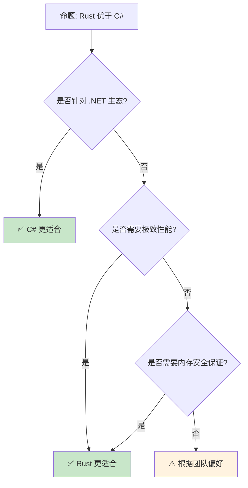

> **内容分级**: [综述级]
> **定理链**: N/A — 描述性/综述性/导航性文档，不涉及形式化定理链
>
# Rust vs C#：托管与原生之路
>
> **EN**: Rust vs C#：托管与原生之路 (Chinese)
> **Summary**: Rust vs C#：托管与原生之路 (Chinese). Core Rust concept covering cross-language comparison, mental model building, mechanism analysis.
>
> **受众**: [进阶]
> **Bloom 层级**: 分析 → 评价
> **定位**: 对比分析 **Rust** 与 **C#** 的设计哲学——从内存管理、泛型系统到异步模型，揭示托管语言与原生语言在工程实践中的权衡。
> **前置概念**: [Ownership](../01_foundation/01_ownership.md) · [Type System](../01_foundation/04_type_system.md) · [Generics](../02_intermediate/02_generics.md)
> **后置概念**: [Cross Compilation](../06_ecosystem/17_cross_compilation.md) · [.NET Ecosystem](../06_ecosystem/03_core_crates.md)

---

> **来源**: [The Rust Programming Language](https://doc.rust-lang.org/book/) · [C# Documentation](https://docs.microsoft.com/en-us/dotnet/csharp/) · [Wikipedia — C Sharp](https://en.wikipedia.org/wiki/C_Sharp_(programming_language)) · [.NET Blog](https://devblogs.microsoft.com/dotnet/) · [Wikipedia — Rust](https://en.wikipedia.org/wiki/Rust_(programming_language))

> **前置依赖**: [Type Theory](../04_formal/02_type_theory.md)

## 📑 目录
>
>

- [Rust vs C#：托管与原生之路](#rust-vs-c托管与原生之路)
  - [📑 目录](#-目录)
  - [一、核心对比](#一核心对比)
    - [1.1 内存管理](#11-内存管理)
    - [1.2 泛型系统](#12-泛型系统)
    - [1.3 异步模型](#13-异步模型)
  - [二、语言特性差异](#二语言特性差异)
    - [2.1 模式匹配](#21-模式匹配)
    - [2.2 错误处理](#22-错误处理)
    - [2.3 unsafe 与不安全代码](#23-unsafe-与不安全代码)
  - [三、工程实践差异](#三工程实践差异)
    - [3.1 构建系统](#31-构建系统)
    - [3.2 互操作性](#32-互操作性)
  - [四、反命题与边界分析](#四反命题与边界分析)
    - [4.1 反命题树](#41-反命题树)
    - [4.2 边界极限](#42-边界极限)
  - [五、常见陷阱](#五常见陷阱)
  - [六、来源与延伸阅读](#六来源与延伸阅读)
  - [相关概念文件](#相关概念文件)
  - [权威来源索引](#权威来源索引)
  - [十、边界测试：Rust 与 C# 的编译错误对比](#十边界测试rust-与-c-的编译错误对比)
    - [10.1 边界测试：C# 的 async/await 与 Rust 的 Future（编译错误）](#101-边界测试c-的-asyncawait-与-rust-的-future编译错误)
    - [10.2 边界测试：C# 的 LINQ 与 Rust 的迭代器（编译错误）](#102-边界测试c-的-linq-与-rust-的迭代器编译错误)
    - [10.3 边界测试：C# 的 async/await 与 Rust 的 `?` 在 async 中的交互（编译错误）](#103-边界测试c-的-asyncawait-与-rust-的--在-async-中的交互编译错误)
    - [10.4 边界测试：C# 的属性与 Rust 的派生宏的编译期差异（编译错误）](#104-边界测试c-的属性与-rust-的派生宏的编译期差异编译错误)
    - [10.3 边界测试：C# 的 async/await 与 Rust 的 Future 语义差异（运行时行为差异）](#103-边界测试c-的-asyncawait-与-rust-的-future-语义差异运行时行为差异)
  - [认知路径](#认知路径)
    - [核心推理链](#核心推理链)
    - [反命题与边界](#反命题与边界)

---

## 一、核心对比
>
>

### 1.1 内存管理
>

```text
内存管理对比:

  C#:
  ├── 垃圾回收（GC）
  ├── 分代回收（Gen 0/1/2）
  ├── 大对象堆（LOH）
  ├── Span<T> 栈分配
  ├── stackalloc 不安全栈分配
  └── 非托管资源需 IDisposable

  Rust:
  ├── 所有权系统
  ├── RAII 自动释放
  ├── 借用检查器
  ├── 无 GC 开销
  ├── 确定性析构
  └── unsafe 块控制底层

  代码对比:

  C#:
    using (var stream = new FileStream("file.txt", FileMode.Open))
    {
        // 使用 stream
    } // 自动 dispose

    // Span<T> 栈分配
    Span<byte> stackMemory = stackalloc byte[1024];

  Rust:
    let mut file = File::open("file.txt")?;
    // 使用 file
    // file 在这里自动 drop

    // 栈分配数组
    let stack_memory = [0u8; 1024];

  对比:
  ┌─────────────────┬─────────────────┬─────────────────┐
  │ 方面            │ C#              │ Rust            │
  ├─────────────────┼─────────────────┼─────────────────┤
  │ 内存安全        │ GC + 类型系统   │ 所有权编译期    │
  │ 延迟确定性      │ 不确定（GC）    │ 确定（RAII）    │
  │ 运行时开销      │ GC 停顿         │ 零成本          │
  │ 内存碎片        │ GC 压缩         │ 无（手动管理）  │
  │ 非托管互操作    │ unsafe / Marshal│ FFI / unsafe    │
  └─────────────────┴─────────────────┴─────────────────┘
```

> **内存洞察**: **C# 的 GC 简化了内存管理但有停顿，Rust 的所有权消除了停顿但增加了学习成本**。
> [来源: [C# Memory Management](https://docs.microsoft.com/en-us/dotnet/standard/garbage-collection/)]

---

### 1.2 泛型系统
>

```text
泛型对比:

  C#:
  ├── 运行时泛型（Reified）
  ├── 类型参数约束: where T : IComparable
  ├── 协变/逆变: out/in
  ├── 默认接口方法（C# 8）
  └── 泛型数学（C# 11）

  Rust:
  ├── 编译期单态化
  ├── Trait bound: T: Ord
  ├── 关联类型
  ├── 泛型生命周期
  └── Const Generics

  代码对比:

  C#:
    public T Max<T>(T a, T b) where T : IComparable<T>
    {
        return a.CompareTo(b) > 0 ? a : b;
    }

  Rust:
    fn max<T: Ord>(a: T, b: T) -> T {
        if a > b { a } else { b }
    }

  差异:
  ├── C# 泛型在运行时保留类型信息
  ├── Rust 泛型编译期单态化
  ├── C# 代码膨胀少
  ├── Rust 性能更优
  └── C# 反射可操作泛型参数
```

> **泛型洞察**: **C# 的 Reified 泛型更灵活，Rust 的单态化更高效**——设计目标不同。
> [来源: [C# Generics](https://docs.microsoft.com/en-us/dotnet/csharp/programming-guide/generics/)]

---

### 1.3 异步模型
>

```text
异步对比:

  C#:
  ├── async/await（Task-based）
  ├── Task = Future + 调度器
  ├── 线程池（ThreadPool）
  ├── ConfigureAwait
  └── ValueTask（值类型优化）

  Rust:
  ├── async/await（Future-based）
  ├── 无内置运行时
  ├── Tokio
  ├── Pin 保证自引用安全
  └── 零成本抽象

  代码对比:

  C#:
    async Task<string> FetchDataAsync()
    {
        var client = new HttpClient();
        return await client.GetStringAsync("https://api.example.com");
    }

  Rust:
    async fn fetch_data() -> Result<String, reqwest::Error> {
        let resp = reqwest::get("https://api.example.com").await?;
        resp.text().await
    }

  差异:
  ├── C# async 有全局调度器
  ├── Rust 运行时可选
  ├── C# Task 更重型
  ├── Rust Future 更轻量
  └── C# 有同步上下文概念
```

> **异步洞察**: **C# 的异步更集成但更重，Rust 的异步更灵活但更底层**。
> [来源: [C# Async](https://docs.microsoft.com/en-us/dotnet/csharp/programming-guide/concepts/async/)]

---

## 二、语言特性差异

### 2.1 模式匹配
>

```text
模式匹配对比:

  C#:
  ├── switch 表达式（C# 8）
  ├── 属性模式
  ├── 元组模式
  ├── 位置模式
  └── 守卫表达式（C# 9）

  Rust:
  ├── match 表达式
  ├── 结构体/枚举解构
  ├── 守卫条件
  ├── @ 绑定
  └── .. 忽略剩余

  代码对比:

  C#:
    var result = shape switch
    {
        Circle { Radius: > 0 } c => Math.PI * c.Radius * c.Radius,
        Rectangle r when r.Width == r.Height => r.Width * r.Width,
        _ => 0
    };

  Rust:
    let result = match shape {
        Circle { radius } if radius > 0.0 => PI * radius * radius,
        Rectangle { width, height } if width == height => width * width,
        _ => 0.0,
    };

  差异:
  ├── C# 模式匹配更强大（属性、关系）
  ├── Rust match 更简洁
  ├── C# 需要编译期穷尽检查
  ├── Rust 编译器强制穷尽性
  └── 两者都在快速演进
```

> **模式洞察**: **C# 9+ 的模式匹配非常强大，Rust 的 match 更严格**——两者都在借鉴对方。
> [来源: [C# Pattern Matching](https://docs.microsoft.com/en-us/dotnet/csharp/fundamentals/functional/pattern-matching)]

---

### 2.2 错误处理
>

```text
错误处理对比:

  C#:
  ├── 异常（Exception）
  ├── try/catch/finally
  ├── 自定义异常类
  ├── Nullable<T>（值类型可空）
  └── 记录类型异常（C# 9）

  Rust:
  ├── Result<T, E>
  ├── Option<T>
  ├── ? 运算符传播
  ├── panic! 不可恢复
  └── 无异常机制

  代码对比:

  C#:
    try
    {
        var result = int.Parse(input);
        return result;
    }
    catch (FormatException ex)
    {
        logger.LogError(ex, "Parse failed");
        return 0;
    }

  Rust:
    let result = input.parse::<i32>()
        .unwrap_or_else(|e| {
            log::error!("Parse failed: {}", e);
            0
        });

  差异:
  ├── C# 异常有运行时开销
  ├── Rust Result 零成本
  ├── C# 异常可跨边界传播
  ├── Rust 错误需显式处理
  └── C# 有全局异常处理器
```

> **错误洞察**: **C# 的异常适合复杂错误场景，Rust 的 Result 适合系统编程**——零成本是 Rust 的关键优势。
> [来源: [C# Exceptions](https://docs.microsoft.com/en-us/dotnet/csharp/fundamentals/exceptions/)]

---

### 2.3 unsafe 与不安全代码
>

```text
unsafe 对比:

  C#:
  ├── unsafe 块/方法
  ├── 指针操作
  ├── 固定（fixed）语句
  ├── P/Invoke（平台调用）
  ├── Span<T> 安全切片
  └── Memory<T> 所有者抽象

  Rust:
  ├── unsafe 块/函数/Trait
  ├── 原始指针
  ├── 调用 extern 函数
  ├── 实现 unsafe Trait
  ├── 访问 union 字段
  └── 借用规则绕过

  代码对比:

  C#:
    unsafe
    {
        int* ptr = &x;
        *ptr = 42;
    }

    // P/Invoke
    [DllImport("user32.dll")]
    static extern int MessageBox(IntPtr hWnd, string text, string caption, uint type);

  Rust:
    unsafe {
        let ptr = &mut x as *mut i32;
        *ptr = 42;
    }

    // FFI
    extern "C" {
        fn message_box(hwnd: isize, text: *const c_char, caption: *const c_char, type_: u32) -> i32;
    }
```

> **unsafe 洞察**: **C# 的 unsafe 更简单但能力有限，Rust 的 unsafe 更强大但责任更重**。
> [来源: [C# Unsafe Code](https://docs.microsoft.com/en-us/dotnet/csharp/language-reference/unsafe-code)]

---

## 三、工程实践差异

### 3.1 构建系统
>

```text
构建系统对比:

  C#:
  ├── MSBuild（.csproj）
  ├── NuGet 包管理
  ├── Solution 文件
  ├── dotnet CLI
  └── 项目引用

  Rust:
  ├── Cargo（Cargo.toml）
  ├── crates.io
  ├── Workspace
  ├── cargo 命令
  └── 路径/版本依赖

  对比:
  ├── C# SDK 风格项目更简洁
  ├── Rust Cargo 更统一
  ├── C# NuGet 生态成熟
  ├── Rust crates 增长快
  └── C# 需要 .NET SDK
```

> **构建洞察**: **Rust 的 Cargo 比 C# 的 MSBuild 更简洁**——单一工具链减少了配置复杂度。
> [来源: [.NET CLI](https://docs.microsoft.com/en-us/dotnet/core/tools/)]

---

### 3.2 互操作性
>

```text
互操作对比:

  C#:
  ├── P/Invoke（C 函数）
  ├── COM 互操作
  ├── C++/CLI
  ├── Blazor（WebAssembly）
  └── 反向: 托管 C# 从 C++

  Rust:
  ├── FFI（C ABI）
  ├── cxx（C++ 互操作）
  ├── wasm-bindgen（WASM）
  ├── PyO3（Python）
  └── 反向: 从任何语言调用

  C# 优势:
  ├── Windows API 无缝调用
  ├── COM 组件丰富
  ├── .NET 生态互操作
  └── WinRT 集成

  Rust 优势:
  ├── C ABI 原生支持
  ├── 无运行时依赖
  ├── 跨平台一致
  └── WASM 支持成熟
```

> **互操作洞察**: **C# 是 Windows 生态的最佳公民，Rust 是跨平台互操作的通用胶水**。
> [来源: [C# Interop](https://docs.microsoft.com/en-us/dotnet/csharp/programming-guide/interop/)]

---

## 四、反命题与边界分析

### 4.1 反命题树



> **认知功能**: **.NET/Windows 选 C#，系统/性能选 Rust**——两者在现代生态中互补。
> [来源: [.NET vs Rust Discussion](https://devblogs.microsoft.com/dotnet/)]

---

### 4.2 边界极限

```text
边界 1: 生态成熟度
├── C# .NET 生态巨大成熟
├── Rust 生态快速增长
├── 企业级库 C# 更丰富
└── 系统级库 Rust 更优质

边界 2: 学习曲线
├── C# 对 Java 开发者友好
├── Rust 所有权需要思维转变
├── C# 更易上手
└── Rust 更陡峭但回报高

边界 3: 工具链
├── C# Visual Studio 无敌
├── Rust rust-analyzer 接近
├── C# 调试体验更好
└── Rust 编译器错误信息更友好

边界 4: 运行时
├── C# 需要 .NET Runtime
├── Rust 无运行时
├── C# 自包含部署改善
└── Rust 单二进制天然优势

边界 5: 平台支持
├── C# Windows 最佳
├── Rust 跨平台原生
├── C# Linux/macOS 改善中
└── Rust 嵌入式/WASM 优势
```

> **边界要点**: Rust vs C# 的边界与**生态**、**学习曲线**、**工具链**、**运行时**和**平台**相关。
> [来源: [.NET Blog](https://devblogs.microsoft.com/dotnet/)]

---

## 五、常见陷阱
>

```text
陷阱 1: 在 Rust 中写 C# 风格代码
  ❌ 过度使用 Rc/Arc 模拟 GC
     let data = Rc::new(RefCell::new(vec![]));

  ✅ 利用所有权和借用
     let mut data = vec![];

陷阱 2: 在 C# 中写 Rust 风格代码
  ❌ 过度使用 unsafe 模拟 Rust 的底层控制
     // C# 中 unsafe 应谨慎使用

  ✅ 利用 Span<T> 和 Memory<T>
     Span<byte> span = stackalloc byte[1024];

陷阱 3: 混淆 async 模型
  ❌ 在 Rust 中假设 async = Task
     // Rust async 是状态机，无内置调度器

  ✅ 理解 Tokio 运行时模型
     tokio::spawn(async { ... });

陷阱 4: 忽略 IDisposable
  ❌ C# 中不释放非托管资源
     var stream = new FileStream(...);
     // 未 dispose

  ✅ 使用 using 语句
     using var stream = new FileStream(...);

陷阱 5: 混淆可空性
  ❌ C# 中忽略 nullable 警告
     string s = null; // 警告！

  ✅ 启用 nullable 并使用 ? 注解
     string? s = null;
```

> **陷阱总结**: Rust vs C# 的陷阱主要与**风格模仿**、**async**、**资源管理**和**可空性**相关。

---

## 六、来源与延伸阅读

| 来源 | 可信度 | 说明 |
|:---|:---:|:---|
| [C# Documentation](https://docs.microsoft.com/en-us/dotnet/csharp/) | ✅ 一级 | 官方文档 |
| [TRPL](https://doc.rust-lang.org/book/) | ✅ 一级 | Rust 官方书 |
| [.NET Blog](https://devblogs.microsoft.com/dotnet/) | ✅ 一级 | 官方博客 |
| [.NET Performance](https://github.com/dotnet/performance) | ✅ 二级 | 性能指南 |
| [C# Language Specification](https://docs.microsoft.com/en-us/dotnet/csharp/language-reference/) | ✅ 一级 | 语言规范 |
| [Wikipedia — C Sharp](https://en.wikipedia.org/wiki/C_Sharp_(programming_language)) | ✅ 一级 | 语言概述 |
| [TechEmpower Benchmarks](https://www.techempower.com/benchmarks/) | 🔍 三级 | 性能基准 |

---

```rust
fn main() {
    let nums = vec![1, 2, 3];
    let doubled: Vec<i32> = nums.iter().map(|x| x * 2).collect();
    println!("{:?}", doubled);
}
```

## 相关概念文件

- [Ownership](../01_foundation/01_ownership.md) — 所有权
- [Type System](../01_foundation/04_type_system.md) — 类型系统
- [Async](../03_advanced/02_async.md) — 异步编程
- [Error Handling](../02_intermediate/04_error_handling.md) — 错误处理

---

> **权威来源**: [Rust Reference](https://doc.rust-lang.org/reference/), [C# Documentation](https://docs.microsoft.com/en-us/dotnet/csharp/)
>
> **权威来源对齐变更日志**: 2026-05-22 创建 [来源: Authority Source Sprint Batch 12]

**文档版本**: 1.0
**对应 Rust 版本**: 1.96.0+ (Edition 2024)
**最后更新**: 2026-05-22
**状态**: ✅ 概念文件创建完成

---

## 权威来源索引

>
>
>

---

---

---

## 十、边界测试：Rust 与 C# 的编译错误对比

### 10.1 边界测试：C# 的 async/await 与 Rust 的 Future（编译错误）

```rust,compile_fail
async fn fetch() -> String {
    String::from("data")
}

fn main() {
    let future = fetch();
    // ❌ 编译错误: `main` 不是 async，不能 await
    // let data = future.await; // 编译错误
}

// 正确: 使用 block_on 或 tokio::main
#[tokio::main]
async fn main_fixed() {
    let data = fetch().await; // ✅ 在 async 上下文中 await
    println!("{}", data);
}
```

> **C# 对比**: C# 的 `async/await` 可在任何方法中使用（包括 `Main`），编译器自动生成状态机。Rust 的 `async fn` 返回 `Future`，必须在异步运行时上执行。C# 的 `Task` 与 Rust 的 `Future` 类似，但 C# 有隐式运行时（线程池），Rust 要求显式选择运行时（Tokio）。Rust 的设计更灵活（可选择无运行时），但增加了认知负担。C# 的 `await` 可在 `catch`/`finally` 中使用，Rust 的 `?` 运算符在 `async` 中有类似限制。[来源: [The Rust Programming Language](https://doc.rust-lang.org/book/)]

### 10.2 边界测试：C# 的 LINQ 与 Rust 的迭代器（编译错误）

```rust,ignore
fn main() {
    let data = vec![1, 2, 3];
    // ❌ 编译错误: Rust 没有方法语法糖，每个操作都是显式方法调用
    // let result = data.Where(|x| x > 1).Select(|x| x * 2);
    let result: Vec<_> = data.into_iter()
        .filter(|x| *x > 1)
        .map(|x| x * 2)
        .collect(); // ✅ 显式方法链
}
```

> **C# 对比**: C# 的 LINQ 提供查询表达式语法（`from x in data where x > 1 select x * 2`），编译器转换为方法调用。Rust 只有方法链（`filter().map().collect()`），没有查询表达式。LINQ 的延迟执行与 Rust 的惰性迭代器相同，但 C# 的 `IEnumerable` 有运行时开销（虚方法调用），Rust 的迭代器通过单态化实现零成本。Rust 的迭代器是更底层的抽象，性能更优，但可读性不如 LINQ 查询表达式。[来源: [Rust Standard Library](https://doc.rust-lang.org/std/)]

### 10.3 边界测试：C# 的 async/await 与 Rust 的 `?` 在 async 中的交互（编译错误）

```rust,compile_fail
async fn fetch_data() -> Result<String, reqwest::Error> {
    let resp = reqwest::get("https://example.com").await?;
    let body = resp.text().await?;
    Ok(body)
}

fn main() {
    // ❌ 编译错误: main 不是 async，不能直接使用 await
    // let body = fetch_data().await; // 错误

    // 正确: 使用 runtime block_on
    // tokio::runtime::Runtime::new().unwrap().block_on(async {
    //     let body = fetch_data().await.unwrap();
    //     println!("{}", body);
    // });
}
```

> **修正**: C# 的 `async/await` 从 `Main` 方法开始就支持：`static async Task Main()` 是合法的，编译器自动生成状态机包装。
> Rust 的 `main` 不能是 `async fn`——`main` 是程序入口点，操作系统直接调用，无运行时调度 async 任务。
> 必须用 `#[tokio::main]` 宏或手动创建 runtime 并 `block_on`。这是设计差异：C# 的 async 是语言级别的（编译器内置状态机生成），Rust 的 async 是库级别的（`Future` trait + runtime crate）。
> C# 的 `async Main` 隐藏了 runtime 创建，Rust 要求显式选择 runtime（tokio、smol [历史: async-std [已归档]]）。
> 这与 JavaScript 的 `async` 函数（自动由事件循环调度）或 Python 的 `asyncio.run()`（显式入口，类似 Rust）类似——Rust 的显式设计提供了更多控制权，但增加了样板代码。[来源: [Tokio Documentation](https://docs.rs/tokio/)] · [来源: [C# Async Main](https://docs.microsoft.com/en-us/dotnet/csharp/language-reference/compiler-options/language#asyncmain)]

### 10.4 边界测试：C# 的属性与 Rust 的派生宏的编译期差异（编译错误）

```rust,ignore
// C#: [Serializable] 是运行时反射标记
// [Serializable]
// public class MyClass { }

// Rust: #[derive(Debug)] 在编译期生成代码
#[derive(Debug)]
struct MyStruct {
    x: i32,
}

fn main() {
    let s = MyStruct { x: 5 };
    println!("{:?}", s); // ✅ 编译期生成 Debug::fmt 实现

    // ❌ 编译错误: 不能为外部类型派生 trait（孤儿规则）
    // #[derive(Debug)]
    // struct Wrapper(std::fs::File);
    // File 未实现 Debug，即使 Wrapper 是本地类型，derive 也失败
}
```

> **修正**: C# 的**属性**（attributes）主要是**元数据**：`[Serializable]`、`[Obsolete]` 等标记供运行时反射读取，不改变代码行为（少数如 `[MethodImpl]` 影响 JIT）。Rust 的**派生宏**（`#[derive(...)]`）是**代码生成**：在编译期生成 trait 实现代码（`Debug::fmt`、`Clone::clone` 等）。这是编译期 vs 运行期的根本差异：C# 的属性轻量但能力有限，Rust 的 derive 强大但增加编译时间。C# 的代码生成需额外工具（T4 模板、Source Generators），Rust 的宏是语言原生特性。这与 Java 的注解（类似 C# 属性，运行时反射）或 Python 的装饰器（运行时元编程）不同——Rust 的宏是编译期元编程，零运行时开销。[来源: [The Rust Programming Language](https://doc.rust-lang.org/book/ch19-06-macros.html)] · [来源: [C# Attributes](https://docs.microsoft.com/en-us/dotnet/csharp/programming-guide/concepts/attributes/)]

### 10.3 边界测试：C# 的 async/await 与 Rust 的 Future 语义差异（运行时行为差异）

```rust,compile_fail
async fn task1() {
    println!("task1 start");
    tokio::task::yield_now().await;
    println!("task1 end");
}

async fn task2() {
    println!("task2 start");
    tokio::task::yield_now().await;
    println!("task2 end");
}

fn main() {
    // ❌ 运行时差异: Rust 的 async/await 是惰性（lazy）的
    // let t1 = task1(); // 不执行！只是创建 Future
    // let t2 = task2(); // 同上
    // 必须用 .await 或 spawn 驱动执行

    // C# 的 async/await: 调用 async 方法立即开始执行（直到第一个 await）
    // Rust: async fn 返回 Future，执行在 .await 或 spawn 时开始
}
```

> **修正**: Rust 的 `async fn` 是**惰性**的：调用时不执行函数体，只创建一个 `Future` 状态机。执行在 `.await` 或 `tokio::spawn` 时开始。C# 的 `async` 方法是**立即执行**的：调用时立即执行到第一个 `await`，然后返回 `Task`。语义差异影响：1) Rust 的 `async fn` 可组合（`future::join(t1, t2).await`）而不立即执行；2) C# 的 `Task.WhenAll` 组合已运行的任务；3) Rust 的 `Drop` 在 Future 被取消时执行（异步清理），C# 的 `IDisposable` 需显式 `using`。这与 JavaScript 的 Promise（立即执行，类似 C#）或 Kotlin 的 suspend function（惰性，类似 Rust）不同——Rust 的惰性 async 提供更多控制，但需注意意外未执行。[来源: [The Rust Programming Language](https://doc.rust-lang.org/book/ch17-01-futures-and-syntax.html)] · [来源: [Async Rust](https://rust-lang.github.io/async-book/)]

## 认知路径

> **认知路径**: 从 L0 基础概念出发，经由本节的 **Rust vs C：托管与原生之路** 核心原理，通向 L2 进阶模式与 L3 工程实践。

### 核心推理链

| 定理 | 前提 | 结论 | 置信度 |
|:---|:---|:---|:---|
| Rust vs C：托管与原生之路 基础定义 ⟹ 正确用法 | 理解语法与语义 | 能写出符合惯用法的代码 | 高 |
| Rust vs C：托管与原生之路 正确用法 ⟹ 常见陷阱 | 忽略边界条件 | 编译错误或运行时 bug | 高 |
| Rust vs C：托管与原生之路 常见陷阱 ⟹ 深度掌握 | 系统学习反模式 | 能进行代码审查与优化 | 高 |

> **过渡**: 掌握 Rust vs C：托管与原生之路 的基础语法后，下一步需要理解其在类型系统中的位置与与其他概念的交互关系。

> **过渡**: 在实践中应用 Rust vs C：托管与原生之路 时，务必关注边界条件与异常处理，这是从"能编译"到"能生产"的关键跃迁。

> **过渡**: Rust vs C：托管与原生之路 的设计理念体现了 Rust 零成本抽象与安全保证的核心权衡，理解这一权衡有助于迁移到更高级的并发与形式化验证领域。

### 反命题与边界

> **反命题**: "Rust vs C：托管与原生之路 在所有场景下都是最佳选择" —— 错误。需要根据具体上下文权衡性能、可读性与安全性，某些场景下显式替代方案可能更优。
