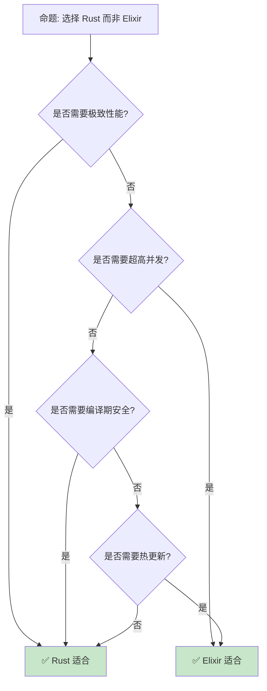

> **内容分级**: [综述级]
> **定理链**: N/A — 描述性/综述性/导航性文档，不涉及形式化定理链
>
# Rust vs Elixir 对比分析
>
> **EN**: Rust vs Elixir: Concurrency and Fault Tolerance Comparison
> **Summary**: Rust vs Elixir: comparative analysis with Rust across type systems, memory safety, and concurrency.
>
> **受众**: [进阶]
> **Bloom 层级**: 评价 → 创造
> **定位**: 对比 Rust 和 Elixir（Erlang VM）在并发模型、错误处理（Error Handling）、类型系统（Type System）和运行时（Runtime）的异同。
> **前置概念**: [Rust vs Go](02_rust_vs_go.md) · [Rust vs Haskell](03_paradigm_matrix.md) · [Async](../03_advanced/01_async/02_async.md)
> **后置概念**: [Ecosystem](../06_ecosystem/README.md) · [Concurrency](../03_advanced/00_concurrency/01_concurrency.md)

---

> **来源**: [Elixir Official](https://elixir-lang.org/) · [Erlang/OTP](https://www.erlang.org/) · [The Rust Programming Language](https://doc.rust-lang.org/book/title-page.html) · [Wikipedia — Erlang](https://en.wikipedia.org/wiki/Erlang_(programming_language)) · [Brown University — Interactive Rust Book](https://rust-book.cs.brown.edu/) · [Jung et al. — RustBelt: Securing the Foundations of Rust](https://plv.mpi-sws.org/rustbelt/popl18/) · [Itanium C++ ABI](https://itanium-cxx-abi.github.io/cxx-abi/abi.html)
> **前置依赖**: [Concurrency](../03_advanced/00_concurrency/01_concurrency.md) · [Unsafe](../03_advanced/02_unsafe/03_unsafe.md)
> **前置依赖**: [Type Theory](../04_formal/00_type_theory/02_type_theory.md)

## 📑 目录
>

- [Rust vs Elixir 对比分析](#rust-vs-elixir-对比分析)
  - [📑 目录](#-目录)
  - [一、设计哲学对比](#一设计哲学对比)
    - [1.1 错误处理哲学](#11-错误处理哲学)
    - [1.2 并发模型对比](#12-并发模型对比)
  - [二、并发模型](#二并发模型)
    - [2.1 BEAM 并发模型](#21-beam-并发模型)
    - [2.2 Rust 并发模型](#22-rust-并发模型)
  - [三、类型系统](#三类型系统)
    - [3.1 静态 vs 动态](#31-静态-vs-动态)
    - [3.2 模式匹配](#32-模式匹配)
  - [四、运行时与部署](#四运行时与部署)
  - [五、互操作](#五互操作)
  - [六、反命题与适用场景](#六反命题与适用场景)
    - [6.1 反命题树](#61-反命题树)
    - [6.2 适用场景矩阵](#62-适用场景矩阵)
  - [七、常见陷阱](#七常见陷阱)
  - [八、来源与延伸阅读](#八来源与延伸阅读)
  - [相关概念文件](#相关概念文件)
  - [权威来源索引](#权威来源索引)
  - [十、边界测试：Rust 与 Elixir 的编译错误对比](#十边界测试rust-与-elixir-的编译错误对比)
    - [10.1 边界测试：Elixir 的动态类型与 Rust 的静态模式（编译错误）](#101-边界测试elixir-的动态类型与-rust-的静态模式编译错误)
  - [十、边界测试：Rust 与 Elixir 的编译错误对比](#十边界测试rust-与-elixir-的编译错误对比-1)
    - [10.1 边界测试：Elixir 的动态类型与 Rust 的静态模式（编译错误）](#101-边界测试elixir-的动态类型与-rust-的静态模式编译错误-1)
    - [10.2 边界测试：Elixir 的进程邮箱与 Rust 的 channel（编译错误）](#102-边界测试elixir-的进程邮箱与-rust-的-channel编译错误)
    - [10.5 边界测试：Elixir 的进程隔离与 Rust 的共享内存并发（编译错误）](#105-边界测试elixir-的进程隔离与-rust-的共享内存并发编译错误)
  - [嵌入式测验（Embedded Quiz）](#嵌入式测验embedded-quiz)
    - [测验 1：Elixir 的 Actor 模型（进程隔离）与 Rust 的共享内存并发有什么根本区别？（理解层）](#测验-1elixir-的-actor-模型进程隔离与-rust-的共享内存并发有什么根本区别理解层)
    - [测验 2：Elixir 的"容错设计"（Let it crash）与 Rust 的"编译期预防"有什么哲学差异？（理解层）](#测验-2elixir-的容错设计let-it-crash与-rust-的编译期预防有什么哲学差异理解层)
    - [测验 3：Elixir 运行在 BEAM 上，为什么能达到极高的并发数（百万进程）？（理解层）](#测验-3elixir-运行在-beam-上为什么能达到极高的并发数百万进程理解层)
    - [测验 4：Rust 的 `match` 穷尽性检查与 Elixir 的 pattern matching 在编译期行为上有什么区别？（理解层）](#测验-4rust-的-match-穷尽性检查与-elixir-的-pattern-matching-在编译期行为上有什么区别理解层)
    - [测验 5：在需要高并发和容错的后端系统中，Elixir 和 Rust 如何互补使用？（理解层）](#测验-5在需要高并发和容错的后端系统中elixir-和-rust-如何互补使用理解层)
  - [认知路径](#认知路径)
    - [核心推理链](#核心推理链)
    - [反命题与边界](#反命题与边界)

---

## 一、设计哲学对比
>
>

### 1.1 错误处理哲学
>

```text
错误处理哲学对比:

  Rust:
  ├── "让错误显式" (Fail Fast)
  ├── Result<T, E> 显式传播
  ├── 编译期保证错误被处理
  └── 内存安全通过类型系统保证

  Elixir:
  ├── "Let it crash" (容错优先)
  ├── 错误通过 supervisor 恢复
  ├── 进程隔离保证系统稳定
  └── 运行时监督 (supervision tree)

  关键差异:
  ┌─────────────────┬─────────────────┬─────────────────┐
  │ 方面            │ Rust            │ Elixir          │
  ├─────────────────┼─────────────────┼─────────────────┤
  │ 错误检测        │ 编译期          │ 运行时          │
  │ 恢复策略        │ 显式处理        │ 监督树重启      │
  │ 失败代价        │ 低（类型检查）  │ 低（进程隔离）  │
  │ 整体理念        │ 预防错误        │ 拥抱失败        │
  └─────────────────┴─────────────────┴─────────────────┘
> [来源: [TRPL](https://doc.rust-lang.org/book/title-page.html)]

  代码对比:

  // Rust: 显式传播
  fn read_config(path: &str) -> Result<Config, io::Error> {
      let content = std::fs::read_to_string(path)?;
      Ok(parse(content)?)
  }

  # Elixir: Let it crash
  def read_config(path) do
      content = File.read!(path)  # 失败则崩溃
      parse(content)
  rescue
      e -> Logger.error("Failed: #{inspect(e)}")
           {:error, :config_read_failed}
  end
```

```rust
fn safe_divide(a: i32, b: i32) -> Result<i32, &'static str> {
    if b == 0 {
        Err("division by zero")
    } else {
        Ok(a / b)
    }
}

fn main() {
    let results = vec![safe_divide(10, 2), safe_divide(10, 0)];
    for r in results {
        match r {
            Ok(v) => println!("ok: {}", v),
            Err(e) => println!("err: {}", e),
        }
    }
}
```

> **认知功能**: **Rust 和 Elixir 对错误的根本态度不同**——Rust 在编译期预防，Elixir 在运行时（Runtime）恢复。
> [来源: [Elixir Error Handling](https://elixir-lang.org/getting-started/try-catch-and-rescue.html)]

---

### 1.2 并发模型对比
>

```text
并发模型核心差异:

  Rust:
  ├── 基于线程（OS 线程或 async）
  ├── 共享状态通过所有权传递
  ├── 编译期防止数据竞争
  └── 适合计算密集型

  Elixir:
  ├── 基于 Actor 模型
  ├── 进程间不共享内存
  ├── 消息传递是唯一通信方式
  └── 适合 IO 密集型、高并发

  并发能力对比:
  ┌─────────────────┬─────────────────┬─────────────────┐
  │ 方面            │ Rust            │ Elixir          │
  ├─────────────────┼─────────────────┼─────────────────┤
  │ 进程/线程开销   │ 中（线程）      │ 极低（轻量）    │
  │ 最大并发数      │ 数千线程        │ 数百万进程      │
  │ 通信方式        │ 共享内存/通道   │ 消息传递        │
  │ 内存隔离        │ 依赖所有权      │ 物理隔离        │
  │ 热更新          │ 不支持          │ 支持            │
  └─────────────────┴─────────────────┴─────────────────┘
> [来源: [Elixir Official]]
```

> **并发洞察**: **Elixir 的轻量进程和消息传递适合超高并发场景**——Rust 则在共享状态并发上提供编译期安全。
> [来源: [Erlang Processes](https://www.erlang.org/doc/reference_manual/processes.html)]

---

## 二、并发模型

### 2.1 BEAM 并发模型
>

```text
BEAM (Erlang VM) 并发:

  进程特征:
  ├── 极轻量: ~300 bytes 初始内存
  ├── 隔离: 不共享堆内存
  ├── 抢占: 公平调度，无饥饿
  └── 监督: 父子进程监督树

  消息传递:
  ├── 异步发送
  ├── 进程邮箱接收
  └── 模式匹配选择消息

  监督树:
  ├── Supervisor 监控 Worker
  ├── 重启策略: one_for_one, one_for_all, rest_for_one
  └── 系统级容错

  代码示例:

  defmodule Counter do
    use GenServer

    def start_link(initial) do
      GenServer.start_link(__MODULE__, initial)
    end

    def increment(pid), do: GenServer.cast(pid, :increment)

    def handle_cast(:increment, state) do
      {:noreply, state + 1}
    end
  end
```

> **BEAM 洞察**: **Elixir 的 Actor 模型是共享无状态并发的典范**——每个进程独立，通过消息传递协作。
> [来源: [Elixir GenServer](https://hexdocs.pm/elixir/GenServer.html)]

---

### 2.2 Rust 并发模型
>

```text
Rust 并发模型:

  线程模型:
  ├── std::thread: OS 线程
  ├── crossbeam: Scoped 线程
  └── rayon: 数据并行

  Async 模型:
  ├── Tokio: 异步运行时
  ├── async/await 语法
  └── Future 组合

  安全保证:
  ├── Send: 线程间传递所有权
  ├── Sync: 线程间共享引用
  └── 编译期检查数据竞争

  代码示例:

  use std::thread;
  use std::sync::mpsc;

  fn main() {
      let (tx, rx) = mpsc::channel();

      thread::spawn(move || {
          tx.send("Hello from thread").unwrap();
      });

      let msg = rx.recv().unwrap();
      println!("{}", msg);
  }

  // Async 版本
  use tokio::sync::mpsc;

  #[tokio::main]
  async fn main() {
      let (tx, mut rx) = mpsc::channel(100);

      tokio::spawn(async move {
          tx.send("Hello from async").await.unwrap();
      });

      if let Some(msg) = rx.recv().await {
          println!("{}", msg);
      }
  }
```

> **Rust 并发洞察**: **Rust 通过所有权（Ownership）和类型系统（Type System）实现并发安全（Concurrency Safety）**——无数据竞争的编译期保证。
> [来源: [TRPL — Concurrency](https://doc.rust-lang.org/book/ch16-00-concurrency.html)]

---

## 三、类型系统

### 3.1 静态 vs 动态
>

```text
类型系统对比:

  Rust (静态强类型):
  ├── 编译期类型检查
  ├── 无运行时类型错误
  ├── 泛型 + Trait 系统
  └── 类型推断 (let x = 5)

  Elixir (动态类型):
  ├── 运行时类型检查
  ├── 类型推断灵活
  ├── 模式匹配替代类型检查
  └── Dialyzer 可选静态分析

  类型系统对比:
  ┌─────────────────┬─────────────────┬─────────────────┐
  │ 方面            │ Rust            │ Elixir          │
  ├─────────────────┼─────────────────┼─────────────────┤
  │ 类型检查时机    │ 编译期          │ 运行时          │
  │ 类型错误发现    │ 编译时          │ 测试/运行时     │
  │ 重构安全        │ 高              │ 中              │
  │ 表达力          │ 中              │ 高              │
  │ 学习曲线        │ 陡峭            │ 平缓            │
  │ 文档内省        │ rustdoc         │ 类型规范        │
  └─────────────────┴─────────────────┴─────────────────┘
> [来源: [TRPL](https://doc.rust-lang.org/book/title-page.html)]


  Elixir 类型规范:

  @spec read_config(String.t()) :: {:ok, Config.t()} | {:error, atom()}
  def read_config(path) do
      ...
  end
```

> **类型洞察**: **Rust 在编译期捕获错误，Elixir 在运行时（Runtime）灵活处理**——各有优劣。
> [来源: [Elixir Typespecs](https://hexdocs.pm/elixir/typespecs.html)]

---

### 3.2 模式匹配
>

```text
模式匹配对比:

  Rust:
  ├── match 表达式
  ├── 穷尽性检查
  ├── 绑定变量
  └── 不可变绑定

  Elixir:
  ├── match 运算符 (=)
  ├── case 表达式
  ├── 函数头多子句
  └── 可重新绑定

  代码对比:

  // Rust match
  match result {
      Ok(value) => println!("{}", value),
      Err(e) => eprintln!("Error: {}", e),
  }

  # Elixir case
  case result do
      {:ok, value} -> IO.puts(value)
      {:error, e} -> IO.puts("Error: #{e}")
  end

  # Elixir 函数多子句
  def handle({:ok, value}), do: value
  def handle({:error, _}), do: nil

  关键差异:
  ├── Rust match 必须穷尽
  ├── Elixir 函数多子句是主要匹配方式
  └── Elixir = 是匹配而非赋值
```

```rust
enum Message {
    Text(String),
    Number(i32),
    Empty,
}

fn describe(msg: &Message) -> String {
    match msg {
        Message::Text(s) if s.is_empty() => String::from("empty text"),
        Message::Text(s) => format!("text: {}", s),
        Message::Number(n) if *n < 0 => String::from("negative number"),
        Message::Number(n) => format!("number: {}", n),
        Message::Empty => String::from("empty"),
    }
}

fn main() {
    let msgs = vec![
        Message::Text(String::from("hello")),
        Message::Number(-5),
        Message::Empty,
    ];
    for m in msgs {
        println!("{}", describe(&m));
    }
}
```

> **模式匹配（Pattern Matching）洞察**: **Elixir 将模式匹配融入语言核心**——函数定义、变量绑定、控制流全部基于匹配。
> [来源: [Elixir Pattern Matching](https://elixir-lang.org/getting-started/pattern-matching.html)]

---

## 四、运行时与部署

> **来源**: [Elixir Mix Deploy](https://mix.hexdocs.pm/Mix.Tasks.Release.html) · [Rust Compilation](https://doc.rust-lang.org/cargo/guide/build-cache.html)
> **来源**: [Elixir Deployment](https://mix.hexdocs.pm/Mix.Tasks.Release.html)

```text
运行时与部署:

  Rust:
  ├── 无运行时（或极小运行时）
  ├── 编译为原生机器码
  ├── 单二进制部署
  └── 静态链接选项

  Elixir:
  ├── BEAM VM 运行时
  ├── 编译为字节码
  ├── 依赖 ERTS
  └── 热更新能力

  部署对比:
  ┌─────────────────┬─────────────────┬─────────────────┐
  │ 方面            │ Rust            │ Elixir          │
  ├─────────────────┼─────────────────┼─────────────────┤
  │ 二进制大小      │ 小              │ 大（VM）        │
  │ 启动时间        │ 快              │ 中（VM 启动）   │
  │ 内存占用        │ 低              │ 中              │
  │ 热更新          │ 不支持          │ 原生支持        │
  │ 跨平台          │ 编译目标        │ VM 抽象         │
  │ 容器化          │ 优秀            │ 良好            │
  └─────────────────┴─────────────────┴─────────────────┘
```

> **部署洞察**: **Rust 的零运行时适合静态部署，Elixir 的热更新适合长运行服务**。
> [来源: [Elixir Deployment Guide](https://mix.hexdocs.pm/Mix.Tasks.Release.html)]

---

## 五、互操作

> **来源**: [Rustler GitHub](https://github.com/rusterlium/rustler)

```text
Rust ↔ Elixir 互操作:

  Rustler (Elixir 调用 Rust):
  ├── NIF (Native Implemented Function)
  ├── Rust 写性能关键代码
  ├── Elixir 调用 Rust 函数
  └── 内存安全: 不破坏 BEAM

  使用场景:
  ├── 计算密集型算法
  ├── 图像/音频处理
  ├── 加密操作
  └── 解析器

  Rust 端代码:

  #[rustler::nif]
  fn add(a: i64, b: i64) -> i64 {
      a + b
  }

  rustler::init!("my_nif", [add]);


  Elixir 端代码:

  defmodule MyNif do
      use Rustler, otp_app: :my_app, crate: "my_nif"

      def add(_a, _b), do: :erlang.nif_error(:nif_not_loaded)
  end
```

> **互操作洞察**: **Rustler 是 Rust 和 Elixir 协作的桥梁**——Rust 负责性能，Elixir 负责并发和容错。
> [来源: [Rustler](https://github.com/rusterlium/rustler)]

---

## 六、反命题与适用场景

### 6.1 反命题树
>



> **选择洞察**: **极致性能 + 编译期安全选 Rust，超高并发 + 热更新选 Elixir**。
> [来源: [Rust Official](https://www.rust-lang.org/)]

---

### 6.2 适用场景矩阵
>

```text
适用场景:

  选择 Rust:
  ├── 系统编程、嵌入式
  ├── 游戏引擎、图形渲染
  ├── 命令行工具
  ├── 需要低延迟的场景
  └── 编译期安全优先

  选择 Elixir:
  ├── Web 实时应用（聊天、协作）
  ├── 物联网消息处理
  ├── 高可用服务
  ├── 需要热更新的系统
  └── 容错优先的场景

  混合使用:
  ├── Rust 做计算密集型 NIF
  ├── Elixir 做并发和容错编排
  └── Rustler 桥接
```

> **场景洞察**: **两种语言互补**——Rust 提供性能和类型安全，Elixir 提供并发和容错。
> [来源: [Elixir Use Cases](https://elixir-lang.org/cases.html)]

---

## 七、常见陷阱

> **来源**: [Rust NIF Safety](https://www.erlang.org/doc/tutorial/nif.html)

```text
陷阱 1: 将 Rust 错误处理模式套用于 Elixir
  ❌ 在 Elixir 中过度使用 {:ok, _} / {:error, _}
     # Elixir 中应优先使用 Let it crash

  ✅ 使用监督树处理失败
     # 让进程崩溃，Supervisor 重启

陷阱 2: 将 Elixir Actor 模型套用于 Rust
  ❌ 在 Rust 中手动实现 Actor
     // 复杂且易错

  ✅ 使用 Actix 或自定义简单实现
     // 或根据场景选择线程/通道

陷阱 3: 忽略类型系统差异
  ❌ 期望 Elixir 有编译期类型检查
     # Dialyzer 是可选且非强制

  ✅ 使用 Dialyzer 或类型规范
     # @spec 注解 + gradual typing

陷阱 4: Rustler NIF 中阻塞 BEAM
  ❌ 在 NIF 中执行长时间操作
     // 会阻塞 BEAM 调度器

  ✅ 使用脏 NIF 或短时间操作
     // 标记为 dirty NIF

陷阱 5: 忽略运行时差异
  ❌ 期望 Rust 有热更新
     // Rust 无此能力

  ✅ 使用容器编排实现滚动更新
     // Kubernetes 等
```

> **陷阱总结**: Rust 与 Elixir 的陷阱主要与**错误处理（Error Handling）哲学**、**并发模型**、**类型系统（Type System）**和**运行时差异**相关。
> [来源: [Rustler NIF Safety](https://www.erlang.org/doc/tutorial/nif.html)]

---

## 八、来源与延伸阅读

| 来源 | 可信度 | 说明 |
|:---|:---:|:---|
| [Elixir Official](https://elixir-lang.org/) | ✅ 一级 | 官方 |
| [Erlang/OTP](https://www.erlang.org/) | ✅ 一级 | 官方 |
| [TRPL](https://doc.rust-lang.org/book/title-page.html) | ✅ 一级 | 官方 |
| [Rustler](https://github.com/rusterlium/rustler) | ✅ 二级 | 互操作 |
| [Designing for Scalability with Erlang/OTP](https://www.oreilly.com/library/view/designing-for-scalability/9781449361556/) | ✅ 二级 | 书籍 |
| [Wikipedia — Erlang](https://en.wikipedia.org/wiki/Erlang_(programming_language)) | ✅ 一级 | 语言概述 |
| [TechEmpower Benchmarks](https://www.techempower.com/benchmarks/) | 🔍 三级 | 性能基准 |

---

## 相关概念文件

- [Rust vs Go](02_rust_vs_go.md) — Rust vs Go
- [Rust vs Haskell](03_paradigm_matrix.md) — Rust vs Haskell
- [Concurrency](../03_advanced/00_concurrency/01_concurrency.md) — 并发
- [Async](../03_advanced/01_async/02_async.md) — 异步（Async）

---

> **权威来源**: [Rust Reference](https://doc.rust-lang.org/reference/)
>
> **权威来源对齐变更日志**: 2026-05-22 创建 [来源: Authority Source Sprint Batch 12]

**文档版本**: 1.0
**对应 Rust 版本**: 1.96.1+ (Edition 2024)
**最后更新**: 2026-05-22
**状态**: ✅ 概念文件创建完成

---

## 权威来源索引

>
>
>

---

---

---

> **补充来源**

## 十、边界测试：Rust 与 Elixir 的编译错误对比

### 10.1 边界测试：Elixir 的动态类型与 Rust 的静态模式（编译错误）

```rust,ignore
fn main() {
    let x = 42;
    // ❌ 编译错误: expected `i32`, found `&str`
    // Rust 变量类型固定，不能重新赋值为不同类型
    // x = "hello"; // 编译错误
}

// 正确: 使用枚举表达多种类型
enum Value {
    Int(i32),
    Str(String),
}

fn fixed() {
    let v = Value::Int(42);
    let v = Value::Str(String::from("hello")); // shadowing
}
```

> **Elixir 对比**: Elixir 是动态类型——变量是值的标签，`x = 42; x =

## 十、边界测试：Rust 与 Elixir 的编译错误对比

### 10.1 边界测试：Elixir 的动态类型与 Rust 的静态模式（编译错误）

```rust,ignore
fn main() {
    let x = 42;
    // ❌ 编译错误: expected `i32`, found `&str`
    // x = "hello"; // 编译错误
}

// 正确: 使用枚举表达多种类型
enum Value {
    Int(i32),
    Str(String),
}

fn fixed() {
    let v = Value::Int(42);
    let v = Value::Str(String::from("hello"));
}
```

> **Elixir 对比**: Elixir 是动态类型，变量可以重新绑定为任何类型。Rust 的变量类型在编译期固定，不能重新赋值为不同类型。Rust 的 `enum` 是表达"多种可能类型"的方式，调用者必须通过 `match` 处理每个变体。这与 Elixir 的 pattern matching 类似，但 Rust 在编译期验证穷尽性。[来源: [The Rust Programming Language](https://doc.rust-lang.org/book/title-page.html)]

### 10.2 边界测试：Elixir 的进程邮箱与 Rust 的 channel（编译错误）

```rust,ignore
use std::sync::mpsc;

fn main() {
    let (tx, rx) = mpsc::channel::<i32>();
    // ❌ 编译错误: `rx` 不能被多个线程共享
    // mpsc 的 Receiver 不是 Sync
    std::thread::spawn(move || {
        println!("{}", rx.recv().unwrap());
    });
}

// 正确: 使用广播或每个线程一个 Receiver
use std::sync::Arc;
use std::sync::Mutex;

fn fixed() {
    let data = Arc::new(Mutex::new(42));
    let data2 = Arc::clone(&data);
    std::thread::spawn(move || {
        println!("{}", *data2.lock().unwrap());
    });
}
```

> **Elixir 对比**: Elixir 的进程（Actor 模型）通过邮箱（mailbox）接收消息，每个进程有独立邮箱，无共享状态。Rust 的 `mpsc::channel` 是多生产者单消费者——多个发送者，一个接收者。若需广播，使用 `tokio::sync::broadcast` 或 `crossbeam::channel`。Elixir 的进程隔离在虚拟机（BEAM）层面实现，Rust 的 channel 在类型系统（Type System）层面保证线程安全。两者都消除了数据竞争，但实现层级不同。[来源: [Rust Standard Library](https://doc.rust-lang.org/std/)]

### 10.5 边界测试：Elixir 的进程隔离与 Rust 的共享内存并发（编译错误）

```rust,ignore
use std::sync::Arc;
use std::thread;

fn main() {
    let data = Arc::new(vec![1, 2, 3]);
    let d2 = Arc::clone(&data);

    // ❌ 编译错误: 不能将不可变引用的 Arc 内容转为可变
    // thread::spawn(move || {
    //     d2.push(4); // Vec 在 Arc 中不可变
    // });

    // Elixir 中: 进程间不共享内存，通过消息传递
    // Rust 中: 共享内存需显式同步原语
    println!("{:?}", data);
}
```

> **修正**: Elixir/Erlang 的 **Actor 模型** 中，进程完全隔离——不共享内存，所有通信通过异步（Async）消息传递。Rust 支持 Actor 模型（`actix`），但默认是**共享内存并发**：线程共享地址空间，通过锁/原子同步。Elixir 的优势：1) 无数据竞争（无共享内存）；2) 容错（进程崩溃不影响其他进程，supervisor 重启）；3) 热代码升级。Rust 的优势：1) 性能（无消息序列化开销）；2) 细粒度控制（可选择共享或无共享）；3) 类型安全（编译期防止数据竞争）。从 Elixir 迁移到 Rust 时，需注意：1) 不再有进程隔离的保护；2) 共享状态需 `Mutex`/`RwLock`；3) 错误处理（Error Handling）从"let it crash"变为显式 `Result` 传播。这与 Go 的 goroutine + channel（可选择共享或通信）类似——Rust 提供两种并发模型，但共享内存是默认和最高效的。[来源: [The Rust Programming Language](https://doc.rust-lang.org/book/ch16-01-threads.html)] · [来源: [Elixir Processes](https://elixir-lang.org/getting-started/processes.html)]

## 嵌入式测验（Embedded Quiz）

### 测验 1：Elixir 的 Actor 模型（进程隔离）与 Rust 的共享内存并发有什么根本区别？（理解层）

**题目**: Elixir 的 Actor 模型（进程隔离）与 Rust 的共享内存并发有什么根本区别？

<details>
<summary>✅ 答案与解析</summary>

Elixir 进程完全隔离，只能通过异步（Async）消息传递通信，无共享内存，因此无数据竞争。Rust 允许共享内存，通过所有权（Ownership）和 `Send`/`Sync` 在编译期保证安全。
</details>

---

### 测验 2：Elixir 的"容错设计"（Let it crash）与 Rust 的"编译期预防"有什么哲学差异？（理解层）

**题目**: Elixir 的"容错设计"（Let it crash）与 Rust 的"编译期预防"有什么哲学差异？

<details>
<summary>✅ 答案与解析</summary>

Elixir 接受运行时错误，通过 supervisor 树重启失败进程恢复。Rust 在编译期尽可能消除错误类别（内存安全（Memory Safety）、类型错误），panic 是不可恢复状态。
</details>

---

### 测验 3：Elixir 运行在 BEAM 上，为什么能达到极高的并发数（百万进程）？（理解层）

**题目**: Elixir 运行在 BEAM 上，为什么能达到极高的并发数（百万进程）？

<details>
<summary>✅ 答案与解析</summary>

BEAM 使用极轻量的用户态进程（~300 bytes），由 VM 调度，非 OS 线程。上下文切换无需内核参与，且 GC 按进程独立进行，无全局停顿。
</details>

---

### 测验 4：Rust 的 `match` 穷尽性检查与 Elixir 的 pattern matching 在编译期行为上有什么区别？（理解层）

**题目**: Rust 的 `match` 穷尽性检查与 Elixir 的 pattern matching 在编译期行为上有什么区别？

<details>
<summary>✅ 答案与解析</summary>

Rust `match` 必须穷尽所有情况，遗漏会导致编译错误。Elixir pattern matching 在运行时进行，无编译期穷尽性检查，未匹配情况会导致运行时错误。
</details>

---

### 测验 5：在需要高并发和容错的后端系统中，Elixir 和 Rust 如何互补使用？（理解层）

**题目**: 在需要高并发和容错的后端系统中，Elixir 和 Rust 如何互补使用？

<details>
<summary>✅ 答案与解析</summary>

Elixir 负责高并发连接管理、容错编排、业务工作流。Rust 负责性能热点（如协议解析、加密、数据处理）作为 NIF（Erlang NIF）或独立服务通过 gRPC 通信。
</details>

## 认知路径

> **认知路径**: 从 L0 基础概念出发，经由本节的 **Rust vs Elixir** 核心原理，通向 L2 进阶模式与 L3 工程实践。

### 核心推理链

| 定理 | 前提 | 结论 | 置信度 |
|:---|:---|:---|:---|
| Rust vs Elixir 基础定义 ⟹ 正确用法 | 理解语法与语义 | 能写出符合惯用法的代码 | 高 |
| Rust vs Elixir 正确用法 ⟹ 常见陷阱 | 忽略边界条件 | 编译错误或运行时 bug | 高 |
| Rust vs Elixir 常见陷阱 ⟹ 深度掌握 | 系统学习反模式 | 能进行代码审查与优化 | 高 |

> **过渡**: 掌握 Rust vs Elixir 的基础语法后，下一步需要理解其在类型系统中的位置与与其他概念的交互关系。
> **过渡**: 在实践中应用 Rust vs Elixir 时，务必关注边界条件与异常处理，这是从"能编译"到"能生产"的关键跃迁。
> **过渡**: Rust vs Elixir 的设计理念体现了 Rust 零成本抽象（Zero-Cost Abstraction）与安全保证的核心权衡，理解这一权衡有助于迁移到更高级的并发与形式化验证领域。

### 反命题与边界

> **反命题**: "Rust vs Elixir 在所有场景下都是最佳选择" —— 错误。需要根据具体上下文权衡性能、可读性与安全性，某些场景下显式替代方案可能更优。
