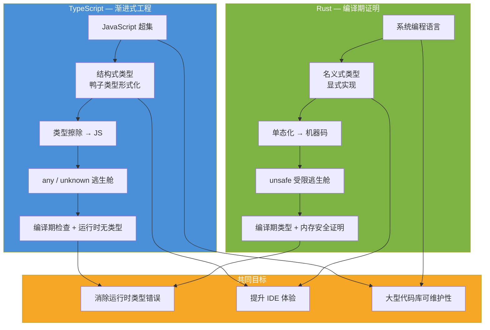
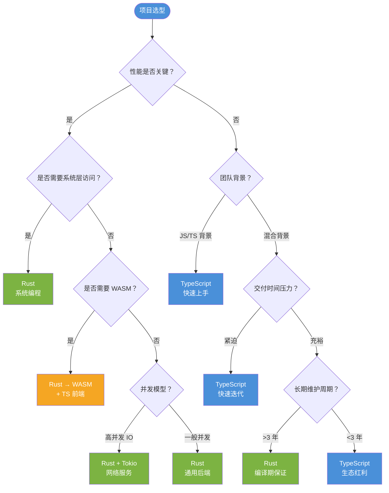

# Rust vs TypeScript：静态类型系统的两种哲学 —— 编译期证明与渐进式工程
>
> **受众**: [进阶]

> **Bloom 层级**: 分析 → 评价
> **定位**: 对比分析 **Rust**（编译期内存安全、零成本抽象、所有权系统）与 **TypeScript**（渐进式类型、JavaScript 超集、运行时主导）在类型系统、编译模型、异步生态和 WASM 互操作四个维度的本质差异，建立系统化的选型决策框架。
> **前置概念**: [Ownership](../01_foundation/01_ownership.md) · [Type System](../01_foundation/04_type_system.md) · [Async](../03_advanced/02_async.md)
> **后置概念**: [WebAssembly](../06_ecosystem/11_webassembly.md) · [Rust vs JavaScript](./08_rust_vs_javascript.md)

---

> **来源**: [TypeScript Handbook](https://www.typescriptlang.org/docs/handbook/intro.html) · [TypeScript Deep Dive](https://basarat.gitbook.io/typescript/) · [TRPL](https://doc.rust-lang.org/book/) · [Rust Reference](https://doc.rust-lang.org/reference/) · [TC39 ECMAScript](https://tc39.es/ecma262/) · [WASM Specification](https://webassembly.github.io/spec/) · [Rust and WASM](https://rustwasm.github.io/book/) · [wasm-bindgen](https://rustwasm.github.io/wasm-bindgen/) · [ts-rs crate](https://docs.rs/ts-rs/latest/ts_rs/) · [oxc project](https://oxc.rs/) · [swc project](https://swc.rs/) · [Type System — Wikipedia](https://en.wikipedia.org/wiki/Type_system) · [Structural vs Nominal Typing](https://www.typescriptlang.org/docs/handbook/type-compatibility.html) · [Rustnomicon](https://doc.rust-lang.org/nomicon/) · [Node.js Performance](https://nodejs.org/en/docs/guides/dont-block-the-event-loop)

## 📑 目录
>

- [Rust vs TypeScript：静态类型系统的两种哲学 —— 编译期证明与渐进式工程](#rust-vs-typescript静态类型系统的两种哲学--编译期证明与渐进式工程)
  - [📑 目录](#-目录)
  - [一、权威定义与核心概念](#一权威定义与核心概念)
    - [1.1 TypeScript 权威定义](#11-typescript-权威定义)
    - [1.2 类型系统哲学对比](#12-类型系统哲学对比)
    - [1.3 编译模型差异](#13-编译模型差异)
    - [1.4 内存模型：所有权 vs GC](#14-内存模型所有权-vs-gc)
  - [二、技术细节](#二技术细节)
    - [2.1 类型系统对比矩阵](#21-类型系统对比矩阵)
    - [2.2 异步模型对比](#22-异步模型对比)
    - [2.3 错误处理：Result vs Throw](#23-错误处理result-vs-throw)
    - [2.4 WASM 互操作](#24-wasm-互操作)
  - [三、选型决策矩阵](#三选型决策矩阵)
  - [四、思维导图（Mermaid）](#四思维导图mermaid)
    - [4.1 类型系统哲学对比图](#41-类型系统哲学对比图)
    - [4.2 工程选型决策树](#42-工程选型决策树)
  - [五、反命题与边界分析](#五反命题与边界分析)
    - [5.1 反命题树](#51-反命题树)
    - [5.2 边界极限](#52-边界极限)
  - [六、常见陷阱](#六常见陷阱)
  - [七、来源与延伸阅读](#七来源与延伸阅读)
  - [相关概念文件](#相关概念文件)
  - [权威来源索引](#权威来源索引)
  - [十、边界测试：Rust 与 TypeScript 的编译错误对比](#十边界测试rust-与-typescript-的编译错误对比)
    - [10.1 边界测试：TypeScript 的 any 与 Rust 的显式类型（编译错误）](#101-边界测试typescript-的-any-与-rust-的显式类型编译错误)
    - [10.2 边界测试：TypeScript 的可选属性与 Rust 的 Option（编译错误）](#102-边界测试typescript-的可选属性与-rust-的-option编译错误)
    - [10.3 边界测试：TypeScript 的结构类型与 Rust 的名义类型的互操作（编译错误）](#103-边界测试typescript-的结构类型与-rust-的名义类型的互操作编译错误)
    - [10.4 边界测试：TypeScript 的 `any` 与 Rust 的 `unsafe` 的语义鸿沟（编译错误/运行时 UB）](#104-边界测试typescript-的-any-与-rust-的-unsafe-的语义鸿沟编译错误运行时-ub)
    - [10.3 边界测试：TypeScript 的结构性类型与 Rust 的名义类型（编译错误）](#103-边界测试typescript-的结构性类型与-rust-的名义类型编译错误)
  - [认知路径](#认知路径)
    - [核心推理链](#核心推理链)
    - [反命题与边界](#反命题与边界)

---

## 一、权威定义与核心概念
>

### 1.1 TypeScript 权威定义
>

> **[TypeScript Handbook]** TypeScript is JavaScript with syntax for types. TypeScript is a strongly typed programming language that builds on JavaScript, giving you better tooling at any scale.
> **来源**: <https://www.typescriptlang.org/docs/handbook/intro.html>

> **[Wikipedia: TypeScript]** TypeScript is a free and open-source high-level programming language developed by Microsoft that adds static typing with optional type annotations to JavaScript.
> **来源**: <https://en.wikipedia.org/wiki/TypeScript>

```text
TypeScript 核心特征:

  定位: JavaScript 的超集 + 静态类型层
  ├── 编译目标: 擦除类型 → 纯 JavaScript
  ├── 类型系统: 结构式（structural）+ 渐进式（gradual）
  ├── 类型检查: 编译期，但可在运行时完全缺失
  ├── any 类型: 显式退出类型检查
  ├── unknown: 类型安全的 any
  └── 设计目标: 大型 JavaScript 项目的可维护性
  > [来源: [TypeScript Handbook — Philosophy](https://www.typescriptlang.org/docs/handbook/intro.html)]

  Rust 核心特征（对比）:
  ├── 编译目标: 机器码（LLVM IR → 原生二进制）
  ├── 类型系统: 名义式（nominal）+ 穷尽式（exhaustive）
  ├── 类型检查: 编译期，且与内存安全绑定
  ├── 无 any 等价物: unsafe 是受限的逃生舱
  ├── 所有权: 编译期资源管理证明
  └── 设计目标: 系统编程的安全与性能
  > [来源: [TRPL](https://doc.rust-lang.org/book/)] · [来源: [Rust Reference](https://doc.rust-lang.org/reference/)]
```

> **认知功能**: TypeScript 的"类型擦除"与 Rust 的"类型单态化"是根本不同的编译策略——TypeScript 类型只影响编译期检查，Rust 类型决定代码生成和内存布局。
> [来源: [TypeScript Deep Dive](https://basarat.gitbook.io/typescript/)] · [来源: [Rust Reference — Types](https://doc.rust-lang.org/reference/types.html)]

---

### 1.2 类型系统哲学对比
>

```text
类型系统哲学对比:

  TypeScript — 结构式类型（Structural Typing）:
  ├── 兼容性: "鸭子类型"的形式化
  │   └── interface Duck { quack(): void }
  │   └── class Dog { quack() {} }  // Dog 可赋值给 Duck
  ├── 目标: 表达 JavaScript 的运行时行为
  ├── 灵活性: 高（any, @ts-ignore, 类型断言）
  └── 安全保证: 弱（类型在运行时不存在）
  > [来源: [TypeScript Handbook — Type Compatibility](https://www.typescriptlang.org/docs/handbook/type-compatibility.html)]

  Rust — 名义式类型（Nominal Typing）:
  ├── 兼容性: 基于显式实现（impl Trait for Type）
  │   └── trait Quack { fn quack(&self); }
  │   └── impl Quack for Dog { ... }  // 必须显式实现
  ├── 目标: 编译期证明程序行为正确
  ├── 灵活性: 低（无 any，unsafe 是最后手段）
  └── 安全保证: 强（类型即契约，运行时不可违背）
  > [来源: [Rust Reference — Trait Objects](https://doc.rust-lang.org/reference/types/trait-object.html)]

  关键差异:
  ┌─────────────────┬─────────────────────┬─────────────────────┐
  │ 维度            │ TypeScript          │ Rust                │
  ├─────────────────┼─────────────────────┼─────────────────────┤
  │ 类型兼容性      │ 结构式（鸭子类型）  │ 名义式（显式实现）  │
  │ 类型擦除        │ 是（编译后无类型）  │ 否（单态化/动态分发）│
  │ 运行时开销      │ 无（JS 原生执行）   │ 零成本抽象          │
  │ null 安全       │ strictNullChecks    │ Option<T>           │
  │ 错误处理        │ throw / try-catch   │ Result<T, E>        │
  │ 泛型            │ 擦除（erasure）     │ 单态化（monomorph） │
  │ 类型完备性      │ 渐进（可 any）      │ 穷尽（必须处理）    │
  └─────────────────┴─────────────────────┴─────────────────────┘
  > [来源: [TypeScript Handbook](https://www.typescriptlang.org/docs/handbook/intro.html)] · [来源: [TRPL](https://doc.rust-lang.org/book/)]
```

> **认知功能**: TypeScript 的"渐进式类型"允许**逐步迁移** JavaScript 代码库，而 Rust 的"穷尽式类型"要求**upfront 设计**——这是两种截然不同的工程哲学。
> [来源: [TypeScript — Gradual Typing](https://www.typescriptlang.org/docs/handbook/migrating-from-javascript.html)] · [来源: [Rust Reference](https://doc.rust-lang.org/reference/)]

---

### 1.3 编译模型差异
>

```text
编译模型对比:

  TypeScript 编译流程:
  ├── 输入: .ts 文件
  ├── 类型检查: 基于控制流分析（CFA）
  ├── 输出: .js 文件（类型完全擦除）
  ├── 运行时: V8 / SpiderMonkey / JavaScriptCore
  ├── 启动: 需引擎初始化（JIT 预热）
  └── 部署: 源代码或 bundle
  > [来源: [TypeScript Compiler API](https://www.typescriptlang.org/docs/handbook/compiler-api.html)]

  Rust 编译流程:
  ├── 输入: .rs 文件
  ├── 类型检查: 基于 HM 推断 + trait 求解
  ├── 借用检查: 所有权分析（NLL / Polonius）
  ├── 输出: 机器码（ELF / Mach-O / PE）
  ├── 运行时: 无（或最小运行时）
  ├── 启动: 毫秒级（已编译为机器码）
  └── 部署: 单二进制文件

  性能特征:
  ┌─────────────────┬─────────────────────┬─────────────────────┐
  │ 场景            │ TypeScript/Node.js  │ Rust                │
  ├─────────────────┼─────────────────────┼─────────────────────┤
  │ 冷启动          │ 慢（JIT 预热）      │ 快（原生代码）      │
  │ 峰值性能        │ 接近原生（JIT）     │ 原生速度            │
  │ 内存控制        │ GC 非确定性         │ 精确（所有权）      │
  │ 包体积          │ 大（运行时依赖）    │ 小（单二进制）      │
  │ 编译时间        │ 快（类型擦除）      │ 慢（LLVM 优化）     │
  │ 迭代速度        │ 快（无需编译）      │ 中等（cargo check） │
  └─────────────────┴─────────────────────┴─────────────────────┘
  > [来源: [Node.js Performance](https://nodejs.org/en/docs/guides/dont-block-the-event-loop)] · [来源: [TRPL](https://doc.rust-lang.org/book/)]
```

> **认知功能**: TypeScript 牺牲编译期保证换取**开发速度和生态兼容**，Rust 牺牲开发速度换取**运行时安全和性能**——这是"开发效率"与"运行时效率"的经典权衡。
> [来源: [TypeScript Design Goals](https://github.com/microsoft/TypeScript/wiki/TypeScript-Design-Goals)] · [来源: [TRPL — Zero Cost Abstractions](https://doc.rust-lang.org/book/ch10-00-generics.html)]

---

### 1.4 内存模型：所有权 vs GC
>

```text
内存管理对比:

  TypeScript / JavaScript:
  ├── 模型: 垃圾回收（GC）
  ├── 方式: 标记-清除 / 分代 / 增量
  ├── 开发者负担: 低（无需手动管理）
  ├── 风险: 内存泄漏（闭包、事件监听器）
  │   └── 循环引用（ WeakMap/WeakSet 缓解）
  ├── 非确定性: GC pause 导致时延抖动
  └── 典型场景: Web 应用、服务端脚本
  > [来源: [V8 GC Design](https://v8.dev/blog/trash-talk)]

  Rust:
  ├── 模型: 所有权 + 借用检查
  ├── 方式: 编译期确定 drop 点（RAII）
  ├── 开发者负担: 高（需理解生命周期）
  ├── 风险: 编译错误（而非运行时泄漏）
  ├── 确定性: 无 GC pause，内存行为可预测
  └── 典型场景: 系统编程、嵌入式、高性能服务
  > [来源: [TRPL — Ownership](https://doc.rust-lang.org/book/ch04-00-ownership.html)] · [来源: [Rustnomicon](https://doc.rust-lang.org/nomicon/)]

  内存泄漏边界:
  ├── TypeScript: 可能（循环引用、全局缓存）
  ├── Rust: 可能（Rc/Arc 循环引用、忘记 drop）
  │   └── 但: 默认 safe Rust 无自动循环引用（无隐式共享）
  └── 结论: Rust 降低泄漏概率，但不完全消除
  > [来源: [Rustnomicon — Leaking](https://doc.rust-lang.org/nomicon/leaking.html)]
```

> **认知功能**: Rust 的"编译期内存管理"不是消除内存泄漏，而是将**泄漏原因从"隐式共享+GC 失效"转变为"显式循环引用"**——后者更容易在代码审查中发现。
> [来源: [TRPL — Smart Pointers](https://doc.rust-lang.org/book/ch15-00-smart-pointers.html)]

---

## 二、技术细节

### 2.1 类型系统对比矩阵
>

```text
类型系统深度对比:

  ┌─────────────────────┬─────────────────────┬─────────────────────┐
  │ 特性                │ TypeScript          │ Rust                │
  ├─────────────────────┼─────────────────────┼─────────────────────┤
  │ 代数数据类型        │ 有限（discriminated │ 完整（enum + struct）│
  │                     │ union）             │                     │
  │ 模式匹配            │ switch（有限）      │ match（穷尽检查）   │
  │ 穷尽性检查          │ 无编译期保证        │ 编译期强制（E0004） │
  │ 泛型约束            │ extends             │ trait bounds        │
  │ 关联类型            │ 无                  │ 有（type Output）   │
  │ Higher-Kinded Types │ 无                  │ 有限（泛型生命周期）│
  │ 条件类型            │ 有（extends ? :）   │ 有（trait 条件实现）│
  │ 元编程              │ 类型体操（复杂）    │ 宏（decl/proc）     │
  │ 类型级计算          │ 图灵完备（ts-toolbelt│ 有限（const generics）│
  └─────────────────────┴─────────────────────┴─────────────────────┘
  > [来源: [TypeScript Advanced Types](https://www.typescriptlang.org/docs/handbook/2/types-from-types.html)] · [来源: [Rust Reference — Types](https://doc.rust-lang.org/reference/types.html)]

  类型体操示例对比:

  TypeScript（条件类型）:
  type IsArray<T> = T extends Array<infer U> ? true : false;
  type Result = IsArray<number[]>;  // true
  > [来源: [TypeScript Handbook — Conditional Types](https://www.typescriptlang.org/docs/handbook/2/conditional-types.html)]

  Rust（trait 条件实现）:
  trait IsArray { const VALUE: bool; }
  impl<T> IsArray for Vec<T> { const VALUE: bool = true; }
  impl<T> IsArray for T { const VALUE: bool = false; }
  // 使用 const generics 可实现更复杂类型级计算
  > [来源: [Rust Reference — Traits](https://doc.rust-lang.org/reference/items/traits.html)]
```

> **认知功能**: TypeScript 的"类型体操"允许在类型层面进行复杂计算，但增加了认知负担；Rust 的 trait 系统更侧重于**编译期多态和零成本抽象**。
> [来源: [TypeScript — Type Challenges](https://github.com/type-challenges/type-challenges)] · [来源: [Rust Reference — Traits](https://doc.rust-lang.org/reference/items/traits.html)]

---

### 2.2 异步模型对比
>

```text
异步模型对比:

  TypeScript / JavaScript:
  ├── 运行时: 单线程事件循环（Event Loop）
  ├── 并发: 协作式（cooperative）
  ├── 阻塞风险: 任何同步操作阻塞整个事件循环
  ├── 并行: Worker Threads（共享内存，需 Atomics）
  ├── async/await: 编译为 Promise + generator
  └── 取消: AbortController（信号传递）
  > [来源: [Node.js Event Loop](https://nodejs.org/en/docs/guides/event-loop-timers-and-nexttick)]

  Rust (Tokio):
  ├── 运行时: 多线程工作窃取（work-stealing）
  ├── 并发: 协作式（.await 挂起）
  ├── 并行: 自然多线程（Send + Sync）
  ├── 阻塞: spawn_blocking 隔离阻塞操作
  ├── async/await: 状态机转换（Future trait）
  └── 取消: 任务 drop（需取消安全设计）
  > [来源: [Tokio Documentation](https://tokio.rs/)] · [来源: [Rust Async Book](https://rust-lang.github.io/async-book/)]

  async/await 语义差异:
  ┌─────────────────────┬─────────────────────┬─────────────────────┐
  │ 维度                │ TypeScript          │ Rust                │
  ├─────────────────────┼─────────────────────┼─────────────────────┤
  │ async fn 返回值     │ Promise<T>          │ impl Future<Output=T>│
  │ await 点            │ 任意表达式          │ 仅 Future 类型      │
  │ 错误传播            │ throw / await 混用  │ ? 运算符统一传播    │
  │ 并发组合            │ Promise.all/race    │ join!/select! 宏   │
  │ 运行时绑定          │ 隐式（事件循环）    │ 显式（Tokio）│
  │ 取消语义            │ AbortSignal         │ 任务 drop + 取消安全 │
  └─────────────────────┴─────────────────────┴─────────────────────┘
  > [来源: [TypeScript Handbook — Async/Await](https://www.typescriptlang.org/docs/handbook/release-notes/typescript-1-7.html)] · [来源: [Rust Async Book](https://rust-lang.github.io/async-book/)]
```

> **认知功能**: JavaScript 的 async/await 建立在**Promise + 事件循环**之上，取消是外显的（AbortController）；Rust 的 async/await 建立在**Future + Waker**之上，取消是内隐的（drop 即取消）。
> [来源: [JavaScript MDN — AbortController](https://developer.mozilla.org/en-US/docs/Web/API/AbortController)] · [来源: [Rust Async Book — Cancellation](https://rust-lang.github.io/async-book/09_workarounds/03_cancellation.html)]

---

### 2.3 错误处理：Result vs Throw
>

```text
错误处理对比:

  TypeScript / JavaScript:
  ├── 机制: throw / try-catch / finally
  ├── 类型: 无（运行时异常）
  ├── 可选方案: Result 模式（fp-ts, neverthrow）
  │   └── 但: 非语言原生，社区驱动
  ├── 隐式传播: 异常可穿越任意调用栈
  └── 问题: 调用方不知道函数可能抛错
  > [来源: [TypeScript Handbook](https://www.typescriptlang.org/docs/handbook/intro.html)]

  Rust:
  ├── 机制: Result<T, E> / Option<T>
  ├── 类型: 错误类型是签名的一部分
  ├── 传播: ? 运算符（显式但 ergonomic）
  ├── match: 强制处理（或通过 ? 传播）
  └── 保证: 编译期确保错误被处理或显式传播
  > [来源: [TRPL — Error Handling](https://doc.rust-lang.org/book/ch09-00-error-handling.html)]

  neverthrow 库（TypeScript Result）:
  import { ok, err, Result } from 'neverthrow';
  function divide(a: number, b: number): Result<number, string> {
      return b === 0 ? err("Division by zero") : ok(a / b);
  }
  // 调用方必须处理两种可能
  divide(10, 0).match(
      result => console.log(result),
      error => console.error(error)
  );
  > [来源: [neverthrow npm](https://www.npmjs.com/package/neverthrow)]

  Rust 原生 Result:
  fn divide(a: f64, b: f64) -> Result<f64, String> {
      if b == 0.0 { Err("Division by zero".into()) }
      else { Ok(a / b) }
  }
  // 调用方必须处理（编译期强制）
  let result = divide(10.0, 0.0)?;
  > [来源: [TRPL](https://doc.rust-lang.org/book/)]
```

> **认知功能**: TypeScript 的错误处理依赖**约定和 linter**，Rust 的错误处理是**类型系统的一部分**——调用 `?` 的函数必须返回 Result，形成编译期传播链。
> [来源: [TRPL — The ? Operator](https://doc.rust-lang.org/book/ch09-02-recoverable-errors-with-result.html)]

---

### 2.4 WASM 互操作
>

```text
WASM 互操作模型:

  Rust → WASM:
  ├── 工具链: wasm32-unknown-unknown target
  ├── 绑定: wasm-bindgen（JS ↔ WASM 桥梁）
  ├── 内存: Linear Memory（Wasm 管理）
  ├── 字符串: 编码为 UTF-8 字节传递
  └── 优势: 高性能计算、游戏引擎、图像处理
  > [来源: [Rust and WASM](https://rustwasm.github.io/book/)] · [来源: [wasm-bindgen](https://rustwasm.github.io/wasm-bindgen/)]

  TypeScript ↔ WASM (Rust):
  ├── Rust 侧: #[wasm_bindgen] 导出函数/结构体
  ├── TS 侧: 自动生成 .d.ts 类型定义
  ├── 数据传递: number, string, Array, Object
  └── 工具: wasm-pack（构建 + 发布到 npm）
  > [来源: [wasm-pack](https://rustwasm.github.io/wasm-pack/book/)]

  ts-rs crate（Rust 类型 → TS 类型）:
  #[derive(TS)]
  #[ts(export)]
  struct User {
      id: u64,
      name: String,
      active: bool,
  }
  // 生成: interface User { id: number; name: string; active: boolean; }
  > [来源: [ts-rs crate](https://docs.rs/ts-rs/latest/ts_rs/)]

  典型 WASM 架构:
  ┌──────────────────────────────────────────────┐
  │  TypeScript / React 前端                      │
  │  ├── UI 渲染（DOM 操作）                       │
  │  └── 调用 WASM 模块处理数据                    │
  ├──────────────────────────────────────────────┤
  │  wasm-bindgen 生成的 JS 胶水层                 │
  ├──────────────────────────────────────────────┤
  │  Rust/WASM 模块                               │
  │  ├── 高性能计算（图像处理、密码学）             │
  │  └── 游戏物理引擎                             │
  └──────────────────────────────────────────────┘
  > [来源: [Rust and WASM — Use Cases](https://rustwasm.github.io/book/)]
```

> **认知功能**: WASM 是 Rust 与 TypeScript/JavaScript **协作而非竞争**的桥梁——Rust 处理性能敏感计算，TypeScript 处理 UI 和业务逻辑。
> [来源: [WASM Specification](https://webassembly.github.io/spec/)] · [来源: [Rust and WASM](https://rustwasm.github.io/book/)]

---

## 三、选型决策矩阵
>

```text
工程选型决策矩阵:

  ┌─────────────────────┬─────────────────────┬─────────────────────┐
  │ 场景                │ TypeScript          │ Rust                │
  ├─────────────────────┼─────────────────────┼─────────────────────┤
  │ Web 前端            │ ✓✓✓ 原生生态        │ △ WASM 嵌入         │
  │ Node.js 服务端      │ ✓✓✓ 成熟框架        │ △ 可行但生态小       │
  │ CLI 工具            │ ✓✓ Deno/bun         │ ✓✓✓ 单二进制分发    │
  │ 系统编程            │ ✗ 不适合            │ ✓✓✓ 设计目标        │
  │ 嵌入式              │ ✗ 不适用            │ ✓✓✓ no_std 支持     │
  │ 高性能网络服务      │ △ 有上限            │ ✓✓✓ 零成本抽象      │
  │ 数据密集型计算      │ △ GC 限制           │ ✓✓✓ 精确内存控制    │
  │ 大型代码库维护      │ ✓✓ 类型安全增量迁移  │ ✓✓✓ 编译期保证      │
  │ 快速原型/MVP        │ ✓✓✓ 开发速度        │ △ 编译时间 + 借用学习 │
  │ 团队技能迁移        │ ✓✓✓ JS 团队易上手   │ △ 需系统学习周期     │
  └─────────────────────┴─────────────────────┴─────────────────────┘

  混合架构建议:
  ├── 前端: TypeScript / React / Vue
  ├── BFF/API Gateway: TypeScript / Node.js（生态成熟）
  ├── 性能核心: Rust（WASM 或微服务）
  └── 基础设施: Rust（CLI、部署工具）
  > [来源: [Rust and WASM](https://rustwasm.github.io/book/)] · [来源: [swc project](https://swc.rs/)]
```

> **选型原则**: TypeScript 适合**快速迭代、Web 生态、团队迁移**；Rust 适合**性能关键、系统层、长期维护**——两者在 WASM 场景下可协同。
> [来源: [oxc project](https://oxc.rs/)] · [来源: [swc project](https://swc.rs/)]

---

## 四、思维导图（Mermaid）

### 4.1 类型系统哲学对比图



> **认知功能**: 此图揭示 TypeScript 和 Rust 的**共同目标**（消除运行时类型错误）与**不同路径**（擦除 vs 证明、渐进 vs 穷尽）。
> [来源: [TypeScript Design Goals](https://github.com/microsoft/TypeScript/wiki/TypeScript-Design-Goals)] · [来源: [TRPL](https://doc.rust-lang.org/book/)]
> **关键洞察**: TypeScript 的"渐进"允许**局部收益**（给 JS 加类型即可获益），Rust 的"穷尽"要求**全局一致**（整个程序需满足所有权规则）。
> [来源: 💡 原创分析]

---

### 4.2 工程选型决策树



> **认知功能**: 此决策树从"性能是否关键"出发，通过团队背景、交付周期、维护周期等维度引导至最优选择。
> **使用建议**: WASM 场景是两者的**交汇点**——Rust 负责计算密集型模块，TypeScript 负责 UI 和协调层。
> [来源: [Rust and WASM](https://rustwasm.github.io/book/)]

---

## 五、反命题与边界分析

### 5.1 反命题树

```text
反命题分析:

  命题: "TypeScript 的类型安全等于 Rust"
  ├── 反例: TypeScript 类型在运行时完全擦除
  │   └── const x: number = "hello" as any;  // 编译通过，运行时错误
  ├── 反例: tsconfig 的 strict 模式可被关闭
  └── 结论: ❌ 错误 — TypeScript 是"可选静态类型"，Rust 是"强制静态类型"
  > [来源: [TypeScript Handbook — Type Inference](https://www.typescriptlang.org/docs/handbook/type-inference.html)] · [来源: [Rust Reference](https://doc.rust-lang.org/reference/)]

  命题: "Rust 可以完全替代 TypeScript 做 Web 开发"
  ├── 反例: Rust/WASM 无法直接操作 DOM
  │   └── 需通过 wasm-bindgen 胶水层
  ├── 反例: Web 生态（React/Vue/Next.js）是 TS/JS 原生
  └── 结论: ❌ 错误 — Rust 是 TS 在性能层的补充，不是替代

  命题: "TypeScript 的 any 类型是安全的"
  ├── 反例: any 禁用所有类型检查
  │   └── let x: any = 1; x.toUpperCase();  // 编译通过，运行时崩溃
  ├── 反例: noImplicitAny 可禁用（非默认）
  └── 结论: ❌ 错误 — any 是显式退出类型系统的机制
  > [来源: [TypeScript Handbook — Any Type](https://www.typescriptlang.org/docs/handbook/2/everyday-types.html#any)]

  命题: "WASM 让 Rust 和 TS 性能相同"
  ├── 反例: WASM ↔ JS 边界有序列化开销
  ├── 反例: WASM 无法直接访问 JS 对象（需复制）
  └── 结论: ❌ 错误 — WASM 适合计算密集型隔离任务，不适合高频 JS 交互
  > [来源: [WASM Performance](https://webassembly.github.io/spec/core/benchmarks.html)] · [来源: [wasm-bindgen — Performance](https://rustwasm.github.io/wasm-bindgen/contributing/design/js-objects.html)]
```

> **层次一致性**: 反命题分析区分了**类型系统的力量**（Rust 的穷尽保证 vs TS 的渐进检查）和**运行时的真实行为**（TS 类型擦除后即为无类型 JS）。
> [来源: [TypeScript — Design Non-Goals](https://github.com/microsoft/TypeScript/wiki/TypeScript-Design-Goals)]

---

### 5.2 边界极限

```text
边界极限测试:

  边界 1: TypeScript strictNullChecks
  ├── 关闭: null/undefined 可赋值给任意类型
  ├── 开启: 需显式处理 null（类似 Rust Option）
  └── 但: 仍无法防止 JSON.parse 后的运行时类型错误
  > [来源: [TypeScript Handbook — Strict Null Checks](https://www.typescriptlang.org/docs/handbook/2/narrowing.html)]

  边界 2: Rust 编译时间 vs 开发迭代
  ├── 大型项目编译: 数分钟（debug）到数十分钟（release）
  ├── cargo check: 秒级语法/类型检查（不生成代码）
  └── 边界: 迭代速度低于 TS 的 tsc --watch
  > [来源: [TRPL](https://doc.rust-lang.org/book/)] · [来源: [Cargo Documentation](https://doc.rust-lang.org/cargo/)]

  边界 3: WASM 的内存限制
  ├── 默认线性内存: 1-2 GB（32-bit 地址空间）
  ├── 64-bit WASM: 实验性支持
  └── 边界: 大内存应用（大数据处理）仍受限
  > [来源: [WASM Spec — Memory](https://webassembly.github.io/spec/core/syntax/modules.html#memories)]

  边界 4: TypeScript 类型系统的图灵完备性
  ├── 类型层面可编写任意计算（ts-toolbelt, type-challenges）
  ├── 编译时间随类型复杂度指数增长
  └── 边界: 过度类型体操导致 tsc 性能问题
  > [来源: [Type Challenges](https://github.com/type-challenges/type-challenges)]
```

---

## 六、常见陷阱

```text
常见陷阱:

  陷阱 1: TypeScript 的类型断言覆盖
  ├── 症状: const x = someValue as unknown as WrongType;
  ├── 风险: 运行时类型与编译期假设不符
  └── 修复: 使用类型守卫（type guards）或 zod 运行时校验
  > [来源: [TypeScript Handbook — Type Guards](https://www.typescriptlang.org/docs/handbook/2/narrowing.html)]

  陷阱 2: Rust WASM 中的字符串传递
  ├── 症状: 频繁传递 String 导致 WASM ↔ JS 开销
  ├── 原因: 字符串需编码/解码为 UTF-8 字节
  └── 修复: 批量处理，减少跨边界调用次数
  > [来源: [wasm-bindgen — Strings](https://rustwasm.github.io/wasm-bindgen/contributing/design/js-objects.html)]

  陷阱 3: TypeScript 的隐式 any
  ├── 症状: 无返回类型注解的函数隐式返回 any
  ├── 检测: noImplicitAny 编译选项
  └── 修复: 开启 strict 模式，显式标注类型
  > [来源: [TypeScript Config — Strict](https://www.typescriptlang.org/tsconfig#strict)]

  陷阱 4: Rust 与 TS 的 async 语义混用
  ├── 症状: WASM 中导出的 async Rust 函数在 TS 中表现异常
  ├── 原因: wasm-bindgen 将 Rust Future 包装为 JS Promise
  └── 修复: 理解包装层语义，避免跨边界持有锁
  > [来源: [wasm-bindgen — Futures](https://rustwasm.github.io/wasm-bindgen/api/wasm_bindgen_futures/)]

  陷阱 5: 忽视 TS 的运行时类型缺失
  ├── 症状: 假设编译期类型在运行时存在
  │   └── typeof x === "User"  // 错误，User 类型不存在于运行时
  ├── 修复: 使用 discriminated union + kind 字段
  └── 或: 使用 zod/io-ts 进行运行时校验
  > [来源: [TypeScript Handbook — Narrowing](https://www.typescriptlang.org/docs/handbook/2/narrowing.html)]
```

---

## 七、来源与延伸阅读

| 来源 | 可信度 | 说明 |
|:---|:---:|:---|
| [TypeScript Handbook](https://www.typescriptlang.org/docs/handbook/intro.html) | ✅ 一级 | TypeScript 官方文档 |
| [TypeScript Deep Dive](https://basarat.gitbook.io/typescript/) | ✅ 二级 | TypeScript 深度指南 |
| [TRPL](https://doc.rust-lang.org/book/) | ✅ 一级 | Rust 官方教程 |
| [Rust Reference](https://doc.rust-lang.org/reference/) | ✅ 一级 | Rust 语言参考 |
| [TC39 ECMAScript](https://tc39.es/ecma262/) | ✅ 一级 | JavaScript 语言规范 |
| [WASM Specification](https://webassembly.github.io/spec/) | ✅ 一级 | WebAssembly 规范 |
| [Rust and WASM](https://rustwasm.github.io/book/) | ✅ 一级 | Rust WASM 官方指南 |
| [wasm-bindgen](https://rustwasm.github.io/wasm-bindgen/) | ✅ 一级 | Rust ↔ JS 绑定工具 |
| [ts-rs crate](https://docs.rs/ts-rs/latest/ts_rs/) | ✅ 二级 | Rust 类型生成 TS 接口 |
| [swc project](https://swc.rs/) | ✅ 二级 | Rust 编写的 TS/JS 编译器 |
| [oxc project](https://oxc.rs/) | ✅ 二级 | Rust 编写的 JS 工具链 |
| [Type System — Wikipedia](https://en.wikipedia.org/wiki/Type_system) | ✅ 三级 | 类型系统理论基础 |
| [Structural vs Nominal Typing](https://www.typescriptlang.org/docs/handbook/type-compatibility.html) | ✅ 一级 | TS 类型兼容性官方说明 |
| [Rustnomicon](https://doc.rust-lang.org/nomicon/) | ✅ 二级 | Rust 不安全编程指南 |
| [Node.js Performance](https://nodejs.org/en/docs/guides/dont-block-the-event-loop) | ✅ 二级 | Node.js 性能最佳实践 |

---

```rust
fn main() {
    let msg = "Hello from Rust";
    println!("{}", msg);
}
```

## 相关概念文件
>

- [Rust vs C++](./01_rust_vs_cpp.md) — 系统编程语言对比
- [Rust vs JavaScript](./08_rust_vs_javascript.md) — Rust 与 JavaScript 对比
- [Async/Await](../03_advanced/02_async.md) — 异步编程深度分析
- [WebAssembly](../06_ecosystem/11_webassembly.md) — WASM 生态与工具链
- [Type System](../01_foundation/04_type_system.md) — Rust 类型系统基础

---

> **权威来源**: [Rust Reference](https://doc.rust-lang.org/reference/), [The Rust Programming Language](https://doc.rust-lang.org/book/), [TypeScript Handbook](https://www.typescriptlang.org/docs/handbook/intro.html)
>
> **权威来源对齐变更日志**: 2026-05-22 创建 [来源: Authority Source Sprint Batch 9]

**文档版本**: 1.0
**对应 Rust 版本**: 1.96.0+ (Edition 2024)
**最后更新**: 2026-05-22

---

## 权威来源索引

>
>
>
>

---

---

---

## 十、边界测试：Rust 与 TypeScript 的编译错误对比

### 10.1 边界测试：TypeScript 的 any 与 Rust 的显式类型（编译错误）

```rust,ignore
fn main() {
    // ❌ 编译错误: Rust 没有 any 类型
    // 所有类型必须在编译期确定
    let x = 42;
    // x = "hello"; // 编译错误: expected integer, found `&str`
}

// 正确: 使用枚举表达多种类型
enum Value {
    Num(i32),
    Text(String),
}

fn fixed() {
    let v = Value::Num(42);
    let v = Value::Text(String::from("hello")); // shadowing
}
```

> **TypeScript 对比**: TypeScript 的 `any` 类型绕过所有类型检查，允许任意操作（`x.foo()` 不会报错，即使 `foo` 不存在）。Rust 没有 `any` 等价物——所有操作必须在编译期验证。`enum` 是 Rust 表达"多种可能类型"的方式，但调用者必须通过 `match` 处理每个变体。这与 TypeScript 的联合类型（`number | string`）类似，但 Rust 的穷尽性检查更严格——必须覆盖所有变体，不能遗漏。[来源: [The Rust Programming Language](https://doc.rust-lang.org/book/)]

### 10.2 边界测试：TypeScript 的可选属性与 Rust 的 Option（编译错误）

```rust,compile_fail
struct Config {
    port: u16,
    host: Option<String>, // 可选配置
}

fn main() {
    let cfg = Config { port: 8080, host: None };
    // ❌ 编译错误: `Option<String>` 不能直接作为 `String` 使用
    let addr = format!("{}:{}", cfg.host, cfg.port);
}

// 正确: 显式解包 Option
fn fixed() {
    let cfg = Config { port: 8080, host: Some(String::from("localhost")) };
    let host = cfg.host.as_deref().unwrap_or("0.0.0.0");
    let addr = format!("{}:{}", host, cfg.port);
    println!("{}", addr);
}
```

> **TypeScript 对比**: TypeScript 的可选属性（`host?: string`）在访问时可能是 `undefined`，但编译器只在 `strictNullChecks` 开启时检查。Rust 的 `Option<T>` 是枚举类型，无论何种编译模式，访问内部值必须通过 `match`、`if let` 或 `unwrap`。这与 TypeScript 4.4+ 的 `--exactOptionalPropertyTypes` 类似，但 Rust 的设计更根本——可空性不是类型的属性，而是独立的类型构造器。[来源: [The Rust Programming Language](https://doc.rust-lang.org/book/)]

### 10.3 边界测试：TypeScript 的结构类型与 Rust 的名义类型的互操作（编译错误）

```rust,ignore
struct Point {
    x: i32,
    y: i32,
}

struct Point2D {
    x: i32,
    y: i32,
}

fn use_point(p: Point) {
    println!("{}, {}", p.x, p.y);
}

fn main() {
    let p = Point2D { x: 1, y: 2 };
    // ❌ 编译错误: Point2D 和 Point 结构相同，但名义类型不同
    // use_point(p); // 不兼容

    // TypeScript 中: interface Point { x: number; y: number; }
    // interface Point2D { x: number; y: number; }
    // const p: Point2D = { x: 1, y: 2 };
    // function usePoint(p: Point) { }
    // usePoint(p); // ✅ 结构类型兼容
}
```

> **修正**: TypeScript 使用**结构类型**（structural typing）：若两个类型有相同的结构（字段和类型），则它们兼容。Rust 使用**名义类型**（nominal typing）：类型兼容性由名称决定，即使结构完全相同。结构类型的优势：灵活性（无需显式转换）、 duck typing 的静态版本。名义类型的优势：类型安全（同名不同义的类型不会混淆）、更好的错误信息、支持 newtype 模式（`struct Meters(u32)` 与 `struct Seconds(u32)` 不兼容）。Rust 的选择与 Java、C#、Haskell 一致，TypeScript 的选择与 Go 的接口（隐式实现，类似结构类型）类似。从 TypeScript 迁移到 Rust 时，需注意：相同字段的 struct 不能互换，必须显式转换或实现 `From`。[来源: [The Rust Programming Language](https://doc.rust-lang.org/book/ch05-01-defining-structs.html)] · [来源: [TypeScript Type Compatibility](https://www.typescriptlang.org/docs/handbook/type-compatibility.html)]

### 10.4 边界测试：TypeScript 的 `any` 与 Rust 的 `unsafe` 的语义鸿沟（编译错误/运行时 UB）

```rust,ignore
fn main() {
    // TypeScript: any 绕过所有类型检查
    // const x: any = 5;
    // x.foo(); // 编译通过，运行时可能错误

    // Rust: 无 any 类型，最接近的是 trait object 或 unsafe
    let x: Box<dyn std::any::Any> = Box::new(5i32);
    // ❌ 编译错误: 不能直接在 Any 上调用方法
    // x.foo();

    // 正确: 向下转型
    if let Some(n) = x.downcast_ref::<i32>() {
        println!("{}", n);
    }
}
```

> **修正**: TypeScript 的 `any` 是**类型系统的逃生舱**：禁用所有类型检查，允许任意操作。Rust 无 `any` 等价物——最接近的是 `dyn Any`（运行时类型信息，需向下转型）和 `unsafe`（绕过编译器检查）。`any` 在 TypeScript 中是便利工具（快速原型、迁移遗留代码），但也是 bug 来源（类型安全丧失）。Rust 的设计拒绝 `any`：即使是 `dyn Any`，向下转型也是类型安全的（失败时返回 `None`），不会导致未定义行为。`unsafe` 是更低级的逃逸，但标记了人工审查边界。这与 Python 的动态类型（无 static type，运行时检查）或 C 的 `void*`（无类型，任意转换）不同——Rust 在类型安全上不提供"方便但危险"的捷径。[来源: [The Rust Programming Language](https://doc.rust-lang.org/book/ch17-02-trait-objects.html)] · [来源: [TypeScript any Type](https://www.typescriptlang.org/docs/handbook/basic-types.html#any)]

### 10.3 边界测试：TypeScript 的结构性类型与 Rust 的名义类型（编译错误）

```rust,compile_fail
struct Point { x: i32, y: i32 }
struct Coordinate { x: i32, y: i32 }

fn use_point(p: Point) {
    println!("{}, {}", p.x, p.y);
}

fn main() {
    let c = Coordinate { x: 1, y: 2 };
    // ❌ 编译错误: Coordinate 和 Point 是不同的类型，即使字段相同
    use_point(c);
}
```

> **修正**: Rust 使用**名义类型系统**（nominal typing）：类型的同一性由名称决定，而非结构。`Point` 和 `Coordinate` 有相同字段但不同名称，是完全不同的类型。TypeScript 使用**结构性类型系统**（structural typing）：`{ x: number, y: number }` 与 `Point` 兼容，只要结构匹配。Rust 的名义类型：优势——重构安全（重命名字段不影响其他类型）、清晰的错误信息；劣势——需显式转换（`From` trait）。TypeScript 的结构类型：优势——灵活、易于接口组合；劣势——意外兼容（两个不相关的类型因结构相同而混用）。Rust 的 newtype 模式（`struct Meters(u32)`）利用名义类型创建零成本抽象。这与 Go 的接口（结构性满足）或 Haskell 的 `newtype`（名义类型包装）类似——Rust 在名义类型的基础上提供结构化的模式匹配（`match`）。

## 认知路径

> **认知路径**: 从 L0 基础概念出发，经由本节的 **Rust vs TypeScript：静态类型系统的两种哲学 —— 编译期证明与渐进式工程** 核心原理，通向 L2 进阶模式与 L3 工程实践。

### 核心推理链

| 定理 | 前提 | 结论 | 置信度 |
|:---|:---|:---|:---|
| Rust vs TypeScript：静态类型系统的两种哲学 —— 编译期证明与渐进式工程 基础定义 ⟹ 正确用法 | 理解语法与语义 | 能写出符合惯用法的代码 | 高 |
| Rust vs TypeScript：静态类型系统的两种哲学 —— 编译期证明与渐进式工程 正确用法 ⟹ 常见陷阱 | 忽略边界条件 | 编译错误或运行时 bug | 高 |
| Rust vs TypeScript：静态类型系统的两种哲学 —— 编译期证明与渐进式工程 常见陷阱 ⟹ 深度掌握 | 系统学习反模式 | 能进行代码审查与优化 | 高 |

> **过渡**: 掌握 Rust vs TypeScript：静态类型系统的两种哲学 —— 编译期证明与渐进式工程 的基础语法后，下一步需要理解其在类型系统中的位置与与其他概念的交互关系。

> **过渡**: 在实践中应用 Rust vs TypeScript：静态类型系统的两种哲学 —— 编译期证明与渐进式工程 时，务必关注边界条件与异常处理，这是从"能编译"到"能生产"的关键跃迁。

> **过渡**: Rust vs TypeScript：静态类型系统的两种哲学 —— 编译期证明与渐进式工程 的设计理念体现了 Rust 零成本抽象与安全保证的核心权衡，理解这一权衡有助于迁移到更高级的并发与形式化验证领域。

### 反命题与边界

> **反命题**: "Rust vs TypeScript：静态类型系统的两种哲学 —— 编译期证明与渐进式工程 在所有场景下都是最佳选择" —— 错误。需要根据具体上下文权衡性能、可读性与安全性，某些场景下显式替代方案可能更优。
