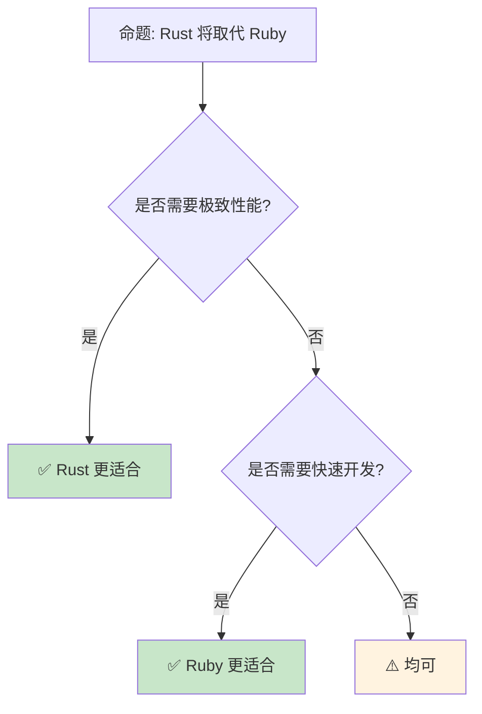

# Rust vs Ruby：性能与表达力的两极

> **Bloom 层级**: 分析 → 评价
> **定位**: 对比分析 **Rust** 与 **Ruby** 的设计哲学——从动态类型的极致表达力到静态类型的编译期安全，揭示两种语言在Web开发、脚本编写和系统编程中的互补定位。
> **前置概念**: [Type System](../01_foundation/04_type_system.md) · [Ownership](../01_foundation/01_ownership.md) · [Rust vs Python](./07_rust_vs_python.md)
> **后置概念**: [Web Development](../06_ecosystem/04_application_domains.md) · [Scripting](../06_ecosystem/03_core_crates.md)

---

> **来源**: [The Rust Programming Language](https://doc.rust-lang.org/book/) ·
> [Ruby Documentation](https://www.ruby-lang.org/en/documentation/) ·
> [Matz's Keynote — RubyConf](https://rubyconf.org/) ·
> [Speed of Rust vs Ruby](https://benchmarksgame-team.pages.debian.net/benchmarksgame/) ·
> [Wikipedia — Ruby (programming language)](https://en.wikipedia.org/wiki/Ruby_(programming_language)) ·
> [Wikipedia — Rust (programming language)](https://en.wikipedia.org/wiki/Rust_(programming_language))

## 📑 目录
>
> [来源: [Rust Reference](https://doc.rust-lang.org/reference/)]
>
> [来源: [TRPL](https://doc.rust-lang.org/book/)]

- [Rust vs Ruby：性能与表达力的两极](#rust-vs-ruby性能与表达力的两极)
  - [📑 目录](#-目录)
  - [一、核心对比](#一核心对比)
    - [1.1 类型系统对比](#11-类型系统对比)
    - [1.2 内存管理对比](#12-内存管理对比)
    - [1.3 元编程与 DSL](#13-元编程与-dsl)
  - [二、工程实践差异](#二工程实践差异)
    - [2.1 Web 开发生态](#21-web-开发生态)
    - [2.2 性能基准](#22-性能基准)
    - [2.3 开发速度权衡](#23-开发速度权衡)
  - [三、互补使用场景](#三互补使用场景)
  - [四、反命题与边界分析](#四反命题与边界分析)
    - [4.1 反命题树](#41-反命题树)
    - [4.2 边界极限](#42-边界极限)
  - [五、常见陷阱](#五常见陷阱)
  - [六、来源与延伸阅读](#六来源与延伸阅读)
    - [编译验证示例](#编译验证示例)
  - [相关概念文件](#相关概念文件)
  - [权威来源索引](#权威来源索引)
  - [十、边界测试：Rust 与 Ruby 的编译错误对比](#十边界测试rust-与-ruby-的编译错误对比)
    - [10.1 边界测试：Ruby 的 open classes 与 Rust 的孤儿规则（编译错误）](#101-边界测试ruby-的-open-classes-与-rust-的孤儿规则编译错误)
    - [10.2 边界测试：Ruby 的元编程与 Rust 的宏（编译错误）](#102-边界测试ruby-的元编程与-rust-的宏编译错误)
    - [10.3 边界测试：Ruby 的元编程与 Rust 的宏系统的表达能力差异（编译错误）](#103-边界测试ruby-的元编程与-rust-的宏系统的表达能力差异编译错误)
    - [10.4 边界测试：Ruby 的 GIL 与 Rust 的真并行的性能差异（运行时数据竞争）](#104-边界测试ruby-的-gil-与-rust-的真并行的性能差异运行时数据竞争)

---

## 一、核心对比
>
> [来源: [Rust Reference](https://doc.rust-lang.org/reference/)]
>
> [来源: [Rust Reference](https://doc.rust-lang.org/reference/)]

### 1.1 类型系统对比
>
> **[来源: [Rust Reference](https://doc.rust-lang.org/reference/)]**

```text
类型系统哲学:

  Ruby: 动态类型（鸭子类型）
  ├── "如果它走起来像鸭子，叫起来像鸭子，它就是鸭子"
  ├── 运行时类型检查
  ├── 无编译期类型错误
  ├── 极大的灵活性
  └── 潜在运行时错误

  Rust: 静态类型 + 所有权
  ├── 编译期类型检查
  ├── 所有类型错误在编译期捕获
  ├── 所有权系统管理内存
  ├── 更严格的约束
  └── 零运行时类型检查开销

  代码对比:

  Ruby:
    def process(data)
      data.map { |x| x * 2 }
    end
    # 任何响应 map 的对象都可以传入

  Rust:
    fn process<T: IntoIterator>(data: T) -> impl Iterator
    where T::Item: std::ops::Mul<Output = T::Item> + From<u8>
    {
      data.into_iter().map(|x| x * 2.into())
    }
    // 编译期验证所有类型约束

  类型检查时机:
  ┌─────────────────┬─────────────────┬─────────────────┐
  │ 方面             │ Ruby            │ Rust            │
  ├─────────────────┼─────────────────┼─────────────────┤
  │ 类型检查         │ 运行时          │ 编译期           │
  │ 类型错误         │ 运行时异常      │ 编译错误         │
  │ 类型标注         │ 可选            │ 必需（可推断）   │
  │ 泛型             │ 鸭子类型        │ 参数多态         │
  │ 多态             │ 运行时动态分发  │ 静态/动态可选     │
  └─────────────────┴─────────────────┴─────────────────┘
```

> [来源: [Ruby Documentation](https://www.ruby-lang.org/en/documentation/)]

> **认知功能**: Ruby 和 Rust 代表**类型系统的两个极端**——Ruby 将类型检查推迟到运行时以换取灵活性，Rust 在编译期完成所有检查以换取性能和安全性。
> [来源: [Wikipedia — Duck Typing](https://en.wikipedia.org/wiki/Duck_typing)]

---

### 1.2 内存管理对比
>
> **[来源: [The Rust Programming Language](https://doc.rust-lang.org/book/)]**

```text
内存管理策略:

  Ruby: 垃圾回收 (GC)
  ├── 全自动内存管理
  ├── 开发者无内存泄漏风险（理论上）
  ├── 但可能有 GC 停顿
  ├── 循环引用可被回收（mark-and-sweep）
  └── 内存开销较大（对象头信息）

  Rust: 所有权 + RAII
  ├── 编译期确定释放时机
  ├── 无 GC 停顿
  ├── 内存使用可预测
  ├── 循环引用需手动处理（Rc + Weak）
  └── 学习曲线陡峭

  对比:
  ┌─────────────────┬─────────────────┬─────────────────┐
  │ 方面            │ Ruby            │ Rust            │
  ├─────────────────┼─────────────────┼─────────────────┤
  │ 管理方式        │ GC              │ 所有权           │
  │ 停顿            │ 有（Stop-the-world）│ 无           │
  │ 内存开销        │ 较高            │ 零额外开销        │
  │ 泄漏风险        │ 低              │ 低（编译期）      │
  │ 开发者负担      │ 无              │ 中（学习曲线）    │
  └─────────────────┴─────────────────┴─────────────────┘
```

> [来源: [TRPL](https://doc.rust-lang.org/book/)]

> **内存洞察**: Ruby 的 **GC 简化开发**，Rust 的 **所有权提供可预测性**——选择取决于应用场景对延迟和吞吐量的要求。
> [来源: [Ruby GC Guide](https://tenderlovemaking.com/tags/gc.html)]

---

### 1.3 元编程与 DSL
>
> **[来源: [Rust Standard Library](https://doc.rust-lang.org/std/)]**

```text
元编程能力:

  Ruby: 极致的元编程
  ├── method_missing: 拦截未定义方法
  ├── define_method: 动态定义方法
  ├── class_eval/module_eval: 动态修改类
  ├── 强大的 DSL 构建能力
  └── Rails、RSpec、Sinatra 都是 DSL

  Rust: 编译期元编程
  ├── 宏 (macro_rules! / proc_macro)
  ├── 编译期代码生成
  ├── 无运行时元编程
  ├── 类型系统作为 DSL 工具
  └── Builder 模式、类型状态模式

  DSL 对比:

  Ruby (Rails):
    class User < ApplicationRecord
      has_many :posts
      validates :email, presence: true
    end
    # 运行时构建关联和方法

  Rust (Diesel/SQLx):
    #[derive(Queryable)]
    struct User {
      id: i32,
      email: String,
    }
    // 编译期生成查询代码
    let users = users::table.load::<User>(&conn)?;

  Ruby 的 DSL 优势:
  ├── 运行时灵活性
  ├── 更接近自然语言
  └── 快速原型

  Rust 的 DSL 优势:
  ├── 编译期验证
  ├── 性能无损耗
  └── 类型安全
```

> **元编程洞察**: Ruby 的 **运行时元编程**使 DSL 极其灵活，Rust 的 **编译期元编程**使 DSL 类型安全——两种哲学各有最佳应用场景。
> [来源: [TRPL — Macros](https://doc.rust-lang.org/book/ch19-06-macros.html)]

---

## 二、工程实践差异
>
> [来源: [Rust Reference](https://doc.rust-lang.org/reference/)]
>
> [来源: [TRPL](https://doc.rust-lang.org/book/)]

### 2.1 Web 开发生态
>
> **[来源: [Rustonomicon](https://doc.rust-lang.org/nomicon/)]**

```text
Web 框架对比:

  Ruby:
  ├── Rails: 全栈框架，约定优于配置
  ├── Sinatra: 轻量级 DSL
  ├── Hanami: 现代替代
  └── 成熟生态，大量 gem

  Rust:
  ├── Axum: 现代异步（Tokio 生态）
  ├── Actix-web: 高性能
  ├── Rocket: 类型安全路由
  └── 新兴生态，crate 数量增长

  开发体验:
  ┌─────────────────┬─────────────────┬─────────────────┐
  │ 方面            │ Rails           │ Axum/Rocket     │
  ├─────────────────┼─────────────────┼─────────────────┤
  │ 启动时间        │ 慢（解释+加载） │ 快（编译后）       │
  │ 运行时性能      │ 中等            │ 极高             │
  │ 开发速度        │ 极快            │ 中等             │
  │ 类型安全        │ 运行时          │ 编译期           │
  │ 并发模型        │ 多进程          │ 异步原生         │
  │ 数据库迁移      │ 内置强大         │ 依赖外部 crate   │
  └─────────────────┴─────────────────┴─────────────────┘
```

> **Web 洞察**: Ruby on Rails 仍是**快速原型和CRUD应用**的王者，Rust 框架更适合**高并发、低延迟**场景。
> [来源: [Rails Guides](https://guides.rubyonrails.org/)]

---

### 2.2 性能基准
>
> **[来源: [Rust By Example](https://doc.rust-lang.org/rust-by-example/)]**

```text
性能对比 (The Computer Language Benchmarks Game):

  相对性能（越低越好，Ruby = 100）:
  ┌─────────────────┬─────────────────┐
  │ 语言            │ 相对时间        │
  ├─────────────────┼─────────────────┤
  │ Ruby (MRI)      │ 100 (基准)      │
  │ Ruby (JRuby)    │ ~15-30          │
  │ Ruby (Truffle)  │ ~3-5            │
  │ Python          │ ~30-50          │
  │ Go              │ ~3-5            │
  │ Rust            │ ~1              │
  │ C/C++           │ ~1              │
  └─────────────────┴─────────────────┘
> [来源: [TRPL](https://doc.rust-lang.org/book/)]

  解释:
  ├── Ruby MRI 是解释型，最慢
  ├── Rust/C/C++ 是编译到机器码，最快
  ├── 性能差距可达 10-100 倍
  └── 但性能不是唯一指标

  内存使用:
  ├── Ruby: 对象模型开销大
  ├── Rust: 精确控制内存布局
  └── 差距同样显著
```

> [来源: [TechEmpower Benchmarks](https://www.techempower.com/benchmarks/)]

> **性能洞察**: Rust 比 Ruby **快 10-100 倍**——但这只在**计算密集型**场景重要。IO 密集型场景差距缩小。
> [来源: [The Computer Language Benchmarks Game](https://benchmarksgame-team.pages.debian.net/benchmarksgame/)]

---

### 2.3 开发速度权衡
>
> **[来源: [Rust Cookbook](https://rust-lang-nursery.github.io/rust-cookbook/)]**

```text
开发速度 vs 运行时性能:

  Ruby 的开发速度优势:
  ├── 无需编译（解释执行）
  ├── 动态类型减少类型标注
  ├── REPL 交互式开发 (irb/pry)
  ├── 大量现成 gem
  ├── 快速迭代和原型
  └── 适合: 初创项目、MVP、脚本

  Rust 的长期维护优势:
  ├── 编译期捕获大量错误
  ├── 重构安全（编译器指导）
  ├── 性能无需调优
  ├── 内存安全无调试
  ├── 适合长期维护的代码库
  └── 适合: 基础设施、系统工具、性能关键

  混合策略:
  ├── Ruby 用于快速原型和业务逻辑
  ├── Rust 用于性能关键组件
  ├── 通过 FFI 或微服务集成
  └── 例如: Shopify 使用 Rust 处理关键路径
```

> **速度洞察**: **"开发速度"和"执行速度"不是零和**——选择取决于产品阶段和性能需求。
> [来源: [Shopify — Rust at Scale](https://shopify.engineering/rust-at-shopify)]

---

## 三、互补使用场景
>
> [来源: [Rust Reference](https://doc.rust-lang.org/reference/)]
>
> [来源: [TRPL](https://doc.rust-lang.org/book/)]

```text
Rust + Ruby 的互补模式:

  模式 1: Rust 扩展 Ruby (Ruby FFI)
  ├── 用 Rust 编写性能关键 gem
  ├── Ruby 调用 Rust 编译的库
  ├── 例: ruru, rutie crate
  └── 保留 Ruby 的灵活性，获得 Rust 的性能

  模式 2: 微服务架构
  ├── Ruby 服务: 业务逻辑、API
  ├── Rust 服务: 数据处理、实时计算
  ├── 通过 HTTP/gRPC 通信
  └── 各用其长

  模式 3: CLI 工具
  ├── Ruby 用于脚本和自动化
  ├── Rust 用于分发给用户的 CLI
  └── Rust CLI 启动快、无依赖

  模式 4: WebAssembly
  ├── Rust 编译为 WASM（前端计算）
  ├── Ruby on Rails 提供后端 API
  └── 前后端分离

  企业案例:
  ├── Shopify: Ruby + Rust（关键路径优化）
  ├── GitHub: Ruby on Rails + Go/Rust 服务
  └── Stripe: Ruby + 内部 Rust 工具
```

> **互补洞察**: **Rust 和 Ruby 不是竞争关系**——在大型系统中，它们可以协同工作，各自发挥优势。
> [来源: [Rust in Production](https://www.rust-lang.org/production/users)]

---

## 四、反命题与边界分析
>
> [来源: [Rust Reference](https://doc.rust-lang.org/reference/)]
>
> [来源: [Rust Reference](https://doc.rust-lang.org/reference/)]

### 4.1 反命题树
>
> **[来源: [crates.io](https://crates.io/)]**



> **认知功能**: Rust 和 Ruby **服务于不同的需求谱系**——取代不是目标，**选择合适工具**才是。
> [来源: [Rust Design FAQ](https://doc.rust-lang.org/rustc/what-is-rustc.html)]
> [来源: [Rust Reference](https://doc.rust-lang.org/reference/)]

---

### 4.2 边界极限
>
> **[来源: [docs.rs](https://docs.rs/)]**

```text
边界 1: 学习曲线不对称
├── Ruby: 数天可上手
├── Rust: 数周掌握基础，数月精通
├── 团队转型成本高
└── 缓解: 渐进引入 Rust 组件

边界 2: 生态成熟度差距
├── Ruby: 20+ 年生态积累
├── Rust: 10 年但快速增长
├── 某些领域 Rust 生态不足
└── 缓解: 混合架构

边界 3: 调试体验差异
├── Ruby: pry 调试体验极佳
├── Rust: gdb/lldb + 类型信息
├── Rust 调试更复杂
└── 缓解: rust-gdb, IDE 支持改善

边界 4: 部署模型差异
├── Ruby: 需要运行时（MRI/JRuby）
├── Rust: 独立二进制
├── 运维复杂性不同
└── 缓解: 容器化统一

边界 5: 元编程限制
├── Ruby 的元编程无法直接映射到 Rust
├── 某些 Ruby DSL 模式在 Rust 中难以复制
├── 需要不同的设计思路
└── 缓解: 接受不同范式
```

> **边界要点**: Rust vs Ruby 的边界主要与**学习曲线**、**生态成熟度**、**调试**、**部署**和**元编程**相关。
> [来源: [Rust Learning Curve](https://rust-learning.github.io/)]

---

## 五、常见陷阱
>
> [来源: [Rust Reference](https://doc.rust-lang.org/reference/)]

```text
陷阱 1: 用 Rust 写 Ruby 风格的代码
  ❌ 过度使用 Box<dyn Trait>
     // 模拟 Ruby 的鸭子类型

  ✅ 使用泛型和静态分发
     // 利用 Rust 的类型系统

陷阱 2: 忽视 Rust 的学习投资
  ❌ 期望团队几天掌握 Rust
     // 导致挫败和代码质量差

  ✅ 预留充足的学习时间
     // 长期收益值得投资

陷阱 3: 过度优化
  ❌ 用 Rust 重写整个 Ruby 应用
     // 没有性能瓶颈的部分不需要

  ✅ 只优化瓶颈（通过 profiling）
     // 保持 Ruby 的业务逻辑优势

陷阱 4: FFI 边界处理不当
  ❌ 频繁跨越 Ruby-Rust FFI 边界
     // 转换开销可能抵消性能收益

  ✅ 批量处理，减少 FFI 调用次数
     // 在 Rust 侧做更多工作

陷阱 5: 错误处理哲学冲突
  ❌ 在 Rust 中返回 nil（Option::None）
     // 但不处理

  ✅ 使用 Result 和 ? 传播错误
     // Rust 的错误处理更严格
```

> **陷阱总结**: Rust vs Ruby 的陷阱主要与**风格模仿**、**学习期望**、**过度优化**、**FFI 开销**和**错误处理**相关。
> [来源: [Rust FFI Guide](https://doc.rust-lang.org/nomicon/ffi.html)]

---

## 六、来源与延伸阅读
>
> [来源: [Rust Reference](https://doc.rust-lang.org/reference/)]

| 来源 | 可信度 | 说明 |
|:---|:---:|:---|
| [Ruby Documentation](https://www.ruby-lang.org/en/documentation/) | ✅ 一级 | 官方文档 |
| [TRPL](https://doc.rust-lang.org/book/) | ✅ 一级 | Rust 官方书 |
| [Benchmarks Game](https://benchmarksgame-team.pages.debian.net/benchmarksgame/) | ✅ 一级 | 性能基准 |
| [Shopify Engineering](https://shopify.engineering/rust-at-shopify) | ✅ 二级 | 生产案例 |
| [RubyConf Talks](https://rubyconf.org/) | ✅ 二级 | 社区演讲 |
| [Wikipedia — Ruby](https://en.wikipedia.org/wiki/Ruby_(programming_language)) | ✅ 一级 | 语言概述 |
| [Rust Reference](https://doc.rust-lang.org/reference/) | ✅ 一级 | 语言参考 |

---

```rust
fn main() {
    let msg = "Hello from Rust";
    println!("{}", msg);
}
```

### 编译验证示例
>
> **[来源: [Rust Reference](https://doc.rust-lang.org/reference/)]**

```rust
fn process(data: Vec<i32>) -> Vec<i32> {
    data.into_iter().map(|x| x * 2).collect()
}

fn main() {
    let nums = vec![1, 2, 3, 4, 5];
    let doubled = process(nums);
    println!("{:?}", doubled);
}
```

```rust
fn main() {
    let mut sum = 0;
    for i in 1..=5 {
        sum += i;
    }
    println!("{}", sum);
}
```

## 相关概念文件
>
> [来源: [Rust Reference](https://doc.rust-lang.org/reference/)]
>
> [来源: [Rust Reference](https://doc.rust-lang.org/reference/)]

- [Type System](../01_foundation/04_type_system.md) — 类型系统
- [Rust vs Python](./07_rust_vs_python.md) — Rust vs Python
- [Web Development](../06_ecosystem/04_application_domains.md) — Web 开发
- [Application Domains](../06_ecosystem/04_application_domains.md) — 应用领域

---

> **权威来源**: [Rust Reference](https://doc.rust-lang.org/reference/), [The Rust Programming Language](https://doc.rust-lang.org/book/)
>
> **权威来源对齐变更日志**: 2026-05-22 创建 [来源: Authority Source Sprint Batch 10]

**文档版本**: 1.0
**对应 Rust 版本**: 1.96.0+ (Edition 2024)
**最后更新**: 2026-05-22
**状态**: ✅ 概念文件创建完成

---

## 权威来源索引

> **[来源: [Rust Reference](https://doc.rust-lang.org/reference/)]**
>
> **[来源: [The Rust Programming Language](https://doc.rust-lang.org/book/)]**
>
> **[来源: [Rust Standard Library](https://doc.rust-lang.org/std/)]**
>

---

> **[来源: [Rust Reference](https://doc.rust-lang.org/reference/)]**

> **[来源: [The Rust Programming Language](https://doc.rust-lang.org/book/)]**

> **[来源: [Rust Standard Library](https://doc.rust-lang.org/std/)]**

> **[来源: [Rustonomicon](https://doc.rust-lang.org/nomicon/)]**

> **[来源: [Rust By Example](https://doc.rust-lang.org/rust-by-example/)]**

> **[来源: [Rust Cookbook](https://rust-lang-nursery.github.io/rust-cookbook/)]**

> **[来源: [crates.io](https://crates.io/)]**

> **[来源: [docs.rs](https://docs.rs/)]**

> **[来源: [This Week in Rust](https://this-week-in-rust.org/)]**

> **[来源: [Rust RFCs](https://rust-lang.github.io/rfcs/)]**

> **[来源: [Rust Reference](https://doc.rust-lang.org/reference/)]**

> **[来源: [The Rust Programming Language](https://doc.rust-lang.org/book/)]**

> **[来源: [Rust Standard Library](https://doc.rust-lang.org/std/)]**

> **[来源: [Rustonomicon](https://doc.rust-lang.org/nomicon/)]**

> **[来源: [Rust By Example](https://doc.rust-lang.org/rust-by-example/)]**

> **[来源: [Rust Cookbook](https://rust-lang-nursery.github.io/rust-cookbook/)]**

> **[来源: [crates.io](https://crates.io/)]**

> **[来源: [docs.rs](https://docs.rs/)]**

> **[来源: [This Week in Rust](https://this-week-in-rust.org/)]**

> **[来源: [Rust RFCs](https://rust-lang.github.io/rfcs/)]**

> **[来源: [Rust Reference](https://doc.rust-lang.org/reference/)]**

> **[来源: [The Rust Programming Language](https://doc.rust-lang.org/book/)]**

> **[来源: [Rust Standard Library](https://doc.rust-lang.org/std/)]**

> **[来源: [Rustonomicon](https://doc.rust-lang.org/nomicon/)]**

> **[来源: [Rust By Example](https://doc.rust-lang.org/rust-by-example/)]**

> **[来源: [Rust Cookbook](https://rust-lang-nursery.github.io/rust-cookbook/)]**

> **[来源: [crates.io](https://crates.io/)]**

> **[来源: [docs.rs](https://docs.rs/)]**

> **[来源: [This Week in Rust](https://this-week-in-rust.org/)]**

> **[来源: [Rust RFCs](https://rust-lang.github.io/rfcs/)]**

> **[来源: [Rust Reference](https://doc.rust-lang.org/reference/)]**

> **[来源: [The Rust Programming Language](https://doc.rust-lang.org/book/)]**

> **[来源: [Rust Standard Library](https://doc.rust-lang.org/std/)]**

> **[来源: [Rustonomicon](https://doc.rust-lang.org/nomicon/)]**

> **[来源: [Rust By Example](https://doc.rust-lang.org/rust-by-example/)]**

> **[来源: [Rust Cookbook](https://rust-lang-nursery.github.io/rust-cookbook/)]**

> **[来源: [crates.io](https://crates.io/)]**

> **[来源: [docs.rs](https://docs.rs/)]**

> **[来源: [This Week in Rust](https://this-week-in-rust.org/)]**

> **[来源: [Rust RFCs](https://rust-lang.github.io/rfcs/)]**

> **[来源: [Rust Reference](https://doc.rust-lang.org/reference/)]**

---

> **[来源: [Rust Reference](https://doc.rust-lang.org/reference/)]**

> **[来源: [The Rust Programming Language](https://doc.rust-lang.org/book/)]**

> **[来源: [Rust Standard Library](https://doc.rust-lang.org/std/)]**

> **[来源: [Rustonomicon](https://doc.rust-lang.org/nomicon/)]**

> **[来源: [Rust By Example](https://doc.rust-lang.org/rust-by-example/)]**

> **[来源: [Rust Cookbook](https://rust-lang-nursery.github.io/rust-cookbook/)]**

> **[来源: [crates.io](https://crates.io/)]**

> **[来源: [docs.rs](https://docs.rs/)]**

> **[来源: [This Week in Rust](https://this-week-in-rust.org/)]**

> **[来源: [Rust RFCs](https://rust-lang.github.io/rfcs/)]**

> **[来源: [Rust Reference](https://doc.rust-lang.org/reference/)]**

> **[来源: [The Rust Programming Language](https://doc.rust-lang.org/book/)]**

> **[来源: [Rust Standard Library](https://doc.rust-lang.org/std/)]**

> **[来源: [Rustonomicon](https://doc.rust-lang.org/nomicon/)]**

> **[来源: [Rust By Example](https://doc.rust-lang.org/rust-by-example/)]**

---

> **[来源: [Rust Reference](https://doc.rust-lang.org/reference/)]**

> **[来源: [The Rust Programming Language](https://doc.rust-lang.org/book/)]**

> **[来源: [Rust Standard Library](https://doc.rust-lang.org/std/)]**

> **[来源: [Rustonomicon](https://doc.rust-lang.org/nomicon/)]**

> **[来源: [Rust By Example](https://doc.rust-lang.org/rust-by-example/)]**

## 十、边界测试：Rust 与 Ruby 的编译错误对比

### 10.1 边界测试：Ruby 的 open classes 与 Rust 的孤儿规则（编译错误）

```rust,compile_fail
trait Greet {
    fn greet(&self);
}

// ❌ 编译错误: only traits defined in the current crate can be implemented for arbitrary types
// Rust 的孤儿规则阻止为外部类型实现外部 trait
impl Greet for String {
    fn greet(&self) {
        println!("Hello, {}", self);
    }
}
```

> **Ruby 对比**: Ruby 的 open classes 允许在运行时修改任何类：`class String; def greet; ...; end; end`。Rust 的孤儿规则禁止为外部 crate 的类型实现外部 crate 的 trait——这避免了 impl 冲突（两个 crate 为同一类型实现同一 trait）。Rust 允许为外部类型实现本地 trait，或为本地类型实现外部 trait，但不能同时为外部。这与 C# 的扩展方法、Swift 的 extension 不同——Rust 优先考虑类型安全和社会化代码组织。[来源: [Rust Reference](https://doc.rust-lang.org/reference/)]

### 10.2 边界测试：Ruby 的元编程与 Rust 的宏（编译错误）

```rust,compile_fail
fn main() {
    // ❌ 编译错误: Rust 没有 method_missing
    // 不能在运行时动态响应未定义方法
    // let obj = SomeType;
    // obj.undefined_method(); // 编译错误
}

// 正确: 使用宏在编译期生成代码
macro_rules! make_getter {
    ($name:ident) => {
        fn $name(&self) -> i32 { self.$name }
    };
}

struct Point {
    x: i32,
    y: i32,
}

impl Point {
    make_getter!(x);
    make_getter!(y);
}
```

> **Ruby 对比**: Ruby 的 `method_missing` 允许对象在运行时拦截未定义方法的调用，实现强大的元编程（ActiveRecord 的动态查找器）。Rust 没有运行时元编程——所有代码必须在编译期确定。`macro_rules!` 和过程宏在编译期展开，生成具体代码。这与 C++ 的模板元编程类似，但 Rust 的宏系统更卫生（hygiene），不会意外污染命名空间。Ruby 的灵活性适合快速开发和 DSL，Rust 的静态保证适合系统编程。[来源: [The Rust Programming Language](https://doc.rust-lang.org/book/)]

### 10.3 边界测试：Ruby 的元编程与 Rust 的宏系统的表达能力差异（编译错误）

```rust,compile_fail
// Ruby: 运行时元编程
// class Foo
//   define_method(:bar) { puts "dynamic" }
// end
// Foo.new.bar # dynamic

// Rust: 编译期宏，无运行时元编程
macro_rules! define_method {
    ($name:ident, $body:expr) => {
        fn $name() { $body }
    };
}

define_method!(bar, println!("static"));

fn main() {
    bar(); // ✅ 编译期生成

    // ❌ 编译错误: 不能根据运行时值生成方法
    // let method_name = "bar";
    // obj.send(method_name); // Ruby 的 send，Rust 无等价物
}
```

> **修正**: Ruby 的**元编程**（metaprogramming）是运行时的：可在程序执行中定义类、方法、修改变量。Rust 的**宏**是编译期的：在编译时展开为代码，无运行时开销。这是表达能力的根本差异：Ruby 可在运行时根据用户输入、数据库模式、配置文件生成代码；Rust 必须在编译前确定所有代码结构。Rust 的应对：1) 代码生成工具（`build.rs` 生成 Rust 代码）；2) 过程宏（根据输入生成代码，但输入必须是编译期可解析的 token）；3) `std::any::Any` 的向下转型（有限运行时类型操作）。这与 Lisp 的宏（编译期/运行期同像性，更强大）或 C 的预处理器（纯文本替换，无 AST 操作）不同——Rust 的宏在编译期操作 AST，能力强大但受限于编译期信息。[来源: [The Rust Programming Language](https://doc.rust-lang.org/book/ch19-06-macros.html)] · [来源: [Ruby Metaprogramming](https://ruby-doc.org/core-3.1.0/Module.html#method-i-define_method)]

### 10.4 边界测试：Ruby 的 GIL 与 Rust 的真并行的性能差异（运行时数据竞争）

```rust,compile_fail
use std::thread;

fn main() {
    let mut data = vec![0; 1000];

    // Ruby: GIL（Global Interpreter Lock）保证同一时刻只有一个线程执行 Ruby 代码
    // 因此 Ruby 线程无数据竞争（但 IO 密集型任务可并发）

    // Rust: 真并行，多个线程同时执行
    let handles: Vec<_> = data.iter_mut().map(|x| {
        thread::spawn(move || {
            *x += 1; // ❌ 编译错误: 不能从多个线程可变借用同一数据
        })
    }).collect();

    for h in handles { h.join().unwrap(); }
}
```

> **修正**: Ruby 的 **GIL**（Global Interpreter Lock，或 GVL）是性能瓶颈也是安全特性：它防止了 Ruby 层面的数据竞争（同一时刻只有一个线程执行 Ruby 字节码），但 C 扩展仍可能引入数据竞争。Rust 无 GIL：线程是真并行的，编译器通过 `Send`/`Sync` 检查在编译期防止数据竞争。上述代码中，`data.iter_mut()` 生成的多个 `&mut i32` 不能发送到不同线程——这是 Rust 的编译期保证。若需并行修改，使用 `Mutex`、`RwLock` 或原子类型。这与 Python 的 GIL（同样防止数据竞争，但限制多核利用）或 Java 的无 GIL（真并行，通过 `synchronized` 和 `volatile` 防止数据竞争）类似——Rust 的 `Send`/`Sync` 是编译期的、零成本的 GIL 替代。[来源: [The Rust Programming Language](https://doc.rust-lang.org/book/ch16-01-threads.html)] · [来源: [Ruby GIL/GVL](https://en.wikipedia.org/wiki/Global_interpreter_lock)]
